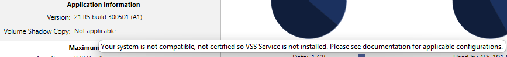

Windows 用4D Server には、Windows ボリュームシャドウコピーサービス(VSS) を通して送られたスナップショットリクエストを自動的に管理するための**VSS writer** アプリケーションが付属します。

VSS はWindows Server によって提供されている機能で、バックアップアプリケーションが、アプリケーションの実行中でも任意の瞬間にどんなファイル、あるいはハードディスク全体のスナップショット(シャドウコピー)をキャプチャーできるようにするためのものです。 このテクノロジーのおかげで、例えば4D Server のデータベースをそのスナップショットを取得した瞬間通りの状態へと戻すことができます。 この機構のためには、実行中のアプリケーションファイルがスナップショットが実行される間、一定の状態を保っている必要があります。 このため、VSS アウェアアプリケーション(VSS を利用するアプリケーション)はVSS ライターアプリケーションまたはサービスをインストールする必要があります。 このコンポーネントはシャドウコピーが作成されようとしている時にサービスによって"警告"され、**VSS requestor** (基本的にはバックアップアプリケーション)にどのようにファイルとデータのバックアップを取るべきかを指示します。

## バーチャライザーのための必要用件

ホスト側では、以下のVSS requestor がサポートされています:

- VMware ESXI (全プラットフォーム)
- Microsoft Hyper-V Server 2016

## VSSの有効化

VSS 機能は4D Server アプリケーションがローンチされたときに自動的にインストール/アップデートされます。 VSS writer アプリケーションサービスは、セッションユーザーが管理権限を持っている場合に開始されます。

一般的に、開始シナリオは以下の様な感じになります:

1. 4D Server あるいは 組み込みアプリサーバーが初めて起動される。
2. 管理者権限で起動されていない場合、警告アイコンが表示される。
3. アプリケーションを終了し、4D Server あるいは組み込みアプリケーションサーバーを管理者として再起動する。 その際4D VSS サービスが自動的に実行され、VSS に登録される。
4. (任意)4D Server あるいは組み込みアプリケーションを通常の権限を使用して再起動する。

The VSS writer executable is started as a service with the name "VSS \<appName\>". One VSS service will run for all 4D Server instances. One VSS service will run for each different engined application (different name) running on the machine (see below).

The [Monitor Page](../ServerWindow/monitor.md) of the 4D Server Administration window displays the status of VSS writer service, in Application information area:

Additional information about the Volume Shadow Copy status can be displayed in a tips when you hover the mouse over the area:

## About VSS Writer

The **vss_writer.exe** application is provided to handle Volume Shadow Copy Service (VSS) management for 4D applications.

:::note

The 4D VSS management is handled through a separate application since this program must run using administration privileges.

:::

The 4D VSS writer executable is automatically installed by 4D Server at first launch.

The 4D VSS Writer service handles and transfers VSS messages to 4D Server. These messages are logged in the 4D Server diagnostic log, and in the Windows event viewer.