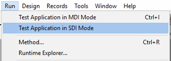

インターフェースページでは、プロジェクトインターフェースに関するさまざまな設定をおこないます。

## 一般

このエリアでは、表示に関する様々なオプションを設定します。

### MESSAGEコマンドで使用されるフォント

**選択...** をクリックして、 `MESSAGE` コマンドで使用される文字のフォントとサイズを設定します。

4D が実行されているプラットフォームによって、デフォルトのフォントとサイズは異なります。

> このプロパティは 4D の以下の部分にも影響します: <li>エクスプローラーの特定のプレビューエリア</li><li>フォームエディターのルーラー</li>

### ウィンドウの表示

他のオプションでは、アプリケーションモードでのさまざまなウィンドウの表示を設定します。

- **スプラッシュスクリーン**: このオプションが選択解除されていると、アプリケーションモードにおいて、[カレントメニューバーのスプラッシュスクリーン](Menus/bars.md#スプラッシュスクリーン) は表示されません。 このウィンドウを非表示にした場合、ウィンドウの表示は、たとえば `On Startup` データベースメソッドによってプログラムで管理しなければなりません。

- **フラッシュの進捗状況**: このオプションがチェックされていると、キャッシュデータがフラッシュされる際、4D は画面左下にウィンドウを表示します。 この処理はユーザー操作を一時的にブロックするため、ウィンドウを表示することでフラッシュがおこなわれていることをユーザーに通知することができます。

:::note

**設定 ＞ データベース ＞ メモリ** ページで [キャッシュフラッシュの周期](database.md#メモリページ) を設定できます。

:::

- **印刷の進捗状況**: 印刷時の印刷進捗状況を表示するダイアログを有効または無効にします。

- **WindowsでSDIモードを使用する**: このオプションが選択されていると、[対応している環境](../Menus/sdi.md#SDIモード利用条件) で組み込みアプリが実行された場合に、4D は自動で [SDIモード (Single-Document Interface)](../Menus/sdi.md) を有効にします。 このオプションを選択すると、Windows では、4D メニューバーの **実行** メニューからアプリケーションの実行モードが選択できます:

  

:::note

このオプションは macOS でも有効にできますが、同プラットフォーム上で実行の際には無視されます。

:::

### アピアランス

このメニューで、メインアプリケーションレベルにおいて使用するカラースキームを選択します。 カラースキームは、フォーム内で使用されるテキスト、背景、ウィンドウなどのインターフェースカラーのグローバルなセットを定義します。

> このオプションは macOS でのみ使用できます。 Windows上では、"Light" テーマが常に使用されます。

以下のスキームが利用可能です:

- **ライト**: アプリケーションはデフォルトのライトテーマを使用します。
- **ダーク**: アプリケーションはデフォルトのダークテーマを使用します。
- **継承する** (デフォルト): アプリケーションは次の優先レベル (例: OSユーザー設定) のテーマを継承します。

> デフォルトのテーマは CSS で管理可能です。 詳細については、[メディアクエリ](../FormEditor/createStylesheet.md#メディアクエリ) を参照してください。

メインアプリケーションスキームはデフォルトでフォームに適用されます。 その一方で、それを以下の方法で上書きすることもできます:

- ワーキングセッションレベルでは [SET APPLICATION COLOR SCHEME](https://doc.4d.com/4dv19R/help/command/ja/page1762.html) コマンドを使用できます。
- 各フォームレベル (最優先レベル) では、[カラースキーム](../FormEditor/propertiesForm.html#カラースキーム) プロパティを使用できます。 **注記**: 印刷時には、フォームは常に "ライト" スキームを使用します。

## ショートカット

ショートカットエリアでは、4D のデスクトップアプリケーションにおける 3つの基本のフォーム操作に使うデフォルトショートカットを確認し、変更することができます。 これらのショートカットは両プラットフォームで同じです。 キーの形をしたアイコンは、Windows と macOS の対応するキーの組み合わせを示します。

デフォルトのショートカットは以下のとおりです:

- 入力フォーム確定: **Enter**
- 入力フォームキャンセル: **Esc**
- サブフォームに追加: **Ctrl+Shift+/** (Windows) または **Command+Shift+/** (macOS)

操作のショートカットを変更するには、対応する **編集** ボタンをクリックします。 以下のダイアログボックスが表示されます:

ショートカットを変更するにはキーボードで新しいキーの組み合わせをタイプし、**OK** をクリックします。 ショートカットを無効にするには、**クリア** ボタンをクリックします。
