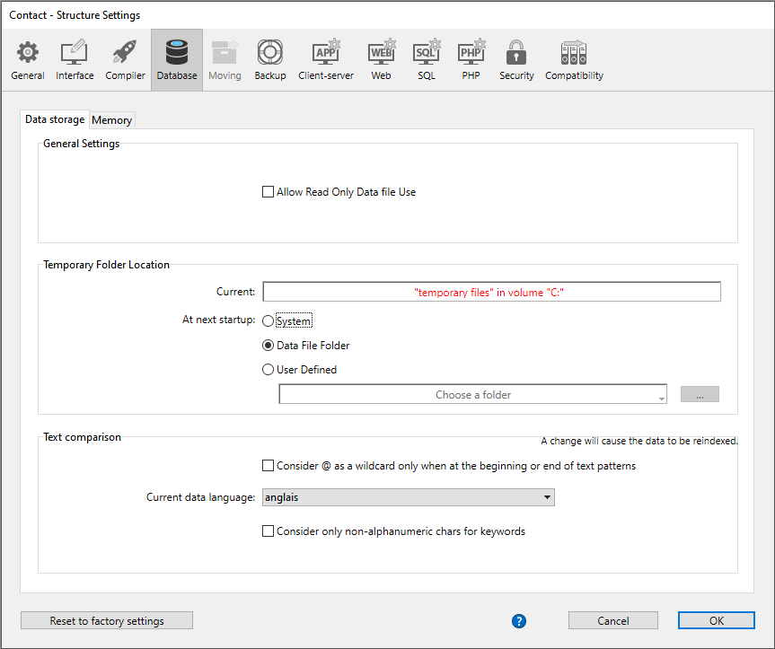

ストラクチャー設定では、カレントプロジェクトがどのように機能するかを設定します。 これらのパラメーターは、各プロジェクトごとに異なる設定を保存できます。 設定内容には待ち受けポート、バックアップ設定、セキュリティオプション、Webパラメーターなどが含まれます。

> 4D は、4D IDE (統合開発環境) アプリケーションに適用される、**環境設定** と呼ばれるもうひとつの設定グループを提供します。 詳細は [環境設定](../Preferences/general.md) を参照ください。

## ストラクチャー設定を開く

ストラクチャー設定ダイアログを開くには、以下のいずれかの手順をおこないます:

- **デザイン ＞ 設定...** メニューオプションを使用する
- 4Dツールバーの **設定** ボタンをクリックする
- 4D Server上では、**編集 ＞ 設定...** メニューオプションを使用する

[**ユーザー設定** モードが有効化されている](../Desktop/user-settings.md) 場合には、**設定...** は **ストラクチャー設定** に名称変更され、次の 2つのメニューコマンドが追加されます:

- **ユーザー設定...** は外部のユーザーファイルに保存される設定へのアクセスを提供します。 これらの設定が変更されていると、ストラクチャー設定の代わりに使用されます。
- **データファイル用のユーザー設定...** はカレントデータファイルに紐づいた外部のユーザーファイルに保存される設定へのアクセスを提供します。 これらの設定が変更されていると、ユーザー設定やストラクチャー設定の代わりに使用されます。

### ロック情報

プロジェクトモードおよびクライアント/サーバーモードの両方において、以下のような場合にロックは起こりえます:

- _settings.4DSettings_ ファイルが "読み取り専用" であるとき (プロジェクトモードのみ)。 この場合に設定を変更しようとすると、(それが可能である場合には) アンロックするためのアラートが表示されます。
- 2人以上のユーザーが同じ設定を同時に編集しようとしたとき。 最初のユーザーがウィンドウを閉じてロックを解除するまで、その設定は使用することができません。 (クライアント/サーバーモードのみ)

どちらのケースにおいても、設定は "読み取り専用" として開くことはできますが、ロックが解除されるまでは使用することができません。

## パラメーターのカスタマイズ

設定ダイアログボックスでは、変更された設定内容は **太字** で表示されます:

ダイアログボックスで直接変更されたか、変換されたプロジェクトの場合は以前変更された設定が、カスタマイズ箇所として扱われます。

パラメーターは手作業でデフォルト値に置き換えられたときにも太字で表示されます。 このように、カスタマイズされたパラメーターはすべて目視で識別することができます。

ほとんどの設定は即座に有効になります。 しかし、(起動時モードの設定など) いくつかはデータベースが再起動されたときに有効となります。 この場合、変更した設定が次回起動時から有効になることを知らせるダイアログボックスが表示されます。

## 設定のリセット

パラメーターをデフォルト値に戻し、カスタマイズされたことを示す太字スタイルを取り除くためには、**初期設定にリセット** をクリックします.

このボタンをクリックすると、現在表示されているページの全パラメーターがリセットされます。 現在のページで最低でも一つのパラメーターが変更されると、このボタンはアクティブになります。
