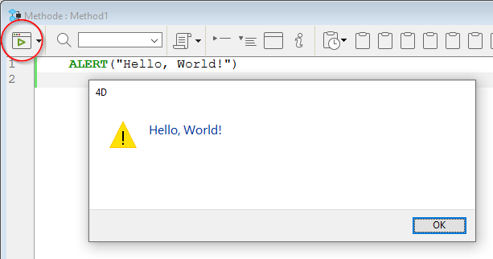

4D ランゲージを使用して "Hello, world!" メッセージを表示するには複数の方法があります。 一番簡単な方法はおそらく、プロジェクトメソッドにコードを1行、次のように書くやり方です:

```4d  
ALERT("Hello, World!")
```

このコードは、 "Hello, World!" メッセージが表示された、OK ボタンの付いたプラットフォームの標準的なアラートダイアログボックスを開きます。 コードを実行するには、メソッドエディターの左上にある実行ボタンをクリックします:



あるいは、フォーム内のボタンにこのコードを付けた場合、フォームを実行した状態でボタンをクリックすると、その都度アラートメッセージが表示されます。 いずれの方法でも、前述の1行のコードを実行するだけで目的達成です！

## 値の代入

変数、フィールド、配列要素などを対象に、データを格納したり、格納したデータを別の対象にコピーしたりすることができます。 変数にデータを格納することを、変数にデータを代入すると言い、代入演算子 (:=) を使っておこないます。 代入演算子はフィールドや配列要素に対してデータを代入する場合にも使います。

```4d
$MyNumber:=3 // MyNumber 変数に数値の3を代入します
[Products]Size:=$MyNumber // [Products]Size フィールドに MyNumber 変数の値を代入します
arrDays{2}:="Tuesday" // arrDays 配列の第二要素に文字列 "Tuesday" を代入します
MyVar:=Length("Acme") // MyVar 変数に関数の結果 (数値の4) を代入します
$myDate:=!2018/01/21! // 日付リテラルを代入します
$myHour:=?08:12:55? // 時間リテラルを代入します
```

代入演算 (:=) は必ず他の演算と区別しなければなりません。 代入演算子は、被演算子を組み合わせて新しい一つのものにするのではなく、演算子の右側の式の値を左側の変数やフィールドにコピーします。

**重要:** 代入演算子 (:=) と比較演算子 (=) とを混同しないように注意してください。 (=) とは異なる代入演算子が採用されたのは意図的なことで、他のプログラミング言語で (==) や (===) の使用によって度々起こる間違いを避けるためです。 このような間違いはコンパイラーにとっても発見しにくく、時間を消耗するトラブルシューティングのもとです。

## 変数

4D ランゲージは強い型付けの言語ですが、多くの場合に柔軟性も発揮します。 型付けのされた変数は `C_XXX` コマンドを使って作成します。 たとえば、日付型の変数を作成するには、次のように書くことができます:

```4d
C_DATE(MyDate) // MyDate 変数を日付型として宣言
```

推奨はされませんが、変数を使用することで作成することもできます。フィールドとは異なり、変数は必ずしも正式に宣言する必要はありません。 たとえば、今日の日付に 30日足した値を格納した変数が欲しい場合、次のように書くことができます:

```4d
MyOtherDate:=Current date+30
```

上のコードは "MyOtherDate に、現在の日付に 30日を加算した値を代入します" という意味です。 この1行で変数が作成され、変数に (仮の) データ型とデータが割り当てられます。 このように代入によって作成された変数はデータ型が規定されていないと解釈され、コードの違う行では別のデータ型の値を代入することもでき、その際にはデータ型を動的に変化させます。 `C_XXX` によって宣言された変数はデータ型を変化させることはできません。 コンパイルモードにおいては、その作成方法にかかわらず、変数のデータ型は変更できません。

## コマンド

4D コマンドとは、処理を実行するために 4D に組み込まれている命令文のことです。 すべての 4D コマンド、たとえば `CREATE RECORD` や `ALERT` などのコマンドはテーマ別に _4D ランゲージリファレンス_ に記載されています。 コマンドに引数を渡す場合は、コマンド名の後の括弧 () に引数を入れ、セミコロン (;) で区切ります。 例:

```4d
COPY DOCUMENT("folder1\\name1";"folder2\\" ; "new")
```

コレクションやオブジェクトにコマンドが属している場合、それらは名前付きメソッドであり、ドット記法を用いて使用します。 例:

```4d
$c:=New collection(1;2;3;4;5)
$nc:=$c.slice(0;3) //$nc=[1,2,3]  

$lastEmployee:=$employee.last()
```

4D プラグインや 4D コンポーネントを利用して、4D 開発環境に新しくコマンドを追加することもできます。

4D のユーザーコミュニティーや、サードパーティーデベロッパーによるプラグインが多数存在します。 たとえば, [4d-plugin-pdf-pages](https://github.com/miyako/4d-plugin-pdf-pages) プラグインを macOS で使用した場合は次のコードが書けます:

```4d
PDF REMOVE PAGE(path;page)
```

4D SVG はアプリケーションの機能を拡張するユーティリティコンポーネントの一例です:

```4d
// 図の描画
svgRef:=SVG_New
objectRef:=SVG_New_arc(svgRef;100;100;90;90;180)
```

4D SVG は 4D に含まれています。

## 定数

4D では多くの定義済定数が用意されており、それらの値は名前によってアクセスすることができます。 たとえば、`Read Mode` は定数で、その値は 2 です。 メソッドエディターにおいて、定義済定数はデフォルトで下線付きで表示されます。 定義済みの定数によって、より可読性の高いコードを書くことができます。

```4d
vRef:=Open document("PassFile";"TEXT";Read Mode) // ドキュメントを読み取り専用モードで開きます
```

## メソッド

4D が提供するたくさんのビルトインコマンドを使って、独自の **プロジェクトメソッド** を組み立てることができます。 プロジェクトメソッドとはユーザー定義のメソッドで、コマンドや演算子などの要素から成り立ちます。 プロジェクトメソッドは汎用性のあるメソッドですが、そうではない他の種類のメソッドも存在します: オブジェクトメソッド、フォームメソッド、テーブルメソッド (トリガー)、データベースメソッド。

メソッドは、一つ以上のステートメントで構成されます。ステートメントとは、メソッドの1行のことで1つの命令を実行します。 ステートメントは 1つの命令を実行し、単純な場合もあれば複雑な場合もあります。

たとえば、次のステートメントは確認ダイアログボックスを表示します:

```4d
CONFIRM("このアカウントを本当に閉じますか？";"はい";"いいえ")
```

メソッドは、テストとループの制御フローの実行を含みます。 `If...Else...End if` および `Case of...Else...End case` の分岐構造が使用できるほか、ループ構造としては `While...End while`、`Repeat...Until`、`For...End for`、そして `For each...End for each` が使用可能です:

テキスト変数 vtSomeText の文字を一つ一つループ処理します:

```4d
For($vlChar;1;Length(vtSomeText))
 // 文字がタブであれば
 If(Character code(vtSomeText[[$vlChar]])=Tab)
  // なんらかの処理をします
 End if
End for
```

プロジェクトメソッドは他のプロジェクトメソッドを呼び出すことができ、その際に引数を渡すことも可能です。 メソッドに引数を渡す場合は、メソッド名の後の括弧 () に引数を入れ、 セミコロン (;) で区切ります。 引数は受け取り側のメソッドにて、受け取り順に番号を振られたローカル変数 ($1, $2, ...$n) に格納されます。 メソッドの一つの値を戻り値とすることができ、$0 パラメーターを使います。 メソッドを呼び出すには、メソッド名を書きます:

```4d
$myText:="hello"
$myText:=Do_Something($myText) // Do_Something メソッドを呼び出します
ALERT($myText) //"HELLO"

  // Do_Something メソッドのコードです
$0:=Uppercase($1)
```

## データタイプ

4D ランゲージで扱うデータにはいくつかの種別があり、これらのデータ種別を "データタイプ" と呼びます。 基本のデータタイプ (文字、数値、日付、時間、ブール、ピクチャー、ポインター、配列) と混合型のデータタイプ (BLOB、オブジェクト、コレクション) があります。

データタイプのうち、文字タイプと数値タイプは、複数の類似するフィールドタイプに対応する点に注意してください。 これらのフィールドにデータが格納されるとき、4D ランゲージはフィールドタイプに合致するデータタイプへとデータを自動的に変換します。 反対に、たとえば整数フィールドのデータを呼び出すと、そのデータは自動的に数値タイプとして扱われます。 つまり、4D ランゲージを使用する際に、類似するフィールドタイプを厳密に区別する必要はありません。

しかし、プログラミングにおいて異なるデータタイプを混同しないようにすることは重要です。 "ABC" を日付フィールドに格納しても意味がないように、日付型の変数に "ABC" を格納することも意味がありません。 4D は、コードに書かれたことをできるだけ有効にしようとします。 たとえば、日付に数値を加算した場合は、日付に日数を加算したいものと認識します。しかし、日付に文字列を加算した場合には、4D はその操作が意味を持たないことを警告します。

あるタイプとして格納したデータを、別のタイプとして使用する場合があります。 4D ランゲージには、データタイプを変換するためのコマンドが用意されています。 たとえば、数値で始まり、"abc" 等の文字で終了する部品番号を作成する場合、 以下のように記述することができます:

```4d
[Products]Part_Number:=String(Number)+"abc"
```

数値変数 _Number_ の値が17であれば、_[Products]Part_Number_ に "17abc" という文字列が代入されます。

データタイプについては [データタイプ](Concepts/data-types.md) の節で詳しく説明しています。

## オブジェクトとコレクション

4D ランゲージのオブジェクトとコレクションは、オブジェクト記法を使用して値を代入・取得することができます。 例:

```4d
employee.name:="Smith"
```

大カッコ内と文字列の組み合わせを用いることもできます:

```4d
$vName:=employee["name"]
```

オブジェクトプロパティ値には、オブジェクトやコレクションも設定することが可能です。これらのサブプロパティにアクセスするため、オブジェクト記法では連続した字句を受け入れることができます:

```4d
$vAge:=employee.children[2].age
```

オブジェクトのプロパティ値が、メソッド (フォーミュラ) をカプセル化したオブジェクトである場合には、プロパティ名の後に括弧 ( ) をつけることで実行できます:

```
$f:=New object
$f.message:=New formula(ALERT("Hello world!"))
$f.message() // "Hello world!" を表示します
```

コレクションの要素にアクセスするためには、大カッコでくくった要素番号を渡します:

```4d
C_COLLECTION(myColl)
myColl:=New collection("A";"B";1;2;Current time)
myColl[3]  // コレクションの4番目の要素にアクセスします (0起点)
```

## 演算子

プログラミング言語を使用する際に、データのみを必要とする場合は非常に稀です。 データを加工、または何らかの目的のために使用することがほとんどです。 そういった計算は演算子を使っておこないます。 一般的に演算子とは、2つのデータをもとに処理をおこない、1つの新しいデータを生成します。 日常的に使用されている演算子も多くあります。 たとえば、1 + 2 という式は加算演算子 (プラス記号) を使用し、2つの数値を足し合わせて、3という結果を返します。 以下に、よく知られている 4つの演算子を示します:

| 演算子 | 演算       | 例題           |
| --- | -------- | ------------ |
| +   | 加算 (足し算) | 1 + 2 の結果は 3 |
| –   | 減算 (引き算) | 3 - 2 の結果は 1 |
| *   | 乗算 (かけ算) | 2 * 3 の結果は 6 |
| /   | 除算 (割り算) | 6 / 2 の結果は 3 |

数値演算子は、使用可能な演算子のうちの 1種にすぎません。 4Dは、数値・テキスト・日付・ピクチャー等、異なるタイプのデータを扱うために、各データタイプで演算を実行するための演算子を備えています。

対象のデータタイプによって、同じ記号が異なる処理に使用される場合があります。 例えば、データタイプによってプラス記号 (+) は下記のように異なる演算を実行します:

| データタイプ | 演算       | 例題                                                         |
| ------ | -------- | ---------------------------------------------------------- |
| 数値     | 加算 (足し算) | 1 + 2 は数値を加算し、結果は 3 です。                                    |
| 文字列    | 連結 (結合)  | "みなさん" + "こんにちは" は文字を連結 (結合) し、結果は "みなさんこんにちは" です。         |
| 日付と数値  | 日付の加算    | !2006/12/4!  + 20 は、2006年12月4日に 20日を加算し、結果は 2006年12月24日です。 |

## 式

式は、値を返します。 4D ランゲージでコードを書く際には、意識していなくても常に式を使用しています。 式は、"フォーミュラ" と呼ぶこともあります。

コマンド・演算子・変数・フィールド・オブジェクトプロパティ・コレクション要素等、複数のランゲージの要素を組み合わせて式は構成されます。 式により、ステートメント (メソッドの 1文や 1行) を構成します。 データが必要なとき、式が必要になります。

式が単独で使われることはほとんどありませんが、 単独で使用できる場合がいくつかあります :

- フォーミュラエディター (フォーミュラによるクエリや並べ替えなど)
- `EXECUTE FORMULA` コマンド
- フォームオブジェクトやウィジェットのデータソースとして
- デバッガー内で式の値を確認することができます
- クイックレポートエディターでカラムにフォーミュラを使用することができます

### 式のタイプ

生成する値のタイプによって、式のタイプを定義することができます。 式のタイプは複数あります。 様々なタイプの式の例を以下に示します。

| 式                           | 型           | 説明                                                                             |
| --------------------------- | ----------- | ------------------------------------------------------------------------------ |
| "こんにちは"                     | String      | これは文字列定数 "こんにちは" です。 文字列定数であることを表すために二重引用符が必要です。                               |
| "みなさん" + "こんにちは"            | String      | 2つの文字列 "みなさん" と "こんにちは" が + 演算子により結合され、 "みなさんこんにちは" を返します。                     |
| [People]Name + "様"          | String      | 2つの文字列の結合です。[People]Name フィールドと文字列 "様" が結合されます。 フィールドの値が "小林" の場合、"小林様" を返します。 |
| Uppercase ("smith")         | String      | この式は `Uppercase` コマンドを使用して、文字列 "smith" を英大文字に変換します。 そして "SMITH" を返します。         |
| 4                           | Number      | これは数値定数 4です。                                                                   |
| 4 * 2                       | Number      | 2つの数値、4 と 2 の乗算です。乗算演算子の (*) を使用しています。 数値の 8を返します。                             |
| myButton                    | Number      | これはボタンに紐づけられた変数です。 ボタンの現在の値を返します: クリックされた場合に 1、それ以外は 0 を返します。                  |
| !06/12/24! または !2006/12/24! | Date        | この式は日付定数で 2006年12月24日を表します。                                                    |
| Current date + 30           | Date        | これは日付の計算です。`Current date` コマンドは現在の日付を返します。 現在の日付に 30日を加えた日付を返します。              |
| ?8:05:30?                   | Time        | これは時間定数で、8時5分30秒を表します。                                                         |
| ?2:03:04? + ?1:02:03?       | Time        | 2つの時間の足し算をおこない、3時5分7秒を返します。                                                    |
| true                        | Boolean     | このコマンドはブール値の true (真) を返します。                                                   |
| 10 # 20                     | Boolean     | これは 2つの数値の論理比較です。 #記号は、"等しくない" を表します。 10と20は "等しくない" ため、この式は true (真) を返します。   |
| "ABC" = "XYZ"               | Boolean     | これは文字列の論理比較です。 文字列は等しくないため、式は FALSE (偽) を返します。                                 |
| My Picture + 50             | ピクチャー       | この式は My Picture 変数に入っているピクチャーを右に 50ピクセル移動したピクチャーを返します。                         |
| ->[People]Name              | Pointer     | この式は [People]Name フィールドへのポインターを返します。                                           |
| Table (1)                   | Pointer     | このコマンドは一番目に定義されたテーブルへのポインターを返します。                                              |
| JSON Parse (MyString)       | オブジェクト      | このコマンドは MyString が適切なフォーマットであれば、オブジェクトとして返します。                                 |
| JSON Parse (MyJSONArray)    | Collection  | このコマンドは MyJSONArray が適切なフォーマットであれば、コレクションとして返します。                              |
| Form.pageNumber             | オブジェクトプロパティ | オブジェクトプロパティは式として、サポートされているいずれのタイプでもありえます。                                      |
| Col[5]                      | コレクション要素    | コレクション要素は式として、サポートされているいずれのタイプでもありえます。                                         |
| $entitySel[0]               | エンティティ      | ORDA のエンティティセレクションの要素である、エンティティを返します。 これは **代入不可の式** です。                       |

### 代入可 vs 代入不可の式

式は、数値の4や"Hello" の文字列のようなリテラル定数であったり、`$myButton` のような変数であったりします。 式には演算子も含められます。 たとえば、4 + 2 という式は加算演算子を使って二つの数値を加算し、結果の 6 を返します。 リテラル定数や演算子を使った式は **代入不可の式**で、式に値を代入することはできません。 **代入可能な式** も存在します。 代入演算子の左側に使えるものが、代入可能な式です。 例:

```4d  
// 変数 $myVar は代入可能です:  
$myVar:="Hello" // $myVar に "Hello" を代入します
//Form.pageNumber は代入可能です:  
Form.pageNumber:=10 // Form.pageNumber に 10 を代入します
//Form.pageTotal-Form.pageNumber は代入不可です:
Form.pageTotal- Form.pageNumber:=10 // 代入不可のため、エラー
```

このように、リテラル定数ではなくても、演算子を使っている式は代入不可です。 たとえば、`[Person]FirstName+" "+[Person]LastName` は代入不可です。

## ポインター

ポインターは、プログラミングにおいてデータを参照するための高度な方法です。 4D ではテーブル、フィールド、変数、配列、配列要素を参照するためにポインターを使用することができます。

対象へのポインターは、その対象の前にポインター記号 (->) を付けることで取得することができます。反対にポインターから対象を取得するには、ポインター名の後にポインター記号をつけます:

```4d
MyVar:="Hello"
MyPointer:=->MyVar
ALERT(MyPointer->)
```

## コメント

コメントとは、コード内の実行されないテキストのことです。 これらのテキストは、コード実行時にインタープリターによって無視されます。

コメントの書き方は2通りあります:

- `//` 記号の後はすべてコメントとして扱われるため、これを使って1行のコメントが書けます
- `/*コメント*/` の表記方法でインラインコメント、または複数行にまたがるコメントが書けます

これらの書き方は同時に使用できます。

#### シングルラインコメント (//)

コードの後や行の最初に `//` を使うと、その後のテキストはすべてコメントとなります。 例:

```4d
// これはコメントです
For($vCounter;1;100) // ループを開始します
  // コメント
  // コメント
  // コメント
 End for
```

#### インライン、およびマルチラインコメント (/**/)

コメントを `/*` と `*/` で囲むと、そのあいだのテキストはコメントとなります。 この方法でインラインおよびマルチラインコメントが書けます:

- **インラインコメント** の 例:

```4d
For /* インラインコメント */ ($vCounter;1;100)
 ...
End for
```

- **マルチラインコメント** は複数行にわたるコメントのことです。 この形式のコメントは入れ子にすることができ、4D コードエディターではこれを展開したり折りたたんだりすることができます。 例:

```4d
For ($vCounter;1;100)
/*
コメント  
 /* 
 詳細なコメント
 */
*/
...
End for
```
