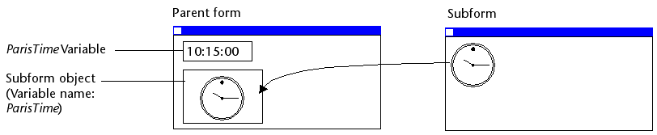
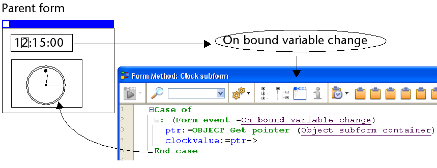
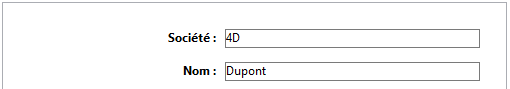

## 概要

サブフォームとは、他のフォームに組み込まれるフォームのことです。

### 用語

サブフォームに実装されたコンセプトを明確に説明するために、いくつかの用語についてここで定義します:

* **サブフォーム**: 他のフォームに組み込まれることを意図したフォーム。
* **親フォーム**: 1つ以上のサブフォームを含むフォーム。
* **サブフォームコンテナー**: 親フォームに組み込まれた、サブフォームのインスタンスを表示するオブジェクト。
* **サブフォームインスタンス**: 親フォームに表示されたサブフォームの実体。 このコンセプトはとても重要です。親フォームには、同じサブフォームのインスタンスを複数表示することができるからです。
* **リストフォーム**: データをリストとして表示するサブフォームインスタンス。
* **詳細フォーム**: リストサブフォームをダブルクリックすることでアクセスすることができる、ページタイプの入力フォーム。

## リストサブフォーム

リストサブフォームを使うことで、他のテーブルのデータを入力、表示、および更新することができます。 通常は 1対Nリレーションが設定されたデータベースでリストサブフォームを使用します。 リレートされた 1テーブルのフォーム上のリストサブフォームでは、リレートされた Nテーブルのデータを入力・表示・更新します。 一つのフォーム上に、それぞれ異なるテーブルに属する複数のサブフォームを配置できます。 しかし、フォームの同じページ上には、同じテーブルに属するサブフォームを複数配置することはできません。

たとえば、連絡先管理データベースでは、ある連絡先のすべての電話番号を表示するためにリストサブフォームが使用されるでしょう。 連絡先テーブルの画面に電話番号が表示されますが、情報はリレートテーブルに格納されています。 1対Nリレーションを使用することで、このデータベース設計は連絡先ごとに複数の電話番号を簡単に格納できるようになっています。 自動リレーションにより、リレートされている Nテーブルへのデータ入力がプログラムなしで直接おこなうことができます。

リストサブフォームは通常 Nテーブルに結び付けられますが、それだけでなく他の任意のデータベーステーブルのレコードをサブフォームのインスタンスに表示することもできます。

また、ユーザーがリストサブフォームに直接データを入力するようにもできます。 サブフォームの設定に基づき、ユーザーがサブレコード上でダブルクリックするか、サブレコードを追加/編集するコマンドを使用すると、詳細フォームが表示されます。

> 4Dはサブレコードを管理する基本的なニーズに応える 3つの標準アクション `editSubrecord` (サブレコード編集)、`deleteSubrecord` (サブレコード削除) および `addSubrecord` (サブレコード追加) を提供しています。 フォームに複数のサブフォームインスタンスが含まれる場合、フォーカスを持っているサブフォームにアクションが適用されます。

## ページサブフォーム

ページサブフォームは、カレントサブレコードのデータや、コンテキストに基づく関連する値 (変数やピクチャーなど) を表示できます。 ページサブフォームを使用する利点の一つは、それらが高度な機能を提供したり、親フォームと相互作用したりできることです (ウィジェット)。 ページサブフォームには専用のプロパティやイベントがあり、プログラムから完全に制御することができます。

ページサブフォームは [詳細フォーム](properties_Subform.md#詳細フォーム) プロパティで指定された入力フォームを使用します。 リストサブフォームと異なり、使用されるフォームは親フォームと同じテーブルに所属していてもかまいません。 また、プロジェクトフォームを使用することもできます。 実行時、ページサブフォームは入力フォームと同じ標準の表示特性を持ちます。

> 4Dウィジェットは、ページサブフォームに基づいた定義済みの複合オブジェクトです。 詳細は専用のドキュメント [4D Widgets (ウィジェット)](https://doc.4d.com/4Dv18/4D/18/4D-Widgets.100-4690706.ja.html) を参照してください。

### バインドされた変数の管理

サブフォームにバインドされた [変数](properties_Object.md#変数あるいは式) を使用して 2つのコンテキスト (親フォームとサブフォーム) をリンクし、洗練されたインターフェースを作成することができます。 たとえば、動的な時計を提供するサブフォームを置くとします。このサブフォームが置かれる親フォームには入力可の時間型変数が置かれています:



両オブジェクト (時間変数とサブフォームコンテナー) には *同じ変数名* が割り当てられています。 この場合、親フォームを開いたとき、4Dは自動で両方の値を同期化します。 変数の値が複数の場所で設定されている場合、4Dは最後にロードされた値を使用します。 以下のロード順が適用されます:<br /> 1 - サブフォームのオブジェクトメソッド<br /> 2 - サブフォームのフォームメソッド<br /> 3 - 親フォームのオブジェクトメソッド<br /> 4 - 親フォームのフォームメソッド

親フォームが実行されるとき、開発者は適切なフォームイベントを使用して変数の同期を処理しなければなりません。 2タイプの相互作用 (親フォーム → サブフォーム、サブフォーム → 親フォーム) が可能です。

#### サブフォームの内容の更新

ケース1: 親フォームの変数の値が更新され、この更新をサブフォームに反映させる必要があります。 この例では ParisTime 変数の値がユーザー入力、あるいは動的に (たとえば `Current time` コマンドで) 12:15:00 に変更されました。

この場合には、`On bound variable change` フォームイベントを使用します。 このイベントは、サブフォームプロパティ内で選択されていなければなりません。このイベントはサブフォームのフォームメソッドで生成されます。



`On Bound Variable Change` フォームイベントは以下のときに生成されます:

* 親フォームの変数に値が割り当てられたとき (同じ値が再代入された場合でも) で、
* サブフォームが 0ページまたはカレントフォームページに置かれているとき。

先の例のとおり、直接変数名を使用するのではなく、サブフォームコンテナーへのポインターを返す `OBJECT Get pointer` コマンドの利用が推奨されます。親フォームに同じサブフォームを複数配置することが可能だからです (たとえば、複数のタイムゾーンを表示するために時計を複数表示するウィンドウ)。 この場合ポインターを使用することでのみ、どのサブフォームコンテナーがイベントの生成元かを知ることができます。

#### 親フォームの内容の更新

ケース2: サブフォームの内容が更新され、その更新を親フォームに反映させる必要があります。 この例では、ユーザーが時計の針を手動で動かすことができるようなサブフォームを使ったケースです。

この場合、サブフォームから、親サブフォームコンテナーの変数にオブジェクトの値を割り当てなければなりません。 先の例の通り、`OBJECT Get pointer` コマンドを `Object subform container` セレクターとともに使用し、サブフォームコンテナーのポインターを得る方法が推奨されます。

変数に値を割り当てると、親サブフォームコンテナーのオブジェクトメソッドで `On Data Change` フォームイベントが生成され、メソッドによるアクションを実行できます。 このイベントは、サブフォームコンテナーのプロパティリストで選択されていなければなりません。


> 時計の針を手動で動かすと、サブフォーム中の *clockValue* 変数のオブジェクトメソッドで `On Data Change` フォームイベントが生成されます。

### サブフォームにバインドされたオブジェクトの使用

4Dは自動的にオブジェクト (`C_OBJECT`) をそれぞれのサブフォームとバインドします。 このオブジェクトの中身はサブフォームのコンテキストから読み書き可能なため、ローカルなコンテキストにおいて値を共有することができます。

オブジェクトは自動的に作成することもできますし、明示的に命名しオブジェクトとして型指定された場合には、親コンテナーの変数として使用できます (以下参照)。 いずれの場合にも、オブジェクトは `Form` コマンドによって返され、サブフォームから直接呼び出すことが可能です (ポインターの使用は不要です)。 オブジェクトは常に参照によって渡されるため、ユーザーがサブフォーム内でプロパティ値を変更した場合には、その値は自動的にオブジェクト自身に保存されます。

たとえば、サブフォームにおいて異なる言語での表示を可能にするために、バインドされたオブジェクトにフィールドラベルが保存されている場合を考えます:


*InvoiceAddress* オブジェクトに値を割り当てることで、サブフォームのラベルを変更することができます:

```4d
 C_OBJECT($lang)
 $lang:=New object
 If(<>lang="fr")
    $lang.CompanyName:="Société :"
    $lang.LastName:="Nom :"
 Else
    $lang.CompanyName:="Company:"
    $lang.LastName:="Name:"
 End if
 InvoiceAddress.Label:=$lang
```



### 高度なフォーム間通信プログラム

親フォームとサブフォームインスタンス間の通信では、バインドした変数を通して値を交換する以上のことをおこなう必要がある場合があります。 実際、親フォームでおこなわれたアクションに基づきサブフォーム中の変数を更新したり、その逆の処理をしたい場合があるでしょう。 先の "動的な時計" タイプのサブフォームの例で言えば、各時計ごとにアラーム時刻を複数設定したい場合が考えられます。

このようなニーズにこたえるため、4Dは以下のメカニズムを実装しています:

* `OBJECT Get name` コマンドで "subform" 引数を使用してサブフォームオブジェクトを指定し、`OBJECT Get pointer` コマンドを使用する、
* `CALL SUBFORM CONTAINER` コマンドを使用してサブフォームからコンテナーオブジェクトを呼び出す、
* `EXECUTE METHOD IN SUBFORM` コマンドを使用してサブフォームのコンテキストでメソッドを実行する。

#### Object get pointer と Object get name コマンド

`OBJECT Get pointer` コマンドは `Object subform container` セレクターを使う方法以外にも、第二引数に指定した名前を持つオブジェクトを検索する際に、どのサブフォーム内を検索するかを指定するための引数を渡す方法でも利用できます。 このシンタックスは `Object named` セレクターが渡された場合のみ使用できます。

たとえば、以下の式は:

```4d
 $ptr:=OBJECT Get pointer(Object named;"MyButton";"MySubForm")
```

"MySubForm" サブフォームオブジェクト中の "MyButton" オブジェクトに割り当てられた変数へのポインターを返します。 このシンタックスを使用すれば、親フォームからサブフォーム内のオブジェクトにアクセスできます。 また、`OBJECT Get name` コマンドを使用すればフォーカスを持つオブジェクトの名前を取得できます。

#### CALL SUBFORM CONTAINER コマンド

`CALL SUBFORM CONTAINER` コマンドを使用すると、サブフォームインスタンスからサブフォームコンテナーオブジェクトにイベントを送信できます。その結果、親フォームのコンテキストで処理が可能となります。 イベントはコンテナーオブジェクトメソッドで受信されます。 (クリックやドラッグ＆ドロップなど) サブフォームにより検知されたすべてのイベントの発生元となりえます。

送信するイベントコードに制限はありません (たとえば 20000 や -100 など)。 既存のイベントに対応するコード (たとえば `On Validate` に対応する 3) を使用することも、カスタムコードを使用することもできます。 前者のケースでは、サブフォームコンテナーのプロパティリストでチェックを入れたイベントのみを使用できます。 後者の場合、使用するコードは既存のフォームイベントに対応してはいけません。 将来の 4Dバージョンで番号が衝突しないようにするために、負数の使用が推奨されます。

詳細は `CALL SUBFORM CONTAINER` コマンドの説明を参照してください。

#### EXECUTE METHOD IN SUBFORM コマンド

`EXECUTE METHOD IN SUBFORM` コマンドを使用すると、親フォームやそのオブジェクトから、サブフォームインスタンスのコンテキストにおけるメソッド実行をリクエストできます。これにより、サブフォームの変数やオブジェクト等にアクセスすることができます。 このメソッドは引数も受け取れます。

このメカニズムを図示すると以下のようになります:


詳細は `EXECUTE METHOD IN SUBFORM` コマンドの説明を参照してください。

#### GOTO OBJECT コマンド

`GOTO OBJECT` はサブフォームから実行されても、親フォーム内にて目的のオブジェクトを検索します。

## プロパティ一覧

[タイプ](properties_Object.md#タイプ) - [オブジェクト名](properties_Object.md#オブジェクト名) - [変数あるいは式](properties_Object.md#変数あるいは式) - [式の型](properties_Object.md#式の型) - [CSSクラス](properties_Object.md#cssクラス) - [ソース](properties_Subform.md#ソース) - [リストフォーム ](properties_Subform.md#リストフォーム) - [詳細フォーム](properties_Subform.md#詳細フォーム) - [選択モード](properties_Subform.md#選択モード) - [リスト更新可](properties_Subform.md#リスト更新可) - [行をダブルクリック](properties_Subform.md#行をダブルクリック) - [空行をダブルクリック](properties_Subform.md#空行をダブルクリック) - [左](properties_CoordinatesAndSizing.md#左) - [上](properties_CoordinatesAndSizing.md#上) - [右](properties_CoordinatesAndSizing.md#右) - [下](properties_CoordinatesAndSizing.md#下) - [幅](properties_CoordinatesAndSizing.md#幅) - [高さ](properties_CoordinatesAndSizing.md#高さ) - [横方向サイズ変更](properties_ResizingOptions.md#横方向サイズ変更) - [縦方向サイズ変更](properties_ResizingOptions.md#縦方向サイズ変更) - [フォーカス可](properties_Entry.md#フォーカス可) - [表示状態](properties_Display.md#表示状態) - [フォーカスの四角を隠す](properties_Appearance.md#フォーカスの四角を隠す) - [横スクロールバー](properties_Appearance.md#横スクロールバー) - [縦スクロールバー](properties_Appearance.md#縦スクロールバー) - [境界線スタイル](properties_BackgroundAndBorder.md#境界線スタイル) - [印刷時可変](properties_Print.md#印刷時可変) - [メソッド](properties_Action.md#メソッド)
