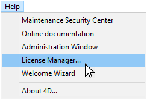
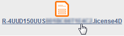
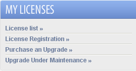

Welcome to 4D! You will find below all necessary information about how to install and register your 4D application.

## Required configuration

Refer to the [product download page](https://us.4d.com/product-download) on the 4D web site for minimum Mac / Windows configuration for your 4D series.

All the details are available on the [Resources page](https://us.4d.com/resources/feature-release) of the 4D Web site.

## Installation on disk

4D products are installed from the 4D Web site:

1. Using your browser, connect to the 4D Web site and go to the [Downloads](https://us.4d.com/product-download/Feature-Release) page.
2. Click on the download link that corresponds to your product and follow the instructions displayed on screen.

## Activation of a product

Once installed on your disk, you must activate your 4D products in order to be able to use them. You also need to activate any additional licenses you obtain.

No activation is required for the following uses:

- 4D used in remote mode (connection to a 4D Server)
- 4D used in local mode with an interpreted database with no access to the Design environment.

**Important:** You must have an Internet connection and an e-mail account in order to activate your products.

### Activate 4D

1. Launch the 4D application.
2. Select the **License Manager...** command from the **Help** menu.

The **License Manager** dialog box is displayed (Instant Activation page is selected by default). See the following section.

> When you open/create a local interpreted application with 4D Developer Edition, an auto-activation mechanism is implemented. In this case, a dialog box informs you that you are going to be connected to our customer database and that your licenses will be activated (you will need to enter the password for your 4D account).

### Activate 4D Server

1. Launch the 4D Server application. The dialog box for choosing the [activation mode](#activation-mode) appears.

## 4D Activation mode

4D offers three activation modes. We recommend **Instant Activation**.

### Instant Activation

Enter your user ID (email or 4D account) as well as your password. If you do not have an existing user account, you will need to create it at the following address:

[https://account.4d.com/us/login.shtml](https://account.4d.com/us/login.shtml)

Then enter the license number of the product you want to activate. This number is provided by email or by mail after a product is purchased.

### Deferred Activation

If you are unable to use [instant activation](#instant-activation) because your computer does not have internet access, please proceed to deferred activation using the following steps.

1. In the License Manager window, select the **Deferred Activation** tab.
2. Enter the License Number and your e-mail address, then click **Generate file** to create the ID file (*reg.txt*).

3. Save the *reg.txt* file to a USB drive and take it to a computer that has internet access.
4. On the machine with internet access, login to [https://activation.4d.com](https://activation.4d.com).
5. On the Web page, click on the **Choose File...** button and select the *reg.txt* file from steps 3 and 4; then click on the **Activate** button.
6. Download the serial file(s).

7. Save the *license4d* file(s) on a shared media and transfer them back to the 4D machine from step 1.
8. Now back on the machine with 4D, still on the **Deferred Activation** page, click **Next**; then click the **Load...** button and select a *license4d* file from the shared media from step 7.

With the license file loaded, click on **Next**.

9. Click on the **Add N°** button to add another license. Repeat these steps until all licenses from step 6 have been integrated.

Your 4D application is now activated.

### Emergency Activation

This mode can be used for a special temporary activation of 4D (5 days maximum) without connecting to the 4D Web site. This activation can only be used one time.

## Adding licenses

You can add new licenses, for example to extend the capacities of your application, at any time.

Choose the **License Manager...** command from the **Help** menu of the 4D or 4D Server application, then click on the **Refresh** button:

This button connects you to our customer database and automatically activates any new or updated licenses related to the current license (the current license is displayed in **bold** in the "Active Licenses" list). You will just be prompted for your user account and password.

- If you purchased additional expansions for a 4D Server, you do not need to enter any license number -- just click **Refresh**.
- At the first activation of a 4D Server, you just need to enter the server number and all the purchased expansions are automatically assigned.

You can use the **Refresh** button in the following contexts:

- When you have purchased an additional expansion and want to activate it,
- When you need to update an expired temporary number (Partners or evolutions).

## 4D Online Store

In 4D Store, you can order, upgrade, extend, and/or manage 4D products. You can reach the store at the following address: [https://store.4d.com/us/](https://store.4d.com/us/) (you will need to select your country).

Click **Login** to sign in using your existing account or **New Account** to create a new one, then follow the on-screen instructions.

### License Management

After you log in, you can click on **License list** at the top right of the page:

Here you can manage your licenses by assigning them to projects.

Select the appropriate license from the list then click **Link to a project... >**:

You can either select an existing project or create a new one:

You can use projects to organize your licenses according to your needs:

## Troubleshooting

If the installation or activation process fails, please check the following table, which gives the most common causes of malfunctioning:

| Symptoms                                                      | Possible causes                                            | Solution(s)                                                                                                                                     |
| ------------------------------------------------------------- | ---------------------------------------------------------- | ----------------------------------------------------------------------------------------------------------------------------------------------- |
| Impossible to download product from 4D Internet site          | Internet site unavailable, antivirus application, firewall | 1- Try again later OR 2- Temporarily disable your antivirus application or your firewall.                                                       |
| Impossible to install product on disk (installation refused). | Insufficient user access rights                            | Open a session with access rights allowing you to install applications (administrator access)                                                   |
| Failure of on-line activation                                 | Antivirus application, firewall, proxy                     | 1- Temporarily disable your antivirus application or your firewall OR 2- Use deferred activation (not available with licenses for "R" versions) |

If this information does not help you resolve your problem, please contact 4D or your local distributor.

## Contacts

For any questions about the installation or activation of your product, please contact 4D, Inc. or your local distributor.

For the US:

- Web: [https://us.4d.com/4d-technical-support](https://us.4d.com/4d-technical-support)
- Telephone: 1-408-557-4600

For the UK:

- Web: [https://uk.4d.com/4d-technical-support](https://uk.4d.com/4d-technical-support)
- Telephone: 01625 536178

Find the 4D developer community on line here: [https://discuss.4d.com](https://discuss.4d.com).
