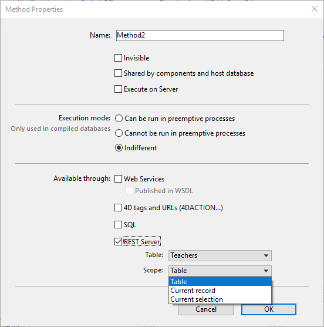

エンティティやセンティティセレクション、データクラスのメソッドを利用するにあたって、RESTリクエスト内にデータクラス名を直接使用することができます。

## 使用可能なシンタックス

| シンタックス                                                                                 | 例題                          | 説明                                                              |
| -------------------------------------------------------------------------------------- | --------------------------- | --------------------------------------------------------------- |
| [**\{dataClass\}**](#dataclass)                                                      | `/Employee`                 | データクラスの全データ (デフォルトでは先頭の 100エンティティ) を返します                        |
| [**\{dataClass\}(\{key\})**](#dataclasskey)                                        | `/Employee(22)`             | データクラスのプライマリーキーによって特定されるエンティティのデータを返します                         |
| [**\{dataClass\}:\{attribute\}(value)**](#dataclassattributevalue)                 | `/Employee:firstName(John)` | 指定した属性値を持つ 1件のエンティティのデータを返します                                   |
| [**\{dataClass\}/\{method\}**](#dataclassmethod-and-dataclasskeymethod)            | `/Employee/getHighSalaries` | プロジェクトメソッドを実行し、オブジェクトまたはコレクションを返します (プロジェクトメソッドは公開されている必要があります) |
| [**\{dataClass\}(\{key\})/\{method\}**](#dataclassmethod-and-dataclasskeymethod) | `/Employee(22)/getAge`      | エンティティメソッドに基づいて値を返します                                           |

## \{dataClass\}

特定のデータクラス (*例:* `Company`) の全データ (デフォルトでは先頭の 100エンティティ) を返します。

### 説明

RESTリクエストにこのパラメーターのみを渡すと、([`$top/$limit`]($top_$limit.md) を使って指定しない限り) デフォルトで先頭の 100件のエンティティが返されます。

返されるデータの説明です:

| プロパティ         | 型          | 説明                                                                                         |
| ------------- | ---------- | ------------------------------------------------------------------------------------------ |
| __entityModel | Text       | データクラスの名称。                                                                                 |
| __COUNT       | Number     | データクラスに含まれる全エンティティ数                                                                        |
| __SENT        | Number     | RESTリクエストが返すエンティティの数。 総エンティティ数が `$top/$limit` で指定された数より少なければ、総エンティティの数になります。               |
| __FIRST       | Number     | セレクションの先頭エンティティの番号。 デフォルトでは 0; または `$skip` で指定された値。                                        |
| __ENTITIES    | Collection | エンティティ毎にその属性をすべて格納したオブジェクトのコレクションです。 リレーション属性は、リレーション先の情報を取得するための URI を格納したオブジェクトとして返されます。 |

各エンティティには次のプロパティが含まれます:

| プロパティ       | 型      | 説明                                                 |
| ----------- | ------ | -------------------------------------------------- |
| __KEY       | Text   | データクラスにおいて定義されているプライマリーキーの値                        |
| __TIMESTAMP | Date   | エンティティが最後に編集された日時を記録するタイムスタンプ                      |
| __STAMP     | Number | `$method=update` を使ってエンティティの属性値を更新するときに必要となる内部スタンプ |

取得する属性を指定するには、次のシンタックスを使っておこないます: [{attribute1, attribute2, ...}](manData.md#取得する属性の選択)。 例:

 `GET  /rest/Company/name,address`

### 例題

特定のデータクラスの全データを取得します。

 `GET  /rest/Company`

**結果**:

````
{
    "__entityModel": "Company",
    "__GlobalStamp": 51,
    "__COUNT": 250,
    "__SENT": 100,
    "__FIRST": 0,
    "__ENTITIES": [
        {
            "__KEY": "1",
            "__TIMESTAMP": "2020-04-10T10:44:49.927Z",
            "__STAMP": 1,
            "ID": 1,
            "name": "Adobe",
            "address": null,
            "city": "San Jose",
            "country": "USA",
            "revenues": 500000,
            "staff": {
                "__deferred": {
                    "uri": "http://127.0.0.1:8081/rest/Company(1)/staff?$expand=staff"
                }
            }
        },
        {
            "__KEY": "2",
            "__TIMESTAMP": "2018-04-25T14:42:18.351Z",
            "__STAMP": 1,
            "ID": 2,
            "name": "Apple",
            "address": null,
            "city": "Cupertino",
            "country": "USA",
            "revenues": 890000,
            "staff": {
                "__deferred": {
                    "uri": "http://127.0.0.1:8081/rest/Company(2)/staff?$expand=staff"
                }
            }
        },
        {
            "__KEY": "3",
            "__TIMESTAMP": "2018-04-23T09:03:49.021Z",
            "__STAMP": 2,
            "ID": 3,
            "name": "4D",
            "address": null,
            "city": "Clichy",
            "country": "France",
            "revenues": 700000,
            "staff": {
                "__deferred": {
                    "uri": "http://127.0.0.1:8081/rest/Company(3)/staff?$expand=staff"
                }
            }
        },
        {
            "__KEY": "4",
            "__TIMESTAMP": "2018-03-28T14:38:07.430Z",
            "__STAMP": 1,
            "ID": 4,
            "name": "Microsoft",
            "address": null,
            "city": "Seattle",
            "country": "USA",
            "revenues": 650000,
            "staff": {
                "__deferred": {
                    "uri": "http://127.0.0.1:8081/rest/Company(4)/staff?$expand=staff"
                }
            }
        }
.....//more entities here 
    ]
}
````

## \{dataClass\}(\{key\})

データクラスのプライマリーキーによって特定されるエンティティのデータを返します (*例*: `Company(22) または Company("IT0911AB2200")` など)。

### 説明

データクラスとキーを渡すことで、公開されているエンティティの情報を取得することができます。 キー (key) は、データクラスに定義されているプライマリーキーの値です。 プライマリーキーの定義についての詳細は、デザインリファレンスマニュアルの **[主キーを設定、削除する](https://doc.4d.com/4Dv18/4D/18/Table-properties.300-4575566.ja.html#1282230)** を参照ください。


取得する属性を指定するには、次のシンタックスを使っておこないます: [{attribute1, attribute2, ...}](manData.md#取得する属性の選択)。 例:

 `GET  /rest/Company(1)/name,address`

`$expand` を使ってリレーション属性を展開するには、次のように指示します:

 `GET  /rest/Company(1)/name,address,staff?$expand=staff`

### 例題

次のリクエストは、Company データクラスで主キーが 1 であるエンティティの公開データをすべて返します。

 `GET  /rest/Company(1)`

**結果**:

````
{
    "__entityModel": "Company",
    "__KEY": "1",
    "__TIMESTAMP": "2020-04-10T10:44:49.927Z",
    "__STAMP": 2,
    "ID": 1,
    "name": "Apple",
    "address": Infinite Loop,
    "city": "Cupertino",
    "country": "USA",
    "url": http://www.apple.com,
    "revenues": 500000,
    "staff": {
        "__deferred": {
            "uri": "http://127.0.0.1:8081/rest/Company(1)/staff?$expand=staff"
        }
    }
}
````

## \{dataClass\}:\{attribute\}(value)

指定した属性値を持つ 1件のエンティティのデータを返します

### 説明

*dataClass* に加えて *attribute (属性)* および *value (値)*を渡すことで、当該エンティティの公開データをすべて取得できます。 指定する値は、その属性において一意のものですが、主キーではありません。

 `GET  /rest/Company:companyCode(Acme001)`

取得する属性を指定するには、次のシンタックスを使っておこないます: [{attribute1, attribute2, ...}](manData.md#取得する属性の選択)。 例:

 `GET  /rest/Company:companyCode(Acme001)/name,address`

[$attributes]($attributes.md) を使ってリレーション属性を使用するには、次のように指示します:

 `GET  /rest/Company:companyCode(Acme001)?$attributes=name,address,staff.name`

### 例題

次のリクエストは、名前が "Jones" である社員 (Employee) の公開データをすべて返します。

 `GET  /rest/Employee:lastname(Jones)`

## \{dataClass\}/\{method\} と \{dataClass\}(\{key\})/\{method\}

プロジェクトメソッドに基づいて、オブジェクトまたはコレクションを返します.

### 説明

プロジェクトメソッドは、データクラス (テーブル) またはエンティティ (レコード) を介して呼び出され、オブジェクトまたはコレクションを返さねばなりません。

`POST  /rest/Employee/getHighSalaries`

`POST  /rest/Employee(52)/getFullName`

### 4D の設定

RESTリクエストによってメソッドを呼び出せるようにするには:

- そのメソッドプロパティの "公開オプション" で RESTサーバーが選択されていなければなりません。
- そのメソッドのマスターテーブルとスコープが定義されている必要があります:
  - **テーブル**: メソッドコールを介する 4D テーブル (データクラス)。 このテーブルも [RESTリソースとして公開](configuration.md#テーブルやフィールドの公開) されている必要があります。
  - **スコープ**: メソッドがクラシックな 4Dランゲージを使用しており、サーバーサイドにおいてデータベースのコンテキストが必要な場合に、この設定が適用されます。
    - **テーブル** - テーブル (データクラス) 全体に対して適用されるメソッドの場合
    - **カレントレコード** - `\{dataClass\}(key)/\{method\}` シンタックスを使って、カレントレコード (エンティティ) に対して適用されるメソッドの場合
    - **カレントセレクション** - カレントセレクションに対して適応されるメソッドの場合



### メソッドへの引数の渡し方

POST を使って、メソッドに引数を渡すことができます。

`POST  /rest/Employee/addEmployee`

POSTリクエストの本文にデータを含めます。たとえば:

["John","Smith"]

### 例題

#### テーブルスコープ

`getAverage` メソッドをコールします:

- マスターテーブルは [Employee]
- スコープは **テーブル**

```4d
 // getAverage メソッド  
ALL RECORDS([Employee])
$0:=New object("ageAverage";Average([Employee]age))
```

`POST  /rest/Employee/getAverage`

結果:

```
{
    "result": {
        "ageAverage": 44.125
    }
}
```

#### カレントレコードスコープ

`getFullName` メソッドをコールします:

- マスターテーブルは [Employee]
- スコープは **カレントレコード**

```4d
 // getFullName メソッド  
$0:=New object("fullName";[Employee]firstname+" "+[Employee]lastname)
```

`POST  /rest/Employee(3)/getFullName`

結果:

```
{
    "result": {
        "fullName": "John Smith"
    }
}
```

#### カレントセレクションスコープ

`updateSalary` メソッドをコールします:

- マスターテーブルは [Employee]
- スコープは **カレントセレクション**

```4d
 // updateSalary メソッド  
C_REAL($1;$vCount)
READ WRITE([Employee])
$vCount:=0
FIRST RECORD([Employee])
While (Not(End selection([Employee]))  
 [Employee]salary:=[Employee]salary * $1
    SAVE RECORD([Employee])
    $vCount:=$vCount+1
    NEXT RECORD([Employee])
End while 
UNLOAD RECORD([Employee])
$0:=New object("updates";$vCount)
```

`POST  /rest/Employee/updateSalary/?$filter="salary<1500"`

POST data (in the request body): [1.5]

結果:

```
{
    "result": {
        "updated": 42
    }
}
```
