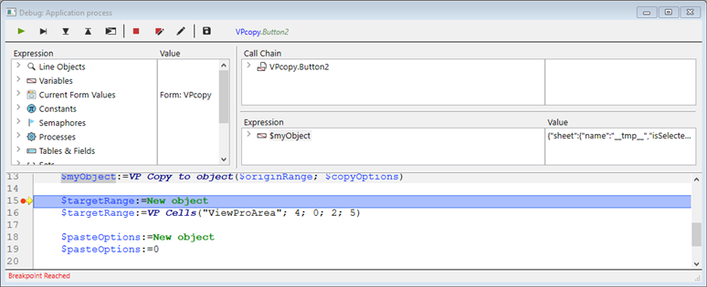
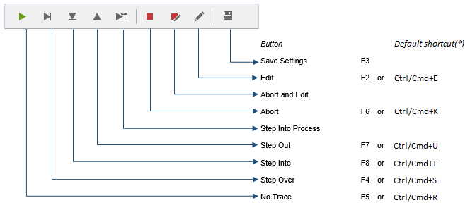
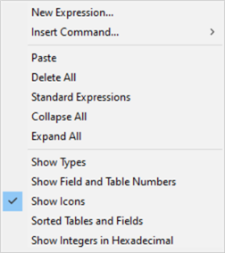
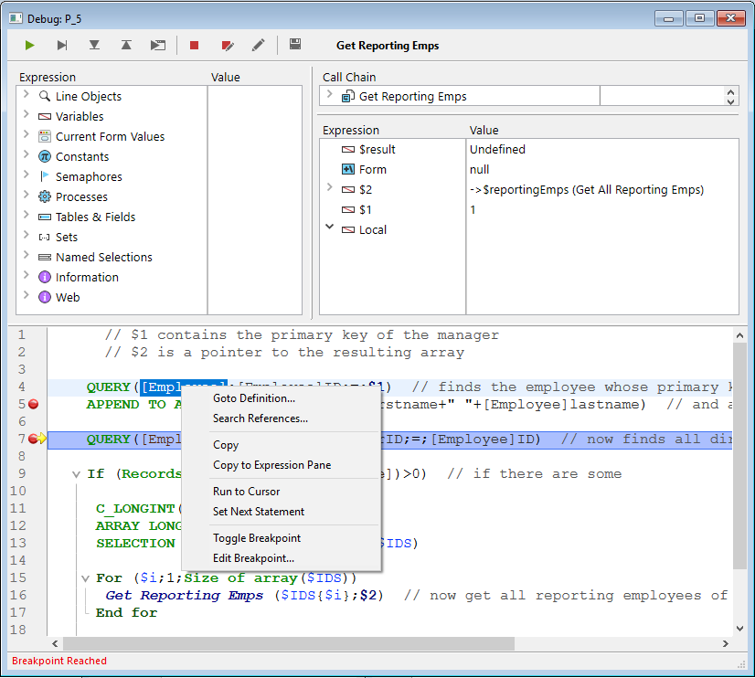

デバッガーは、エラーを発見したり、メソッドの実行を監視する必要がある場合に便利です。 デバッガーを使って、コードをステップごとにゆっくり確認して情報を検証することができます。 このようにメソッドをステップごとに確認する処理はトレースと呼ばれます。



## デバッガーの呼び出し

デバッガーを開くには、次のような方法があります:

* [シンタックスエラーウィンドウ](basics.md#シンタックスエラーウィンドウ) で **トレース** ボタンをクリックする。
* [`TRACE`](https://doc.4d.com/4dv19/help/command/ja/page157.html) コマンドを使用する。
* メソッド実行ウィンドウで **デバッグ** ボタンをクリックする、またはコードエディターで **実行してデバッグ** ボタンを選択する。
* メソッド実行中に **Alt+Shift+右クリック** (Windows) または **Ctrl+Option+Cmd+クリック** (Macintosh) をおこない、表示されるポップアップウィンドウ内でトレースするプロセスを選択する:


* ランタイムエクスプローラーのプロセスページにてプロセスを選択した後、**トレース** ボタンをクリックする。
* コードエディターウィンドウ、またはランタイムエクスプローラーのブレークおよびキャッチページでブレークポイントを作成する。

デバッガーウィンドウは、現在トレースしているメソッドまたはクラス関数の名前や、デバッガーが表示される原因となったアクションの情報を表示します。 上のウィンドウの例では、次の情報が表示されています:

* 現在トレースされているメソッドは *Clients_BuildLogo* メソッドです。
* デバッガーウィンドウが表示されているのは、キャッチコマンドの対象に設定された `C_PICTURE` コマンドへの呼び出しが検出されたためです。

新しいデバッガーウィンドウの表示には、同じセッション内で表示された最後のデバッガーウィンドウと同じ構成 (ウィンドウのサイズと位置、分割線の配置および式評価エリアの内容) を使用します。 複数のユーザープロセスを実行した場合には、それぞれのプロセスを個別にトレースできます。 つまり、各プロセスにつき 1つのデバッガーウィンドウを表示できます。

デバッガーウィンドウは、一般的にそのコードが実行されているマシン上に表示されます。 シングルユーザー版アプリケーションの場合、デバッガーは常にアプリケーションを実行しているマシン上に表示されます。 クライアント/サーバー版アプリケーションの場合は:

* ローカルで実行されているコードの場合には、リモート4D 上に表示されます。
* サーバー上で実行されているコード (**サーバー上で実行** オプションがつけられたメソッド) の場合には、サーバーマシン上に表示されます。

> ヘッドレスモードで実行中のサーバーでは、デバッガーウィンドウを表示することはできません。 この場合はリモートデバッガーを使用する必要があります。 [リモートマシンからのデバッグ](./debugging-remote.md) 参照。

## ツールバーボタン

デバッガーウィンドウの上部にある実行制御ツールバーには、デフォルトショートカットが設定された複数のボタンがあります:



> デフォルトのショートカットは、環境設定ダイアログボックスのショートカットページで変更できます。

#### トレース終了

トレースが停止され、通常のメソッド実行が再開されます。

> **Shift** + **F5** または **Shift** を押しながら **トレース終了** ボタンをクリックすると、実行が再開されます。 この操作により、以降のカレントプロセスでの全ての TRACE 呼び出しが無効になります。

#### 次行に進む

現在のメソッド行 (プログラムカウンターと呼ばれる黄色い矢印で示されている行) が実行されます。 その後、デバッガは次の行に移動します。

"次の行に進む" ボタンは、サブルーチンや関数に移動することはなく、現在トレースの対象となっているメソッドのレベルにとどまります。 呼び出されるサブルーチンや関数もトレースしたい場合には、**呼び出しメソッドもトレース** ボタンを使用します。

リモートデバッグにおいて、メソッドがサーバー上で実行されていた場合には、メソッドの最後の行の実行後にその親メソッドが呼ばれます。 その時、親メソッドがリモート側で実行されていた場合には、このボタンは **トレース終了** ボタンと同じように振る舞います。

#### 呼び出しメソッドもトレース

別のメソッド (サブルーチンまたは関数) を呼び出す行が実行される時にこのボタンを使用すると、呼び出されたメソッドがデバッガーウィンドウに表示され、ステップ実行できます。

デバッガーウィンドウの [呼び出し連鎖エリア](#呼び出し連鎖エリア) では、新しく呼び出されたメソッドがカレント (一番上) となります。

別のメソッドを呼び出していない行が実行される場合には、このボタンは **次行に進む** ボタンと同じように振る舞います。

#### 中断

メソッドは中断され、メソッドの実行を開始する前の状態に戻ります。

* イベントに対して実行しているフォームメソッドまたはオブジェクトメソッドをトレースしている場合には、いずれの場合にも停止され、フォームに戻ります。
* アプリケーションモードから実行しているメソッドをトレースしていた場合には、停止後そのモードに戻ります。

#### 中断＆編集

メソッドは中断されます。 コードエディターウィンドウが開いて、**中断＆編集** ボタンがクリックされた時点で実行していたメソッドを表示します。
> **Tip**: このボタンは、コードにどのような変更が必要かが明らかであり、メソッドのテストを続行するためにその変更が必要な場合に使用してください。 変更が完了したら、メソッドを再実行できます。

#### 編集

メソッドは中断されます。 コードエディターウィンドウが開いて、編集ボタンがクリックされた時点で実行していたメソッドを表示します。

このボタンをクリックしてメソッドを編集した場合には、現在の実行は中断されないため、編集内容の反映は次回実行時になります。

> **Tip**: このボタンは、コードに必要な変更内容がわかっている場合で、その変更がコードの残り部分の実行やトレースの妨げにならない場合に使用します。

#### 設定保存

現在のデバッガウィンドウの構成を、デフォルト構成として保存します。 構成には次の内容が含まれます:

* ウィンドウのサイズと位置
* 分割線の配置および式評価エリアの内容

これらは、プロジェクト内に保存されます。

このアクションはリモートデバッグモードでは利用できません ([リモートマシンからのデバッグ](debugging-remote.md) 参照)。

## ウォッチエリア

**ウォッチエリア** は実行コントロールツールバーの下、デバッグウィンドウの左上隅に表示されます。 次に例を示します:


> このエリアはリモートデバッグモードでは使用できません。

**ウォッチエリア** には、システム、4D環境、および実行環境について役立つ一般情報が表示されます。

**式** 欄には、要素や式の名前が表示されます。 **値** 欄には、要素や式に対応する現在の値が表示されます。 エリア右側の値をクリックすると、その値が変更可能な場合には、要素の値を修正できます。

テーマ、テーマサブリスト (あれば)、テーマ項目は、いつでも [カスタムウォッチエリア](#カスタムウォッチエリア) にドラッグ＆ドロップすることができます。

### 式リスト

#### ラインオブジェクト

このテーマには、次のような要素や式の値が表示されます:

* 実行されるコードの行 (プログラムカウンターにより、[ソースコードエリア](#ソースコードエリア) 内で黄色の矢印でマークされている行) で使用されている。
* コードの前の行で使用されている。

コードの前の行とは実行直後の行であるため、ラインオブジェクトテーマでは、その行が実行される前または後の現在の行の要素や式が表示されます。  たとえば、次のメソッドを実行した場合を想定します:

```4d
TRACE
$a:=1
$b:=$a+1
$c:=$a+$b
```

1. ソースコードエリアのプログラムカウンターが `$a:=1` の行にセットされた状態で、デバッグウィンドウが開きます。 この時点では **ラインオブジェクト** テーマには、次のように表示されています:

    | $a | 未定義 |
    | -- | --- |
    |    |     |

    まだ初期化されていない変数 `$a` が表示されているのは、実行の対象となっている行で使用されているためです。

2. **次行に進む** ボタンをクリックします。 プログラムカウンターは `$b:=$a+1` の行に設定されます。 この時点では、ラインオブジェクトテーマに次のように表示されます:

    | $a | 1   |
    | -- | --- |
    | $b | 未定義 |

    変数 `$a` の値は 1 になりました。 まだ初期化されていない変数 `$b` が表示されているのは、実行の対象となっている行で使用されているためです。

3. **次行に進む** ボタンをクリックします。 プログラムカウンターは `$c:=$a+$b` の行に設定されます。 この時点では、ラインオブジェクトテーマに次のように表示されます:

    | $c | 未定義 |
    | -- | --- |
    | $a | 1   |
    | $b | 2   |

    変数 `$b` の値が 2 になりました。 まだ初期化されていない変数 `$c` が表示されているのは、実行の対象となっている行で使用されているためです。

#### 変数

このテーマは、次のサブテーマから構成されます:

| サブテーマ    | 説明                                       | 値は編集可能？ |
| -------- | ---------------------------------------- | ------- |
| インタープロセス | この時点で使用されているインタープロセス変数のリスト               | ◯       |
| プロセス     | カレントプロセスで使用されているプロセス変数のリスト               | ◯       |
| ローカル     | 現在トレースしているメソッドで使用されているローカル変数のリスト         | ◯       |
| 引数       | メソッドが受け取った引数のリスト                         | ◯       |
| Self     | オブジェクトメソッドをトレースしている場合には、現在のオブジェクトへのポインター | ×       |

他の変数と同様に、配列はそのスコープによって、インタープロセス、プロセス、およびローカルサブテーマに表示されます。 デバッガーは要素ゼロと最初の 100要素を表示します。 **値** 欄で配列要素の値を変更することは可能ですが、配列のサイズを修正することはできません。

変数の型や内部名を表示するには、右クリックしてコンテキストメニューを開き、**型を表示** にチェックを入れます:


このようになります:


#### カレントフォーム値

このテーマには、カレントフォームに含まれる各動的オブジェクトの名前に加えて、そこに関連付けられている値が表示されます:


リストボックス配列などの一部のオブジェクトは、二つの異なる項目として表示されることがあります (オブジェクト自身の変数と、そのデータソース)。

#### 定数

エクスプローラーウィンドウの定数ページのように、4D が提供する定義済み定数を表示します。 このテーマの式を修正することはできません。

#### セマフォー

現在設定されているローカルセマフォーのリストを表示します。 各セマフォーの値欄には、自身を設定したプロセスの名前が表示されます。 このテーマの式を修正することはできません。 グローバルセマフォーは表示されません。

#### プロセス

作業セッションを開始してから起動されたプロセスのリストを表示します。 値欄には、各プロセスの現在の状態 (実行中、一時停止等) および使用した時間が表示されます。 このテーマの式を修正することはできません。

#### テーブルとフィールド

4Dデータベースのテーブルやフィールドのリストを表示します。 各テーブル項目について、カレントプロセスにおけるカレントセクションのサイズは勿論、**ロックされたレコード** のナンバーも値欄に表示されます。

各フィールド項目については、カレントレコードのフィールドの値 (ピクチャーと BLOB は除く) が値欄に表示されます。 フィールドの値を修正することはできますが、テーブル情報を修正することはできません。

#### セット

カレント (トレース中の) プロセスで定義されているセットとインタープロセスセットのリストを表示します。 各セットについて、レコード数とテーブル名が値欄に表示されます。 このテーマの式を修正することはできません。

#### 命名セレクション

カレント (トレース中の) プロセスで定義されている命名セレクションとインタープロセス命名セレクションのリストを表示します。 各命名セレクションについて、レコード数とテーブル名が値欄に表示されます。 このテーマの式を修正することはできません。

#### 情報

このテーマは、データベースのオペレーションに関わる一般的な情報を表示します。 カレントのデフォルトテーブル (あれば)、物理メモリ、仮想メモリ、空きメモリ、使用中メモリ、クエリ格納先、などです。

#### Web

このテーマは、アプリケーションの メインWebサーバーに関する情報が表示されます (Webサーバーが起動している場合のみ):

* 送信するWebファイル: 送信待機中の Webファイルの名前 (あれば)
* Webキャッシュ利用: Webキャッシュ内のページ数と、使用率
* Webサーバー起動時間: Webサーバーの起動時間 ("時間:分:秒" 形式)
* Webヒット回数: Webサーバー起動以降に受信した HTTPリクエストの総数と、1秒毎の受信数
* 動作中のWebプロセス数: アクティブな Webプロセスの数と、全Webプロセスの数

このテーマの式を修正することはできません。

### コンテキストメニュー

ウォッチエリアのコンテキストメニューでは、追加オプションが提供されています。


* **すべて閉じる**: ウォッチエリアの階層リストの全レベルを縮小します。
* **すべて拡げる**: ウォッチエリアの階層リストの全レベルを展開します。
* **型を表示**: 各項目のデータ型を (適切な場合に) 表示します。
* **フィールド/テーブル番号を表示**: テーブルおよびフィールドの番号を表示します。 テーブル番号やフィールド番号を用いて作業している場合、または `Table` や `Field` コマンドを使用し、ポインターを用いて作業している場合、このオプションは非常に便利です。
* **アイコンを表示**: 各項目のタイプを示すアイコンを表示します。 表示速度を速くするために、このオプションをオフにすることもできます。
* **テーブル/フィールドをソート**: テーブルおよびフィールドをそれぞれアルファベット順に並べ替えます。
* **数値を16進で表示**: 通常、数値は 10進法で表示されます。 このオプションを使用すると、数値が 16進法表記で表示されます。 注: 数値を 16進法で入力するには、0x (ゼロの後にx) とタイプし、その後に 16進数を続けます。
* **アクティビティモニターを有効にする**: 動作のモニタリング (アプリケーション内部の詳細チェック) を有効にし、追加テーマ (**スケジューラー**、**ネットワーク**) に情報を表示します。

## 呼び出し連鎖エリア

1つのメソッドから他のメソッドまたはクラス関数が呼び出される場合があります。 このエリアは、この呼び出し連鎖のリストを表示します。


それぞれのメインレベルの項目は、メソッドまたはクラス関数の名前です。 最も上にある項目は、現在トレース中のメソッド、次の項目は呼び出し元 (トレース中メソッドを呼び出したメソッドまたはクラス関数)、その次の項目は呼び出し元の呼び出し元、のように続きます。

上図の例では:

* `thirdMethod` は引数を受け取っていません。
* `$0` は現在未定義です。 これは、メソッドが `$0` に値を割り当てていないためです (メソッドがこの割り当てをまだ実行していないか、メソッドが関数ではなくサブルーチンなことが原因です)。
* `secondMethod` は `firstMethod` から 3つの引数を受け取っています:
  * $1 は `[Employee]` テーブルへのポインター
  * $2 は `[Employee]` テーブルの `ID` フィールドへのポインター
  * $3 は値が "Z" の英数字の引数です。

呼び出し連鎖エリアのメソッド名をダブルクリックすると、そのソースコードが[ソースコードエリア](#ソースコードエリア) に表示されます。

メソッドまたは関数名の隣にあるアイコンをクリックすると、引数および戻り値のリストが展開または縮小されます。 値はエリアの右側に表示されます。 右の値をクリックすると、引数や戻り値の値を変更することができます。

コンテキストメニュー内の **型を表示** を選択することで、引数のデータ型を表示することができます:


メソッドの引数リストが展開されていれば、引数や戻り値を [カスタムウォッチエリア](#カスタムウォッチエリア) にドラッグ＆ドロップすることができます。

呼び出しチェーンは [Get call chain](https://doc.4d.com/4dv19/help/command/ja/page1662.html) コマンドを使って取得することもできます。

## カスタムウォッチエリア

カスタムウォッチエリアは、式を評価するために使用します。 [ウォッチエリア](#ウォッチエリア) と似ていますが、ここでは任意の式を表示することができます。 どのようなタイプの式でも評価できます:

* フィールド
* 変数
* ポインター
* 演算
* 4Dコマンド
* メソッド
* ほか値を返すものなら何でも


テキスト形式で表示できる式であれば、どのような式でも評価することができます。 ピクチャーや BLOBフィールドおよび変数は表示できません。 BLOB の内容を表示するには、[BLOB to text](https://doc.4d.com/4dv19/help/command/ja/page555.html) のような BLOBコマンドを使用してください。

### 新しい式の挿入

リストに式を追加する方法は複数あります:

* ウォッチエリアまたは呼び出し連鎖エリアから項目や式をドラッグ＆ドロップします。
* [ソースコードエリア](#ソースコードエリア) で式を選択し、**ctrl+D**  (Windows) または **cmd+D** (macOS) を押します。
* カスタムウォッチエリアの空スペースのどこかをダブルクリックします (プレースホルダー名を持つ編集可能な式が追加されます)。

値を返すフォーミュラであれば、なんでも追加できます。

式を編集するには、その式をクリックして選択し、再びクリックすると (または**Enter**キーを押す) 編集モードになります。

式を削除するには、その式をクリックして選択し、**Backspace** または **Delete**キーを押します。
> **警告**: システム変数 (たとえば OK変数) の値を変更するような 4D式を評価する場合、その後のメソッド実行に影響することに注意してください。

### コンテキストメニュー

カスタムウォッチエリアのコンテキストメニューを使って、4D のフォーミュラエディターにアクセスできます:



**新しい式...**: 新しい式を挿入し、4D のフォーミュラエディターを表示します。


フォーミュラエディターに関する詳細は、<a href="https://doc.4d.com/4Dv19/4D/19/4D-Design-Reference.100-5416591.en.html" target="_blank">4D Design Reference マニュアル</a> を参照してください。

* **コマンド挿入...**: 4Dコマンドを新しい式として挿入するためのショートカット。
* **すべて削除**: 現在カスタムウォッチエリアに表示されている式をすべて削除します。
* **標準式**: ウォッチエリアの式リストをコピーします。

> このオプションはリモートデバッグモードでは利用できません ([リモートマシンからのデバッグ](debugging-remote.md) 参照)。

* **すべて閉じる/すべて拡げる**: 階層リストの全レベルを縮小/展開します。
* **型を表示**: リストの各項目のデータ型を (適切な場合に) 表示します。
* **フィールド/テーブル番号を表示**: テーブルおよびフィールドの番号を表示します。 テーブル番号やフィールド番号を用いて作業している場合、または `Table` や `Field` コマンドを使用し、ポインターを用いて作業している場合、このオプションは非常に便利です。
* **アイコンを表示**: 各項目のタイプを示すアイコンを表示します。
* **テーブル/フィールドをソート**: テーブルおよびフィールドをそれぞれアルファベット順に並べ替えます。
* **数値を16進で表示**: 数値がを16進法表記で表示します。 数値を 16進法で入力するには、0x (ゼロの後にx) とタイプし、その後に 16進数を続けます。

## ソースコードエリア

ソースコードエリアには、トレース中のメソッドや関数のソースコードが表示されます。

このエリアでは、[**ブレークポイント**](breakpoints.md) の追加や削除も可能です。

### Tips

式の上にマウスカーソルを移動すると、Tipsとして次の内容が表示されます:

* 宣言された式の型
* 式のカレント値


これはセレクションの場合も機能します:


### カスタムウォッチエリアへの式の追加

ソースコードエリアで選択した式は [カスタムウォッチエリア](#カスタムウォッチエリア) にコピーすることができます。

1. ソースコードエリア内で評価する式を選択します。
2. 次のいずれかの方法をおこないます:
    * 選択したテキストをカスタムウォッチエリアの式欄へドラッグ＆ドロップする。
    * **Ctrl+D** (Windows) または **Cmd+D** (macOS) を押す。
    * 選択したテキストを右クリックして、コンテキストメニューから **式ペインにコピー** コマンドを選択する。

### プログラムカウンター

ソースコードエリアの左マージンにある黄色の矢印は、プログラムカウンターと呼ばれます。 これは、実行される次の行を表しています。

デフォルトでは、プログラムカウンター行 (実行行とも呼ばれます) がデバッガー内でハイライトされています。 [環境設定のメソッドページ](Preferences/methods.md) において、ハイライトカラーをカスタマイズすることができます。

#### プログラムカウンターの移動

デバッグのために、呼び出し連鎖のトップにあるメソッド (実行中のメソッド) のプログラムカウンターの位置を変更することができます。 これには、黄色の矢印をクリックして目的の行まで上下にドラッグします。

これは、その位置からのトレースや実行を追跡するようにデバッガーに指示しているに過ぎません。 カウンターの移動そのものはコードを実行したり、実行をキャンセルしたりしません。 すべての現在の設定内容、フィールド、変数などに影響はありません。

例:

```4d
  // ...
 If(This condition)
    DO_SOMETHING
 Else
    DO_SOMETHING_ELSE
 End if
  // ...
```

行 `If (This condition)` にプログラムカウンターが設定されているとします。 **次行に進む** ボタンをクリックすると、プログラムカウンターが行 `DO SOMETHING ELSE` に直接移動します。 しかし、今回トレースしたかったのは `DO_SOMETHING` 行のコードでした。 このような場合、プログラムカウンターをその行に移動して実行することができます。

### コンテキストメニュー

ソースコードエリア のコンテキストメニューを使って、トレースモードでメソッドを実行する際に便利な機能にアクセスできます:



* **定義に移動...**: 選択された要素の定義に移動します。 このコマンドは以下の要素に使用できます:
  * *プロジェクトメソッド*: 新しいコードエディターウィンドウにメソッドの内容を表示します。
  * *フィールド*: ストラクチャーウィンドウのインスペクターにフィールドプロパティを表示します。
  * *テーブル*: ストラクチャーウィンドウのインスペクターにテーブルプロパティを表示します。
  * *フォーム*: フォームエディターにフォームを表示します。
  * *変数* (ローカル、プロセス、インタープロセス、$n 引数): カレントメソッド内の宣言行を表示、または変数が宣言されたコンパイラーメソッドを表示します。
* **参照を検索...** (コードエディターでも利用可能): 現在の要素が参照されているすべてのメソッドとフォームを検索します。 現在の要素とは、選択されているものまたはカーソルが置かれているものをいいます。 これにはフィールド、変数、コマンド、文字列等が含まれます。 検索結果は、標準の検索結果ウィンドウに表示されます。
* **コピー**: 選択された式が標準のペーストボードへとコピーされます。
* **式ペインにコピー**: 選択された式をカスタムウォッチエリアにコピーします。
* **カーソルまで実行**: プログラムカウンターと選択行の間のコードを実行します。
* **次のステートメントを設定**: 現在の行および途中の行を実行せずに、プログラムカウンターを選択行まで移動します。 選択行は、ユーザーが実行ボタンのいずれかをクリックした際に実行されます。
* **ブレークポイントをトグル** (コードエディターでも利用可能): 選択行のブレークポイントの有無を切り替えます。 これによりメソッドエディターのブレークポイントの有無も切り替わります。
* **ブレークポイントを編集...** (コードエディターでも利用可能): ブレークポイントプロパティダイアログボックスを表示します。 ここでおこなわれた変更はメソッドエディターにも反映されます。

### 次/前を検索

専用のショートカットを使用することで選択された文字列を検索することができます:

* 文字列と一致する次の箇所を検索するには、**Ctrl+E** (Windows) または **Cmd+E** (macOS) を使用します。
* 文字列と一致する前の箇所を検索するには、**Ctrl+Shift+E** (Windows) または **Cmd+Shift+E** (macOS) を使用します。

この検索は、ソースコードエリアにて少なくとも 1文字以上を選択している場合に実行されます。

## ショートカット

この節ではデバッグウィンドウで　利用可能なショートカットをリストしています。

> 実行制御ツールバーにも [ショートカット](#ツールバーボタン) が設定されています。

#### ウォッチエリア & カスタムウォッチエリア

* ウォッチエリア内の項目を **ダブルクリック** すると、その項目がカスタムウォッチエリアにコピーされます。
* カスタムウォッチエリア内で **ダブルクリック** すると、新しい式を作成できます。

#### ソースコードエリア

* 左マージンをクリックすると、ブレークポイントが設定・削除されます。
* **Alt+Shift+クリック** (Windows) または **Option+Shift+クリック** (macOS) により、一時的ブレークポイントが設定されます。
* **Alt+クリック** (Windows) または **Option+クリック** (macOS) により、ブレーク編集ウィンドウが表示されます。
* 選択された式や要素をドラック＆ドロップして、カスタムウォッチエリアにコピーできます。
* **Ctrl+D** (Windows) または **Command+D** (macOS) キーを押すことで、カスタムウォッチエリアに選択テキストがコピーされます。
* **Ctrl+E** (Windows) または **Cmd+E** (macOS) を押すと、選択文字列に一致する次の箇所を検索します。
* **Ctrl+Shift+E** (Windows) または **Cmd+Shift+E** (macOS) を押すと、選択文字列に一致する前の箇所を検索します。

#### すべてのエリア

* **Ctrl** + **+/-** (Windows) または **Command** + **+/-** (macOS) を押すと、可読性を向上させるためにフォントサイズが拡大/縮小します。 変更されたフォントサイズはコードエディターにも適用され、環境設定に保存されます。
* **Ctrl + \*** (Windows) または **Command + \*** (macOS) を押すと、ウォッチエリアが強制的に更新されます。
* 全エリアでいずれの項目も選択されていない場合に **Enter**キーを押すと、1行ずつ進みます。
* 項目の値が選択されている場合には、矢印キーでリスト内を移動します。
* 項目を編集中の場合には、矢印キーでカーソルが移動します。 Ctrl-A/X/C/V (Windows) または Command-A/X/C/V (macOS) を、編集メニューのすべてを選択/切り取り/コピー/貼り付けコマンドへのショートカットとして使用できます。
