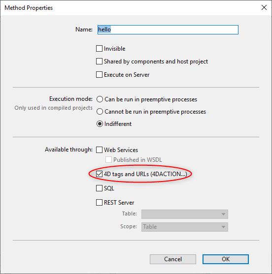

この章は、データベースのデータを扱う 4D Webサイトをゼロから作成する方法を知りたい、初心者ユーザーを対象としています。 さあ、始めましょう！


## Hello World 例題

まずは、Webサーバーからブラウザーに向けて "Hello World" を送信するところから始めましょう。 もっとも簡単な方法は、プロジェクトを作成して Webサーバーを開始し、`On Web Connection` データベースメソッドにテキストを返す短いコードを書くことです。

### Webサーバーの開始

4D Webサーバーを開始するには:

1. 4Dアプリケーションを起動し、新規プロジェクトを作成します。
2. 上部の **実行** メニューから、**Webサーバー開始** を選択します。

これだけです。 Webサーバーが開始します (メニュー項目が **Webサーバー停止** に変わったのが確認できます)。 これでリクエストを処理できるようになりました。 確認のため、デフォルトホームページを表示してみましょう。

### デフォルトホームページの表示

4D Webサーバーは、Projectフォルダーと同じ階層に作成されたデフォルトの `WebFolder` ルートフォルダーに、デフォルトの `index.html` ページを自動的に作成します。

1. Webブラウザーを起動し、Webサーバーの IPアドレス (4D Webサーバーのデフォルト httpポートは 80) に接続します。 Webサーバーとブラウザーが同じマシンにある場合は、**実行** メニューから **Webサーバーテスト** を選択します。

デフォルトのホームページが表示されます:


### Hello World の表示

1. エクスプローラーを開いてデータベースメソッドの一覧を表示し、`On Web Connection` をダブルクリックします。

2. 次のコードを入力します:

```4d
Case of 
    : ($1="/hello")
        WEB SEND TEXT("Hello World!")
    Else 
        // 404エラーなど
End case 
```

[`On Web Connection`](httpRequests.md#on-web-connection) データベースメソッドは、受信リクエストに対して呼び出され、ターゲットURLを引数として `$1` に受け取ります。 この非常にシンプルなコードは、ただテキストをブラウザーに送信します。

3. ブラウザーで次の URL を入力します:

```
http://localhost/hello
```

Webサーバーがリクエストを処理して次を返します:


## データベースのデータを取得する

次に、データベースからデータを取得するのが、いかに簡単か見てみましょう。 まず、テーブルを作成し、そこにデータを入力していきます。

たとえば、数件のレコードを含む 1つのテーブルを持つ基本的なデータベースを作成します:

 

### ページへのデータ表示

データを表示するもっとも簡単な方法は、タグを含む [テンプレートページ](templates.md) を呼び出すことです。

1. 任意のテキストエディターを使用して、以下の行を格納するファイルを作成します:

```html
<html>
<body>
<!--#4DCODE ALL RECORDS([Friends])-->
<!--#4DLOOP [Friends]-->
<!--#4DTEXT [Friends]lastName--> <!--#4DTEXT [Friends]firstName--><br/>
<!--#4DENDLOOP-->
</body>
</html>
```

2. ファイル名を "friends.shtml" とし、プロジェクトの **WebFolder** に保存します。
3. ブラウザーで次の URL を入力します:

```
http://localhost/friends.shtml
```

`.shtml` のページは、Webサーバーによって自動的に処理されます。 データを表示するページが返されます:


### RESTリクエスト

データを *表示* するだけでなく、*使用* するには、ORDA と RESTサーバーを使うことができます。 [ORDAコンセプト](ORDA/overview.md) により、`Friends` テーブルは自動的にデータクラスにマッピングされ、[REST](REST/gettingStarted.md) を通じて利用可能です。


1. RESTサーバーを使ってデータにアクセスしましょう: **ストラクチャー設定** ダイアログボックスで **Web** ＞ **Web機能** ページを選択し、**RESTサーバーとして公開** オプションをチェックします。


2. ブラウザーで次の URL を入力します:

```
http://localhost/rest/$catalog
```

Webサーバーは結果を JSON で返します:

```json
{
    "__UNIQID": "3F1B6ACFFE12B64493629AD76011922D",
    "dataClasses": [
        {
            "name": "Friends",
            "uri": "/rest/$catalog/Friends",
            "dataURI": "/rest/Friends"
        }
    ]
}
```

カタログ、つまりデータストアで公開されているデータクラスと属性のリストが取得されます。

任意のデータを取得することもできます。

3. 以下のURLを入力します:

```
http://localhost/rest/Friends
```

サーバーは、Friendsデータクラスのエンティティ、つまりデータを返します:

```json
{
    "__DATACLASS": "Friends",
    "__entityModel": "Friends",
    "__GlobalStamp": 0,
    "__COUNT": 4,
    "__FIRST": 0,
    "__ENTITIES": [
        {
            "__KEY": "1",
            "__TIMESTAMP": "2020-10-27T14:29:01.914Z",
            "__STAMP": 1,
            "ID": 1,
            "lastName": "Smith",
            "firstName": "John"
        },
        {
            "__KEY": "2",
            "__TIMESTAMP": "2020-10-27T14:29:16.035Z",
            "__STAMP": 1,
            "ID": 2,
            "lastName": "Brown",
            "firstName": "Danny"
        },
        {
            "__KEY": "3",
            "__TIMESTAMP": "2020-10-27T14:29:43.945Z",
            "__STAMP": 1,
            "ID": 3,
            "lastName": "Purple",
            "firstName": "Mark"
        },
        {
            "__KEY": "4",
            "__TIMESTAMP": "2020-10-27T14:34:58.457Z",
            "__STAMP": 1,
            "ID": 4,
            "lastName": "Dupont",
            "firstName": "Jenny"
        }
    ],
    "__SENT": 4
}
```

この非常にシンプルな例では、Webサーバーが [RESTサーバー](REST/gettingStarted.md) と透過的に通信し、要求されたデータが公開されていればそれを返す様子を示しています。 返されたデータは、Webインターフェース内で javascript や html のコードと簡単に結びつけることができます。 データクラスにバインドされている、洗練された Webインターフェースの例として、ビルトインの [Webデータエクスプローラー](Admin/dataExplorer.md) を参照ください。


## ログインとセッション

上の例で Webリクエストは、アプリケーションへの自由なアクセスを得ています。 しかし、Webアプリケーションの世界では、データアクセスのセキュリティが最優先されます。 4D Webサーバーに接続する際には、ユーザーを認証し、そのナビゲーションを制御する必要があります。

### ユーザーテーブルの作成

4D Webサーバーにユーザーをログインさせる、もっともシンプルで安全な方法は、以下のシナリオに基づきます:

- ユーザーは、専用の非公開テーブル (例: *WebUsers*) に保存されます。
- [暗号化](MSC/encrypt.md) することも可能な *WebUsers* テーブルには、ユーザーのログイン名とパスワードのハッシュが保存されています。

1. いくつかのフィールドを持つテーブルを作成します。 たとえば:


2. 以下のコードを実行し、ユーザーを作成します:

```4d
var $webUser : cs.WebUsersEntity

$webUser:=ds.WebUsers.new()
$webUser.firstName:="John"
$webUser.lastName:="Doe"
// パスワードはユーザーが自身で入力します
$webUser.password:=Generate password hash("123")
$webUser.userId:="john@4d.com"
$webUser.save()
```


### ユーザー認証

> 通信が安全であるためには、接続は [https](webServerConfig.md#httpsを有効にする) で確立されている必要があります。

1. エクスプローラーを開き、"login" というプロジェクトメソッドを作成します。

3. 以下のコードを書きます:

```4d
var $indexUserId; $indexPassword : Integer
var $userId; $password : Text
var $user; $info : Object
ARRAY TEXT($anames; 0)
ARRAY TEXT($avalues; 0)

// リクエストヘッダーにて送信された値を取得します
WEB GET VARIABLES($anames; $avalues)

// ヘッダーのログインフィールドを探します
$indexUserId:=Find in array($anames; "userId")
$userId:=$avalues{$indexUserId}
$indexPassword:=Find in array($anames; "password")
$password:=$avalues{$indexPassword}

// 入力された名前のユーザーを users テーブルで探します
$user:=ds.WebUsers.query("userId = :1"; $userId).first()

If ($user#Null) // ユーザーが見つかった場合
        // パスワードを確認します
    If (Verify password hash($password; $user.password))
            // パスワードがOKであれば、セッションに登録します
        $info:=New object()
        $info.userName:=$user.firstName+" "+$user.lastName
        Session.setPrivileges($info)
            // ユーザーセッションを使って任意の情報を保存できます
        WEB SEND TEXT("Welcome "+Session.userName)
    Else 
        WEB SEND TEXT("Wrong user name or password.")
    End if 
Else 
    WEB SEND TEXT("Wrong user name or password.")
")
 End if 
```

3. コードエディターの **[i]** ボタンでメソッドプロパティを表示し、`4DタグとURL(4DACTION...)` オプションにチェックを入れて **OK** をクリックします。




4. ブラウザーで次の URL を入力します:

```
http://localhost/4DACTION/login/?userID=john@4d.com&password=123
```

> このような URL の使用は推奨されませんが、ここでは例を簡単にするために使っています。 より現実的なログインリクエストは、Webフォームと POSTリクエストで処理する必要があります。 フォームの POST の例は、[このページ](sessions.md#例題) を参照ください。

すると、そのセッションでログインされます:


間違ったログイン情報は拒否されます:


ユーザーがログインすると、`WEB Get Current Session ID` メソッドを使って、関連するセッションを処理することができます。 [ユーザーセッション](sessions.md) のページを参照ください。 

