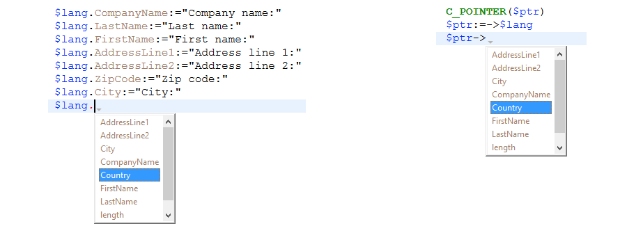
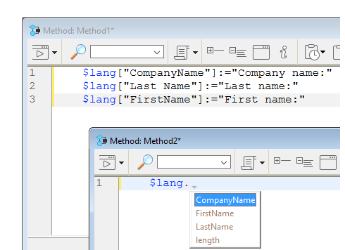

4Dは、インテリジェントなコード補完、コードナビゲーション、デバッグ、検索など、生産性の高いコード編集のための幅広い機能を提供する強力なコードエディターを搭載しています。


コードエディターはテキストエディターのように動作します。 メソッドやクラスの記述は通常、テキストの入力、コンポーネントの選択、そしてエクスプローラーやその他のウィンドウからのドラッグ操作によりおこないます。 メソッドの記述をより効率的におこなうために、タイプアヘッド機能も提供されています。

メソッド、クラス、関数の内容はスクロールして確認することができ、最大32,000行、2GBのコードを記述できます。

4Dのコードエディターは基本的なシンタックスチェック機能を提供します。 メソッド実行時には追加のエラーチェックがおこなわれます。 エラーハンドリングについての詳細は、[デバッガー](../Debugging/basics.md) の章を参照ください。

## ツールバー

コードエディターにはメソッドの実行と編集に関連する基本的な機能に素早くアクセスするためのツールバーがあります。

| 機能                   | アイコン                                                                    | 説明                                                                                                                                                                                                              |
| -------------------- | ----------------------------------------------------------------------- | --------------------------------------------------------------------------------------------------------------------------------------------------------------------------------------------------------------- |
| **メソッド実行**           |                  | コードエディターウィンドウには、そのエディターで開かれているメソッドを実行するためのボタンがあります。 このボタンに関連付けられているメニューから実行オプションを選択できます:<ul><li> **新規プロセスで実行**: 新規プロセスを作成し、そのプロセス内でメソッドを実行します。</li><li>**新規プロセスで実行してデバッグ**: 新規プロセスを作成し、デバッガーウィンドウを開いてメソッドを表示します。</li><li>**アプリケーションプロセスで実行**: アプリケーションプロセス内でメソッドを実行します (アプリケーションプロセス内とは、レコード表示ウィンドウと同じプロセス内ということです)。</li><li>**アプリケーションプロセスで実行してデバッグ**: アプリケーションプロセス内でデバッガーを開き、メソッドを表示します。</li></ul>メソッド実行の詳細については、 [プロジェクトメソッドの呼び出し](../Concepts/methods.md#プロジェクトメソッドの呼び出し) を参照ください。             |
| **検索**               |                           | 現在のウィンドウで検索をおこなうことができます。                                                                                                                                                                                        |
| **マクロ**              |                           | 選択対象にマクロを挿入します。 ドロップダウンの矢印をクリックすると、利用可能なマクロがすべて表示されます。 詳細は [マクロの作成と利用](creating-using-macros.md) を参照してください。                                                                                                     |
| **すべて折りたたむ / すべて展開** |          | これらのボタンを使用してコードの制御フロー構造を折りたたんだり展開したりできます。                                                                                                                                                                       |
| **メソッド情報**           |           | [メソッドプロパティ](../Concepts/methods.md#プロジェクトメソッドプロパティ) ダイアログボックスを表示します (プロジェクトメソッドのみ)。                                                                                                                             |
| **最新のクリップボードの値**     |  | 直近でクリップボードに保存された値を表示します。                                                                                                                                                                                        |
| **クリップボード**          |                  | コードエディターで利用可能な 9つのクリップボードです。 クリップボードのアイコンをクリックするか、あるいはキーボードショートカットによって、[これらのクリップボードを利用](./write-class-method.md#コピーペースト文字列を複数記憶する) できます。 [環境設定オプション](Preferences/methods.md#options-1) を使用するとそれらを非表示にすることができます。 |
| **コードのナビゲーション**      |                     | 自動的にタグ付けされたコンテンツや手動で宣言されたマーカーを使用して、メソッドやクラス内を移動できます。 [ナビゲーションドロップダウン](./write-class-method.md#ナビゲーションドロップダウン) 参照。                                                                                               |

## 編集エリア

このエリアを使用してコードを [入力/編集](write-class-method.md) します。 エディターは、コードテキストのインデントを自動で設定し、異なるシンタックス要素ごとに色を付けて、コード構造を明確に表示します。

この編集エリアの表示はカスタマイズできます。 カスタマイズした内容は、すべてのコードエディターに反映されます:

| オプション                  | 説明                                                                                              | 設定場所                                                                                                                                                   |
| ---------------------- | ----------------------------------------------------------------------------------------------- | ------------------------------------------------------------------------------------------------------------------------------------------------------ |
| **フォント** と **フォントサイズ** | 編集エリアの文字フォントとサイズを設定します                                                                          | **環境設定** の [**メソッド**](../Preferences/methods.md) ページ、または **メソッド** メニューから **表示 ＞ フォントを大きく / フォントを小さく** で設定します。                                          |
| **シンタックス要素のスタイルとカラー**  | 4Dランゲージの要素タイプごとに異なる色やスタイルを割り当てることができます。  また、編集エリアのインターフェースで使用されている色 (ハイライト、背景色など) を変更することができます。 | ランゲージ要素 (変数、キーワード等) 上でコンテキストメニューを表示し、 これには、**メソッド** メニューの **行を上に移動** / **行を下に移動** コマンドを使用します。 また、**Alt/Option** + **上矢印** / **下矢印** の組み合わせでも同様に操作できます。 |
| **スペース**               | 単語間のスペースを空白ではなくピリオド (.) で表示することができます。 この設定は、すべてのコード要素 (コマンド名、変数、コメントなど) に適用されます。                | **メソッド ＞ 表示 ＞ ホワイトスペース**                                                                                                                               |
| **テーマ**                | Dark または Light テーマが選択できるほか、カスタムテーマも設定可能です                                                       | **環境設定** ＞ [**メソッド**](../Preferences/methods.md)                                                                                                       |
| **コードインデント幅**          | コードのインデント幅を設定します                                                                                | **環境設定** ＞ [**メソッド**](../Preferences/methods.md)                                                                                                       |

## リストエリア

リストエリアにはメソッドやクラスの記述に必要となるコード要素 (コマンド、定数、フォーム等) のリストを 1つ以上表示できます。 表示するリストの数や種類は変更することができます。

デフォルトで、コードエディターには 4つのリストが表示されます。 ウィンドウの右下にあるアイコンをクリックすると、すべてのリストを表示/非表示にすることができます。 

リストの境界をドラッグして、リストの幅を相対的に調整できます。 また、編集エリアとの境界線をドラッグして、リストエリアの高さを調整できます。

- リストの項目をダブルクリックすると、現在のカーソル位置にその項目が挿入されます。
- リストの **表示内容を変更** するには、リストのタイトルエリアをクリックすると現れるポップアップメニューから表示したい項目を選択します。


- リストを追加/削除するには、リストのタイトルエリアをクリックし、一番下の対応するメニューを選択します。 **このリストを取り除く** コマンドは、リストが残り1つのときは無効になります。 すべてのリストを非表示にするには、ウィンドウ右下の **リストを表示\非表示** ボタンをクリックするか、**環境設定** でデフォルトで非表示にする必要があります。

- すべてのウィンドウでリストを非表示にするには、次の方法があります:
  - **メソッド** メニューの **表示＞リスト** オプションの選択を解除する
  - **環境設定** の **メソッド** ページで **オプション** ＞ **リスト表示** の選択を解除する。 **環境設定** ダイアログボックスでおこなった変更は、開かれているメソッドやクラス、関数を一度閉じて再度開いたときに反映されます。

#### リストのタイプ

コードエディターウィンドウのリストエリアには以下の項目を表示できます:

- **すべてのテーブルとフィールド**: データベーステーブルとフィールドの名前 (階層リスト形式)。 ダブルクリックでフィールド名をコードに挿入すると、4D はシンタックスに合わせてテーブル名も挿入します。
- **テーブル** (サブメニュー): サブメニューを使用して選択したテーブルのフィールド名。
- **カレントテーブル**: カレントテーブルのフィールド名 (トリガー、フォームメソッド、オブジェクトメソッドで利用可能)。
- **プロジェクトフォーム**: データベースのプロジェクトフォーム名。 プロジェクトフォーム名をダブルクリックすると、4D はダブルクォートで囲まれたフォーム名を挿入します。
- **テーブルフォーム**: データベースのテーブルフォーム名 (階層リスト形式)。 ダブルクリックでテーブルフォーム名を挿入すると、4D はテーブル名の後にセミコロン、そしてダブルクォートで囲まれたフォーム名を挿入します。 例: [Table];"Form"。
- **メソッド**: データベースに定義されたプロジェクトメソッド名。
- **すべてのフォルダー**: データベースに定義されたオブジェクトフォルダーおよびサブフォルダー名 (階層リスト形式)。 フォルダーは、カスタマイズされた方法でオブジェクトをグループ化するために使用します。 フォルダーは、エクスプローラーのホームページで管理します。
- **フォルダー** (サブメニュー): サブメニューを使用して選択されたフォルダーの中身。
- **マクロ**: データベースに定義されたマクロ名 ([マクロの作成と利用](creating-and-using-macros.md) 参照)。
- **コマンド**: 4Dランゲージコマンド (文字順)。
- **コマンドリスト (テーマ順)**: テーマごとにグループ化された 4Dランゲージコマンド (階層リスト形式)。
- **メニューバー**: [4Dメニューバーエディターで作成した](../Menus/creating.md) メニューバーの名前と番号。
- **定数**: 4D やプラグインに定義された定数 (テーマ別階層リスト形式)。
- **リスト**: リスト名。
- **すべてのプラグインコマンド**: データベースにインストールされたプラグインのコマンド名 (テーマ別階層リスト形式)。
- **SQLキーワード**: 4D の SQLシンタックスパーサーが解釈可能なキーワードのリスト。 このリストには、コマンド (例: SELECT)、句 (例: WHERE)、関数 (ABS) が含まれます。
- **SQL関数**: 4D SQL 関数。

**注**: マクロ要素を除き、すべてのリストは文字順です。

### テンプレートとして保存

コードエディターウィンドウに設定したリストをテンプレートとして保存できます。 テンプレートとして保存すると、新規にコードエディターを開くたびにその設定が使用されます。

テンプレートには以下のパラメーターが保存されます:

- 編集とリストエリアの相対サイズ
- リストの数
- 各リストの位置と表示内容
- 各リストの相対幅

設定をテンプレートとして保存するには、**メソッド** メニューから **テンプレートとして保存** を選択します。 テンプレートは即座に保存されます (ダイアログボックスは表示されません)。 設定は、4Dアプリケーションの **環境設定** に保存されます。 既存のテンプレートがあれば、上書きされます。

## ブレークポイントエリア

編集エリアの左にあるこのエリアでは、行番号を表示したり、ブレークポイントを直接挿入したりできます。 ブレークポイントはプログラムのデバッグに使用します。 ブレークポイントが設定された場所でコード実行が停止し、デバッガーを表示します。

ブレークポイントに関する詳細は、[デバッガー](../Debugging/breakpoints.md#ブレークポイント) の章を参照ください。

コードエディターの各ウィンドウごとに、ブレークポイントエリアにおける行番号の表示/非表示を切り替えられます。

- 行番号の表示/非表示のデフォルト設定は **環境設定** ＞ **メソッド** ページの **行番号を表示** で設定します。
- 各ウィンドウの設定を切り替えるには、**メソッド** メニューの **表示** ＞ **行番号** を選択します。

行番号を表示すると、ウィンドウ内で特定の行を見つけやすくなります。 **メソッド** メニューの **行番号を指定して移動...** コマンドを利用する場合も、この行番号を使用します。

## ステータスバー

エディターウィンドウの右下にはステータスバーがあり、カーソルの位置を表示します:


- **行**: 行番号
- **階層**: 階層番号 (プログラム構造の階層レベル)。 先頭のレベルは 0 です。 この数値は、コード中でエラーが発生した際にインタープリターから提供されるのでデバッグ時に利用できます。
- **文字**: 行内の文字位置。
- : リストの表示/非表示。

## コードの入力と編集

コードエディターへの入力と編集には標準のテキスト編集テクニックを使用します。

コードエディターは、シンタックス要素ごとに、指定されたスタイルやカラーを使用した表示をおこないます。 この設定は[変更できます](#編集エリア)。 入力を確定するごとに、また改行を挿入する際に、4D は行のテキストを評価して適切な表示フォーマットを適用します。 また、If や End if などのプログラム構造が使用された場合、4D は自動でインデントをおこないます。

行に移動するには矢印キーを使用します。 矢印による移動では行の評価がおこなわれないため、クリックよりもすばやく移動できます。

Windows では、日本語や中国語を入力するために IME (Input Method Editor) がサポートされています。

コードエディターでは、複数の [ナビゲーションショートカット](#ショートカット) がサポートされています。

### ドラッグ＆ドロップによる追加

メソッドを記述する際に、ドラッグ＆ドロップを使用できます:

- エクスプローラーから
- 同じメソッド・クラス・関数内で
- メソッド・クラス・関数間で

#### エクスプローラーから

エクスプローラーからは以下のものをドラッグ＆ドロップできます:

- ホームページからテーブル名、フィールド名、フォーム名、そしてプロジェクトメソッド。
- テーブルページからテーブル名とフィールド名。
- フォームページからテーブル名とフォーム名。
- メソッドページからプロジェクトメソッドおよびフォーム名。
- 定数ページから定数。
- コマンドページから 4Dコマンド。

ドラッグ＆ドロップをおこなうと、4D は常に正しいシンタックスでオブジェクトを挿入します。 たとえば、[People]テーブルから "FirstName" フィールドをドロップすると、コードエディターには "[People]FirstName" が表示されます。 同様に、[People]テーブルから "Input" フォームをドロップすると、"[People];"Input"" と挿入されます。

エクスプローラーの **コマンド** ページからコマンドをドラッグすると、コードエディターにはシンタックス (すべての引数が含まれる) も挿入されます。 この機能は、コマンドが期待する引数を確認するために存在します。 挿入されたシンタックスは、用途に合わせて編集できます。

#### メソッド・クラス・関数内あるいはその間のドラッグ＆ドロップ:

コードエディターでテキストの一部を選択すると、ドラッグ＆ドロップメカニズムが有効になります。 デフォルトではドラッグ＆ドロップによりテキストが移動されます。 コピーをおこなうには **Ctrl** キー (Windows) または **Option** キー (macOS) を押しながら操作します。

### 行を分割する

1つのステートメントを複数行に記述することができます。 これをおこなうには、ステートメントの各行をバックスラッシュ `\` 文字 (日本語Windowsの場合半角円マーク) で終了します。 このように複数行に分かれたコードを、4D は一行と解釈します。 たとえば、以下のステートメントは同等です:

```4d
$str:=String("hello world!")
```

```4d
$str:=String("hello"+\
" world"+\
+"!")
```


### 文字種の変換

意味する文字

- **大文字** / **小文字**: 選択した文字を大文字または小文字に変換します。
- **キャメルケース (先頭小文字)** / **キャメルケース (先頭大文字)** : 選択した文字をキャメルケースに変換します。 これは複数の単語を結合し、頭文字をそれぞれ大文字に変換するものです。 このような表記は、変数の命名法としてよく用いられます。 hireDate と PurchaseDate は、キャメルケース表記の 2つのバリエーションの例です。

テキストにこれらのコマンドを適用すると、スペースと "_" 文字は取り除かれ、 各単語の先頭文字が大文字になります。

### 式の入れ替え

**式の入れ替え** 機能を使用すると、代入式の左辺と右辺が入れ替わります。 たとえば:

`variable1:=variable2`

は以下のようになります。

`variable2:=variable1`

この機能は、プロパティを取得したり設定したりする一連の代入式を逆にする場合や、入力間違いを訂正するのに便利です。 この機能を使用するには対象の行を選択し、**メソッド** メニューまたはエリアのコンテキストメニューから **式の入れ替え** コマンドを選択します。 選択された行のうち、値を代入する行だけが更新されます。

### コピー/ペースト文字列を複数記憶する

標準のコピー/ペースト処理に加え、4D は異なるクリップボードの内容を操作するための 2つの追加機能を提供しています:

- 4D は現在のセッション中にコードエディター中でおこなわれた最新の 10個の "コピー" や "カット" アクションをメモリに格納します。 格納されたこれらの内容はいつでも再利用できます。 これには、コードエディターのコンテキストメニューから **クリップボード履歴** コマンドを使用するか、ツールバーの "最新のクリップボードの値" ボタンを使用します:

    

    コピー/カットされたテキストの最初の数文字が表示されます。 項目を選択すると、保存されていたテキストがカーソル位置に挿入されます。

- また、9つの番号付きクリップボードが用意されており、コードエディターツールバーのボタンあるいはキーボードショートカットで使用します:


|プラットフォーム|選択したテキストをクリップボードにコピー|カーソル位置にクリップボードの内容をペースト| |--|--|--| | **Windows** | クリップボードアイコン上で Shift+クリックあるいは Alt+クリック | クリップボードアイコン上で Ctrl+クリック | | | | Ctrl+クリップボード番号 | | **macOS** | クリップボードアイコン上で Shift+クリックあるいは Alt+クリック | クリップボードアイコン上で Cmd+クリック | | | Cmd+Shift+クリップボード番号 | Cmd+クリップボード番号 |

[環境設定オプション](Preferences/methods.md#options-1) を使用すると番号付きのクリップボードを非表示にすることができます。

### 行の移動

使いやすさの観点から、**定数**、**変数 (ローカルあるいはインタープロセス) およびオブジェクト属性**、**テーブル** に関するリストの自動表示を無効にできます。 これらのオプションは **環境設定** の **メソッド** ＞ **オプション** にあります。

### 更新行の通知

エディターで開いた後に更新されたコードの行には色つきのバーが表示されます:


変更が保存されたかどうかは、バーの色で表されます:

- 黄色: 行は変更されたが、保存されていない。
- 緑色: 行は変更され、保存された。

## 自動補完機能

コードエディターでは自動補完機能が提供されています。 4D は入力された最初の文字に基づき、自動で候補を提案します。

以下の例では、"cop" と入力したことにより三角が表示されています。 これは複数の候補があることを示します:


入力した文字に対応する候補が一つに絞り込まれた時、提案される値はグレーアウトされた状態で表示されます (この状態で **Tab** キーを押すと挿入されます):  ---> 

> **環境設定** の **メソッド** ページで、**() と閉じる } ) ] " を自動で挿入** オプションをチェックしている場合、4D はひとつ以上の必須の引数を持つ4D コマンド、キーワード、プロジェクトメソッドの後ろに (提案、あるいは補完を受け入れたあとに) 自動的に **()** を追加します:  -> 

例: If..End if, For each...End for each) などにも使用できます: 構造の最初の部分を入力し始めると、コードエディターは自動的に終わりの部分を提示します:

複数の候補がある場合、**Tab** キーを押すと 4D はそのポップアップリストを表示します:


リストは文字順になっています。 ダブルクリックまたは矢印キーで値を選択してから、**Enter**、**Carriage Return** または **Tab** キーを押すと、その値が挿入されます。

デフォルトでは、値を選択したあとに区切り文字 `( ; : = < [ {` を入力すると、自動で値の候補も (区切り文字の前に) 挿入されます。 値のあとには区切り文字がつき、データの入力の準備ができた状態になります。

  +  **(** キー --> 

> この区切り文字を使った候補の自動入力は、**環境設定** の **メソッド** ＞ **オプション** で無効にできます。

**Esc** キーを押すとポップアップが閉じられます。 文字が入力されるに伴い、ポップアップで提案される内容も更新されます。

入力された文字が複数の異なるオブジェクトに対応する場合、それらは対応するスタイルでリスト中に表示されます。 以下のタイプのオブジェクトが表示されます:

- 4Dコマンド
- SQLコマンド
- プロジェクトメソッド
- テーブル名
- フィールド名
- 定数
- メソッド内で宣言されているローカル、プロセス、インタープロセス変数
- オブジェクトのプロパティ名
- プラグインコマンド
- 4Dキーワード
- SQLキーワード
- マクロ (&lt; &gt; の間に表示）

> ランゲージ要素 (変数、キーワード等) 上でコンテキストメニューを表示し、 **スタイル** サブメニューからオプションを選択します。 または、**環境設定** の [**メソッド**](../Preferences/methods.md) ページでも設定できます。

### オブジェクトプロパティ

4D は以下のタイミングで、4Dコード内にある有効なオブジェクトプロパティ名の、文字の大小の区別された提案を自動的に表示します:

- オブジェクトの後にドット "." を入力した
- 逆参照オブジェクトポインター "->" の後に Tab キーを使用した



> `length` プロパティは、コレクションに対する提案に常に含まれます。

ひとたび作成されたプロパティ名は内部のグローバルなリストに登録され、メソッド/クラス/関数が開かれたり閉じられたり、フォーカスが変わるたびに利用可能です。



提案の一覧は、コード変更中にも動的に更新されます。 ウィンドウ間を切り替えるときに、新しい/編集されたプロパティ名は常にグローバルなリストに追加されます。 このリストはエクスプローラー内でメソッドやクラス、関数をプレビューする際にも更新されます。

データベースが再起動されると、リストは再度初期化されます。

> オブジェクトプロパティ名の自動表示は、**環境設定** の **メソッド** ページの提案セクションにて無効化することができます。

## テキストの選択

**ブロックを選択** 機能で、挿入カーソルが含まれるコードブロックを選択できます。 コードブロックは以下のように決定されます:

- 引用符 (クォーテーションマーク)
- 括弧
- 論理構造 (If/Else/End if, While/End while, Repeat/Until, Case of/End case)
- 中括弧

すでにブロックを選択している状態でこの機能を使用すると、さらに上のレベルのブロックが選択されます。

**Ctrl+Shift+B** (Windows) または **Command+Shift+B** (macOS) を使用するとこの逆の操作をおこなうことができ、最後に選択されたブロックの選択が解除されます。

**注:** 挿入カーソルが `If` または `Else` タイプの構造の中にある場合、`If` または `Else` 構造ブロックが選択されます。

単語を選択するには、選択したい単語上でダブルクリックします。 参照される名前 (コマンド、定数、メソッド等) にスペースが含まれる場合には、**Alt/Option + ダブルクリック** でスペースを含む名前全体を選択できます。

### ショートカット

コードエディターでコード内を移動するのに、標準のキーボードショートカットを使用できます。

**注:** macOSでは **Ctrl** の代わりに **Command** を使用してください。

| **ショートカット**                 | **動作**                                         |
| --------------------------- | ---------------------------------------------- |
| [Shift]+[右矢印]               | 選択範囲を作成し、一文字ずつ右に拡大します。 または、選択範囲を一文字ずつ左から縮小します。 |
| [Shift]+[左矢印]               | 選択範囲を作成し、一文字ずつ左に拡大します。または、選択範囲を一文字ずつ右から縮小します。  |
| [Shift]+[下矢印]               | 選択範囲を作成し、上から下へと 1行ずつ拡大します。                     |
| [Shift]+[上矢印]               | 選択範囲を作成し、下から上へと 1行ずつ拡大します。                     |
| [Ctrl]+[Shift]+[右矢印]        | 選択範囲を単語単位で右方向に作成・拡大します。                        |
| [Ctrl]+[Shift]+[左矢印]        | 選択範囲を作成し、単語単位で左に拡大します。 または、選択範囲を単語単位で右から縮小します。 |
| [Ctrl]+[右矢印]                | 挿入カーソルを単語単位で左から右に移動します。                        |
| [Ctrl]+[左矢印]                | 挿入カーソルを単語単位で右から左に移動します。                        |
| [Home]                      | 挿入カーソルを行の先頭に移動します。                             |
| [End]                       | 挿入カーソルを行の最後に移動します。                             |
| [Ctrl]+[Home]               | 挿入カーソルをメソッドの先頭に移動します。                          |
| [Ctrl]+[End]                | 挿入カーソルをメソッドの最後に移動します。                          |
| [Shift]+[Home]              | 行の先頭からカーソルまでを選択します。                            |
| [Shift]+[End]               | カーソルから行の最後までを選択します。                            |
| [PgUp]                      | メソッドをページ単位で上にスクロールします (挿入カーソル位置は変更されません)。      |
| [PgDn]                      | メソッドをページ単位で下にスクロールします (挿入カーソル位置は変更されません)。      |
| プロジェクトメソッド名上で [Ctrl]+[K]    | プロジェクトメソッドを新しいウィンドウで開きます。                      |
| プロジェクトメソッド名上で [Alt]+ダブルクリック | 同上                                             |
| プロジェクトメソッド名上で [Ctrl]+クリック   | 同上                                             |

## シンタックスエラーのチェックと訂正

4D は自動でメソッドシンタックスをチェックします。 シンタックスが正しくない場合、4Dはそのことを示す記号を表示します 。 マウスを記号に重ねるとエラーの内容が表示されます:


コード入力の際、テンキー側の **Enter** を押すと、改行されることなく現在の行のシンタックスチェックをおこなえます。 4Dは行を評価し、フォーマットし、エラーがあればそれを表示し、挿入カーソルを行の最後に移動します。 メソッドやクラス、関数の行にエラーがあると表示された場合には、それを修正してください。 正しく修正されると、4D はエラー記号を削除します。 保存したりウィンドウを閉じたりしたときはメソッド全体が評価されます。 **Enter** キーを押すと、強制的に評価をおこなえます。

メソッド、クラス、関数を評価する際、4Dは以下をチェックします:

- 基本的なシンタックスエラー
- ステートメントの構造 (`If`, `End if` など)
- 括弧やクォーテーションマークなどの対応 (ペアになっているか)。 閉じる文字を入力すると、4D は開始と終了文字を灰色の四角で囲み、それらがペアであることを示します:


> コード中のこれらの閉じる文字をクリックすると、4D はデフォルトで対応するペアの文字を灰色の四角で囲みます。 この振る舞いは **環境設定** の **メソッド** ＞ **オプション** の **括弧のマッチング** で変更できます。

コードエディターではスペルミスなどの大きなシンタックスエラーしかチェックできません。 実行時エラーはチェックできません。 実行時エラーは、コードが実行されているときに 4D が検出します。

このようなエラーを処理するために、4D はデバッガー ([デバッガー](../Debugging/debugger.md) 参照) を提供します。 また、コンパイラーもエラー検出には欠かせません。 コンパイラーについての詳細は、[コンパイル](../Project/compiler.md) を参照ください。

## ヘルプTip とステータスバーを使用する

コードエディターは、カーソルの位置に応じた様々な情報をヘルプTip で提供します。 これらの情報は、マウスをオブジェクト上に重ねたときに表示されるほか、コードエディターウィンドウ下部のステータスバーにも表示されます。

- **エラー**: ブレークポイントエリアにエラーアイコンが表示されているとき、マウスをアイコンに重ねるとエラーの内容が表示されます ([シンタックスエラーのチェックと訂正](#シンタックスエラーのチェックと訂正) 参照)。

- **4Dコマンドの説明**: 4Dコマンド名や変数にカーソルを置くと、ステータスバーにコマンドのシンタックスが表示されます。 引数を入力または選択すると、このエリアで現在の引数が **太字**で表示されます:  4Dコマンド上にマウスを重ねると、コマンドシンタックスと簡単な説明がヘルプTip に表示されます。 

- **変数型と詳細**: 変数にマウスを重ねると、その変数の型と (メソッド内で明示的に宣言されている場合)、付随したコメントが (あれば) ヘルプTip に表示されます。 

- **プロジェクトメソッド**: プロジェクトメソッドまたはクラス関数にマウスを重ねると、以下の内容がヘルプTip に表示されます:

  - エクスプローラーで設定されたコメント、
  - または、メソッドまたはクラス関数の先頭コメント (// で始まる行、あるいは /*...*/ コメントブロック)。 メソッドの先頭に、そのメソッドや引数の説明をコメント形式で記述するのは一般的な方法です。 エクスプローラーコメントを削除すれば、こちらの内容をヘルプTip に表示できます。 メソッドの先頭コメント:  別のメソッドからこのメソッドを呼び出したときのヘルプTip: 

- また、 **専用のドキュメントファイル** を `<MethodName>.md` という名前で `<package>/documentation` フォルダーに作成することも可能です。 [コードエディターでドキュメンテーションを表示する](../Project/documentation.md#コードエディターでドキュメンテーションを表示する) を参照ください。

## コマンドの完全なドキュメントを表示する

4D の "クラシック" ランゲージコマンドの HTMLドキュメントをいつでも表示することができます。 コマンド名を選択、またはその途中にカーソルを挿入し、**F1** を押します。 デフォルトブラウザーの新しいウィンドウにコマンドの完全なドキュメントが表示されます。

アプリケーション環境設定 ([ドキュメントの場所](../Preferences/general.md#ドキュメントの場所)) に基づき、4D はオンラインリファレンス (*4D Doc Center* のサイト)、あるいはローカルからそのコマンドのドキュメントを探します。

## コメント/アンコメント

コメントとは、コード内の実行されないテキストのことです。 プログラムはコメント行をコードとして解釈せず (4D はコメントにスタイルを適用しません) メソッドまたは関数を呼び出してもそれらの行は実行されません。

コメントの書き方は2通りあります:

#### `//コメント`

単一行のコメントを作成するのに使用します。 行の先頭に// を挿入することで、単一行のコメントが作成されます。 単一行のコメントの最大長は、単一行の最大サイズ (32,000文字) までです。

<pre>&lt;code class="//This is a comment\" spaces=">
 &lt;code class="//This is a comment\" spaces=">
 &lt;code class="//This is a comment\" spaces=">
 For(vCounter;1;2)\
  //comment\
  //comment\
  //comment\
 End for
&lt;/code>
&lt;/code>
&lt;/code></pre>

#### `/*コメント*/`

コンテンツを囲うことで、インラインコメントや複数行のコメントブロックを作成することができます。

インラインコメントも、複数行コメントも、どちらも /* で始まり、*/ で終わります。

- *インラインコメント* -  コード内のどこにでも記述することができます。 インラインコメントの最大長は、行の最大サイズ (32,000文字) までです。 

- *複数行コメントブロック* - 折りたたみ/展開が可能です。 複数行のコメントブロックはネスト構造にすることができ、それぞれのブロックを折りたたみ/展開することが可能です。 ブロックが折りたたまれている時でも、折りたたみ/展開可能なブロックの最初の行だけは引き続き表示されます。 複数行コメントの長さは、各行につき最大32,000文字までです。 行数については制限はありません。 

> 行末の複数行コメントはサポートされていません。

**メソッド** メニューやコードエディターのコンテキストメニューにある **コメント/アンコメント** コマンドを使用すると、選択した (複数の) 行を単一行コメント化およびその逆の操作をおこなえます。 このコマンドを使用するには適用したい行を選択し、**コメント/アンコメント** を選択します:

 --> 

選択行がアクティブなコードの場合、**コメント** コマンドが適用されます。 選択行にアクティブコードとコメントの両方が含まれる場合、すべての行に "//" が追加されます。 この動作により、複数回コマンドを適用しても、その後のアンコメント時に初期のコメントが維持されます。 選択行がすべてコメントのみの場合、**アンコメント** コマンドが適用されます。

> **コメント/アンコメント** コマンドは行全体に適用されます。 行の一部のみをコメント化することはできません。

## エスケープシーケンス

コードエディターでエスケープシーケンス (エスケープ文字) を使用できます。 エスケープシーケンスとは、特別な文字の代わりに使用される一連の文字です。

エスケープシーケンスは一文字目がバックスラッシュ `\` であり、そのあとに文字が続きます。 たとえば `\t` は **Tab** 文字のエスケープシーケンスです。 エスケープシーケンスを使用すると特別な文字の入力が容易になります。 たとえば `\t` を Char(Tab) の代わりに使用できます。

4D では以下のエスケープシーケンスを使用できます:

| エスケープシーケンス                   | 意味する文字   |
| ---------------------------- | -------- |
| `\n`                        | LF (行送り) |
| `\t`                        | HT (タブ)  |
| `\r`                        | CR (改行)  |
| ``\\` |``&#96; (バックスラッシュ) |          |
| `\"`                        | " (引用符)  |

> エスケープシーケンスでは文字の大小は区別されません。

以下の例題では、**キャリッジリターン** 文字 (エスケープシーケンス `\r`) を使用して、警告ダイアログに表示されるメッセージに改行を挿入しています:

`ALERT("The operation has been completed successfully.\rYou may now disconnect.")`

**警告**: `\` (バックスラッシュ) は Windows でパス名の区切り文字として使用されています。 通常、4D はコードエディターに入力された Windows のパス名のバックスラッシュを自動で `\` に置き換えることで、これを正しく解釈します。 たとえば、`C:\Folder` と入力すると `C:\\Folder` に変換されます。 しかし、`"C:\MyDocuments\New"` と入力した場合、4Dは `"C:\\MyDocuments\New"`と表示します。 この場合、二番目のバックスラッシュは `\N` (行送り) と解釈されてしまいます。 このようなケースでは、開発者がバックスラッシュを 2つ入力するようにしなければなりません。

## コードの編集を容易にする

コードエディターには、コードの可読性を高めたり、行のブラウズを容易にしたりする機能があります。

### 展開 / 折りたたみ

ループや条件文の中にあるコードを折りたたんだり展開したりして、メソッドの可読性を高めることができます:

- 展開されたコード:  

- 折りたたまれたコード: 

展開ボタン [...] の上にマウスを重ねるとヘルプTip が表示され、非表示になっているコードの先頭部分を見ることができます。

折りたたまれたコード部分は、選択・コピー・ペースト・削除することができます。 折りたたみに含まれるすべての行が操作の対象となります。 このようなコードがペーストされると、自動で展開されます。

コードを折りたたみ、展開する方法はいくつかあります:

- 折りたたみ/展開アイコンまたは (Windows では [+] と [-]、macOSでは三角) をクリックする、または閉じられた状態では開くボタン [...]
- **メソッド ＞ 折りたたみ/展開** サブメニューを使用する:

  - **選択部を折りたたむ** / **選択部を展開する**: 選択されたテキスト中にあるすべてのコードを折りたたむまたは展開します。
  - **現在のレベルを折りたたむ** / **現在のレベルを展開する**: カーソルが存在するレベルのコードを折りたたむまたは展開します。 このコマンドはエディターの **コンテキストメニュー** からもアクセスできます。
  - **すべてを折りたたむ** / **すべてを展開する**: メソッド中のすべてのループと条件ブロックを折りたたむまたは展開します。 このコマンドはエディターのツールバーからもアクセスできます:。

### ブロックの先頭/ブロックの終端

コード構造 (例: `If...Else...End if`) の中を移動することを容易にするための、2つのコマンドがあります:

- **ブロックの先頭**: 現在のブロックの先頭にカーソルを移動します。
- **ブロックの終端**: 現在のブロックの終端にカーソルを移動します。

このコマンドには **メソッド** メニューとエディターのコンテキストメニューからアクセスできます。 以下のショートカットも利用できます:

- Windows: **Ctrl** + **上矢印** または **Ctrl** + **下矢印**
- macOS: **Command** + **上矢印** または **Command** + **下矢印**.

### ブックマークを使用する

4Dでは、メソッドの特定の行にブックマークを付けることができます。 ブックマークを付けると、特別なコマンドを使用してブックマーク間を素早く移動できます。


コードが挿入されたり削除されたりしてブックマーク行が移動すると、ブックマークもそれに伴って移動します。 ブックマークはメソッドとともに保存されます。

ブックマークは **メソッド** メニューの **ブックマーク** サブメニューから管理します:

- **注**: この節の内容はアルファベットに対してのみ有効です。 <br /><br /> **メソッド** メニューの **大文字/小文字** サブメニュー、またはエディターのコンテキストメニューを使用して、選択したテキストの文字の大小を変更することができます:
- **すべてを削除**: 最前面のエディターのブックマークをすべて削除します。
- **次に進む** / **前に戻る**: ウィンドウ内でブックマーク間を移動するのに使用します。 コマンドを選択すると、該当するブックマーク行の先頭にカーソルが移動します。 **F3** (次に進む) や **Shift+F3** (前に戻る) ショートカットも使用できます。

**注**: 検索で見つかった項目を含む行のマーカーとしてブックマークを使用できます。 この場合、4D は自動でブックマークを追加します。 詳細については、[メソッド内の検索と置換](./find-and-replace-in-methods.md) を参照ください。

## ナビゲーションドロップダウン

ナビゲーションドロップダウンは、コードを整理し、クラスやメソッド内の移動を助けるツールです。


いくつかのタグは自動的に追加されますが、[マーカー](#手動タグ) を使ってドロップダウンリストを補完することもできます。

### コードのナビゲーション

ドロップダウンリストの項目をクリックすると、当該項目のコードの先頭行に移動します。 また、矢印キーで項目を選択し **Enter** キーで決定して移動することもできます。

### 自動タグ

コンストラクター、メソッド宣言、関数、計算属性は自動的にタグ付けされ、ドロップダウンリストに追加されます。

クラス/メソッドにタグがない場合、ツールは "タグなし" アイコンを表示します。

次の項目が自動的に追加されます:

| アイコン                                                                        | 項目                              |
| --------------------------------------------------------------------------- | ------------------------------- |
|                          | タグなし                            |
|                | クラスコンストラクターまたはメソッド宣言            |
|  | 計算属性 (get, set, orderBy, query) |
|                      | クラス関数名                          |

### 手動タグ

コードにマーカーを追加して、以下のタグをドロップダウンに追加できます:

| アイコン                                                    | 項目        |
| ------------------------------------------------------- | --------- |
|  | MARK: タグ  |
|  | TODO: タグ  |
|    | FIXME: タグ |

タグは、次のようにコメントを付けて宣言します:

```4d
// FIXME: 要修正
```

タグ宣言の際、文字の大小は区別されません。 `fixme:` と記述することもできます。

`MARK:` タグの後にハイフンを付けると、コードエディターとドロップダウンメニューに区切り線が引かれます。 つまり、次のように書くと:


このような結果になります:


関数内のマーカーはドロップダウンリスト内でインデント (字下げ) されますが、関数末尾の `MARK:` タグの後に指示がない場合を除きます。 この場合は、インデントなしで表示されます。

### 表示順

メソッドやクラスのタグをアルファベット順に表示するには、次のいずれかを実行します:

メソッドやクラスのタグをアルファベット順に表示するには、次のいずれかを実行します:

- ドロップダウンツールを **右クリックする**
- macOS では **option**、Windows では **Alt** を押しながら、ドロップダウンツールをクリックします。

> 関数内のタグは、親項目と一緒に移動します。
