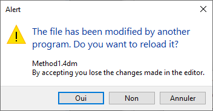

4Dプロジェクトは、包括的な統合開発環境 (IDE) を提供する **4D** アプリケーションを使って作成・開発します。 **4D Server** も、空のプロジェクトを新規作成することができます。

マルチユーザー開発は標準的な **ソース管理** リポジトリツール (Perforce, Git, SVN 等) を使っておこないます。これによって、異なるブランチで開発し、比較してマージまたは変更を戻すといった処理が可能になります。

## プロジェクトの作成

新規の 4Dアプリケーションプロジェクトは **4D** または **4D Server** アプリケーションを使って作成します。 いずれの場合も、プロジェクトファイルはローカルマシン上に保存します。

新規プロジェクトを作成するには:

1. 4D または 4D Server を起動します。
2. 次のいずれかの方法をおこないます:
    * **ファイル** メニューより **新規 > プロジェクト...**を選択します: 
    * (4D のみ) **新規** ツールバーボタンより **プロジェクト...**を選択します:

標準の **保存** ダイアログが表示され、4D プロジェクトの名前と保存場所を指定します。

3. プロジェクトフォルダー名を入力したら、**保存**をクリックします。 この名称はつぎの場所に使用されます:

    * プロジェクト全体を保存するフォルダーの名称
    * as the name of the .4DProject file at the first level of the ["Project" folder](../Project/architecture.md#project-folder).

 OS によって許可されている名称であれば使用可能です。 しかしながら、異なる OS での使用を予定していたり、ソース管理ツールを利用したりするのであれば、それらの命名規則を考慮する必要があります。

**保存** ダイアログを受け入れると、4D は開いているプロジェクト (あれば) を閉じ、指定の場所にプロジェクトフォルダーを作成し、プロジェクトに必要なファイルを設置します。 (詳細については [4D プロジェクトのアーキテクチャー](Project/architecture.md) を参照ください)。

これで、プロジェクトの開発を始めることができます。

## プロジェクトを開く

既存のプロジェクトを 4D で開くには:

1. 次のいずれかの方法をおこないます:

    * **ファイル** メニューより **開く ＞ ローカルプロジェクト...**を選択するか、**開く** ツールバーボタンより同様に選択します。
    * Welcome ウィザードにて **ローカルアプリケーションプロジェクトを開く** を選択します。

The standard Open dialog appears.

2. Select the project's `.4dproject` file (located inside the ["Project" folder of the project](../Project/architecture.md#project-folder)) and click **Open**.

    By default, the project is opened with its current data file. Other file types are suggested:

    * *Packed project files*: `.4dz` extension  - deployment projects
    * *Shortcut files*: `.4DLink` extension - store additional parameters needed for opening projects or applications (addresses, identifiers, etc.)
    * *Binary files*: `.4db` or `.4dc` extension - legacy 4D database formats

### オプション

In addition to standard system options, the *Open* dialog in 4D provides two menus with specific options that are available using the **Open** button and the **Data file** menu.

* **Open** - opening mode of the project:
  * **Interpreted** or **Compiled**: These options are available when the selected project contains both [interpreted and compiled code](Concepts/interpreted.md).
  * **[Maintenance Security Center](MSC/overview.md)**: Opening in secure mode allowing access to damaged projects in order to perform any necessary repairs.

* **Data file** - specifies the data file to be used with the project. By default, the **Current data file** option is selected.

## プロジェクトを開く (その他の方法)

4D offers several ways to open projects directly and bypass the Open dialog:

* via menu options:
  * *Menu bar* - **File** > **Open Recent Projects / {project name}**
  * *4D Tool bar* -  Select the project from the menu associated with the **Open** button

* via preferences:
  * Set the **At startup** general preference to **Open last used project**.

* using a `.4DLink` file.

### 4DLinkファイルを使ってプロジェクトを開く

You can use a [`.4DLink` file](#about-4DLink-files) to launch the 4D application and open the target 4D project. これをおこなうには 2つの方法があります:

* double-click or drag and drop the `.4DLink` file onto the 4D application
* go to **File** > **Open Recent Projects** and select a project

A .4DLink file of "remote project" type can be copied and used on several machines.
> 4D と 4D Server の接続ダイアログで 4DLinkファイルを選択することもできます (ローカルプロジェクトの開始のみ)。

## 4DLinkファイルについて

Files with the `.4DLink` extension are XML files that contain parameters intended to automate and simplify opening local or remote 4D projects.

`.4DLink` files can save the address of a 4D project as well as its connection identifiers and opening mode, saving you time when opening projects.

4D automatically generates a `.4DLink` file when a local project is opened for the first time or when connecting to a server for the first time. The file is stored in the local preferences folder at the following location:

* Windows 7 and higher: C:\Users\UserName\AppData\Roaming\4D\Favorites vXX\
* OS X: Users/UserName/Library/Application Support/4D/Favorites vXX/

XX represents the version number of the application. For example, "Favorites v19" for 4D v19.

That folder is divided into two subfolders:

* the **Local** folder contains the `.4DLink` files that can be used to open local projects
* the **Remote** folder contains the `.4DLink` files of recent remote projects

`.4DLink` files can also be created with an XML editor.

4D provides a DTD describing the XML keys that can be used to build a `.4DLink` file. This DTD is named database_link.dtd and is found in the \Resources\DTD\ subfolder of the 4D application.

## ファイルの保存

When working on a project in 4D, you can use built-in 4D editors to create, modify, or save structure items, methods, forms, etc. Modifications are saved to disk when you select a **Save** menu item, or when the editor's window loses or gets the focus.

Since the editors use files on the disk, potential conflicts could happen if the same file is modified or even deleted from different locations. For example, if the same method is edited in a Code Editor window *and* in a text editor, saving both modifications will result in a conflict.

The 4D development framework includes a file access manager to control concurrent access:

* if an open file is read-only at the OS level, a locked icon is displayed in the editor: 
* if an open file is edited concurrently from different locations, 4D displays an alert dialog when trying to save the changes:

* **Yes**: discard editor changes and reload the modified version
* **No**: save changes and overwrite the other version
* **Cancel**: do not save

This feature is enabled for all built-in 4D editors (Structure, Form, Method, Settings, and Toolbox).
