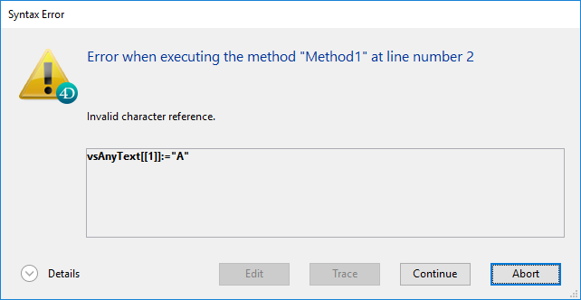

文字列とは、以下を示す総称です:

- テキストフィールドまたは変数: テキストフィールド、変数、または式には 0～2 GB のテキストを格納することができます。
- 文字フィールド: 文字フィールドには 0～255 文字までの文字を格納することができます (上限はフィールドが定義されたときに設定されます)。

## 文字列リテラル

文字列リテラル定数は、次のように二重引用符 ("...") で囲んで表します。 文字列定数の例を次に示します:

```4d
"レコード追加"
"レコードが見つかりません"
"送り状"
```

空の文字列は、2つの引用符の間に何も入れない状態 ("") で表します。

### エスケープシーケンス

以下のエスケープシーケンスを文字列内で使用できます:

| エスケープシーケンス | 意味する文字        |
| ---------- | ------------- |
| \n        | LF (行送り)      |
| \t        | HT (タブ)       |
| \r        | CR (改行)       |
| \\\     | \ (バックスラッシュ) |
| \\"      | " (引用符)       |

**注:** \ (バックスラッシュ) は Windows でパス名の区切り文字として使用されています。 通常 4D はコードエディターに入力されたバックスラッシュを自動で "\\\" に置き換えることで、これを正しく解釈します。例えば "C:\Folder" と入力すると "C:\\\Folder" に変換されます。しかし “C:\MyDocuments\New” と入力した場合、4Dは二番目のバックスラッシュは "\N" (行送り) と解釈してしまい、“C:\\\MyDocuments\New”を表示します。このようなケースでは開発者がバックスラッシュを2つ入力するようにしなければなりません。<br /> さらに正規表現のパターン定義でもバックスラッシュがエスケープシーケンスとして使用されます。正規表現パターン "\\\" を4Dのコードエディターに記述する場合は "\\\\\" となる点に注意してください。

## 文字列演算子

| 演算       | シンタックス           | 戻り値    | 式                       | 値        |
| -------- | ---------------- | ------ | ----------------------- | -------- |
| 連結 (結合)  | String + String  | String | "abc" + "def"           | "abcdef" |
| 繰り返し     | String * Number  | String | "ab" * 3                | "ababab" |
| 等しい      | String = String  | ブール    | "abc" = "abc"           | true     |
|          |                  |        | "abc" = "abd"           | false    |
| 異なる      | String # String  | ブール    | "abc" # "abd"           | true     |
|          |                  |        | "abc" # "abc"           | false    |
| 大きい      | String > String  | ブール    | "abd" > "abc"           | true     |
|          |                  |        | "abc" > "abc"           | false    |
| 小さい      | String < String  | ブール    | "abc" < "abd"           | true     |
|          |                  |        | "abc" < "abc"           | false    |
| 以上       | String >= String | ブール    | "abd" >= "abc"          | true     |
|          |                  |        | "abc" >= "abd"          | false    |
| 以下       | String <= String | ブール    | "abc" <= "abd"          | true     |
|          |                  |        | "abd" <= "abc"          | false    |
| キーワードを含む | String % String  | ブール    | "Alpha Bravo" % "Bravo" | true     |
|          |                  |        | "Alpha Bravo" % "ravo"  | false    |

## 文字列比較の詳細

- 文字列は文字ごとに比較されます (後述の [キーワード](dt_string.md#キーワード) による検索の場合を除きます)。
- 文字列が比較されるとき文字の大小文字は無視されます。したがって、"a"="A"は `true` を返します。 大文字と小文字を区別して比較するには、文字コードで比較してください。 例えば次の式は `FALSE` です:

```4d
Character code("A")=Character code("a")
// Character code("A") は 65
// Character code("a") は 97
```

- 文字列の比較にあたっては、アクセント等の発音記号付きの文字は、お使いのコンピューターのシステム文字比較表を使って比較されます。 たとえば、日本語においては以下の式は `true` を返します:

```4d
     "あ"="ア"
     "ア"="ｱ"
     "１"="1"
```

**注:** 文字列比較にあたっては、**4D のデータファイルに定義された** 言語の特性が考慮されます。これは、システムの使用言語とは異なる場合がありえます。

### ワイルドカード記号 (@)

4D ランゲージでは **@** をワイルドカード記号として使用します。 ワイルドカードは、すべての文字列の比較に使用することができ、ワイルドカードによって置き換わる文字の数は指定されません。 たとえば、次の式は `true` になります:

```4d
"abcdefghij"="abc@"
```

ただし、複数の文字を比較する目的のワイルドカード記号は、比較演算子の右側の式で使用しなければなりません。 比較演算子の左側の式においては、"@" は単なる文字であると解釈されます。たとえば、次の式は `FALSE` です:

```4d
    "abc@"="abcdefghij"
```

ワイルドカードは “0文字以上” を意味します。 以下の式はすべて `true` です:

```4d
     "abcdefghij"="abcdefghij@"
     "abcdefghij"="@abcdefghij"
     "abcdefghij"="abcd@efghij"
     "abcdefghij"="@abcdefghij@"
     "abcdefghij"="@abcde@fghij@"
```

一方、どのような場合でも、ワイルドカードを 2つ連続して使用した文字列比較は常に `FALSE` を返します。 次の式は `FALSE` になります:

```4d
"abcdefghij"="abc@@fg"
```

比較演算子が < あるいは > 記号である、あるいはこれらを含む場合、演算子の右側の式の終りに置かれた1つのワイルドカードのみサポートされています:

```4d
     "abcd"<="abc@" // 有効な比較です
     "abcd"<="abc@ef" // 有効な比較ではありません
```

文字列の比較または検索において、@ をワイルドカードではなく一般の文字として扱いたい場合、`Character code (At sign)` 指示を使用します。 たとえば、文字列が @ 文字で終わっているかどうかを知りたいとします。 以下の式は ($vsValue が空でなければ) 常に `true` です:

```4d
($vsValue[[Length($vsValue)]]="@")
```

以下のようにすると、式は意図したように評価されます:

```4d
(Character code($vsValue[[Length($vsValue)]])=64)  
```

**注:** ストラクチャー設定のデータベースページには、文字列に @ 記号が含まれているとき、それをどう解釈するかを指定するオプションが提供されています。

### キーワード

他の文字列比較と異なり、"%" 記号を使ったキーワードによる検索はテキスト中の単語を検索します: 単語は一つのまとまりとして個々に扱われます。 複数の単語や、音節など単語の一部を検索するような場合、**%** 演算子は常に `false` を返します。 区切り文字 (スペースや句読点など) に囲まれた文字列が単語として認識されます。 “Today's” のようにアポストロフィを含む単語は、通常それを含めた 1つの単語として扱われますが、特定の場合には無視されます (以下の注記を参照ください)。 数字も検索できます。小数点は区切り文字ではなく、数字の一部として扱われます。 ただし、通貨や温度などを表す記号は無視されます。

```4d
     "Alpha Bravo Charlie"%"Bravo" // true
     "Alpha Bravo Charlie"%"vo" // false
     "Alpha Bravo Charlie"%"Alpha Bravo" // false
     "Alpha,Bravo,Charlie"%"Alpha" // true
     "Software and Computers"%"comput@" // true
```
> **注:**
> 
> - 4Dは、`<>=#` 演算子を使った文字列比較や、キーワードの検出に ICUライブラリを使用しています。 実装されているルールの詳細に関しては、以下のアドレスを参照ください: [http://www.unicode.org/unicode/reports/tr29/#Word_Boundaries](http://www.unicode.org/reports/tr29/#Word_Boundaries)
> - 日本語版の 4Dでは、ICU の代わりにデフォルトで Mecab が使用されています。詳細な情報に関しては、[Mecab のサポート(日本語版)](https://doc.4d.com/4Dv18/4D/18/DatabaseData-storage-page.300-4575463.ja.html#1334024) を参照ください。

## 文字参照記号

文字参照記号: [[...]]

文字参照記号は、文字列から一文字のみを参照するのに使用します。 この構文は、テキストおよび文字列型の変数やフィールドの任意の位置の文字を指し示します。

文字参照記号が代入演算子 (:=) の左側にある場合、文字列の指定した位置に一文字を代入します。 以下の例は、vsName が空の文字列ではない場合に、vsName の最初の文字を大文字にします。

```4d
If(vsName#"")
    vsName[[1]]:=Uppercase(vsName[[1]])
End if
```

それ以外の場合には、式内で使用される文字列参照記号は、参照する文字を1文字の独立した文字列として返します。 例:

```4d
// 以下の例は vtText の最後の文字が "@" であるかをテストします。
 If(vtText#"")
    If(Character code(Substring(vtText;Length(vtText);1))=At sign)
  //...
    End if
 End if

  // 文字参照記号を使用し、よりシンプルに記述できます:
 If(vtText#"")
    If(Character code(vtText[[Length(vtText)]])=At sign)
  // ...
    End if
 End if
```

### 無効な文字列参照に関する注意

文字列参照記号を使用する際、配列に存在する要素を指定するのと同じ要領で、文字列内に存在する文字を指定しなければなりません。 たとえば、文字列変数の20番目の文字を参照する場合、この変数は必ず、少なくとも20文字以上の長さがなくてはなりません。長さが足りない場合:

- インタープリターモードでは構文エラーは発生しません。
- コンパイルモードで範囲チェックオプションを無効にしている場合には、メモリ領域を破壊するおそれがあります。
- コンパイルモードで範囲チェックオプションを有効にしている場合には、エラーが発生します。 たとえば、次のように文字列やテキストの終点を超えた位置に文字を書き込むコードを実行すると:

```
// 真似をしないでください
 vsAnyText:=""
 vsAnyText[[1]]:="A"
```

ランタイムにおいてエラーがトリガーされます:



### 例題

以下のプロジェクトメソッドは、文字列内の各単語の先頭文字を大文字に変換し、結果の文字列を返します。

```4d
  // Capitalize_text プロジェクトメソッド
  // Capitalize_text ( Text ) -> Text
  // Capitalize_text ( Source text ) -> Capitalized Text

 $0:=$1
 $vlLen:=Length($0)
 If($vlLen>0)
    $0[[1]]:=Uppercase($0[[1]])
    For($vlChar;1;$vlLen-1)
       If(Position($0[[$vlChar]];" !&()-{}:;<>?/,.=+*")>0)
          $0[[$vlChar+1]]:=Uppercase($0[[$vlChar+1]])
       End if
    End for
 End if
```

使用例:

```4d
ALERT(Capitalize_text("hello, my name is jane doe and i'm running for president!"))
```

以下のように表示されます:


