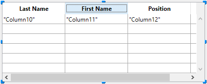
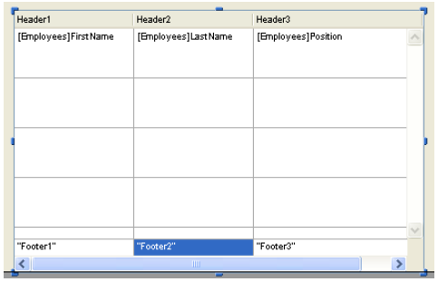

:::note

- リストボックスのヘッダープロパティにアクセスするためには、リストボックスのプロパティリストで [ヘッダーを表示](properties_Headers.md#ヘッダーを表示) オプションが選択されていなければなりません。
- リストボックスのフッタープロパティにアクセスするためには、リストボックスのプロパティリストで [フッターを表示](properties_Footers.md#フッターを表示) オプションが選択されていなければなりません。

:::

## ヘッダー

ヘッダーが表示されていれば、フォームエディターでリストボックスオブジェクトが選択されているときに、リストボックスヘッダーをクリックするとヘッダーを選択できます:

リストボックスの各列ヘッダー毎に標準のテキストプロパティを設定できます。 設定すると、これらのプロパティの方がリストボックスや列に対する設定よりも優先されます。

さらに、ヘッダー特有のプロパティを設定することができます。 さらに、ヘッダー特有のプロパティを設定することができます。 [カスタマイズされた並び替え](./listbox_overview.md#ソートの管理) などの用途に、ヘッダーの列タイトルの隣、あるいはタイトルの代わりにアイコンを表示することができます。

ランタイムにおいてヘッダーで発生したイベントは、その列のオブジェクトメソッド が受け取ります。

ヘッダーに `OBJECT SET VISIBLE` コマンドを使用すると、このコマンドに渡した引数に関わらず、そのリストボックスのすべてのヘッダーが対象になります。 ヘッダーに [`OBJECT SET VISIBLE`](../commands/object-set-visible) コマンドを使用すると、このコマンドに渡した引数に関わらず、そのリストボックスのすべてのヘッダーが対象になります。 たとえば、`OBJECT SET VISIBLE(*;"header3";False)` という命令の場合、指定したヘッダーだけではなく、*header3* が属するリストボックスの全ヘッダーを非表示にします。

### ヘッダー特有のプロパティ

[Bold](properties_Text.md#bold) - [Class](properties_Object.md#css-class) - [Font](properties_Text.md#font) - [Font Color](properties_Text.md#font-color) - [Help Tip](properties_Help.md#help-tip) - [Horizontal Alignment](properties_Text.md#horizontal-alignment) - [Icon Location](properties_TextAndPicture.md#icon-location) - [Italic](properties_Text.md#italic) - [Object Name](properties_Object.md#object-name) - [Pathname](properties_TextAndPicture.md#picture-pathname) - [Title](properties_Object.md#title) - [Underline](properties_Text.md#underline) - [Variable or Expression](properties_Object.md#variable-or-expression) - [Vertical Alignment](properties_Text.md#vertical-alignment) - [Width](properties_CoordinatesAndSizing.md#width)

## フッター

リストボックスは、追加の情報を表示するための入力を受け付けない "フッター" を持つことができます。 表形式で表示されるデータについて、合計や平均などの計算値を表示するためにフッターは通常使用されます。

フッターが表示されていれば、フォームエディターでリストボックスオブジェクトが選択されているときにフッターをクリックすることで選択できます:

リストボックスの各列フッター毎に標準のテキストプロパティを設定できます。設定すると、こちらのプロパティの方がリストボックスや列に対する設定よりも優先されます。 さらに、フッター特有のプロパティを設定することができます。 [カスタムまたは自動計算](properties_Object.md#変数の計算) をフッターに挿入することができます。

ランタイムにおいてフッターで発生したイベントは、その列のオブジェクトメソッド が受け取ります。

フッターに `OBJECT SET VISIBLE` コマンドを使用すると、このコマンドに渡した引数に関わらず、そのリストボックスのすべてのフッターが対象になります。 フッターに [`OBJECT SET VISIBLE`](../commands/object-set-visible) コマンドを使用すると、このコマンドに渡した引数に関わらず、そのリストボックスのすべてのフッターが対象になります。 たとえば、`OBJECT SET VISIBLE(*;"footer3";False)` という命令の場合、指定したフッターだけではなく、*footer3* が属するリストボックスの全フッターを非表示にします。

### フッター特有のプロパティ

[Alpha Format](properties_Display.md#alpha-format) - [Background Color](properties_BackgroundAndBorder.md#background-color--fill-color) - [Bold](properties_Text.md#bold) - [Class](properties_Object.md#css-class) - [Date Format](properties_Display.md#date-format) - [Expression Type](properties_Object.md#expression-type) - [Font](properties_Text.md#font) - [Font Color](properties_Text.md#font-color) - [Help Tip](properties_Help.md#help-tip) - [Horizontal Alignment](properties_Text.md#horizontal-alignment) - [Italic](properties_Text.md#italic) - [Number Format](properties_Display.md#number-format) - [Object Name](properties_Object.md#object-name) - [Picture Format](properties_Display.md#picture-format) - [Time Format](properties_Display.md#time-format) - [Truncate with ellipsis](properties_Display.md#truncate-with-ellipsis) - [Underline](properties_Text.md#underline) - [Variable Calculation](properties_Object.md#variable-calculation) - [Variable or Expression](properties_Object.md#variable-or-expression) - [Vertical Alignment](properties_Text.md#vertical-alignment) - [Width](properties_CoordinatesAndSizing.md#width) - [Wordwrap](properties_Display.md#wordwrap)

