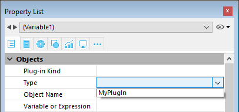

プラグインエリアは、プラグインによりすべてが制御されるフォーム上のエリアです。 フォームにプラグインエリアを追加できることで、カスタムアプリケーションを作成する際の可能性が限りなく広がります。 プラグインでは、フォーム上にデジタル時計を表示するような単純な処理や、完全に機能するワープロ、スプレッドシート、グラフィック機能などを提供するなどの複雑な処理を実行できます。

アプリケーションを開く際、4Dは [アプリケーションにインストール](#プラグインのインストール) されたプラグインのリストを内部的に作成します。 プラグインエリアをフォームに挿入すると、そのプロパティリスト内の **タイプ** リスト ("オブジェクト"テーマ内) にて、プラグインを割り当てることができます:

> 一部のプラグイン (4D Internet Commands など) はフォームやプラグインウインドウで使用することができません。 プラグインがフォームで使用できない場合、そのプラグインはプロパティリストに候補として表示されません。

作成したプラグインエリアが小さすぎる場合、4Dはエリアをボタンとして表示し、エリアに割り当てられた変数名がそのタイトルに使用されます。 実行時ユーザーはこのボタンをクリックしてプラグインを表示するためのウィンドウを開くことができます。

## 詳細オプション

プラグインの作成者が詳細オプションを提供していると、プロパティリストの **プラグイン** テーマ内に [**詳細設定**](properties_Plugins.md) ボタンが使用可能になることがあります。 この場合ボタンをクリックすると、プラグインの制作元によるカスタムダイアログにてそれらのオプションを設定することができます。

## プラグインのインストール

プラグインを 4D環境にインストールするには、まず 4Dを終了する必要があります。 4Dは起動時にプラグインをロードします。 プラグインのインストールに関する詳細は [プラグインやコンポーネントのインストール](https://doc.4d.com/4Dv18/4D/18/Installing-plugins-or-components.300-4575696.ja.html) を参照してください。

## プラグインの利用

独自にプラグインを作成したい場合、オープンソースのプラグイン制作キットを使用することができます。 このキットの入手およびプラグイン作成に関する情報は [(github上にある) 完全なキット](https://github.com/4d/4D-Plugin-SDK) を参照してください。

## プロパティ一覧

[タイプ](properties_Object.md#タイプ) - [プラグインの種類](properties_Object.md#プラグインの種類) - [オブジェクト名](properties_Object.md#オブジェクト名) - [変数あるいは式](properties_Object.md#変数あるいは式) - [式の型](properties_Object.md#式の型) - [CSSクラス](properties_Object.md#cssクラス) - [詳細設定](properties_Plugins.md) - [左](properties_CoordinatesAndSizing.md#左) - [上](properties_CoordinatesAndSizing.md#上) - [右](properties_CoordinatesAndSizing.md#右) - [下](properties_CoordinatesAndSizing.md#下) - [幅](properties_CoordinatesAndSizing.md#幅) - [高さ](properties_CoordinatesAndSizing.md#高さ) - [横方向サイズ変更](properties_ResizingOptions.md#横方向サイズ変更) - [縦方向サイズ変更](properties_ResizingOptions.md#縦方向サイズ変更) - [フォーカス可](properties_Entry.md#フォーカス可) - [表示状態](properties_Display.md#表示状態) - [境界線スタイル](properties_BackgroundAndBorder.md#境界線スタイル) - [メソッド](properties_Action.md#メソッド) - [ドラッグ有効](properties_Action.md#ドラッグ有効) - [ドロップ有効](properties_Action.md#ドロップ有効)
