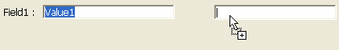

---

## ドラッグ有効

ユーザーによるオブジェクトのドラッグを制御します。 デフォルトでは、ドラッグ操作は禁止されています。

二つのドラッグモードが提供されています:

- **カスタム**: このモードでは、オブジェクトに対しておこなわれたドラッグ操作は、当該オブジェクトのコンテキストにおいて `On Begin Drag` フォームイベントを発生させます。 これを利用して、開発者はメソッドを用いてドラッグアクションを管理しなければなりません。 つまり、カスタムモードにおいては、ドラッグ＆ドロップ操作のすべてが開発者により管理されます。 このモードでは、ドラッグ＆ドロップに基づいたあらゆるインターフェースを実装することができます。これにはデータの転送を必ずしも伴わないものも含まれ、ファイルを開くや計算をトリガーするなどの任意のアクションを実行することができます。 このモードは専用のプロパティ、イベント、`ペーストボード` テーマのコマンド等の組み合わせに基づいています。
- **自動**: このモードでは、ドラッグ元のフォームオブジェクトからテキストやピクチャーが 4D によって **コピー** されます。 このコピーは、同じ 4Dエリア内、2つの 4Dエリア間、4D と他のアプリケーション間で使用できます。 たとえば、自動ドラッグ (＆ドロップ) を使用して、プログラムを使用せず、2つのフィールド間で値をコピーできます:  
    
   このモードでは、`On Begin Drag` フォームイベントは生成されません。 自動ドラッグが有効のときに標準のドラッグを "強制" したい場合、アクションの間 **Alt** (Windows) または **Option** (macOS) キーを押しながら操作します。 このオプションはピクチャーでは利用できません。

詳細については *4Dランゲージリファレンス* マニュアルの [ドラッグ＆ドロップ](https://doc.4d.com/4Dv18/4D/18/Drag-and-Drop.300-4505037.ja.html) を参照してください。

#### JSON 文法

| 名称       | データタイプ | とりうる値                                              |
| -------- | ------ | -------------------------------------------------- |
| dragging | テキスト   | "none" (デフォルト), "custom", "automatic" (リストボックスを除く) |

#### 対象オブジェクト

[4D Write Pro エリア](writeProArea_overview.md) - [入力](input_overview.md) - [階層リスト](list_overview.md) - [リストボックス](listbox_overview.md) - [プラグインエリア](pluginArea_overview.md)

#### 参照

[ドロップ有効](#ドロップ有効)

---

## ドロップ有効

ユーザーがドラッグ＆ドロップしたデータをオブジェクトが受け取ることができるかどうかを制御します。

二つのドロップモードが提供されています:

- **カスタム**: このモードでは、オブジェクトに対しておこなわれたドロップ操作は、当該オブジェクトのコンテキストにおいて `On Drag Over` と `On Drop` フォームイベントを発生させます。 これを利用して、開発者はメソッドを用いてドロップアクションを管理しなければなりません。 つまり、カスタムモードにおいては、ドラッグ＆ドロップ操作のすべてが開発者により管理されます。 このモードでは、ドラッグ＆ドロップに基づいたあらゆるインターフェースを実装することができます。これにはデータの転送を必ずしも伴わないものも含まれ、ファイルを開くや計算をトリガーするなどの任意のアクションを実行することができます。 このモードは専用のプロパティ、イベント、`ペーストボード` テーマのコマンド等の組み合わせに基づいています。
- **自動**: このモードでは、4D は可能な限り自動で、オブジェクトにドロップされたテキストやピクチャー型データの挿入を管理します (データはオブジェクトにペーストされます)。 このモードでは、`On Drag Over` と `On Drop` フォームイベントは生成されません。 他方、ドロップ中の `On After Edit` とオブジェクトがフォーカスを失った時の `On Data Change` イベントは生成されます。

詳細については *4Dランゲージリファレンス* マニュアルの [ドラッグ＆ドロップ](https://doc.4d.com/4Dv18/4D/18/Drag-and-Drop.300-4505037.ja.html) を参照してください。

#### JSON 文法

| 名称       | データタイプ | とりうる値                                              |
| -------- | ------ | -------------------------------------------------- |
| dropping | テキスト   | "none" (デフォルト), "custom", "automatic" (リストボックスを除く) |

#### 対象オブジェクト

[4D Write Pro エリア](writeProArea_overview.md) - [ボタン](button_overview.md) - [入力](input_overview.md) - [階層リスト](list_overview.md) - [リストボックス](listbox_overview.md) - [プラグインエリア](pluginArea_overview.md)

#### 参照

[ドラッグ有効](#ドラッグ有効)

---

## オブジェクトメソッド実行

このオプションを選択した場合、ユーザーがインジケーターの値を変更すると *同時に* `On Data Change` イベントが生成され、オブジェクトメソッドが実行されます。 デフォルトでは、*変更後に* メソッドが実行されます。

#### JSON 文法

| 名称                  | データタイプ  | とりうる値       |
| ------------------- | ------- | ----------- |
| continuousExecution | boolean | true, false |

#### 対象オブジェクト

[進捗インジケーター](progressIndicator.md) - [ルーラー](ruler.md) - [ステッパー](stepper.md)

---

## メソッド

オブジェクトに関連づけられたメソッドへの参照。 オブジェクトメソッドは通常、フォームが表示または印刷されている間、オブジェクトを "管理" します。 オブジェクトメソッドは呼び出す必要がありません。オブジェクトメソッドが関連づけられているオブジェクトに関わるイベントが発生した場合、4D は自動的にオブジェクトメソッドを呼び出します。

メソッド参照にはいくつかのタイプが利用可能です:

- 標準のオブジェクトメソッドファイルパス:   
  `ObjectMethods/objectName.4dm`  
  (`objectName` には実際の [オブジェクト名](properties_Object.md#オブジェクト名) が入ります)。 このタイプの参照は、当該メソッドファイルがデフォルトの場所 ("sources/forms/*formName*/ObjectMethods/") にあることを示します。 この場合、エディター上でフォームオブジェクトに対して操作 (名称変更、複製、コピー/ペーストなど) がおこなわれると、4D はこれらの変更を自動的にオブジェクトメソッドに反映させます。

- 拡張子を省いた既存のプロジェクトメソッド名: `myMethod`。この場合、フォームオブジェクトに対して操作がおこなわれても、4D はそれらの変更を自動で反映しません。

- .4dm 拡張子を含むカスタムのメソッドファイルパス:  
  `../../CustomMethods/myMethod.4dm`。 ファイルシステムも使用できます:  
  `/RESOURCES/Buttons/bOK.4dm`。 この場合、フォームオブジェクトに対して操作がおこなわれても、4D はそれらの変更を自動反映しません。

#### JSON 文法

| 名称     | データタイプ | とりうる値                                      |
| ------ | ------ | ------------------------------------------ |
| method | テキスト   | オブジェクトメソッドの標準またはカスタムのファイルパス、またはプロジェクトメソッド名 |

#### 対象オブジェクト

[4D View Pro エリア](viewProArea_overview.md) - [4D Write Pro エリア](writeProArea_overview.md) - [ボタン](button_overview.md) - [ボタングリッド](buttonGrid_overview.md) - [チェックボックス](checkbox_overview.md) - [コンボボックス](comboBox_overview.md) - [ドロップダウンリスト](dropdownList_Overview.md) - [フォーム](FormEditor/forms.md) - [階層リスト](list_overview.md) - [入力](input_overview.md) - [リストボックス](listbox_overview.md) - [リストボックス列](listbox_overview.md#リストボックス列) - [ピクチャーボタン](pictureButton_overview.md) - [ピクチャーポップアップメニュー](picturePopupMenu_overview.md) - [プラグインエリア](pluginArea_overview.md) - [進捗インジケーター](progressIndicator.md) - [ラジオボタン](radio_overview.md) - [ルーラー](ruler.md) - [スピナー](spinner.md) - [スプリッター](splitters.md) - [ステッパー](stepper.md) - [サブフォーム](subform_overview.md) - [タブコントロール](tabControl.md) - [Web エリア](webArea_overview.md)

---

## 行の移動可

`配列型リストボックス`

ランタイムにおける行の移動を許可します。 このオプションはデフォルトで選択されています。 [セレクション型のリストボックス](listbox_overview.md#セレクションリストボックス) および [階層リストボックス](properties_Hierarchy.md#階層リストボックス) では、このオプションは提供されていません。

#### JSON 文法

| 名称          | データタイプ  | とりうる値       |
| ----------- | ------- | ----------- |
| movableRows | boolean | true, false |

#### 対象オブジェクト

[リストボックス](listbox_overview.md#概要)

---

## 複数選択可

[階層リスト](list_overview.md) において、複数項目の選択を許可します。

#### JSON 文法

| 名称            | データタイプ | とりうる値                        |
| ------------- | ------ | ---------------------------- |
| selectionMode | テキスト   | "multiple", "single", "none" |

#### 対象オブジェクト

[階層リスト](list_overview.md)

---

## ソート可

[リストボックス](listbox_overview.md) ヘッダーのクリックによる列データの並べ替えを有効にします。 このオプションはデフォルトで選択されています。 ピクチャー型配列 (列) はこのメカニズムではソートできません。

レコードセレクションに基づくリストボックスの場合、標準のソート機能は以下の場合のみ有効です:

- データソースが *カレントセレクション* であり、
- その列にフィールドが割り当てられていること (文字、数値、日付、時間、およびブール型)。

他の場合 (命名セレクションに基づくリストボックスや、式が割り当てられた列)、標準のソート機能は動作しません。 標準のリストボックスソートは、データベースのカレントセレクションの順番を変更します。 しかし、ハイライトされたレコードとカレントレコードは変更されません。 標準の並び替えは、リストボックスのすべての列 (式が割り当てられた列も含む) を同期します。

#### JSON 文法

| 名称       | データタイプ  | とりうる値       |
| -------- | ------- | ----------- |
| sortable | boolean | true, false |

#### 対象オブジェクト

[リストボックス](listbox_overview.md)

---

## 標準アクション

アクティブオブジェクトにより実行される典型的な処理 (*例*: レコードの入力・取り消し・削除、レコード間の移動、マルチページフォームでのページ間の移動、など) は、4D より標準アクションとして提供されています。 詳細な情報に関しては、*デザインリファレンス* の [標準アクション](https://doc.4d.com/4Dv18/4D/18/Standard-actions.300-4575620.ja.html) の章を参照ください。

フォームオブジェクトには、標準アクションとメソッドの両方を割り当てることができます。 この場合、標準アクションは通常、メソッドの後に実行されます。また、4D はこのアクションを使用して、カレントコンテキストに応じてオブジェクトを有効化/無効化します フォームオブジェクトが無効化されていると、関連づけられたメソッドは実行されません。

このプロパティは `OBJECT SET ACTION` コマンドによって設定することができます。

#### JSON 文法

| 名称     | データタイプ | とりうる値                                                                              |
| ------ | ------ | ---------------------------------------------------------------------------------- |
| action | string | 有効な [標準アクション](https://doc.4d.com/4Dv18/4D/18/Standard-actions.300-4575620.ja.html) |

#### 対象オブジェクト

[ボタン](button_overview.md) - [ボタングリッド](buttonGrid_overview.md) - [チェックボックス](checkbox_overview.md) - [ドロップダウンリスト](dropdownList_Overview.md) - [リストボックス](listbox_overview.md) - [ピクチャーボタン](pictureButton_overview.md) - [ピクチャーポップアップメニュー](picturePopupMenu_overview.md) - [タブコントロール](tabControl.md)
