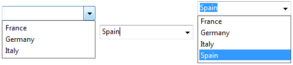

## 自動挿入

このオプションがチェックされていると、オブジェクトに関連付けられたリストにない値をユーザーが入力した場合に、その値が自動的にメモリー内のリストに追加されます。

**自動挿入** のオプションが設定されていない場合 (デフォルト)、入力された値はフォームオブジェクトの中には保存されますが、メモリー内のリストには入力されません。

このプロパティは次のフォームオブジェクトでサポートされています:

- 選択リストと紐づけられている [コンボボックス](comboBox_overview.md) および [リストボックス列](listbox_overview.md#リストボックス列) フォームオブジェクト。
- 配列またはオブジェクトデータソースにより、紐づけられたリストが生成されている [コンボボックス](comboBox_overview.md) フォームオブジェクト。

たとえば、"France, Germany, Italy" という値を含む選択リストが "Countries" というコンボボックスに関連付けられていた場合を考えます。**自動挿入** のオプションがチェックをされていて、ユーザーが "Spain" という値を入力すると、"Spain" という値が自動的にメモリー内のリストに追加されます:

> デザインモードで定義された選択リストが関連付けられている場合、自動挿入によって、その元のリストが変更されることはありません。

#### JSON 文法

| 名称                 | データタイプ | とりうる値       |
| ------------------ | ------ | ----------- |
| automaticInsertion | ブール    | true, false |

#### 対象オブジェクト

[コンボボックス](comboBox_overview.md) - [リストボックス列](listbox_overview.md#リストボックス列)

---

## 選択リスト

選択リストをフォームオブジェクトに関連づけます。 指定できるのは選択リスト名 (リストの参照) またはデフォルト値のコレクションです。

選択リストをオブジェクトに紐づけるには、[OBJECT SET LIST BY NAME](https://doc.4d.com/4dv19/help/command/ja/page237.html) または [OBJECT SET LIST BY REFERENCE](https://doc.4d.com/4dv19/help/command/ja/page1266.html) コマンドを使ってもおこなえます。

#### JSON 文法

| 名称         | データタイプ           | とりうる値                |
| ---------- | ---------------- | -------------------- |
| choiceList | list, collection | 選択可能な値のリスト           |
| list       | list, collection | 選択可能な値のリスト (階層リストのみ) |

#### 対象オブジェクト

[ドロップダウンリスト](dropdownList_Overview.md) - [コンボボックス](comboBox_overview.md) - [階層リスト](list_overview.md) - [リストボックス列](listbox_overview.md#リストボックス列)

---

## 選択リスト (静的リスト)

タブコントロールオブジェクトのラベルとして使用する静的な値のリスト。

#### JSON 文法

| 名称     | データタイプ           | とりうる値                  |
| ------ | ---------------- | ---------------------- |
| labels | list, collection | タブコントロールラベルに使用する値のリスト。 |

#### 対象オブジェクト

[タブコントロール](tabControl.md)

---

## カレントの項目

`コレクションまたはエンティティセレクションリストボックス`

ユーザーによって選択されたコレクション要素/エンティティが割り当てられる変数あるいは式を指定します。 オブジェクト変数あるいはオブジェクトを受け入れる割り当て可能な式を使用する必要があります。 ユーザーが何も選択しなかった場合、あるいはスカラー値のコレクションを使用した場合、Null 値が割り当てられます。
> このプロパティは「読み取り専用」であり、リストボックスにおけるユーザーアクションに基づいて自動的に更新されます。 この値を編集してリストボックスの選択状態を変更することはできません。

#### JSON 文法

| 名称                | データタイプ | とりうる値     |
| ----------------- | ------ | --------- |
| currentItemSource | string | オブジェクト型の式 |

#### 対象オブジェクト

[リストボックス](listbox_overview.md#概要)

---

## カレントの項目の位置

`コレクションまたはエンティティセレクションリストボックス`

ユーザーによって選択されたコレクション要素/エンティティの位置を表す倍長整数が割り当てられる変数あるいは式を指定します。

- 要素/エンティティが選択されていない場合、変数あるいは式は 0 を受け取ります。
- 単一の要素/エンティティが選択されている場合、変数あるいは式はその位置を受け取ります。
- 複数の要素/エンティティが選択されている場合、変数あるいは式は最後に選択された要素/エンティティの位置を受け取ります。
> このプロパティは「読み取り専用」であり、リストボックスにおけるユーザーアクションに基づいて自動的に更新されます。 この値を編集してリストボックスの選択状態を変更することはできません。

#### JSON 文法

| 名称                        | データタイプ | とりうる値 |
| ------------------------- | ------ | ----- |
| currentItemPositionSource | string | 数値型の式 |

#### 対象オブジェクト

[リストボックス](listbox_overview.md)

---

## データタイプ (式の型)

表示される式のデータタイプを定義します。 このプロパティは次のフォームオブジェクトで使用されます:

- セレクションおよびコレクション型の [リストボックス列](listbox_overview.md#リストボックス列)。
- オブジェクトまたは配列と紐づいた [ドロップダウンリスト](dropdownList_Overview.md)。

[式タイプ](properties_Object.md#式の型式タイプ) の章も参照ください。

#### JSON 文法

| 名称                 | データタイプ | とりうる値                                              |
| ------------------ | ------ | -------------------------------------------------- |
| dataSourceTypeHint | string | <li>**リストボックス列:** "boolean", "number", "picture", "text", date", "time"。 *配列/セレクションリストボックスのみ*: "integer", "object"</li><li>**ドロップダウンリスト:** "object", "arrayText", "arrayDate", "arrayTime", "arrayNumber"</li> |

#### 対象オブジェクト

オブジェクトまたは配列と紐づいた [ドロップダウンリスト](dropdownList_Overview.md) - [リストボックス列](listbox_overview.md#リストボックス列)

---

## データタイプ (リスト)

[ドロップダウンリスト](dropdownList_Overview.md) に関連づけられたフィールドまたは変数に保存するデータの種類を定義します。 このプロパティは次のフォームオブジェクトで使用されます:

- [選択リストと紐づいた](dropdownList_Overview.md#選択リストの使用) ドロップダウンリスト。
- [階層型の選択リストと紐づいた](dropdownList_Overview.md#階層型選択リストの使用) ドロップダウンリスト

次の値が提供されています:

- **リスト参照**: ドロップダウンリストが階層型であることを宣言します。 このドロップダウンリストは最大で 2つの階層レベルを表示することができ、その内容は **Hierarchical Lists** テーマの4Dランゲージコマンドで管理することができます。
- **選択された項目値** (デフォルト): ドロップダウンリストは階層型でなく、ユーザーによって選択された項目の値が直接保存されます。 たとえば、ユーザーが "Blue" という値を選択した場合、この値がフィールドに保存されます。
- **選択された項目参照**: ドロップダウンリストは階層型でなく、選択リスト項目の参照がオブジェクトに保存されます。 この参照番号とは [`APPEND TO LIST`](https://doc.4d.com/4dv19/help/command/ja/page376.html) または [`SET LIST ITEM`](https://doc.4d.com/4dv19/help/command/ja/page385.html) コマンドの *itemRef* パラメーター、またはリストエディターを通してそれぞれの項目と関連付けされた数値です。 このオプションにより、メモリーを節約することができます。フィールドに数値を保存するのは文字列を保存するより容量が軽いからです。 また、これによりアプリケーションの翻訳が簡単になります。同じ項目の参照値を持つ、異なる言語で書かれた複数のリストを用意しておいて、アプリケーションの言語に応じたリストをロードするだけで多言語に対応できるからです。

**選択された項目参照** オプションの使用の際には、以下の点に注意する必要があります:

- 参照を保存するには、データソースのフィールドまたは変数は、数値型である必要があります (リスト内に表示されている値の型とは関係ありません)。 [式の型](properties_Object.md#式の型式タイプ) プロパティは自動的に設定されます。
- リストの項目には有効かつ固有の参照が関連付けられている必要があります。
- ドロップダウンリストはフィールドまたは変数と紐づいている必要があります。

#### JSON 文法

| 名称     | データタイプ | とりうる値                |
| ------ | ------ | -------------------- |
| saveAs | string | "value", "reference" |

> このプロパティと、新規レコードのフィールド値を定義するのに使える入力オブジェクトの [デフォルト値](properties_RangeOfValues.md#デフォルト値) を混同しないようにしてください。

#### 対象オブジェクト

リストと紐づいた [ドロップダウンリスト](dropdownList_Overview.md)

---

## デフォルト値

配列型リストボックスにおいて、リストボックス列のデフォルト値として使用される値のリストです。 これらの値は自動で、フォームを実行したときにその列に割り当てられた [配列変数](properties_Object.md#変数あるいは式) に代入されます。 この配列を参照することで、ランゲージを使ってオブジェクトを管理することができます。

> このプロパティと、新規レコードのフィールド値を定義するのに使える入力オブジェクトの [デフォルト値](properties_RangeOfValues.md#デフォルト値) を混同しないようにしてください。

デフォルト値のリストを入力します。 フォームエディター上で専用のダイアログが開き、改行で区切られた値を入力することができます。

> リストボックス列に [選択リスト](properties_DataSource.md#選択リスト) を定義することもできます。 選択リストは列の各行において選択可能な値の候補として使用されますが、デフォルト値のリストはカラムの各行に上から順に割り当てられます。

#### JSON 文法

| 名称     | データタイプ     | とりうる値                                      |
| ------ | ---------- | ------------------------------------------ |
| values | collection | デフォルト値 (文字列) のコレクション。例: "a", "b", "c", "d" |

#### 対象オブジェクト

[リストボックス列 (配列型のみ)](listbox_overview.md#リストボックス列)

---

## 式

[セレクション型](listbox_overview.md#セレクションリストボックス) および [コレクション / エンティティセレクション型](listbox_overview.md#コレクションまたはエンティティセレクションリストボックス) リストボックスのプロパティです。 **[変数あるいは式](properties_Object.md#変数あるいは式)** の章も参照ください。

列に割り当てる 4D式です。 以下のものを指定できます:

- **単純な変数** (この場合、コンパイル用に明示的に型宣言されている必要があります)。 BLOB と配列型以外のどんな型の変数も使用することができます。 変数の値は通常 `On Display Detail` イベントで計算されます。

- 標準の [Table]Field シンタックスを使用した **フィールド** ([セレクション型リストボックス](listbox_overview.md#セレクションリストボックス) のみ)。例: `[Employees]LastName`。 以下の型のフィールドを使用できます:
  - 文字列
  - 数値
  - Date
  - Time
  - ピクチャー
  - ブール  
    マスターテーブルおよび他のテーブルのフィールドを指定できます。

- **4D式** (単純な式、フォーミュラ、または 4Dメソッド)。 式は値を返す必要があります。 値は `On Display Detail` および `On Data Change` イベントで評価されます。 式の結果は、アプリケーションモードでフォームを実行すると自動で表示されます。 式は、セレクション型リストボックスではマスターテーブルの (カレントまたは命名) セレクションの各レコードごとに、コレクション型リストボックスではコレクションの各要素ごとに、エンティティセレクション型リストボックスではセレクションのエンティティごとに評価されます。 空の場合、列には何も表示されません。 以下の型の式がサポートされています:
  - 文字列
  - 数値
  - Date
  - ピクチャー
  - ブール

 コレクション/エンティティセレクション型リストボックスにおいては、Null あるいはサポートされない型は空の文字列として表示されます。  
コレクションあるいはエンティティセレクションを使用する場合、カラムに割り当てられた要素プロパティ/エンティティ属性は、通常 [This](https://doc.4d.com/4Dv18/4D/18/This.301-4504875.ja.html) を含む式を用いて宣言します。 この `This` は現在処理中の要素への参照を返す、専用の 4Dコマンドです。 たとえば、`This.\<propertyPath>` (ここでの `\<propertyPath>` はコレクションのプロパティパス、あるいはエンティティ属性パス) を使用することで、各要素/エンティティのカレントの値にアクセスすることができます。 スカラー値のコレクションを使用した場合、4D は各コレクション要素に対して、単一のプロパティ (名前は "value") を持つオブジェクトを作成し、それに要素の値を格納します。 この場合、`This.value` を式として使用します。

 [代入不可な式](Concepts/quick-tour.md#式) (例: `[Person]FirstName+" "+[Person]LastName` など) を使用した場合、[入力可](properties_Entry.md#入力か) オプションが選択されていても、その列に値を入力することはできません。

フィールド、変数、あるいは代入可能な式 (*例: Person.lastName*) を使用した場合、[入力可](properties_Entry.md#入力可) プロパティの設定に基づき列への入力可/不可が決定されます。

#### JSON 文法

| 名称         | データタイプ | とりうる値                     |
| ---------- | ------ | ------------------------- |
| dataSource | string | 4D変数、フィールド名、あるいは任意のランゲージ式 |

#### 対象オブジェクト

[リストボックス列](listbox_overview.md#リストボックス列)

---

## マスターテーブル

`カレントセレクションリストボックス`

使用するカレントセレクションが属するテーブルを指定します。 このテーブルとそのカレントセレクションが、リストボックスの列に割り当てられたフィールドの参照を形成します (フィールド参照やフィールドを含む式)。 ある列が他のテーブルのフィールドを参照しているとしても、表示される行の数はマスターテブルのカレントレコード数となります。

すべてのデータベーステーブルが利用できます。フォームがテーブルに属しているか (テーブルフォームの場合) あるいは属していないか (プロジェクトフォーム) は関係ありません。

#### JSON 文法

| 名称    | データタイプ | とりうる値  |
| ----- | ------ | ------ |
| table | number | テーブル番号 |

#### 対象オブジェクト

[リストボックス](listbox_overview.md#概要)

---

## 関連付け

このプロパティは以下の場合に表示されます:

- オブジェクトに対して [選択リスト](#選択リスト) が割り当てられている
- [入力](input_overview.md) および [リストボックス列](listbox_overview.md#リストボックス列) の場合には、ユーザーがリスト内の値のみ入力できるように、オブジェクトに対して [指定リスト](properties_RangeOfValues.md#指定リスト) も定義されている (通常は両方のオプションで同じリストを使用しているはずです)。

このプロパティは、選択リストに関連付けされたフィールドまたは変数において、フィールドに保存する内容の型を指定します:

- **リスト項目の値** (デフォルトのオプション): ユーザーによって選択された項目の値が直接保存されます。 たとえば、ユーザーが "Blue" という値を選択した場合、この値がフィールドに保存されます。
- **リスト項目の参照番号**: 選択リスト項目の参照がオブジェクトに保存されます。 この参照番号とは [`APPEND TO LIST`](https://doc.4d.com/4dv19/help/command/ja/page376.html) または [`SET LIST ITEM`](https://doc.4d.com/4dv19/help/command/ja/page385.html) コマンドの *itemRef* パラメーター、またはリストエディターを通してそれぞれの項目と関連付けされた数値です。

このオプションにより、メモリーを節約することができます。フィールドに数値を保存するのは文字列を保存するより容量が軽いからです。 また、これによりアプリケーションの翻訳が簡単になります。同じ項目の参照値を持つ、異なる言語で書かれた複数のリストを用意しておいて、アプリケーションの言語に応じたリストをロードするだけで多言語に対応できるからです。

リスト項目の参照番号の使用の際には、以下の点に注意する必要があります:

- 参照を保存するには、データソースのフィールドまたは変数は、数値型である必要があります (リスト内に表示されている値の型とは関係ありません)。 [式の型](properties_Object.md#式の型式タイプ) プロパティは自動的に設定されます。
- リストの項目には有効かつ固有の参照が関連付けられている必要があります。

#### JSON 文法

| 名称     | データタイプ | とりうる値                |
| ------ | ------ | -------------------- |
| saveAs | string | "value", "reference" |

#### 対象オブジェクト

[入力](input_overview.md) - [リストボックス列](listbox_overview.md#リストボックス列)

---

## 選択された項目

`コレクションまたはエンティティセレクションリストボックス`

ユーザーによって選択されている一つ以上のコレクション要素/エンティティが割り当てられる変数あるいは式を指定します。

- コレクションリストボックスにおいては、コレクション変数あるいはコレクションを受け入れる割り当て可能な式を使用する必要があります。
- エンティティセレクションリストボックスにおいては、エンティティセレクションオブジェクトがビルドされます。 オブジェクト変数あるいはオブジェクトを受け入れる割り当て可能な式を使用する必要があります。
> このプロパティは「読み取り専用」であり、リストボックスにおけるユーザーアクションに基づいて自動的に更新されます。 この値を編集してリストボックスの選択状態を変更することはできません。

#### JSON 文法

| 名称                  | データタイプ | とりうる値                                      |
| ------------------- | ------ | ------------------------------------------ |
| selectedItemsSource | string | Assignable collection or object expression |

#### 対象オブジェクト

[リストボックス](listbox_overview.md#概要)

---

## 命名セレクション

`命名セレクションリストボックス`

使用する命名セレクションを指定します。 有効な命名セレクションの名前を入力しなければなりません。 使用できるのはプロセスあるいはインタープロセス命名セレクションです。 リストボックスの内容はこのセレクションに基づきます。 選択された命名セレクションは、リストボックスが表示される時点で存在し、有効でなければなりません。そうでない場合、リストボックスは空で表示されます。

> 命名セレクションはソート済みのレコードリストです。 これはセレクション中のカレントレコードと並び順をメモリーに保持するために使用されます。 詳細は、*4Dランゲージリファレンス マニュアル* の **命名セレクション** を参照してください。

#### JSON 文法

| 名称             | データタイプ | とりうる値       |
| -------------- | ------ | ----------- |
| namedSelection | string | 命名セレクションの名前 |

#### 対象オブジェクト

[リストボックス](listbox_overview.md#概要)
