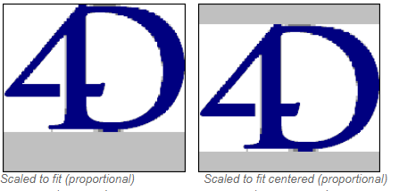
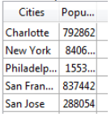

---

## 文字フォ－マット

文字フォーマットは、表示や印刷時に文字フィールドや変数にデータを表示する方法を制御します。 以下は文字フィールド用に提供されるフォーマットのリストです:

このリストからフォーマットを選択するか、コンボボックスに入力すことができます。 フォーマットポップアップメニューには、主に使用される文字フォーマット (電話番号等) が用意されています。 また、ツールボックスのフィルターとフォーマットで設定したカスタムフォーマットを選択することもできます。 この場合、そのフォーマットをオブジェクトプロパティで変更することはできません。 開発者が作成したカスタムフォーマットやフィルターはリストの先頭に表示されます。

シャープ (#) は文字表示フォーマットのプレースホルダーです。 ハイフンやスペース、その他の句読点を表示したい場所に挿入できます。 表示したい実際の句読点と、文字データを表示する場所には # を置きます。

たとえば部品番号が "RB-1762-1" のようなフォーマットの時、

文字フォーマットを以下のように書けます:

 ##-####-#

ユーザーが “RB17621” と入力すると、フィールドには以下の通りに表示されます:

 RB-1762-1

フィールドに実際に格納される値は “RB17621” です。

フォーマットが許可するよりも多くの文字が入力されると、4Dは最後の文字を表示します。 たとえばフォーマットが以下の時:

 (#######)

そしてユーザーが “proportion” と入力すると、フィールドには以下のように表示されます:

 (portion)

フィールドには “proportion” が格納されます。 表示フォーマットにかかわらず、4Dは入力された文字を受け入れ、格納します。 データが失われることはありません。

#### JSON 文法

| 名称         | データタイプ | とりうる値                                                                            |
| ---------- | ------ | -------------------------------------------------------------------------------- |
| textFormat | string | "### ####", "(###) ### ####", "### ### ####", "### ## ####", "00000", カスタムフォーマット |

#### 対象オブジェクト

[コンボボックス](comboBox_overview.md) - [ドロップダウンリスト](dropdownList_Overview.md) - [リストボックス列](listbox_overview.md#リストボックス列) - [リストボックスフッター](listbox_overview.md#リストボックスフッター)

---

## 日付フォーマット

日付フォーマットは、表示や印刷時に日付を表示する方法を制御します。 データ入力の際は選択した表示フォーマットとは関係なく、YYYY/MM/DD 形式で日付を入力します。
> [数値フォーマット](#数値フォーマット) や [文字フォ－マット](#文字フォ－マット) と異なり、日付表示フォ－マットは4Dの組み込みフォーマットのなかから選択しなければなりません。

利用可能な日付表示フォーマットは以下のとおりです:

| フォーマット                          | JSON 文字列            | 例                             |
| ------------------------------- | ------------------- | ----------------------------- |
| System date short               | systemShort (デフォルト) | 20/03/25                      |
| System date abbreviated *(1)*   | systemMedium        | 2020/03/25                    |
| System date long                | systemLong          | 2020年3月25日 水曜日                |
| RFC 822                         | rfc822              | Tue, 25 Mar 2020 22:00:00 GMT |
| Short Century                   | shortCentury        | 03/25/20、ただし 04/25/2032 *(2)* |
| Internal date long              | long                | March 25, 2020                |
| Internal date abbreviated *(1)* | abbreviated         | Mar 25, 2020                  |
| Internal date short             | short               | 03/25/2020                    |
| ISO Date Time *(3)*             | iso8601             | 2020-03-25T00:00:00           |

*(1)* "June" は "Jun"、”July” は "Jul" に省略されます。

*(2)* 年は、1930年~2029年の間は2桁の数字で表示されますが、それ以外の場合は4桁で表示されます。 これはデフォルト設定ですが、[SET DEFAULT CENTURY](https://doc.4d.com/4Dv18/4D/18/SET-DEFAULT-CENTURY.301-4505667.ja.html) コマンドで変更することができます。

*(3)* `ISO Date Time` フォーマットは XML の日付と時間表現の標準 (ISO8601) に対応します。 これは主に XML フォーマットや Web サービスのデータを読み込んだり書き出したりするために使用します。
> 表示フォーマットにかかわらず、年度を2 桁で入力すると、4D は年が00~29 の間であれば 21 世紀とみなし、30~99 の間であれば 20 世紀とみなします。 これはデフォルト設定ですが、[SET DEFAULT CENTURY](https://doc.4d.com/4Dv18/4D/18/SET-DEFAULT-CENTURY.301-4505667.ja.html) コマンドで変更することができます。

#### JSON 文法

| 名称         | データタイプ | とりうる値                                                                                                                                               |
| ---------- | ------ | --------------------------------------------------------------------------------------------------------------------------------------------------- |
| dateFormat | string | "systemShort", "systemMedium", "systemLong", "iso8601", "rfc822", "short", "shortCentury", "abbreviated", "long", "blankIfNull" (他の値と組み合わせることができます) |

#### 対象オブジェクト

[コンボボックス](comboBox_overview.md) - [ドロップダウンリスト](dropdownList_Overview.md) - [入力](input_overview.md) - [リストボックス列](listbox_overview.md#リストボックス列) - [リストボックスフッター](listbox_overview.md#リストボックスフッター)

---

## 数値フォーマット
> 数値フィールドには整数、倍長整数、整数64bit、実数、そしてフロート型が含まれます。

数値フォーマットは表示や印刷時に数値を表示する方法を制御します。 選択した表示フォーマットとは関係なく、データ入力の際は数値だけを (必要に応じ小数点やマイナス記号も) 入力します。

4Dは様々なデフォルトの数値表示フォーマットを提供しています。

### プレースホルダー

それぞれの数値表示フォーマットでは、数値記号 (#)、ゼロ (0)、キャレット (^)、アスタリスク (*) をプレースホルダーとして使用します。 表示しようとする各桁に対して 1つのプレースホルダーを使用し、独自の数値表示フォーマットを作成できます。

| プレースホルダー | 千項及び末尾のゼロ   |
| -------- | ----------- |
| #        | 何も表示しない     |
| 0        | 0を表示        |
| ^        | スペースを表示 (1) |
| *        | アスタリスクを表示   |

(1) キャレット (^) は、ほとんどのフォントの数字と同じ幅を占めるスペースを生成します。

たとえば、3桁の数字を表示する場合、###というフォーマットを使用できます。 フォーマットにより許可された桁数を超えて入力すると、4Dは <<< をフィールドに表示し、表示フォーマットで指定された桁数を超える入力がおこなわれたことを示します。

ユーザーがマイナスの数値を入力すると、左端の文字はマイナス記号として表示されます (負数の表示フォーマットが指定されていない場合)。 ##0というフォーマットであれば、マイナス 26 は -26 と表示されます。マイナス260 は <<< と表示されますが、これはプレースホルダーが 3桁分しか指定されていないところに、マイナス記号により 1つのプレースホルダが使用されてしまい、桁あふれしたためです。
> 表示フォ－マットとは関係なく、4Dはフィ－ルドに入力された数値を受け入れ、保存します。 データが失われることはありません。

各プレースホルダー文字は、先行のゼロや末尾のゼロを表示する上で、その効果に違いがあります。 先行のゼロとは小数点より左側の数値の先頭にあるゼロのことです。末尾のゼロは小数点より右側の数値の終わりにあるゼロのことです。

たとえば ##0 というフォーマットを使用して 3桁の数字を表示するものとします。 ユーザーがフィールドに何も入力しないと、フィールドには 0 が表示されます。 26 と入力すると、フィールドには 26 と表示されます。

### 区切り文字

数値表示フォーマット (科学的記数法を除く) は自動でシステムの地域パラメーターに基づきます。 4D は OS に定義された小数点と千の位区切り文字を使用して “.” と “,” 文字をそれぞれ置き換えます。 0 や # に続くピリオドとコンマはプレースホルダー文字として扱われます。
> Windows 環境下で、テンキーの小数点キーを使用した際、4D はカーソルが位置しているフィールドの型に応じて挙動が変化します:
> 
> * 実数型のフィールドの場合、このキーを使用するとシステムによって定義された浮動小数点を挿入します。
> * それ以外の型のフィールドの場合、このキーを使用するとそのキーに割り当てられた文字を挿入します。通常はピリオド (.) またはカンマ (,) です。

### 小数点とその他の表示文字

表示フォーマット内では 1つの小数点を使用することができます。 ユーザーが小数点を入力するかどうかに関係なく、小数点を表示したい場合、ゼロの間に小数点を置かなければなりません。

フォーマット内で他の文字を使用することもできます。 文字を単独で使用したりプレースホルダーの前後に配置すると、その文字が常に表示されます。 たとえば次のようなフォーマットの場合:

 ￥##0

円記号はプレースホルダーの前に置かれているため、常に表示されます。

文字がプレースホルダーの間に置かれている場合、両側に数字が表示される場合のみ、その文字が表示されます。 たとえばフォーマットを次のように指定したとき:

 ###.##0

ポイント (点) は、ユーザが少なくとも4桁以上の数値を入力した場合にのみ表示されます。

数値表示フォーマットにおいて、スペースは文字として扱われます。

### 正数、負数、ゼロのフォーマット

数値表示フォーマットは最大で 3つの部分に分けられ、それぞれ正数、負数、ゼロの値に対応する表示フォーマットを指定できます。 それぞれの部分は以下のように並び、セミコロンで区切られます:

 正数;負数;ゼロ

3つの部分すべてを指定する必要はありません。 1つの部分だけを使用する場合、4Dはすべての数値に対してそのフォーマットを使用し、負の数の先頭にマイナス記号を配置します。

2つの部分を指定する場合、4D は 1番目のフォーマットを正数とゼロに対して使用し、負数には 2番目のフォーマットを使用します。 3つの部分をすべて指定すると、1番目のフォーマットを正数、2 番目を負数、3 番目をゼロに使用します。
> 3番目の部分 (ゼロ) は解釈されず、文字の置き換えをおこないません。 `###;###;#` と指定した場合、ゼロ値は "#" と表示されます。 言い換えると、表示フォーマットとして実際に指定されたものが、ゼロ値として表示されます。

次の数値表示フォーマットの例は、円記号とカンマを表示し、負の数値はカッコ内に入れ、ゼロを表示しません:

 ￥###,##0.00;(￥###,##0.00);

2つ目のセミコロンにより、ゼロの表示には何も使用しないことを 4Dに指示している点に注目してください。 次のフォーマットは前の例と似ていますが、2つ目のセミコロンが指定されていません。これにより、ゼロに対して正数のフォーマットを使用するよう 4Dに指示しています:

 ￥###,##0.00;(￥###,##0.00)

この場合、ゼロは “￥0.00” と表示されます。

### 科学的記数法

科学的記数法で数値を表示したい場合には、**アンパサンド** (&) に続けて表示したい桁数を指定します。 たとえば次のフォーマットを指定すると:

 &3

759.62 は以下のように表示されます:

 7.60e+2

科学的記数法フォーマットは、表示される数値を自動的に丸める唯一のフォーマットです。 前述の例では、数値が 7.59e+2 と切り捨てられずに 7.60e+2 に丸められている点に注意してください。

### 16進フォーマット

次の表示フォーマットを使用して、数値を 16進表記で表示することができます:

* `&x`: このフォーマットでは 16進数が “0xFFFF” 形式で表示されます。
* `&$`: このフォーマットでは 16進数が “$FFFF” 形式で表示されます。

### XML記法

`&xml` フォーマットを使用すると、数字を XML 標準ルールに沿ったものにします。 特に小数点がシステム設定に関係なくすべての場合においてポイント (ピリオド) に変換されます。

### 数値を時間として表示する

`&/`の後に数字を指定することにより、数値を時間として (時間フォーマットで) 表示することができます。 時間は午前0 時を基点とした秒数として計算されます。 フォーマット内の数字は表示フォーマットドロップダウンメニュー上でその時間フォーマットが表示される順番に相当します。

たとえば次のフォーマットを指定すると:

 &/7

ドロップダウンメニューの7番目の時間フォーマット (AM/PM で表わす時間) に対応します。 このフォーマットが指定された数値フィールドの場合、25000 は次のように表示されます:

 6:56 AM

### 例題

次の表は各種フォーマットの数値表示への効果を表わしています。 正数、負数、ゼロという 3つの欄では 1234.50、-1234.50、0 がそれぞれどのように表示されるかを示しています。

| 入力されたフォーマット                            | 正数               | 負数            | ゼロ                           |
| -------------------------------------- | ---------------- | ------------- | ---------------------------- |
| ###                                    | <<<              | <<<           |                              |
| ####                                   | 1234             | <<<<          |                              |
| #######                                | 1234             | -1234         |                              |
| #####.##                               | 1234.5           | -1234.5       |                              |
| ####0.00                               | 1234.50          | -1234.50      | 0.00                         |
| #####0                                 | 1234             | -1234         | 0                            |
| +#####0;–#####0;0                      | +1234            | -1234         | 0                            |
| #####0DB;#####0CR;0                    | 1234DB           | 1234CR        | 0                            |
| #####0;(#####0)                        | 1234             | (1234)        | 0                            |
| ###,##0                                | 1,234            | -1,234        | 0                            |
| ##,##0.00                              | 1,234.50         | -1,234.50     | 0.00                         |
| \^\^\^\^\^\^\^                  | 1234             | -1234         |                              |
| \^\^\^\^\^\^0                    | 1234             | -1234         | 0                            |
| \^\^\^,\^\^0                      | 1,234            | -1,234        | 0                            |
| \^\^,\^\^0.00                      | 1,234.50         | -1,234.50     | 0.00                         |
| \*\*\*\*\*\*\*           | \*\*\*1234 | \*\*-1234 | \*\*\*\*\*\*\* |
| \*\*\**\*\*0               | \*\*\*1234 | \*\*-1234 | \*\*\*\*\*\*0    |
| \*\*\*,*\*0                  | \*\*1,234    | \*-1,234    | \*\*\*\*\*\*0    |
| \*\*,\*\*0.00                  | \*1,234.50     | -1,234.50     | \*\*\*\*\*0.00     |
| $\*,\*\*0.00;–$\*,\*\*0.00 | $1,234.50        | -$1,234.50    | $\*\*\*\*0.00        |
| $\^\^\^\^0                         | $ 1234           | $–1234        | $    0                       |
| $\^\^\^0;–$\^\^\^0               | $1234            | –$1234        | $   0                        |
| $\^\^\^0 ;($\^\^\^0)             | $1234            | ($1234)       | $   0                        |
| $\^,\^\^0.00 ;($\^,\^\^0.00)     | $1,234.50        | ($1,234.50)   | $    0.00                    |
| &2                                     | 1.2e+3           | -1.2e+3       | 0.0e+0                       |
| &5                                     | 1.23450e+3       | -1.23450e+3   | 0.00000                      |
| &xml                                   | 1234.5           | -1234.5       | 0                            |

#### JSON 文法

| 名称           | データタイプ | とりうる値                      |
| ------------ | ------ | -------------------------- |
| numberFormat | string | 数値 (必要に応じて小数点およびマイナス記号を含む) |

#### 対象オブジェクト

[コンボボックス](comboBox_overview.md) - [ドロップダウンリスト](dropdownList_Overview.md) - [入力](input_overview.md) - [リストボックス列](listbox_overview.md#リストボックス列) - [リストボックスフッター](listbox_overview.md#リストボックスフッター) - [進捗インジケーター](progressIndicator.md)

---

## ピクチャーフォーマット

ピクチャーフォーマットはピクチャーが表示あるいは印刷される際の表示方法を制御します。 データ入力時はフォーマットに関わらず、ユーザーはクリップボードからのペーストやドラッグ＆ドロップでピクチャーを入力します。

トランケートとスケーリングオプションを選択しても、ピクチャーが変更されることはなく、 ピクチャーフィールドのデータは失われません。 ピクチャー表示フォーマットはピクチャーの表示にのみ影響します。

### スケーリング

`JSON 文法では: "scaled"`

**スケーリング** を選択すると、ピクチャーはフィールドエリアの大きさに合うようにリサイズされます。

### トランケート (中央合わせ/中央合わせしない)

`JSON 文法では: "truncatedCenter" / "truncatedTopLeft"`

**トランケート (中央合わせ)** フォーマットを選択すると、4D はエリアの中央にピクチャーを配置し、収まらない部分はエリアからはみ出します。 上下、および左右のはみ出し量は同じになります。

**トランケート (中央合わせしない)** フォーマットを選択すると、4D はピクチャーの左上角をフィールドの左上角に合わせて配置し、フィールドエリアに収まらない部分はエリアからはみ出します。 ピクチャーは右と下にはみ出します。
> ピクチャーフォーマットが **トランケート (中央合わせしない)** の場合、入力エリアにスクロールバーを追加できます。

### スケーリング (プロポーショナル) とスケーリング (中央合わせ・プロポーショナル)

`JSON 文法では: "proportionalTopLeft" / "proportionalCenter"`

**スケーリング (プロポーショナル)** を使用すると、ピクチャーエリアに収まるよう、比率を保ったままサイズが調整されます。 **スケーリング (中央合わせ・プロポーショナル)** オプションも同様ですが、ピクチャーはエリアの中央に配置されます。

ピクチャーがエリアよりも小さい場合、サイズは変更されません。 ピクチャーがエリアよりも大きい場合、そのエリア内に全体が表示されるよう、比率を保ったままサイズが小さくなります。 比率が保たれるため、ピクチャーは歪むことなく表示されます。

**中央合わせ** を選択した場合、画像はエリアの中央に配置されます:

### 繰り返し

`JSON 文法では: "tiled"`

**繰り返し** フォーマットを持つピクチャーが含まれるエリアが拡大されると、ピクチャーは変形されず、エリア全体を埋めるのに必要なだけピクチャーが繰り返されます。

フィールドがオリジナルのピクチャーよりも小さいサイズにされた場合、ピクチャーはトランケート (中央合わせなし) されます。

#### JSON 文法

| 名称            | データタイプ | とりうる値                                                                                                 |
| ------------- | ------ | ----------------------------------------------------------------------------------------------------- |
| pictureFormat | string | "truncatedTopLeft", "scaled", "truncatedCenter", "tiled", "proportionalTopLeft", "proportionalCenter" |

#### 対象オブジェクト

[入力](input_overview.md) - [リストボックス列](listbox_overview.md#リストボックス列) - [リストボックスフッター](listbox_overview.md#リストボックスフッター)

---

## 時間フォーマット

時間フォーマットは、表示や印刷時に時間を表示する方法を制御します。 選択した表示フォーマットとは関係なく、データ入力の際は 24時間制の “HH:MM:SS” フォーマット、または 12時間制の “HH:MM:SS AM/PM” フォーマットで時間を入力します。
> [文字](#文字フォーマット) や [数値](#数値フォーマット) の表示フォーマットとは異なり、時間の表示フォ－マットはフォーマットポップアップメニューから選択しなければなりません。

次の表は、時間フィールドの表示フォーマットとそれぞれのフォーマットの例を示しています:

| フォーマット                       | JSON 文字列     | コメント                                                                               | 04:30:25 の例         |
| ---------------------------- | ------------ | ---------------------------------------------------------------------------------- | ------------------- |
| HH:MM:SS                     | hh_mm_ss   |                                                                                    | 04:30:25            |
| HH:MM                        | hh_mm        |                                                                                    | 04:30               |
| Hour Min Sec                 | HH_MM_SS   |                                                                                    | 4 時 30 分 25 秒       |
| Hour Min                     | HH_MM        |                                                                                    | 4 時 30 分            |
| HH:MM AM/PM                  | hh_mm_am   |                                                                                    | 4:30 AM             |
| MM SS                        | mm_ss        | 00:00:00からの経過時間                                                                    | 270:25              |
| Min Sec                      | MM_SS        | 00:00:00からの経過時間                                                                    | 270 分 25 秒          |
| ISO Date Time                | iso8601      | 時間に関連する XML 標準表現に対応。 主に XML フォーマットでのデータのやり取りに使用します。                                | 0000-00-00T04:30:25 |
| System time short            | - (デフォルト)    | システムに定義された標準の時間フォーマット                                                              | 04:30:25            |
| System time long abbreviated | systemMedium | macOSのみ: システムに定義された時間フォーマットの短縮型。  Windows では System time short フォーマットと同じ | 04:30:25            |
| System time long             | systemLong   | macOSのみ: システムに定義された時間フォーマット。  Windows では System time short フォーマットと同じ     | 04:30:25 JST        |

#### JSON 文法

| 名称         | データタイプ | とりうる値                                                                                                                                                                       |
| ---------- | ------ | --------------------------------------------------------------------------------------------------------------------------------------------------------------------------- |
| timeFormat | string | "systemShort", "systemMedium", "systemLong", "iso8601", "hh_mm_ss", "hh_mm", "hh_mm_am", "mm_ss", "HH_MM_SS", "HH_MM", "MM_SS", "blankIfNull" (他の値と組み合わせることができます) |

#### 対象オブジェクト

[コンボボックス](comboBox_overview.md) - [ドロップダウンリスト](dropdownList_Overview.md) - [入力](input_overview.md) - [リストボックス列](listbox_overview.md#リストボックス列) - [リストボックスフッター](listbox_overview.md#リストボックスフッター)

---

## テキスト (True時)/テキスト (False時)

[ブール式](properties_Object.md#式の型式タイプ) を次のフォームオブジェクトで表示した場合:

* [入力オブジェクト](input_overview.md) にテキストとして
* [リストボックス列](listbox_overview.md#リストボックス列) に表示タイプ ["ポップアップ"](properties_Display.md#表示タイプ) を選択して

... 値の代わりに表示するテキストを指定することができます:

* **テキスト (True時)** - 値が "true" の時に表示するテキスト
* **テキスト (False時)** - 値が "false" の時に表示するテキスト

#### JSON 文法

| 名称            | データタイプ | とりうる値                                                       |
| ------------- | ------ | ----------------------------------------------------------- |
| booleanFormat | string | "\<*テキスト (true時)*\>;\<*テキスト (false時)*\>", 例: "済み;未処理" / |

#### 対象オブジェクト

[リストボックス列](listbox_overview.md#リストボックス列) - [入力](input_overview.md)

---

## 表示タイプ

列のデータに表示フォーマットを割り当てるために使用します。 提供されるフォーマットは変数型 (配列型のリストボックス) またはデータ/フィールド型 (セレクションおよびコレクション型のリストボックス) により異なります。

ブール式および数値 (数値または整数) 式の列はチェックボックスとして表示することができます。 表示タイプにチェックボックスを選択すると、[タイトル](#タイトル)プロパティが表示され、チェックボックスのタイトルを設定できます。

ブール式の列はポップアップメニューとしても表示することができます。 この場合には、[テキスト (True時) とテキスト (False時)](#テキスト-true時-テキスト-false時) プロパティが表示され、ポップアップメニューの対応するタイトルを設定できます。

#### JSON 文法

| 名称          | データタイプ | とりうる値                                              |
| ----------- | ------ | -------------------------------------------------- |
| controlType | string | <li>**数値列**: "automatic" (デフォルト) または "checkbox"</li><li>**ブール列**: "checkbox" (デフォルト) または "popup"</li> |

#### 対象オブジェクト

[リストボックス列](listbox_overview.md#リストボックス列)

---

## レンダリングしない

このプロパティが選択されていると、アプリケーションモードでオブジェクトが描画されません (あとから描画することができます)。

このプロパティは、”透明” ボタンの実装を可能にします。  レンダリングされていないボタンは、描画オブジェクトの上に配置することができます。 レンダリングされていないボタンは、クリックされてもハイライトされることはなく非表示のままですが、クリックによるイベントは発生します。

#### JSON 文法

| 名称      | データタイプ | とりうる値       |
| ------- | ------ | ----------- |
| display | ブール    | true, false |

#### 対象オブジェクト

[ボタン](button_overview.md) - [ドロップダウンリスト](dropdownList_Overview.md)

---

## スリーステート

チェックボックスオブジェクトに、3 番目の状態を付加します。 チェックボックスが 3番目の状態になると、チェックボックスに関連付けられた変数は値2を返します。

#### リストボックス列におけるスリーステートチェックボックス

[式タイプ](properties_Object.md#式の型-式タイプ) が数値型のリストボックス列は、スリーステートチェックボックスとして表示できます。 スリーステートチェックボックスタイプを選択すると、以下の値が表示されます:

* 0 = チェックされていない
* 1 = チェックされている
* 2 (または2以上の任意の数値) セミチェックボックス (三番目の状態) データ入力時、この状態は2を返します。
* -1 = 非表示チェックボックス
* -2 = チェックされていない、入力不可
* -3 = チェックされている、入力不可
* -4 = セミチェックボックス、入力不可

スリーステートチェックボックスの場合も、[タイトル](#タイトル)プロパティが表示され、チェックボックスのタイトルを設定できます。

#### JSON 文法

| 名称         | データタイプ | とりうる値       |
| ---------- | ------ | ----------- |
| threeState | ブール    | true, false |

#### 対象オブジェクト

[チェックボックス](checkbox_overview.md) - [リストボックス列](listbox_overview.md#リストボックス列)

---

## タイトル

タイトルは、リストボックス列のプロパティとして次の場合に提供されます:

* [式タイプ](properties_Object.md#式の型-式タイプ) が **ブール** で [表示タイプ](properties_Display.md#表示タイプ) が "チェックボックス" の場合
* [式タイプ](properties_Object.md#式の型-式タイプ) が **数値** (数値または整数) で [表示タイプ](properties_Display.md#表示タイプ) が "スリーステートチェックボックス" の場合

これらの場合に、チェックボックスのタイトルをこのプロパティで設定できます。

#### JSON 文法

| 名称           | データタイプ | とりうる値         |
| ------------ | ------ | ------------- |
| controlTitle | string | タイトル用のあらゆる文字列 |

#### 対象オブジェクト

[リストボックス列](listbox_overview.md#リストボックス列)

---

## エリプシスを使用して省略

リストボックスのカラムが、中身をすべて表示するのには狭すぎる場合の値の表示を管理します。

このオプションは、どのような型の中身に対しても利用可能です(ただしピクチャーとオブジェクトを除く)。

* このオプションがチェックされているとき (デフォルト)、リストボックスセルの中身がカラムの幅を超えた場合、それらは省略され、エリプシスが表示されます:

 
> エリプシスの位置はOSによって変わります。 上記の例 (Windows) では、テキストの右側に表示されます (テキストの後半が省略されます)。 macOS 上では、テキストの真ん中に表示されます (テキストの中盤が省略されます)。

* このオプションのチェックが外れているとき、セルの中身がカラムの幅を超えていた場合、収まりきらない部分は表示されず、エリプシスも表示されません:

 

エリプシスで省略オプションはデフォルトではチェックされており、配列、セレクション、コレクション型のリストボックスに対して指定可能です。

> テキストまたは文字列型のカラムに対して適用した場合、エリプシスで省略オプションは [ワードラップ](#ワードラップ) オプションがチェックされていない場合にのみ使用可能です。 ワードラップオプションがチェックされていた場合、セル内を超えたコンテンツについてはワードラップ機能によって管理されますので、エリプシスで省略オプションは使用できません。

エリプシスで省略オプションはブール型のカラムに対しても適用可能です。しかしながら、[セルのフォーマット](#表示タイプ)によって表示される結果は異なります:

* 表示タイプがポップアップに設定されている場合は、エリプシスでラベルが省略されます。
* 表示タイプがチェックボックスに設定されている場合は、ラベルは常に見切れます (エリプシスで省略されません)。

#### JSON 文法

| 名称           | データタイプ | とりうる値                  |
| ------------ | ------ | ---------------------- |
| truncateMode | string | "withEllipsis", "none" |

#### 対象オブジェクト

[リストボックス列](listbox_overview.md#リストボックス列) - [リストボックスフッター](listbox_overview.md#リストボックスフッター)

---

## 表示状態

このプロパティが選択されていると、アプリケーションモードでオブジェクトが非表示になります。

大部分のオブジェクトに対して、表示状態プロパティを指定することができます。 このプロパティは主に、ダイナミックなインターフェースの開発を容易にするために使用されます。 インターフェースを開発するとき、多くの場合はフォームの `On Load` イベント中にプログラムからオブジェクトを非表示にした後で、一部のオブジェクトを再度表示する必要性が頻繁に生じます。 表示状態プロパティを使用すると、特定オブジェクトをあらかじめ非表示にしておくことにより、このロジックを逆に働かせることができます。 この後、必要に応じて [`OBJECT SET VISIBLE`](https://doc.4d.com/4dv19/help/command/ja/page603.html) コマンドを使用し、これらのオブジェクトを表示するようプログラミングすることができます。

#### リストフォームにおける自動表示

["リスト" フォーム](FormEditor/properties_FormProperties.md#フォームタイプ) のコンテキストにおいては、表示状態は次の二つの値をサポートします:

* **レコード選択時** (JSON名: "selectedRows")
* **レコード非選択時** (JSON名: "unselectedRows")

これらのプロパティ値は、リストフォームのボディに配置されたオブジェクトを描画する場合にのみ使用されます。 具体的には、処理中のレコードが選択されているかいないかに応じて、当該オブジェクトを描画するかどうかを 4D に指示します。 これにより、ハイライト以外の視覚的属性でもって、レコードの選択を表現することができます:

オブジェクトが [`OBJECT SET VISIBLE`](https://doc.4d.com/4dv19/help/command/ja/page603.html) コマンドで非表示にされた場合、4D はこのプロパティを無視します。つまり、レコードの選択状態にかかわらず、当該オブジェクトは非表示のままになります。

#### JSON 文法

| 名称         | データタイプ | とりうる値                                                                         |
| ---------- | ------ | ----------------------------------------------------------------------------- |
| visibility | string | "visible", "hidden", "selectedRows" (リストフォームのみ), "unselectedRows" (リストフォームのみ) |

#### 対象オブジェクト

[4D View Pro エリア](viewProArea_overview.md) - [4D Write Pro エリア](writeProArea_overview.md) - [ボタン](button_overview.md) - [ボタングリッド](buttonGrid_overview.md) - [チェックボックス](checkbox_overview.md) - [コンボボックス](comboBox_overview.md) - [ドロップダウンリスト](dropdownList_Overview.md) - [グループボックス](groupBox.md) - [階層リスト](list_overview.md) - [リストボックス](listbox_overview.md) - [リストボックス列](listbox_overview.md#リストボックス列) - [リストボックスフッター](listbox_overview.md#リストボックスフッター) - [リストボックスヘッダー](listbox_overview.md#リストボックスヘッダー) - [ピクチャーボタン](pictureButton_overview.md) - [ピクチャーポップアップメニュー](picturePopupMenu_overview.md) - [プラグインエリア](pluginArea_overview.md) - [進捗インジケーター](progressIndicator.md) - [ラジオボタン](radio_overview.md) - [スピナー](spinner.md) - [スプリッター](splitters.md) - [スタティックピクチャー](staticPicture.md) - [ステッパー](stepper.md) - [サブフォーム](subform_overview.md) - [タブコントロール](tabControl.md) - [テキストエリア](text.md) - [Web エリア](webArea_overview.md)

---

## ワードラップ

> [入力](input_overview.md) オブジェクトにおいては、[複数行](properties_Entry.md#複数行) プロパティが "はい"に設定されている場合にのみ、このプロパティは表示されます。

このオプションは、表示する内容がオブジェクトの幅を超えたときの表示を管理します。

#### リストボックスにてチェック / 入力オブジェクトで "はい" に設定

`JSON 文法では: "normal"`

このオプションがチェックされていると、テキストがカラムやエリアの幅を越えたときに、カラムやエリアの高さが許容する範囲内で自動的に次の行へと改行します。

* 一行のカラムやエリアの場合、全体が表示できる最後の単語までが表示されます。 4Dは改行を挿入します。下矢印キーを押すことで、エリアの内容をスクロールできます。

* 複数行のカラムやエリアの場合、4Dは自動改行を実行します。

#### リストボックスにてチェックなし / 入力オブジェクトで "いいえ" に設定

`JSON 文法では: "none"`

このオブションの場合、4D はいっさい自動改行をおこないません。表示可能な最後の単語はエリアをはみ出します。 テキストタイプのエリアでは改行がサポートされます:

リストボックスの場合、長すぎるテキストは切り落とされ、省略記号 (...) が表示されます。 以下の例では、左の列ではワードラップのオプションがチェックされていて、右の列ではされていません:

ワードラップの オプションの値に関わらず、行の高さは変化しないことに注意してください。 改行を含むテキストがカラムの中に表示しきれないとき、表示しきれない部分は 切り落とされ、省略記号も表示されません。 単一の行を表示するリストボックスの場合、テキストの最初の行のみ表示されます:

#### 入力オブジェクトで "自動" に設定 (デフォルト)

`JSON 文法では: "automatic"`

* 一行のエリアの場合、行の最後に表示される単語は切り落とされ、改行はされません。
* 複数行のエリアの場合、4Dは自動改行を実行します。

#### JSON 文法

| 名称       | データタイプ | とりうる値                                      |
| -------- | ------ | ------------------------------------------ |
| wordwrap | string | "automatic" (リストボックスを除く), "normal", "none" |

#### 対象オブジェクト

[入力](input_overview.md) - [リストボックス列](listbox_overview.md#リストボックス列) - [リストボックスフッター](listbox_overview.md#リストボックスフッター)
