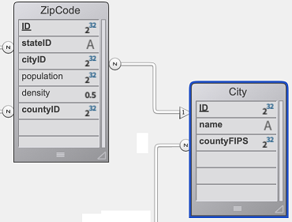
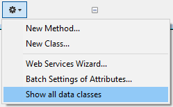

ORDA を使用して、データモデル上に高レベルクラス関数を作成することができます。 これによってビジネス指向のコードを書き、APIのように "公開" することができます。 データストア、データクラス、エンティティ、およびエンティティセレクションはそれぞれ、関数を持つことのできるクラスオブジェクトとして提供されています。

たとえば、選択中の社員より給与の高い社員一覧を返す `getNextWithHigherSalary()` 関数を `EmployeeEntity` クラスに作成したとします。 この関数は簡単に呼び出すことができます:

```4d
$nextHigh:=ds.Employee.get(1).getNextWithHigherSalary()
```

これらの関数はローカルデータストアだけでなく、クライアント/サーバーやリモートアーキテクチャーでも使用することができます:

```4d
 //$cityManager はリモートデータストアへの参照です
Form.comp.city:=$cityManager.City.getCityName(Form.comp.zipcode)
```

この機能により、4D アプルケーションのビジネスロジックをまるごと独立したレイヤーに保存し、高レベルのセキュリティで簡単に管理・利用することができます:

- わかりやすく使いやすい関数のみを公開し、その裏にある構造の複雑性を "隠す" ことができます。

- 構造が発展した場合には影響を受ける関数を適応させるだけで、クライアントアプリケーションは引き続き透過的にそれらを呼び出すことができます。

- デフォルトでは、データモデルクラス関数はすべて、リモートアプリケーションに対し **非公開** に設定されており、RESTリクエストで呼び出すことはできません。 公開する関数は [`exposed`](#公開vs非公開関数) キーワードによって明示的に宣言する必要があります。


各データモデルオブジェクトに関わるクラスは、4D によって [あらかじめ自動的に作成](#クラスの作成) されます。

## アーキテクチャー

ORDA では、**`4D`** [クラスストア](Concepts/classes.md#クラスストア) を介して公開される **汎用クラス** と、**`cs`** [クラスストア](Concepts/classes.md#クラスストア) で公開される **ユーザークラス** が提供されています:


ORDA データモデルクラスはすべて **`cs`** クラスストアのプロパティとして公開されます。 次の ORDA クラスが提供されています:

| Class                       | 例                    | 次によってインスタンス化されます                                                                                                                                                                                                                                                                                                                                                                                                                                                                                                                                                                                                                                                                                                                                                                                                                                                       |
| --------------------------- | -------------------- | ---------------------------------------------------------------------------------------------------------------------------------------------------------------------------------------------------------------------------------------------------------------------------------------------------------------------------------------------------------------------------------------------------------------------------------------------------------------------------------------------------------------------------------------------------------------------------------------------------------------------------------------------------------------------------------------------------------------------------------------------------------------------------------------------------------------------------------------------------------------------- |
| cs.DataStore                | cs.DataStore         | [`ds`](API/DataStoreClass.md#ds) コマンド                                                                                                                                                                                                                                                                                                                                                                                                                                                                                                                                                                                                                                                                                                                                                                                                                                  |
| cs.*DataClassName*          | cs.Employee          | [`dataStore.DataClassName`](API/DataStoreClass.md#dataclassname), `dataStore["DataClassName"]`                                                                                                                                                                                                                                                                                                                                                                                                                                                                                                                                                                                                                                                                                                                                                                         |
| cs.*DataClassName*Entity    | cs.EmployeeEntity    | [`dataClass.get()`](API/DataClassClass.md#get), [`dataClass.new()`](API/DataClassClass.md#new), [`entitySelection.first()`](API/EntitySelectionClass.md#first), [`entitySelection.last()`](API/EntitySelectionClass.md#last), [`entity.previous()`](API/EntityClass.md#previous), [`entity.next()`](API/EntityClass.md#next), [`entity.first()`](API/EntityClass.md#first), [`entity.last()`](API/EntityClass.md#last), [`entity.clone()`](API/EntityClass.md#clone)                                                                                                                                                                                                                                                                                                                                                                                                   |
| cs.*DataClassName*Selection | cs.EmployeeSelection | [`dataClass.query()`](API/DataClassClass.md#query), [`entitySelection.query()`](API/EntitySelectionClass.md#query), [`dataClass.all()`](API/DataClassClass.md#all), [`dataClass.fromCollection()`](API/DataClassClass.md#fromcollection), [`dataClass.newSelection()`](API/DataClassClass.md#newselection), [`entitySelection.drop()`](API/EntitySelectionClass.md#drop), [`entity.getSelection()`](API/EntityClass.md#getselection), [`entitySelection.and()`](API/EntitySelectionClass.md#and), [`entitySelection.minus()`](API/EntitySelectionClass.md#minus), [`entitySelection.or()`](API/EntitySelectionClass.md#or), [`entitySelection.orderBy()`](API/EntitySelectionClass.md#or), [`entitySelection.orderByFormula()`](API/EntitySelectionClass.md#orderbyformula), [`entitySelection.slice()`](API/EntitySelectionClass.md#slice), `Create entity selection` |

> ORDA ユーザークラスは通常のクラスファイル (.4dm) としてプロジェクトの Classes サブフォルダーに保存されます [(後述参照)](#クラスファイル)。

ORDA データモデルユーザークラスのオブジェクトインスタンスは、それらの親クラスのプロパティや関数を使うことができます:

- Datastore クラスオブジェクトは、[ORDA Datastore 汎用クラス](API/DataStoreClass.md) の関数を呼び出すことができます。
- DataClass クラスオブジェクトは、[ORDA DataClass 汎用クラス](API/DataClassClass.md) の関数を呼び出すことができます。
- EntitySelection クラスオブジェクトは [ORDA EntitySelection 汎用クラス](API/EntitySelectionClass.md) の関数を呼び出すことができます。
- Entity クラスオブジェクトは [ORDA Entity 汎用クラス](API/EntityClass.md) の関数を呼び出すことができます。

## クラスの説明

<details><summary>履歴</summary>

| リリース  | 内容                                                                   |
| ----- | -------------------------------------------------------------------- |
| 18 R5 | データモデルクラス関数は、デフォルトでは REST に公開されません。 新しい `exposed` および `local` キーワード。 |
</details>

### DataStore クラス

4D のデータベースは、自身の DataStore クラスを `cs` クラスストアに公開します。

- **親クラス**: 4D.DataStoreImplementation
- **クラス名**: cs.DataStore

DataStore クラス内には、`ds` オブジェクトを介して使用する関数を作成することができます。

#### 例題

```4d  
// cs.DataStore class

Class extends DataStoreImplementation

Function getDesc
  $0:="社員と会社を公開するデータベース"
```

この関数は次のように使えます:

```4d
$desc:=ds.getDesc() //"社員と会社を..."
```

### DataClass クラス

ORDA で公開されるテーブル毎に、DataClass クラスが `cs` クラスストアに公開されます。

- **親クラス**: 4D.DataClass
- **クラス名**: cs.*DataClassName* (*DataClassName* はテーブル名です)
- **例**: cs.Employee

#### 例題

```4D
// cs.Company クラス


Class extends DataClass

// 収益が平均以上の会社を返します
// Company DataClass にリレートしているエンティティセレクションを返します 

Function GetBestOnes()
 $sel:=This.query("revenues >= :1";This.all().average("revenues"));
 $0:=$sel
```

全会社データから平均以上の会社データをエンティティセレクションに抽出するには次を実行します:

```4d
 var $best : cs.CompanySelection
 $best:=ds.Company.GetBestOnes()
```

#### リモートデータストアの例

次の *City* カタログをリモートデータストアとして公開しています:



`City クラス` は API を提供しています:

```4d  
// cs.City クラス

Class extends DataClass

Function getCityName()
 var $1; $zipcode : Integer
 var $zip : 4D.Entity
 var $0 : Text

 $zipcode:=$1
 $zip:=ds.ZipCode.get($zipcode)
 $0:="" 

 If ($zip#Null)
  $0:=$zip.city.name
 End if
```

クライアントはまず、リモートデータストアのセッションを開始します:

```4d
$cityManager:=Open datastore(New object("hostname";"127.0.0.1:8111");"CityManager")
```

クライアントアプリケーションは API を使い、たとえばフォームに入力された郵便番号 (zipcode) に合致する都市を取得することができます:

```4d
Form.comp.city:=$cityManager.City.getCityName(Form.comp.zipcode)

```

### EntitySelection クラス

ORDA で公開されるテーブル毎に、EntitySelection クラスが `cs` クラスストアに公開されます。

- **親クラス**: 4D.EntitySelection
- **クラス名**: *DataClassName*Selection (*DataClassName* はテーブル名です)
- **例**: cs.EmployeeSelection

#### 例題

```4d
// cs.EmployeeSelection クラス


Class extends EntitySelection

// 給与が平均超えの社員を当該エンティティセレクションから抽出します

Function withSalaryGreaterThanAverage
 C_OBJECT($0)
 $0:=This.query("salary > :1";This.average("salary")).orderBy("salary")

```

任意の社員エンティティセレクションより、給与が平均以上の社員を取得するには:

```4d
$moreThanAvg:=ds.Company.all().employees.withSalaryGreaterThanAverage()
```

### Entity クラス

ORDA で公開されるテーブル毎に、Entity クラスが `cs` クラスストアに公開されます。

- **親クラス**: 4D.Entity
- **クラス名**: *DataClassName*Entity (*DataClassName* はテーブル名です)
- **例**: cs.CityEntity

#### 例題

```4d
// cs.CityEntity クラス

Class extends Entity

Function getPopulation()
    $0:=This.zips.sum("population")


Function isBigCity
C_BOOLEAN($0)
// 関数 getPopulation() をクラス内で使用することができます
$0:=This.getPopulation()>50000
```

次のように関数を呼び出すことができます:

```4d
var $cityManager; $city : Object

$cityManager:=Open datastore(New object("hostname";"127.0.0.1:8111");"CityManager")
$city:=$cityManager.City.getCity("Caguas")

If ($city.isBigCity())
 ALERT($city.name + " は大きな町です。")
End if
```

### 定義規則

データモデルクラスを作成・編集する際には次のルールに留意しなくてはなりません:

- 4D のテーブル名は、**cs** [クラスストア](Concepts/classes.md#クラスストア) 内において自動的に DataClass クラス名として使用されるため、**cs** 名前空間において衝突があってはなりません。 特に:
  - 4D テーブルと [ユーザークラス名](Concepts/classes.md#クラス名) に同じ名前を使用してはいけません。 衝突が起きた場合には、ユーザークラスのコンストラクターは使用不可となります (コンパイラーにより警告が返されます)。
  - 4D テーブルに予約語を使用してはいけません (例: "DataClass")。

- クラス定義の際、[`Class extends`](Concepts/classes.md#class-extends-classname) ステートメントに使用する親クラスの名前は完全に合致するものでなくてはいけません (文字の大小が区別されます)。 たとえば、EntitySelection クラスを継承するには `Class extends EntitySelection` と書きます。

- データモデルクラスオブジェクトのインスタンス化に `new()` キーワードは使えません (エラーが返されます)。 上述の ORDA クラステーブルに一覧化されている、通常の [インスタンス化の方法](#アーキテクチャー) を使う必要があります。

- **`4D`** [クラスストア](Concepts/classes.md#クラスストア) のネイティブな ORDA クラス関数を、データモデルユーザークラス関数でオーバーライドすることはできません。

## 公開vs非公開関数

セキュリティ上の理由により、データモデルクラス関数はデフォルトですべて、リモートリクエストに対し **非公開** (つまりプライベート) に設定されています。

リモートリクエストには次のものが含まれます:

- `Open datastore` によって接続されたリモートの 4Dアプリケーションが送信するリクエスト
- RESTリクエスト

> 通常の 4Dクライアント/サーバーリクエストは影響されません。 このアーキテクチャーにおいては、データモデルクラス関数は常に利用可能です。

公開されていない関数はリモートアプリケーションで利用することができず、RESTリクエストによるオブジェクトインスタンスに対して呼び出すこともできません。 リモートアプリケーションが非公開関数をアクセスしようとすると、"-10729 (未知のメンバー機能です)" エラーが返されます。

リモートリクエストによる呼び出しを許可するには、`exposed` キーワードを使ってデータモデルクラス関数を明示的に宣言する必要があります。 シンタックスは次の通りです:

```4d  
// 公開関数の宣言
exposed Function <functionName>   
```

> `exposed` キーワードは、データモデルクラス関数に対してのみ利用可能です。 [通常のユーザークラス](Concepts/classes.md) 関数に対して使った場合、キーワードは無視され、コンパイラーはエラーを返します。

### 例題

公開された関数によって、DataClass クラスのプライベート関数を呼び出します:

```4d
Class extends DataClass

// 公開関数
exposed Function registerNewStudent($student : Object) -> $status : Object

var $entity : cs.StudentsEntity

$entity:=ds.Students.new()
$entity.fromObject($student)
$entity.school:=This.query("name=:1"; $student.schoolName).first()
$entity.serialNumber:=This.computeSerialNumber()
$status:=$entity.save()

// 非公開 (プライベート) 関数
Function computeIDNumber()-> $id : Integer
// 新規ID番号を算出します
$id:=...

```

呼び出し元のコードは次の通りです:

```4d
var $remoteDS; $student; $status : Object
var $id : Integer

$remoteDS:=Open datastore(New object("hostname"; "127.0.0.1:8044"); "students")
$student:=New object("firstname"; "Mary"; "lastname"; "Smith"; "schoolName"; "Math school")

$status:=$remoteDS.Schools.registerNewStudent($student) // OK
$id:=$remoteDS.Schools.computeIDNumber() // エラー (未知のメンバー機能です) 
```

## ローカル関数

クライアント/サーバーアーキテクチャーではデフォルトで、ORDA データモデル関数は **サーバー上で** 実行されます。 関数リクエストとその結果だけが通信されるため、通常はベストパフォーマンスが提供されます。

しかしながら、状況によってはその関数はクライアント側で完結するものかもしれません (たとえば、すでにローカルキャッシュにあるデータを処理する場合など)。 そのような場合には、`local` キーワードを使ってサーバーへのリクエストをおこなわないようにし、アプリケーションのパフォーマンスを向上させることができます。 シンタックスは次の通りです:

```4d  
// クライアント/サーバーにおいてローカル実行する関数の宣言
local Function <functionName>   
```

このキーワードを使うと、関数は常にクライアントサイドで実行されます。

> `local` キーワードは、データモデルクラス関数に対してのみ利用可能です。 [通常のユーザークラス](Concepts/classes.md) 関数に対して使った場合、キーワードは無視され、コンパイラーはエラーを返します。

最終的にサーバーへのアクセスが必要になっても (ORDAキャッシュが有効期限切れになった場合など) 関数は動作します。 もっとも、それではローカル実行によるパフォーマンスの向上は見込めないため、ローカル関数がサーバー上のデータにアクセスしないことを確認しておくことが推奨されます。 サーバーに対して複数のリクエストをおこなうローカル関数は、サーバー上で実行されて結果だけを返す関数よりも非効率的です。 たとえば、Schools Entityクラスの次の関数を考えます:

```4d
// 2000年以降の生まれの生徒を検索します  
// local キーワードを適切に使用していない例です
local Function getYoungest
 var $0 : Object
 $0:=This.students.query("birthDate >= :1"; !2000-01-01!).orderBy("birthDate desc").slice(0; 5)
```

- `local` キーワードを **使わない** 場合、1つのリクエストで結果が得られます。
- `local` キーワードを **使う** 場合、4つのリクエストが必要になります: Schools エンティティの students エンティティセレクションの取得、`query()` の実行、`orderBy()` の実行、`slice()` の実行。 この例では、`local` キーワードを使用するのは適切ではありません。

### 例題

#### 年齢の計算

*birthDate* (生年月日) 属性を持つエンティティがある場合に、リストボックス内で呼び出すための `age()` 関数を定義します。 この関数をクライアントサイドで実行することで、リストボックスの各行がサーバーへのリクエストを生成するのを防ぎます。

*StudentsEntity* クラス:

```4d
Class extends Entity

local Function age() -> $age: Variant

If (This.birthDate#!00-00-00!)
    $age:=Year of(Current date)-Year of(This.birthDate)
Else 
    $age:=Null
End if
```

#### 属性のチェック

クライアントにロードされ、ユーザーによって更新されたエンティティの属性について、サーバーへ保存リクエストを出すまえに、それらの一貫性を検査します。

*StudentsEntity* クラスのローカル関数 `checkData()` は生徒の年齢をチェックします:

```4d
Class extends Entity

local Function checkData() -> $status : Object

$status:=New object("success"; True)
Case of
    : (This.age()=Null)
        $status.success:=False
        $status.statusText:="生年月日が入力されていません。" 

    :((This.age() <15) | (This.age()>30) )
        $status.success:=False
        $status.statusText:="生徒の年齢は 15 〜 30 の範囲で入力してください。この生徒の年齢は "+String(This.age()+"です。")
End case
```

呼び出し元のコード:

```4d
var $status : Object

// Form.student は全属性とともにロードされており、フォーム上で更新されました
$status:=Form.student.checkData()
If ($status.success)
    $status:=Form.student.save() // サーバーを呼び出します
End if
```

## データモデルクラスの管理

### クラスファイル

ORDA データモデルユーザークラスは、クラスと同じ名称の .4dm ファイルを [通常のクラスファイルと同じ場所](Concepts/classes.md#クラスファイル) (つまり、Project フォルダー内の `/Sources/Classes` フォルダー) に追加することで定義されます。 たとえば、`Utilities` データクラスのエンティティクラスは、`UtilitiesEntity.4dm` ファイルによって定義されます。

### クラスの作成

各データモデルオブジェクトに関わるクラスは、4D によってあらかじめ自動的にメモリ内に作成されます。


> 空の ORDA クラスは、デフォルトではエクスプローラーに表示されません。 表示するにはエクスプローラーのオプションメニューより **データクラスを全て表示** を選択します: 

ORDA ユーザークラスは通常のクラスとは異なるアイコンで表されます。 空のクラスは薄く表示されます:


ORDA クラスファイルを作成するには、エクスプローラーで任意のクラスをダブルクリックします。 4D はクラスファイルを作成し、`extends` ステートメントを自動で追加します。 たとえば、Entity クラスを継承するクラスの場合は:

```
Class extends Entity
```

定義されたクラスはエクスプローラー内で濃く表示されます。

### クラスの編集

定義された ORDA クラスファイルを 4D メソッドエディターで開くには、ORDA クラス名を選択してエクスプローラーのオブションメニュー、またはコンテキストメニューの **編集...** を使用するか、ORDA クラス名をダブルクリックします:


ローカルデータストア (`ds`) に基づいた ORDA クラスの場合には、4D ストラクチャーウィンドウからも直接クラスコードにアクセスできます:


### メソッドエディター

4D メソッドエディターにおいて、ORDA クラス型として定義された変数は、自動補完機能の対象となります。 Entity クラス変数の例です:


