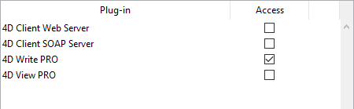
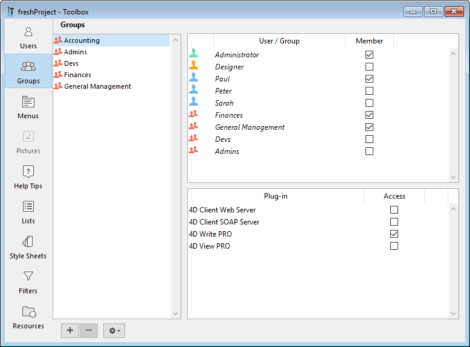

ORDA はオブジェクトベースであるため、ORDA を使うにはオブジェクト指向プログラミングの基本的な知識が必要です。

## データストアの説明

4Dデータベースストラクチャーが [ORDA の前提条件](overview.md#orda-prerequisites) に準拠していれば、ORDA のデータストアは自動的にこれに基づいて機能します。

この例題では、以下の単純な 4Dデータベースストラクチャーを使用します:


データストアとして公開されているものを知るために、新しいプロジェクトメソッドを作成し、以下の行を記述します:

```code4d
TRACE
```

このメソッドを実行すると、デバッガーウィンドウが呼び出されます。 式を挿入するために式エリアをダブルクリックし、`ds` と入力します。 これは、データストアオブジェクトを返します。 オブジェクトを展開すると、`ds` オブジェクトのプロパティとしてテーブルとフィールドが ORDA によって自動的に公開されることがわかります。


これはつまり、たとえば [Company]テーブルの cityフィールドを参照する必要がある場合、ORDA では次のように書くだけ事足ります:

```code4d
ds.Company.city // 都市の名前を返します
```

> ORDA の世界では，ds.Company は **データクラス** です。 ds.Company.city は **属性** です。

> ORDA は大文字と小文字を区別します。 `ds.company.city` が ds.Company.city 属性を参照することはありません。

また、ds.Company データクラスに `hires` プロパティが追加されていることにお気づきでしょうか。 これはフィールドに対応した属性ではありません。 `hires` は、実際には Company と Employee の間の *1対N* リレーションの名前です:

 *インスペクターで定義されているリレーションの名前*

つまり、ある会社で働く従業員のリストにアクセスしたいとき、ORDA では次のように書きます:

```code4d
ds.Company.hires // 従業員のリストを返します
```

しかし、急ぎすぎてはいけません。 まずは、ORDA のデータクラスにデータを記録する方法を見ていきましょう。

## データの追加

ORDA では、`new()` コマンドを使ってデータクラスにレコードを追加することができます。
> ORDA の世界では、レコードは **エンティティ** であり、エンティティはそれ自体がオブジェクトです。 特定のオブジェクトに付随するコマンドを **メンバーメソッド** と呼びます。

```code4d
$entity:=ds.Company.new() // Company データクラスに
// 新しいエンティティ参照を作成し、  
// それを $entity 変数に代入します
```

新しいエンティティオブジェクトには、その親データクラスのすべての属性の "コピー" が含まれているので、それらに値を代入することができます:

```code4d
$entity.name:="ACME, inc."  
$entity.city:="London"  
//$entity.ID は自動的に設定されます
```

今のところ、エンティティはメモリ上にしか存在しません。 データファイルに保存するには、`save()` メンバーメソッドを使って保存する必要があります。

```code4d
$status:=$entity.save()
```

ユーザーのエディターは 4Dのツールボックスにあります。


### ユーザーの追加と変更

ユーザーエディターを使用して、ユーザーアカウントの作成やプロパティの設定、各グループへの割り当てをおこないます。

ユーザーを追加するには:

1. **デザイン** メニューから **ツールボックス＞ユーザー** を選択、または 4Dツールバーの **ツールボックス** ボタンをクリックします。 4Dはユーザーエディターを表示します。

ユーザーリストには、[デザイナーと管理者](#デザイナーと管理者) を含むすべてのユーザーが表示されます:

2. ユーザーリストの下にある追加ボタン  をクリックします。 または <br /> ユーザーリスト上で右クリックし、コンテキストメニューから **追加** または **複製** を選択する。

> **複製** コマンドを使用すると、同じ特性を持つ複数のユーザーを素早く作成することができます。

4D は新規ユーザーをリストに追加し、デフォルトとして "新規ユーザーX" という名前を設定します。

3. 新しいユーザー名を入力します。 この名前は ユーザーがデータベースを開く際に使用されます。 ユーザー名をいつでも変更することができます。変更するにはコンテキストメニューの **名称変更** コマンドを使用するか、Alt+クリック (Windows) または Option+クリック (macOS) ショートカットを使用、または変更したい名前を 2回クリックします。

4. ユーザーのパスワードを設定するには、プロパティエリアで **編集...** ボタンをクリックして、ダイアログボックスの 2つのパスワード欄に同じパスワードをそれぞれ入力します。 パスワードには 15桁までの英数字を使用することができます。 パスワードでは文字の大小が区別されます。

> データベース設定の "セキュリティ" ページで許可されていれば、ユーザーは自分のパスワードを変更できます。また、パスワードは `CHANGE PASSWORD` コマンドを使って変更することもできます。

5. グループメンバー表を用いて、そのユーザーが所属するグループを設定します。 メンバーカラムの該当するオプションをチェックして、選択したユーザーをグループに対して追加・削除することができます。

[グループページ](#グループの設定) を使用して、各グループの所属ユーザーを設定することもできます。

### ユーザーの削除

ユーザーを削除するには、そのユーザーを選択してから削除ボタンをクリックするか、またはコンテキストメニューの **削除** コマンドを使用します。 

削除されたユーザー名は、その後ユーザーエディターには表示されません。 削除されたユーザーの ID番号は、新規アカウント作成の際に再度割り当てられるという点に注意してください。

### ユーザープロパティ

- **ユーザーの種類**: "デザイナー"、"管理者"、または (それ以外のすべてのユーザーの場合にあ) "ユーザー"

- **開始メソッド**: ユーザーがデータベースを開いたときに自動実行されるメソッドの名称 (任意) このメソッドを使って、たとえばユーザー設定をロードできます。

## グループエディター

グループのエディターは 4Dのツールボックスにあります。

### グループの設定

グループエディターを使用して、各グループ内に納める要素 (ユーザーや他のグループ) を設定したり、プラグインへのアクセス権を割り当てることができます。

グループは一旦作成されると、削除できないということに留意が必要です。 グループを使用したくない場合は、そのグループの所属ユーザーをすべて取り除きます。

グループを作成するには:

1. **デザイン** メニューから **ツールボックス＞ユーザーグループ** を選択、または 4Dツールバーの **ツールボックス** ボタンをクリックし、**グループ** ページを開きます。 4D はグループエディターウインドウを表示します: グループリストには、データベースのすべてのグループが表示されます。

2. グループリストの下にある追加ボタン  をクリックします。  
   または  
   グループリスト上で右クリックし、コンテキストメニューから **追加** または **複製** を選択します。

> 複製コマンドを使用すると、同じ特性を持つ複数のグループを素早く作成することができます。

4D は新規グループをリストに追加し、デフォルトとして "新規グループX" という名前を設定します。

3. 新しいグループの名前を入力します。 グループ名には 15桁までの文字を使用できます。 グループ名をいつでも変更することができます。変更するにはコンテキストメニューの **名称変更** コマンドを使用するか、Alt+クリック (Windows) または Option+クリック (macOS) ショートカットを使用、または変更したい名前を 2回クリックします。

### ユーザーやグループをグループに入れる

任意のユーザーやグループをグループ内に配置することができます。さらに、そのグループ自体を他のいくつかのグループ内に入れることも可能です。 必ずしもユーザーをグループに入れる必要はありません。

ユーザーやグループをグループに配置するには、当該グループのユーザー/グループ一覧にてメンバーカラムにチェックを入れます:


ユーザー名をチェックすると、そのユーザーがグループに追加されます。 グループ名をチェックした場合は、そのグループの全ユーザーがグループへ追加されます。 メンバーの一員となったユーザーやグループには、そのグループに割り当てられたものと同じアクセス権が与えられます。

グループを別のグループ内に入れることにより、ユーザーの階層構造が作成されます。 別のグループの配下に入れられたグループのユーザーは、両グループのアクセス権を保持します。 後述の [アクセス権の階層構造](#アクセス権の階層構造) を参照してください。

ユーザーやグループをグループから取り除くには、ユーザー/グループ一覧でチェックを解除します。

### プラグインやサーバーにグループを割り当てる

データベースにインストールされたプラグインへのアクセス権をグループに割り当てることができます。 これには 4D のプラグインと任意のサードパーティープラグインが含まれます。

プラグインへのアクセス権を割り当てると、所有するプラグインライセンスの使用を管理できるようになります。 プラグインのアクセスグループに属さないユーザーは、そのプラグインをロードすることができません。

また、プラグインアクセスエリアを使用して、4D Client Webサーバーと SOAPサーバーの使用を制限することも可能です。

ツールボックスのグループページにある "プラグイン" エリアには、4Dアプリケーションによりロードされたプラグインがすべて表示されます。 プラグインへのアクセス権をグループに与えるには、該当するオプションをチェックします。



**4D Client Web Server** や **4D Client SOAP Server** 項目を使用し、リモートモードの 4D がそれぞれ Web および SOAP (Webサービス) 公開をおこなえるかどうかを管理することができます。 これらのライセンスは 4D Server 側ではプラグインライセンスとしてみなされます。 したがって、プラグインと同じ方法で、これらのライセンスの使用権を特定のユーザーグループに限定することができます。

### アクセス権の階層構造

データベースのセキュリティを確保し、ユーザーに異なるアクセスレベルを提供する最も効果的な方法は、アクセス権の階層構造を利用することです。 ユーザーを適切なグループに割り振り、各グループをネストすることで、アクセス権の階層構造を形成できます。 この節では、このような構造の取り扱い方について説明します。

この例題では、ユーザーは担当業務に応じて 3つあるグループの 1つに割り振られます。 データ入力担当のユーザーは、Accounting (会計) グループに割り当てます。 レコードの更新や無効データの削除などデータ管理を担当するユーザーは、Finances (財務) グループに割り当てます。 検索の実行や分析レポートの印刷などデータ分析を担当するユーザーは、General Management (総合管理) グループに割り当てます。

割り当て完了後は、各グループのユーザーに権限が正しく配分されるようにグループをネストします。

- General Management グループには "高レベル" のユーザーだけが含まれます。 

- Finances グループには、データ管理ユーザーと General Management グループが含まれます。したがって、General Management グループのユーザーは Finances グループの権限も保持します。 

- Accounting グループには、データ入力をおこなうユーザーと Finances グループが含まれます。したがって、Finances グループのユーザーと General Management グループのユーザーは Accounting グループの権限も利用できます。 

所属ユーザーの責務に基づいて、各グループに割り当てるアクセス権を決定します。

このような階層システムを使用すると、新規ユーザーに割り当てるべきグループがわかりやすくなります。 各ユーザーを 1つのグループに割り当てるだけで、グループの階層を介してアクセス権を決定できます。
