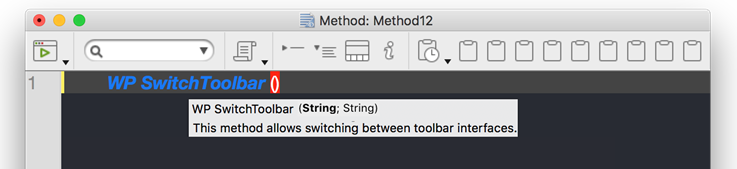

アプリケーションプロジェクトにおいては、メソッドやフォーム、テーブル、フィールドに関するドキュメンテーションを作成することができます。 複数のプログラマーによってプロジェクトを開発している場合などに、ドキュメンテーションの作成はとくに適しています。また、一般的に良いプログラミングの作法としても推奨されます。 ドキュメンテーションには、要素の説明だけでなく、アプリケーションにおけるその要素の機能を理解するために必要なあらゆる情報を含めることができます。

ドキュメントすることができるプロジェクト要素は次のとおりです:

- メソッド (データベースメソッド、コンポーネントメソッド、プロジェクトメソッド、フォームメソッド、4D Mobile メソッド、トリガー、クラス)
- フォーム
- テーブルとフィールド

ドキュメンテーションファイルは Markdown記法 (.md ファイル) で記述します。これには、Markdown をサポートしている任意のエディターを使うことができます。 これらはそれぞれ独立したファイルとしてプロジェクトフォルダー内に格納されます。

ドキュメントされた内容は、エクスプローラーの右側にあるプレビューエリアに表示されます:


また、[コードエディターのヘルプTip](#コードエディターでドキュメンテーションを表示する) として部分的に表示することもできます。

## ドキュメンテーションファイル

### ドキュメンテーションファイル名

ドキュメンテーションファイルには、ドキュメントの対象である要素と同じファイル名が付き、拡張子は ".md" です。 たとえば、`myMethod.4dm` プロジェクトメソッドに付随するドキュメンテーションファイルの名前は `myMethod.md` です。

エクスプローラー上では、選択した要素と同じファイル名のドキュメンテーションが自動的に表示されます (後述参照)。

### ドキュメンテーションファイルのアーキテクチャー

ドキュメンテーションファイルはすべて、データベースフォルダーのルートにある `Documentation` フォルダーに格納されます。

`Documentation` フォルダーのアーキテクチャーは次のとおりです:

- **Documentation**
  - **Classes**
    - myClass.md
  - **DatabaseMethods**
    - onStartup.md
    - ...
  - **フォーム**
    - loginDial.md
    - ...
  - **Methods**
    - myMethod.md
    - ...
  - **TableForms**
    - **1**
      - input.md
      - ...
    - ...
  - **Triggers**
    - table1.md
    - ...

- プロジェクトフォームとそのプロジェクトフォームメソッドは、同じドキュメンテーションファイルをフォームとメソッドの両方について共有します。
- テーブルフォームとそのテーブルフォームメソッドは、同じドキュメンテーションファイルをフォームとメソッドの両方について共有します。

> ドキュメントされているプロジェクト要素を名称変更したり、削除したりすると、その要素に紐づいている Markdown ファイルも自動で名称変更、または削除されます。

## エクスプローラーとドキュメンテーション

### ドキュメンテーションの表示

エクスプローラーウィンドウにドキュメンテーションを表示させるには:

1. プレビューエリアが表示されていることを確認します。
2. エクスプローラーリストより、ドキュメントされている要素を選択します。
3. プレビューエリアの下にある **ドキュメンテーション** ボタンをクリックします。


- 選択要素のドキュメンテーションファイルが見つからなかった場合には、**作成する** ボタンが表示されます。

- 選択要素のドキュメンテーションファイルが存在すれば、その内容がエリア内に表示されます。 なお、エリアに表示されている内容は直接編集することはできません。

### ドキュメンテーションファイルの編集

選択要素の Markdown ドキュメンテーションファイルはエクスプローラーより作成・編集することができます。

選択要素のドキュメンテーションファイルが存在しなければ:

- `Documentation` ペインにある **作成する** ボタンをクリックするか、
- エクスプローラーのオプションメニューまたはコンテキストメニューより **ドキュメンテーションを編集...** を選択します。


テンプレートを使い、適切な場所・名称で自動作成された .md ファイルは、デフォルトの Markdown エディターで開かれます。

選択要素のドキュメンテーションファイルが存在していれば、エクスプローラーのオプションメニューまたはコンテキストメニューより **ドキュメンテーションを編集...** を選択することで、Markdown エディターに開くことができます。

## コードエディターでドキュメンテーションを表示する

4D のコードエディターは、メソッドのドキュメンテーションの一部をヘルプTip として表示します。



`<MethodName>.md` ファイルが `<package>/documentation` フォルダーに存在する場合、コードエディターは次の優先順位でヘルプTips を表示します:

- Markdown ファイルの先頭に設置した、HTML のコメントタグで囲まれたテキスト (*\<!-- command documentation -->*。

- HTML のコメントタグが使用されていなければ、Markdown ファイルの `# Description` タグ後の最初の文章  
  この場合、最初の文章には 4D コードパーサーによって自動生成されたメソッドの **プロトタイプ** が入ります。

 > それ以外の場合には、[メソッドコードの先頭のコメントブロック](https://doc.4d.com/4Dv18R3/4D/18-R3/Writing-a-method.300-4919495.ja.html#4618226) がコードエディターに表示されます。

## ドキュメンテーションファイルの定義

4D はテンプレートを用いて新規のドキュメンテーションファイルを作成します。 このテンプレートは、[コードエディターでドキュメンテーションを表示する](#コードエディターでドキュメンテーションを表示する) のに利用できる項目が提供しています。

それ以外の [サポートされている Markdown](#サポートされている-markdown) タグも利用することができます。

新規作成されたドキュメンテーションファイルには、次のデフォルト項目が含まれています:


| 線                                                   | 説明                                                                                      |
| --------------------------------------------------- | --------------------------------------------------------------------------------------- |
| "\<!-- Type your summary here -->"       | HTML コメントタグ。 メソッドの説明として優先的に [コードエディターTip](#コードエディターでドキュメンテーションを表示する) に表示されます。           |
| ## Description                                     | Markdown のレベル2 見出しタグ。 HTML コメントタグが使用されていない場合、このタグ後の最初の文章がメソッドの説明としてコードエディターTip に表示されます。 |
| ## Example                                         | レベル2 見出しタグ。サンプルコードの記述に使用できます。                                                           |
| \``` 4D <br/>Type your example here \` `` | 4D サンプルコードのフォーマットに使います (highlight.js ライブラリを使用)。                                         |

### サポートされている Markdown

- 見出しタグ:

```
# 見出し 1
## 見出し 2
### 見出し 3
```

- スタイルタグ (イタリック、太字、取り消し線) :

```
_イタリック_
**太字**
**_太字/イタリック_**
~~取り消し線~~
```

- 4D コードハイライトが付くコードブロックタグ (\```4d ... ```):

 \``` 4d  
C_TEXT($txt)  
$txt:="Hello world!"  
\` ``

- テーブルタグ:

```
| Parameter | Type   | Description  |
| --------- | ------ | ------------ |
| wpArea    | Text |Write pro area|
| toolbar   | Text |Toolbar name  |
```

- リンクタグ:

```
// 例 1
コマンドの [ドキュメンテーション](https://doc.4d.com) は ...

// 例 2
[4D ブログ][1]

[1]: https://blog.4d.com
```

- 画像タグ:

```


[](https://blog.4d.com)
```

[](https://blog.4d.com)

> 詳細については [GitHub Markdown guide](https://guides.github.com/features/mastering-markdown/) (英文) を参照ください。

## 例題

`WP SwitchToolbar.md` ファイルに、次のように書くことができます:

```4d
<!-- This method returns a different logo depending on the size parameter -->


GetLogo (size) -> logo


| Parameter | Type   | in/out | Description |
| --------- | ------ | ------ | ----------- |
| size      | Integer | in | Logo style selector (1 to 5)  |
| logo      | Picture | out | Selected logo |


## Description

This method returns a logo of a specific size, depending on the value of the *size* parameter value.
1 = 最小値, 5 = 最大値

## Example

C_PICTURE($logo)
C_LONGINT($size)

// 最大ロゴを取得します
$logo:=GetLogo(5)
```

- エクスプローラーの表示: 

- コードエディターの表示: 
