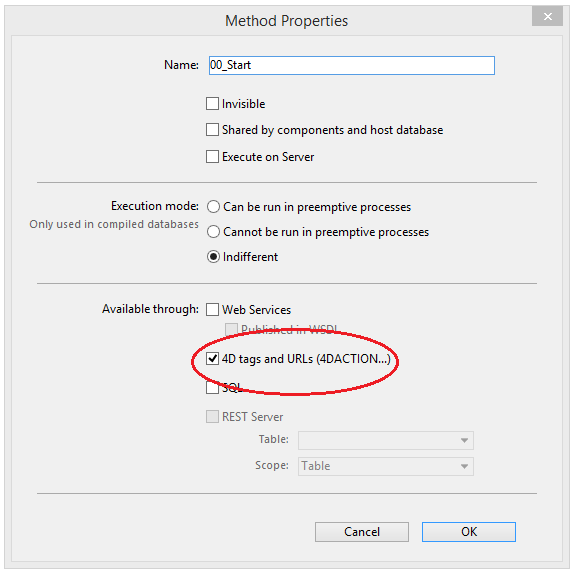

  
`4DEVAL`、`4DTEXT`、`4DHTML` などの 4Dタグや [`/4DACTION URL`](./httpRequests.md#4daction) を使用すれば、Webに公開した4Dプロジェクトで任意のプロジェクトメソッドを利用することができます。 たとえば、リクエスト *<http://www.server.com/4DACTION/login>* は ***login*** プロジェクトメソッドを (存在すれば) 実行します。

このメカニズムは具体的には、インターネット上のユーザーが故意に (あるいは予期せず) Web用でないメソッドを実行してしまうというような、アプリケーションのセキュリティを脅かすリスクをもたらします。 このリスクは以下の 3つの方法で回避できます:

* [`On Web Authentication`](authentication.md#on-web-authentication) データベースメソッドを使用して URL から呼び出されるメソッドをフィルターする。 欠点: データベースに多くのメソッドが定義されている場合、この方法は管理が困難になります。

* **公開オプション: 4DタグとURL (4DACTION...)** (メソッドプロパティ) を使用する:

このオプションを使用してプロジェクトメソッドごとに、特別な URL `4DACTION` や `4DTEXT`, `4DHTML`, `4DEVAL`, `4DSCRIPT`, `4DIF`, `4DELSEIF`, `4DLOOP` などの 4Dタグを使用した呼び出しを許可するかしないかを設定できます。 このオプションがチェックされていない場合、そのプロジェクトメソッドは HTTPリクエストから直接実行することはできません。 他方、他のタイプの呼び出し (フォーミュラや他のメソッドからの呼び出しなど) ではこれらのメソッドを実行することができます。

このオプションはデフォルトでチェックされていません。 `4DACTION` やタグなどを使用して呼び出すことのできるメソッドは、明示的に指定する必要があります。

このプロパティが指定されたプロジェクトメソッドは、エクスプローラーで以下のアイコンが表示されます:

 
