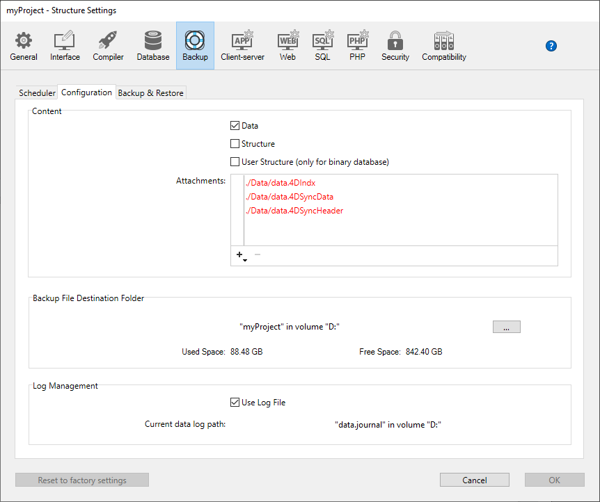

バックアップ設定の定義は、[ストラクチャー設定ダイアログボックス](../settings/overview.md) 内で 3ページにわたっています。 次の設定がおこなえます:

- 自動バックアップ用のスケジューラー設定
- 各バックアップに含めるファイル
- 自動タスクの実行を可能にする高度な設定

> このダイアログボックスで定義された設定は *Backup.4DSettings* ファイルに書き込まれ、[Settings フォルダー](Project/architecture.md#settings-ユーザー) に保存されます。

## スケジューラー

4D や 4D Server で開かれているアプリケーションのバックアップを自動化することができます (クライアントマシンが接続されている必要はありません)。 これはバックアップ周期 (時間、日、週、月単位等) を設定することによりおこないます。現在のバックアップ設定に基づき、4D は自動でバックアップを実行します。

バックアップが実行されるべきときにアプリケーションが起動されていなかった場合には、次に起動されたとき 4D はバックアップが失敗したものと認識し、ストラクチャー設定の再試行設定を適用します ([バックアップ中に問題が発生した場合](backup.md#バックアップ中に問題が発生した場合) 参照)。

バックアップのスケジュール設定は、ストラクチャー設定の **バックアップ/スケジューラー** ページでおこないます:

このページにあるオプションを使用して、アプリケーションの自動バックアップのスケジュールを設定できます。 標準のクイック設定、または完全なカスタマイズを選択できます。 **自動バックアップ** メニューでの選択に基づき、さまざまなオプションが表示されます:

- **しない**: スケジュールに基づくバックアップは無効となります。
- **毎時**: 次の時間以降、毎時間ごとに自動バックアップをおこないます。
- **毎日**: 日に一回自動バックアップをおこないます。 バックアップを何時に開始するかを設定します。
- **毎週**: 週に一回自動バックアップをおこないます。 バックアップを開始する曜日と時刻を入力するエリアが表示されます。
- **毎月**: 月に一回自動バックアップをおこないます。 バックアップを開始する日付と時刻を入力するエリアが表示されます。
- **カスタマイズ**: 自動バックアップを詳細にスケジュールする場合に使用します。 このオプションを選択すると、複数の入力エリアが表示されます:
     - **X 時間ごと**: 時間単位でバックアップの間隔をスケジュールできます。 1から24までの値を設定できます。
     * **X 日ごと**: 日単位でバックアップの間隔をスケジュールできます。 たとえば、毎日バックアップをおこなうには 1 と設定します。 このオプションを選択した場合、バックアップが開始される時刻を設定しなければなりません。
     * **X 週ごと**: 週単位でバックアップの間隔をスケジュールできます。 たとえば、毎週バックアップをおこなうには 1 と設定します。 このオプションを選択した場合、バックアップを開始する曜日と時刻を設定しなければなりません。 複数の曜日を選択することもできます。 たとえば、毎週水曜日と金曜日にバックアップをするようプログラムできます。
     * **X 月ごと**: 月単位でバックアップの間隔をスケジュールできます。 たとえば、毎月バックアップをおこなうには 1 と設定します。 このオプションを選択した場合、バックアップを開始する日付と時刻を設定しなければなりません。

> 夏時間と標準時の切り替えがある場合にはスケジューラーが一時的に影響され、次のバックアップ実行が 1時間ずれる場合があります。 このずれは一回限りであり、その後のバックアップはスケジュール時間どおりに実行されます。

## 設定

ストラクチャー設定のバックアップ/設定ページではバックアップやログファイルの有効化/無効化、および保存先を設定できます。 これらのパラメーターは、4D や 4D Server で開かれる各アプリケーションごとに設定されます。

> **4D Server**: これらのパラメーターは 4D Server マシン上でのみ設定できます。

### 内容

このエリアでは、次回のバックアップ時にコピー対象とするファイルやフォルダーを指定します。

- **データ**: アプリケーションのデータファイル。 このオプションが選択されている場合、次のものがデータとともにバックアップされます:
     - データベースのカレントログファイル (あれば)
     - [データファイルの隣に置かれた](../Project/architecture.md#settings-フォルダー) `Settings` フォルダー (あれば)。これは *データファイル用のユーザー設定* を格納しています。
- **ストラクチャー**: アプリケーションの Project フォルダーとファイル。 プロジェクトがコンパイルされている場合には、このオプションは .4dz ファイルをバックアップします。 このオプションがチェックされていると、[Project フォルダーと同階層に置かれた](../Project/architecture.mdsettings-ユーザー) `Settings` フォルダーが自動でバックアップされます。これは、*ユーザー設定* を格納しています。
- **ユーザーストラクチャー(バイナリデータベースのみ)**: *廃止予定*
- **添付**: このエリアでは、アプリケーションと同時にバックアップの対象とするファイルやフォルダーを指定します。 ここではどのようなタイプのファイル (ドキュメントやプラグイン、テンプレート、ラベル、レポート、ピクチャーなど) でも指定できます。 個々のファイル、または丸ごとバックアップするフォルダーを個々に設定できます。 添付エリアには、設定されたファイルのパスが表示されます。
     - **削除**: 選択したファイルを添付エリアから取り除きます。
     - **フォルダー追加...**: バックアップに追加するフォルダーを選択するダイアログボックスを表示します。 復元の場合、フォルダーがその内容物とともに復元されます。 アプリケーションファイルを含むフォルダーを除き、すべてのフォルダーやマシンに接続されたボリュームを選択できます。
     - **ファイル追加...**: バックアップに追加するファイルを選択するダイアログボックスを表示します。

### バックアップファイル保存先

このエリアではバックアップファイルの格納場所を確認したり、変更したりできます。

エリアをクリックすると、ファイルの場所がポップアップで表示されます。

バックアップファイルの格納場所を変更するには、**[...]** ボタンをクリックします。 選択ダイアログが表示され、バックアップファイルを配置するフォルダーやディスクを選択できます。 "使用状況" と "空き容量" エリアは、選択したフォルダーが存在するディスクの状態を自動で表示します。

### ログ管理

**ログを使用** オプションが選択されていると、アプリケーションはログファイルを使用します。 カレントデータファイル用のログファイルのパス名は、オプションの下にて指定します。 このオプションが選択されている場合、ログファイルなしでアプリケーションを開くことはできません。 ログファイルの詳細については、[ログファイル](log.md) を参照ください。

デフォルトでは、4D で作成されたすべてのプロジェクトでログファイルが使用されます (**環境設定** の **一般ページ** 内でチェックされている **ログを使用** オプションです)。 ログファイルには *data.journal* のように名前が付けられ、Data フォルダー内に置かれます。

> 新しいログファイルを有効にするには、その前にアプリケーションのデータをバックアップしなければなりません。 現在使用しているデータファイルについてこのオプションをチェックすると、バックアップが必要である旨の警告メッセージが表示されます: ログファイルの作成は延期され、実際には次のバックアップの後にログファイルが作成されます。 ログファイルの作成は延期され、実際には次のバックアップの後にログファイルが作成されます。

## バックアップ & 復元

バックアップ＆復旧の設定は必要に応じて変更します。 デフォルトの設定は、標準的なバックアップ動作をおこないます。

### 一般設定

- **最新のバックアップのみ保存 X バックアップファイル**: このパラメーターを有効にすると、指定された数の最新バックアップファイルだけが保持され、古いバックアップファイルは削除されます。 この機能は以下のように動作します: バックアップ処理が完了したら、アーカイブが作成されたのと同じ場所、同じ名前のもっとも古いアーカイブを削除します。ディスクスペースを確保するため、バックアップ前に削除するよう、削除のタイミングを変更することもできます。
    たとえば、3世代のファイルを保持するよう設定している場合、最初の 3回のバックアップで MyBase-0001、MyBase-0002、MyBase-0003 が作成され、 4回目のバックアップで MyBase-0004 が作成されたのちに MyBase-0001 が削除されます。 この設定はデフォルトで有効になっており、4D は 3世代のバックアップを保持します。
    このメカニズムを無効にするには、チェックボックスの選択を外します。

> このパラメーターは、アプリケーションおよびログファイル両方のバックアップに影響します。

- **データファイルが更新された場合のみバックアップを行う**: このオプションが選択された場合、前回のバックアップ以降にデータが追加・変更・削除された場合のみ、4D は定期的なバックアップを開始します。 そうでない場合、定期的なバックアップはキャンセルされ、次回のスケジュールまで延期されます。 エラーは生成されませんが、バックアップジャーナルにはバックアップが延期された旨記録されます。 このオプションを使用すれば、主に参照目的で使用されているアプリケーションのバックアップに消費されるマシン時間を節約できます。 ストラクチャーや添付ファイルに対して変更がおこなわれていても、データファイルの更新としては扱われない旨注意してください。

> このパラメーターは、アプリケーションおよびログファイル両方のバックアップに影響します。

- **最も古いバックアップファイルを削除**: このオプションは "最新のバックアップのみ保存 X バックアップファイル" が有効になっている場合のみ使用されます。 このオプションを使用して、最も古いバックアップファイルを削除するタイミングを設定します。選択肢は **バックアップ前**、あるいは **バックアップ後** です。 このオプションが機能するには、バックアップファイルが名称変更されたり、移動されたりしていてはなりません。

- **バックアップ失敗時**: このオプションを使用して、バックアップ失敗時の処理を設定できます。 バックアップが実行できなかった場合、4D では再試行することが可能です。
     - **次回の予定された日付と時刻に再試行する**: このオプションは、定期的な自動バックアップを設定されている場合にのみ意味があります。 失敗したバックアップはキャンセルされます。 エラーが生成されます。
     - **指定時間経過後に再試行**: このオプションが選択されていると、設定された待ち時間経過後にバックアップを再試行します。 このメカニズムを使用すると、バックアップをブロックするような特定の状況に対応することが可能となります。 秒、分、あるいは時間単位で待ち時間を設定できます。 次のバックアップ試行にも失敗するとエラーが生成され、ステータスエリアに失敗状況が表示され、バックアップジャーナルにも記録されます。
     - **操作をキャンセル X 試行後**: このパラメーターを使用して、バックアップ試行の失敗最大数を設定できます。 この最大数に達してもバックアップが正しく実行できなかった場合、バックアップはキャンセルされ、エラー 1401 ("バックアップ試行の最大数に達しました。自動バックアップは無効になります") が生成されます。 この場合、データベースを再起動するか、手動バックアップが成功するまで自動バックアップはおこなわれません。
        このパラメーターは、人による介入が必要となるような問題があり、バックアップ試行が自動的に繰り返されることにより全体的なパフォーマンスに影響するようなケースで使用できます。 デフォルトでこのオプションは選択されていません。

> 定期的なバックアップが実行される予定時刻にアプリケーションが起動されていなかった場合、4D はバックアップが失敗したものとして扱います。

### アーカイブ

これらのオプションはメインのバックアップファイルとログバックアップファイルに適用されます。

- **セグメントサイズ (MB)**:
    4D ではアーカイブをセグメントに分割することができます。 この振る舞いにより、たとえばバックアップファイルを複数の異なるディスク (DVDやUSBデバイス等) に格納できます。 復元時、4D はセグメントを自動的に統合します。 各セグメントには MyApplication[xxxx-yyyy].4BK といった名称がつけられます (xxxx はバックアップ番号、yyyy はセグメント番号)。 たとえば、MyApplication のバックアップが 3つのセグメントに分割されると、次のような名前になります: MyApplication[0006-0001].4BK、MyApplication[0006-0002].4BK、MyApplication[0006-0003].4BK
    **セグメントサイズ** はコンボボックスであり、各セグメントのサイズを MB単位で設定できます。 メニューから定義済み値を選択するか、0~2048 の値を入力できます。 0 を指定するとセグメント化はされません (**なし** を指定したのと同じ)。

- **圧縮率**:
    デフォルトで 4D はバックアップファイルを圧縮してディスクスペースを節約します。 しかし大量のデータがある場合、ファイルの圧縮処理はバックアップにかかる時間を長くします。 **圧縮率** オプションを使用してファイルの圧縮モードを調整できます:
     - **なし**: ファイルの圧縮はおこなわれません。 バックアップは早くおこなわれますが、ファイルサイズは大きくなります。
     - **速度** (デフォルト): このオプションはバックアップの速度とアーカイブサイズのバランスが考慮されたものです。
     - **圧縮率**: アーカイブに最大の圧縮率が適用されます。 アーカイブファイルはディスク上で最小のサイズとなりますが、バックアップの速度は低下します。

- **インターレース率と冗長率**:
    4D は、最適化 (インターレース) とセキュリティ (冗長) メカニズムに基づく特定のアルゴリズムを使用してアーカイブを生成します。 これらのメカニズムを必要に応じて設定できます。 これらのオプションのメニューには低・中・高・なし (デフォルト) の選択肢があります。
     - **インターレース率**: インターレースとはデータを連続しない領域に書き込むことにより、セクター損傷の際のリスクを低減させるものです。 率を上げることでリスクがより低減されますが、データの処理により多くのメモリが必要となります。
     - **冗長率**: 冗長は同じ情報を複数回繰り返すことで、ファイル中のデータを保護するものです。 冗長率を高くするとよりファイルが保護されます。しかし書き込みは遅くなり、ファイルサイズも増大します。

### 自動復元とログの統合

#### データベースが壊れていたら、最新のバックアップから復元する

このオプションが選択されていると、ファイル破損などの異常が検知された場合、4D は起動時にアプリケーションの有効な最新のバックアップからのデータの復旧を自動で開始します。 ユーザーによる介入は必要ありませんが、処理はバックアップジャーナルに記録されます。

#### データベースが完全でない場合、最新のログを統合する

このオプションがチェックされていると、データファイルに存在しない操作がカレントログファイルに含まれている場合、プログラムは自動的にそれを統合します。 同じリポジトリに連続した有効な .journal ファイルがある場合、プログラムは必要な .journal ファイルを古いものから最新のものまで、あらかじめ統合しておきます。 このようなケースは、ディスクに書き込まれていないデータがまだキャッシュ中に存在する状態で、電力の切断が起きた場合や、データファイルを開いた時に異常が検知されて復元処理がおこなわれた場合に発生します。

:::note

この機能は、カレントログファイルフォルダーにある全ログファイルがプログラムにより起動時に解析されることを意味します。 したがって、パフォーマンス上の理由から、不要なログファイルがフォルダーに保存されたままにしておかないことが推奨されます。

:::

ユーザーにダイアログボックスが提示されることはありません。 処理は完全に自動です。 処理はバックアップジャーナルに記録されます。

> 自動復元の場合、復元されるのは次の要素に限られます:
>
>  - .4DD ファイル
>  - .4DIndx ファイル
>  - .4DSyncData ファイル
>  - .4DSyncHeader ファイル
>  - External Data フォルダー
>
> 添付ファイルやプロジェクトファイルを取得したい場合、[手動の復元](restore.md#手動でバックアップから復元する-標準ダイアログ) をおこなう必要があります。

:::caution

[データファイルが暗号化](../MSC/encrypt.md)されている場合、[データ暗号化キー](../MSC/encrypt#暗号化キーを保存する) を `.4DKeyChain` ファイルに保存し、自動復元機能が発動した場合に 4D がアクセスできるよう、ドライブの一番上の階層に保存します。 そうでない場合は、復元中にエラーが返されます。

:::
