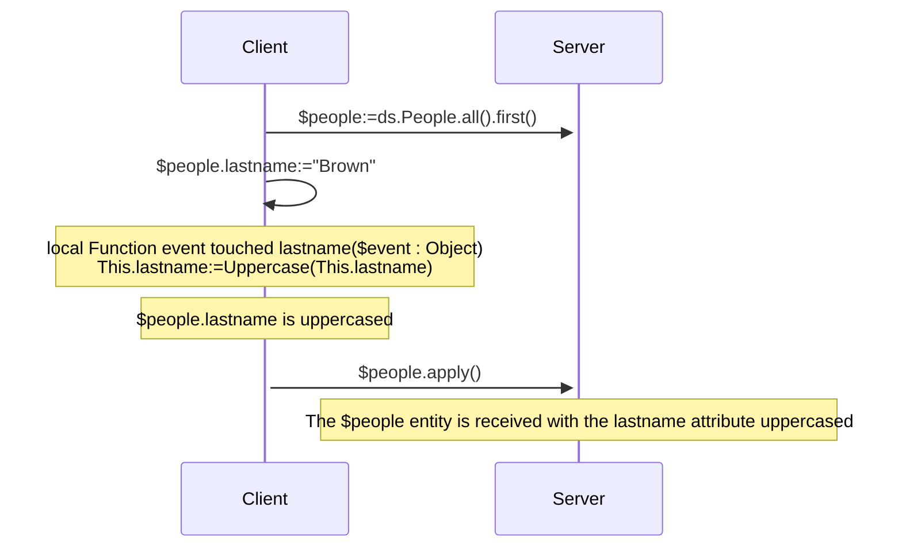
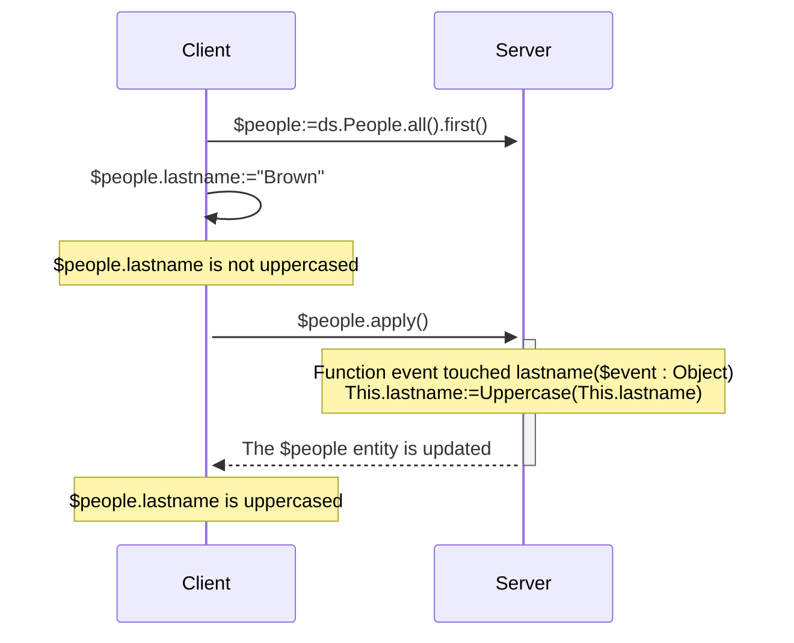
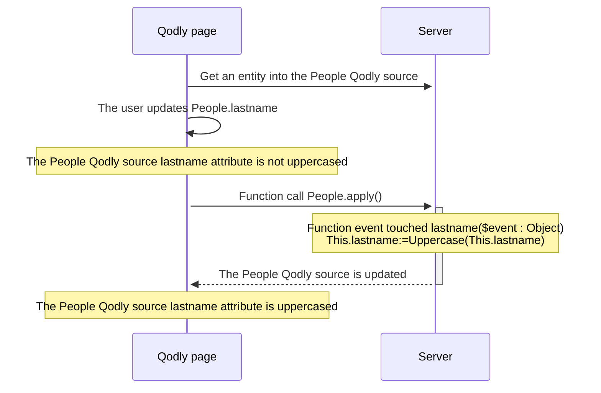

<details><summary>履歴</summary>

| リリース   | 内容             |
| ------ | -------------- |
| 20 R10 | touched イベント追加 |

</details>

エンティティイベントとは、エンティティやエンティティ属性が操作(追加、削除、変更)されるたびに ORDA によって自動的に呼び出される関数です。 シンプルなイベントを書き、それをより洗練されたものに変えていくことができます。

イベント関数の実行は直接トリガーすることはできません。 イベントは、ユーザーアクションや、エンティティまたはその属性に対するコードを通して実行された操作に基づいて、ORDA によって自動的に呼び出されます。

:::info 互換性に関する注意

データストアにおける ORDA エンティティイベントは、4D データベースにおけるトリガに相当します。 しかしながら、4D クラシックランゲージコマンドを使用して 4D データベースレベルでトリガーされたアクション、あるいは標準アクションは、ORDA イベントをトリガーしません。 また、トリガとは異なり、ORDA エンティティイベントはエンティティを保存または削除する際に、データクラスの元となるテーブル全体をロックしないことに注意して下さい。 個別のエンティティ(つまりレコード)に起因している限りは、複数のイベントが同時に実行されることが可能です。

:::

## 概要

### イベントレベル

エンティティイベント関数は必ず[Entity クラス](../ORDA/ordaClasses.md#entity-class) 内で定義されます。

イベントは **エンティティ** レベルまたは **属性** レベルで設定することができます(属性には [**計算属性**](../ORDA/ordaClasses.md#計算属性) も含まれます)。 前者の場合、エンティティのあらゆる属性でイベントがトリガーされます。それ以外の場合、イベントは対象となる属性に対してのみトリガーされます。

同じイベントに対して、異なる属性に対して異なる関数を定義することができます。

また同じイベントを属性レベルとエンティティレベルの両方で定義することも可能です。 その場合、属性イベントが先に呼ばれ、その後にエンティティイベントが呼ばれます。

### リモート構成における実行

一般的に、ORDA イベントはサーバー上で実行されます。

しかしながらクライアント/サーバー構成においては、[`local`](./ordaClasses.md#local-functions) キーワードの使用によっては、`touched()` イベント関数を**サーバーまたはクライアント**で実行することが可能です。 クライアント側で特定の実装をすることにより、イベントをクライアント上でトリガーすることができるようになります。

:::note

ORDA [`constructor()`](./ordaClasses.md#class-constructor) 関数は必ずクライアント上で実行されます。

:::

他のリモート設定(例:  Qodly アプリケーション、[REST API リクエスト](../REST/REST_requests.md)、あるいは[`Open datastore`](../commands/open-datastore.md) を通したリクエスト) では、`touched()` イベント関数は必ず**サーバー側**で実行されます。 これはつまり、イベントがトリガーされるためには、属性がタッチされたということを必ずサーバーが"見える"ようにしておかなければならないということを意味します(以下参照)。

### 概要表

以下の表は、ORDA エンティティイベントの一覧とそのルールをまとめたものです。

| イベント           | レベル    | 関数名                                                     |            (C/S の場合) 実行される場所            |
| :------------- | :----- | :------------------------------------------------------ | :--------------------------------------------------------: |
| エンティティのインスタンス化 | Entity | [`constructor()`](./ordaClasses.md#class-constructor-1) |                           client                           |
| 属性がタッチされた      | 属性     | `event touched <attrName>()`                            | [`local`](../ORDA/ordaClasses.md#local-functions) キーワードによる |
|                | Entity | `event touched()`                                       | [`local`](../ORDA/ordaClasses.md#local-functions) キーワードによる |

:::note

[`constructor()`](./ordaClasses.md#class-constructor-1) 関数は実際にはイベント関数ではありませんが、エンティティがインスタンス化される際に必ず呼び出されます。

:::

## *event* 引数

イベント関数は、単一の *event* オブジェクトを引数として受け取ります。 関数が呼び出されると、引数には複数のプロパティに値が入れられます:

| プロパティ名          | 利用可能性        | 型   | 説明                                         |
| :-------------- | :----------- | :-- | :----------------------------------------- |
| `kind`          | 常に           | 文字列 | イベント名("touched")        |
| *attributeName* | 属性に関するイベントのみ | 文字列 | 属性名 (*例* "firstname")   |
| *dataClassName* | 常に           | 文字列 | データクラス名 (*例* "Company") |

## Event function description

### `Function event touched`

#### シンタックス

```4d
{local} Function event touched($event : Object)
{local} Function event touched <attributeName>($event : Object)
// code
```

This event is triggered each time a value is modified in the entity.

- 関数をエンティティレベルで定義していた場合(第一シンタックス)、その関数はエンティティの任意の属性における変更に対してトリガーされます。
- 関数を属性レベルで定義していた場合(第二シンタックス)、関数はその属性に対する変更に対してのみトリガーされます。

This event is triggered as soon as the 4D Server / 4D engine can detect a modification of attribute value which can be due to the following actions:

- in **client/server with the [`local` keyword](../ORDA/ordaClasses.md#local-functions)** or in **4D single-user**:
  - the user sets a value on a 4D form,
  - the 4D code makes an assignment with the `:=` operator. The event is also triggered in case of self-assignment (`$entity.attribute:=$entity.attribute`).
- in **client/server without the `local` keyword**: some 4D code that makes an assignment with the `:=` operator is [executed on the server](../commands-legacy/execute-on-server.md).
- **`local` キーワードを使用しないクライアント/サーバー**、**[Qodly アプリケーション](https://developer.qodly.com/docs)** および **[リモートデータストア](../commands/open-datastore.md)**: ORDA 関数(エンティティ上の関数あるいはエンティティを引数として使用する関数)を呼び出した場合にはエンティティは4D Server に受信されます。 It means that you might have to implement a *refresh* or *preview* function on the remote application that sends an ORDA request to the server and triggers the event.
- with the REST server: the value is received on the REST server with a [REST request](../REST/$method.md#methodupdate) (`$method=update`)

The function receives an [*event* object](#event-parameter) as parameter.

このイベントがエラーを[throw](../commands-legacy/throw.md) する場合でも、進行中のアクションは停止しません。

:::note

This event is also triggered:

- when attributes are assigned by the [`constructor()`](./ordaClasses.md#class-constructor-1) event,
- when attributes are edited through the [Data Explorer](../Admin/dataExplorer.md).

:::

#### 例題 1

You want to uppercase all text attributes of an entity when it is updated.

```4d
    //ProductsEntity class
Function event touched($event : Object)
	
	If (Value type(This[$event.attributeName])=Is text)
		This[$event.attributeName]:=Uppercase(This[$event.attributeName])
	End if 
```

#### 例題 2

The "touched" event is useful when it is not possible to write indexed query code in [`Function query()`](./ordaClasses.md#function-query-attributename) for a [computed attribute](./ordaClasses.md#computed-attributes).

This is the case for example, when your [`query`](./ordaClasses.md#function-query-attributename) function has to compare the value of different attributes from the same entity with each other. You must use formulas in the returned ORDA query -- which triggers sequential queries.

To fully understand this case, let's examine the following two calculated attributes:

```4d
Function get onGoing() : Boolean
        return ((This.departureDate<=Current date) & (This.arrivalDate>=Current date))

Function get sameDay() : Boolean
        return (This.departureDate=This.arrivalDate)
```

Even though they are very similar, these functions cannot be associated with identical queries because they do not compare the same types of values. The first compares attributes to a given value, while the second compares attributes to each other.

- For the *onGoing* attribute, the [`query`](./ordaClasses.md#function-query-attributename) function is simple to write and uses indexed attributes:

```4d
Function query onGoing($event : Object) : Object
    var $operator : Text
    var $myQuery : Text
    var $onGoingValue : Boolean
    var $parameters : Collection
    $parameters:=New collection()

    $operator:=$event.operator
    Case of 
            : (($operator="=") | ($operator="==") | ($operator="==="))
                $onGoingValue:=Bool($event.value)
            : (($operator="!=") | ($operator="!=="))
                $onGoingValue:=Not(Bool($event.value))
            Else 
                return {query: ""; parameters: $parameters}
    End case 

    $myQuery:=($onGoingValue) ? "departureDate <= :1 AND arrivalDate >= :1" : "departureDate > :1 OR arrivalDate < :1"
        // the ORDA query string uses indexed attributes, it will be indexed
    $parameters.push(Current date)
    return {query: $myQuery; parameters: $parameters}
```

- For the *sameDay* attribute, the [`query`](./ordaClasses.md#function-query-attributename) function requires an ORDA query based on formulas and will be sequential:

```4d
Function query sameDay($event : Object) : Text
    var $operator : Text
    var $sameDayValue : Boolean

    $operator:=$event.operator
    Case of 
        : (($operator="=") | ($operator="==") | ($operator="==="))
            $sameDayValue:=Bool($event.value)
        : (($operator="!=") | ($operator="!=="))
            $sameDayValue:=Not(Bool($event.value))
        Else 
            return ""
        End case 

    return ($sameDayValue) ? "eval(This.departureDate = This.arrivalDate)" : "eval(This.departureDate != This.arrivalDate)"
        // the ORDA query string uses a formula, it will not be indexed

```

- Using a **scalar** *sameDay* attribute updated when other attributes are "touched" will save time:

```4d
    //BookingEntity class

Function event touched departureDate($event : Object) 

    This.sameDay:=(This.departureDate = This.arrivalDate) 
//
//
Function event touched arrivalDate($event : Object) 

    This.sameDay:=(This.departureDate = This.arrivalDate)

```

#### Example 3 (diagram): Client/server with the `local` keyword:



#### Example 4 (diagram): Client/server without the `local` keyword



#### Example 5 (diagram): Qodly application




