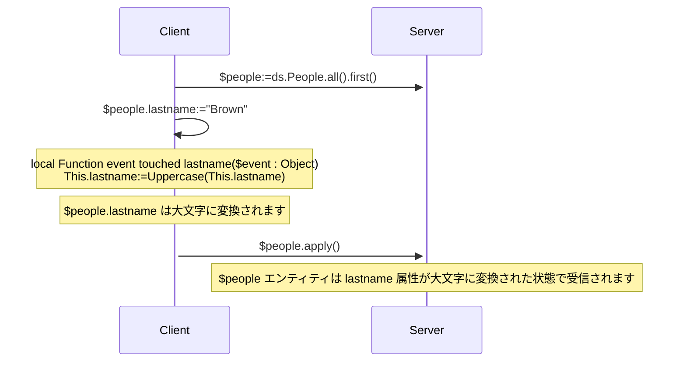
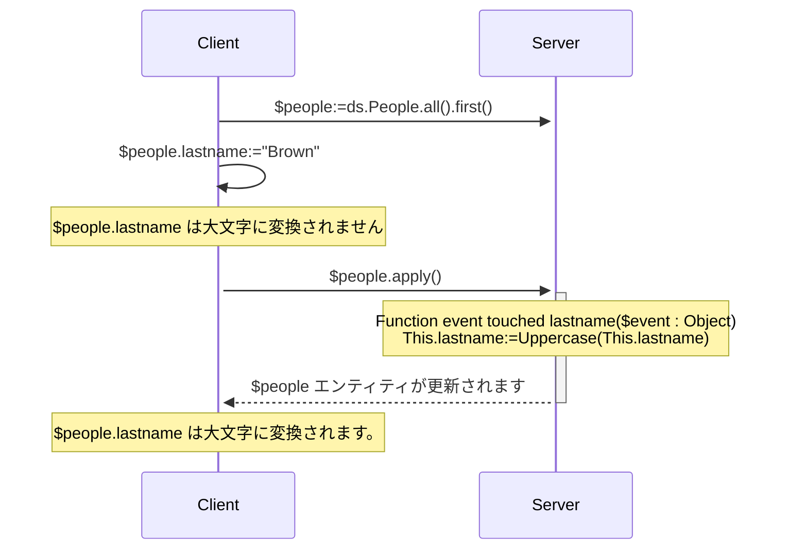
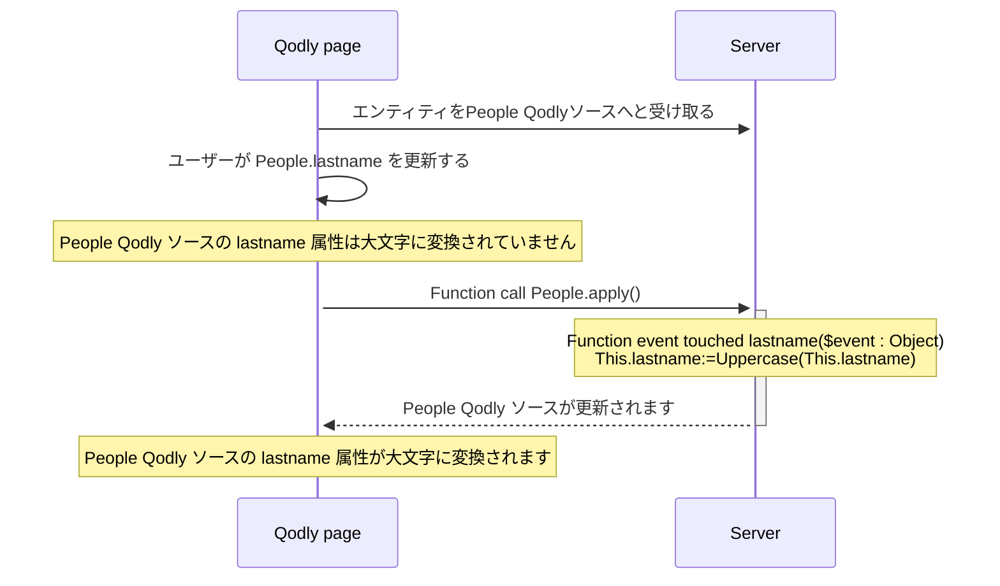

<details><summary>履歴</summary>

| リリース   | 内容             |
| ------ | -------------- |
| 20 R10 | touched イベント追加 |

</details>

エンティティイベントとは、エンティティやエンティティ属性が操作(追加、削除、変更)されるたびに ORDA によって自動的に呼び出される関数です。 シンプルなイベントを書き、それをより洗練されたものに変えていくことができます。

イベント関数の実行は直接トリガーすることはできません。 イベントは、ユーザーアクションや、エンティティまたはその属性に対するコードを通して実行された操作に基づいて、ORDA によって自動的に呼び出されます。

:::info 互換性に関する注意

データストアにおける ORDA エンティティイベントは、4D データベースにおけるトリガに相当します。 しかしながら、4D クラシックランゲージコマンドを使用して 4D データベースレベルでトリガーされたアクション、あるいは標準アクションは、ORDA イベントをトリガーしません。 また、トリガとは異なり、ORDA エンティティイベントはエンティティを保存または削除する際に、データクラスの元となるテーブル全体をロックしないことに注意して下さい。 個別のエンティティ(つまりレコード)に起因している限りは、複数のイベントが同時に実行されることが可能です。

:::

## 概要

### イベントレベル

エンティティイベント関数は必ず[Entity クラス](../ORDA/ordaClasses.md#entity-class) 内で定義されます。

イベントは **エンティティ** レベルまたは **属性** レベルで設定することができます(属性には [**計算属性**](../ORDA/ordaClasses.md#計算属性) も含まれます)。 前者の場合、エンティティのあらゆる属性でイベントがトリガーされます。それ以外の場合、イベントは対象となる属性に対してのみトリガーされます。

同じイベントに対して、異なる属性に対して異なる関数を定義することができます。

また同じイベントを属性レベルとエンティティレベルの両方で定義することも可能です。 その場合、属性イベントが先に呼ばれ、その後にエンティティイベントが呼ばれます。

### リモート構成における実行

一般的に、ORDA イベントはサーバー上で実行されます。

しかしながらクライアント/サーバー構成においては、[`local`](./ordaClasses.md#local-functions) キーワードの使用によっては、`touched()` イベント関数を**サーバーまたはクライアント**で実行することが可能です。 クライアント側で特定の実装をすることにより、イベントをクライアント上でトリガーすることができるようになります。

:::note

ORDA [`constructor()`](./ordaClasses.md#class-constructor) 関数は必ずクライアント上で実行されます。

:::

他のリモート設定(例:  Qodly アプリケーション、[REST API リクエスト](../REST/REST_requests.md)、あるいは[`Open datastore`](../commands/open-datastore.md) を通したリクエスト) では、`touched()` イベント関数は必ず**サーバー側**で実行されます。 これはつまり、イベントがトリガーされるためには、属性がタッチされたということを必ずサーバーが"見える"ようにしておかなければならないということを意味します(以下参照)。

### 概要表

以下の表は、ORDA エンティティイベントの一覧とそのルールをまとめたものです。

| イベント           | レベル    | 関数名                                                     |            (C/S の場合) 実行される場所            |
| :------------- | :----- | :------------------------------------------------------ | :--------------------------------------------------------: |
| エンティティのインスタンス化 | Entity | [`constructor()`](./ordaClasses.md#class-constructor-1) |                           client                           |
| 属性がタッチされた      | 属性     | `event touched <attrName>()`                            | [`local`](../ORDA/ordaClasses.md#local-functions) キーワードによる |
|                | Entity | `event touched()`                                       | [`local`](../ORDA/ordaClasses.md#local-functions) キーワードによる |

:::note

[`constructor()`](./ordaClasses.md#class-constructor-1) 関数は実際にはイベント関数ではありませんが、エンティティがインスタンス化される際に必ず呼び出されます。

:::

## *event* 引数

イベント関数は、単一の *event* オブジェクトを引数として受け取ります。 関数が呼び出されると、引数には複数のプロパティに値が入れられます:

| プロパティ名          | 利用可能性        | 型   | 説明                                         |
| :-------------- | :----------- | :-- | :----------------------------------------- |
| `kind`          | 常に           | 文字列 | イベント名("touched")        |
| *attributeName* | 属性に関するイベントのみ | 文字列 | 属性名 (*例* "firstname")   |
| *dataClassName* | 常に           | 文字列 | データクラス名 (*例* "Company") |

## イベント関数の詳細

### `Function event touched`

#### シンタックス

```4d
{local} Function event touched($event : Object)
{local} Function event touched <attributeName>($event : Object)
// コード
```

このイベントはエンティティ内の値が編集されるたびにトリガーされます。

- 関数をエンティティレベルで定義していた場合(第一シンタックス)、その関数はエンティティの任意の属性における変更に対してトリガーされます。
- 関数を属性レベルで定義していた場合(第二シンタックス)、関数はその属性に対する変更に対してのみトリガーされます。

このイベントは4D Server / 4Dエンジンが属性値の変更を検知するとすぐにトリガーされます。この変更は、以下のようなアクションによって引き起こされます:

- **[`local` キーワード](../ORDA/ordaClasses.md#local関数) を使用したクライアント/サーバー** あるいは **シングルユーザーモードの4D**:
  - ユーザーが4D フォーム上で値を設定した
  - 4D コードが `:=` 演算子によって代入を行った。 このイベントは自己代入の場合にもトリガーされます(`$entity.attribute:=$entity.attribute`)。
- **`local` キーワード を使用しないクライアント/サーバー**: `:=` 演算子によって代入を行う一部の4D コードは、[サーバー上で実行されます](../commands-legacy/execute-on-server.md)。
- **`local` キーワードを使用しないクライアント/サーバー**、**[Qodly アプリケーション](https://developer.qodly.com/docs)** および **[リモートデータストア](../commands/open-datastore.md)**: ORDA 関数(エンティティ上の関数あるいはエンティティを引数として使用する関数)を呼び出した場合にはエンティティは4D Server に受信されます。 これはつまり、リモートアプリケーション側に*refresh* あるいは *preview* 関数を実装することでORDA リクエストをサーバーに送信し、イベントをトリガーするようにする必要があるかもしれない、ということです。
- REST サーバー: 値は REST サーバーに、[REST リクエスト](../REST/$method.md#methodupdate) (`$method=update`) とともに受信されます。

関数は [*event* オブジェクト](#event-引数) を引数として受け取ります。

このイベントがエラーを[throw](../commands-legacy/throw.md) する場合でも、進行中のアクションは停止しません。

:::note

このイベントは以下の場合にもトリガーされます:

- 属性の値が [`constructor()`](./ordaClasses.md#class-constructor-1) イベントによって代入された場合
- 属性の値が [データエクスプローラー](../Admin/dataExplorer.md) を通して編集された場合。

:::

#### 例題 1

エンティティが更新されたときに、エンティティ内のテキスト属性を全て大文字に変換したい場合を考えます。

```4d
    //ProductsEntity class
Function event touched($event : Object)
	
	If (Value type(This[$event.attributeName])=Is text)
		This[$event.attributeName]:=Uppercase(This[$event.attributeName])
	End if 
```

#### 例題 2

"touched" イベントは、[計算属性](./ordaClasses.md#計算属性)に対して[`Function query()`](./ordaClasses.md#function-query-attributename) 内でインデックスクエリコードを書くことが不可能な場合にとても有用です。

これは例えば、[`query`](./ordaClasses.md#function-query-attributename) 関数が同じエンティティの異なる属性の値どうしを比較したいような場合です。 これは返されたORDA クエリ内でフォーミュラを使う必要があり、結果としてシーケンシャルクエリをトリガーすることになります。

このような場合を完全に理解するために、以下の2つの計算属性について調べてみましょう:

```4d
Function get onGoing() : Boolean
        return ((This.departureDate<=Current date) & (This.arrivalDate>=Current date))

Function get sameDay() : Boolean
        return (This.departureDate=This.arrivalDate)
```

たとえ非常に似ていたとしても、これらのクエリは同じ型の値を比較している訳ではないため、これらの関数を同一のクエリと関連づけることはできません。 前者は属性を与えられた値と比較する一方、後者は属性どうしを比較します。

- *onGoing* 属性に対しては、[`query`](./ordaClasses.md#function-query-attributename) 関数をシンプルに書くことができ、またインデックス付きの属性を使用します:

```4d
Function query onGoing($event : Object) : Object
    var $operator : Text
    var $myQuery : Text
    var $onGoingValue : Boolean
    var $parameters : Collection
    $parameters:=New collection()

    $operator:=$event.operator
    Case of 
            : (($operator="=") | ($operator="==") | ($operator="==="))
                $onGoingValue:=Bool($event.value)
            : (($operator="!=") | ($operator="!=="))
                $onGoingValue:=Not(Bool($event.value))
            Else 
                return {query: ""; parameters: $parameters}
    End case 

    $myQuery:=($onGoingValue) ? "departureDate <= :1 AND arrivalDate >= :1" : "departureDate > :1 OR arrivalDate < :1"
        // ORDA クエリ文字列はインデックス付き属性を使用するので、インデックスがつけられます
    $parameters.push(Current date)
    return {query: $myQuery; parameters: $parameters}
```

- *sameDay* 属性に対しては、[`query`](./ordaClasses.md#function-query-attributename) 関数はフォーミュラに基づいたORDA クエリを必要とするため、検索はシーケンシャルに行われます:

```4d
Function query sameDay($event : Object) : Text
    var $operator : Text
    var $sameDayValue : Boolean

    $operator:=$event.operator
    Case of 
        : (($operator="=") | ($operator="==") | ($operator="==="))
            $sameDayValue:=Bool($event.value)
        : (($operator="!=") | ($operator="!=="))
            $sameDayValue:=Not(Bool($event.value))
        Else 
            return ""
        End case 

    return ($sameDayValue) ? "eval(This.departureDate = This.arrivalDate)" : "eval(This.departureDate != This.arrivalDate)"
        // ORDA クエリ文字列はフォーミュラを使用するため、インデックスはつけられません

```

- しかし他の属性が"タッチ"されたときに更新される**スカラー値の** *sameDay* 属性を使用することで、時間を節約することができます:

```4d
    //BookingEntity class

Function event touched departureDate($event : Object) 

    This.sameDay:=(This.departureDate = This.arrivalDate) 
//
//
Function event touched arrivalDate($event : Object) 

    This.sameDay:=(This.departureDate = This.arrivalDate)

```

#### 例題 3 (図): `local` キーワードを用いたクライアント/サーバー:



#### 例題 4 (図): `local` キーワードを用いないクライアント/サーバー



#### 例題 5 (図): Qodly アプリケーション




