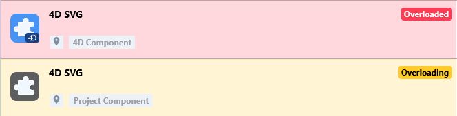
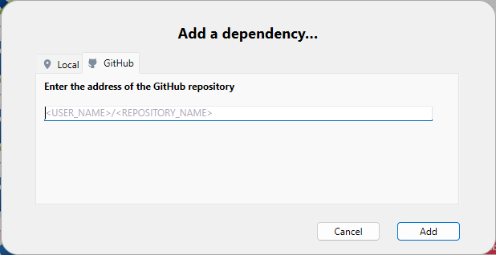

4D のコンポーネントとは、プロジェクトに追加可能な、1つ以上の機能を持つ 4Dコードや 4Dフォームの一式です。 たとえば、[4D SVG](https://github.com/4d/4D-SVG)コンポーネント は、SVGファイルの表示するための高度なコマンドと統合されたレンダリングエンジンを追加します。

独自の 4Dコンポーネントを [開発](../Extensions/develop-components.md) し、[ビルド](../Desktop/building.md) することもできますし、4Dコミュニティによって共有されているパブリックコンポーネントを [GitHubで見つけて](https://github.com/search?q=4d-component\\\\\\&type=Repositories) ダウンロードすることもできます。

4D で開発する際、コンポーネントファイルはコンピューター上または Githubリポジトリ上に、透過的に保存することができます。

## インタープリターとコンパイル済みコンポーネント

コンポーネントは、インタープリターまたは [コンパイル済み](../Desktop/building.md) のものが使えます。

- インタープリターモードで動作する 4Dプロジェクトは、インタープリターまたはコンパイル済みどちらのコンポーネントも使用できます。
- コンパイルモードで実行される 4Dプロジェクトでは、インタープリターのコンポーネントを使用できません。 この場合、コンパイル済みコンポーネントのみが利用可能です。

### パッケージフォルダ

コンポーネントのパッケージフォルダ(*MyComponent.4dbase* フォルダ) には以下のものを含めることができます:

- **インタープリタ版コンポーネント**の場合: 標準の[Project フォルダ](../Project/architecture.md)。 [プロジェクトの**Components** フォルダ](architecture.md#コンポーネント)にインストールする場合には、パッケージフォルダ名の末尾を **.4dbase** にする必要があります。
- **コンパイル版コンポーネント**の場合:
  - .4DZ ファイル、*Resources* フォルダ、*Info.plist* ファイルを格納している"Contents" フォルダ(推奨されるアーキテクチャ)
  - *Resources* などの他のフォルダを格納している.4DZ ファイル。

:::note

アプリケーションをmacOS 上で[公証](../Desktop/building.md#公証について) したい場合には、"Contents" フォルダアーキテクチャーが推奨されます。

:::

## 4D製のコンポーネント

4D には、自社で開発されたコンポーネントのセットが含まれています。 これらはすべて、[4D github リポジトリ](https://github.com/4d) にもあります。

| コンポーネント                                                              | 説明                                                                                                                                              | 主な機能                                                                                                                                    |
| -------------------------------------------------------------------- | ----------------------------------------------------------------------------------------------------------------------------------------------- | --------------------------------------------------------------------------------------------------------------------------------------- |
| [4D AiIKit](https://github.com/4d/4D-AIKit)                          | サードパーティのOpenAI API に接続するためのクラス群                                                                                                                 | `OpenAIChat`, `OpenAIImage`...                                                          |
| [4D Labels](https://github.com/4d/4D-Labels)                         | ラベルテンプレートを作成するための内部コンポーネント                                                                                                                      |                                                                                                                                         |
| [4D NetKit](https://developer.4d.com/4D-NetKit)                      | サードパーティAPI に接続するためのWeb サービスツール群                                                                                                                 | `OAuth2Provider` class, `New OAuth2 provider`, `OAuth2ProviderObject.getToken()`                                                        |
| [4D Progress](https://github.com/4d/4D-Progress)                     | 1つ以上の進捗バーを同じウィンドウで開く                                                                                                                            | `Progress New`, `Progress SET ON STOP METHOD`, `Progress SET PROGRESS`, ...             |
| [4D SVG](https://github.com/4d/4D-SVG)                               | 一般的な svgグラフィックオブジェクトの作成・操作                                                                                                                      | `SVGTool_Display_viewer`, 複数の `SVG_` メソッド                                                                                               |
| [4D ViewPro](ViewPro/getting-started.md)                             | フォームに追加できる表計算機能                                                                                                                                 | [4D View Pro ドキュメンテーション](ViewPro/getting-started.md) 参照。                                                                                |
| [4D Widgets](https://github.com/4d/4D-Widgets)                       | DatePicker, TimePicker, SearchPicker 4Dウィジェットの管理                                                                                                | `DatePicker calendar`, `DateEntry area`, `TimeEntry`, `SearchPicker SET HELP TEXT`, ... |
| [4D WritePro Interface](https://github.com/4d/4D-WritePro-Interface) | [4D Write Pro](https://doc.4d.com/4Dv20R9/4D/20-R9/Entry-areas.300-7543821.ja.html) パレットと [表ウィザード](../WritePro/writeprointerface.md#表ウィザード) の管理 | `WP PictureSettings`, `WP ShowTabPages`, `WP SwitchToolbar`, `WP UpdateWidget`                                                          |

## コンポーネントの読み込み

:::note

このページでは、**4D** と **4D Server** 環境でのコンポーネントの使用方法について説明します。 他の環境では、コンポーネントの管理は異なります:

- [リモートモードの 4D](../Desktop/clientServer.md) では、サーバーがコンポーネントを読み込み、リモートアプリケーションに送信します。
- 統合されたアプリケーションでは、コンポーネントは [ビルドする際に組み込まれます](../Desktop/building.md#プラグインコンポーネントページ)。

:::

### 概要

4Dプロジェクトにコンポーネントを読み込むには、以下の方法があります:

- コンポーネントファイルを[プロジェクトの**Components**フォルダ](architecture.md#components)内にコピーする(インタープリタ版コンポーネントパッケージフォルダはフォルダ名の末尾が".4dbase" になっている必要があります、上記参照)。
- または、プロジェクトの **dependencies.json** ファイルでコンポーネントを宣言します。これは、[**依存関係インターフェースを使用して依存関係を追加**](#github依存関係の追加) するときに、ローカルファイルに対して自動的におこなわれます。

**dependencies.json** ファイルで宣言されているコンポーネントは、異なる場所に保存できます:

- 4Dプロジェクトのパッケージフォルダーと同じ階層 (デフォルトの場所です)
- マシン上の任意の場所 (コンポーネントパスは **environment4d.json** ファイル内で宣言する必要があります)
- GitHubリポジトリ (コンポーネントパスは、**dependencies.json** ファイルまたは **environment4d.json** ファイル、あるいはその両方で宣言できます)

同じコンポーネントが異なる場所にインストールされている場合、[優先順位](#優先順位) が適用されます。

### dependencies.json と environment4d.json

#### dependencies.json

**dependencies.json** ファイルは、4Dプロジェクトに必要なすべてのコンポーネントを宣言します。 このファイルは、4Dプロジェクトフォルダーの **Sources** フォルダーに置く必要があります。例:

```
	/MyProjectRoot/Project/Sources/dependencies.json
```

このファイルには次の内容を含めることができます:

- [ローカル保存されている](#ローカルコンポーネント) コンポーネントの名前(デフォルトパス、または **environment4d.json** ファイルで定義されたパス)。
- [GitHubリポジトリ](#github-に保存されたコンポーネント) に保存されているコンポーネントの名前 (パスはこのファイルまたは **environment4d.json** ファイルで定義できます)。

#### environment4d.json

**environment4d.json** ファイルは必須ではありません。 このファイルは、**dependencies.json** ファイル内で宣言された一部またはすべてのコンポーネントのついて、**カスタムパス** を定義するのに使用します。 このファイルは、プロジェクトパッケージフォルダーまたはその親フォルダーのいずれかに保存することができます (ルートまでの任意のレベル)。

このアーキテクチャーの主な利点は次のとおりです:

- **environment4d.json** ファイルをプロジェクトの親フォルダーに保存することで、コミットしないように選択できることです。これにより、ローカルでのコンポーネントの管理が可能になります。
- 複数のプロジェクトで同じ GitHubリポジトリを使用したい場合は、**dependencies.json** ファイルでそれを宣言し、**environment4d.json** ファイルで参照することができます。

### 優先順位

コンポーネントはさまざまな方法でインストールできるため、同じコンポーネントが複数の場所で参照される場合、優先順位が適用されます:

**優先度高**

1. [プロジェクトの **Components** フォルダー](architecture.md#components) に置かれているコンポーネント
2. dependencies.json\*\*ファイルで宣言されたコンポーネント (ローカル環境を構成するために **environment4d.json** で指定されたパスは **dependencies.json** のパスをオーバーライドします)。
3. 内部のユーザー4Dコンポーネント (4D NetKit、4D SVG など)

**優先度低**


同じコンポーネントの別のインスタンス (A) がより高い優先度レベルにあるためにコンポーネント (B) を読み込めない場合、AとBのコンポーネントにはそれぞれ専用の [ステータス](#依存関係のステータス) が付与されます: 読み込まれなかったコンポーネント (B) には *Overloaded* ステータス、読み込まれたコンポーネント (A) には *Overloading* ステータスが与えられます。

### ローカルコンポーネント

ローカルコンポーネントは [**dependencies.json**ファイル](#dependenciesjson) にて次のように宣言します:

```json
{
    "dependencies": {
        "myComponent1" : {},
        "myComponent2" : {}
    }
}
```

... 上記の "myComponent1" と "myComponent2" は読み込むコンポーネントの名前です。

デフォルトの (つまり、"myComponent1" と "myComponent2" が [**environment4d.json**](#environment4djson) ファイルで宣言されていない) 場合、4D はコンポーネントのパッケージフォルダー (コンポーネントのプロジェクトルートフォルダーのこと) を 4Dプロジェクトのパッケージフォルダーと同じ階層に探します。例:

```
	/MyProjectRoot/
	/MyProjectComponentRoot/
```

このアーキテクチャーにより、プロジェクトと同じレベルにすべてのコンポーネントにコピーし、**dependencies.json** ファイルで参照することができます。

:::note

**dependencies.json** のアーキテクチャーを利用したくない場合は、[プロジェクトの **Components** フォルダー](architecture.md#components) にコンポーネントをコピーすることで、ローカルコンポーネントをインストールすることもできます。

:::

#### コンポーネントパスのカスタマイズ

ローカルコンポーネントの場所をカスタマイズしたい場合は、プロジェクトフォルダーと同じ階層に保存されていない依存関係のパスを、[**environment4d.json**](#environment4djson) ファイルに定義します。

**相対パス** または **絶対パス** を使用できます (下記参照)。

例:

```json
{
	"dependencies": {
		"myComponent1" : "MyComponent1",
		"myComponent2" : "../MyComponent2",
    "myComponent3" : "file:///Users/jean/MyComponent3"
    }
}
```

:::note

**environment4d.json** ファイルで定義されたコンポーネントのパスが、プロジェクトの開始時に見つからない場合、コンポーネントは読み込まれず、*Not found* [ステータス](#依存関係のステータス) が表示されます。

:::

#### 相対パス vs 絶対パス

パスは、POSIXシンタックスで表します ([POSIXシンタックス](../Concepts/paths#posix-シンタックス) 参照)。

相対パスは、[`environment4d.json`](#environment4djson) ファイルを基準とした相対パスです。 絶対パスは、ユーザーのマシンにリンクされています。

コンポーネントアーキテクチャーの柔軟性と移植性のため、ほとんどの場合、相対パスを使用することが **推奨** されます (特に、プロジェクトがソース管理ツールにホストされている場合)。

絶対パスは、1台のマシンと 1人のユーザーに特化したコンポーネントの場合にのみ使用すべきです。

### GitHub に保存されたコンポーネント

GitHubリリースとして利用可能な 4Dコンポーネントを参照して、4Dプロジェクトに自動で読み込んで更新することができます。

:::note

GitHub に保存されているコンポーネントに関しては、[**dependencies.json**](#dependenciesjson) ファイルと [**environment4d.json**](#environment4djson) ファイルの両方で同じ内容をサポートしています。

:::

#### GitHubリポジトリの設定

GitHub に保存された 4Dコンポーネントを直接参照して使用するには、GitHubコンポーネントのリポジトリを設定する必要があります。

- ZIP形式でコンポーネントファイルを圧縮します。
- GitHubリポジトリと同じ名前をこのアーカイブに付けます。
- このリポジトリの [GitHubリリース](https://docs.github.com/ja/repositories/releasing-projects-on-github/managing-releases-in-a-repository) にアーカイブを統合します。

これらのステップは、4Dコードや GitHubアクションを使用することで簡単に自動化できます。

#### パスの宣言

GitHub に保存されているコンポーネントは [**dependencies.json**ファイル](#dependenciesjson) にて次のように宣言します:

```json
{
	"dependencies": {
		"myGitHubComponent1": {
			"github" : "JohnSmith/myGitHubComponent1"
		},
		"myGitHubComponent2": {}
	}
}
```

... 上記の場合、"myGitHubComponent1" は宣言とパス定義の両方がされていますが、"myComponent2" は宣言されているだけです。 **environment4d.json** ファイルは必須ではありません。 このファイルは、**dependencies.json** ファイル内で宣言された一部またはすべてのコンポーネントのついて、**カスタムパス** を定義するのに使用します。 このファイルは、プロジェクトパッケージフォルダーまたはその親フォルダーのいずれかに保存することができます (ルートまでの任意のレベル)。

```json
{
	"dependencies": {
		"myGitHubComponent2": {
			"github" : "JohnSmith/myGitHubComponent2"
		}
	}
}
```

"myGitHubComponent2" は複数のプロジェクトで使用できます。

#### タグとバージョン

GitHubでリリースが作成されると、そこに**タグ**と**バージョン**が関連づけられます。 依存関係マネージャーはこれらの情報を使用してコンポーネントの自動利用可能性を管理します。

:::note

[**4Dのバージョンに追随する**](#defining-a-github-dependency-version-range) 依存関係ルールを選択した場合、[タグには特定の命名規則](#4dバージョンタグの命名規則) を使用する必要があります。

:::

- **タグ** はリリースを一意に参照するテキストです。 [**dependencies.json** ファイル](#dependenciesjson) および [**environment4d.json**](#environment4djson) ファイルでは、プロジェクトで使用するリリースタグを指定することができます。 たとえば:

```json
{
	"dependencies": {
		"myFirstGitHubComponent": {
			"github": "JohnSmith/myFirstGitHubComponent",
			"tag": "beta2"
		}
	}
}
```

- リリースは **バージョン** によっても識別されます。 使用されるバージョニングシステムは一般的に使用されている [*セマンティックバージョニング*](https://regex101.com/r/Ly7O1x/3/) コンセプトに基づいています。 各バージョン番号は次のように識別されます: `majorNumber.minorNumber.pathNumber`。 タグと同様に、プロジェクトで使用したいコンポーネントのバージョンを指定することができます。例:

```json
{
	"dependencies": {
		"myFirstGitHubComponent": {
			"github": "JohnSmith/myFirstGitHubComponent",
			"version": "2.1.3"
		}
	}
}
```

範囲は、最小値と最大値を示す 2つのセマンティックバージョンと演算子 ('`< | > | >= | <= | =`') で定義します。 `*` はすべてのバージョンのプレースホルダーとして使用できます。 ~ および ^ の接頭辞は、数字で始まるバージョンを定義し、それぞれ次のメジャーバージョンおよびマイナーバージョンまでの範囲を示します。

以下にいくつかの例を示します:

- "`latest`": GitHubリリースで "latest" バッジを持つバージョン。
- "`*`": リリースされている最新バージョン。
- "`1.*`": メジャーバージョン 1 の全バージョン。
- "`1.2.*`": マイナーバージョン 1.2 のすべてのパッチ。
- "`>=1.2.3`": 1.2.3 を含む、以降の最新バージョン。
- "`>1.2.3`": 1.2.3 を含まない、以降の最新バージョン。
- "`^1.2.3`": バージョン 1.2.3 を含む、以降の最新のバージョン1 (バージョン2未満であること)。
- "`~1.2.3`": バージョン 1.2.3 を含む、以降の最新のバージョン 1.2 (バージョン1.3未満であること)。
- "`<=1.2.3`": 1.2.3 までの最新バージョン。
- "`1.0.0 – 1.2.3`" または ">=1.0.0 <=1.2.3": 1.0.0 から 1.2.3 までのバージョン。
- "`<1.2.3 ||>=2`": 1.2.3 から 2.0.0 未満までを除いたバージョン。

タグやバージョンを指定しない場合、4D は自動的に "latest" バージョンを取得します。

依存関係マネージャーはコンポーネントの更新がGitHub上で利用可能かどうかを定期的にチェックします。 コンポーネントに対して新しいバージョンが利用可能だった場合、[設定に応じて](#github依存関係バージョン範囲)依存関係一覧の中で更新マークが表示されます。

#### 4Dバージョンタグの命名規則

[**4Dのバージョンに追随する**](#github依存関係バージョン範囲) 依存関係ルールを使用したい場合、GitHub レポジトリ上でのコンポーネントのリリースのタグは、特定の命名規則に従う必要があります。

- **LTS バージョン**: `x.y.p` パターン。ここでの`x.y` は追随したいメインの4D バージョンを表し、`p` (オプション) はパッチバージョンや他の追加のアップデートなどのために使用することができます。 プロジェクトが4D バージョンの *x.y* のLTS バージョンを追随すると指定した場合、依存関係マネージャーはそれを"x.\* の最新バージョン"(利用可能であれば)、あるいは"x 未満のバージョン"と解釈します。 もしそのようなバージョンが存在しない場合、その旨がユーザーに通知されます。 たとえば、 "20.4" という指定は依存関係マネージャーによって"バージョン 20.\* の最新コンポーネント、または20 未満のバージョン"として解決されます。

- **R-リリースバージョン**: `xRy.p` パターン。ここでの`x` と `y` は追随したいメインの4D Rリリースを表し、`p` (オプション) はパッチバージョンや他の追加のアップデートなどのために使用することができます。 プロジェクトが4D バージョンの*xRy* バージョンを追随すると指定した場合、依存関係マネージャーはそれを"xR(y+1) 未満の最新バージョン"(利用可能であれば) と解釈します。 もしそのようなバージョンが存在しない場合、その旨がユーザーに通知されます。 たとえば、"20R9" という指定は依存関係マネージャーによって"20R10 未満の最新コンポーネントバージョン"として解決されます。

:::note

コンポーネントデベロッパーは、コンポーネントの[`info.plist`](../Extensions/develop-components.md#infoplist) ファイル内で最小限の4D バージョンを定義することができます。

:::

#### プライベートリポジトリ

プライベートリポジトリにあるコンポーネントを統合したい場合は、アクセストークンを使用して接続するよう 4D に指示する必要があります。

これには、GitHubアカウントで **リポジトリ** へのアクセス権を持つ **classic** トークンを作成します。

:::note

詳細については [GitHubトークンのインターフェース](https://github.com/settings/tokens) を参照ください。

:::

その後依存関係マネージャーに[接続トークンを提供する](#githubアクセストークンを提供する) 必要があります。

#### 依存関係のローカルキャッシュ

参照された GitHubコンポーネントはローカルのキャッシュフォルダーにダウンロードされ、その後環境に読み込まれます。 ローカルキャッシュフォルダーは以下の場所に保存されます:

- macOs: `$HOME/Library/Caches/<app name>/Dependencies`
- Windows: `C:\Users\<username>\AppData\Local\<app name>\Dependencies`

... 上記で `<app name>` は "4D"、"4D Server"、または "tool4D" となります。

### 依存関係の自動解決

コンポーネントを([ローカルで](#local-components) 、あるいは [GitHub 経由で](#components-stored-on-github))追加またはアップデートした場合、4D コンポーネントが必要とする依存関係を自動的に解決してインストールします。 構成には次の内容が含まれます:

- **一次依存関係**: `dependencies.json` ファイル内で明示的に宣言したコンポーネント
- **二次依存関係**: 一次依存関係または他の二次依存関係が必要とするコンポーネントで、自動的に解決され、インストールされます。

依存関係マネージャは、それぞれのコンポーネントが持つ `dependencies.json` ファイルを読み込み、可能な限り指定されたバージョンを遵守しつつ全ての必要な依存関係を回帰的にインストールします。 これによって、ネストされた依存関係を手動で特定し、一つずつ追加しなくても済むようになります。

- **コンフリクトの解決**: 複数の依存関係が同じコンポーネントの[異なるバージョン](#) を必要とする場合、依存関係マネージャは全ての重なったバージョン範囲を満たすバージョンを探し出すことでコンフリクトを自動的に解決しようとします。 一次依存関係が二次依存関係とコンフリクトを起こした場合には、一次依存関係が優先されます。

:::note

[**Components** フォルダ](architecture.md#components) からロードされたコンポーネントに関しては`dependencies.json` は無視されます。

:::

### dependency-lock.json

プロジェクトの [`userPreferences` フォルダー](architecture.md#userpreferencesusername) に `dependency-lock.json` ファイルが作成されます。

このファイルは、依存関係・パス・url・読み込みエラー・その他の情報などをログに記録します。 これは、コンポーネントの読み込み管理やトラブルシューティングに役立ちます。

## プロジェクトの依存関係の監視

開かれているプロジェクトでは、**依存関係** パネルで依存関係の追加・削除・更新ができるほか、現在の読み込み状態に関する情報を取得することができます。

依存関係パネルを表示するには:

- 4D では、**デザイン/プロジェクト依存関係** メニューアイテムを選択します (開発環境)。<br/>
  

- 4D Server では、**ウィンドウ/プロジェクト依存関係** メニュー項目を選択します。<br/>
  

依存関係パネルが表示されます。 依存関係は ABC順にソートされます。


依存関係パネルインターフェースを使用すると(シングルユーザー版4D と4D Serverにおいて)依存関係を管理することができます。

### 依存関係のフィルタリング

デフォルトでは、依存関係マネージャーによって識別されたすべての依存関係は、それらの [ステータス](#依存関係のステータス) に関係なくリストされます。 依存関係パネル上部のタブを選択することで、依存関係のステータスに応じてリストの表示をフィルタリングできます:


- **全て**: 一次依存関係(宣言されたもの)と二次依存関係(自動的に解決されたもの)を含めた全ての依存関係がフラットな一覧ビューで表示します。
- **宣言済み**: `dependencies.json` ファイルで明示的に宣言された一次依存関係。 このタブを使用することで、あなたが直接追加した依存関係と[自動的に解決された](#自動依存関係解決)を区別するのに役立ちます。
- **アクティブ**: プロジェクトに読み込まれ、使用できる依存関係。 実際にロードされた *Overloading* な依存関係が含まれます。 *Overloaded* である方の依存関係は、その他の競合している依存関係とともに **コンフリクト** パネルに表示されます。
- **非アクティブ**: プロジェクトに読み込まれておらず、利用できない依存関係。 このステータスには様々な理由が考えられます: ファイルの欠落、バージョンの非互換性など…
- **コンフリクト**: ロードはされたものの、より低い[優先レベル](#優先順位) にある依存関係を少なくとも一つはオーバーロードする依存関係。 *Overloaded* な依存関係も表示されるため、競合の原因を確認し、適切に対処することができます。

### 二次依存関係

依存関係パネルは[**二次依存関係**](#自動依存関係解決) を、`Component dependency` の[オリジン](#dependency-origin) とともに表示します:


二次依存関係の上をホバーすると、それを必要とする親依存関係を示すツールTip が表示されます。 二次依存関係は直接 [削除する](#依存関係の削除) ことはできません。それを必要とする一次依存関係を削除するか編集する必要があります。

### 依存関係のステータス

デベロッパーの注意を必要とする依存関係は、行の右側の **ステータスラベル** と背景色で示されます。



使用されるステータスラベルは次のとおりです:

- **Overloaded**: 依存関係は読み込まれていません。より上位の [優先順位](#優先順位) において、同じ名前の依存関係がすでに読み込まれています。
- **Overloading**: 依存関係は読み込まれていますが、下位の [優先順位](#優先順位) において読み込まれなかった同じ名前の依存関係が存在します。
- **Not found**: dependencies.jsonファイルで依存関係が宣言されていますが、見つかりません。
- **Inactive**: プロジェクトと互換性がないため、依存関係は読み込まれていません (例: 現在のプラットフォーム用にコンポーネントがコンパイルされていない、など)。
- **Duplicated**: 依存関係は読み込まれていません。同じ名前を持つ別の依存関係が同じ場所に存在し、すでに読み込まれています。
- **Available after restart**: [インターフェースによって](#プロジェクトの依存関係の監視) 依存関係の参照が追加・更新されました。この依存関係は、アプリケーションの再起動後に読み込まれます。
- **Unloaded after restart**: [インターフェースによって](#プロジェクトの依存関係の監視) 依存関係の参照が削除されました。この依存関係は、アプリケーションの再起動時にアンロードされます。
- **Update available \<version\>**: [コンポーネントバージョン設定](#defining-a-github-dependency-version-range) に合致するGitHub 依存関係の新しいバージョンが検知されました。
- **Refreshed after restart**: GitHub 依存関係の[コンポーネントバージョン設定](#github-依存関係のバージョン範囲の定義) が変更されたので、次回起動時に調整されます。
- **Recent update**: GitHub 依存関係の新しいバージョンが開始時にロードされました。

依存関係の行にマウスオーバーするとツールチップが表示され、ステータスに関する追加の情報を提供します:


### 依存関係のオリジン

依存関係パネルには、各依存関係のオリジン (由来) にかかわらず、プロジェクトの依存関係すべてがリストされます。 依存関係のオリジンは、名前の下に表示されるタグによって判断することができます:


以下のオリジンがありえます:

| オリジンタグ           | 説明                                                                                                                   |
| ---------------- | -------------------------------------------------------------------------------------------------------------------- |
| 4Dビルトイン          | 4Dアプリケーションの `Components` フォルダーに保存されているビルトインの 4Dコンポーネント                                                               |
| プロジェクトで宣言        | [`dependencies.json`](#dependenciesjson) ファイルで宣言されているコンポーネント                                                         |
| environment で宣言  | [`dependencies.json`](#dependenciesjson) ファイルで宣言されて[`environment4d.json`](#environment4djson) ファイルでオーバーライドされたコンポーネント |
| Components フォルダー | [`Components`](architecture.md#components) フォルダー内に置かれているコンポーネント                                                      |
| コンポーネント依存関係      | ([他のコンポーネントから必要とされた](#自動依存関係解決)) 二次依存関係                                                           |

依存関係の行で **右クリック** し、**ディスク上に表示** を選択すると、依存関係の保管場所が表示されます:


:::note

依存関係が非アクティブの場合は、ファイルが見つからないためこの項目は表示されません。

:::

コンポーネントアイコンとロケーションロゴが追加情報を提供します:

- コンポーネントロゴは、それが 4D またはサードパーティーによる提供かを示します。
- ローカルコンポーネントと GitHubコンポーネントは、小さなアイコンで区別できます。


### ローカルな依存関係の追加

ローカルな依存関係を追加するには、パネルのフッターエリアにある **+** ボタンをクリックします。 次のようなダイアログボックスが表示されます:


**ローカル** タブが選択されていることを確認し、**...** ボタンをクリックします。 標準の "ファイルを開く" ダイアログボックスが表示され、追加するコンポーネントを選択できます。 [**.4DZ**](../Desktop/building.md#コンポーネントをビルド) または [**.4DProject**](architecture.md#applicationname4dproject-ファイル) ファイルを選択できます。

選択した項目が有効であれば、その名前と場所がダイアログボックスに表示されます。


選択された項目が有効でない場合は、エラーメッセージが表示されます。

プロジェクトに依存関係を追加するには、**追加** をクリックします。

- プロジェクトパッケージフォルダーの隣 (デフォルトの場所) にあるコンポーネントを選択すると、[**dependencies.json**](#dependenciesjson)ファイル内で宣言されます。
- プロジェクトのパッケージフォルダーの隣にないコンポーネントを選択した場合、そのコンポーネントは [**dependencies.json**](#dependenciesjson) ファイルで宣言され、そのパスも [**environment4d.json**](#environment4djson) ファイルで宣言されます (注記参照)。 依存関係パネルでは、[相対パスまたは絶対パス](#相対パス-vs-絶対パス) のどちらを保存するか尋ねられます。

:::note

この段階で [**environment4d.json**](#environment4djson) ファイルがまだプロジェクトに定義されていない場合、プロジェクトのパッケージフォルダー内 (デフォルトの場所) に自動的に作成されます。

:::

この依存関係は、[非アクティブな依存関係のリスト](#依存関係のステータス) に **Available after restart** (再起動後に利用可能) というステータスで追加されます。 このコンポーネントはアプリケーションの再起動後にロードされます。

### GitHubの依存関係の追加

[GitHubの依存関係](#github-に保存されたコンポーネント) を追加するには、パネルのフッターエリアにある **+** ボタンをクリックし、**GitHub** タブを選択します。



依存関係の GitHubリポジトリのパスを入力します。 **リポジトリURL** または **GitHubアカウント名/リポジトリ名 の文字列** が使えます。例:


接続が確立されると、入力エリアの右側に GitHubアイコン  が表示されます。 このアイコンをクリックすると、既定のブラウザーでリポジトリを開くことができます。

:::note

もしコンポーネントが [GitHub のプライベートリポジトリ](#プライベートリポジトリ) に保存されていて、必要なパーソナルアクセストークン (personal access token) がない場合はエラーメッセージが表示され、**パーソナルアクセストークンを追加...** ボタンが表示されます ([GitHubアクセストークンの提供](#githubアクセストークンの提供) 参照)。

:::

このプロジェクトで使用する[依存関係のバージョン範囲](#タグとバージョン) を定義します。 デフォルトでは"Latest" が選択されており、これは最新のバージョンが自動的に使用されるということを意味します。

プロジェクトに依存関係を追加するには、**追加** ボタンをクリックします。

GitHub 依存関係は[**dependencies.json**](#dependenciesjson) ファイル内で宣言され、[無効化依存関係一覧](#dependency-status) 内に、**Available at restart** のステータスで追加されます。 このコンポーネントはアプリケーションの再起動後にロードされます。

#### GitHub 依存関係のバージョン範囲を定義

依存関係の [タグとバージョン](#タグとバージョン) オプションを定義することができます:


- **自動更新する(latest)**: デフォルトで選択され、最新の(安定)バージョンとしてタグ付けされたリリースをダウンロードできるようにします。
- **メジャー更新の手前まで**: [セマンティックバージョニングの範囲](#タグとバージョン)を定義して、更新を次のメジャーバージョンの手前までに制限します。
- **マイナー更新の手前まで**: 上と同様に、更新を次のマイナーバージョンの手前までに制限します。
- **自動更新しない(タグ指定)**: 利用可能なリストから [特定のタグ](#セマンティックバージョン範囲]) を選択するか、手動で入力します。
- **4Dのバージョンに追随する**: 実行中の4D バージョンと互換性のある最新のコンポーネントリリースをダウンロードします。 この依存関係ルールは、コンポーネントのリリースタグが適切な[命名規則](#4dバージョンタグの命名規則) に従っていた場合にのみ使用できます。

現在のGitHub 依存関係バージョンは、依存関係の項目の右側に表示されます:


#### GitHub 依存関係バージョン範囲の変更

You can modify the [version setting](#defining-a-github-dependency-version-range) for a listed GitHub dependency: select the dependency to modify and select **Modify the dependency...** from the contextual menu. In the "Modify the dependency" dialog box, edit the Dependency Rule menu and click **Apply**.

バージョン範囲の変更は、自動アップデート機能を使用しているときに依存関係を特定のバージョン番号にロックしておきたいときに有用です。

### GitHub 依存関係の更新

依存関係マネージャはGitHub 上の更新を統合的に管理する方法を提供します。 以下の機能がサポートされています:

- 利用可能なバージョンの自動および手動でのチェック
- コンポーネントの自動および手動での更新

手動での操作は、**依存関係ごと** あるいは**全ての依存関係** に対して行うことができます。

#### 新バージョンをチェック

依存関係は、GitHub 上での更新を定期的にチェックされています。 このチェックはバックグラウンドで透過的に行われています。

:::note

[アクセストークン](#自分のgithub-アクセストークンの提供) を提供した場合、このチェックはより頻繁に実行されます。GitHub はリポジトリへのより高頻度のリクエストを許可するからです。

:::

これに加えて、単一の依存関係あるいは全ての依存関係に対して、いつでも更新をチェックすることができます:

- 単一の依存関係に対して更新をチェクするためには、依存関係を右クリックしてコンテキストメニューから**更新をチェックする** を選択します。


- 全ての依存関係に対して更新をチェックするためには、依存関係マネージャウィンドウの下部から**オプション**をクリックし、**更新をチェックする** を選択します。


[コンポーネントバージョン設定](#github-依存関係のバージョン範囲を定義) に合致する新しいコンポーネントのバージョンがGitHub 上で検知された場合、特殊な依存関係ステータスが表示されます:


そこで[コンポーネントを更新する](#依存関係の更新) かどうかを決めることができます。

コンポーネントの更新を使用したくない場合(例えば特定のバージョンにとどまっていたいなど)、現在のステータスをそのままにして下さい([**自動アップデート**](#自動アップデート) 機能がチェックされていないことを確認して下さい)。

#### 依存関係の更新

**依存関係の更新** とはGitHub から依存関係の新しいバージョンをダウンロードし、次にプロジェクトが開始されたときにロードされるように用意しておくということを意味します。

依存関係はいつでも更新することができ、また単一の依存関係に対してでも、依存関係全てに対してでも更新することが可能です:

- 単一の依存関係を更新するためには、依存関係を右クリックし、コンテキストメニュー内から、あるいは依存関係マネージャウィンドウの下部の**オプション**メニューから、**次回起動時に\<component name\> を更新** を選択します:


- 全ての依存関係を一度に更新するためには、依存関係マネージャウィンドウの下部から**オプション** メニューをクリックし、**次回起動時に全ての依存関係を更新する** を選択します:


どちらの場合においても、現在の依存関係ステータスに関わらず、依存関係が更新される前にGitHub 上で自動チェックが実行されます。これによって[コンポーネントバージョン設定基づいた](#github-依存関係のバージョン範囲を定義) 最新のバージョンが取得されるようにします。

更新コマンドを選択すると:

- ダイアログボックスが表示され**プロジェクトを再起動する**ことが提示されます。再起動することによって更新された依存関係が直ちに利用可能になります。 通常、更新された依存関係を直ちに有効化するためにプロジェクトを再起動することが推奨されます。
- 「あとで」をクリックすると、更新コマンドはメニューには表示されなくなります。これは次回起動時に更新が予定されるということになります。

#### 自動アップデート

依存関係マネージャウィンドウの下部の**オプション**メニューから、**自動アップデート** オプションを選択することができます。

このオプションがチェックされている場合(デフォルトでチェック)、GitHub コンポーネントで[コンポーネントバージョン設定](#github依存関係バージョン範囲の定義) に合致している新しいバージョンは、次回プロジェクト起動時に自動的に更新されます。 このオプションは手動で更新を洗濯する必要性を排除することで、日々の依存関係アップデートの管理を容易にします。

このオプションがチェックされていない場合、[コンポーネントバージョン設定](#github依存関係バージョン範囲の定義) に合致している新しいコンポーネントバージョンは、利用可能であることが表示されるに止まり、[手動での更新](#依存関係の更新) を必要とします。 依存関係の更新を正確に監視したい場合には、**自動アップデート** オプションの選択を外します。

### GitHubアクセストークンの提供

依存関係マネージャにパーソナルアクセストークンを登録することは:

- コンポーネントが[プライベートなGitHub レポジトリ](#プライベートリポジトリ) に保存されている場合には必須です。
- [依存関係の更新のチェック](#github-依存関係の更新) をより頻繁にしたい場合には推奨されます。

GitHub アクセストークンを提供するには、次のいずれかを実行します:

- "依存関係を追加..." ダイアログボックスで、GitHub のプライベートリポジトリパスを入力した後に表示される \*\*パーソナルアクセストークンを追加... \*\* ボタンをクリックします。
- または、依存関係マネージャーのメニューで、**GitHubパーソナルアクセストークンを追加...** をいつでも選択できます。


すると、パーソナルアクセストークンを入力することができます:


パーソナルアクセストークンは 1つしか入力できません。 入力されたトークンは編集することができます。

提供されたトークンは、[アクティブな4Dフォルダー](../commands-legacy/get-4d-folder.md#active-4d-folder) 内の**github.json** ファイルに保存されます。

### 依存関係の削除

依存関係パネルから依存関係を削除するには、対象の依存関係を選択し、パネルの **-** ボタンをクリックするか、コンテキストメニューから **依存関係の削除...** を選択します。 依存関係は複数選択することができ、その場合、操作は選択したすべての依存関係に適用されます。

:::note

依存関係パネルを使用して削除できるのは、[**dependencies.json**](#dependenciesjson) ファイルで宣言されている一次依存関係に限られます。 二次依存関係は直接削除することはできません。二次依存関係を削除するには、それを必要とする一次依存関係を削除する必要があります。 選択した依存関係を削除できない場合、**-** ボタンは無効化され、**依存関係の削除...** メニュー項目は非表示になります。

:::

確認用のダイアログボックスが表示されます。 依存関係が **environment4d.json** ファイルで宣言されている場合、以下のオプションでそれを削除することができます:


ダイアログボックスを確定すると、削除された依存関係の [ステータス](#依存関係のステータス) には "Unloaded after restart" (再起動時にアンロード) フラグが自動的に付きます。 このコンポーネントはアプリケーションの再起動時にアンロードされます。

#### 依存関係の使用に関する警告

プロジェクト内の他の依存関係が必要とする一次依存関係を削除しようとした場合、その依存関係が使用されているという警告が表示されます。 そのまま削除した場合にはそれを必要としている依存関係コンポーネントが正常に動作しなくなる可能性があるため、システムはどの依存関係がそれを必要としているかを表示した上で、削除するかどうかの確認を求めます。

