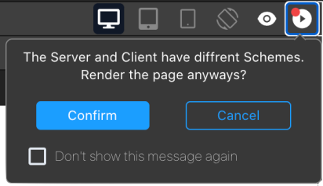

:::caution デベロッパー・プレビュー

4D の Qodly Studio は現在、**デベロッパー・プレビュー** の段階です。 本番環境で使用すべきではありません。

:::

**Qodly Studio** は、設計・テスト・公開がすべて Qodlyクラウドでおこなわれる Webビジネスアプリケーションの開発に特化した **Qodly プラットフォーム** の一部です。

4D v20 R2 では、 4D から直接 Qodly Studio を使用して、モダンで洗練された Webインターフェースをビルドし、既存の 4Dプロジェクトに簡単に統合して、**オンプレミス** で運用することができます。

Qodly Studio では、全く新しい WebUI を使い、データソースの概念に慣れ、次の操作を学ぶことができます:

- ページ上にコンポーネントを配置して Webフォームを作成する
- コンポーネントをデータにマッピングする
- イベントを設定して 4Dコードをトリガーする
- さらに沢山のことが可能です

:::info

4D で Qodly Studio を使用するには、専用のライセンスが必要です。 ライセンスが有効化されていない場合、Qodly Studio に関するオプションやメニュー項目は表示されません。

:::

## 設定

### 要件

#### ブラウザー

Qodly Studio は、以下の Webブラウザーをサポートしています:

- Chrome
- Edge
- FireFox

推奨解像度は 1920x1080 です。

#### 4Dアプリケーション

- 開発: 4D v20 R2 以上
- 運用: 4D Server v20 R2 以上
- Qodly Studio は 4Dプロジェクトでのみ動作します (バイナリデータベースはサポートされていません)。


### Qodly Studio へのアクセスを有効化する

デフォルトでは、Qodly Studio へのアクセスは許可されていません。

Qodly Studioは、[WebAdmin Webサーバー](../Admin/webAdmin.md) によって提供され、表示される 4Dプロジェクトのデータは [4D Webサーバー](webServer.md) によって処理されます。

Qodly Studio へのアクセスを有効化するには、2つのレベルで明示的に許可する必要があります:

* 4Dレベルで (4D または 4D Server)
* プロジェクトレベルで

2つのレベルのいずれか (または両方) が有効でない場合、Qodly Studio　へのアクセスは拒否されます (403ページが返されます)。

#### 4Dレベルで

最初のセキュリティレベルとして、[WebAdmin Webサーバーで Qodly Studio へのアクセスを許可](../Admin/webAdmin.md#qodly-studio-へのアクセスを有効化する) する必要があります。

この設定は、ホストマシンの 4Dアプリケーション (4D または 4D Server) が対象となります。 つまり、その 4Dアプリケーションで開くすべてのプロジェクトで、この設定が適用されます。

アプリケーション上で Qodly Studio へのアクセスを許可しない場合は、このオプションをオフにします。

このオプションにチェックを入れると、Qodly Studio にアクセスできるようになります。 さらに、各プロジェクトのレベルでも許可が必要です。

さらに、[WebAdmin Webサーバーの HTTP/HTTPS ポートを設定](../Admin/webAdmin.md#ローカルホストでhttp接続を受け入れる) することもできます。

:::note

これらの設定を変更した後、新しい設定を有効にするには、[WebAdmin Web サーバー](../Admin/webAdmin.md#開始と停止) を再起動する必要があります。

:::

#### プロジェクトレベルで

4Dレベルで Qodly Studio へのアクセスを有効にした後、アクセスできるプロジェクトをそれぞれ明示的に指定する必要があります。 **Enable access to Qodly Studio** オプションは、[プロジェクト設定の Web機能ページ](../settings/web.md#qodly-studio-へのアクセスを有効化する) で有効にする必要があります。

[ユーザー設定](../settings/overview.md) はいくつかのレベルで定義でき、優先順位が適用されることに留意してください。


### 認証を有効化する

WebAdmin Webサーバーでの認証には、アクセスキーを使用します。 詳しくは、[アクセスキー](../Admin/webAdmin.md#アクセスキー) を参照ください。

### レンダリングを有効化する

Qodly Studio で作成した Webフォームのレンダリングを有効にするには、以下のオプションを設定する必要があります。

* 4Dプロジェクトの **設定** > **Web** > **Web機能** > [**RESTサーバーとして公開**](../settings/web.md#restサーバーとして公開) オプションを有効にする必要があります。
* [4D Webサーバー](webServer.md) を起動しておく必要があります。

Qodly Studio で Webフォームをレンダリングする際、レンダラーは設定により、[WebAdmin Webサーバー](../Admin/webAdmin.md#ローカルホストでhttp接続を受け入れる) と同じ HTTP/HTTPS 接続パターンに従って、HTTP または HTTPS で 4D Webサーバーに接続します。

:::info

Qodly で Webフォームをレンダリングする方法については [このページ](https://developer.qodly.com/docs/studio/rendering) を参照ください。

:::

"新しいタブでプレビュー" ボタンをクリックすると、マシン上で `IP:port/$lib/renderer/?w=WebFormName` のタブが開くことに注意してください。

Qodly Studio は、4D WebAdmin Webサーバーを通して動作することに留意してください。 開発者として Qodly Studio を使用する場合、Webフォームをプレビューするには、4D WebAdmin Webサーバーを使用することになります。 これにより、たとえば RESTリソースとして公開されていないデータクラス、関数、属性を (グレーアウトされた状態で) 見ることができます。

しかし、実際の Webフォームのレンダリングは 4D Web Studio の外でおこなわれ、標準の 4D Webサーバーによって処理されます。 このような状況では、Webアプリケーションは RESTリソースとして公開されていないデータにアクセスできません。 [公開vs非公開関数](../ORDA/ordaClasses.md#公開vs非公開関数) および [テーブルの公開](../REST/configuration.md#テーブルの公開) を参照ください。

:::note

設定オプションが有効になっていない場合、[レンダラー ボタン](https://developer.qodly.com/docs/studio/rendering#how-to-render-a-webform) は非表示です。

:::

### WebAdminサーバーと運用

運用には、WebAdminサーバーは必要ありません。 Qodly Studio で作成された Webアプリケーションへのエンドユーザーアクセスは、4D RESTプロトコルに基づいているため、従来の 4Dリモートアプリケーションと同様に動作します。


### プロジェクトメソッドを使用する

推奨される方法は、プロジェクトメソッドではなく、クラス関数を使用することです。 コンポーネントから呼び出すことが可能なのは、クラス関数のみです。 それでも、次の 2つの方法で、Qodly Studio でもプロジェクトメソッドを使用できます:

- クラス関数からメソッドを呼び出すことができます。
- Qodly Explorer から直接 [メソッドを実行](https://developer.qodly.com/docs/studio/coding#methods-and-classes) できます。

## Qodly Studio を開く

Qodly Studio ページは、[WebAdmin Webサーバーが起動されており](../Admin/webAdmin.md#開始と停止)、認証が有効化されている場合に使用できます (上述参照)。

Qodly Studio にアクセスするには 2つの方法があります:

* 4Dシングルユーザーアプリケーションから、**デザイン** > **Qodly Studio...** を選択します。 WebAdmin Webサーバーがすでに起動されている場合は、その設定に応じて、デフォルトのブラウザーが `IPaddress:HTTPPort/studio` または `IPaddress:HTTPSPort/studio` を開きます。 それ以外の場合は、最初に WebAdmin Webサーバーを起動するかどうかを尋ねるメッセージが表示されます。

* 4D または 4D Server から WebAdmin Webサーバーが起動されている状態で、ブラウザーに次のアドレスを入力します:

`IPaddress:HTTPPort/studio`

または:

`IPaddress:HTTPSPort/studio`

たとえば、ポート7080 でローカルWebサーバーを起動した後、ブラウザーに次のアドレスを入力します:

`localhost:7080/studio`

すると、Qodly Studio にアクセスするための [アクセスキー](../Admin/webAdmin.md#アクセスキー) の入力を求められます。


## Qodly Studio を使う

The official Qodly Studio documentation is available on the [Qodly documentation website](https://developer.qodly.com/docs/studio/overview).

Webフォームを利用した Webアプリケーションを開発するには、このドキュメントとその関連リソースを参照ください。 ただし、実装の段階に応じて、4Dデベロッパーは Qodly Studio または 4D IDE を使用します。

:::info

4D で実装されたアプリと Qodly で実装されたアプリの間に直接の互換性はありません。

:::

### 機能の比較

|                                         | 4D IDE を使用する 4Dデベロッパー向けの Qodly Studio                                              | Qodlyデベロッパー向けの Qodly Studio |
| --------------------------------------- | ---------------------------------------------------------------------------------- | --------------------------- |
| テーブル (データクラス)、フィールド (属性)、リレーションの表示および編集 | 4Dストラクチャーエディター(1)                                                                  | Qodly Studio Model Editor   |
| Webフォーム                                 | Qodly Studio Webform Editor                                                        | Qodly Studio Webform Editor |
| デスクトップフォーム                              | 4D IDE                                                                             | *サポートされていません*               |
| プログラミング言語                               | 4Dランゲージ (ORDA を使用)                                                                 | QodlyScript (ORDA を使用)      |
| コーディング IDE                              | 4D IDE コードエディター / VS Code と [4D拡張機能](https://github.com/4d/4D-Analyzer-VSCode) (2) | Qodly Studio コードエディター       |
| デバッガー                                   | 4D IDE デバッガー                                                                       | Qodly Studio デバッガー          |
| REST/Web ロールとアクセス権                      | roles.json の直接編集 / Qodly Studio ロールとアクセス権エディター                                     | Qodly Studio ロールとアクセス権エディター |

(1) Qodly Studio で **Model** ボタンをクリックしても、何も起こりません。 (2) Qodly Studio で 4Dコードを開くと、シンタックスの配色がサポートされておらず、"Lsp not loaded" という警告が表示されます。


### プロジェクト管理

4Dプロジェクトの管理上、以下の使用法のみがサポートされます:

- Qodly Studio での開発は **4D** (シングルユーザー) でおこなう必要があります。
- Qodly Webフォームを利用した 4Dアプリケーションの運用は、**4D Server** でおこなう必要があります。


### 既知の問題

- 現在の実装では、Qodly Webフォームを使用する統合された 4Dアプリケーション (スタンドアロンおよびサーバー) をビルドするには、*.4dz* 圧縮されたアーキテクチャーを無効にする必要があります。そうでない場合、404エラーが返されます。 このような統合アプリケーションをビルドする場合は、buildApp.4DSettings ファイルで [` PackProject` XMLキー](https://doc.4d.com/4Dv20R2/4D/20-R2/PackProject.300-6439954.ja.html) を `false` に設定してください。


### QodlyScript から 4Dランゲージへ

[Qodly Studio ドキュメント](developer.qodly.com/docs/studio) を使用して、4Dデベロッパーは、Qodly Studio で Webフォームを設計する方法を学ぶことができます。 コードの例は QodlyScript で提供されていますが、QodlyScript は 4Dランゲージから継承しているため、困ることはありません。 QodlyScript コードを 4Dランゲージに変換するのは簡単で、いくつかの調整が必要なだけです:

#### 変数名

QodlyScript はローカル変数のみをサポートするため、QodlyScript の例題では、変数に `$` という接頭辞が付きません。 4Dコードでは、4D によってローカル変数として識別されるように、**変数名の前には必ず `$` を付けてください**。

#### 記号とキーワード

一部の基本的な記号、演算子、キーワードは QodlyScript では異なるため、4Dランゲージ用に変換する必要があります。 以下に一覧を示します:

| QodlyScript | 4Dランゲージ                                                     | 説明       |
| ----------- | ----------------------------------------------------------- | -------- |
| ,           | ;                                                           | 引数の区切り文字 |
| =           | :=                                                          | 代入演算子    |
| ==          | =                                                           | 比較演算子    |
| declare     | #Declare                                                    |          |
| switch      | Case of                                                     |          |
| constructor | Class constructor                                           |          |
| extends     | Class extends                                               |          |
| end         | End for, End For each, End if, End case, End use, End while |          |
| forEach     | For each                                                    |          |
| string      | Text                                                        | 変数の型     |
| number      | Real                                                        | 変数の型     |

他の一部の項目では文字の大小が異なりますが (例: `this` と `This`)、4Dコードに直接貼り付けることができます。


#### コマンド名

QodlyScript のコマンド名は、スペースを入れずにキャメルケースで記述されます。 これらのコマンドを 4Dランゲージに変換する必要がある場合があります。

- 通常は、単に名前を変換するだけで十分です。 たとえば、QodlyScript の `newCollection` は 4Dランゲージの `New collection` です。
- ただし、コンプライアンス向上のため、一部のコマンドでは名前が変更されました。 以下に一覧を示します:

| QodlyScript            | 4Dランゲージ          |
| ---------------------- | ---------------- |
| `atan`                 | `Arctan`         |
| `highestProcessNumber` | `Count tasks`    |
| `callChain`            | `Get call chain` |
| `objectClass`          | `OB Class`       |
| `objectCopy`           | `OB Copy`        |
| `objectEntries`        | `OB Entries`     |
| `instanceOf`           | `OB Instance of` |
| `objectIsDefined`      | `OB Is defined`  |
| `objectIsEmpty`        | `OB Is empty`    |
| `objectIsShared`       | `OB Is shared`   |
| `objectKeys`           | `OB Keys`        |
| `objectRemove`         | `OB REMOVE`      |
| `objectValues`         | `OB Values`      |
| `sqrt`                 | `Square root`    |


#### 例題

- QodlyScript コード:

```qs
 declare(entitySelection : 4D.EntitySelection)  
 var dataClass : 4D.DataClass
 var entity, duplicate : 4D.Entity
 var status : object
 dataClass=entitySelection.getDataClass()
 forEach(entity,entitySelection)
    duplicate=dataClass.new()
    duplicate.fromObject(entity.toObject())
    duplicate[dataClass.getInfo().primaryKey]=null
    status=duplicate.save()
 end
```


- 上に相当する 4Dランゲージのコード:

```4d
 #DECLARE ( $entitySelection : 4D.EntitySelection )  
 var $dataClass : 4D.DataClass
 var $entity; $duplicate : 4D.Entity
 var $status : Object
 $dataClass:=$entitySelection.getDataClass()
 For each($entity;$entitySelection)
    $duplicate:=$dataClass.new()
    $duplicate.fromObject($entity.toObject())
    $duplicate[$dataClass.getInfo().primaryKey]:=Null
    $status:=$duplicate.save()
 End for each

```

## About license usage

To render webforms, you must have an available license, as rendering a webform opens a session on the project database's main web server.

### URL Schemes

Qodly Studio's URL scheme configuration (HTTP and HTTPS) determines how many licenses are retained when rendering webforms. With the appropriate configuration, you can avoid unnecessary license retaining.

As explained in the [configuration](#configuration) section, the WebAdmin web server provides a secured web access to Qodly Studio. On the other hand, the [renderer](#rendering-webforms) communicates with the 4D web server of the database using REST requests. As such, it behaves like a conventional 4D Client.

If you run the renderer from the Qodly Studio and these two web servers are not reached through the same URL scheme (HTTP or HTTPS), it might lead to wrong licence counting.

#### 例題

1. You run the Qodly Studio on an HTTPS URL scheme (e.g. `https://127.0.0.1:7443/studio/`)

2. The web server of your database is started only on an HTTP port.


3. In Qodly Studio, you click on the **rendering** icon. You are warned that the two web servers are started on different schemes, but despite this you click on the **Confirm** button.



As a result, two licenses are retained.

:::note

You can enable/disable the display of the renderer pop over using a Qodly Studio user setting.

:::

### SameSite attribute

The behavior previously described is due to the session cookie of the 4D web server. This session cookie has a `SameSite` attribute that determines if the session cookie is sent to the web server.

If the `SameSite` attribute's value is `Strict` (default), the session cookie is not sent to the web server, so a new session is opened each time a page is rendered or refreshed.

For more information on the `SameSite` attribute, check out [this blog post](https://blog.4d.com/get-ready-for-the-new-<code>SameSite</code>-and-secure-attributes-for-cookies/).

### Recommendations

To avoid using more licenses than necessary, we recommend doing one of the following:

- Run the renderer on another browser tab (by entering the rendered URL of your Web form: `IP:port/$lib/renderer/?w=WebFormName`).
- Ensure the Qodly Studio and your database are reached on the same URL scheme.
- Use the `Lax` value for the [session cookie](webServerConfig.md#session-cookie-samesite) of your project database's web server.


## Hello, World

This 5-minute video provides a "Hello World" example and covers how to enable access to the studio, create a basic interface, and configure an event that greets the user by their name:

<iframe width="560" height="315" src="https://www.youtube.com/embed/GwIdic4OhPQ" title="YouTube video player" frameborder="0" allow="accelerometer; clipboard-write; encrypted-media; gyroscope; picture-in-picture" allowfullscreen="true"></iframe>
