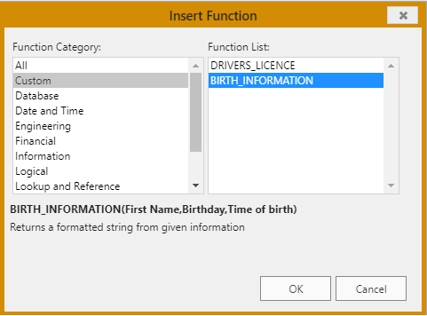
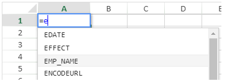

## フォーミュラの使い方

スプレッドシートのフォーミュラとは、セルの値を計算する式のことです。

### フォーミュラの入力

4D View Pro エリアにフォーミュラを入力するには:

1. フォーミュラを入力するセルを選択します。
2. \= (等号) を入力します。
3. Type the formula and hit the **Enter** key.

フォーミュラ入力の際には、次のショートカットを使うことができます:

- フォーミュラにセル参照を入力する代わりに、参照するセルをクリックします:


- 入力したい関数の頭文字を入力します。 すると、利用可能な関数と参照の一覧がポップアップメニューに表示され、必要な要素を選択することができます:


また、命名フォーミュラを作成すると、その名前で呼び出すことが可能です。 To do so, enter these formulas using the [VP ADD FORMULA NAME](method-list.md#vp-add-formula-name) command.

### 演算子とオペランド

すべてのフォーミュラはオペランドと演算子から成り立っています:

- **Operators**: see [Values and operators](#values-and-operators) below.
- **Operands** include several categories:
  - [values](#values-and-operators) (5 data types are supported)
  - [references to other cells](#cell-references) (relative, absolute, mixed or by name)
  - [standard spreadsheet functions](#using-functions)
  - [4D functions](#4d-functions) based upon 4D formulas and providing access to 4D variables, fields, methods, commands, or expressions.

## 値と演算子

4D View Pro は 5つのデータ型をサポートします。 それぞれのデータ型について、特定の定数と演算子がサポートされています。

| データ型                              | 値                                   | 演算子                                                                                                                                                                                                                                                 |
| --------------------------------- | ----------------------------------- | --------------------------------------------------------------------------------------------------------------------------------------------------------------------------------------------------------------------------------------------------- |
| [Number](Concepts/dt_number.md)   | 1.2<br/>1.2 E3<br/>1.2E-3<br/>10.3x | - (加法)<br/>- (減法)<br/>\* (乗法)<br/>/ (除法)<br/>^ (べき乗、数値を自身に対してかける回数)<br/>% (パーセント -- 演算子の前の数値を100で割る)                              |
| [Date](Concepts/dt_date.md)       | 10/24/2017                          | * (date + number of days -> date)<br/>+ (date + time -> date + time of day)<br/>- (date - number of days -> date)<br/>- (date - date -> number of days between the two) |
| [Time](Concepts/dt_time.md)       | 10:12:10                            | Duration operators:<br/>+ (addition)<br/>- (subtraction)<br/>\* (duration \* number -> duration)<br/>/ (duration / number -> duration)                                  |
| [String](Concepts/dt_string.md)   | 'Sophie' または "Sophie"               | & (concatenation)                                                                                                                                                                                                                |
| [Boolean](Concepts/dt_boolean.md) | TRUE または FALSE                      | -                                                                                                                                                                                                                                                   |

### 比較演算子

同じ型の 2つのオペランドに対して以下の演算子を使用することができます:

| 演算子  | 比較  |
| ---- | --- |
| =    | 等しい |
| `<>` | 異なる |
| >    | 大きい |
| <    | 小さい |
| > =  | 以上  |
| <=   | 以下  |

### 演算子の優先順位

以下は演算子を優先度順に並べたものです (優先度が高い方が上):

| 演算子                         | 説明                             |
| --------------------------- | ------------------------------ |
| ()       | カッコ (グループ化) |
| -                           | 否定                             |
| *                           | 追加                             |
| %                           | パーセント                          |
| ^                           | べき乗                            |
| - および /                     | 乗法と除法                          |
| * と -                       | 加法と減法                          |
| &                           | 連結                             |
| `=`  `>` `<` `>=` `<=` `<>` | 比較                             |

## セル参照

フォーミュラ (式) は多くの場合、セルアドレスを使って他のセルを参照します。 このような式を他のセルにコピーすることも可能です。 たとえば、C8 に入力された以下の式では、すぐ上にある 2つのセルの値を足して結果を表示します。

```
= C6 + C7
```

この式はセル C6 と C7 を参照します。 つまり、式内で使用する値については他のセルを参照するよう、4D View Pro に指示しています。

こういった式を別のセルにコピーあるいは移動させた場合、式内のセルアドレスは参照の仕方によって連動して変化したり変化しなかったりします。

- A reference that changes is called a **relative reference**, and refers to a cell by how far left/right and up/down it is from the cell with the formula.
- A reference that always points to a particular cell is called an **absolute reference**.
- また、複合参照といって、特定の行あるいはカラムに参照を固定することもできます。

### 参照の記法

If you use only cell coordinates, for example, `C5`, 4D View Pro interprets the reference as relative. You may make the reference an absolute reference by putting a dollar sign in front of the letter and the number, as in `$C$5`.

You can mix absolute and relative references by inserting a dollar sign in front of the letter or the number alone, for example, `$C5` or `C$5`. 複合参照を使用すると、行かカラムを絶対参照として指定しながら、もう片方については相対的に参照させることが可能になります。

素早くかつ正確に絶対参照を指定するには、セルを命名し、その名前をセルアドレス代わりに使用する方法があります。 命名セルへの参照は常に絶対参照です。 You can create or modify named cells or named cell ranges using the [`VP ADD RANGE NAME`](method-list.md#vp-add-range-name) method.

以下の表は異なる記法による効果をまとめたものです:

| 例題   | 参照タイプ | 説明                                                                                                                                 |
| ---- | ----- | ---------------------------------------------------------------------------------------------------------------------------------- |
| C5   | 相対    | 参照は相対的にセル C5 を指しており、参照が最初に使用されたセルが位置の基準となります。                                                                                      |
| $C$5 | 絶対    | 参照は絶対参照です。 どこで使用されるかにかかわらず、常にセル C5 を参照します。                                                                                         |
| $C5  | Mixed | 常にカラム C を参照しますが、行の参照は相対的で、参照が最初に使用されたセルを基準に決まります。                                                                                  |
| C$5  | Mixed | 常に 5行目を参照しますが、カラムの参照は相対的で、参照が最初に使用されたセルを基準に決まります。                                                                                  |
| セル名  | 絶対    | 参照は絶対参照です。 Will always refer to the [named cell or range](method-list.md#vp-add-range-name) no matter where the reference is used. |

## ビルトインファンクション

スプレッドシートのファンクションとは、セルの値を計算する規定のフォーミュラのことで、関数とも呼ばれます。 入力したい関数の頭文字を入力すると、利用可能な関数と参照の一覧がポップアップメニューに表示され、必要な要素を選択することができます:


See [**SpreadJS's extented list of functions**](https://developer.mescius.com/spreadjs/docs/formulareference/FormulaFunctions) for details and examples.

## 4Dファンクション

4D View Pro allows you to define and call **4D custom functions**, which execute [4D formulas](API/FunctionClass.md). 4Dカスタムファンクションを使用すると、4D View Pro ドキュメントの可能性が広がり、4Dデータベースとの強力な連携が可能になります。

4Dカスタムファンクションを使用すると、4D View Pro のフォーミュラ内で以下が利用可能になります:

- 4Dプロセス変数
- フィールド
- プロジェクトメソッド
- 4Dランゲージコマンド
- または、有効な 4D式

4D custom functions can receive [parameters](#parameters) from the 4D View Pro area, and return values.

You declare all your functions using the [`VP SET CUSTOM FUNCTIONS`](method-list.md#vp-set-custom-functions) method. 例:

```4d
o:=New object

// 4D View Pro におけるファンクション名: "DRIVERS_LICENCE"
$o.DRIVERS_LICENCE:=New object

// プロセス変数
$o.DRIVERS_LICENCE.formula:=Formula(DriverLicence)

// テブルフィールド
$o.DRIVERS_LICENCE.formula:=Formula([Users]DriverLicence)

// プロジェクトメソッド
$o.DRIVERS_LICENCE.formula:=Formula(DriverLicenceState)

// 4Dコマンド
$o.DRIVERS_LICENCE:=Formula(Choose(DriverLicence; "Obtained"; "Failed"))

//4D式と引数
$o.DRIVERS_LICENCE.formula:=Formula(ds.Users.get($1).DriverLicence)
$o.DRIVERS_LICENCE.parameters:=New collection
$o.DRIVERS_LICENCE.parameters.push(New object("name"; "ID"; "type"; Is longint))
```

> **See also** [4D View Pro: Use 4D formulas in your spreadsheet (blog post)](https://blog.4d.com/4d-view-pro-use-4d-formulas-in-your-spreadsheet/)

### Hello World 例題

4Dプロジェクトメソッドを使って、4D View Pro エリアのセルに "Hello World" と表示させます。

1. "myMethod" プロジェクトメソッドを作成し、次のコードを書きます:

```4d
 #DECLARE->$hw Text
 $hw:="Hello World"

```

2. 4D View Pro エリアが設置されたフォームを開く前に、以下のコードを実行します:

```4d
  Case of
    :(Form event code=On Load)
       var $o : Object
       $o:=New object
  // Define "vpHello" function from the "myMethod" method
       $o.vpHello:=New object
       $o.vpHello.formula:=Formula(myMethod)
       VP SET CUSTOM FUNCTIONS("ViewProArea";$o)
 End case
```

3. 4D View Pro エリアのセルに次を入力します:

   

   すると、4D によって "myMethod "が呼び出され、セルの表示は次のようになります:

   

### 引数

プロジェクトのメソッドを呼び出す 4Dファンクションには、以下のシンタックスで引数を渡すことができます:

```
=METHODNAME(param1,param2,...,paramN)
```

These parameters are received in _methodName_ in $1, $2...$N.

引数を渡さない場合でも ( ) の使用は必須です:

```
=METHODWITHOUTNAME()
```

You can declare the name, type, and number of parameters through the _parameters_ collection of the function you declared using the [VP SET CUSTOM FUNCTIONS](method-list.md#vp-set-custom-functions) method. Optionally, you can control the number of parameters passed by the user through _minParams_ and _maxParams_ properties.

For more information on supported incoming parameter types, please refer to the [VP SET CUSTOM FUNCTIONS](method-list.md#vp-set-custom-functions) method description.

:::note

If you do not declare parameters, values can be sequentially passed to methods (they will be received in $1, $2...) and their type will be automatically converted. Dates in _jstype_ will be passed as [object](Concepts/dt_object.md) in 4D code with two properties:

| プロパティ | タイプ  | 説明                          |
| ----- | ---- | --------------------------- |
| value | 日付   | 日付値                         |
| time  | Real | 数値 (秒単位) |

:::

4Dプロジェクトメソッドは、$0 を介して 4D View Pro のセルフォーミュラに値を返すこともできます。 以下のデータ型の戻り値がサポートされています:

- [text](Concepts/dt_string.md) (converted to string in 4D View Pro)

- [real](Concepts/dt_number.md)/[longint](Concepts/dt_number.md) (converted to number in 4D View Pro)

- [date](Concepts/dt_date.md) (converted to JS Date type in 4D View Pro - hour, minute, sec = 0)

- [time](Concepts/dt_time.md) (converted to JS Date type in 4D View Pro - date in base date, i.e. 12/30/1899)

- [boolean](Concepts/dt_boolean.md) (converted to bool in 4D View Pro)

- [picture](Concepts/dt_picture.md) (jpg,png,gif,bmp,svg other types converted into png) creates a URI (data:image/png;base64,xxxx) and then used as the background in 4D View Pro in the cell where the formula is executed

- [object](Concepts/dt_object.md) with the following two properties (allowing passing a date and time):

  | プロパティ | タイプ  | 説明                          |
  | ----- | ---- | --------------------------- |
  | value | 日付   | 日付値                         |
  | time  | Real | 数値 (秒単位) |

4Dメソッドが何も返さない場合は、自動的に空の文字列が返されます。

以下の場合は、4D View Pro セルにエラーが返されます:

- 4Dメソッドが上記以外のデータ型を返した場合。
- 4Dメソッドの実行中にエラーが発生した場合 (ユーザーが "中止" ボタンをクリックした場合)。

#### 例題

```4d
var $o : Object

$o.BIRTH_INFORMATION:=New object
$o.BIRTH_INFORMATION.formula:=Formula(BirthInformation)
$o.BIRTH_INFORMATION.parameters:=New collection
$o.BIRTH_INFORMATION.parameters.push(New object("name";"First name";"type";Is text))
$o.BIRTH_INFORMATION.parameters.push(New object("name";"Birthday";"type";Is date))
$o.BIRTH_INFORMATION.parameters.push(New object("name";"Time of birth";"type";Is time))
$o.BIRTH_INFORMATION.summary:="渡された情報に基づきフォーマットされた文字列を返します"

VP SET CUSTOM FUNCTIONS("ViewProArea"; $o)
```



## 互換性

4D View Pro エリアでフィールドやメソッドをファンクションとして宣言する場合、代わりの方法も利用可能です。 これらの方法は、互換性のために維持されており、特定のケースで使用することができます。 However, using the [`VP SET CUSTOM FUNCTIONS`](method-list.md#vp-set-custom-functions) method is recommended.

### 仮想ストラクチャーを使ったフィールド参照

4D View Pro allows you to reference 4D fields using the virtual structure of the database, i.e. declared through the [`SET TABLE TITLES`](https://doc.4d.com/4dv19/help/command/en/page601.html) and/or [`SET FIELD TITLES`](https://doc.4d.com/4dv19/help/command/en/page602.html) commands with the \* parameter. This alternate solution could be useful if your application already relies on a virtual structure (otherwise, [using `VP SET CUSTOM FUNCTIONS`](#4d-functions) is recommended).

> **WARNING:** You cannot use the virtual structure and `VP SET CUSTOM FUNCTIONS` simultaneously. As soon as `VP SET CUSTOM FUNCTIONS` is called, the functions based upon `SET TABLE TITLES` and `SET FIELD TITLES` commands are ignored in the 4D View Pro area.

#### 要件

- The field must belong to the virtual structure of the database, i.e. it must be declared through the [`SET TABLE TITLES`](https://doc.4d.com/4dv19/help/command/en/page601.html) and/or [`SET FIELD TITLES`](https://doc.4d.com/4dv19/help/command/en/page602.html) commands with the \* parameter (see example),
- Table and field names must be ECMA compliant (see [ECMA Script standard](https://www.ecma-international.org/ecma-262/5.1/#sec-7.6)),
- フィールドの型が 4D View Pro でサポートされていること (前述参照)。

準拠していないフィールドがフォーミュラに呼び出されると、4D View Pro セルにエラーが返されます。

#### フォーミュラでの仮想フィールドの使用

フォーミュラ内に仮想フィールドへの参照を挿入するには、次のシンタックスを使います:

```
TABLENAME_FIELDNAME()
```

たとえば、"People" テーブルの "Name" フィールドを仮想ストラクチャーで宣言した場合、以下のようなファンクションを呼び出すことができます:

```
=PEOPLE_NAME()
=LEN(PEOPLE_NAME())
```

> フィールドが [4Dメソッド] と同名の場合は、フィールド名が優先されます。

#### 例題

4D の仮想フィールドを使用して、4D View Pro エリアのセル内に人の名前を表示します:

1. "Employee" テーブルと "L_Name" フィールドを作成します:


2. 次のコードを実行して、仮想ストラクチャーを初期化します:

   ```4d
   ARRAY TEXT($tableTitles;1)
   ARRAY LONGINT($tableNum;1)
   $tableTitles{1}:="Emp"
   $tableNum{1}:=2
   SET TABLE TITLES($tableTitles;$tableNum;*)
    
   ARRAY TEXT($fieldTitles;1)
   ARRAY LONGINT($fieldNum;1)
   $fieldTitles{1}:="Name"
   $fieldNum{1}:=2 //last name
   SET FIELD TITLES([Employee];$fieldTitles;$fieldNum;*)
   ```

3. 4D View Pro エリアのセルに "=e" と入力します":



4. (Tabキーを使用して) EMP_NAME を選択し、閉じる ")" を入力します。


5. セルを確定すると、カレントの従業員の名前が表示されます:


> [Employee] テーブルはカレントレコードを持っている必要があります。

### 許可されたメソッドの宣言

4D View Pro のフォーミュラ内にて 4Dプロジェクトメソッドを直接呼び出すことができます。 For security reasons, you must declare explicitly methods that can be called by the user with the [VP SET ALLOWED METHODS](method-list.md#vp-set-allowed-methods) method.

#### 要件

4D View Pro フォーミュラ内で呼び出すには、プロジェクトメソッドは以下の条件を満たしている必要があります:

- **Allowed**: it was explicitly declared using the [VP SET ALLOWED METHODS](method-list.md#vp-set-allowed-methods) method.
- **Runnable**: it belongs to the host project or a loaded component with the "Shared by components and host project" option enabled (see [Sharing of project methods](../Concepts/components.md#sharing-of-project-methods)).
- **Not in conflict** with an existing 4D View Pro spreadsheet function: if you call a project method with the same name as a 4D View Pro built-in function, the function is called.

> If neither the [VP SET CUSTOM FUNCTIONS](method-list.md#vp-set-custom-functions) nor the [VP SET ALLOWED METHODS](method-list.md#vp-set-allowed-methods) method has been executed during the session, 4D View Pro custom functions rely on allowed methods defined by 4D's generic `SET ALLOWED METHODS` command. In this case, the project method names must comply with JavaScript Identifier Grammar (see [ECMA Script standard](https://www.ecma-international.org/ecma-262/5.1/#sec-7.6)). The global filtering option in the Settings dialog box (see _Data Access_) is ignored in all cases.
