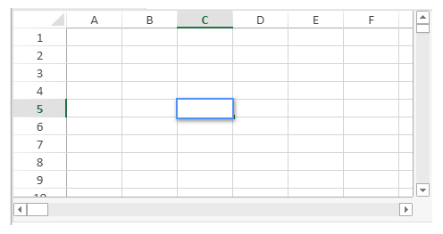
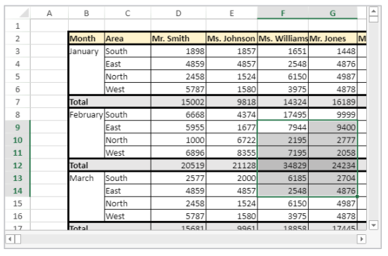
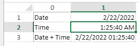
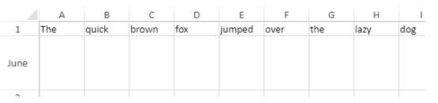

> **Warning**: The commands on this page are not thread-safe.

[A](#a) -
[C](#c) -
[D](#d) -
[E](#e) -
[F](#f) -
[G](#g) -
[I](#i) -
[M](#m) -
[N](#n) -
[O](#o) -
[P](#p) -
[R](#r) -
[S](#s)

## A

### VP ADD FORMULA NAME

<!-- REF #_method_.VP ADD FORMULA NAME.Syntax -->

**VP ADD FORMULA NAME** ( _vpAreaName_ : Text ; _vpFormula_ : Text ; _name_ : Text { ; _options_ : Object } )<!-- END REF -->

<!-- REF #_method_.VP ADD FORMULA NAME.Params -->

| 引数         | タイプ    |    | 説明                            |                  |
| ---------- | ------ | -- | ----------------------------- | ---------------- |
| vpAreaName | Text   | -> | 4D View Pro フォームオブジェクト名       |                  |
| vpFormula  | Text   | -> | 4D View Pro フォーミュラ            |                  |
| name       | Text   | -> | フォーミュラの名称                     |                  |
| options    | Object | -> | Options for the named formula | <!-- END REF --> |

#### 説明

The `VP ADD FORMULA NAME` command <!-- REF #_method_.VP ADD FORMULA NAME.Summary -->creates or modifies a named formula in the open document<!-- END REF -->.

> このコマンドで作成された命名フォーミュラはドキュメントとともに保存されます。

In _vpAreaName_, pass the name of the 4D View Pro area. 存在しない名前を渡した場合、エラーが返されます。

Pass the 4D View Pro formula that you want to name in _vpFormula_. For detailed information about formula syntax, see [Formulas and Functions](formulas.md) page.

Pass the new name for the formula in _name_. 同じスコープ内で名前が既に使用されている場合、新しい命名レンジは既存のものを上書きします。 ただし異なるスコープであれば同じ名前を使用することが可能です (以下参照)。

You can pass an object with additional properties for the named formula in _options_. 以下のプロパティがサポートされています:

| プロパティ   | タイプ    | 説明                                                                                                                                                                                                                                                                                                                                                                                              |
| ------- | ------ | ----------------------------------------------------------------------------------------------------------------------------------------------------------------------------------------------------------------------------------------------------------------------------------------------------------------------------------------------------------------------------------------------- |
| scope   | Number | フォーミュラのスコープ。 You can pass the sheet index (counting begins at 0) or use the following constants: <li>`vk current sheet`</li><li>`vk workbook`</li>The scope determines whether a formula name is local to a given worksheet (_scope_=sheet index or `vk current sheet`), or global across the entire workbook (_scope_=`vk workbook`). |
| comment | Text   | 命名フォーミュラに割り当てられたコメント                                                                                                                                                                                                                                                                                                                                                                            |

#### 例題

```4d
VP ADD FORMULA NAME("ViewProArea";"SUM($A$1:$A$10)";"Total2")
```

#### 参照

[Cell references](formulas.md#cell-references)<br/>[VP Get formula by name](#vp-get-formula-by-name)<br/>[VP Get names](#vp-get-names)

### VP ADD RANGE NAME

<!-- REF #_method_.VP ADD RANGE NAME.Syntax -->

**VP ADD RANGE NAME** ( _rangeObj_ : Object ; _name_ : Text { ; _options_ : Object } )<!-- END REF -->

<!-- REF #_method_.VP ADD RANGE NAME.Params -->

| 引数       | タイプ    |    | 説明                            |                  |
| -------- | ------ | -- | ----------------------------- | ---------------- |
| rangeObj | Object | -> | レンジオブジェクト                     |                  |
| name     | Text   | -> | フォーミュラの名称                     |                  |
| options  | Object | -> | Options for the named formula | <!-- END REF --> |

#### 説明

The `VP ADD RANGE NAME` command <!-- REF #_method_.VP ADD RANGE NAME.Summary -->creates or modifies a named range in the open document<!-- END REF -->.

> このコマンドで作成された命名レンジはドキュメントとともに保存されます。

In _rangeObj_, pass the range that you want to name and in _name_, pass the new name for the range. 同じスコープ内で名前が既に使用されている場合、新しい命名フォーミュラは既存のものを上書きします。 ただし異なるスコープであれば同じ名前を使用することが可能です (以下参照)。

You can pass an object with additional properties for the named range in _options_. 以下のプロパティがサポートされています:

| プロパティ   | タイプ    | 説明                                                                                                                                                                                                                                                                                                                                                                                         |
| ------- | ------ | ------------------------------------------------------------------------------------------------------------------------------------------------------------------------------------------------------------------------------------------------------------------------------------------------------------------------------------------------------------------------------------------ |
| scope   | Number | レンジのスコープ。 You can pass the sheet index (counting begins at 0) or use the following constants: <li>`vk current sheet`</li><li>`vk workbook`</li>The scope determines whether a range name is local to a given worksheet (_scope_=sheet index or `vk current sheet`), or global across the entire workbook (_scope_=`vk workbook`). |
| comment | Text   | 命名レンジに割り当てられたコメント                                                                                                                                                                                                                                                                                                                                                                          |

> - 命名レンジの実態は、座標を格納した命名フォーミュラです。 `VP ADD RANGE NAME` facilitates the creation of named ranges, but you can also use the [`VP ADD FORMULA NAME`](#vp-add-formula-name) method to create named ranges.
> - Formulas defining named ranges can be retrieved with the [`VP Get formula by name`](#vp-get-formula-by-name) method.

#### 例題

あるセルレンジに対して命名レンジを作成します:

```4d
$range:=VP Cell("ViewProArea";2;10)
VP ADD RANGE NAME($range;"Total1")
```

#### 参照

[VP Get names](#vp-get-names)<br/>[VP Name](#vp-name)

### VP ADD SELECTION

<!-- REF #_method_.VP ADD SELECTION.Syntax -->

**VP ADD SELECTION** ( _rangeObj_ : Object )<!-- END REF -->

<!-- REF #_method_.VP ADD SELECTION.Params -->

| 引数       | タイプ  |    | 説明        |                  |
| -------- | ---- | -- | --------- | ---------------- |
| rangeObj | Text | -> | レンジオブジェクト | <!-- END REF --> |

#### 説明

The `VP ADD SELECTION` command <!-- REF #_method_.VP ADD SELECTION.Summary -->adds the specified cells to the currently selected cells<!-- END REF -->.

In _rangeObj_, pass a range object of cells to add to the current selection.

> アクティブセルは変更されません。

#### 例題

以下のようにセルが選択されている場合:


以下のコードを実行すると、指定したセルを選択範囲に追加します:

```4d
$currentSelection:=VP Cells("myVPArea";3;4;2;3)
VP ADD SELECTION($currentSelection)
```

結果:


#### 参照

[VP Get active cell](#vp-get-active-cell)<br/>[VP Get selection](#vp-get-selection)<br/>[VP RESET SELECTION](#vp-reset-selection)<br/>[VP SET ACTIVE CELL](#vp-set-active-cell)<br/>[VP SET SELECTION](#vp-set-selection)<br/>[VP SHOW CELL](#vp-show-cell)

### VP ADD SHEET

<!-- REF #_method_.VP ADD SHEET.Syntax -->

**VP ADD SHEET** ( _vpAreaName_ : Text )<br/>**VP ADD SHEET** ( _vpAreaName_ : Text ; _index_ : Integer )<br/>**VP ADD SHEET** ( _vpAreaName_ : Text ; _sheet_ : Integer ; _name_ : Text )<!-- END REF -->

<!-- REF #_method_.VP ADD SHEET.Params -->

| 引数         | タイプ     |    | 説明                      |                  |
| ---------- | ------- | -- | ----------------------- | ---------------- |
| vpAreaName | Text    | -> | 4D View Pro フォームオブジェクト名 |                  |
| sheet      | Integer | -> | 新しいシートのインデックス           |                  |
| name       | Text    | -> | シート名                    | <!-- END REF --> |

#### 説明

The `VP ADD SHEET` command <!-- REF #_method_.VP ADD SHEET.Summary -->inserts a sheet in the document loaded in _vpAreaName_.<!-- END REF -->

In _vpAreaName_, pass the name of the 4D View Pro area.

In _sheet_, you can pass an index for the new sheet. If the passed _index_ is inferior to or equal to 0, the command inserts the new sheet at the beginning. If _index_ exceeds the number of sheets, the command inserts the new sheet after the existing ones.

> インデックスは 0 起点です。

In _name_, you can pass a name for the new sheet. The new name cannot contain the following characters: `*, :, [, ], ?,\,/`

#### 例題

ドキュメントには現在 3つのシートがあります:


新しいシートを 3つ目の位置 (インデックスは 2) に挿入し、名前を "March" にします:

```4d
VP ADD SHEET("ViewProArea";2;"March")
```


#### 参照

[VP REMOVE SHEET](#vp-remove-sheet)

### VP ADD SPAN

<!-- REF #_method_.VP ADD SPAN.Syntax -->

**VP ADD SPAN** ( _rangeObj_ : Object )<!-- END REF -->

<!-- REF #_method_.VP ADD SPAN.Params -->

| 引数       | タイプ    |    | 説明        |                  |
| -------- | ------ | -- | --------- | ---------------- |
| rangeObj | Object | -> | レンジオブジェクト | <!-- END REF --> |

#### 説明

The `VP ADD SPAN` command combines the cells in _rangeObj_ as a single span of cells.

In _rangeObj_, pass a range object of cells. レンジ内のセルは結合され、複数のカラム/行にまたがる大きなセルが作成されます。 複数のセルレンジを渡すことで、一度に複数の結合セルを作成することもできます。 ただし、セルレンジが重なった場合、最初のセルレンジのみが使用されます。

> - 結合セルでは、左上端セルのデータのみが表示されます。 他のセルのデータは結合が解除されるまで非表示になります。
> - 結合セル内の非表示データは、フォーミュラを使用することでアクセス可能です (フォーミュラは左上端セルから始まります)。

#### 例題

"First quarter" セルと "Second quarter" セルを、それぞれ右 2つのセルと結合し、"South area" セルは下 2つのセルと結合します:


```4d
 // First quarter range
 $q1:=VP Cells("ViewProArea";2;3;3;1)
 
  // Second quarter range
 $q2:=VP Cells("ViewProArea";5;3;3;1)
 
  // South area range
 $south:=VP Cells("ViewProArea";0;5;1;3)
 
 VP ADD SPAN(VP Combine ranges($q1;$q2;$south))
```


#### 参照

[4D View Pro Range Object Properties](getting-started.md#using-range-objects)<br/>[VP Get spans](#vp-get-spans)<br/>[VP REMOVE SPAN](#vp-remove-span)

### VP ADD STYLESHEET

<!-- REF #_method_.VP ADD STYLESHEET.Syntax -->

**VP ADD STYLESHEET** ( _vpAreaName_ : Text ; _styleName_ : Text ; _styleObj_ : Object { ; _sheet_ : Integer } )<!-- END REF -->

<!-- REF #_method_.VP ADD STYLESHEET.Params -->

| 引数         | タイプ     |    | 説明                                             |                  |
| ---------- | ------- | -- | ---------------------------------------------- | ---------------- |
| vpAreaName | Text    | -> | 4D View Pro フォームオブジェクト名                        |                  |
| styleName  | Text    | -> | スタイルの名前                                        |                  |
| styleObj   | Object  | -> | 属性設定を定義するオブジェクト                                |                  |
| sheet      | Integer | -> | シートのインデックス (省略した場合はカレントシート) | <!-- END REF --> |

#### 説明

The `VP ADD STYLESHEET` command <!-- REF #_method_.VP ADD STYLESHEET.Summary -->creates or modifies the _styleName_ style sheet based upon the combination of the properties specified in _styleObj_ in the open document<!-- END REF -->. 同じ名前とインデックスを持つスタイルシートがドキュメント内にすでに存在する場合、このコマンドはそれを新しい値で上書きします。

> このコマンドで作成されたスタイルシートはドキュメントとともに保存されます。

In _vpAreaName_, pass the name of the 4D View Pro area. 存在しない名前を渡した場合、エラーが返されます。

The _styleName_ parameter lets you assign a name to the style sheet. 同じスコープ内で名前が既に使用されている場合、新しいスタイルシートは既存のものを上書きします。 ただし異なるスコープであれば同じ名前を使用することが可能です (以下参照)。

Within the _styleObj_, designate the settings for the style sheet (e.g., font, text decoration, alignment, borders, etc.). For the full list of style properties, see [Style object properties](configuring.md#style-object-properties).

You can designate where to define the style sheet in the optional _sheet_ parameter using the sheet index (indexing starts at 0) or with the following constants:

- `vk current sheet`
- `vk workbook`

If a _styleName_ style sheet is defined at the workbook level and at a sheet level, the sheet level has priority over the workbook level when the style sheet is set.

To apply the style sheet, use the [VP SET DEFAULT STYLE](#vp-set-default-style) or [VP SET CELL STYLE](#vp-set-cell-style) commands.

#### 例題

以下のコードは:

```4d
$styles:=New object
$styles.backColor:="green"
 
//Line Border Object
$borders:=New object("color";"green";"style";vk line style medium dash dot)
 
$styles.borderBottom:=$borders
$styles.borderLeft:=$borders
$styles.borderRight:=$borders
$styles.borderTop:=$borders
 
VP ADD STYLESHEET("ViewProArea";"GreenDashDotStyle";$styles)
 
//To apply the style
VP SET CELL STYLE(VP Cells("ViewProArea";1;1;2;2);New object("name";"GreenDashDotStyle"))
```

will create and apply the following style object named _GreenDashDotStyle_:

```
{
 backColor:green,
 borderBottom:{color:green,style:10},
 borderLeft:{color:green,style:10},
 borderRight:{color:green,style:10},
 borderTop:{color:green,style:10}
}
```

#### 参照

[4D View Pro Style Objects and Style Sheets](configuring.md#style-objects--style-sheets)<br/>[VP Get stylesheet](#vp-get-stylesheet)<br/>[VP Get stylesheets](#vp-get-stylesheets)<br/>[VP REMOVE STYLESHEET](#vp-remove-stylesheet)<br/>[VP SET CELL STYLE](#vp-set-cell-style)<br/>[VP SET DEFAULT STYLE](#vp-set-default-style)

### VP All

<!-- REF #_method_.VP All.Syntax -->

**VP All** ( _vpAreaName_ : Text { ; _sheet_ : Integer } )  : Object<!-- END REF -->

<!-- REF #_method_.VP All.Params -->

| 引数         | タイプ     |    | 説明                                             |                  |
| ---------- | ------- | -- | ---------------------------------------------- | ---------------- |
| vpAreaName | Text    | -> | 4D View Pro フォームオブジェクト名                        |                  |
| sheet      | Integer | -> | シートのインデックス (省略した場合はカレントシート) |                  |
| 戻り値        | Object  | <- | Range object of all cells                      | <!-- END REF --> |

#### 説明

The `VP ALL` command <!-- REF #_method_.VP All.Summary -->returns a new range object referencing all cells<!-- END REF -->.

In _vpAreaName_, pass the name of the 4D View Pro area. 存在しない名前を渡した場合、エラーが返されます。

In the optional _sheet_ parameter, you can designate a specific spreadsheet where the range will be defined (counting begins at 0). If omitted or if you pass `vk current sheet`, the current spreadsheet is used.

#### 例題

カレントスプレッドシートにおいて、全セルのレンジオブジェクトを定義します:

```4d
$all:=VP All("ViewProArea") // カレントシートの全セル
```

#### 参照

[VP Cell](#vp-cell)<br/>[VP Cells](#vp-cells)<br/>[VP Column](#vp-column)<br/>[VP Combine ranges](#vp-combine-ranges)<br/>[VP Name](#vp-name)<br/>[VP Row](#vp-row)

## C

### VP Cell

<!-- REF #_method_.VP Cell.Syntax -->

**VP Cell** ( _vpAreaName_ ; _column_ : Integer ; _row_ : Integer ; Text { ; _sheet_ : Integer } )  : Object<!-- END REF -->

<!-- REF #_method_.VP Cell.Params -->

| 引数         | タイプ     |    | 説明                                             |
| ---------- | ------- | -- | ---------------------------------------------- |
| vpAreaName | Text    | -> | 4D View Pro フォームオブジェクト名                        |
| column     | Longint | -> | カラムのインデックス                                     |
| row        | Longint | -> | 行のインデックス                                       |
| sheet      | Integer | -> | シートのインデックス (省略した場合はカレントシート) |
| 戻り値        | Object  | <- | 単一セルのレンジオブジェクト                                 |

<!-- END REF -->

#### 説明

The `VP Cell` command <!-- REF #_method_.VP Cell.Summary -->returns a new range object referencing a specific cell<!-- END REF -->.

> このコマンドは単一セルのレンジを想定しています。 To create a range object for multiple cells, use the [VP Cells](#vp-cells) command.

In _vpAreaName_, pass the name of the 4D View Pro area. 存在しない名前を渡した場合、エラーが返されます。

The _column_ parameter defines the column of the cell range's position. この引数としてカラムのインデックスを渡します。

The _row_ parameter defines the row of the cell range's position. この引数として行のインデックスを渡します。

In the optional _sheet_ parameter, you can indicate the index of the sheet where the range will be defined. If omitted or if you pass `vk current sheet`, the current spreadsheet is used by default.

> インデックスは 0 起点です。

#### 例題

以下に表示されている (カレントスプレッドシートの) セルに対するレンジオブジェクトを定義します:



以下のようにコードを書くことができます:

```4d
$cell:=VP Cell("ViewProArea";2;4) // C5
```

#### 参照

[VP All](#vp-all)<br/>[VP Cells](#vp-cells)<br/>[VP Column](#vp-column)<br/>[VP Combine ranges](#vp-combine-ranges)<br/>[VP Name](#vp-name)<br/>[VP Row](#vp-row)

### VP Cells

<!-- REF #_method_.VP Cells.Syntax -->

**VP Cells** ( _vpAreaName_ : Text ; _column_: Integer ; _row_: Integer ; _columnCount_ : Integer ; _rowCount_ : Integer { ; _sheet_ : Integer } ) : Object<!-- END REF -->

<details><summary>履歴</summary>

| バージョン  | 内容 |
| ------ | -- |
| v17 R4 | 追加 |

</details>

<!-- REF #_method_.VP Cells.Params -->

| 引数          | タイプ     |    | 説明                                             |                  |
| ----------- | ------- | -- | ---------------------------------------------- | ---------------- |
| vpAreaName  | Text    | -> | 4D View Pro フォームオブジェクト名                        |                  |
| column      | Integer | -> | カラムのインデックス                                     |                  |
| row         | Integer | -> | 行のインデックス                                       |                  |
| columnCount | Integer | -> | カラム数                                           |                  |
| rowCount    | Integer | -> | 行数                                             |                  |
| sheet       | Integer | -> | シートのインデックス (省略した場合はカレントシート) |                  |
| 戻り値         | Object  | <- | 複数セルのレンジオブジェクト                                 | <!-- END REF --> |

#### 説明

The `VP Cells` command <!-- REF #_method_.VP Cells.Summary -->returns a new range object referencing specific cells<!-- END REF -->.

In _vpAreaName_, pass the name of the 4D View Pro area. 存在しない名前を渡した場合、エラーが返されます。

The _column_ parameter defines the first column of the cell range. この引数としてカラムのインデックス (0 起点) を渡します。 If the range is within multiple columns, you should also use the _columnCount_ parameter.

In the _row_ parameter, you can define the row(s) of the cell range's position. この引数として行のインデックス (0 起点) を渡します。 If the range is within multiple rows, you should also use the _rowCount_ parameter.

The _columnCount_ parameter allows you to define the total number of columns the range is within. _columnCount_ must be greater than 0.

The _rowCount_ parameter allows you to define the total number of rows the range is within. _rowCount_ must be greater than 0.

In the optional _sheet_ parameter, you can designate a specific spreadsheet where the range will be defined (counting begins at 0). If omitted or if you pass `vk current sheet`, the current spreadsheet is used by default.

#### 例題

(カレントシートにおいて) 以下のセルのレンジオブジェクトを定義します:


以下のようにコードを書くことができます:

```4d
$cells:=VP Cells("ViewProArea";2;4;2;3) // C5 から D7
```

#### 参照

[VP All](#vp-all)<br/>[VP Cells](#vp-cells)<br/>[VP Column](#vp-column)<br/>[VP Combine ranges](#vp-combine-ranges)<br/>[VP Name](#vp-name)<br/>[VP Row](#vp-row)

### VP Column

<!-- REF #_method_.VP Column.Syntax -->

**VP Column** ( _vpAreaName_ : Text ; _column_: Integer ; _columnCount_ : Integer { ; _sheet_ : Integer } ) : Object<!-- END REF -->

<!-- REF #_method_.VP Column.Params -->

| 引数          | タイプ     |    | 説明                                             |                  |
| ----------- | ------- | -- | ---------------------------------------------- | ---------------- |
| vpAreaName  | Text    | -> | 4D View Pro フォームオブジェクト名                        |                  |
| column      | Integer | -> | カラムのインデックス                                     |                  |
| columnCount | Integer | -> | カラム数                                           |                  |
| sheet       | Integer | -> | シートのインデックス (省略した場合はカレントシート) |                  |
| 戻り値         | Object  | <- | 複数セルのレンジオブジェクト                                 | <!-- END REF --> |

#### 説明

The `VP Column` command <!-- REF #_method_.VP Column.Summary -->returns a new range object referencing a specific column or columns<!-- END REF -->.

In _vpAreaName_, pass the name of the 4D View Pro area. 存在しない名前を渡した場合、エラーが返されます。

The _column_ parameter defines the first column of the column range. この引数としてカラムのインデックス (0 起点) を渡します。 If the range contains multiple columns, you should also use the optional _columnCount_ parameter.

The optional _columnCount_ parameter allows you to define the total number of columns of the range. _columnCount_ must be greater than 0. 省略時、デフォルトで値は 1 に設定され、カラム型のレンジが作成されます。

In the optional _sheet_ parameter, you can designate a specific spreadsheet where the range will be defined (counting begins at 0). If omitted or if you pass `vk current sheet`, the current spreadsheet is used by default.

#### 例題

以下に表示されている (カレントスプレッドシートの) カラムに対するレンジオブジェクトを定義します:


以下のようにコードを書くことができます:

```4d
 $column:=VP Column("ViewProArea";3) // column D
```

#### 参照

[VP All](#vp-all)<br/>[VP Cells](#vp-cells)<br/>[VP Column](#vp-column)<br/>[VP Combine ranges](#vp-combine-ranges)<br/>[VP Name](#vp-name)<br/>[VP Row](#vp-row)<br/>[VP SET COLUMN ATTRIBUTES](#vp-set-column-attributes)

### VP COLUMN AUTOFIT

<!-- REF #_method_.VP COLUMN AUTOFIT.Syntax -->

**VP COLUMN AUTOFIT** ( _rangeObj_ : Object )<!-- END REF -->

<!-- REF #_method_.VP COLUMN AUTOFIT.Params -->

| 引数       | タイプ    |    | 説明        |                  |
| -------- | ------ | -- | --------- | ---------------- |
| rangeObj | Object | -> | レンジオブジェクト | <!-- END REF --> |

#### 説明

The `VP COLUMN AUTOFIT` command <!-- REF #_method_.VP COLUMN AUTOFIT.Summary -->automatically sizes the column(s) in _rangeObj_ according to their contents<!-- END REF -->.

In _rangeObj_, pass a range object containing a range of the columns whose size will be automatically handled.

#### 例題

以下のカラムはすべて同じサイズで、一部のテキストが表示しきれていません:


カラムを選択して、以下のコードを実行すると:

```4d
 VP COLUMN AUTOFIT(VP Get selection("ViewProarea"))
```

... resizes the columns to fit the size of the contents:


#### 参照

[VP ROW AUTOFIT](#vp-row-autofit)

### VP Combine ranges

<!-- REF #_method_.VP Combine ranges.Syntax -->

**VP Combine ranges** ( _rangeObj_ : Object ; _otherRangeObj_ : Object {;..._otherRangeObjN_ : Object }  ) : Object<!-- END REF -->

<!-- REF #_method_.VP Combine ranges.Params -->

| 引数            | タイプ    |    | 説明                                 |                  |
| ------------- | ------ | -- | ---------------------------------- | ---------------- |
| rangeObj      | Object | -> | レンジオブジェクト                          |                  |
| otherRangeObj | Object | -> | レンジオブジェクト                          |                  |
| 戻り値           | Object | <- | Object containing a combined range | <!-- END REF --> |

#### 説明

The `VP Combine Ranges` command <!-- REF #_method_.VP Combine ranges.Summary -->returns a new range object that incorporates two or more existing range objects<!-- END REF -->. レンジはすべて同じ 4D View Pro エリア内のものでなくてはなりません。

In _rangeObj_, pass the first range object.

In _otherRangeObj_, pass another range object(s) to combine with _rangeObj_.

> The command incorporates _rangeObj_ and _otherRangeObj_ objects by reference.

#### 例題

セル、カラム、行のレンジオブジェクトを、新規レンジオブジェクトにまとめます:

```4d
 $cell:=VP Cell("ViewProArea";2;4) // C5
 $column:=VP Column("ViewProArea";3) // column D
 $row:=VP Row("ViewProArea";9) // row 10
 
 $combine:=VP Combine ranges($cell;$column;$row)
```

#### 参照

[VP All](#vp-all)<br/>[VP Cells](#vp-cells)<br/>[VP Column](#vp-column)<br/>[VP Combine ranges](#vp-combine-ranges)<br/>[VP Name](#vp-name)<br/>[VP Row](#vp-row)<br/>[VP SET COLUMN ATTRIBUTES](#vp-set-column-attributes)

### VP Convert from 4D View

<!-- REF #_method_.VP Convert from 4D View.Syntax -->

**VP Convert from 4D View** ( _4DViewDocument_ : Blob ) : Object<!-- END REF -->

<!-- REF #_method_.VP Convert from 4D View.Params -->

| 引数             | タイプ    |    | 説明                                 |
| -------------- | ------ | -- | ---------------------------------- |
| 4DViewDocument | Blob   | -> | 4D View ドキュメント                     |
| 戻り値            | Object | <- | 4D View Pro object<!-- END REF --> |

#### 説明

The `VP Convert from 4D View` command <!-- REF #_method_.VP Convert from 4D View.Summary -->allows you to convert a legacy 4D View document into a 4D View Pro object<!-- END REF -->.

> 旧式の 4D View プラグインが現環境にインストールされていなくても、このコマンドは使用可能です。

In the _4DViewDocument_ parameter, pass a BLOB variable or field containing the 4D View document to convert. コマンドは、4D View ドキュメントに保存されていた情報をすべて 4D View Pro 属性へと変換した 4D View Pro オブジェクトを返します。

#### 例題

BLOB に保存されている 4D View エリアから 4D View Pro オブジェクトを取得します:

```4d
C_OBJECT($vpObj)
$vpObj:=VP Convert from 4D View($pvblob)
```

### VP Convert to picture

<!-- REF #_method_.VP Convert to picture.Syntax -->

**VP Convert to picture** ( _vpObject_ : Object {; _rangeObj_ : Object} ) : Picture<!-- END REF -->

<!-- REF #_method_.VP Convert to picture.Params -->

| 引数       | タイプ    |    | 説明                              |                  |
| -------- | ------ | -- | ------------------------------- | ---------------- |
| vpObject | Object | -> | 変換するエリアを格納した 4D View Pro オブジェクト |                  |
| rangeObj | Object | -> | レンジオブジェクト                       |                  |
| 戻り値      | Object | <- | SVG picture of the area         | <!-- END REF --> |

#### 説明

The `VP Convert to picture` command <!-- REF #_method_.VP Convert to picture.Summary -->converts the _vpObject_ 4D View Pro object (or the _rangeObj_ range within _vpObject_) to a SVG picture<!-- END REF -->.

このコマンドは以下のような場合に有用です:

- 4D View Pro ドキュメントを 4D Write Pro ドキュメントなど、他のドキュメントに埋め込みたい場合
- 4D View Pro ドキュメントを、4D View Pro エリアに読み込まずに印刷したい場合

In _vpObject_, pass the 4D View Pro object that you want to convert. This object must have been previously parsed using [VP Export to object](#vp-export-to-object) or saved using [VP EXPORT DOCUMENT](#vp-export-document).

> SVG conversion process requires that expressions and formats (cf. [Cell Format](configuring.md#cell-format)) included in the 4D View Pro area be evaluated at least once, so that they can be correctly exported. 事前に評価されていないドキュメントを変換した場合、式や書式が予期せぬ形にレンダリングされている可能性があります。

In _rangeObj_, pass a range of cells to convert. この引数が省略された場合のデフォルトでは、ドキュメントのコンテンツ全体が変換されます。

書式 (上の注記参照)、ヘッダーの表示状態、カラムと行などを含めた表示属性に準じて、ドキュメントコンテンツは変換されます。 以下の要素の変換がサポートされます:

- テキスト: スタイル / フォント / サイズ / 文字揃え / 向き / 回転 / 書式
- セルの背景: カラー / 画像
- セルの罫線: 太さ / カラー / スタイル
- セルの結合
- ピクチャー
- 行高さ
- カラム幅
- 非表示のカラム / 行
  \> 枠線の表示状態は <a href="#vp-set-print-info">VP SET PRINT INFO</a> で定義されたドキュメント属性に依存します。

> Gridline visibility depends on document attribute defined with [VP SET PRINT INFO](#vp-set-print-info).

#### 戻り値

コマンドは SVGフォーマットのピクチャーを返します。

#### 例題

4D View Pro エリアを SVG に変換し、結果をプレビューするためピクチャー変数に戻り値を代入します:

```4d
C_OBJECT($vpAreaObj)
C_PICTURE($vPict)
$vpAreaObj:=VP Export to object("ViewProArea")
$vPict:=VP Convert to picture($vpAreaObj) // エリア全体を書き出します
```

#### 参照

[VP EXPORT DOCUMENT](#vp-export-document)<br/>[VP Export to object](#vp-export-to-object)<br/>[VP SET PRINT INFO](#vp-set-print-info)

### VP Copy to object

<details><summary>履歴</summary>

| バージョン  | 内容 |
| ------ | -- |
| v19 R4 | 追加 |

</details>

<!-- REF #_method_.VP Copy to object.Syntax -->

**VP Copy to object** ( _rangeObj_ : Object {; _options_ : Object} ) : Object<!-- END REF -->

<!-- REF #_method_.VP Copy to object.Params -->

| 引数       | タイプ    |    | 説明                                   |                  |
| -------- | ------ | -- | ------------------------------------ | ---------------- |
| rangeObj | Object | -> | レンジオブジェクト                            |                  |
| options  | Object | -> | 追加のオプション                             |                  |
| 戻り値      | Object | <- | 返されるオブジェクト。 Contains the copied data | <!-- END REF --> |

#### 説明

The `VP Copy to object` command <!-- REF #_method_.VP Copy to object.Summary -->copies the contents, style and formulas from _rangeObj_ to an object<!-- END REF -->.

In _rangeObj_, pass the cell range with the values, formatting, and formulas to copy. If _rangeObj_ is a combined range, only the first one is used.

You can pass an optional _options_ parameter with the following properties:

| プロパティ       | タイプ     | 説明                                                                                                                                                                                                                                                                                                                                                                                                                                                                                                                                                                                                                                                                                                                                       |
| ----------- | ------- | ---------------------------------------------------------------------------------------------------------------------------------------------------------------------------------------------------------------------------------------------------------------------------------------------------------------------------------------------------------------------------------------------------------------------------------------------------------------------------------------------------------------------------------------------------------------------------------------------------------------------------------------------------------------------------------------------------------------------------------------- |
| copy        | Boolean | _True_ (default) to keep the copied values, formatting and formulas after the command executes. _False_ to remove them.                                                                                                                                                                                                                                                                                                                                                                                                                                                                                                                                                                                               |
| copyOptions | Longint | コピーまたは移動する内容を指定します。 Possible values: <p><table><tr><th>Value</th><th>Description</th></tr><tr><td>`vk clipboard options all` (default)</td><td>Copies all data objects, including values, formatting, and formulas.</td></tr><tr><td>`vk clipboard options formatting`</td><td>Copies only the formatting.</td></tr><tr><td>`vk clipboard options formulas`</td><td>Copies only the formulas.</td></tr><tr><td>`vk clipboard options formulas and formatting`</td><td>Copies the formulas and formatting.</td></tr><tr><td>`vk clipboard options values`</td><td>Copies only the values.</td></tr><tr><td>`vk clipboard options value and formatting`</td><td>Copies the values and formatting.</td></tr></table></p> |

The paste options defined in the [workbook options](#vp-set-workbook-options) are taken into account.

このコマンドは、コピーされたデータを含むオブジェクトを返します。

#### 例題

あるレンジのコンテンツ、値、フォーマット、フォーミュラをオブジェクトに格納し、それを別のレンジに貼り付けます:

```4d
var $originRange; $targetRange; $dataObject; $options : Object

$originRange:=VP Cells("ViewProArea"; 0; 0; 2; 5)

$options:=New object
$options.copy:=True
$options.copyOptions:=vk clipboard options all

$dataObject:=VP Copy to object($originRange; $options)

$targetRange:=VP Cell("ViewProArea"; 4; 0)
VP PASTE FROM OBJECT($targetRange; $dataObject; vk clipboard options all)
```

#### 参照

[VP PASTE FROM OBJECT](#vp-paste-from-object)<br/>[VP MOVE CELLS](#vp-move-cells)<br/>[VP Get workbook options](#vp-get-workbook-options)<br/>[VP SET WORKBOOK OPTIONS](#vp-set-workbook-options)

### VP CREATE TABLE

<details><summary>履歴</summary>

| バージョン  | 内容                                                                                                          |
| ------ | ----------------------------------------------------------------------------------------------------------- |
| v19 R8 | Support of theme options: `bandColumns`, `bandRows`, `highlightFirstColumn`, `highlightLastColumn`, `theme` |
| v19 R7 | Support of `allowAutoExpand` option                                                                         |
| v19 R6 | 追加                                                                                                          |

</details>

<!-- REF #_method_.VP CREATE TABLE.Syntax -->

**VP CREATE TABLE** ( _rangeObj_ : Object ; _tableName_ : Text {; _source_ : Text} {; _options_ : cs.ViewPro.TableOptions} )<!-- END REF -->

<!-- REF #_method_.VP CREATE TABLE.Params -->

| 引数        | タイプ                                                |    | 説明                    |                  |
| --------- | -------------------------------------------------- | -- | --------------------- | ---------------- |
| rangeObj  | Object                                             | -> | レンジオブジェクト             |                  |
| tableName | Text                                               | -> | 表組みの名称                |                  |
| source    | Text                                               | -> | 表に表示するデータコンテキストプロパティ名 |                  |
| options   | [cs.ViewPro.TableOptions](classes.md#tableoptions) | -> | 追加のオプション              | <!-- END REF --> |

#### 説明

The `VP CREATE TABLE` command <!-- REF #_method_.VP CREATE TABLE.Summary -->creates a table in the specified range<!-- END REF -->. 表組みを作成することで、関連するデータの管理や分析をより簡単におこなえます。 A table typically contains related data in rows and columns, and takes advantage of a [data context](#vp-set-data-context).


In _rangeObj_, pass the cell range where the table will be created.

In _tableName_, pass a name for the table. 名称は次の条件を満たさなくてはなりません:

- シートにおいて固有のものである
- 5文字以上である
- 先頭が数字でなく、スペースを含まない

In _source_, you can pass a property name of a [data context](#vp-set-data-context) to display its data in the table. これにより、表をデータコンテキストにバインドします。 データコンテキストが更新されると、表に表示されるデータも更新されます。 The _source_ property must contain a collection of objects and each element represents a row.

- If you don't specify a _source_, the command creates an empty table with the size defined in _rangeObj_.
- If the specified _source_ cannot be fully displayed in the document, no table is created.

In the _options_ parameter, pass an object of the [`cs.ViewPro.TableOptions` class](classes.md#tableoptions) that contains the table properties to set.

Within the _options_ object, the _tableColumns_ collection determines the structure of the table's columns. The length of the _tableColumns_ collection must be equal to the range column count:

- When the column count in _rangeObj_ exceeds the number of columns in _tableColumns_, the table is filled with additional empty columns.
- When the column count in _rangeObj_ is inferior to the number of _tableColumns_, the table displays a number of columns that match the range's column count.

If you pass a _source_ but no _tableColumn_ option, the command generates columns automatically. In this case, _rangeObj_ must be a cell range. そうでなければ、レンジの先頭セルが使用されます。 列を自動生成する場合、次のルールが適用されます:

- コマンドに渡されるデータがオブジェクトのコレクションである場合、列のタイトルとしてプロパティ名が使用されます。 例:

```4d
([{ LastName: \"Freehafer\", FirstName: \"Nancy\"},{ LastName: \"John\", FirstName: \"Doe\"})
```

Here the titles of the columns would be `LastName` and `FirstName`.

- スカラー値のコレクションを各行のデータとして渡すには、それらはサブコレクションとしてコレクションに格納されている必要があります:

  - 第1レベルのコレクションは、値のサブコレクションを格納しています。 それぞれのサブコレクションは行を定義します。 行をスキップするには空のコレクションを渡します。 最初のサブコレクションに格納されている値の数により、生成されるカラム数が決定します。
  - 列のタイトルとして、サブコレクションのインデックスが使用されます。
  - それぞれのサブコレクションは行におけるセルの値を定義します。 Values can be `Integer`, `Real`, `Boolean`, `Text`, `Date`, `Null`, `Time` or `Picture`. A `Time` value must be an a object containing a time attribute, as described in [VP SET VALUE](#vp-set-value).

> これは列を自動生成するときにのみ機能します。 You cannot use a collection of scalar data with the _tableColumns_ option.

#### 例題

データコンテキストを使用した表組みを作成します:

```4d
// データコンテキストを設定します
var $data : Object

$data:=New object()
$data.people:=New collection()
$data.people.push(New object("firstName"; "John"; "lastName"; "Smith"; "email"; "johnsmith@gmail.com"))
$data.people.push(New object("firstName"; "Mary"; "lastName"; "Poppins"; "email"; "marypoppins@gmail.com"))


VP SET DATA CONTEXT("ViewProArea"; $data)

// 表の列を定義します
var $options : cs.ViewPro.TableOptions

$options:=cs.ViewPro.TableOptions.new()
$options.tableColumns:=New collection()
$options.tableColumns.push(cs.ViewPro.TableColumns.new("name"; "First name"; "dataField"; "firstName"))
$options.tableColumns.push(cs.ViewPro.TableColumns.new("name"; "Last name"; "dataField"; "lastName"))
$options.tableColumns.push(cs.ViewPro.TableColumns.new("name"; "Email"; "dataField"; "email"))

// "people" コレクションから表を作成します
VP CREATE TABLE(VP Cells("ViewProArea"; 1; 1; $options.tableColumns.length; 1); "ContextTable"; "people"; $options)
```

このようになります:


#### 参照

[VP Find table](#vp-find-table)<br/>[VP Get table column attributes](#vp-get-table-column-attributes)<br/>[VP Get table column index](#vp-get-table-column-index)<br/>[VP INSERT TABLE COLUMNS](#vp-insert-table-columns)<br/>[VP INSERT TABLE ROWS](#vp-insert-table-rows)<br/>[VP REMOVE TABLE](#vp-remove-table)<br/>[VP RESIZE TABLE](#vp-resize-table)<br/>[VP SET DATA CONTEXT](#vp-set-data-context)<br/>[VP SET TABLE COLUMN ATTRIBUTES](#vp-set-table-column-attributes)<br/>[VP SET TABLE THEME](#vp-set-table-theme)

## D

### VP DELETE COLUMNS

<!-- REF #_method_.VP DELETE COLUMNS.Syntax -->

**VP DELETE COLUMNS** ( _rangeObj_ : Object )<!-- END REF -->

<!-- REF #_method_.VP DELETE COLUMNS.Params -->

| 引数       | タイプ    |    | 説明        |                  |
| -------- | ------ | -- | --------- | ---------------- |
| rangeObj | Object | -> | レンジオブジェクト | <!-- END REF --> |

#### 説明

The `VP DELETE COLUMNS` command <!-- REF #_method_.VP DELETE COLUMNS.Summary -->removes the columns in the _rangeObj_<!-- END REF -->.

In _rangeObj_, pass an object containing a range of columns to remove. 渡すレンジについては、以下の点に注意してください:

- レンジにカラムと行の両方が含まれる場合、カラムのみが削除されます。
- レンジに行しか含まれていない場合、コマンドは何もしません。
  \> カラムは右から左に向かって削除されます。

> カラムは右から左に向かって削除されます。

#### 例題

ユーザーが選択したカラムを削除します (以下の画像の B、C、D のカラムを削除します):


以下のコードを実行します:

```4d
VP DELETE COLUMNS(VP Get selection("ViewProArea"))
```

#### 参照

[VP All](#vp-delete-rows)<br/>[VP Cells](#vp-insert-columns)<br/>[VP Column](#vp-insert-rows)

### VP DELETE ROWS

<!-- REF #_method_.VP DELETE ROWS.Syntax -->

**VP DELETE ROWS** ( _rangeObj_ : Object )<!-- END REF -->

<!-- REF #_method_.VP DELETE ROWS.Params -->

| 引数       | タイプ    |    | 説明        |                  |
| -------- | ------ | -- | --------- | ---------------- |
| rangeObj | Object | -> | レンジオブジェクト | <!-- END REF --> |

#### 説明

The `VP DELETE ROWS` command <!-- REF #_method_.VP DELETE ROWS.Summary -->removes the rows  in the _rangeObj_<!-- END REF -->.

In _rangeObj_, pass an object containing a range of rows  to remove. 渡すレンジについては、以下の点に注意してください:

- レンジにカラムと行の両方が含まれる場合、行のみが削除されます。
- レンジにカラムしか含まれていない場合、コマンドは何もしません。
  \> 行は下から上に向かって削除されます。

> 行は下から上に向かって削除されます。

#### 例題

ユーザーが選択した行を削除します (以下の画像の 1、2、3行目を削除します):


以下のコードを実行します:

```4d

 VP DELETE ROWS(VP Get selection("ViewProArea"))
```

#### 参照

[VP All](#vp-delete-columns)<br/>[VP Cells](#vp-insert-columns)<br/>[VP Column](#vp-insert-rows)

## E

### VP EXPORT DOCUMENT

<details><summary>履歴</summary>

| バージョン  | 内容              |
| ------ | --------------- |
| v20 R2 | .sjsドキュメントをサポート |

</details>

<!-- REF #_method_.VP EXPORT DOCUMENT.Syntax -->

**VP EXPORT DOCUMENT** ( _vpAreaName_ : Text ; _filePath_ : Text {; _paramObj_ : Object} )<!-- END REF -->

<!-- REF #_method_.VP EXPORT DOCUMENT.Params -->

| 引数         | タイプ    |    | 説明                      |                  |
| ---------- | ------ | -- | ----------------------- | ---------------- |
| vpAreaName | Text   | -> | 4D View Pro フォームオブジェクト名 |                  |
| filePath   | Text   | -> | ドキュメントのパス名              |                  |
| paramObj   | Object | -> | 書き出しのオプション              | <!-- END REF --> |

#### 説明

The `VP EXPORT DOCUMENT` command <!-- REF #_method_.VP EXPORT DOCUMENT.Summary -->exports the 4D View Pro object attached to the 4D View Pro area _vpAreaName_ to a document on disk according to the _filePath_ and _paramObj_ parameters<!-- END REF -->.

In _vpAreaName_, pass the name of the 4D View Pro area. 存在しない名前を渡した場合、エラーが返されます。

In _filePath_, pass the destination path and name of the document to be exported. パスを指定しない場合、ドキュメントは Projectフォルダーと同階層に保存されます。

ドキュメント名に拡張子を付けることで、書き出すドキュメントの形式を指定することができます:

- 4D View Pro (".4vp")
- Microsoft Excel (".xlsx")
- PDF (".pdf")
- CSV (".txt" または ".csv")
- [SpreadJS document](https://developer.mescius.com/spreadjs/docs/features/spreadjs-file-format) (".sjs")

If the extension is not included, but the format is specified in _paramObj_, the exported file will have the extension that corresponds to the format, except for the CSV format (no extension is added in this case).

The optional _paramObj_ parameter allows you to define multiple properties for the exported 4D View Pro object, as well as launch a callback method when the export has completed.

| プロパティ                | タイプ         | 説明                                                                                                                                                                                                                                                                                                                                                                                                                                                                                                                                                                                                                                                                                                                                                                                                                                                                                                                                                                                                                                                                                                                                                                                                                                                                                |
| -------------------- | ----------- | --------------------------------------------------------------------------------------------------------------------------------------------------------------------------------------------------------------------------------------------------------------------------------------------------------------------------------------------------------------------------------------------------------------------------------------------------------------------------------------------------------------------------------------------------------------------------------------------------------------------------------------------------------------------------------------------------------------------------------------------------------------------------------------------------------------------------------------------------------------------------------------------------------------------------------------------------------------------------------------------------------------------------------------------------------------------------------------------------------------------------------------------------------------------------------------------------------------------------------------------------------------------------------- |
| format               | text        | (任意) 渡した場合、書き出されるファイルの形式を指定します: ".4VP" (デフォルト)、 ".csv"、".xlsx"、 ".pdf"、または ".sjs"。 You can use the following constants:<li>`vk 4D View Pro format`</li><li>`vk csv format`</li><li>`vk MS Excel format`</li><li>`vk pdf format`</li><li>`vk sjs format`</li>4D adds the appropriate extension to the file name if needed. If the format specified doesn't correspond with the extension in _filePath_, it will be added to the end of _filePath_. If a format is not specified and no extension is provided in _filePath_, the default file format is used.                                                                                                                                                                                                                                                                                                                                                                                                                                                                                                                                                                                                                                                                                 |
| password             | text        | Microsoft Excel のみ (任意) - MS Excel ドキュメントの保護に使用されるパスワード。                                                                                                                                                                                                                                                                                                                                                                                                                                                                                                                                                                                                                                                                                                                                                                                                                                                                                                                                                                                                                                                                                                                                                                                                       |
| formula              | 4D.Function | 書き出しが完了した際に呼び出されるコールバックメソッド名。 書き出しが非同期でおこなわれる (PDF および Excel 形式での書き出しが該当します) 場合かつ、書き出し後にコードを実行したい場合には、コールバックメソッドが必要です。 The callback method must be passed with the [`Formula`](../API/FunctionClass.md#formula) command. See [Passing a callback method (formula)](#passing-a-callback-method-formula).                                                                                                                                                                                                                                                                                                                                                                                                                                                                                                                                                                                                                                                                                                                                                                                                                                                                                                                                     |
| valuesOnly           | boolean     | フォーミュラ (あれば) の値のみを書き出すかどうかを指定します。                                                                                                                                                                                                                                                                                                                                                                                                                                                                                                                                                                                                                                                                                                                                                                                                                                                                                                                                                                                                                                                                                                                                                                                                                              |
| includeFormatInfo    | boolean     | フォーマット (書式) 情報を含めるには true、それ以外の場合には false (デフォルトは true)。 フォーマット情報は特定の場合 (例: SVGへの書き出しなど) において有用です。 On the other hand, setting this property to **false** allows reducing export time.                                                                                                                                                                                                                                                                                                                                                                                                                                                                                                                                                                                                                                                                                                                                                                                                                                                                                                                                                                                                                                    |
| includeBindingSource | boolean     | 4DVP および Microsoft Excel のみ。 true (デフォルト) の場合、カレントデータコンテキストの値を、書き出したドキュメントのセルの値としてエクスポートします (データコンテキスト自体はエクスポートされません)。 それ以外は false。 セルバインドは常にエクスポートされます。 For data context and cell binding management, see [VP SET DATA CONTEXT](#vp-set-data-context) and [VP SET BINDING PATH](#vp-set-binding-path).                                                                                                                                                                                                                                                                                                                                                                                                                                                                                                                                                                                                                                                                                                                                                                                                                                                                                                                                     |
| sheet                | number      | PDF のみ (任意) - 書き出すシートのインデックス (0 起点)。 -2=all visible sheets (**default**), -1=current sheet only                                                                                                                                                                                                                                                                                                                                                                                                                                                                                                                                                                                                                                                                                                                                                                                                                                                                                                                                                                                                                                                                                                                          |
| pdfOptions           | object      | PDF only (optional) - Options for pdf export <p><table><tr><th>Property</th><th>Type</th><th>Description</th></tr><tr><td>creator</td><td>text</td><td>name of the application that created the original document from which it was converted.</td></tr><tr><td>title</td><td>text</td><td>title of the document.</td></tr><tr><td>author</td><td>text</td><td>name of the person who created that document.</td></tr><tr><td>keywords</td><td>text</td><td>keywords associated with the document.</td></tr><tr><td>subject</td><td>text</td><td>subject of the document.</td></tr></table></p>                                                                                                                                                                                                                                                                                                                                                                                                                                                                                                                                                                                                                                                                |
| csvOptions           | object      | CSV only (optional) - Options for csv export <p><table><tr><th>Property</th><th>Type</th><th>Description</th></tr><tr><td>range</td><td>object</td><td>Range object of cells</td></tr><tr><td>rowDelimiter</td><td>text</td><td>Row delimiter. Default: "\r\n"</td></tr><tr><td>columnDelimiter</td><td>text</td><td>Column delimiter. Default: ","</td></tr></table></p>                                                                                                                                                                                                                                                                                                                                                                                                                                                                                                                                                                                                                                                                                                                                                                                                                                                                                      |
| sjsOptions           | object      | SJS only (optional) - Options for sjs export <p><table><tr><th>Property</th><th>Type</th><th>Description</th></tr><tr><td>includeAutoMergedCells</td><td>boolean</td><td>whether to include the automatically merged cells, default is false.</td></tr><tr><td>includeBindingSource</td><td>boolean</td><td>whether to include the binding source, default is true.</td></tr><tr><td>includeCalcModelCache</td><td>boolean</td><td>whether to include the extra data of calculation. Can be faster when open the file with those data, default is false.</td></tr><tr><td>includeEmptyRegionCells</td><td>boolean</td><td>whether to include any empty cells (cells with no data or only style) outside the used data range, default is true.</td></tr><tr><td>includeFormulas</td><td>boolean</td><td>whether to include the formulas, default is true.</td></tr><tr><td>includeStyles</td><td>boolean</td><td>whether to include the style, default is true.</td></tr><tr><td>includeUnusedNames</td><td>boolean</td><td>whether to include the unused custom names, default is true.</td></tr><tr><td>saveAsView</td><td>boolean</td><td>whether to apply the format string to exporting values, default is false.</td></tr></table></p> |
| `\<customProperty>`  | any         | コールバックメソッドの $3 引数を通して利用可能な任意のプロパティ。                                                                                                                                                                                                                                                                                                                                                                                                                                                                                                                                                                                                                                                                                                                                                                                                                                                                                                                                                                                                                                                                                                                                                                                                                                               |

**Notes about Excel format**:

- 4D View Pro ドキュメントを Microsoft Excel 形式のファイルに書き出す場合、一部の設定が失われる可能性があります。 たとえば、4Dメソッドとフォーミュラは Excel ではサポートされません。 You can verify other settings with [this list from SpreadJS](https://developer.mescius.com/spreadjs/docs/excelimpexp/excelexport).
- Exporting in this format is run asynchronously, use the `formula` property of the _paramObj_ for code to be executed after the export.

**Notes about PDF format**:

- 4D View Pro ドキュメントを PDF 形式に書き出す場合、ドキュメントで使用されているフォントは自動的に PDF ファイルに埋め込まれます。 ただし、埋め込み可能なのは Unicode マップを持つ OpenType フォント (.OTF または .TTF ファイル) のみです。 フォントに対して有効なフォントファイルが見つからない場合、デフォルトのフォントが代用されます。
- Exporting in this format is run asynchronously, use the `formula` property of the _paramObj_ for code to be executed after the export.

**Notes about CSV format**:

- 4D View Pro ドキュメントを CSV 形式に書き出す場合、テキストと値のみが保存されるため、一部の設定が失われる可能性があります。
- すべての値は二重引用符で括られた形で保存されます。 For more information on delimiter-separated values, see [this article on Wikipedia](https://en.wikipedia.org/wiki/Delimiter-separated_values).
- Exporting in this format is run asynchronously, use the `formula` property of the _paramObj_ for code to be executed after the export.

**Notes about SpreadJS file format**:

- [SpreadJS files](https://developer.mescius.com/spreadjs/docs/features/spreadjs-file-format) are zipped files.
- Exporting in this format is run asynchronously, use the `formula` property of the _paramObj_ for code to be executed after the export.

Once the export operation is finished, `VP EXPORT DOCUMENT` automatically triggers the execution of the method set in the _formula_ property of the _paramObj_, if used.

#### コールバックメソッド (フォーミュラ) の渡し方

When including the optional _paramObj_ parameter, the command allows you to use the [`Formula`](../API/FunctionClass.md#formula) command to call a 4D method which will be executed once the export has completed. コールバックメソッドは、以下の値をローカルパラメーターに受け取ります:

| 引数     |               | タイプ     | 説明                                      |
| ------ | ------------- | ------- | --------------------------------------- |
| param1 |               | text    | 4D View Pro オブジェクト名                     |
| param2 |               | text    | 書き出された 4D View Pro オブジェクトのファイルパス        |
| param3 |               | object  | A reference to the command's _paramObj_ |
| param4 |               | object  | メソッドから返されるステータスメッセージを格納したオブジェクト         |
|        | .success      | boolean | 書き出しに成功した場合は true 、それ以外の場合は false       |
|        | .errorCode    | integer | エラーコード。                                 |
|        | .errorMessage | text    | エラーメッセージ。                               |

#### 例題 1

"VPArea" エリアのコンテンツをディスク上の 4D View Pro ドキュメントに書き出します:

```4d
var $docPath: Text
 
$docPath:="C:\\Bases\\ViewProDocs\\MyExport.4VP"
VP EXPORT DOCUMENT("VPArea";$docPath)
//MyExport.4VP is saved on your disk
```

#### 例題 2

カレントシートを PDF に書き出します:

```4d
var $params: Object
$params:=New object
$params.format:=vk pdf format
$params.sheet:=-1
$params.pdfOptions:=New object("title";"Annual Report";"author";Current user)
VP EXPORT DOCUMENT("VPArea";"report.pdf";$params)
```

#### 例題 3

4D View Pro ドキュメントを ".xlsx" 形式に書き出して、書き出し完了後にそのドキュメントをMicrosoft Excel で開くメソッドを呼び出します:

```4d
 $params:=New object
 $params.formula:=Formula(AfterExport)
 $params.format:=vp MS Excel format //".xlsx"
 $params.valuesOnly:=True
 
 VP EXPORT DOCUMENT("ViewProArea";"c:\\tmp\\convertedfile";$params)
```

_**AfterExport**_ method:

```4d
 #DECLARE($areaName : Text ; $filePath : Text ; $params : Object ; $status : Object )
 
 If($status.success=False)
    ALERT($status.errorMessage)
 Else
    LAUNCH EXTERNAL PROCESS("C:\\Program Files\\Microsoft Office\\Office15\\excel "+$filePath)
 End if
```

#### 例題 4

You want to export the current sheet to a `.txt` file with pipe-separated values:


```4d
var $params : Object
$params:=New object
$params.range:=VP Cells("ViewProArea";0;0;2;5)
$params.rowDelimiter:="\n"
$params.columnDelimiter:="|"
VP EXPORT DOCUMENT("ViewProArea";"c:\\tmp\\data.txt";New object("format";vk csv format;"csvOptions";$params))
```

このようになります:


#### 参照

[VP Convert to picture](#vp-convert-to-picture)<br/>[VP Export to object](#vp-export-to-object)<br/>[VP Column](#vp-import-document)<br/>[VP Print](#vp-print)

### VP EXPORT TO BLOB

<!-- REF #_method_.VP EXPORT TO BLOB.Syntax -->

**VP EXPORT TO BLOB** ( _vpAreaName_ : Text ; _paramObj_ : Object ) <!-- END REF -->

<!-- REF #_method_.VP EXPORT TO BLOB.Params -->

| 引数         | タイプ    |    | 説明                      |                  |
| ---------- | ------ | -- | ----------------------- | ---------------- |
| vpAreaName | Text   | -> | 4D View Pro フォームオブジェクト名 |                  |
| paramObj   | Object | -> | 書き出しのオプション              | <!-- END REF --> |

#### 説明

The `VP EXPORT TO BLOB` command <!-- REF #_method_.VP EXPORT TO BLOB.Summary -->exports the _vpAreaName_ 4D View Pro document in a 4D.Blob according to the _paramObj_ options.<!-- END REF --> The exported blob is available through the export callback. 4D View Pro エリアを Blob でエクスポートおよびインポートすることは高速で、メモリ効率に優れています。

In _paramObj_, you can pass several properties:

| プロパティ                   | タイプ         | 説明                                                                                 |
| ----------------------- | ----------- | ---------------------------------------------------------------------------------- |
| formula                 | 4D.Function | (必須) 書き出しが完了した際に呼び出されるコールバックメソッド名。                              |
| includeAutoMergedCells  | Boolean     | 自動的に結合されたセルを含めるかどうか。デフォルトは false。                                                  |
| includeBindingSource    | Boolean     | バインドされたソースを含めるかどうか。デフォルトは true。                                                    |
| includeCalcModelCache   | Boolean     | 計算の追加データを含めるか。 ファイルを開く速さに影響する場合があります。デフォルトは false。                                 |
| includeEmptyRegionCells | Boolean     | 使用されるデータレンジの外側の空白セル (データがない、またはスタイルだけのセル) を含めるかどうか。デフォルトは true。 |
| includeFormulas         | Boolean     | フォーミュラを含めるかどうか。デフォルトは true。                                                        |
| includeStyles           | Boolean     | スタイルを含めるかどうか。デフォルトは true。                                                          |
| includeUnusedNames      | Boolean     | 使用されていないカスタム名を含めるかどうか。デフォルトは true。                                                 |

|saveAsView|Boolean|Whether to apply the format string to exporting value when saving, default=false.|

コールバックメソッドでは、以下のパラメーターを使用することができます:

| 引数     |               | タイプ     | 説明                                                |
| :----- | :------------ | :------ | :------------------------------------------------ |
| param1 |               | text    | 4D View Pro オブジェクト名                               |
| param2 |               | 4D.blob | エクスポートされた Blob                                    |
| param3 |               | object  | A reference to the command's _paramObj_ parameter |
| param4 |               | object  | メソッドから返されるステータスメッセージを格納したオブジェクト                   |
|        | .success      | boolean | 書き出しに成功した場合は true 、それ以外の場合は false                 |
|        | .errorCode    | integer | エラーコード。                                           |
|        | .errorMessage | text    | エラーメッセージ。                                         |

#### 例題

The command `VP EXPORT TO BLOB` is asynchronous. You must create a callback method (named _VPBlobCallback_ in our example) to use the export results.

```4d
// VPドキュメントをエクスポート
VP EXPORT TO BLOB("ViewProArea"; {formula: Formula(VPBlobCallback)})
```

```4d
//VPBlobCallback method
#DECLARE($area : Text; $data : 4D.Blob; $parameters : Object; $status : Object)
var $myEntity : cs.myTableEntity

If ($status.success)
   // Save the document in a table
   $myEntity:=ds.myTable.new()
   $myEntity.blob:=$data
   $myEntity.save()
End if

```

#### 参照

[VP IMPORT FROM BLOB](#vp-import-from-blob)

### VP Export to object

<!-- REF #_method_.VP Export to object.Syntax -->

**VP Export to object** ( _vpAreaName_ : Text {; _options_ : Object} ) : Object<!-- END REF -->

<!-- REF #_method_.VP Export to object.Params -->

| 引数         | タイプ    |    | 説明                      |                  |
| ---------- | ------ | -- | ----------------------- | ---------------- |
| vpAreaName | Text   | -> | 4D View Pro フォームオブジェクト名 |                  |
| options    | Object | -> | 書き出しのオプション              |                  |
| 戻り値        | Object | <- | 4D View Pro オブジェクト      | <!-- END REF --> |

#### 説明

The `VP Export to object` command <!-- REF #_method_.VP Export to object.Summary --> returns the 4D View Pro object attached to the 4D View Pro area _vpAreaName_<!-- END REF -->. このコマンドによって、たとえば 4D View Pro エリアを 4Dデータベースのオブジェクトフィールドに保存することができます。

In _vpAreaName_, pass the name of the 4D View Pro area. 存在しない名前を渡した場合、エラーが返されます。

In the _options_ parameter, you can pass the following export options, if required:

| プロパティ                | タイプ     | 説明                                                                                                                                                                                                   |
| -------------------- | ------- | ---------------------------------------------------------------------------------------------------------------------------------------------------------------------------------------------------- |
| includeFormatInfo    | Boolean | フォーマット (書式) 情報を含めるには true (デフォルト)、それ以外の場合には false。 フォーマット情報は特定の場合 (例: SVGへの書き出しなど) において有用です。 一方で、このプロパティを false に設定することで書き出し時間を短縮することもできます。 |
| includeBindingSource | Boolean | true (デフォルト) の場合、カレントデータコンテキストの値を、書き出したオブジェクトのセルの値としてエクスポートします (データコンテキスト自体はエクスポートされません)。 それ以外は false。 セルバインドは常にエクスポートされます。                                    |

For more information on 4D View Pro objects, please refer to the [4D View Pro object](configuring.md#4d-view-pro-object) paragraph.

#### 例題 1

4D View Pro エリアの "version" プロパティを取得します:

```4d
var $vpAreaObj : Object
var $vpVersion : Number
$vpAreaObj:=VP Export to object("vpArea")
 // $vpVersion:=OB Get($vpAreaObj;"version")
$vpVersion:=$vpAreaObj.version
```

#### 例題 2

フォーマット (書式) 情報を含めてエリアを書き出します:

```4d
var $vpObj : Object
$vpObj:=VP Export to object("vpArea";New object("includeFormatInfo";False))
```

#### 参照

[VP Convert to picture](#vp-convert-to-picture)<br/>[VP EXPORT DOCUMENT](#vp-export-document)<br/>[VP IMPORT FROM OBJECT](#vp-import-from-object)

## F

### VP Find

<!-- REF #_method_.VP Find.Syntax -->

**VP Find** (  _rangeObj_ : Object ; _searchValue_ : Text ) : Object<br/>**VP Find** (  _rangeObj_ : Object ; _searchValue_ : Text ; _searchCondition_ : Object } ) : Object<br/>**VP Find** (  _rangeObj_ : Object ; _searchValue_ : Text ; _searchCondition_ : Object ; _replaceValue_ : Text ) : Object<!-- END REF -->

<!-- REF #_method_.VP Find.Params -->

| 引数              | タイプ    |    | 説明              |                  |
| --------------- | ------ | -- | --------------- | ---------------- |
| rangeObj        | Object | -> | レンジオブジェクト       |                  |
| searchValue     | Text   | -> | 検索値             |                  |
| searchCondition | Object | -> | 検索条件を格納したオブジェクト |                  |
| replaceValue    | Text   | -> | 置き換え値           |                  |
| 戻り値             | Object | <- | レンジオブジェクト       | <!-- END REF --> |

#### 説明

The `VP Find` command <!-- REF #_method_.VP Find.Summary -->searches the _rangeObj_ for the _searchValue_<!-- END REF -->. 任意の引数を渡すことで、検索条件を詳細に指定したり、検索結果を置換したりすることができます。

In the _rangeObj_ parameter, pass an object containing a range to search.

The _searchValue_ parameter lets you pass the text to search for within the _rangeObj_.

You can pass the optional _searchCondition_ parameter to specify how the search is performed. 以下のプロパティがサポートされています:

| プロパティ       | タイプ     | 説明                                                                                                                                                                                                                                                                                                                                                                                                                                                                                                                                                                                                                                                                                                                                                                                                                                                                                                                             |
| ----------- | ------- | ------------------------------------------------------------------------------------------------------------------------------------------------------------------------------------------------------------------------------------------------------------------------------------------------------------------------------------------------------------------------------------------------------------------------------------------------------------------------------------------------------------------------------------------------------------------------------------------------------------------------------------------------------------------------------------------------------------------------------------------------------------------------------------------------------------------------------------------------------------------------------------------------------------------------------ |
| afterColumn | Integer | 検索を開始するカラムの直前のカラムの番号。 If the _rangeObj_ is a combined range, the column number given must be from the first range. Default value: -1 (beginning of the _rangeObj_)                                                                                                                                                                                                                                                                                                                                                                                                                                                                                                                                                                                                                                                                                                                                          |
| afterRow    | Integer | 検索を開始する行の直前の行番号。 If the _rangeObj_ is a combined range, the row number given must be from the first range. Default value: -1 (beginning of the _rangeObj_)                                                                                                                                                                                                                                                                                                                                                                                                                                                                                                                                                                                                                                                                                                                                                  |
| all         | Boolean | <li>True - All cells in *rangeObj* corresponding to *searchValue* are returned</li><li>False - (default value) Only the first cell in *rangeObj* corresponding to *searchValue* is returned</li>                                                                                                                                                                                                                                                                                                                                                                                                                                                                                                                                                                                                                                                                                                                               |
| flags       | Integer | <table><tr><td>`vk find flag exact match`</td><td>The entire content of the cell must completely match the search value</td></tr><tr><td>`vk find flag ignore case`</td><td>Capital and lower-case letters are considered the same. Ex: "a" is the same as "A".</td></tr><tr><td>`vk find flag none`</td><td>no search flags are considered (default)</td></tr><tr><td>`vk find flag use wild cards`</td><td>Wildcard characters (\*,?) can be used in the search string. Wildcard characters can be used in any string comparison to match any number of characters:<li>\* for zero or multiple characters (for example, searching for "bl*"  can find "bl", "black", or "blob")</li><li>? for a single character (for example, searching for "h?t" can find "hot", or "hit"</li></td></tr></table>These flags can be combined. For example: <code>$search.flags:=vk find flag use wild cards+vk find flag ignore case</code> |
| order       | Integer | <table><tr><td>`vk find order by columns`</td><td>The search is performed by columns. Each row of a column is searched before the search continues to the next column.</td></tr><tr><td>`vk find order by rows`</td><td>The search is performed by rows. Each column of a row is searched before the search continues to the next row (default)</td></tr></table>                                                                                                                                                                                                                                                                                                                                                                                                                                                                                                                                                              |
| target      | Integer | <table><tr><td>`vk find target formula`</td><td>The search is performed in the cell formula</td></tr><tr><td>`vk find target tag`</td><td>The search is performed in the cell tag</td></tr><tr><td>`vk find target text`</td><td>The search is performed in the cell text (default)</td></tr></table><p>These flags can be combined. For example:<code>$search.target:=vk find target formula+vk find target text</code></p>                                                                                                                                                                                                                                                                                                                                                                                                                                                                                                   |

In the optional _replaceValue_ parameter, you can pass text to take the place of any instance of the text in _searchValue_ found in the _rangeObj_.

#### 返されるオブジェクト

この関数は、検出または置換された検索値の詳細を格納したレンジオブジェクトを返します。 何も見つからなかった場合には、空のレンジオブジェクトが返されます。

#### 例題 1

"Total" という単語が入っている最初のセルを見つけるには:

```4d
var $range;$result : Object
 
$range:=VP All("ViewProArea")
 
$result:=VP Find($range;"Total")
```

#### 例題 2

"Total" のセルを検出し、それを "Grand Total" で置き換えるには:

```4d
var $range;$condition;$result : Object
 
$range:=VP All("ViewProArea")
 
$condition:=New object
$condition.target:=vk find target text
$condition.all:=True //Search entire document
$condition.flags:=vk find flag exact match
 
  // Replace the cells containing only 'Total' in the current sheet with "Grand Total"
$result:=VP Find($range;"Total";$condition;"Grand Total")
 
  // Check for empty range object 
If($result.ranges.length=0)
    ALERT("No result found")
Else
    ALERT($result.ranges.length+" results found")
End if
```

### VP Find table

<details><summary>履歴</summary>

| バージョン  | 内容 |
| ------ | -- |
| v19 R7 | 追加 |

</details>

<!-- REF #_method_.VP Find table.Syntax -->

**VP Find table** ( _rangeObj_ : Object ) : Text<!-- END REF -->

<!-- REF #_method_.VP Find table.Params -->

| 引数       | タイプ    |    | 説明     |                  |
| -------- | ------ | -- | ------ | ---------------- |
| rangeObj | Object | -> | セルのレンジ |                  |
| 戻り値      | Text   | <- | 表組みの名称 | <!-- END REF --> |

#### 説明

The `VP Find table` command <!-- REF #_method_.VP Find table.Summary -->returns the name of the table to which to the _rangeObj_ cell belongs<!-- END REF -->.

In _rangeObj_, pass a cell range object. 指定したセルが表組みの一部でない場合、コマンドは空の文字列を返します。

If _rangeObj_ is not a cell range or contains multiple ranges, the first cell of the first range is used.

#### 例題

```4d
If (FORM Event.code=On After Edit && FORM Event.action="valueChanged")
     $tableName:=VP Find table(FORM Event.range)
     If ($tableName#"")
         ALERT("The "+$tableName+" table has been modified.")
     End if 
End if
```

#### 参照

[VP Get table range](#vp-get-table-range)

### VP FLUSH COMMANDS

<!-- REF #_method_.VP FLUSH COMMANDS.Syntax -->

**VP FLUSH COMMANDS** (  _vpAreaName_ : Text )<!-- END REF -->

<!-- REF #_method_.VP FLUSH COMMANDS.Params -->

| 引数         | タイプ  |    | 説明                      |                  |
| ---------- | ---- | -- | ----------------------- | ---------------- |
| vpAreaName | Text | -> | 4D View Pro フォームオブジェクト名 | <!-- END REF --> |

#### 説明

The `VP FLUSH COMMANDS` command <!-- REF #_method_.VP FLUSH COMMANDS.Summary -->immediately executes stored commands and clears the command buffer<!-- END REF -->.

In _vpAreaName_, pass the name of the 4D View Pro area. 存在しない名前を渡した場合、エラーが返されます。

パフォーマンス向上と、送信リクエスト数を抑えるため、デベロッパーが呼び出した 4D View Pro コマンドはコマンドバッファに保存されます。 When called, `VP FLUSH COMMANDS` executes the commands as a batch when leaving the method and empties the contents of the command buffer.

#### 例題

コマンドの実行をトレースし、コマンドバッファを空にします:

```4d

 VP SET TEXT VALUE(VP Cell("ViewProArea1";10;1);"INVOICE")
 VP SET TEXT VALUE(VP Cell("ViewProArea1";10;2);"Invoice date: ")
 VP SET TEXT VALUE(VP Cell("ViewProArea1";10;3);"Due date: ")
 
 VP FLUSH COMMANDS(("ViewProArea1")
 TRACE
```

### VP Font to object

<!-- REF #_method_.VP Font to object.Syntax -->

**VP Font to object** (  _font_ : Text ) : Object<!-- END REF -->

<!-- REF #_method_.VP Font to object.Params -->

| 引数   | タイプ    |    | 説明              |
| ---- | ------ | -- | --------------- |
| font | Text   | -> | フォントのショートハンド文字列 |
| 戻り値  | Object | <- | フォントオブジェクト      |

<!-- END REF -->

#### 説明

The `VP Font to object` utility command <!-- REF #_method_.VP Font to object.Summary -->returns an object from a font shorthand string<!-- END REF -->. このオブジェクトはその後、オブジェクト記法を通してフォントプロパティ設定を取得・設定するのに使用することができます。

In the _font_ parameter, pass a font shorthand string to specify the different properties of a font (e.g., "12 pt Arial"). You can learn more about font shorthand strings [in this page](https://www.w3schools.com/cssref/pr_font_font.asp) for example.

返されるオブジェクトには、フォント属性がプロパティとして格納されています。 For more information about the available properties, see the [VP Object to font](#vp-object-to-font) command.

#### 例題 1

以下のコードを実行すると:

```4d
$font:=VP Font to object("16pt arial")
```

以下の $font オブジェクトが返されます:

```4d
{

family:arial
size:16pt
}
```

#### 例題 2

See example for [`VP Object to font`](#vp-object-to-font).

#### 参照

[4D View Pro Style Objects and Style Sheets](configuring.md#style-objects--style-sheets)<br/>[VP Object to font](#vp-object-to-font)<br/>[VP SET CELL STYLE](#vp-set-cell-style)<br/>[VP SET DEFAULT STYLE](#vp-set-default-style)

## G

### VP Get active cell

<!-- REF #_method_.VP Get active cell.Syntax -->

**VP Get active cell** (  _vpAreaName_ : Text { ; _sheet_ : Integer } ) : Object<!-- END REF -->

<!-- REF #_method_.VP Get active cell.Params -->

| 引数         | タイプ     |    | 説明                                             |                  |
| ---------- | ------- | -- | ---------------------------------------------- | ---------------- |
| vpAreaName | Text    | -> | 4D View Pro フォームオブジェクト名                        |                  |
| sheet      | Integer | -> | シートのインデックス (省略した場合はカレントシート) |                  |
| 戻り値        | Object  | <- | Range object of single cell                    | <!-- END REF --> |

#### 説明

The `VP Get active cell` command <!-- REF #_method_.VP Get active cell.Summary -->returns a new range object referencing the cell which has the focus and where new data will be entered (the active cell)<!-- END REF -->.

In _vpAreaName_, pass the name of the 4D View Pro area. 存在しない名前を渡した場合、エラーが返されます。

In the optional _sheet_ parameter, you can designate a specific spreadsheet where the range will be defined (counting begins at 0). If omitted or if you pass `vk current sheet`, the current spreadsheet is used.

#### 例題


以下のコードを実行するとアクティブセルの座標が取得できます:

```4d
$activeCell:=VP Get active cell("myVPArea")
 
  //returns a range object containing: 
  //$activeCell.ranges[0].column=3
  //$activeCell.ranges[0].row=4
  //$activeCell.ranges[0].sheet=0
```

#### 参照

[VP ADD SELECTION](#vp-add-selection)<br/>[VP Get selection](#vp-get-selection)<br/>[VP RESET SELECTION](#vp-reset-selection)<br/>[VP SET ACTIVE CELL](#vp-set-active-cell)<br/>[VP SET SELECTION](#vp-set-selection)<br/>[VP SHOW CELL](#vp-show-cell)

### VP Get binding path

<details><summary>履歴</summary>

| バージョン  | 内容 |
| ------ | -- |
| v19 R5 | 追加 |

</details>

<!-- REF #_method_.VP Get binding path.Syntax -->

**VP Get binding path** ( _rangeObj_ : Object ) : Text<!-- END REF -->

<!-- REF #_method_.VP Get binding path.Params -->

| 引数       | タイプ    |    | 説明                                      |                  |
| -------- | ------ | -- | --------------------------------------- | ---------------- |
| rangeObj | Object | -> | レンジオブジェクト                               |                  |
| 戻り値      | Text   | <- | Name of the attribute bound to the cell | <!-- END REF --> |

#### 説明

The `VP Get binding path` command <!-- REF #_method_.VP Get binding path.Summary -->returns the name of the attribute bound to the cell specified in _rangeObj_<!-- END REF -->.

In _rangeObj_, pass an object that is either a cell range or a combined range of cells. 注:

- If _rangeObj_ is a range with several cells, the command returns the attribute name linked to the first cell in the range.
- If _rangeObj_ contains several ranges of cells, the command returns the attribute name linked to the first cell of the first range.

#### 例題

```4d
var $p; $options : Object
var $myAttribute : Text

$p:=New object
$p.firstName:="Freehafer"
$p.lastName:="Nancy"

VP SET DATA CONTEXT("ViewProArea"; $p)

VP SET BINDING PATH(VP Cell("ViewProArea"; 0; 0); "firstName")
VP SET BINDING PATH(VP Cell("ViewProArea"; 1; 0); "lastName")

$myAttribute:=VP Get binding path(VP Cell("ViewProArea"; 1; 0)) // "lastName"
```

#### 参照

[VP SET BINDING PATH](#vp-set-binding-path)<br/>[VP Get data context](#vp-get-data-context)<br/>[VP SET DATA CONTEXT](#vp-get-data-context)

### VP Get cell style

<!-- REF #_method_.VP Get cell style.Syntax -->

**VP Get cell style** (  _rangeObj_ : Object ) : Object<!-- END REF -->

<!-- REF #_method_.VP Get cell style.Params -->

| 引数       | タイプ    |    | 説明         |                  |
| -------- | ------ | -- | ---------- | ---------------- |
| rangeObj | Object | -> | レンジオブジェクト  |                  |
| 戻り値      | Object | <- | スタイルオブジェクト | <!-- END REF --> |

#### 説明

The `VP Get cell style` command <!-- REF #_method_.VP Get cell style.Summary -->returns a [style object](configuring.md#style-objects) for the first cell in the _rangeObj_<!-- END REF -->.

In _rangeObj_, pass a range containing the style to retrieve.

- If _rangeObj_ contains a cell range, the cell style is returned.
- If _rangeObj_ contains a range that is not a cell range, the style of the first cell in the range is returned.
- If _rangeObj_ contains several ranges, only the style of the first cell in the first range is returned.

#### 例題

選択されたセル (B2) のスタイルの詳細を取得します:


以下のコードを実行すると:

```4d
$cellStyle:=VP Get cell style(VP Get selection("myDoc"))
```

... will return this object:

```4d
{
  "backColor":"Azure",
  "borderBottom":
   {
     "color":#800080,
     "style":5
   }
  "font":"8pt Arial",
  "foreColor":"red",
  "hAlign":1,
  "isVerticalText":"true",
  "vAlign":0
}
```

#### 参照

[VP GET DEFAULT STYLE](#vp-get-default-style)<br/>[VP SET CELL STYLE](#vp-set-cell-style)

### VP Get column attributes

<!-- REF #_method_.VP Get column attributes.Syntax -->

**VP Get column attributes** (  _rangeObj_ : Object ) : Collection<!-- END REF -->

<!-- REF #_method_.VP Get column attributes.Params -->

| 引数       | タイプ        |    | 説明                              |                  |
| -------- | ---------- | -- | ------------------------------- | ---------------- |
| rangeObj | Object     | -> | レンジオブジェクト                       |                  |
| 戻り値      | Collection | <- | Collection of column properties | <!-- END REF --> |

#### 説明

The `VP Get column attributes` command <!-- REF #_method_.VP Get column attributes.Summary -->returns a collection of properties for any column in the _rangeObj_<!-- END REF -->.

In _rangeObj_, pass an object containing a range of the columns whose attributes will be retrieved.

The returned collection contains any properties for the columns, whether or not they have been set by the [VP SET COLUMN ATTRIBUTES](#vp-set-column-attributes) command.

#### 例題

以下のコードは:

```4d
C_OBJECT($range)
C_COLLECTION($attr)
 
$range:=VP Column("ViewProArea";1;2)
$attr:=VP Get column attributes($range)
```

... will return a collection of the attributes within the given range:


#### 参照

[VP Get row attributes](#vp-get-row-attributes)<br/>[VP SET COLUMN ATTRIBUTES](#vp-set-column-attributes)<br/>[VP SET ROW ATTRIBUTES](#vp-set-row-attributes)

### VP Get column count

<!-- REF #_method_.VP Get column count.Syntax -->

**VP Get column count** ( _vpAreaName_ : Text { ; _sheet_ :  Integer } ) : Integer<!-- END REF -->

<!-- REF #_method_.VP Get column count.Params -->

| 引数         | タイプ     |    | 説明                                             |                  |
| ---------- | ------- | -- | ---------------------------------------------- | ---------------- |
| vpAreaName | Text    | -> | 4D View Pro エリアフォームオブジェクト名                     |                  |
| sheet      | Integer | -> | シートのインデックス (省略した場合はカレントシート) |                  |
| 戻り値        | Integer | <- | Total number of columns                        | <!-- END REF --> |

#### 説明

The `VP Get column count` command <!-- REF #_method_.VP Get column count.Summary -->returns the total number of columns from the designated _sheet_<!-- END REF -->.

In _vpAreaName_, pass the name property of the 4D View Pro area. 存在しない名前を渡した場合、エラーが返されます。

You can define where to get the column count in the optional _sheet_ parameter using the sheet index (counting begins at 0). If omitted or if you pass `vk current sheet`, the current spreadsheet is used.

#### 例題

以下のコードを実行すると、4D View Pro エリア内のカラムの数が返されます:

```4d
C_INTEGER($colCount)
$colCount:=VP Get column count("ViewProarea")
```

#### 参照

[VP Get row count](#vp-get-row-count)<br/>[VP SET COLUMN COUNT](#vp-set-column-count)<br/>[VP SET ROW COUNT](#vp-set-row-count)

### VP Get current sheet

<!-- REF #_method_.VP Get current sheet.Syntax -->

**VP Get current sheet** ( _vpAreaName_ : Text )<!-- END REF -->

<!-- REF #_method_.VP Get current sheet.Params -->

| 引数         | タイプ     |    | 説明                         |                  |
| ---------- | ------- | -- | -------------------------- | ---------------- |
| vpAreaName | Text    | -> | 4D View Pro フォームオブジェクト名    |                  |
| 戻り値        | Integer | <- | Index of the current sheet | <!-- END REF --> |

#### 説明

The `VP Get current sheet` command <!-- REF #_method_.VP Get current sheet.Summary -->returns the index of the current sheet in _vpAreaName_. The current sheet is the selected sheet in the document.<!-- END REF -->

In _vpAreaName_, pass the name of the 4D View Pro area.

> インデックスは 0 起点です。

#### 例題

3番目のシートが選択されている場合:


コマンドは 2 を返します:

```4d
$index:=VP Get current sheet("ViewProArea")
```

#### 参照

[VP SET CURRENT SHEET](#vp-set-current-sheet)

### VP Get data context

<details><summary>履歴</summary>

| バージョン  | 内容 |
| ------ | -- |
| v19 R5 | 追加 |

</details>

<!-- REF #_method_.VP Get data context.Syntax -->

**VP Get data context** ( _vpAreaName_ : Text {; _sheet_ : Integer } ) : Object<br/>**VP Get data context** ( _vpAreaName_ : Text {; _sheet_ : Integer } ) : Collection<!-- END REF -->

<!-- REF #_method_.VP Get data context.Params -->

| 引数         | タイプ                  |    | 説明                       |                  |
| ---------- | -------------------- | -- | ------------------------ | ---------------- |
| vpAreaName | Object               | -> | 4D View Pro フォームオブジェクト名  |                  |
| sheet      | Integer              | -> | データコンテキストを取得するシートのインデックス |                  |
| 戻り値        | Object \| Collection | <- | Data context             | <!-- END REF --> |

#### 説明

The `VP Get data context` command <!-- REF #_method_.VP Get data context.Summary -->returns the current data context of a worksheet<!-- END REF -->. 返されるコンテキストには、データコンテキストの内容に対しておこなわれた変更を含みます。

In _sheet_, pass the index of the sheet to get the data context from. インデックスを省略した場合、コマンドはカレントワークシートのデータコンテキストを返します。 If there is no context for the worksheet, the command returns `Null`.

The function returns an object or a collection depending on the type of data context set with [VP SET DATA CONTEXT](#vp-set-data-context).

#### 例題

次のセルにバインドされたデータコンテキストを取得します:


```4d
var $dataContext : Object

$dataContext:=VP Get data context("ViewProArea") // {firstName:Freehafer,lastName:Nancy}
```

#### 参照

[VP SET DATA CONTEXT](#vp-set-data-context)<br/>[VP Get binding path](#vp-get-binding-path)<br/>[VP SET BINDING PATH](#vp-set-binding-path)

### VP Get default style

<!-- REF #_method_.VP Get default style.Syntax -->

**VP Get default style** ( _vpAreaName_ : Text { ; _sheet_ :  Integer } ) : Object<!-- END REF -->

<!-- REF #_method_.VP Get default style.Params -->

| 引数         | タイプ     |    | 説明                                             |                  |
| ---------- | ------- | -- | ---------------------------------------------- | ---------------- |
| vpAreaName | Text    | -> | 4D View Pro エリアフォームオブジェクト名                     |                  |
| sheet      | Integer | -> | シートのインデックス (省略した場合はカレントシート) |                  |
| 戻り値        | Object  | <- | Default style settings                         | <!-- END REF --> |

#### 説明

The `VP Get default style` command <!-- REF #_method_.VP Get default style.Summary -->returns a default style object for a sheet<!-- END REF -->. The returned object contains basic document rendering properties as well as the default style settings (if any) previously set by the [VP SET DEFAULT STYLE](#vp-set-default-style) method. For more information about style properties, see [Style Objects & Style Sheets](configuring.md#style-objects--style-sheets).

In _vpAreaName_, pass the name property of the 4D View Pro area. 存在しない名前を渡した場合、エラーが返されます。

You can define where to get the column count in the optional _sheet_ parameter using the sheet index (counting begins at 0). If omitted or if you pass `vk current sheet`, the current spreadsheet is used.

#### 例題

このドキュメントのデフォルトスタイルを取得したい場合:


以下のコードを実行すると:

```4d
$defaultStyle:=VP Get default style("myDoc")
```

will return this information in the _$defaultStyle_ object:

```4d
{
 backColor:#E6E6FA,
 hAlign:0,
 vAlign:0,
 font:12pt papyrus
}
```

#### 参照

[VP Get cell style](#vp-get-cell-style)<br/>[VP SET DEFAULT STYLE](#vp-set-default-style)

### VP Get formula

<!-- REF #_method_.VP Get formula.Syntax -->

**VP Get formula** ( _rangeObj_ : Object) : Text<!-- END REF -->

<!-- REF #_method_.VP Get formula.Params -->

| 引数       | タイプ    |    | 説明        |                  |
| -------- | ------ | -- | --------- | ---------------- |
| rangeObj | Object | -> | レンジオブジェクト |                  |
| 戻り値      | Text   | <- | Formula   | <!-- END REF --> |

#### 説明

The `VP Get formula` command <!-- REF #_method_.VP Get formula.Summary -->retrieves the formula from a designated cell range<!-- END REF -->.

In _rangeObj_, pass a range whose formula you want to retrieve. If _rangeObj_ designates multiple cells or multiple ranges, the formula of the first cell is returned. If _rangeObj_ is a cell that does not contain a formula, the method returns an empty string.

#### 例題

```4d
  //set a formula
VP SET FORMULA(VP Cell("ViewProArea";5;2);"SUM($A$1:$C$10)")
 
$result:=VP Get formula(VP Cell("ViewProArea";5;2)) // $result="SUM($A$1:$C$10)"
```

#### 参照

[VP Get formulas](#vp-get-formulas)<br/>[VP SET FORMULA](#vp-set-formula)<br/>[VP SET ROW COUNT](#vp-set-row-count)

### VP Get formula by name

<!-- REF #_method_.VP Get formula by name.Syntax -->

**VP Get formula by name** ( _vpAreaName_ : Text ; _name_ : Text { ; _scope_ : Number } ) : Object<!-- END REF -->

<!-- REF #_method_.VP Get formula by name.Params -->

| 引数         | タイプ    |    | 説明                                            |                  |
| ---------- | ------ | -- | --------------------------------------------- | ---------------- |
| vpAreaName | Text   | -> | 4D View Pro フォームオブジェクト名                       |                  |
| name       | Text   | -> | 命名レンジの名前                                      |                  |
| scope      | Number | -> | ターゲットのスコープ (デフォルト=カレントシート) |                  |
| 戻り値        | Text   | <- | Named formula or named range definition       | <!-- END REF --> |

#### 説明

The `VP Get formula by name` command <!-- REF #_method_.VP Get formula by name.Summary --> returns the formula and comment corresponding to the named range or named formula passed in the _name_ parameter, or **null** if it does not exist in the defined scope<!-- END REF -->.

In _vpAreaName_, pass the name of the 4D View Pro area. 存在しない名前を渡した場合、エラーが返されます。

Pass the named range or named formula that you want to get in _name_. 命名レンジは、絶対セル参照を格納したフォーミュラとして返されるという点に注意してください。

You can define where to get the formula in _scope_ using either the sheet index (counting begins at 0) or the following constants:

- `vk current sheet`
- `vk workbook`

##### 返されるオブジェクト

戻り値のオブジェクトには、以下のプロパティが格納されています:

| プロパティ   | タイプ  | 説明                                                                    |
| ------- | ---- | --------------------------------------------------------------------- |
| formula | Text | 命名フォーミュラまたは命名レンジに対応したフォーミュラのテキスト。 命名レンジの場合、フォーミュラは連続した絶対セル参照として返されます。 |
| comment | Text | 命名フォーミュラまたは命名レンジに対応したコメント                                             |

#### 例題

```4d
$range:=VP Cell("ViewProArea";0;0)
VP ADD RANGE NAME("Total1";$range)
 
$formula:=VP Get formula by name("ViewProArea";"Total1")
  //$formula.formula=Sheet1!$A$1
 
$formula:=VP Get formula by name("ViewProArea";"Total")
  //$formula=null (if not existing)
```

#### 参照

[VP ADD FORMULA NAME](#vp-add-formula-name)<br/>[VP Get names](#vp-get-names)

### VP Get formulas

<!-- REF #_method_.VP Get formulas.Syntax -->

**VP Get formulas** ( _rangeObj_ : Object ) : Collection<!-- END REF -->

<!-- REF #_method_.VP Get formulas.Params -->

| 引数       | タイプ        |    | 説明                           |                  |
| -------- | ---------- | -- | ---------------------------- | ---------------- |
| rangeObj | Object     | -> | レンジオブジェクト                    |                  |
| 戻り値      | Collection | <- | Collection of formula values | <!-- END REF --> |

#### 説明

The `VP Get formulas` command <!-- REF #_method_.VP Get formulas.Summary -->retrieves the formulas from a designated _rangeObj_<!-- END REF -->.

In _rangeObj_, pass a range whose formulas you want to retrieve. If _rangeObj_ designates multiple ranges, the formula of the first range is returned. If _rangeObj_ does not contain any formulas, the command returns an empty string.

返されるコレクションは 2次元構造になっています:

- 第1レベルのコレクションは、フォーミュラのサブコレクションを格納しています。 それぞれのサブコレクションは行をあらわします。
- それぞれのサブコレクションは行におけるセルの値を定義します。 値は、セルのフォーミュラを格納しているテキスト要素です。

#### 例題

このドキュメントの総計行と平均行のフォーミュラを取得します:


以下のコードを使用することができます:

```4d
$formulas:=VP Get formulas(VP Cells("ViewProArea";5;1;2;3))
//$formulas[0]=[Sum(B2:D2),Average(B2:D2)]
//$formulas[1]=[Sum(B3:D3),Average(B3:D3)]
//$formulas[2]=[Sum(B4:D4),Average(C4:D4)]
```

#### 参照

[VP Get formula](#vp-get-formula)<br/>[VP Get values](#vp-get-values)<br/>[VP SET FORMULAS](#vp-set-formulas)<br/>[VP SET VALUES](#vp-set-values)

### VP Get frozen panes

<!-- REF #_method_.VP Get frozen panes.Syntax -->

**VP Get frozen panes** ( vpAreaName : Text { ; sheet : Integer } ) : Object<!-- END REF -->

<!-- REF #_method_.VP Get frozen panes.Params -->

| 引数         | タイプ     |    | 説明                                             |                  |
| ---------- | ------- | -- | ---------------------------------------------- | ---------------- |
| vpAreaName | Text    | -> | 4D View Pro フォームオブジェクト名                        |                  |
| sheet      | Integer | -> | シートのインデックス (省略した場合はカレントシート) |                  |
| 戻り値        | Object  | <- | 固定化されたカラムと行についての情報を格納したオブジェクト                  | <!-- END REF --> |

#### 説明

The `VP Get frozen panes` command <!-- REF #_method_.VP Get frozen panes.Summary -->returns an object with information about the frozen columns and rows in _vpAreaName_<!-- END REF -->.

In _vpAreaName_, pass the name of the 4D View Pro area. 存在しない名前を渡した場合、エラーが返されます。

In the optional _sheet_ parameter, you can designate a specific spreadsheet where the range will be defined (counting begins at 0). If omitted or if you pass `vk current sheet`, the current spreadsheet is used.

##### 返されるオブジェクト

このコマンドは固定化されたカラムと行についてのオブジェクトを返します。 このオブジェクトには、次のプロパティが格納されることがあります:

| プロパティ               | タイプ     | 説明                 |
| ------------------- | ------- | ------------------ |
| columnCount         | Integer | シートの左側にある固定化されたカラム |
| trailingColumnCount | Integer | シートの右側にある固定化されたカラム |
| rowCount            | Integer | シートの上側にある固定化された行   |
| trailingRowCount    | Integer | シートの下側にある固定化された行   |

#### 例題

固定化されたカラムと行についての情報を取得します:

```4d
var $panesObj : Object
 
$panesObj:=VP Get frozen panes("ViewProArea")
```

戻り値のオブジェクトには、以下のようなものが格納されています:


#### 参照

[VP SET FROZEN PANES](#vp-set-frozen-panes)

### VP Get names

<!-- REF #_method_.VP Get names.Syntax -->

**VP Get names** ( vpAreaName : Text { ; scope : Number } ) : Collection<!-- END REF -->

<!-- REF #_method_.VP Get names.Params -->

| 引数         | タイプ        |    | 説明                                              |                  |
| ---------- | ---------- | -- | ----------------------------------------------- | ---------------- |
| vpAreaName | Text       | -> | 4D View Pro フォームオブジェクト名                         |                  |
| scope      | Number     | -> | ターゲットのスコープ (デフォルト = カレントシート) |                  |
| 戻り値        | Collection | <- | Existing names in the defined scope             | <!-- END REF --> |

#### 説明

The `VP Get names` command <!-- REF #_method_.VP Get names.Summary -->returns a collection of all defined "names" in the current sheet or in the scope designated by the _scope_ parameter<!-- END REF -->.

In _vpAreaName_, pass the name of the 4D View Pro area. 存在しない名前を渡した場合、エラーが返されます。

You can define where to get the names in _scope_ using either the sheet index (counting begins at 0) or the following constants:

- `vk current sheet`
- `vk workbook`

##### 返されるコレクション

返されるコレクションには、1つの名前につき 1つのオブジェクトが格納されています。 以下のオブジェクトプロパティが返されます:

| プロパティ                                                                 | タイプ  | 説明             |
| --------------------------------------------------------------------- | ---- | -------------- |
| result[ ].name    | Text | セルまたはレンジ名      |
| result[ ].formula | Text | formula        |
| result[ ].comment | Text | 名前に割り当てられたコメント |

返されるプロパティは、命名された要素のタイプ (命名セル、命名レンジ、または命名フォーミュラ) に応じて異なります。

#### 例題

```4d
var $list : Collection


$list:=VP Get names("ViewProArea";2) // 3番目のシートにある名前
```

#### 参照

[VP ADD FORMULA NAME](#vp-get-formula)<br/>[VP ADD RANGE NAME](#vp-add-range-name)<br/>[VP Get formula by name](#vp-get-formula-by-name)<br/>[VP Name](#vp-name)

### VP Get print info

<!-- REF #_method_.VP Get print info.Syntax -->

**VP Get print info** ( vpAreaName : Text { ; sheet : Integer } ) : Object<!-- END REF -->

<!-- REF #_method_.VP Get print info.Params -->

| 引数         | タイプ     |    | 説明                                             |                  |
| ---------- | ------- | -- | ---------------------------------------------- | ---------------- |
| vpAreaName | Text    | -> | 4D View Pro フォームオブジェクト名                        |                  |
| sheet      | Integer | -> | シートのインデックス (省略した場合はカレントシート) |                  |
| 戻り値        | Object  | <- | Object of printing information                 | <!-- END REF --> |

#### 説明

The `VP Get print info` command <!-- REF #_method_.VP Get print info.Summary -->returns an object containing the print attributes of the _vpAreaName_<!-- END REF -->.

Pass the the name of the 4D View Pro area in _vpAreaName_. 存在しない名前を渡した場合、エラーが返されます。

In the optional _sheet_ parameter, you can designate a specific spreadsheet (counting begins at 0) whose printing attributes you want returned.  If omitted or if you pass `vk current sheet`, the current spreadsheet is used.

#### 例題

以下のコードを実行すると:

```4d
$pinfo:=VP Get print info("ViewProArea")
```

... returns the print attributes of the 4D View Pro area set in the [VP SET PRINT INFO](#vp-set-print-info) command:

```4d
{
bestFitColumns:false,
bestFitRows:false,
blackAndWhite:false,
centering:0,
columnEnd:8,
columnStart:0,
firstPageNumber:1,
fitPagesTall:1,
fitPagesWide:1,
footerCenter:"&BS.H.I.E.L.D. &A Sales Per Region",
footerCenterImage:,
footerLeft:,
footerLeftImage:,
footerRight:"page &P of &N",
footerRightImage:,
headerCenter:,
headerCenterImage:,
headerLeft:"&G",
headerLeftImage:logo.png,
headerRight:,
headerRightImage:,
margin:{top:75,bottom:75,left:70,right:70,header:30,footer:30},
orientation:2,
pageOrder:0,
pageRange:,
paperSize:{width:850,height:1100,kind:1},
qualityFactor:2,
repeatColumnEnd:-1,
repeatColumnStart:-1,
repeatRowEnd:-1,
repeatRowStart:-1,
rowEnd:24,
rowStart:0,
showBorder:false,
showColumnHeader:0,
showGridLine:false,
showRowHeader:0,
useMax:true,
watermark:[],
zoomFactor:1
}
```

#### 参照

[4D View Pro Print Attributes](configuring.md#print-attributes)<br/>[VP SET PRINT INFO](#vp-set-print-info)

### VP Get row attributes

<!-- REF #_method_.VP Get row attributes.Syntax -->

**VP Get row attributes** ( rangeObj : Object ) : Collection<!-- END REF -->

<!-- REF #_method_.VP Get row attributes.Params -->

| 引数       | タイプ        |    | 説明                           |                  |
| -------- | ---------- | -- | ---------------------------- | ---------------- |
| rangeObj | Object     | -> | レンジオブジェクト                    |                  |
| 戻り値      | Collection | <- | Collection of row properties | <!-- END REF --> |

#### 説明

The `VP Get row attributes` command <!-- REF #_method_.VP Get row attributes.Summary -->returns a collection of properties for any row in the _rangeObj_<!-- END REF -->.

In _rangeObj_, pass an object containing a range of the rows whose attributes will be retrieved.

The returned collection contains any properties for the rows, whether or not they have been set by the [VP SET ROW ATTRIBUTES](#vp-set-row-attributes) method.

#### 例題

以下のコードは、指定したレンジ内の行属性のコレクションを返します:

```4d
var $range : Object
var $attr : Collection
 
$range:=VP Column("ViewProArea";1;2)
$attr:=VP Get row attributes($range)
```


#### 参照

[VP Get column attributes](#vp-get-column-attributes)<br/>[VP SET COLUMN ATTRIBUTES](#vp-set-column-attributes)<br/>[VP SET ROW ATTRIBUTES](#vp-set-row-attributes)

### VP Get row count

<!-- REF #_method_.VP Get row count.Syntax -->

**VP Get row count** ( _vpAreaName_ : Text {; _sheet_ : Integer } ) : Integer<!-- END REF -->

<!-- REF #_method_.VP Get row count.Params -->

| 引数         | タイプ     |    | 説明                                             |                  |
| ---------- | ------- | -- | ---------------------------------------------- | ---------------- |
| vpAreaName | Text    | -> | 4D View Pro エリアフォームオブジェクト名                     |                  |
| sheet      | Integer | -> | シートのインデックス (省略した場合はカレントシート) |                  |
| 戻り値        | Integer | <- | Total number of rows                           | <!-- END REF --> |

#### 説明

The `VP Get row count` command <!-- REF #_method_.VP Get row count.Summary -->returns the total number of rows from the designated _sheet_<!-- END REF -->.

In _vpAreaName_, pass the name property of the 4D View Pro area. 存在しない名前を渡した場合、エラーが返されます。

You can define where to get the row count in the optional _sheet_ parameter using the sheet index (counting begins at 0). If omitted or if you pass `vk current sheet`, the current spreadsheet is used.

#### 例題

以下のコードを実行すると、4D View Pro エリア内の行の数が返されます:

```4d
var $rowCount : Integer
$rowCount:=VP Get row count("ViewProarea")
```

#### 参照

[VP Get column count](#vp-get-column-count)<br/>[VP SET COLUMN COUNT](#vp-set-column-count)<br/>[VP SET ROW COUNT](#vp-set-row-count)

### VP Get selection

<!-- REF #_method_.VP Get selection.Syntax -->

**VP Get selection** ( _vpAreaName_ : Text {; _sheet_ : Integer } ) ) : Object<!-- END REF -->

<!-- REF #_method_.VP Get selection.Params -->

| 引数         | タイプ     |    | 説明                                             |                  |
| ---------- | ------- | -- | ---------------------------------------------- | ---------------- |
| vpAreaName | Text    | -> | 4D View Pro エリアフォームオブジェクト名                     |                  |
| sheet      | Integer | -> | シートのインデックス (省略した場合はカレントシート) |                  |
| 戻り値        | Object  | <- | 複数セルのレンジオブジェクト                                 | <!-- END REF --> |

#### 説明

The `VP Get selection` command <!-- REF #_method_.VP Get selection.Summary -->returns a new range object referencing the current selected cells<!-- END REF -->.

In _vpAreaName_, pass the name of the 4D View Pro area. 存在しない名前を渡した場合、エラーが返されます。

In the optional _sheet_ parameter, you can designate a specific spreadsheet where the range will be defined (counting begins at 0). If omitted or if you pass `vk current sheet`, the current spreadsheet is used.

#### 例題



以下のコードを実行すると、現在選択されているセルの座標がすべて取得できます:

```4d
$currentSelection:=VP Get selection("myVPArea")

 
//returns a range object containing:  
//$currentSelection.ranges[0].column=5
//$currentSelection.ranges[0].columnCount=2
//$currentSelection.ranges[0].row=8
//$currentSelection.ranges[0].rowCount=6
```

#### 参照

[VP ADD SELECTION](#vp-add-selection)<br/>[VP Get active cell](#vp-reset-selection)<br/>[VP SET ACTIVE CELL](#vp-set-active-cell)<br/>[VP SET SELECTION](#vp-set-selection)<br/>[VP SHOW CELL](#vp-show-cell)

### VP Get sheet count

<!-- REF #_method_.VP Get sheet count.Syntax -->

**VP Get sheet count** ( _vpAreaName_ : Text ) : Integer<!-- END REF -->

<!-- REF #_method_.VP Get sheet count.Params -->

| 引数         | タイプ     |    | 説明                      |                  |
| ---------- | ------- | -- | ----------------------- | ---------------- |
| vpAreaName | Text    | -> | 4D View Pro フォームオブジェクト名 |                  |
| 戻り値        | Integer | <- | Number of sheets        | <!-- END REF --> |

#### 説明

The `VP Get sheet count` command <!-- REF #_method_.VP Get sheet count.Summary -->returns the number of sheets in the document loaded in _vpAreaName_.<!-- END REF -->

In _vpAreaName_, pass the name of the 4D View Pro area.

#### 例題

以下のドキュメントにおいて:


シート数を取得し、最後のシートをカレントシートに設定します:

```4d
 $count:=VP Get sheet count("ViewProArea")
  //set the current sheet to the last sheet (indexing starts at 0)
 VP SET CURRENT SHEET("ViewProArea";$count-1)
```


#### 参照

[VP Get sheet index](#vp-get-sheet-index)<br/>[VP SET SHEET COUNT](#vp-set-sheet-count)

### VP Get sheet index

<!-- REF #_method_.VP Get sheet index.Syntax -->

**VP Get sheet index** ( _vpAreaName_ : Text ; _name_ : Text ) : Integer<!-- END REF -->

<!-- REF #_method_.VP Get sheet index.Params -->

| 引数         | タイプ     |    | 説明                      |                  |
| ---------- | ------- | -- | ----------------------- | ---------------- |
| vpAreaName | Text    | -> | 4D View Pro フォームオブジェクト名 |                  |
| name       | Text    | -> | シート名                    |                  |
| 戻り値        | Integer | <- | シートのインデックス              | <!-- END REF --> |

#### 説明

The `VP Get sheet index` command <!-- REF #_method_.VP Get sheet index.Summary -->returns the index of a sheet based on its name in _vpAreaName_.<!-- END REF -->

In _vpAreaName_, pass the name of the 4D View Pro area.

In _name_, pass the name of the sheet whose index will be returned. If no sheet named _name_ is found in the document, the method returns -1.

> インデックスは 0 起点です。

#### 例題

以下のドキュメントにおいて:


"Total first quarter" という名前のシートのインデックスを取得します:

```4d
$index:=VP Get sheet index("ViewProArea";"Total first quarter") // 2 を返します
```

#### 参照

[VP Get sheet count](#vp-get-sheet-count)<br/>[VP Get sheet name](#vp-get-sheet-name)

### VP Get sheet name

<!-- REF #_method_.VP Get sheet name.Syntax -->

**VP Get sheet name** ( _vpAreaName_ : Text ; _sheet_ : Integer ) : Text<!-- END REF -->

<!-- REF #_method_.VP Get sheet name.Params -->

| 引数         | タイプ     |    | 説明                      |                  |
| ---------- | ------- | -- | ----------------------- | ---------------- |
| vpAreaName | Text    | -> | 4D View Pro フォームオブジェクト名 |                  |
| sheet      | Integer | -> | シートのインデックス              |                  |
| 戻り値        | Text    | <- | シート名                    | <!-- END REF --> |

#### 説明

The `VP Get sheet name` command <!-- REF #_method_.VP Get sheet name.Summary -->returns the name of a sheet based on its index in _vpAreaName_.<!-- END REF -->

In _vpAreaName_, pass the name of the 4D View Pro area.

In _sheet_, pass the index of the sheet whose name will be returned.

渡したシートインデックスが存在しない場合、コマンドは空の文字列を返します。

> インデックスは 0 起点です。

#### 例題

ドキュメント内の 3つめのシートの名前を取得します:

```4d
$sheetName:=VP Get sheet name("ViewProArea";2)
```

#### 参照

[VP Get sheet index](#vp-get-sheet-index)

### VP Get sheet options

<!-- REF #_method_.VP Get sheet options.Syntax -->

**VP Get sheet options** ( _vpAreaName_ : Text {; _sheet_ : Integer } ) ) : Object<!-- END REF -->

<!-- REF #_method_.VP Get sheet options.Params -->

| 引数         | タイプ     |    | 説明                                             |                  |
| ---------- | ------- | -- | ---------------------------------------------- | ---------------- |
| vpAreaName | Text    | -> | 4D View Pro エリアフォームオブジェクト名                     |                  |
| sheet      | Integer | -> | シートのインデックス (省略した場合はカレントシート) |                  |
| 戻り値        | Object  | <- | Sheet options object                           | <!-- END REF --> |

#### 説明

The `VP Get sheet options` command <!-- REF #_method_.VP Get sheet options.Summary -->returns an object containing the current sheet options of the _vpAreaName_ area<!-- END REF -->.

Pass the name of the 4D View Pro area in _vpAreaName_. 存在しない名前を渡した場合、エラーが返されます。

In the optional _sheet_ parameter, you can designate a specific spreadsheet (counting begins at 0). If omitted or if you pass `vk current sheet`, the current spreadsheet is used.

#### 返されるオブジェクト

コマンドは、利用可能なシートオプションのカレント値をすべて格納したオブジェクトを返します。 An option value may have been modified by the user or by the [VP SET SHEET OPTIONS](#vp-set-sheet-options) method.

To view the full list of the options, see [Sheet Options](configuring.md#sheet-options).

#### 例題

```4d
$options:=VP Get sheet options("ViewProArea")
If($options.colHeaderVisible) // カラムヘッダーが表示状態の場合
    ... // なんらかの処理
End if
```

#### 参照

[4D VIEW PRO SHEET OPTIONS](configuring.md#sheet-options)<br/>[VP SET SHEET OPTIONS](#vp-set-sheet-options)

### VP Get show print lines

<!-- REF #_method_.VP Get show print lines.Syntax -->

**VP Get show print lines** ( _vpAreaName_ : Text {; _sheet_ : Integer } ) : Boolean<!-- END REF -->

<!-- REF #_method_.VP Get show print lines.Params -->

| 引数         | タイプ     |    | 説明                                               |                  |
| ---------- | ------- | -- | ------------------------------------------------ | ---------------- |
| vpAreaName | Text    | -> | 4D View Pro フォームオブジェクト名                          |                  |
| sheet      | Integer | <- | シートのインデックス                                       |                  |
| 戻り値        | Boolean | <- | True if print lines are visible, False otherwise | <!-- END REF --> |

#### 説明

The `VP Get show print lines` command <!-- REF #_method_.VP Get show print lines.Summary -->returns `True` if the print preview lines are visible and `False` if they are hidden.<!-- END REF -->

In _vpAreaName_, pass the name of the 4D View Pro area.

In _sheet_, pass the index of the target sheet. If _sheet_ is omitted, the command applies to the current sheet.

> インデックスは 0 起点です。

#### 例題

以下のコードは、ドキュメントの印刷プレビュー線の表示状態をチェックします:

```4d
 var $result : Boolean
 $result:=VP Get show print lines("ViewProArea";1)
```

#### 参照

[VP SET SHOW PRINT LINES](#vp-set-show-print-lines)

### VP Get spans

<!-- REF #_method_.VP Get spans.Syntax -->

**VP Get spans** ( _rangeObj_ : Object ) : Object<!-- END REF -->

<!-- REF #_method_.VP Get spans.Params -->

| 引数       | タイプ    |    | 説明                                        |                  |
| -------- | ------ | -- | ----------------------------------------- | ---------------- |
| rangeObj | Object | -> | レンジオブジェクト                                 |                  |
| 戻り値      | Object | <- | Object of cell spans in the defined range | <!-- END REF --> |

#### 説明

The `VP Get spans` command <!-- REF #_method_.VP Get spans.Summary -->retrieves the cell spans in the designated _rangeObj_<!-- END REF -->.

In _rangeObj_, pass a range of cell spans you want to retrieve. If _rangeObj_ does not contain a cell span, an empty range is returned.

#### 例題

ドキュメント内の結合セルにおいて、テキストを中央揃えに変更します:


```4d
// Search for all cell spans 
$range:=VP Get spans(VP All("ViewProArea"))
 
//center text
$style:=New object("vAlign";vk vertical align center;"hAlign";vk horizontal align center)
VP SET CELL STYLE($range;$style)
```

#### 参照

[VP ADD SPAN](configuring.md#sheet-options)<br/>[VP REMOVE SPAN](#vp-remove-span)

### VP Get stylesheet

<!-- REF #_method_.VP Get stylesheet.Syntax -->

**VP Get stylesheet** ( _vpAreaName_ : Text ; _styleName_ : Text { ; _sheet_ : Integer } ) : Object<!-- END REF -->

<!-- REF #_method_.VP Get stylesheet.Params -->

| 引数         | タイプ     |    | 説明                                             |                  |
| ---------- | ------- | -- | ---------------------------------------------- | ---------------- |
| vpAreaName | Text    | -> | 4D View Pro フォームオブジェクト名                        |                  |
| styleName  | Text    | -> | スタイルの名前                                        |                  |
| sheet      | Integer | -> | シートのインデックス (省略した場合はカレントシート) |                  |
| 戻り値        | Object  | <- | Style sheet object                             | <!-- END REF --> |

#### 説明

The `VP Get stylesheet` command <!-- REF #_method_.VP Get stylesheet.Summary -->returns the _styleName_ style sheet object containing the property values which have been defined<!-- END REF -->.

In _vpAreaName_, pass the name of the 4D View Pro area. 存在しない名前を渡した場合、エラーが返されます。

In _styleName_, pass the name of the style sheet to get.

You can define where to get the style sheet in the optional _sheet_ parameter using the sheet index (counting begins at 0) or with the following constants:

- `vk current sheet`
- `vk workbook`

#### 例題

以下のコードは:

```4d
$style:=VP Get stylesheet("ViewProArea";"GreenDashDotStyle")
```

... will return the _GreenDashDotStyle_ style object from the current sheet:

```4d
{
backColor:green,
borderBottom:{color:green,style:10},
borderLeft:{color:green,style:10},
borderRight:{color:green,style:10},
borderTop:{color:green,style:10}
}
```

#### 参照

[4D View Pro Style Objects and Style Sheets](configuring.md#style-objects--style-sheets)<br/>[VP ADD STYLESHEET](#vp-set-sheet-options)<br/>[VP Get stylesheets](#vp-get-stylesheets)<br/>[VP REMOVE STYLESHEET](#vp-remove-stylesheet)

### VP Get stylesheets

<!-- REF #_method_.VP Get stylesheets.Syntax -->

**VP Get stylesheets** ( _vpAreaName_ : Text { ; _sheet_ : Integer } ) : Collection<!-- END REF -->

<!-- REF #_method_.VP Get stylesheets.Params -->

| 引数         | タイプ        |    | 説明                                              |                  |
| ---------- | ---------- | -- | ----------------------------------------------- | ---------------- |
| vpAreaName | Text       | -> | 4D View Pro フォームオブジェクト名                         |                  |
| sheet      | Integer    | -> | ターゲットのスコープ (デフォルト = カレントシート) |                  |
| 戻り値        | Collection | <- | Collection of style sheet objects               | <!-- END REF --> |

#### 説明

The `VP Get stylesheets` command <!-- REF #_method_.VP Get stylesheets.Summary -->returns the collection of defined style sheet objects from the designated _sheet_<!-- END REF -->.

In _vpAreaName_, pass the name property of the 4D View Pro area. 存在しない名前を渡した場合、エラーが返されます。

You can define where to get the style sheets in the optional _sheet_ parameter using the sheet index (counting begins at 0) or with the following constants:

- `vk current sheet`
- `vk workbook`

#### 例題

以下のコードは、カレントシート内にある全スタイルオブジェクトのコレクションを返します:

```4d
$styles:=VP Get stylesheets("ViewProArea")
```

カレントシートが 2つのスタイルオブジェクトを使用していた場合:

```4d
[
   {
     backColor:green,
     borderLeft:{color:green,style:10}, 
     borderTop:{color:green,style:10}, 
     borderRight:{color:green,style:10}, 
     borderBottom:{color:green,style:10}, 
     name:GreenDashDotStyle
   },
   {
     backColor:red,
     textIndent:10,
     name:RedIndent
   }
]
```

#### 参照

[VP ADD STYLESHEET](#vp-add-stylesheet)<br/>[VP Get stylesheet](#vp-get-stylesheet)<br/>[VP REMOVE STYLESHEET](#vp-remove-stylesheet)

### VP Get table column attributes

<details><summary>履歴</summary>

| バージョン  | 内容 |
| ------ | -- |
| v19 R7 | 追加 |

</details>

<!-- REF #_method_.VP Get table column attributes.Syntax -->

**VP Get table column attributes** ( _vpAreaName_ : Text ; _tableName_ : Text ; _column_ : Integer {; _sheet_ : Integer } ) : Object<!-- END REF -->

<!-- REF #_method_.VP Get table column attributes.Params -->

| 引数         | タイプ     |    | 説明                                             |                  |
| ---------- | ------- | -- | ---------------------------------------------- | ---------------- |
| vpAreaName | Text    | -> | 4D View Pro フォームオブジェクト名                        |                  |
| tableName  | Text    | -> | 表組みの名称                                         |                  |
| column     | Integer | -> | 表の列のインデックス                                     |                  |
| sheet      | Integer | -> | シートのインデックス (省略した場合はカレントシート) |                  |
| 戻り値        | Object  | <- | Attributes of the _column_                     | <!-- END REF --> |

#### 説明

The `VP Get table column attributes` command <!-- REF #_method_.VP Get table column attributes.Summary -->returns the current attributes of the specified _column_ in the _tableName_<!-- END REF -->.

In _vpAreaName_, pass the name of the 4D View Pro area.

In _sheet_, pass the index of the target sheet. index が省略された場合、または -1 が渡された場合、コマンドはカレントシートに対して適用されます。

> インデックスは 0 起点です。

The command returns an object describing the current attributes of the _column_:

| プロパティ               | タイプ     | 説明                                                 |
| ------------------- | ------- | -------------------------------------------------- |
| dataField           | text    | データコンテキストにおける、表の列のプロパティ名。 表組みが自動で表示されている場合は返されません。 |
| name                | text    | 表の列の名前。                                            |
| footerText          | text    | 列のフッター値                                            |
| footerFormula       | text    | 列のフッターのフォーミュラ。                                     |
| filterButtonVisible | boolean | 列のフィルターボタンが表示されている場合には true、そうでない場合は false。        |

If _tableName_ is not found or if _column_ index is higher than the number of columns, the command returns **null**.

#### 例題

```4d
var $attributes : Object
$attributes:=VP Get table column attributes("ViewProArea"; $tableName; 1)
If ($attributes.dataField#"")
     ...
End if
```

#### 参照

[VP CREATE TABLE](#vp-create-table)<br/>[VP Find table](#vp-find-table)<br/>[VP SET TABLE COLUMN ATTRIBUTES](#vp-set-table-column-attributes)<br/>[VP RESIZE TABLE](#vp-resize-table)

### VP Get table column index

<details><summary>履歴</summary>

| バージョン  | 内容 |
| ------ | -- |
| v19 R7 | 追加 |

</details>

<!-- REF #_method_.VP Get table column index.Syntax -->

**VP Get table column index** ( _vpAreaName_ : Text ; _tableName_ : Text ; _columnName_ : Text {; _sheet_ : Integer } ) : Integer<!-- END REF -->

<!-- REF #_method_.VP Get table column index.Params -->

| 引数         | タイプ     |    | 説明                                             |                  |
| ---------- | ------- | -- | ---------------------------------------------- | ---------------- |
| vpAreaName | Text    | -> | 4D View Pro フォームオブジェクト名                        |                  |
| tableName  | Text    | -> | 表組みの名称                                         |                  |
| columnName | Text    | -> | 列の名称                                           |                  |
| sheet      | Integer | -> | シートのインデックス (省略した場合はカレントシート) |                  |
| 戻り値        | Integer | <- | Index of _columnName_                          | <!-- END REF --> |

#### 説明

The `VP Get table column index` command <!-- REF #_method_.VP Get table column index.Summary -->returns the index of the _columnName_ in the _tableName_<!-- END REF -->.

In _vpAreaName_, pass the name of the 4D View Pro area.

In _columnName_, pass the name of the table column for which you want to get the index.

In _sheet_, pass the index of the target sheet. index が省略された場合、または -1 が渡された場合、コマンドはカレントシートに対して適用されます。

> インデックスは 0 起点です。

If _tableName_ or _columnName_ is not found, the command returns -1.

#### 例題

```4d
	// Search the column id according the column name
var $id : Integer
$id:=VP Get table column index($area; $tableName; "Weight price")
	// Remove the column by id
VP REMOVE TABLE COLUMNS($area; $tableName; $id)
```

#### 参照

[VP CREATE TABLE](#vp-create-table)<br/>[VP Find table](#vp-find-table)<br/>[VP Get table column attributes](#vp-get-table-column-attributes)<br/>[VP SET TABLE COLUMN ATTRIBUTES](#vp-set-table-column-attributes)

### VP Get table dirty rows

<details><summary>履歴</summary>

| バージョン  | 内容 |
| ------ | -- |
| v19 R8 | 追加 |

</details>

<!-- REF #_method_.VP Get table dirty rows.Syntax -->

**VP Get table dirty rows** ( _vpAreaName_ : Text ; _tableName_ : Text { ; _reset_ : Boolean {; _sheet_ : Integer }} ) : Collection<!-- END REF -->

<!-- REF #_method_.VP Get table dirty rows.Params -->

| 引数         | タイプ        |    | 説明                                                                     |                  |
| ---------- | ---------- | -- | ---------------------------------------------------------------------- | ---------------- |
| vpAreaName | Text       | -> | 4D View Pro フォームオブジェクト名                                                |                  |
| tableName  | Text       | -> | 表組みの名称                                                                 |                  |
| reset      | Boolean    | -> | 現在の表から "ダーティ" ステータスをクリアするには true、そのままにするには false を指定します。 デフォルト = true  |                  |
| sheet      | Integer    | -> | シートのインデックス (省略した場合はカレントシート)                         |                  |
| 戻り値        | Collection | <- | Collection of objects with all the items modified since the last reset | <!-- END REF --> |

#### 説明

The `VP Get table dirty rows` command <!-- REF #_method_.VP Get table dirty rows.Summary -->returns a collection of _dirty row_ objects, containing items that were modified since the last reset in the specified _tableName_<!-- END REF -->.

In _vpAreaName_, pass the name of the 4D View Pro area.

In _tableName_, pass the name of the table for which you want to get the dirty rows. Only modified columns bound to a [data context](#vp-set-data-context) will be taken into account.

By default, calling the command will clear the _dirty_ status from the current table. To keep this status untouched, pass `False` in the _reset_ parameter.

In _sheet_, pass the index of the target sheet. index が省略された場合、または -1 が渡された場合、コマンドはカレントシートに対して適用されます。

> インデックスは 0 起点です。

Each _dirty row_ object in the returned collection contains the following properties:

| プロパティ        | タイプ     | 説明              |
| ------------ | ------- | --------------- |
| item         | object  | 変更された行の変更オブジェクト |
| originalItem | object  | 変更前のオブジェクト      |
| row          | integer | 変更された行のインデックス   |

If _tableName_ is not found or if it does not contain a modified column, the command returns an empty collection.

#### 例題

変更された行の数を取得します:

```4d
var $dirty : Collection
$dirty:=VP Get table dirty rows("ViewProArea"; "ContextTable"; False)
VP SET NUM VALUE(VP Cell("ViewProArea"; 0; 0); $dirty.length)
```

#### 参照

[VP CREATE TABLE](#vp-create-table)<br/>[VP Find table](#vp-find-table)<br/>[VP SET TABLE COLUMN ATTRIBUTES](#vp-set-table-column-attributes)<br/>[VP RESIZE TABLE](#vp-resize-table)

### VP Get table range

<details><summary>履歴</summary>

| バージョン  | 内容 |
| ------ | -- |
| v19 R7 | 追加 |

</details>

<!-- REF #_method_.VP Get table range.Syntax -->

**VP Get table range** ( _vpAreaName_ : Text ; _tableName_ : Text {; _onlyData_ : Integer {; _sheet_ : Integer }} ) : Object<!-- END REF -->

<!-- REF #_method_.VP Get table range.Params -->

| 引数         | タイプ     |    | 説明                                                                          |                  |
| ---------- | ------- | -- | --------------------------------------------------------------------------- | ---------------- |
| vpAreaName | Text    | -> | 4D View Pro フォームオブジェクト名                                                     |                  |
| tableName  | Text    | -> | 表組みの名称                                                                      |                  |
| onlyData   | Integer | -> | `vk table full range` (default) or `vk table data range` |                  |
| sheet      | Integer | -> | シートのインデックス (省略した場合はカレントシート)                              |                  |
| 戻り値        | Object  | <- | Range that contains the table                                               | <!-- END REF --> |

#### 説明

The `VP Get table range` command <!-- REF #_method_.VP Get table range.Summary -->returns the range of _tableName_<!-- END REF -->.

In _vpAreaName_, pass the name of the 4D View Pro area.

In the _onlyData_ parameter, you can pass one of the following constants to indicate if you want to get the data only:

| 定数                    | 値 | 説明                                                                   |
| --------------------- | - | -------------------------------------------------------------------- |
| `vk table full range` | 0 | フッターとヘッダーを含む表組みの全エリアを含むセルレンジを取得します (省略した場合のデフォルト) |
| `vk table data range` | 1 | 表組みのデータエリアのみを含むセルレンジを取得します                                           |

In _sheet_, pass the index of the target sheet. index が省略された場合、コマンドはカレントシートに対して適用されます。

> インデックスは 0 起点です。

If _tableName_ is not found, the command returns **null**.

#### 参照

[VP RESIZE TABLE](#vp-resize-table)<br/>
[VP Find table](#vp-find-table)

### VP Get table theme

<details><summary>履歴</summary>

| バージョン  | 内容 |
| ------ | -- |
| v19 R8 | 追加 |

</details>

<!-- REF #_method_.VP Get table theme.Syntax -->

**VP Get table theme** ( _vpAreaName_ : Text ; _tableName_ : Text ) : cs.ViewPro.TableTheme<!-- END REF -->

<!-- REF #_method_.VP Get table theme.Params -->

| 引数         | タイプ                                            |    | 説明                                  |                  |
| ---------- | ---------------------------------------------- | -- | ----------------------------------- | ---------------- |
| vpAreaName | Text                                           | -> | 4D View Pro フォームオブジェクト名             |                  |
| tableName  | Text                                           | -> | 表組みの名称                              |                  |
| 戻り値        | [cs.ViewPro.TableTheme](classes.md#tabletheme) | <- | Current table theme property values | <!-- END REF --> |

#### 説明

The `VP Get table theme` command <!-- REF #_method_.VP Get table theme.Summary -->returns the current theme propertie values of the _tableName_<!-- END REF -->. A table theme can be set using the [`VP CREATE TABLE`](#vp-create-table) or [`VP SET TABLE THEME`](#vp-set-table-theme) commands, or through the interface.

In _vpAreaName_, pass the name of the 4D View Pro area and in _tableName_, the name of the table.

The command returns an object of the [cs.ViewPro.TableTheme](classes.md#tabletheme) class with properties and values that describe the current table theme.

#### 例題

The command returns a full `theme` object even if a [native SpreadJS theme](https://developer.mescius.com/spreadjs/api/classes/GC.Spread.Sheets.Tables.TableThemes) name was used to define the theme.

```4d
var $param : cs.ViewPro.TableTheme
$param:=cs.ViewPro.TableTheme.new()
$param.theme:="dark10" // ネイティブテーマ名を使用します

VP SET TABLE THEME("ViewProArea"; "ContextTable"; $param)
$vTheme:=VP Get table theme("ViewProArea"; "ContextTable")
$result:=Asserted(Value type($vTheme.theme)=Is object) // true
```

#### 参照

[VP CREATE TABLE](#vp-create-table)<br/>[VP SET TABLE THEME](#vp-set-table-theme)

### VP Get tables

<details><summary>履歴</summary>

| バージョン  | 内容 |
| ------ | -- |
| v19 R7 | 追加 |

</details>

<!-- REF #_method_.VP Get tables.Syntax -->

**VP Get tables** ( _vpAreaName_ : Text { ; _sheet_ : Integer } ) : Collection<!-- END REF -->

<!-- REF #_method_.VP Get tables.Params -->

| 引数         | タイプ        |    | 説明                                             |                  |
| ---------- | ---------- | -- | ---------------------------------------------- | ---------------- |
| vpAreaName | Text       | -> | 4D View Pro フォームオブジェクト名                        |                  |
| sheet      | Integer    | -> | シートのインデックス (省略した場合はカレントシート) |                  |
| 戻り値        | Collection | <- | Text collection with all table names           | <!-- END REF --> |

#### 説明

The `VP Get tables` command <!-- REF #_method_.VP Get tables.Summary -->returns a collection of all table names defined in the _sheet_<!-- END REF -->.

In _vpAreaName_, pass the name of the 4D View Pro area.

In _sheet_, pass the index of the target sheet. index が省略された場合、コマンドはカレントシートに対して適用されます。

> インデックスは 0 起点です。

#### 例題

以下のコードは、カレントシート内にある全表組み名のコレクションを返します:

```4d
$tables:=VP Get tables("ViewProArea")
//$tables contains for example ["contextTable","emailTable"]

```

#### 参照

[VP CREATE TABLE](#vp-create-table)

### VP Get value

<!-- REF #_method_.VP Get value.Syntax -->

**VP Get value** ( _rangeObj_ : Object ) : Object<!-- END REF -->

<!-- REF #_method_.VP Get value.Params -->

| 引数       | タイプ    |    | 説明                             |                  |
| -------- | ------ | -- | ------------------------------ | ---------------- |
| rangeObj | Object | -> | レンジオブジェクト                      |                  |
| 戻り値      | Object | <- | Object containing a cell value | <!-- END REF --> |

#### 説明

The `VP Get value` command <!-- REF #_method_.VP Get value.Summary -->retrieves a cell value from a designated cell range<!-- END REF -->.

In _rangeObj_, pass a range whose value you want to retrieve.

#### 返されるオブジェクト

The object returned will contain the `value` property, and, in case of a js date value, a `time` property:

| プロパティ | タイプ                                | 説明                                                        |
| ----- | ---------------------------------- | --------------------------------------------------------- |
| value | Integer, Real, Boolean, Text, Date | Value in the _rangeObj_ (except- time) |
| time  | Real                               | 値が js 日付型の場合、時間値 (秒単位)                 |

返されるオブジェクトに日付または時間が含まれている場合、これは "日付時間"として扱われ、以下のように補完されます:

- 時間値 - 日付部分は DD/MM/YYYY フォーマットの、1899年12月30日 (30/12/1899) として補完されます。
- 日付値 - 時間部分は HH:MM:SS フォーマットの、真夜中 (00:00:00) として補完されます。

If _rangeObj_ contains multiple cells or multiple ranges, the value of the first cell is returned. セルが空の場合には、コマンドは null オブジェクトを返します。

#### 例題

```4d
$cell:=VP Cell("ViewProArea";5;2)
$value:=VP Get value($cell)
If(Value type($value.value)=Is text)
    VP SET TEXT VALUE($cell;New object("value";Uppercase($value.value))
End if
```

#### 参照

[VP Get values](#vp-get-values)<br/>[VP SET VALUE](#vp-set-value)<br/>[VP SET VALUES](#vp-set-values)

### VP Get values

<!-- REF #_method_.VP Get values.Syntax -->

**VP Get values** ( _rangeObj_ : Object ) : Collection<!-- END REF -->

<!-- REF #_method_.VP Get values.Params -->

| 引数       | タイプ        |    | 説明                   |                  |
| -------- | ---------- | -- | -------------------- | ---------------- |
| rangeObj | Object     | -> | レンジオブジェクト            |                  |
| 戻り値      | Collection | <- | Collection of values | <!-- END REF --> |

#### 説明

The `VP Get values` command <!-- REF #_method_.VP Get values.Summary --> retrieves the values from the designated _rangeObj_<!-- END REF -->.

In _rangeObj_, pass a range whose values you want to retrieve. If _rangeObj_ includes multiple ranges, only the first range is used.

The collection returned by `VP Get values` contains a two-dimensional collection:

- 第1レベルのコレクションの各要素は行を表し、値のサブコレクションを格納しています。
- 各サブコレクションはその行のセル値を格納しています。 値は整数、実数、ブール、テキスト、Null のいずれかです。 値が日付または時間の場合には、以下のプロパティを持つオブジェクトとして返されます:

| プロパティ | タイプ  | 説明                                        |
| ----- | ---- | ----------------------------------------- |
| value | 日付   | セルの値 (時間部分を除く)         |
| time  | Real | 値が js 日付型の場合、時間値 (秒単位) |

日付または時間は 日付時間 (datetime) として扱われ、以下のように補完されます:

- 時間値 - 日付部分は 1899年12月30日として補完されます。
- 日付値 - 時間部分は真夜中 (00:00:00:000) として補完されます。

#### 例題

C4 から G6 までの値を取得します:


```4d
$result:=VP Get values(VP Cells("ViewProArea";2;3;5;3))
// $result[0]=[4,5,null,hello,world]
// $result[1]=[6,7,8,9,null]
// $result[2]=[null,{time:42,value:2019-05-29T00:00:00.000Z},null,null,null]
```

#### 参照

[VP Get formulas](#vp-get-formulas)<br/>[VP Get value](#vp-get-value)<br/>[VP SET FORMULAS](#vp-set-formulas)<br/>[VP SET VALUES](#vp-set-values)

### VP Get workbook options

<!-- REF #_method_.VP Get workbook options.Syntax -->

**VP Get workbook options** ( _vpAreaName_ : Text ) : Object<!-- END REF -->

<!-- REF #_method_.VP Get workbook options.Params -->

|引数|タイプ||説明|

\|---|---|---|---|
|vpAreaName  |Text|->|4D View Pro area form object name|
|Result |Object|<-|Object containing the workbook options|<!-- END REF -->

#### 説明

`VP Get workbook options` <!-- REF #_method_.Get workbook options.Summary -->
returns an object containing all the workbook options in _vpAreaName_<!-- END REF -->

In _vpAreaName_, pass the name of the 4D View Pro area.

返されるオブジェクトには、ワークブック内のワークブックオプションの値 (デフォルト値および変更値) がすべて格納されています。

The list of workbook options is referenced in [`VP SET WORKBOOK OPTIONS`'s description](#vp-set-workbook-options).

#### 例題

```4d
var $workbookOptions : Object

$workbookOptions:=VP Get workbook options("ViewProArea")
```

#### 参照

[VP SET WORKBOOK OPTIONS](#vp-set-workbook-options)

## I

### VP IMPORT FROM BLOB

<!-- REF #_method_.VP IMPORT FROM BLOB.Syntax -->

**VP IMPORT FROM BLOB** ( _vpAreaName_ : Text ; _vpBlob_ : 4D.blob { ; _paramObj_ : Object} ) <!-- END REF -->

<!-- REF #_method_.VP IMPORT FROM BLOB.Params -->

| 引数         | タイプ     |    | 説明                        |                  |
| ---------- | ------- | -- | ------------------------- | ---------------- |
| vpAreaName | Text    | -> | 4D View Pro フォームオブジェクト名   |                  |
| vpBlob     | 4D.Blob | -> | 4D View Proドキュメントを含む Blob |                  |
| paramObj   | Object  | -> | Import options            | <!-- END REF --> |

#### 説明

The `VP IMPORT FROM BLOB` command <!-- REF #_method_.VP IMPORT FROM BLOB.Summary -->imports the _vpBlob_ in the 4D View Pro area _vpAreaName_ and replaces its contents<!-- END REF -->. _vpBlob_ must contain a 4D View Pro document previously saved as Blob either by using the [VP EXPORT TO BLOB](#vp-export-to-blob) command or via the 4D View Pro interface.

In _paramObj_, you can pass several properties:

| プロパティ               | タイプ         | 説明                                                                                                                                                                                                                                                                                                                                                                           |
| ------------------- | ----------- | ---------------------------------------------------------------------------------------------------------------------------------------------------------------------------------------------------------------------------------------------------------------------------------------------------------------------------------------------------------------------------- |
| formula             | 4D.Function | 読み込み終了時に実行させるコールバックメソッド。                                                                                                                                                                                                                                                                                                                                                     |
| calcOnDemand        | Boolean     | 要求されたときにだけフォーミュラを計算するかどうか。デフォルトは false。                                                                                                                                                                                                                                                                                                                                      |
| dynamicReferences   | Boolean     | 動的参照を含む関数を計算するかどうか。デフォルトは true。                                                                                                                                                                                                                                                                                                                                              |
| fullRecalc          | Boolean     | jsonデータを読み込んだ後に計算するかどうか。デフォルトは false。                                                                                                                                                                                                                                                                                                                                        |
| includeFormulas     | Boolean     | フォーミュラを含めるかどうか。デフォルトは true。                                                                                                                                                                                                                                                                                                                                                  |
| includeStyles       | Boolean     | スタイルを含めるかどうか。デフォルトは true。                                                                                                                                                                                                                                                                                                                                                    |
| includeUnusedStyles | Boolean     | excel xml を json に変換する際、使用されていないカスタム名を含めるかどうか。デフォルトは true。                                                                                                                                                                                                                                                                                                                   |
| openMode            | Integer     | 0 (normal): 通常のオープンモード、レイジーなし、インクリメンタルなし。 ドキュメントを開くと、特定の時点で UI と UIイベントが更新され、応答します。 <br/>1 (lazy): レイジー (遅延) オープンモード。 ドキュメントを開くと、アクティブなシートだけが直接読み込まれます。 他のシートは使用された場合にのみ読み込まれます。 <br/>2 (incremental): インクリメンタル (増分) オープンモード。 ドキュメントを開くと、データ読み込み中に UI と UIイベントが更新され、即座に応答します。 |

コールバックメソッドでは、以下のパラメーターを使用することができます:

| 引数     |               | タイプ     | 説明                                                |
| :----- | :------------ | :------ | :------------------------------------------------ |
| param1 |               | text    | 4D View Pro オブジェクト名                               |
| param2 |               | 4D.Blob | インポートされた Blob                                     |
| param3 |               | object  | A reference to the command's _paramObj_ parameter |
| param4 |               | object  | メソッドから返されるステータスメッセージを格納したオブジェクト                   |
|        | .success      | boolean | 読み込みに成功した場合は true 、それ以外の場合は false                 |
|        | .errorCode    | integer | エラーコード。                                           |
|        | .errorMessage | text    | エラーメッセージ。                                         |

#### 例題

myTableデータクラスの最初のエンティティに Blob として保存されている 4D View Proドキュメントを "ViewProArea" にインポートします。

```4d
var $myBlobDocument : 4D.Blob :=ds.Table.all().first().blob
VP IMPORT FROM BLOB("ViewProArea"; $myBlobDocument)

```

#### 参照

[VP EXPORT TO BLOB](#vp-export-to-blob)

### VP IMPORT DOCUMENT

<details><summary>履歴</summary>

| バージョン  | 内容              |
| ------ | --------------- |
| v20 R2 | .sjsドキュメントをサポート |

</details>

<!-- REF #_method_.VP IMPORT DOCUMENT.Syntax -->

**VP IMPORT DOCUMENT** ( _vpAreaName_ : Text ; _filePath_ : Text { ; _paramObj_ : Object} ) <!-- END REF -->

<!-- REF #_method_.VP IMPORT DOCUMENT.Params -->

| 引数         | タイプ    |    | 説明                      |                  |
| ---------- | ------ | -- | ----------------------- | ---------------- |
| vpAreaName | Text   | -> | 4D View Pro フォームオブジェクト名 |                  |
| filePath   | Text   | -> | ドキュメントのパス名              |                  |
| paramObj   | Object | -> | Import options          | <!-- END REF --> |

#### 説明

The `VP IMPORT DOCUMENT` command <!-- REF #_method_.VP IMPORT DOCUMENT.Summary -->imports and displays the document designated by _filePath_ in the 4D View Pro area _vpAreaName_<!-- END REF -->. エリア内に挿入されていたデータがあれば、それらは読み込んだドキュメントによって置換されます。

In _vpAreaName_, pass the name of the 4D View Pro area. 存在しない名前を渡した場合、エラーが返されます。

In _filePath_, pass the path and name of the document to be imported. 以下のフォーマットがサポートされています :

- 4D View Pro ドキュメント (拡張子 ".4vp")
- Microsoft Excel 形式 (拡張子 ".xlsx")
- テキスト形式のドキュメント (拡張子 ".txt", ".csv", ドキュメントは UTF-8 形式である必要あり)
- [SpreadJS documents](https://developer.mescius.com/spreadjs/docs/features/spreadjs-file-format) (extension ".sjs")

If the document extension is not a recognized extension, such as `.4vp` or `.xlsx`, the document is considered a text document. ドキュメントが Project フォルダーと同階層に置かれている場合を除き、フルパスを渡す必要があります (同階層に置かれている場合にはファイル名のみを渡すことができます)。

An error is returned if the `filePath` parameter is invalid, or if the file is missing or malformed.

The optional _paramObj_ parameter allows you to define properties for the imported document:

| 引数         |                     | タイプ         | 説明                                                                                                                                                                                                                                                                                                                                                                                                                          |
| ---------- | ------------------- | ----------- | --------------------------------------------------------------------------------------------------------------------------------------------------------------------------------------------------------------------------------------------------------------------------------------------------------------------------------------------------------------------------------------------------------------------------- |
| formula    |                     | 4D.Function | 読み込み終了時に実行させるコールバックメソッド。 You must use a formula returned by the [`Formula`](../API/FunctionClass.md#formula) command. See [Passing a callback method (formula)](#passing-a-callback-method-formula).                                                                                                                                                                                                     |
| password   |                     | text        | Microsoft Excel のみ (任意) - MS Excel ドキュメントの保護に使用されているパスワード。                                                                                                                                                                                                                                                                                                                                               |
| csvOptions |                     | object      | CSV読み込みのオプション                                                                                                                                                                                                                                                                                                                                                                                                               |
|            | range               | object      | 書き出されるデータの、最初のセルを格納しているセルレンジ。 指定されたレンジがセルレンジではない場合、レンジの最初のセルが使用されます。                                                                                                                                                                                                                                                                                                                                                        |
|            | rowDelimiter        | text        | 行の区切り文字。 渡されなかった場合、区切り文字は 4D によって自動的に定義されます。                                                                                                                                                                                                                                                                                                                                                                                |
|            | columnDelimiter     | text        | カラムの区切り文字。 デフォルト: ","                                                                                                                                                                                                                                                                                                                                                                                                       |
| sjsOptions |                     | object      | sjs 読み込みのオプション                                                                                                                                                                                                                                                                                                                                                                                                              |
|            | calcOnDemand        | boolean     | 要求されたときにだけフォーミュラを計算するかどうか。デフォルトは false。                                                                                                                                                                                                                                                                                                                                                                                     |
|            | dynamicReferences   | boolean     | 動的参照を含む関数を計算するかどうか。デフォルトは true。                                                                                                                                                                                                                                                                                                                                                                                             |
|            | fullRecalc          | boolean     | jsonデータを読み込んだ後に計算するかどうか。デフォルトは false。                                                                                                                                                                                                                                                                                                                                                                                       |
|            | includeFormulas     | boolean     | 読み込み時にフォーミュラを含めるかどうか。デフォルトは true。                                                                                                                                                                                                                                                                                                                                                                                           |
|            | includeStyles       | boolean     | 読み込み時にスタイルを含めるかどうか。デフォルトは true。                                                                                                                                                                                                                                                                                                                                                                                             |
|            | includeUnusedStyles | boolean     | excel xml を json に変換する際、使用されていないカスタム名を含めるかどうか。デフォルトは true。                                                                                                                                                                                                                                                                                                                                                                  |
|            | openMode            | integer     | <li>0 (normal): normal open mode, without lazy and incremental. When opening file, UI and UI event could be refreshed and responsive at specific time points.</li><li>1 (lazy): lazy open mode. ファイルを開くと、アクティブなシートだけが直接読み込まれます。 Other sheets will be loaded only when they are be used.</li><li>2 (incremental): incremental open mode. When opening file, UI and UI event could be refreshed and responsive directly.</li> |

:::note 注記

- Importing files in .xslx, .csv, and .sjs formats is **asynchronous**. With these formats, you must use the `formula` attribute if you want to start an action at the end of the document processing.
- Microsoft Excel 形式のファイルを 4D View Pro ドキュメントに読み込む場合、一部の設定が失われる可能性があります。 You can verify your settings with [this list from SpreadJS](https://developer.mescius.com/spreadjs/docs/excelimpexp/excelexport).
- For more information on the CSV format and delimiter-separated values in general, see [this article on Wikipedia](https://en.wikipedia.org/wiki/Delimiter-separated_values)

:::

#### 例題 1

フォームが開かれたときに、ディスク上に保存されているデフォルトの 4D View Pro ドキュメントを読み込みます:

```4d
C_TEXT($docPath)
If(Form event code=On VP Ready) // 4D View Pro エリアの読み込みが完了しています
    $docPath:="C:\\Bases\\ViewProDocs\\MyExport.4VP"
    VP IMPORT DOCUMENT("VPArea";$docPath)
End if
```

#### 例題 2

パスワードで保護されている Microsoft Excel ドキュメントを 4D View Pro エリアに読み込みます:

```4d
$o:=New object
$o.password:="excel123"
$o.formula:=Formula(myImport)
 
VP IMPORT DOCUMENT("ViewProArea";"c:\\tmp\\excelfilefile.xlsx";$o)
```

#### 例題 3

You want to import a `.txt` file that uses a comma (",") as delimiter:


```4d
$params:=New object
$params.range:=VP Cells("ViewProArea";0;0;2;5)
VP IMPORT DOCUMENT("ViewProArea";"c:\\import\\my-file.txt";New object("csvOptions";$params))
```

Here's the result:


#### 参照

[VP EXPORT DOCUMENT](#vp-export-document)<br/>[VP NEW DOCUMENT](#vp-new-document)

### VP IMPORT FROM OBJECT

<!-- REF #_method_.VP IMPORT FROM OBJECT.Syntax -->

**VP IMPORT FROM OBJECT** ( _vpAreaName_ : Text  { ; _viewPro_ : Object} ) <!-- END REF -->

<!-- REF #_method_.VP IMPORT FROM OBJECT.Params -->

| 引数         | タイプ    |    | 説明                      |                  |
| ---------- | ------ | -- | ----------------------- | ---------------- |
| vpAreaName | Text   | -> | 4D View Pro フォームオブジェクト名 |                  |
| viewPro    | Object | -> | 4D View Pro オブジェクト      | <!-- END REF --> |

#### 説明

The `VP IMPORT FROM OBJECT` command <!-- REF #_method_.VP IMPORT FROM OBJECT.Summary -->imports and displays the _viewPro_ 4D View Pro object in the _vpAreaName_ 4D View Pro area<!-- END REF -->. エリア内に挿入されていたデータがあれば、それらは読み込んだオブジェクトのデータで置換されます。

In _vpAreaName_, pass the name of the 4D View Pro area. 存在しない名前を渡した場合、エラーが返されます。

In _viewPro_, pass a valid 4D View Pro object. This object can have been created using [VP Export to object](#vp-export-to-object) or manually. For more information on 4D View Pro objects, please refer to the [4D View Pro object](configuring.md#4d-view-pro-object) section.

An error is returned if the _viewPro_ object is invalid.

#### 例題

オブジェクトフィールドに保存してあるスプレッドシートを読み込みます:

```4d
QUERY([VPWorkBooks];[VPWorkBooks]ID=10)
VP IMPORT FROM OBJECT("ViewProArea1";[VPWorkBooks]SPBook)
```

#### 参照

[VP Export to object](#vp-export-to-object)

### VP INSERT COLUMNS

<!-- REF #_method_.VP INSERT COLUMNS.Syntax -->

**VP INSERT COLUMNS** ( _rangeObj_ : Object ) <!-- END REF -->

<!-- REF #_method_.VP INSERT COLUMNS.Params -->

| 引数       | タイプ    |    | 説明        |                  |
| -------- | ------ | -- | --------- | ---------------- |
| rangeObj | Object | -> | レンジオブジェクト | <!-- END REF --> |

#### 説明

The `VP INSERT COLUMNS` command <!-- REF #_method_.VP INSERT COLUMNS.Summary -->inserts columns into the _rangeObj_<!-- END REF -->.

In _rangeObj_, pass an object containing a range of the starting column (the column which designates where the new column will be inserted) and the number of columns to insert. 挿入するカラムの数が省略された場合 (定義されていない場合)、カラムは 1列だけ挿入されます。

New columns are inserted on the left, directly before the starting column in the _rangeObj_.

#### 例題

2番目のカラムの前にカラムを3列挿入します:

```4d
VP INSERT COLUMNS(VP Column("ViewProArea";1;3))
```

このようになります:


#### 参照

[VP DELETE COLUMNS](#vp-delete-columns)<br/>[VP DELETE ROWS](#vp-delete-rows)<br/>[VP INSERT ROWS](#vp-insert-rows)

### VP INSERT ROWS

<!-- REF #_method_.VP INSERT ROWS.Syntax -->

**VP INSERT ROWS** ( _rangeObj_ : Object ) <!-- END REF -->

<!-- REF #_method_.VP INSERT ROWS.Params -->

| 引数       | タイプ    |    | 説明        |                  |
| -------- | ------ | -- | --------- | ---------------- |
| rangeObj | Object | -> | レンジオブジェクト | <!-- END REF --> |

#### 説明

The `VP INSERT ROWS` command <!-- REF #_method_.VP INSERT ROWS.Summary -->inserts rows defined by the _rangeObj_<!-- END REF -->.

In _rangeObj_, pass an object containing a range of the starting row (the row which designates where the new row will be inserted) and the number of rows to insert. 挿入する行数が省略された場合 (定義されていない場合) には、1行だけ挿入されます。

New rows are inserted directly before the first row in the _rangeObj_.

#### 例題

先頭行の前に 3行挿入します:

```4d
VP INSERT ROWS(VP Row("ViewProArea";0;3))
```

このようになります:


#### 参照

[VP DELETE COLUMNS](#vp-delete-columns)<br/>[VP DELETE ROWS](#vp-delete-rows)<br/>[VP INSERT COLUMNS](#vp-insert-columns)

### VP INSERT TABLE COLUMNS

<details><summary>履歴</summary>

| バージョン  | 内容 |
| ------ | -- |
| v19 R7 | 追加 |

</details>

<!-- REF #_method_.VP INSERT TABLE COLUMNS.Syntax -->

**VP INSERT TABLE COLUMNS** ( _vpAreaName_ : Text ; _tableName_ : Text ; _column_ : Integer {; _count_ : Integer {; _insertAfter_ : Integer {; _sheet_ : Integer }}} )<!-- END REF -->

<!-- REF #_method_.VP INSERT TABLE COLUMNS.Params -->

| 引数          | タイプ     |    | 説明                                                           |                  |
| ----------- | ------- | -- | ------------------------------------------------------------ | ---------------- |
| vpAreaName  | Text    | -> | 4D View Pro フォームオブジェクト名                                      |                  |
| tableName   | Text    | -> | 表組みの名称                                                       |                  |
| column      | Integer | -> | 列の挿入場所を指定する表組み内のインデックス                                       |                  |
| count       | Text    | -> | Number of columns to add (must be >0)     |                  |
| insertAfter | Integer | -> | `vk table insert before` or `vk table insert after` _column_ |                  |
| sheet       | Integer | -> | シートのインデックス (省略した場合はカレントシート)               | <!-- END REF --> |

#### 説明

The `VP INSERT TABLE COLUMNS` command <!-- REF #_method_.VP INSERT TABLE COLUMNS.Summary -->inserts one or _count_ empty column(s) in the specified _tableName_ at the specified _column_ index<!-- END REF -->.

When a column has been inserted with this command, you typically modify its contents using the [VP SET TABLE COLUMN ATTRIBUTES](#vp-set-table-column-attributes) command.

In the _insertAfter_ parameter, you can pass one of the following constants to indicate if the column(s) must be inserted before or after the _column_ index:

| 定数                       | 値 | 説明                                                                                              |
| ------------------------ | - | ----------------------------------------------------------------------------------------------- |
| `vk table insert before` | 0 | Insert column(s) before the _column_ (default if omitted) |
| `vk table insert after`  | 1 | Insert column(s) after the _column_                                          |

This command inserts some columns in the _tableName_ table, NOT in the sheet. したがって、シートの総列数は、このコマンドの影響を受けません。 表組みより右側にデータがある場合は、挿入された列の数に応じて自動的に右に移動します。

If _tableName_ does not exist or if there is not enough space in the sheet, nothing happens.

#### 例題

See examples for [VP INSERT TABLE ROWS](#vp-insert-table-rows) and [VP SET TABLE COLUMN ATTRIBUTES](#vp-set-table-column-attributes).

#### 参照

[VP INSERT TABLE ROWS](#vp-insert-table-rows)<br/>[VP REMOVE TABLE COLUMNS](#vp-remove-table-columns)<br/>[VP SET TABLE COLUMN ATTRIBUTES](#vp-set-table-column-attributes)

### VP INSERT TABLE ROWS

<details><summary>履歴</summary>

| バージョン  | 内容 |
| ------ | -- |
| v19 R7 | 追加 |

</details>

<!-- REF #_method_.VP INSERT TABLE ROWS.Syntax -->

**VP INSERT TABLE ROWS** ( _vpAreaName_ : Text ; _tableName_ : Text ; _row_ : Integer {; _count_ : Integer {; _insertAfter_ : Integer {; _sheet_ : Integer }}} )<!-- END REF -->

<!-- REF #_method_.VP INSERT TABLE ROWS.Params -->

| 引数          | タイプ     |    | 説明                                                        |                  |
| ----------- | ------- | -- | --------------------------------------------------------- | ---------------- |
| vpAreaName  | Text    | -> | 4D View Pro フォームオブジェクト名                                   |                  |
| tableName   | Text    | -> | 表組みの名称                                                    |                  |
| row         | Integer | -> | 行の挿入場所を指定する表組み内のインデックス                                    |                  |
| count       | Text    | -> | Number of rows to add (must be >0)     |                  |
| insertAfter | Integer | -> | `vk table insert before` or `vk table insert after` _row_ |                  |
| sheet       | Integer | -> | シートのインデックス (省略した場合はカレントシート)            | <!-- END REF --> |

#### 説明

The `VP INSERT TABLE ROWS` command <!-- REF #_method_.VP INSERT TABLE ROWS.Summary -->inserts one or _count_ empty row(s) in the specified _tableName_ at the specified _row_ index<!-- END REF -->.

In the _insertAfter_ parameter, you can pass one of the following constants to indicate if the row(s) must be inserted before or after the _row_ index:

| 定数                       | 値 | 説明                                                                                        |
| ------------------------ | - | ----------------------------------------------------------------------------------------- |
| `vk table insert before` | 0 | Insert row(s) before the _row_ (default if omitted) |
| `vk table insert after`  | 1 | Insert row(s) after the _row_                                          |

This command inserts some rows in the _tableName_ table, NOT in the sheet. したがって、シートの総行数は、このコマンドの影響を受けません。 表組みより下側にデータがある場合は、挿入された行の数に応じて自動的に下に移動します。

If the _tableName_ table is bound to a [data context](#vp-set-data-context), the command inserts new, empty element(s) in the collection.

If _tableName_ does not exist or if there is not enough space in the sheet, nothing happens.

#### 例題

データコンテキストを使用した表組みを作成します:

```4d
var $context : Object
$context:=New object()

$context.col:=New collection
$context.col.push(New object("name"; "Smith"; "salary"; 10000))
$context.col.push(New object("name"; "Wesson"; "salary"; 50000))
$context.col.push(New object("name"; "Gross"; "salary"; 10500))

VP SET DATA CONTEXT("ViewProArea"; $context)

VP CREATE TABLE(VP Cells("ViewProArea"; 1; 1; 3; 3); "PeopleTable"; "col")
```


表組みに 2行と 2列を挿入したい場合、次のように書きます:

```4d
VP INSERT TABLE ROWS("ViewProArea"; "PeopleTable"; 1; 2)
VP INSERT TABLE COLUMNS("ViewProArea"; "PeopleTable"; 1; 2)
```


#### 参照

[VP INSERT TABLE COLUMNS](#vp-insert-table-columns)<br/>[VP REMOVE TABLE ROWS](#vp-remove-table-rows)

## M

### VP MOVE CELLS

<details><summary>履歴</summary>

| バージョン  | 内容 |
| ------ | -- |
| v19 R4 | 追加 |

</details>

<!-- REF #_method_.VP MOVE CELLS.Syntax -->

**VP MOVE CELLS** ( _originRange_ : Object ; _targetRange_ : Object ; _options_ : Object )<!-- END REF -->

<!-- REF #_method_.VP MOVE CELLS.Params -->

| 引数          | タイプ    |    | 説明                                           |                  |
| ----------- | ------ | -- | -------------------------------------------- | ---------------- |
| originRange | Object | -> | 移動 (コピー) 元のセルレンジ          |                  |
| targetRange | Object | -> | 値・書式・フォーミュラの移動 (コピー) 先レンジ |                  |
| options     | Object | -> | 追加のオプション                                     | <!-- END REF --> |

#### 説明

The `VP MOVE CELLS` command <!-- REF #_method_.VP MOVE CELLS.Summary -->moves or copies the values, style and formulas from _originRange_ to _targetRange_<!-- END REF -->.

_originRange_ and _targetRange_ can refer to different View Pro areas.

In _originRange_, pass a range object containing the values, style, and formula cells to copy or move. If _originRange_ is a combined range, only the first one is used.

In _targetRange_, pass the range of cells where the cell values, style, and formulas will be copied or moved.

The _options_ parameter has several properties:

| プロパティ        | タイプ     | 説明                                                                                                                                                                                                                                                                                                                                                                                                                                                                                                                                                                                                                                                                                                                                   |
| ------------ | ------- | ------------------------------------------------------------------------------------------------------------------------------------------------------------------------------------------------------------------------------------------------------------------------------------------------------------------------------------------------------------------------------------------------------------------------------------------------------------------------------------------------------------------------------------------------------------------------------------------------------------------------------------------------------------------------------------------------------------------------------------ |
| copy         | Boolean | Determines if the values, formatting and formulas of the cells in _originRange_ are removed after the command executes:<ul><li>_False_ (default) to remove them</li><li>_True_ to keep them</li></ul>                                                                                                                                                                                                                                                                                                                                                                                                                                                                                                             |
| pasteOptions | Longint | ペーストする内容を指定します。 Possible values: <p><table><tr><th>Value</th><th>Description</th></tr><tr><td>`vk clipboard options all` (default)</td><td>Pastes all data objects, including values, formatting, and formulas.</td></tr><tr><td>`vk clipboard options formatting`</td><td>Pastes only the formatting.</td></tr><tr><td>`vk clipboard options formulas`</td><td>Pastes only the formulas.</td></tr><tr><td>`vk clipboard options formulas and formatting`</td><td>Pastes the formulas and formatting.</td></tr><tr><td>`vk clipboard options values`</td><td>Pastes only the values.</td></tr><tr><td>`vk clipboard options value and formatting`</td><td>Pastes the values and formatting.</td></tr></table></p> |

The paste options defined in the [workbook options](#vp-set-workbook-options) are taken into account.

#### 例題

内容・値・書式・フォーミュラをコピーします:

```4d
var $originRange; $targetRange; $options : Object

$originRange:=VP Cells("ViewProArea"; 0; 0; 2; 5)

$targetRange:=VP Cells("ViewProArea"; 4; 0; 2; 5)

$options:=New object
$options.copy:=True
$options.pasteOptions:=vk clipboard options all

VP MOVE CELLS($originRange; $targetRange; $options)
```

#### 参照

[VP Copy to object](#vp-copy-to-object)<br/>[VP PASTE FROM OBJECT](#vp-paste-from-object)<br/>[VP SET WORKBOOK OPTIONS](#vp-set-workbook-options)

## N

### VP Name

<!-- REF #_method_.VP Name.Syntax -->

**VP Name** ( _vpAreaName_ : Text ; _rangeName_ : Text { ; _sheet_ : Integer }  ) : Object <!-- END REF -->

<!-- REF #_method_.VP Name.Params -->

| 引数         | タイプ     |    | 説明                                      |                  |
| ---------- | ------- | -- | --------------------------------------- | ---------------- |
| vpAreaName | Text    | -> | 4D View Pro フォームオブジェクト名                 |                  |
| rangeName  | Text    | -> | 既存のレンジ名                                 |                  |
| sheet      | Integer | -> | レンジの場所 (省略時はカレントシート) |                  |
| 戻り値        | Object  | <- | Range object of name                    | <!-- END REF --> |

#### 説明

The `VP Name` command <!-- REF #_method_.VP Name.Summary -->returns a new range object referencing a named range<!-- END REF -->.

In _vpAreaName_, pass the name of the 4D View Pro area. 存在しない名前を渡した場合、エラーが返されます。

The _rangeName_ parameter specifies an existing named cell range.

In the optional _sheet_ parameter, you can designate a specific spreadsheet where _rangeName_ is defined. 省略された場合はデフォルトでカレントスプレッドシートが使用されます。 以下の定数を使用することでカレントのスプレッドシートあるいはワークブック全体を明示的に選択することができます:

- `vk current sheet`
- `vk workbook`

#### 例題

"Total" という名前のレンジに値を渡します:

```4d
// B5 のセルを "Total" と命名します
VP ADD RANGE NAME(VP Cell("ViewProArea";1;4);"Total")
$name:=VP Name("ViewProArea";" Total")
VP SET NUM VALUE($name;285;"$#,###.00")
```

#### 参照

[VP ADD RANGE NAME](#vp-add-range-name)<br/>[VP ALL](#vp-all)<br/>[VP Cell](#vp-cell)<br/>[VP Cells](#vp-cells)<br/>[VP Column](#vp-column)<br/>[VP Combine ranges](#vp-combine-ranges)<br/>[VP Get names](#vp-get-names)<br/>[VP REMOVE NAME](#vp-remove-name)<br/>[VP Row](#vp-row)

### VP NEW DOCUMENT

<!-- REF #_method_.VP NEW DOCUMENT.Syntax -->

**VP NEW DOCUMENT** ( _vpAreaName_ : Text ) <!-- END REF -->

<!-- REF #_method_.VP NEW DOCUMENT.Params -->

| 引数         | タイプ  |    | 説明                      |                  |
| ---------- | ---- | -- | ----------------------- | ---------------- |
| vpAreaName | Text | -> | 4D View Pro フォームオブジェクト名 | <!-- END REF --> |

#### 説明

The `VP NEW DOCUMENT` command <!-- REF #_method_.VP NEW DOCUMENT.Summary -->loads and display a new, default document in the 4D View Pro form area object _vpAreaName_<!-- END REF -->. エリア内に挿入されていたデータがあれば、それらは新規の空ドキュメントによって置換されます。

In _vpAreaName_, pass the name of the 4D View Pro area. 存在しない名前を渡した場合、エラーが返されます。

#### 例題

"myVPArea" フォームオブジェクトに空ドキュメントを表示します:

```4d
VP NEW DOCUMENT("myVPArea")
```

#### 参照

[VP IMPORT DOCUMENT](#vp-import-document)

***

## O

### VP Object to font

<!-- REF #_method_.VP Object to font.Syntax -->

**VP Object to font** ( _fontObj_ : Object ) : Text <!-- END REF -->

<!-- REF #_method_.VP Object to font.Params -->

| 引数      | タイプ    |    | 説明             |                  |
| ------- | ------ | -- | -------------- | ---------------- |
| fontObj | Object | -> | フォントオブジェクト     |                  |
| 戻り値     | Text   | <- | Font shorthand | <!-- END REF --> |

#### 説明

The `VP Object to font` command <!-- REF #_method_.VP Object to font.Summary -->returns a font shorthand string from _fontObj_<!-- END REF -->.

In _fontObj_, pass an object containing the font properties. 以下のプロパティがサポートされています:

| プロパティ   | タイプ  | 説明                                                                                             | とりうる値                                                                                                                                                                                                                                                                                                                                                                                                                        | 必須 |
| ------- | ---- | ---------------------------------------------------------------------------------------------- | ---------------------------------------------------------------------------------------------------------------------------------------------------------------------------------------------------------------------------------------------------------------------------------------------------------------------------------------------------------------------------------------------------------------------------- | -- |
| family  | text | フォントを指定します。                                                                                    | 標準の、あるいは一般的なフォントファミリー。 例:  "Arial", "Helvetica", "serif", "arial,sans-serif"                                                                                                                                                                                                                                                                                                                                                 | ◯  |
| size    | text | フォントのサイズを定義します。"font-size/line-height" の形で line-height をfont-size に追加することもできます: 例: "15pt/20pt" | a number with one of the following units: <li>"em", "ex", "%", "px", "cm", "mm", "in", "pt", "pc", "ch", "rem", "vh", "vw", "vmin", "vmax"</li>or one of the following:<li>`vk font size large`</li><li>`vk font size larger`</li><li>`vk font size x large`</li><li>`vk font size xx large`</li><li>`vk font size small`</li><li>`vk font size smaller`</li><li>`vk font size x small`</li><li>`vk font size xx small`</li> | ◯  |
| style   | text | フォントのスタイル。                                                                                     | <li>`vk font style italic`</li><li>`vk font style oblique`</li>                                                                                                                                                                                                                                                                                                                                                              | ×  |
| variant | text | スモールキャピタルのフォントを定義します。                                                                          | <li>`vk font variant small caps`</li>                                                                                                                                                                                                                                                                                                                                                                                        | ×  |
| weight  | text | フォントの太さを定義します。                                                                                 | <li>`vk font weight 100`</li><li>`vk font weight 200`</li><li>`vk font weight 300`</li><li>`vk font weight 400`</li><li>`vk font weight 500`</li><li>`vk font weight 600`</li><li>`vk font weight 700`</li><li>`vk font weight 800`</li><li>`vk font weight 900`</li><li>`vk font weight bold`</li><li>`vk font weight bolder`</li><li>`vk font weight lighter`</li>                                                         | ×  |

This object can be created with the [VP Font to object](#vp-font-to-object) command.

The returned shorthand string can be assigned to the "font" property of a cell with the [VP SET CELL STYLE](#vp-set-cell-style), for example.

#### 例題

```4d
$cellStyle:=VP Get cell style($range)
 
$font:=VP Font to object($cellStyle.font)
$font.style:=vk font style oblique
$font.variant:=vk font variant small caps
$font.weight:=vk font weight bolder
 
$cellStyle.font:=VP Object to font($font)
//$cellStyle.font contains "bolder oblique small-caps 16pt arial"
```

#### 参照

[4D View Pro Style Objects and Style Sheets](configuring.md#style-objects--style-sheets)<br/>[VP Font to object](#vp-font-to-object)<br/>[VP SET CELL STYLE](#vp-set-cell-style)<br/>[VP SET DEFAULT STYLE](#vp-set-default-style)

## P

### VP PASTE FROM OBJECT

<details><summary>履歴</summary>

| バージョン  | 内容 |
| ------ | -- |
| v19 R4 | 追加 |

</details>

<!-- REF #_method_.PASTE FROM OBJECT.Syntax -->

**VP PASTE FROM OBJECT** ( _rangeObj_ : Object ; _dataObject_ : Object {; _options_ : Longint} )<!-- END REF -->

<!-- REF #_method_.PASTE FROM OBJECT.Params -->

| 引数         | タイプ     |    | 説明                       |                  |
| ---------- | ------- | -- | ------------------------ | ---------------- |
| rangeObj   | Object  | -> | セルレンジオブジェクト              |                  |
| dataObject | Object  | -> | ペーストするデータを格納したオブジェクト     |                  |
| options    | Longint | -> | Specifies what is pasted | <!-- END REF --> |

#### 説明

The `VP PASTE FROM OBJECT` command <!-- REF #_method_.PASTE FROM OBJECT.Summary -->pastes the contents, style and formulas stored in _dataObject_ to the _rangeObj_ object<!-- END REF -->.

In _rangeObj_, pass the cell range object where the values, formatting, and/or formula cells will be pasted. If _rangeObj_ refers to more than one cell, only the first one is used.

In _dataObject_, pass the object that contains the cell data, formatting, and formulas to be pasted.

In the optional _options_ parameter, you can specify what to paste in the cell range. とりうる値:

|Constant|Description|
\|---|---|---|
|`vk clipboard options all`|Pastes all data objects, including values, formatting, and formulas.|
|`vk clipboard options formatting`|Pastes only the formatting.|
|`vk clipboard options formulas`|Pastes only the formulas.|
|`vk clipboard options formulas and formatting`|Pastes formulas and formatting.|
|`vk clipboard options values`|Pastes only values.|
|`vk clipboard options value and formatting`|Pastes values and formatting.|

The paste options defined in the [workbook options](#vp-set-workbook-options) are taken into account.

If _options_ refers to a paste option not present in the copied object (e.g. formulas), the command does nothing.

#### 例題

See example the example from [VP Copy to object](#vp-copy-to-object)

#### 参照

[VP Copy to object](#vp-copy-to-object)<br/>[VP MOVE CELLS](#vp-move-cells)<br/>[VP Get workbook options](#vp-get-workbook-options)<br/>[VP SET WORKBOOK OPTIONS](#vp-set-workbook-options)

### VP PRINT

<!-- REF #_method_.VP PRINT.Syntax -->

**VP PRINT** ( _vpAreaName_ : Text  { ; _sheet_ : Integer } ) <!-- END REF -->

<!-- REF #_method_.VP PRINT.Params -->

| 引数         | タイプ     |    | 説明                                             |                  |
| ---------- | ------- | -- | ---------------------------------------------- | ---------------- |
| vpAreaName | Text    | -> | 4D View Pro フォームオブジェクト名                        |                  |
| sheet      | Integer | -> | シートのインデックス (省略した場合はカレントシート) | <!-- END REF --> |

#### 説明

The `VP PRINT` command <!-- REF #_method_.VP PRINT.Summary -->opens a print dialog window to print _vpAreaName_<!-- END REF -->.

Pass the 4D View Pro area to be printed in _vpAreaName_. コマンドによって、システムの印刷ダイアログウィンドウが開かれ、プリンターを指定したりページプロパティを定義したりすることができます。

> 印刷ダイアログウィンドウで定義されるプロパティはプリンター用紙のためのもので、4D View Pro エリアの印刷プロパティではありません。 Printing properties for 4D View Pro areas are defined using the [VP SET PRINT INFO](#vp-set-print-info) command. プリンターと 4D View Pro エリアの両プロパティが合致することが強く推奨されます。 そうでない場合、ドキュメントが期待通りに印刷されない可能性があります。

In the optional _sheet_ parameter, you can designate a specific spreadsheet to print (counting begins at 0). 省略された場合はデフォルトでカレントシートが使用されます。 以下の定数を使用することでカレントのスプレッドシートあるいはワークブック全体を明示的に選択することができます:

- `vk current sheet`
- `vk workbook`

> * 4D View Pro areas can only be printed with the `VP PRINT` command.
> * Commands from the 4D **Printing** language theme are not supported by `VP PRINT`.
> * このコマンドは、最終的なエンドユーザーが個別に印刷を実行することを想定しています。 For automated print jobs, it is advised to export the 4D View Pro area as a PDF with the [VP EXPORT DOCUMENT](#vp-export-document) method.

#### 例題

以下のコードは:

```4d
 VP PRINT("myVPArea")
```

... will open a print dialog window:


#### 参照

[VP EXPORT DOCUMENT](#vp-export-document)<br/>[VP SET PRINT INFO](#vp-set-print-info)

## R

### VP RECOMPUTE FORMULAS

<!-- REF #_method_.VP RECOMPUTE FORMULAS.Syntax -->

**VP RECOMPUTE FORMULAS** ( _vpAreaName_ : Text ) <!-- END REF -->

<!-- REF #_method_.VP RECOMPUTE FORMULAS.Params -->

| 引数         | タイプ  |    | 説明                      |                  |
| ---------- | ---- | -- | ----------------------- | ---------------- |
| vpAreaName | Text | -> | 4D View Pro フォームオブジェクト名 | <!-- END REF --> |

#### 説明

The `VP RECOMPUTE FORMULAS` command <!-- REF #_method_.VP RECOMPUTE FORMULAS.Summary -->immediately evaluates all formulas in _vpAreaName_<!-- END REF -->. デフォルトでは、4D はフォーミュラを挿入時、読み込み時、そして書き出し時のタイミングで自動計算します。 `VP RECOMPUTE FORMULAS` allows you to force the compute at any time (e.g, in case modifications are made to the formulas or if the formulas contain calls to the database). The command launches the execution of the [VP FLUSH COMMANDS](#vp-flush-commands) command to execute any stored commands and clear the command buffer, then calculates all formulas in the workbook.

In _vpAreaName_, pass the name of the 4D View Pro area. 存在しない名前を渡した場合、エラーが返されます。

> Be sure the [VP SUSPEND COMPUTING](#vp-suspend-computing) command has not been executed before using `VP RECOMPUTE FORMULAS`, otherwise the command does nothing.

#### 例題

ワークブック内の全フォーミュラを更新します:

```4d
VP RECOMPUTE FORMULAS("ViewProArea")
```

#### 参照

[VP RESUME COMPUTING](#vp-resume-computing)<br/>[VP SUSPEND COMPUTING](#vp-suspend-computing)

### VP REMOVE NAME

<!-- REF #_method_.VP REMOVE NAME.Syntax -->

**VP REMOVE NAME** ( _vpAreaName_ : Text  ; _name_  : Text { ; _sheet_ : Integer } )<!-- END REF -->

<!-- REF #_method_.VP REMOVE NAME.Params -->

| 引数         | タイプ     |    | 説明                                            |                  |
| ---------- | ------- | -- | --------------------------------------------- | ---------------- |
| vpAreaName | Text    | -> | 4D View Pro フォームオブジェクト名                       |                  |
| name       | Text    | -> | 削除する命名レンジまたは命名フォーミュラの名前                       |                  |
| scope      | Integer | -> | ターゲットのスコープ (デフォルト=カレントシート) | <!-- END REF --> |

#### 説明

The `VP REMOVE NAME` command <!-- REF #_method_.VP REMOVE NAME.Summary -->removes the named range or named formula passed in the _name_ parameter in the defined _scope_<!-- END REF -->.

In _vpAreaName_, pass the name of the 4D View Pro area. 存在しない名前を渡した場合、エラーが返されます。

Pass the named range or named formula that you want to remove in _name_.

You can define where to remove the name in _scope_ using either the sheet index (counting begins at 0) or the following constants:

- `vk current sheet`
- `vk workbook`

#### 例題

```4d
$range:=VP Cell("ViewProArea";0;0)
VP ADD RANGE NAME("Total1";$range)
 
VP REMOVE NAME("ViewProArea";"Total1")
$formula:=VP Get formula by name("ViewProArea";"Total1")
//$formula=null
```

#### 参照

[VP Name](#vp-name)

### VP REMOVE SHEET

<!-- REF #_method_.VP REMOVE SHEET.Syntax -->

**VP REMOVE SHEET** ( _vpAreaName_ : Text ; _index_: Integer ) <!-- END REF -->

<!-- REF #_method_.VP REMOVE SHEET.Params -->

| 引数         | タイプ     |    | 説明                           |                  |
| ---------- | ------- | -- | ---------------------------- | ---------------- |
| vpAreaName | Text    | -> | 4D View Pro フォームオブジェクト名      |                  |
| index      | Integer | -> | Index of the sheet to remove | <!-- END REF --> |

#### 参照

[VP ADD SHEET](#vp-add-sheet)

#### 説明

The `VP REMOVE SHEET` command <!-- REF #_method_.VP REMOVE SHEET.Summary -->removes the sheet with the specified _index_ from the document loaded in _vpAreaName_<!-- END REF -->.

In _vpAreaName_, pass the name of the 4D View Pro area.

In _index_, pass the index of the sheet to remove. If the passed _index_ does not exist, the command does nothing.

> インデックスは 0 起点です。

#### 例題

ドキュメントには現在 3つのシートがあります:


3つ目のシートを削除します:

```4d
VP REMOVE SHEET("ViewProArea";2)
```


### VP REMOVE SPAN

<!-- REF #_method_.VP REMOVE SPAN.Syntax -->

**VP REMOVE SPAN** ( _rangeObj_ : Object ) <!-- END REF -->

<!-- REF #_method_.VP REMOVE SPAN.Params -->

| 引数       | タイプ    |    | 説明        |                  |
| -------- | ------ | -- | --------- | ---------------- |
| rangeObj | Object | -> | レンジオブジェクト | <!-- END REF --> |

#### 説明

The `VP REMOVE SPAN` command <!-- REF #_method_.VP REMOVE SPAN.Summary -->removes the span from the cells in _rangeObj_<!-- END REF -->.

In _rangeObj_, pass a range object of the cell span. レンジ内の結合セルは個別セルに分割されます。

#### 例題

ドキュメントのセル結合をすべて解除します:


```4d
 //find all cell spans
 $span:=VP Get spans(VP All("ViewProArea"))

 
  //remove the cell spans
 VP REMOVE SPAN($span)
```

結果:


#### 参照

[VP ADD SPAN](#vp-add-span)<br/>[VP Get spans](#vp-get-spans)

### VP REMOVE STYLESHEET

<!-- REF #_method_.VP REMOVE STYLESHEET.Syntax -->

**VP REMOVE STYLESHEET** ( _vpAreaName_ : Text ; _styleName_ : Text { ; _sheet_ : Integer } ) <!-- END REF -->

<!-- REF #_method_.VP REMOVE STYLESHEET.Params -->

| 引数         | タイプ     |    | 説明                                             |                  |
| ---------- | ------- | -- | ---------------------------------------------- | ---------------- |
| vpAreaName | Text    | -> | 4D View Pro フォームオブジェクト名                        |                  |
| styleName  | Text    | -> | 削除するスタイルの名前                                    |                  |
| sheet      | Integer | -> | シートのインデックス (省略した場合はカレントシート) | <!-- END REF --> |

#### 説明

The `VP REMOVE STYLESHEET` command <!-- REF #_method_.VP REMOVE STYLESHEET.Summary -->removes the style sheet passed in the _styleName_ from the _vpAreaName_<!-- END REF -->.

In _vpAreaName_, pass the name of the 4D View Pro area. 存在しない名前を渡した場合、エラーが返されます。

Pass the style sheet to remove in the _styleName_ parameter.

You can define where to remove the style in the optional _sheet_ parameter using the sheet index (counting begins at 0) or with the following constants:

- `vk current sheet`
- `vk workbook`

#### 例題

To remove the _GreenDashDotStyle_ style object from the current sheet:

```4d
VP REMOVE STYLESHEET("ViewProArea";"GreenDashDotStyle")
```

#### 参照

[VP ADD STYLESHEET](#vp-add-stylesheet)<br/>[VP Get stylesheet](#vp-get-stylesheet)<br/>[VP Get stylesheets](#vp-get-stylesheets)

### VP REMOVE TABLE

<details><summary>履歴</summary>

| バージョン  | 内容 |
| ------ | -- |
| v19 R6 | 追加 |

</details>

<!-- REF #_method_.VP REMOVE TABLE.Syntax -->

**VP REMOVE TABLE** ( _vpAreaName_ : Object; _tableName_ : Text {; _options_ : Integer} {; _sheet_ : Integer}} )<!-- END REF -->

<!-- REF #_method_.VP REMOVE TABLE.Params -->

| 引数         | タイプ     |    | 説明                                             |                  |
| ---------- | ------- | -- | ---------------------------------------------- | ---------------- |
| vpAreaName | Text    | -> | 4D View Pro エリア名                               |                  |
| tableName  | Text    | -> | 削除する表組みの名称                                     |                  |
| options    | Integer | -> | 追加のオプション                                       |                  |
| sheet      | Integer | -> | シートのインデックス (省略した場合はカレントシート) | <!-- END REF --> |

#### 説明

The `VP REMOVE TABLE` command <!-- REF #_method_.VP REMOVE TABLE.Summary -->removes a table<!-- END REF --> that you created with [VP CREATE TABLE](#vp-create-table).

In _vpAreaName_, pass the name of the area where the table to remove is located.

In _tableName_, pass the name of the table to remove.

In _options_, you can specify additional behavior. とりうる値:

| 定数                    | 値 | 説明                |
| --------------------- | - | ----------------- |
| vk table remove all   | 0 | スタイルとデータを含むすべてを削除 |
| vk table remove style | 1 | スタイルを削除し、データは保持   |
| vk table remove data  | 2 | データを削除し、スタイルは維持   |

表組み名はシートのレベルで定義されます。 You can specify where the table is located using the optional _sheet_ parameter (indexing starts at 0).

#### 例題

2番目のシートの "people" の表組みを削除し、セルのデータは保持します:

```4d
VP REMOVE TABLE("ViewProArea"; "people"; vk table remove style; 2)
```

#### 参照

[VP CREATE TABLE](#vp-create-table)

### VP REMOVE TABLE COLUMNS

<details><summary>履歴</summary>

| バージョン  | 内容 |
| ------ | -- |
| v19 R7 | 追加 |

</details>

<!-- REF #_method_.VP REMOVE TABLE COLUMNS.Syntax -->

**VP REMOVE TABLE COLUMNS** ( _vpAreaName_ : Text ; _tableName_ : Text ; _column_ : Integer {; _count_ : Integer {; _sheet_ : Integer }}} )<!-- END REF -->

<!-- REF #_method_.VP REMOVE TABLE COLUMNS.Params -->

| 引数         | タイプ     |    | 説明                                                          |                  |
| ---------- | ------- | -- | ----------------------------------------------------------- | ---------------- |
| vpAreaName | Text    | -> | 4D View Pro フォームオブジェクト名                                     |                  |
| tableName  | Text    | -> | 表組みの名称                                                      |                  |
| column     | Integer | -> | 列の削除の開始場所を指定する表組み内のインデックス                                   |                  |
| count      | Text    | -> | Number of columns to remove (must be >0) |                  |
| sheet      | Integer | -> | シートのインデックス (省略した場合はカレントシート)              | <!-- END REF --> |

#### 説明

The `VP REMOVE TABLE COLUMNS` command <!-- REF #_method_.VP REMOVE TABLE COLUMNS.Summary -->removes one or _count_ column(s) in the specified _tableName_ at the specified _column_ index<!-- END REF -->. このコマンドは、値とスタイルを削除します。

The command removes columns from the _tableName_ table, NOT from the sheet. したがって、シートの総列数は、このコマンドの影響を受けません。 表組みより右側にデータがある場合は、削除された列の数に応じて自動的に左に移動します。

If _tableName_ does not exist, nothing happens.

#### 例題

"dataTable" 表組みの 3列目から 2列を削除します:

```4d
VP REMOVE TABLE COLUMNS("ViewProArea"; "dataTable"; 3; 2)
```

#### 参照

[VP INSERT TABLE COLUMNS](#vp-insert-table-columns)<br/>[VP REMOVE TABLE ROWS](#vp-remove-table-rows)

### VP REMOVE TABLE ROWS

<details><summary>履歴</summary>

| バージョン  | 内容 |
| ------ | -- |
| v19 R7 | 追加 |

</details>

<!-- REF #_method_.VP REMOVE TABLE ROWS.Syntax -->

**VP REMOVE TABLE ROWS** ( _vpAreaName_ : Text ; _tableName_ : Text ; _row_ : Integer {; _count_ : Integer {; _sheet_ : Integer }}} )<!-- END REF -->

<!-- REF #_method_.VP REMOVE TABLE ROWS.Params -->

| 引数         | タイプ     |    | 説明                                                       |                  |
| ---------- | ------- | -- | -------------------------------------------------------- | ---------------- |
| vpAreaName | Text    | -> | 4D View Pro フォームオブジェクト名                                  |                  |
| tableName  | Text    | -> | 表組みの名称                                                   |                  |
| row        | Integer | -> | 行の削除の開始場所を指定する表組み内のインデックス                                |                  |
| count      | Text    | -> | Number of rows to remove (must be >0) |                  |
| sheet      | Integer | -> | シートのインデックス (省略した場合はカレントシート)           | <!-- END REF --> |

#### 説明

The `VP REMOVE TABLE ROWS` command <!-- REF #_method_.VP REMOVE TABLE ROWS.Summary -->removes one or _count_ row(s) from the specified _tableName_ at the specified _row_ index<!-- END REF -->. このコマンドは、値とスタイルを削除します。

This command removes rows from the _tableName_ table, NOT from the sheet. したがって、シートの総行数は、このコマンドの影響を受けません。 表組みより下側にデータがある場合は、削除された行の数に応じて自動的に上に移動します。

If the _tableName_ table is bound to a [data context](#vp-set-data-context), the command removes element(s) from the collection.

If _tableName_ does not exist, nothing happens.

#### 例題

"dataTable" 表組みの 3行目から 2行を削除します:

```4d
VP REMOVE TABLE ROWS("ViewProArea"; "dataTable"; 3; 2)
```

#### 参照

[VP INSERT TABLE ROWS](#vp-insert-table-rows)<br/>[VP REMOVE TABLE COLUMNS](#vp-remove-table-columns)

### VP RESET SELECTION

<!-- REF #_method_.VP RESET SELECTION.Syntax -->

**VP RESET SELECTION** ( _vpAreaName_ : Text { ; _sheet_ : Integer } ) <!-- END REF -->

<!-- REF #_method_.VP RESET SELECTION.Params -->

| 引数         | タイプ     |    | 説明                                             |                  |
| ---------- | ------- | -- | ---------------------------------------------- | ---------------- |
| vpAreaName | Text    | -> | 4D View Pro フォームオブジェクト名                        |                  |
| sheet      | Integer | -> | シートのインデックス (省略した場合はカレントシート) | <!-- END REF --> |

#### 説明

The `VP RESET SELECTION` command <!-- REF #_method_.VP RESET SELECTION.Summary -->deselects all cells, resulting in no current selection or visible active cell<!-- END REF -->.

> 4D View Pro コマンドに対して定義されているデフォルトのアクティブセル (A1 セル) は残ります。

In _vpAreaName_, pass the name of the 4D View Pro area. 存在しない名前を渡した場合、エラーが返されます。

In the optional _sheet_ parameter, you can designate a specific spreadsheet where the range will be defined (counting begins at 0). 省略された場合はデフォルトでカレントスプレッドシートが使用されます。 以下の定数を使用することでカレントのスプレッドシートを明示的に選択することができます:

- `vk current sheet`

#### 例題

セル選択 (アクティブセルと選択セル) をすべて解除します:

```4d
VP RESET SELECTION("myVPArea")
```

#### 参照

[VP ADD SELECTION](#vp-add-selection)<br/>[VP Get active cell](#vp-get-active-cell)<br/>[VP Get selection](#vp-get-selection)<br/>[VP SET ACTIVE CELL](#vp-set-active-cell)<br/>[VP SET SELECTION](#vp-set-selection)<br/>[VP SHOW CELL](#vp-show-cell)

### VP RESIZE TABLE

<details><summary>履歴</summary>

| バージョン  | 内容 |
| ------ | -- |
| v19 R7 | 追加 |

</details>

<!-- REF #_method_.VP RESIZE TABLE.Syntax -->

**VP RESIZE TABLE** ( _rangeObj_ : Object; _tableName_ : Text )<!-- END REF -->

<!-- REF #_method_.VP RESIZE TABLE.Params -->

| 引数        | タイプ    |    | 説明         |                  |
| --------- | ------ | -- | ---------- | ---------------- |
| rangeObj  | Object | -> | 表組みの新しいレンジ |                  |
| tableName | Text   | -> | テーブル名      | <!-- END REF --> |

#### 説明

The `VP RESIZE TABLE` command <!-- REF #_method_.VP RESIZE TABLE.Summary -->changes the _tableName_ size with regards to the _rangeObj_<!-- END REF -->.

次のルールが適用されます:

- ヘッダーは同じ行のまま残り、結果の表範囲は元の表範囲と重なっている必要があります。
- If the row count of the resized table is inferior to the initial row count, values inside cropped rows or columns are kept if they were not bound to a [data context](#vp-set-data-context), otherwise they are deleted.
- 表組みを拡張した先にデータを含むセルが存在する場合には:
  - 行が追加された場合、データは削除されます。
  - 列が追加された場合、データは保持され、新しい列に表示されます。

If _tableName_ does not exist, nothing happens.

#### 例題

データコンテキストを使用した表組みを作成します:

```4d
var $context : Object
$context:=New object()

$context.col:=New collection
$context.col.push(New object("name"; "Smith"; "salary"; 10000))
$context.col.push(New object("name"; "Wesson"; "salary"; 50000))
$context.col.push(New object("name"; "Gross"; "salary"; 10500))

VP SET DATA CONTEXT("ViewProArea"; $context)

VP CREATE TABLE(VP Cells("ViewProArea"; 1; 1; 3; 3); "PeopleTable"; "col")
```


表組みの前後に 1列ずつと、空行を 2行を追加します。 以下のように書くことができます:

```4d
VP RESIZE TABLE(VP Cells("ViewProArea"; 0; 1; 4; 6); "PeopleTable")
```


#### 参照

[VP CREATE TABLE](#vp-create-table)<br/>[VP Get table range](#vp-get-table-range)

### VP RESUME COMPUTING

<!-- REF #_method_.VP RESUME COMPUTING.Syntax -->

**VP RESUME COMPUTING** ( _vpAreaName_ : Text ) <!-- END REF -->

<!-- REF #_method_.VP RESUME COMPUTING.Params -->

| 引数         | タイプ  |    | 説明                      |                  |
| ---------- | ---- | -- | ----------------------- | ---------------- |
| vpAreaName | Text | -> | 4D View Pro フォームオブジェクト名 | <!-- END REF --> |

#### 説明

The `VP RESUME COMPUTING` command <!-- REF #_method_.VP RESUME COMPUTING.Summary --> restarts the calculation of formulas in _vpAreaName_<!-- END REF -->.

このコマンドは 4D View Pro 内の計算機能を再開します。 Any formulas impacted by changes made while calculations were suspended are updated, and formulas added after `VP RESUME COMPUTING` is executed are calculated.

In _vpAreaName_, pass the name of the 4D View Pro area. 存在しない名前を渡した場合、エラーが返されます。

> 4D View Pro 計算機能は停止/再開アクションを内部的にカウントしています。 Therefore, each execution of `VP RESUME COMPUTING` must be balanced by a corresponding execution of the [VP SUSPEND COMPUTING](#vp-suspend-computing) command.

#### 例題

See example in [VP SUSPEND COMPUTING](#vp-suspend-computing).

#### 参照

[VP RECOMPUTE FORMULAS](#vp-recompute-formulas)<br/>[VP SUSPEND COMPUTING](#vp-suspend-computing)

### VP Row

<!-- REF #_method_.VP Row.Syntax -->

**VP Row** ( _vpAreaName_ : Text; _row_ : Integer { ; _rowCount_ : Integer { ; _sheet_ : Integer } } ) : Object <!-- END REF -->

<!-- REF #_method_.VP Row.Params -->

| 引数         | タイプ     |    | 説明                      |
| ---------- | ------- | -- | ----------------------- |
| vpAreaName | Text    | -> | 4D View Pro フォームオブジェクト名 |
| row        | Integer | -> | 行のインデックス                |
| rowCount   | Integer | -> | 行数                      |

|sheet  |Integer|->|Sheet index (current sheet if omitted)|
|Result |Object|<-|Range object of row(s)|<!-- END REF -->

#### 説明

The `VP Row` command <!-- REF #_method_.VP Row.Summary -->returns a new range object referencing a specific row or rows<!-- END REF -->.

In _vpAreaName_, pass the name of the 4D View Pro area. 存在しない名前を渡した場合、エラーが返されます。

The _row_ parameter defines the first row of the row range. この引数として行のインデックス (0 起点) を渡します。 If the range contains multiple rows, you should also use the optional _rowCount_ parameter.

The optional _rowCount_ parameter allows you to define the total number of rows of the range. _rowCount_ must be greater than 0. 省略時、デフォルトで値は 1 に設定されます。

In the optional _sheet_ parameter, you can designate a specific spreadsheet where the range will be defined (counting begins at 0). 省略された場合はデフォルトでカレントスプレッドシートが使用されます。 以下の定数を使用することでカレントのスプレッドシートを明示的に選択することができます:

- `vk current sheet`

#### 例題

以下に表示されている (カレントスプレッドシートの) 行に対するレンジオブジェクトを定義します:


以下のように書くことができます:

```4d
$row:=VP Row("ViewProArea";9) // 10行目
```

#### 参照

[VP All](#vp-all)<br/>[VP Cell](#vp-cell)<br/>[VP Cells](#vp-cells)<br/>[VP Column](#vp-column)<br/>[VP Combine ranges](#vp-combine-ranges)<br/>[VP Name](#vp-name)

### VP ROW AUTOFIT

<!-- REF #_method_.VP ROW AUTOFIT.Syntax -->

**VP ROW AUTOFIT** ( _rangeObj_ : Object) <!-- END REF -->

<!-- REF #_method_.VP ROW AUTOFIT.Params -->

| 引数       | タイプ    |    | 説明        |                  |
| -------- | ------ | -- | --------- | ---------------- |
| rangeObj | Object | -> | レンジオブジェクト | <!-- END REF --> |

#### 説明

The `VP ROW AUTOFIT` command <!-- REF #_method_.VP ROW AUTOFIT.Summary -->automatically sizes the row(s) in _rangeObj_ according to their contents<!-- END REF -->.

In _rangeObj_, pass a range object containing a range of the rows whose size will be automatically handled.

#### 例題

以下の行では、テキストを正しく表示できていません:


```4d
 VP ROW AUTOFIT(VP Row("ViewProArea";1;2))
```

結果:


#### 参照

[VP Column autofit](#vp-column-autofit)

### VP Run offscreen area

<!-- REF #_method_.VP Run offscreen area.Syntax -->

**VP Run offscreen area** ( _parameters_ : Object) : Mixed<!-- END REF -->

<!-- REF #_method_.VP Run offscreen area.Params -->

| 引数         | タイプ    |    | 説明                                                                              |                  |
| ---------- | ------ | -- | ------------------------------------------------------------------------------- | ---------------- |
| parameters | Object | -> | オフスクリーンエリアの属性を格納するオブジェクト                                                        |                  |
| 戻り値        | Mixed  | <- | `.result` property of the `.onEvent` object, or Null if does not return a value | <!-- END REF --> |

#### 説明

The `VP Run offscreen area` command <!-- REF #_method_.VP Run offscreen area.Summary -->creates an offscreen area in memory which can be used to process 4D View Pro area commands and functions<!-- END REF -->.

In _parameters_ object, pass any of the following optional properties. These properties will be available through the `This` command within the `onEvent` method and reference the instance:

| プロパティ              | タイプ                                | 説明                                                                                                                                                                                                                                                                                                                                                                                                                                                                                                                                                                                                                                                       |
| ------------------ | ---------------------------------- | -------------------------------------------------------------------------------------------------------------------------------------------------------------------------------------------------------------------------------------------------------------------------------------------------------------------------------------------------------------------------------------------------------------------------------------------------------------------------------------------------------------------------------------------------------------------------------------------------------------------------------------------------------- |
| area               | text                               | オフスクリーンエリアの名前。 省略時あるいは null の場合、一般的な名前 (例: "OffscreenArea1") が割り当てられます。                                                                                                                                                                                                                                                                                                                                                                                                                                                                                                                                                               |
| onEvent            | object (フォーミュラ) | オフスクリーンエリアの準備ができたときに実行されるコールバックメソッド。 It can be either:<li>an `onEvent` function of a class, or</li><li>a `Formula` object</li>By default, the callback method is called on the [`On VP Ready`](../Events/onVpReady.md), [`On Load`](../Events/onLoad.md), [`On Unload`](../Events/onUnload.md), [`On End URL Loading`](../Events/onEndUrlLoading.md), [`On URL Loading Error`](../Events/onUrlLoadingError.md), [`On VP Range Changed`](../Events/onVpRangeChanged.md), or [`On Timer`](../Events/onTimer.md) events. The callback method can be used to access the [4D View Pro form object variable](configuring.md#4d-view-pro-form-object-variable). |
| autoQuit           | boolean                            | True (default value) if the command must stop the formula execution when the [`On End URL Loading`](../Events/onEndUrlLoading.md) or [`On URL Loading Error`](../Events/onUrlLoadingError.md) events occur. If false, you must use the `CANCEL` or `ACCEPT` commands in the _onEvent_ callback method.                                                                                                                                                                                                                                                                                                                                |
| timeout            | number                             | イベントが何も生成されない場合にエリアが自動的に閉まるまでの最大時間 (秒単位)。 0 に設定した場合、エリアは自動的には閉まりません。 デフォルト値: 60                                                                                                                                                                                                                                                                                                                                                                                                                                                                                                                                                       |
| result             | mixed                              | 処理の結果 (あれば)                                                                                                                                                                                                                                                                                                                                                                                                                                                                                                                                                                                                                           |
| `<customProperty>` | mixed                              | Any custom attribute to be available in the _onEvent_ callback method.                                                                                                                                                                                                                                                                                                                                                                                                                                                                                                                                                                                   |

以下のプロパティは、必要に応じてコマンドによって自動的に追加されます:

| プロパティ          | タイプ     | 説明                           |
| -------------- | ------- | ---------------------------- |
| timeoutReached | boolean | タイムアウトを超えた場合に true の値で追加されます |

> The offscreen area is only available during the execution of the `VP Run offscreen area` command. 実行が終わるとエリアは自動的に消去されます。

コールバックメソッドでは、以下のコマンドを使用することができます:

- `ACCEPT`
- `CANCEL`
- `SET TIMER`
- `WA Evaluate JavaScript`
- `WA EXECUTE JAVASCRIPT FUNCTION`

#### 例題 1

オフスクリーンの 4D View Pro エリアを作成し、そこからセルの値を取得します:

```4d
// cs.OffscreenArea class declaration 
Class constructor ($path : Text)
 This.filePath:=$path
 
// This function will be called on each event of the offscreen area 
Function onEvent()
 Case of
  :(FORM Event.code=On VP Ready)
      VP IMPORT DOCUMENT(This.area;This.filePath)
       This.result:=VP Get value(VP Cell(This.area;6;22))
 
       ALERT("The G23 cell contains the value: "+String(This.result))
 End case
```

The _OffscreenArea_ callback method:

```4d
$o:=cs.OffscreenArea.new()
$result:=VP Run offscreen area($o)
```

#### 例題 2

大きなドキュメントをオフスクリーンで読み込み、計算の評価が完了するのを待ってドキュメントを PDF として書き出します:

```4d
//cs.OffscreenArea class declaration
Class constructor($pdfPath : Text)
 This.pdfPath:=$pdfPath
 This.autoQuit:=False
 This.isWaiting:=False
 
Function onEvent()
 Case of
     :(FORM Event.code=On VP Ready)
 // Document import
   VP IMPORT DOCUMENT(This.area;$largeDocument4VP)
         This.isWaiting:=True
 
 // Start a timer to verify if all calculations are finished.
 // If during this period the "On VP Range Changed" is thrown, the timer will be restarted
 // The time must be defined according to the computer configuration.
   SET TIMER(60)
 
  :(FORM Event.code=On VP Range Changed)
 // End of calculation detected. Restarts the timer
         If(This.isWaiting)
           SET TIMER(60)
         End if
 
  :(FORM Event.code=On Timer)
 // To be sure to not restart the timer if you call others 4D View command after this point
         This.isWaiting:=False
 

 // Stop the timer
   SET TIMER(0)
 
 // Start the PDF export
        VP EXPORT DOCUMENT(This.area;This.pdfPath;New object("formula";Formula(ACCEPT)))
 
     :(FORM Event.code=On URL Loading Error)

         CANCEL 
 End case
```

The _OffscreenArea_ callback method:

```4d
$o:=cs.OffscreenArea.new()
 
$result:=VP Run offscreen area($o)
```

#### 参照

[Blog post: End of document loading](https://blog.4d.com/4d-view-pro-end-of-document-loading/)

## S

### VP SET ACTIVE CELL

<!-- REF #_method_.VP SET ACTIVE CELL.Syntax -->

**VP SET ACTIVE CELL** ( _rangeObj_ : Object) <!-- END REF -->

<!-- REF #_method_.VP SET ACTIVE CELL.Params -->

| 引数       | タイプ    |    | 説明        |                  |
| -------- | ------ | -- | --------- | ---------------- |
| rangeObj | Object | -> | レンジオブジェクト | <!-- END REF --> |

#### 説明

The `VP SET ACTIVE CELL` command <!-- REF #_method_.VP SET ACTIVE CELL.Summary -->defines a specified cell as active<!-- END REF -->.

In _rangeObj_, pass a range containing a single cell as an object (see [VP Cell](#vp-cell)). If _rangeObj_ is not a cell range or contains multiple ranges, the first cell of the first range is used.

#### 例題

カラム D、行 5 のセルをアクティブセルに設定します:

```4d
$activeCell:=VP Cell("myVPArea";3;4)
VP SET ACTIVE CELL($activeCell)
```


#### 参照

[VP ADD SELECTION](#vp-add-selection)<br/>[VP Get active cell](#vp-get-active-cell)<br/>[VP Get selection](#vp-get-selection)<br/>[VP RESET SELECTION](#vp-reset-selection)<br/>[VP SET SELECTION](#vp-set-selection)<br/>[VP SHOW CELL](#vp-show-cell)

### VP SET ALLOWED METHODS

<!-- REF #_method_.VP SET ALLOWED METHODS.Syntax -->

**VP SET ALLOWED METHODS** ( _methodObj_ : Object) <!-- END REF -->

<!-- REF #_method_.VP SET ALLOWED METHODS.Params -->

| 引数        | タイプ    |    | 説明                                       |                  |
| --------- | ------ | -- | ---------------------------------------- | ---------------- |
| methodObj | Object | -> | Allowed methods in the 4D View Pro areas | <!-- END REF --> |

> **Compatibility**

> For greater flexiblity, it is recommended to use the [`VP SET CUSTOM FUNCTIONS`](#vp-set-custom-functions) command which allows you to designate 4D formulas that can be called from 4D View Pro areas. As soon as `VP SET CUSTOM FUNCTIONS` is called, `VP SET ALLOWED METHODS` calls are ignored. 4D View Pro also supports 4D's generic `SET ALLOWED METHODS` command if neither `VP SET CUSTOM FUNCTIONS` nor `VP SET ALLOWED METHODS` are called, however using the generic command is not recommended.

#### 説明

The `VP SET ALLOWED METHODS` command <!-- REF #_method_.VP SET ALLOWED METHODS.Summary -->designates the project methods that can be called in 4D View Pro formulas<!-- END REF -->. このコマンドは、呼び出し後のセッション中に初期化される 4D View Pro エリアすべてに対して適用されます。 同じセッション中において異なる設定で初期化をするために、複数回呼び出すこともできます。

By default for security reasons, if you do not execute the `VP SET ALLOWED METHODS` command, no method call is allowed in 4D View Pro areas -- except if 4D's generic `SET ALLOWED METHODS` command was used (see compatibility note). 許可されていないのメソッドをフォーミュラ内で使用した場合には、4D View Pro エリアに #NAME? エラーが表示されます。

In the _methodObj_ parameter, pass an object in which each property is the name of a function to define in the 4D View Pro areas:

| プロパティ            |            |                                                              | タイプ                 | 説明                                                                                                                                                                                                                                                                                                                                                                                                                                                                                   |
| ---------------- | ---------- | ------------------------------------------------------------ | ------------------- | ------------------------------------------------------------------------------------------------------------------------------------------------------------------------------------------------------------------------------------------------------------------------------------------------------------------------------------------------------------------------------------------------------------------------------------------------------------------------------------ |
| `<functionName>` |            |                                                              | Object              | カスタムファンクションの名前。 The `<functionName>` property name defines the name of the custom function to display in 4D View Pro formulas (no spaces allowed)                                                                                                                                                                                                                                                                                                                 |
|                  | method     |                                                              | Text                | (必須) 許可する既存の 4D プロジェクトメソッドの名前                                                                                                                                                                                                                                                                                                                                                                                                                                     |
|                  | parameters |                                                              | Object の Collection | 引数のコレクション (メソッド内で定義されている順)                                                                                                                                                                                                                                                                                                                                                                                                                                        |
|                  |            | [ ].name | Text                | Name of a parameter to display for the `<functionName>`.**Note**: Parameter names must not contain space characters.                                                                                                                                                                                                                                                                                                                                                                 |
|                  |            | [ ].type | Number              | 引数の型。 Supported types:<li>`Is Boolean`</li><li>`Is date`</li><li>`Is Integer`</li><li>`Is object`</li><li>`Is real`</li><li>`Is text`</li><li>`Is time`</li>If omitted, by default the value is automatically sent with its type, except date or time values which are sent as an object (see [Parameters](formulas.md#parameters) section). If type is `Is object`, the object has the same structure as the object returned by [`VP Get value`](#vp-get-value). |
|                  | summary    |                                                              | Text                | 4D View Pro に表示するファンクションの説明                                                                                                                                                                                                                                                                                                                                                                                                                                                          |
|                  | minParams  |                                                              | Number              | 引数の最小の数                                                                                                                                                                                                                                                                                                                                                                                                                                                                              |
|                  | maxParams  |                                                              | Number              | 引数の最大の数。 ここに parameters の length より大きな値を渡すことによって、デフォルトの型を持つ "任意の" 引数を宣言することができるようになります。                                                                                                                                                                                                                                                                                                                                                                                              |

#### 例題

4D View Pro エリアにおいて、2つのメソッドを許可します:

```4d
C_OBJECT($allowed)
$allowed:=New object //parameter for the command
 
$allowed.Hello:=New object //create a first simple function named "Hello"
$allowed.Hello.method:="My_Hello_Method" //sets the 4D method
$allowed.Hello.summary:="Hello prints hello world"
 
$allowed.Byebye:=New object //create a second function with parameters named "Byebye"
$allowed.Byebye.method:="My_ByeBye_Method"
$allowed.Byebye.parameters:=New collection
$allowed.Byebye.parameters.push(New object("name";"Message";"type";Is text))
$allowed.Byebye.parameters.push(New object("name";"Date";"type";Is date))
$allowed.Byebye.parameters.push(New object("name";"Time";"type";Is time))
$allowed.Byebye.summary:="Byebye prints a custom timestamp"
$allowed.Byebye.minParams:=3
$allowed.Byebye.maxParams:=3
 
VP SET ALLOWED METHODS($allowed)
```

このコードが実行されたあと、定義されたファンクションは 4D View Pro フォーミュラで使用することができるようになります:


> インデックスは 0 起点です。

#### 参照

[4D functions](formulas.md#4d-functions)<br/>[VP SET CUSTOM FUNCTIONS](#vp-set-custom-functions)

### VP SET BINDING PATH

<details><summary>履歴</summary>

| バージョン  | 内容 |
| ------ | -- |
| v19 R5 | 追加 |

</details>

<!-- REF #_method_.VP SET BINDING PATH.Syntax -->

**VP SET BINDING PATH** ( _rangeObj_ : Object  ; _dataContextAttribute_  : Text) <!-- END REF -->

<!-- REF #_method_.VP SET BINDING PATH.Params -->

| 引数                   | タイプ    |    | 説明                                          |                  |
| -------------------- | ------ | -- | ------------------------------------------- | ---------------- |
| rangeObj             | Object | -> | レンジオブジェクト                                   |                  |
| dataContextAttribute | Text   | -> | Name of the attribute to bind to _rangeObj_ | <!-- END REF --> |

#### 説明

The `VP SET BINDING PATH` command <!-- REF #_method_.VP SET BINDING PATH.Summary -->binds an attribute from a sheet's data context to _rangeObj_<!-- END REF -->. After you set a data context using the [SET DATA CONTEXT](#vp-set-data-context) method. When loaded, if the data context contains the attribute, the value of _dataContextAttribute_ is automatically displayed in the cells in _rangeObj_.

In _rangeObj_, pass an object that is either a cell range or a combined range of cells.

- If _rangeObj_ is a range with several cells, the command binds the attribute to the first cell of the range.
- If _rangeObj_ contains several ranges of cells, the command binds the attribute to the first cell of each range.

In _dataContextAttribute_, pass the name of the attribute to bind to _rangeObj_. If _dataContextAttribute_ is an empty string, the function removes the current binding.

> コレクション型の属性はサポートされていません。 コレクション属性の名前を渡した場合、コマンドは何もしません。

#### 例題

Set a data context and bind the `firstName` and `lastName` attribute to cells:

```4d
var $p : Object

$p:=New object
$p.firstName:="Freehafer"
$p.lastName:="Nancy"

VP SET DATA CONTEXT("ViewProArea"; $p)

VP SET BINDING PATH(VP Cell("ViewProArea"; 0; 0); "firstName")
VP SET BINDING PATH(VP Cell("ViewProArea"; 1; 0); "lastName")
```


#### 参照

[VP Get binding path](#vp-get-binding-path)<br/>[VP Get data context](#vp-get-data-context)<br/>[VP SET DATA CONTEXT](#vp-get-data-context)

### VP SET BOOLEAN VALUE

<!-- REF #_method_.VP SET BOOLEAN VALUE.Syntax -->

**VP SET BOOLEAN VALUE** ( _rangeObj_ : Object  ; _boolValue_ : Boolean) <!-- END REF -->

<!-- REF #_method_.VP SET BOOLEAN VALUE.Params -->

| 引数        | タイプ     |    | 説明                   |                  |
| --------- | ------- | -- | -------------------- | ---------------- |
| rangeObj  | Object  | -> | レンジオブジェクト            |                  |
| boolValue | Boolean | -> | Boolean value to set | <!-- END REF --> |

#### 説明

The `VP SET BOOLEAN VALUE` command <!-- REF #_method_.VP SET BOOLEAN VALUE.Summary -->assigns a specified boolean value to a designated cell range<!-- END REF -->.

In _rangeObj_, pass a range of the cell(s) (created for example with [`VP Cell`](#vp-cell) or [`VP Column`](#vp-column)) whose value you want to specify. If _rangeObj_ includes multiple cells, the value specified will be repeated in each cell.

The _boolValue_ parameter allows you to pass the boolean value (**True** or **False**) that will be assigned to the _rangeObj_.

#### 例題

```4d
// セルの値を false に設定
VP SET BOOLEAN VALUE(VP Cell("ViewProArea";3;2);False)
```

#### 参照

[VP SET VALUE](#vp-set-value)

### VP SET BORDER

<!-- REF #_method_.VP SET BORDER.Syntax -->

**VP SET BORDER** ( _rangeObj_ : Object ; _borderStyleObj_ : Object  ; _borderPosObj_ : Object ) <!-- END REF -->

<!-- REF #_method_.VP SET BORDER.Params -->

| 引数             | タイプ    |    | 説明                                 |                  |
| -------------- | ------ | -- | ---------------------------------- | ---------------- |
| rangeObj       | Object | -> | レンジオブジェクト                          |                  |
| borderStyleObj | Object | -> | 境界線スタイルを格納したオブジェクト                 |                  |
| borderPosObj   | Object | -> | Object containing border placement | <!-- END REF --> |

#### 説明

The `VP SET BORDER` command <!-- REF #_method_.VP SET BORDER.Summary -->applies the border style(s) defined in _borderStyleObj_ and _borderPosObj_ to the range defined in the _rangeObj_<!-- END REF -->.

In _rangeObj_, pass a range of cells where the border style will be applied. If the _rangeObj_ contains multiple cells, borders applied with `VP SET BORDER` will be applied to the _rangeObj_ as a whole (as opposed to the [`VP SET CELL STYLE`](#vp-set-cell-style) command which applies borders to each cell of the _rangeObj_). If a style sheet has already been applied, `VP SET BORDER` will override the previously applied border settings for the _rangeObj_.

The _borderStyleObj_ parameter allows you to define the style for the lines of the border. The _borderStyleObj_ supports the following properties:

| プロパティ | タイプ     | 説明                             | とりうる値                                                                                                                                                                                                                                                                                                                                                                                                                                                                                         |
| ----- | ------- | ------------------------------ | --------------------------------------------------------------------------------------------------------------------------------------------------------------------------------------------------------------------------------------------------------------------------------------------------------------------------------------------------------------------------------------------------------------------------------------------------------------------------------------------- |
| color | text    | 境界線のカラーを定義します。 デフォルト = black   | CSSカラー "#rrggbb" シンタックス (推奨シンタックス)、CSSカラー "rgb(r,g,b)" シンタックス (代替シンタックス)、CSSカラーネーム (代替シンタックス)                                                                                                                                                                                                                                                                                                                     |
| style | Integer | 境界線のスタイルを定義します。 デフォルト = empty。 | <li>`vk line style dash dot`</li><li>`vk line style dash dot dot`</li><li>`vk line style dashed`</li> <li>`vk line style dotted`</li><li>`vk line style double`</li><li>`vk line style empty`</li><li>`vk line style hair`</li> <li>`vk line style medium`</li><li>`vk line style medium dash dot`</li><li>`vk line style medium dash dot dot`</li><li>`vk line style medium dashed`</li><li>`vk line style slanted dash dot`</li><li>`vk line style thick`</li><li>`vk line style thin`</li> |

You can define the position of the _borderStyleObj_ (i.e., where the line is applied) with the _borderPosObj_:

| プロパティ           | タイプ     | 説明                        |
| --------------- | ------- | ------------------------- |
| all             | boolean | 境界線スタイルはすべての境界に適用されます。    |
| left            | boolean | 境界線スタイルは左の境界に適用されます。      |
| top             | boolean | 境界線スタイルは上の境界に適用されます。      |
| right           | boolean | 境界線スタイルは右の境界に適用されます。      |
| bottom          | boolean | 境界線スタイルは下の境界に適用されます。      |
| outline         | boolean | 境界線スタイルは外側の境界にのみ適用されます。   |
| inside          | boolean | 境界線スタイルは内側の境界にのみ適用されます。   |
| innerHorizontal | boolean | 境界線スタイルは内側の横の境界にのみ適用されます。 |
| innerVertical   | boolean | 境界線スタイルは内側の縦の境界にのみ適用されます。 |

#### 例題 1

以下のコードは、レンジ全体の外周に境界線を生成します:

```4d
$border:=New object("color";"red";"style";vk line style thick)
$option:=New object("outline";True)
VP SET BORDER(VP Cells("ViewProArea";1;1;3;3);$border;$option)
```


#### 例題 2

This code demonstrates the difference between `VP SET BORDER` and setting borders with the [`VP SET CELL STYLE`](#vp-set-cell-style) command:

```4d
// Set borders using VP SET BORDER
$border:=New object("color";"red";"style";vk line style thick)
$option:=New object("outline";True)
VP SET BORDER(VP Cells("ViewProArea";1;1;3;3);$border;$option)
 
// // Set borders using VP SET CELL STYLE
$cellStyle:=New object
$cellStyle.borderBottom:=New object("color";"blue";"style";vk line style thick)
$cellStyle.borderRight:=New object("color";"blue";"style";vk line style thick)
VP SET CELL STYLE(VP Cells("ViewProArea";4;4;3;3);$cellStyle)
```


#### 参照

[VP SET CELL STYLE](#vp-set-cell-style)

### VP SET CELL STYLE

<!-- REF #_method_.VP SET CELL STYLE.Syntax -->

**VP SET CELL STYLE** ( _rangeObj_ : Object  ; _styleObj_  : Object) <!-- END REF -->

<!-- REF #_method_.VP SET CELL STYLE.Params -->

| 引数       | タイプ    |    | 説明         |                  |
| -------- | ------ | -- | ---------- | ---------------- |
| rangeObj | Object | -> | レンジオブジェクト  |                  |
| styleObj | Object | -> | スタイルオブジェクト | <!-- END REF --> |

#### 説明

The `VP SET CELL STYLE` command <!-- REF #_method_.VP SET CELL STYLE.Summary -->applies the style(s) defined in the _styleObj_ to the cells defined in the _rangeObj_<!-- END REF -->.

In _rangeObj_, pass a range of cells where the style will be applied. If the _rangeObj_ contains multiple cells, the style is applied to each cell.

> Borders applied with `VP SET CELL STYLE` will be applied to each cell of the _rangeObj_, as opposed to the [VP SET BORDER](#vp-set-border) command which applies borders to the _rangeObj_ as a whole.

The _styleObj_ parameter lets you pass an object containing style settings. 既存のスタイルシートを使用することもできますし、新しいスタイルを作成することも可能です。 If the _styleObj_ contains both an existing style sheet and additional style settings, the existing style sheet is applied first, followed by the additional settings.

スタイルを削除してデフォルトのスタイル設定 (あれば) に戻すには、NULL値を渡します:

- giving the _styleObj_ parameter a NULL value will remove any style settings from the _rangeObj_,
- giving an attribute a NULL value will remove this specific attribute from the _rangeObj_.

For more information about style objects and style sheets, see the [Style Objects](configuring.md#style-objects) paragraph.

#### 例題

```4d
$style:=New object
$style.font:="8pt Arial"
$style.backColor:="Azure"
$style.foreColor:="red"
$style.hAlign:=1
$style.isVerticalText:=True
$style.borderBottom:=New object("color";"#800080";"style";vk line style thick)
$style.backgroundImage:=Null //remove a specific attribute
 
VP SET CELL STYLE(VP Cell("ViewProArea";1;1);$style)
```


#### 参照

[VP ADD STYLESHEET](#vp-add-stylesheet)<br/>[VP Font to object](#vp-font-to-object)<br/>[VP Get cell style](#vp-get-cell-style)<br/>[VP Object to font](#vp-object-to-font)<br/>[VP SET BORDER](#vp-set-border)<br/>[VP SET DEFAULT STYLE](#vp-set-default-style)

### VP SET COLUMN ATTRIBUTES

<!-- REF #_method_.VP SET COLUMN ATTRIBUTES.Syntax -->

**VP SET COLUMN ATTRIBUTES** ( _rangeObj_ : Object  ; _propertyObj_ : Object) <!-- END REF -->

<!-- REF #_method_.VP SET COLUMN ATTRIBUTES.Params -->

| 引数          | タイプ    |    | 説明                                  |                  |
| ----------- | ------ | -- | ----------------------------------- | ---------------- |
| rangeObj    | Object | -> | レンジオブジェクト                           |                  |
| propertyObj | Object | -> | Object containing column properties | <!-- END REF --> |

#### 説明

The `VP SET COLUMN ATTRIBUTES` command <!-- REF #_method_.VP SET COLUMN ATTRIBUTES.Summary --> applies the attributes defined in the _propertyObj_ to the columns in the _rangeObj_<!-- END REF -->.

In _rangeObj_, pass an object containing a range. レンジにカラムと行の両方が格納されている場合、属性はカラムに対してのみ適用されます。

The _propertyObj_ parameter lets you specify the attributes to apply to the columns in the _rangeObj_. 指定できる属性は以下の通りです:

| プロパティ     | タイプ     | 説明                                          |
| --------- | ------- | ------------------------------------------- |
| width     | number  | カラムの幅 (ピクセル単位)           |
| pageBreak | boolean | レンジ内の先頭カラムの前に改ページを挿入する場合には true、それ以外は false |
| visible   | boolean | カラムが表示状態であれば true、それ以外は false               |
| resizable | boolean | カラムがリサイズ可能であれば true、それ以外は false             |
| header    | text    | カラムヘッダーのテキスト                                |

#### 例題

2列目のカラムの幅を変更して、ヘッダーを設定します:

```4d
C_OBJECT($column;$properties)
 
$column:=VP Column("ViewProArea";1) //column B
$properties:=New object("width";100;"header";"Hello World")
 
VP SET COLUMN ATTRIBUTES($column;$properties)
```


#### 参照

[VP Column](#vp-column)<br/>[VP Get column attributes](#vp-get-column-attributes)<br/>[VP Get row attributes](#vp-get-row-attributes)<br/>[VP SET ROW ATTRIBUTES](#vp-set-row-attributes)

### VP SET COLUMN COUNT

<!-- REF #_method_.VP SET COLUMN COUNT.Syntax -->

**VP SET COLUMN COUNT** ( _vpAreaName_ : Text , _columnCount_ : Integer { , _sheet_ : Integer } ) <!-- END REF -->

<!-- REF #_method_.VP SET COLUMN COUNT.Params -->

| 引数          | タイプ     |    | 説明                                             |                  |
| ----------- | ------- | -- | ---------------------------------------------- | ---------------- |
| vpAreaName  | Text    | -> | 4D View Pro フォームオブジェクト名                        |                  |
| columnCount | Integer | -> | カラム数                                           |                  |
| sheet       | Integer | -> | シートのインデックス (省略した場合はカレントシート) | <!-- END REF --> |

#### 説明

The `VP SET COLUMN COUNT` command <!-- REF #_method_.VP SET COLUMN COUNT.Summary -->defines the total number of columns in _vpAreaName_<!-- END REF -->.

In _vpAreaName_, pass the name of the 4D View Pro area. 存在しない名前を渡した場合、エラーが返されます。

Pass the total number of columns in the _columnCount_ parameter. _columnCount_ must be greater than 0.

In the optional _sheet_ parameter, you can designate a specific spreadsheet where the _columnCount_ will be applied (counting begins at 0). 省略された場合はデフォルトでカレントスプレッドシートが使用されます。 以下の定数を使用することでカレントのスプレッドシートを明示的に選択することができます:

- `vk current sheet`

#### 例題

以下のコードは 4D View Pro エリア内に 5つのカラムを定義します:

```4d
VP SET COLUMN COUNT("ViewProArea";5)
```


#### 参照

[VP Get column count](#vp-get-column-count)<br/>[VP Get row count](#vp-get-row-count)<br/>[VP SET ROW COUNT](#vp-set-row-count)

### VP SET CURRENT SHEET

<!-- REF #_method_.VP SET CURRENT SHEET.Syntax -->

**VP SET CURRENT SHEET** ( _vpAreaName_ : Text ; _sheet_ : Integer)<!-- END REF -->

<!-- REF #_method_.VP SET CURRENT SHEET.Params -->

| 引数         | タイプ     |    | 説明                             |                  |
| ---------- | ------- | -- | ------------------------------ | ---------------- |
| vpAreaName | Text    | -> | 4D View Pro フォームオブジェクト名        |                  |
| sheet      | Integer | <- | Index of the new current sheet | <!-- END REF --> |

#### 説明

The `VP SET CURRENT SHEET` command <!-- REF #_method_.VP SET CURRENT SHEET.Summary -->sets the current sheet in _vpAreaName_<!-- END REF --> . カレントシートとは、ドキュメント内で選択されているシートのことです。

In _vpAreaName_, pass the name of the 4D View Pro area.

In _sheet_, pass the index of the sheet to be set as current sheet. index 引数が 0未満の場合、またはシートの総数より多い場合、コマンドは何もしません。

> インデックスは 0 起点です。

#### 例題

ドキュメントの最初のシートがカレントシートになっています:


カレントシートを第3シートに設定します:

```4d
VP SET CURRENT SHEET("ViewProArea";2)
```


#### 参照

[VP Get current sheet](#vp-get-current-sheet)

### VP SET CUSTOM FUNCTIONS

<!-- REF #_method_.VP SET CUSTOM FUNCTIONS.Syntax -->

**VP SET CUSTOM FUNCTIONS** ( _vpAreaName_ : Text ; _formulaObj_ : Object  ) <!-- END REF -->

<!-- REF #_method_.VP SET CUSTOM FUNCTIONS.Params -->

| 引数         | タイプ    |    | 説明                      |                  |
| ---------- | ------ | -- | ----------------------- | ---------------- |
| vpAreaName | Text   | -> | 4D View Pro フォームオブジェクト名 |                  |
| formulaObj | Object | -> | フォーミュラオブジェクト            | <!-- END REF --> |

#### 説明

The `VP SET CUSTOM FUNCTIONS` command <!-- REF #_method_.VP SET CUSTOM FUNCTIONS.Summary -->designates the 4D formulas that can be called directly from 4D View Pro formulas<!-- END REF -->. Because custom functions are not stored in the document,`VP SET CUSTOM FUNCTIONS` must be executed in the `On Load` form event.

The formulas specified by `VP SET CUSTOM FUNCTIONS` appear in a pop-up menu when the first letter of their name is entered. See the [Formulas and Functions](formulas.md) page.

> If `VP SET CUSTOM FUNCTIONS` is called multiple times for the same area, in the same session, only the last call is taken into account.

Pass the name of the 4D View Pro area in _vpAreaName_. 存在しない名前を渡した場合、エラーが返されます。

In the _formulaObj_ parameter, pass an object containing the 4D formulas that can be called from 4D View Pro formulas as well as additional properties. Each `customFunction` property passed in _formulaObj_ becomes the name of a function in the 4D View Pro area.

| プロパティ              |            |                                                              | タイプ                 | 説明                                                                                                                                                                                                                                                                                                                                                                                                                                                                                                                                           |
| ------------------ | ---------- | ------------------------------------------------------------ | ------------------- | -------------------------------------------------------------------------------------------------------------------------------------------------------------------------------------------------------------------------------------------------------------------------------------------------------------------------------------------------------------------------------------------------------------------------------------------------------------------------------------------------------------------------------------------- |
| `<customFunction>` |            |                                                              | Object              | カスタムファンクションの名前。 `<customFunction>` defines the name of the custom function to display in 4D View Pro formulas (no spaces allowed)                                                                                                                                                                                                                                                                                                                                                                                         |
|                    | formula    |                                                              | Object              | 4Dフォーミュラオブジェクト (必須)。 See the `Formula` command.                                                                                                                                                                                                                                                                                                                                                                                                                                                                           |
|                    | parameters |                                                              | Object の Collection | 引数のコレクション (フォーミュラ内で定義されている順)                                                                                                                                                                                                                                                                                                                                                                                                                                                                                              |
|                    |            | [ ].name | Text                | 4D View Pro に表示する引数の名前。                                                                                                                                                                                                                                                                                                                                                                                                                                                                                                                      |
|                    |            | [ ].type | Number              | 引数の型。 Supported types:<li>`Is Boolean`</li><li>`Is date`</li><li>`Is Integer`</li><li>`Is object`</li><li>`Is real`</li><li>`Is text`</li><li>`Is time`</li>If _type_ is omitted or if the default value (-1) is passed, the value is automatically sent with its type, except date or time values which are sent as an object (see [Parameters](formulas.md#parameters) section).If _type_ is `Is object`, the object has the same structure as the object returned by [VP Get value](#vp-get-value). |
|                    | summary    |                                                              | Text                | 4D View Pro に表示するフォーミュラの説明                                                                                                                                                                                                                                                                                                                                                                                                                                                                                                                   |
|                    | minParams  |                                                              | Number              | 引数の最小の数                                                                                                                                                                                                                                                                                                                                                                                                                                                                                                                                      |
|                    | maxParams  |                                                              | Number              | 引数の最大の数。 Passing a number higher than the length of _parameters_ allows declaring "optional" parameters with default type                                                                                                                                                                                                                                                                                                                                                                                                                    |

> **WARNING**

> - As soon as `VP SET CUSTOM FUNCTIONS` is called, the methods allowed by the [VP SET ALLOWED METHODS](#vp-set-allowed-methods) command (if any) are ignored in the 4D View Pro area.
> - As soon as `VP SET CUSTOM FUNCTIONS` is called, the functions based upon `SET TABLE TITLES` and `SET FIELD TITLES` commands are ignored in the 4D View Pro area.

#### 例題

4D View Pro エリア内で、フォーミュラオブジェクトを使用して、数値を追加/顧客の苗字/顧客の性別を取得します:

```4d
Case of
    :(FORM Event.code=On Load)
 
       var $o : Object
       $o:=New object
 
// Define "addnum" function from a method named "addnum"
       $o.addnum:=New object
       $o.addnum.formula:=Formula(addnum)
       $o.addnum.parameters:=New collection
       $o.addnum.parameters.push(New object("name";"num1";"type";Is Integer))
       $o.addnum.parameters.push(New object("name";"num2";"type";Is Integer))
 
// Define "ClientLastName" function from a database field
       $o.ClientLastName:=New object
       $o.ClientLastName.formula:=Formula([Customers]lastname)
       $o.ClientLastName.summary:="Lastname of the current client"
 
// Define "label" function from a 4D expression with one parameter
       $o.label:=New object
       $o.label.formula:=Formula(ds.Customers.get($1).label)
       $o.label.parameters:=New collection
       $o.label.parameters.push(New object("name";"ID";"type";Is Integer))
 
// Define "Title" function from a variable named "Title"
       $o.Title:=New object
       $o.Title.formula:=Formula(Title)
 
       VP SET CUSTOM FUNCTIONS("ViewProArea";$o)
 
End case
```

#### 参照

[VP SET ALLOWED METHODS](#vp-set-allowed-methods)

### VP SET DATA CONTEXT

<details><summary>履歴</summary>

| バージョン  | 内容 |
| ------ | -- |
| v19 R5 | 追加 |

</details>

<!-- REF #_method_.VP SET DATA CONTEXT.Syntax -->

**VP SET DATA CONTEXT** ( _vpAreaName_ : Text ; _dataObj_ : Object {; _options_ : Object } {; _sheet_ : Integer} )<br/>**VP SET DATA CONTEXT** ( _vpAreaName_ : Text ; _dataColl_ : Collection ; {_options_ : Object } {; _sheet_ : Integer} )<!-- END REF -->

<!-- REF #_method_.VP SET DATA CONTEXT.Params -->

| 引数         | タイプ        |    | 説明                       |                  |
| ---------- | ---------- | -- | ------------------------ | ---------------- |
| vpAreaName | Object     | -> | 4D View Pro フォームオブジェクト名  |                  |
| dataObj    | Object     | -> | データコンテキストに読み込むデータオブジェクト  |                  |
| dataColl   | Collection | -> | データコンテキストに読み込むデータのコレクション |                  |
| options    | Object     | -> | 追加のオプション                 |                  |
| sheet      | Integer    | -> | シートのインデックス               | <!-- END REF --> |

#### 説明

The `VP SET DATA CONTEXT` command <!-- REF #_method_.VP SET DATA CONTEXT.Summary -->sets the data context of a sheet<!-- END REF -->. A data context is an object or a collection bound to a worksheet, and whose contents can be used to automatically fill the sheet cells, either by using an autogenerate option or the [VP SET BINDING PATH](#vp-set-binding-path) method. On the other hand, the [VP Get data context](#vp-get-data-context) command can return a context containing user modifications.

In _vpAreaName_, pass the name of the 4D View Pro area. 存在しない名前を渡した場合、エラーが返されます。

In _dataObj_ or _dataColl_, pass an object or a collection containing the data to load in the data context. ピクチャーはデータURIスキームに変換されます。

To pass a time value in _dataObj_ or _dataColl_, encapsulate it in an object with the following properties (see [example 4](#example-4---date-and-time-syntax)):

| プロパティ | タイプ                                      | 説明                                      |
| ----- | ---------------------------------------- | --------------------------------------- |
| value | Integer, Real, Boolean, Text, Date, Null | コンテキストに設定する値                            |
| time  | Real                                     | コンテキストに設定する時間値 (秒単位) |

In _options_, you can pass an object that specifies additional options. 利用可能なプロパティは次のとおりです:

| プロパティ               | タイプ    | 説明                                                                                                                                                                                                                                                                                                                                                                                                                                                                                                  |
| ------------------- | ------ | --------------------------------------------------------------------------------------------------------------------------------------------------------------------------------------------------------------------------------------------------------------------------------------------------------------------------------------------------------------------------------------------------------------------------------------------------------------------------------------------------- |
| reset               | Object | 新しいコンテキストを読み込む前にシートの内容をリセットする場合は true、それ以外は false (デフォルト)                                                                                                                                                                                                                                                                                                                                                                                                                        |
| autoGenerateColumns | Object | コレクション型のデータの場合にのみ使用します。 データコンテキストがバインドされると同時に、カラムを自動生成する場合は true (デフォルト)。 In this case, the following rules apply: <ul><li>If _dataColl_ is a collection of objects, attribute names are used as column titles (see example 2).</li><li>If _dataColl_ contains subcollections of scalar values, each subcollection defines the values in a row (see example 3). The first subcollection determines how many columns are created.</li></ul> |

In _sheet_, pass the index of the sheet that will receive the data context. インデックスを渡さなかった場合、コンテキストはカレントシートに対して適用されます。

If you export your document to an object using [VP Export to object](#vp-export-to-object), or to a 4DVP document using [VP EXPORT DOCUMENT](#vp-export-document), the `includeBindingSource` option lets you copy the contents of the current contexts as cell values in the exported object or document. 詳細については、これらのメソッドの説明を参照ください。

#### 例題

オブジェクトを受け渡し、先頭行のセルにコンテキストデータをバインドします:

```4d
var $data : Object

$data:=New object

$data.firstName:="Freehafer"
$data.lastName:="Nancy"

VP SET DATA CONTEXT("ViewProArea"; $data)

VP SET BINDING PATH(VP Cell("ViewProArea"; 0; 0); "firstName")
VP SET BINDING PATH(VP Cell("ViewProArea"; 1; 0); "lastName")

```


#### 例題 2

オブジェクトのコレクションを受け渡して、カラムを自動生成します:

```4d
var $options : Object
var $data : Collection

$data:=New collection()
$data.push(New object("firstname"; "John"; "lastname"; "Smith"))
$data.push(New object("firstname"; "Mary"; "lastname"; "Poppins"))

$options:=New object("autoGenerateColumns"; True)

VP SET DATA CONTEXT("ViewProArea"; $data; $options)
```


#### 例題 3

The _data_ passed as a parameter is a collection that contains subcollections. それぞれのサブコレクションは行を定義します:

```4d
var $data : Collection
var $options : Object

$data:=New collection
$data.push(New collection(1; 2; 3; False; ""))  // 5 columns are created
$data.push(New collection)  // Second row is empty
$data.push(New collection(4; 5; Null; "hello"; "world"))  // Third row has 5 values
$data.push(New collection(6; 7; 8; 9))  // Fourth row has 4 values

$options:=New object("autoGenerateColumns"; True)

VP SET DATA CONTEXT("ViewProArea"; $data; $options)
```


#### 例題 4 - 日付と時間のシンタックス

```4d
var $data : Collection
var $options : Object

$data:= New collection()

// 日付はスカラー値として渡すことができます
$data.push(New collection("Date"; Current date)) 

// 時間はオブジェクト属性として渡す必要があります
$data.push(New collection("Time"; New object("time"; 5140)))

// 日付 + 時間の例
$data.push(New collection("Date + Time"; New object("value"; Current date; "time"; 5140))) 

$options:=New object("autoGenerateColumns"; True)

VP SET DATA CONTEXT("ViewProArea"; $data; $options)
```

カラムが生成された後の結果です:



#### 参照

[VP SET BINDING PATH](#vp-set-binding-path)<br/>[VP Get binding path](#vp-get-binding-path)<br/>[VP Get data context](#vp-get-data-context)

### VP SET DATE TIME VALUE

<!-- REF #_method_.VP SET DATE TIME VALUE.Syntax -->

**VP SET DATE TIME VALUE** ( _rangeObj_ : Object ; _dateValue_ : Date ; _timeValue_ : Time {; _formatPattern_ : Text } ) <!-- END REF -->

<!-- REF #_method_.VP SET DATE TIME VALUE.Params -->

| 引数            | タイプ    |    | 説明              |                  |
| ------------- | ------ | -- | --------------- | ---------------- |
| rangeObj      | Object | -> | レンジオブジェクト       |                  |
| dateValue     | 日付     | -> | 設定する日付値         |                  |
| timeValue     | 時間     | -> | 設定する時間値         |                  |
| formatPattern | Text   | -> | Format of value | <!-- END REF --> |

#### 説明

The `VP SET DATE TIME VALUE` command <!-- REF #_method_.VP SET DATE TIME VALUE.Summary -->assigns a specified date and time value to a designated cell range<!-- END REF -->.

In _rangeObj_, pass a range of the cell(s) (created for example with [`VP Cell`](#vp-cell) or [`VP Column`](#vp-column)) whose value you want to specify. If _rangeObj_ includes multiple cells, the value specified will be repeated in each cell.

The _dateValue_ parameter specifies a date value to be assigned to the _rangeObj_.

The _timeValue_ parameter specifies a time value (expressed in seconds) to be assigned to the _rangeObj_.

The optional _formatPattern_ defines a pattern for the _dateValue_ and _timeValue_ parameters. For information on patterns and formatting characters, please refer to the [Date and time formats](configuring.md#date-and-time-formats) section.

#### 例題

```4d
//Set the cell value as the current date and time
VP SET DATE TIME VALUE(VP Cell("ViewProArea";6;2);Current time;Current date;vk pattern full date time)
 
//Set the cell value as the 18th of December
VP SET DATE TIME VALUE(VP Cell("ViewProArea";3;9);!2024-12-18!;?14:30:10?;vk pattern sortable date time)
```

#### 参照

[4D View Pro cell format](configuring.md#cell-format)<br/>[VP SET DATE VALUE](#vp-set-date-value)<br/>[VP SET TIME VALUE](#vp-set-time-value)<br/>[VP SET VALUE](#vp-set-value)

### VP SET DATE VALUE

<!-- REF #_method_.VP SET DATE VALUE.Syntax -->

**VP SET DATE VALUE** ( _rangeObj_ : Object ; _dateValue_ : Date { ; _formatPattern_ : Text } ) <!-- END REF -->

<!-- REF #_method_.VP SET DATE VALUE.Params -->

| 引数            | タイプ    |    | 説明              |                  |
| ------------- | ------ | -- | --------------- | ---------------- |
| rangeObj      | Object | -> | レンジオブジェクト       |                  |
| dateValue     | 日付     | -> | 設定する日付値         |                  |
| formatPattern | Text   | -> | Format of value | <!-- END REF --> |

#### 説明

The `VP SET DATE VALUE` command <!-- REF #_method_.VP SET DATE VALUE.Summary -->assigns a specified date value to a designated cell range<!-- END REF -->.

In _rangeObj_, pass a range of the cell(s) whose value you want to specify. If _rangeObj_ includes multiple cells, the value specified will be repeated in each cell.

The _dateValue_ parameter specifies a date value to be assigned to the _rangeObj_.

The optional _formatPattern_ defines a pattern for the _dateValue_ parameter. カスタムのフォーマット、または以下の定数のいずれかを渡します:

| 定数                      | 説明                       | デフォルト US パターン        |
| ----------------------- | ------------------------ | -------------------- |
| `vk pattern long date`  | ISO 8601 フォーマットの完全な日付。   | "dddd, dd MMMM yyyy" |
| `vk pattern month day`  | ISO 8601 フォーマットの月と日付。    | "MMMM dd"            |
| `vk pattern short date` | 省略形の ISO 8601 フォーマットの日付。 | "MM/dd/yyyy"         |
| `vk pattern year month` | ISO 8601 フォーマットの年と月。     | "yyyy MMMM"          |

For information on patterns and formatting characters, please refer to the [Date and time formats](configuring.md#date-and-time-formats) section.

#### 例題

```4d
//Set the cell value to the current date
VP SET DATE VALUE(VP Cell("ViewProArea";4;2);Current date))
 
//Set the cell value to a specific date with a designated format
VP SET DATE VALUE(VP Cell("ViewProArea";4;4);Date("12/25/94");"d/m/yy ")
VP SET DATE VALUE(VP Cell("ViewProArea";4;6);!2005-01-15!;vk pattern month day)
```

#### 参照

[4D View Pro cell format](configuring.md#cell-format)<br/>[VP SET DATE TIME VALUE](#vp-set-date-time-value)<br/>[VP SET VALUE](#vp-set-value)

### VP SET DEFAULT STYLE

<!-- REF #_method_.VP SET DEFAULT STYLE.Syntax -->

**VP SET DEFAULT STYLE** ( _vpAreaName_ : Text ; _styleObj_ : Object { ; _sheet_ : Integer } ) <!-- END REF -->

<!-- REF #_method_.VP SET DEFAULT STYLE.Params -->

| 引数         | タイプ     |    | 説明                                                       |                  |
| ---------- | ------- | -- | -------------------------------------------------------- | ---------------- |
| vpAreaName | Text    | -> | 4D View Pro フォームオブジェクト名                                  |                  |
| styleObj   | Object  | -> | スタイルオブジェクト                                               |                  |
| sheet      | Integer | -> | Sheet index (default = current sheet) | <!-- END REF --> |

#### 説明

The `VP SET DEFAULT STYLE` command <!-- REF #_method_.VP SET DEFAULT STYLE.Summary -->defines the style in the _styleObj_ as the default style for a _sheet_<!-- END REF -->.

In _vpAreaName_, pass the name of the 4D View Pro area. 存在しない名前を渡した場合、エラーが返されます。

The _styleObj_ lets you pass an object containing style settings. 既存のスタイルシートを使用することもできますし、新しいスタイルを作成することも可能です。 For more information, see the [Style objects](configuring.md#style-objects) paragraph.

In the optional _sheet_ parameter, you can designate a specific spreadsheet where the style will be defined. 省略された場合はデフォルトでカレントスプレッドシートが使用されます。 以下の定数を使用することでカレントのスプレッドシートを明示的に選択することができます:

- `vk current sheet`

#### 例題

```4d
$style:=New object
$style.hAlign:=vk horizontal align left
$style.font:="12pt papyrus"
$style.backColor:="#E6E6FA" //light purple color
 
VP SET DEFAULT STYLE("myDoc";$style)
```


#### 参照

[VP ADD STYLESHEET](#vp-add-stylesheet)<br/>[VP Font to object](#vp-font-to-object)<br/>[VP Get default style](#vp-get-default-style)<br/>[VP Object to font](#vp-object-to-font)<br/>[VP SET BORDER](#vp-set-border)<br/>[VP SET CELL STYLE](#vp-set-cell-style)

### VP SET FIELD

<!-- REF #_method_.VP SET FIELD.Syntax -->

**VP SET FIELD** ( _rangeObj_ : Object ; _field_ : Pointer { ; _formatPattern_ : Text } ) <!-- END REF -->

<!-- REF #_method_.VP SET FIELD.Params -->

| 引数            | タイプ    |    | 説明                  |                  |
| ------------- | ------ | -- | ------------------- | ---------------- |
| rangeObj      | Object | -> | レンジオブジェクト           |                  |
| フィールド         | ポインター  | -> | 仮想ストラクチャーのフィールドへの参照 |                  |
| formatPattern | Text   | -> | Format of field     | <!-- END REF --> |

#### 説明

The `VP SET FIELD` command <!-- REF #_method_.VP SET FIELD.Summary -->assigns a 4D database virtual field to a designated cell range<!-- END REF -->.

In _rangeObj_, pass a range of the cell(s) whose value you want to specify. If _rangeObj_ includes multiple cells, the specified field will be linked in each cell.

The _field_ parameter specifies a 4D database [virtual field](formulas.md#referencing-fields-using-the-virtual-structure) to be assigned to the _rangeObj_. The virtual structure name for _field_ can be viewed in the formula bar. If any of the cells in _rangeObj_ have existing content, it will be replaced by _field_.

The optional _formatPattern_ defines a pattern for the _field_ parameter. You can pass any valid [custom format](configuring.md#cell-format).

#### 例題

```4d
VP SET FIELD(VP Cell("ViewProArea";5;2);->[TableName]Field)
```

#### 参照

[VP SET VALUE](#vp-set-value)

### VP SET FORMULA

<!-- REF #_method_.VP SET FORMULA.Syntax -->

**VP SET FORMULA** ( _rangeObj_ : Object ; _formula_ : Text { ; _formatPattern_ : Text } ) <!-- END REF -->

<!-- REF #_method_.VP SET FORMULA.Params -->

| 引数            | タイプ    |    | 説明               |                  |
| ------------- | ------ | -- | ---------------- | ---------------- |
| rangeObj      | Object | -> | レンジオブジェクト        |                  |
| formula       | Text   | -> | フォーミュラまたは 4Dメソッド |                  |
| formatPattern | Text   | -> | Format of field  | <!-- END REF --> |

#### 説明

The `VP SET FORMULA` command <!-- REF #_method_.VP SET FORMULA.Summary -->assigns a specified formula or 4D method to a designated cell range<!-- END REF -->.

In _rangeObj_, pass a range of the cell(s) (created for example with [`VP Cell`](#vp-cell) or [`VP Column`](#vp-column)) whose value you want to specify. If _rangeObj_ includes multiple cells, the formula specified will be linked in each cell.

The _formula_ parameter specifies a formula or 4D method name to be assigned to the _rangeObj_.

> If the _formula_ is a string, use the period `.` as numerical separator and the comma `,` as parameter separator.
> If a 4D method is used, it must be allowed with the [`VP SET ALLOWED METHODS`](#vp-set-allowed-method) command.

The optional _formatPattern_ defines a [pattern](configuring.md#cell-format) for the _formula_.

You remove the formula in _rangeObj_ by replacing it with an empty string ("").

#### 例題 1

```4d
VP SET FORMULA(VP Cell("ViewProArea";5;2);"SUM($A$1:$C$10)")
```

#### 例題 2

フォーミュラを削除します:

```4d
VP SET FORMULA(VP Cell("ViewProArea";5;2);"")
```

#### 例題 3

```4d
VP SET FORMULA($range;"SUM(A1,B7,C11)") // 引数の区切り文字に ","
```

#### 参照

[Cell format](configuring.md#cell-format)<br/>[VP Get Formula](#vp-get-formula)<br/>[VP SET FORMULAS](#vp-set-formulas)<br/>[VP SET VALUE](#vp-set-value)

### VP SET FORMULAS

<!-- REF #_method_.VP SET FORMULAS.Syntax -->

**VP SET FORMULAS** ( _rangeObj_ : Object ; _formulasCol_ : Collection ) <!-- END REF -->

<!-- REF #_method_.VP SET FORMULAS.Params -->

| 引数          | タイプ        |    | 説明                     |                  |
| ----------- | ---------- | -- | ---------------------- | ---------------- |
| rangeObj    | Object     | -> | セルレンジオブジェクト            |                  |
| formulasCol | Collection | -> | Collection of formulas | <!-- END REF --> |

#### 説明

The `VP SET FORMULAS` command <!-- REF #_method_.VP SET FORMULAS.Summary -->assigns a collection of formulas starting at the specified cell range<!-- END REF -->.

In _rangeObj_, pass a range of the cell (created with [VP Cell](#vp-cell)) whose formula you want to specify. If _rangeObj_ includes multiple ranges, only the first range is used.

The _formulasCol_ is a two-dimensional collection:

- 第1レベルのコレクションは、フォーミュラのサブコレクションを格納しています。 それぞれのサブコレクションは行を定義します。
- それぞれのサブコレクションは行におけるセルの値を定義します。 値は、セルに割り当てるフォーミュラを格納したテキスト要素でなくてはなりません。

> If the formula is a string, use the period `.` as numerical separator and the comma `,` as parameter separator.
> If a 4D method is used, it must be allowed with the [`VP SET ALLOWED METHODS`](#vp-set-allowed-method) command.

You remove the formulas in _rangeObj_ by replacing them with an empty string ("").

#### 例題 1

```4d
$formulas:=New collection
$formulas.push(New collection("MAX(B11,C11,D11)";"myMethod(G4)")) // First row
$formulas.push(New collection("SUM(B11:D11)";"AVERAGE(B11:D11)")) // Second row

 
VP SET FORMULAS(VP Cell("ViewProArea";6;3);$formulas) // Set the cells with the formulas
```

_myMethod_:

```4d
$0:=$1*3.33
```


#### 例題 2

フォーミュラを削除します:

```4d
$formulas:=New collection
$formulas.push(New collection("";"")) // first collection
$formulas.push(New collection("";"")) // second collection
 
VP SET FORMULAS(VP Cell("ViewProArea";0;0);$formulas) // Assign to cells
```

#### 参照

[VP Get Formulas](#vp-get-formulas)<br/>[VP GET VALUES](#vp-get-values)[VP SET FORMULA](#vp-set-formula)<br/>[VP SET VALUES](#vp-set-values)

### VP SET FROZEN PANES

<!-- REF #_method_.VP SET FROZEN PANES.Syntax -->

**VP SET FROZEN PANES** ( _vpAreaName_ : Text ; _paneObj_ : Object { ; _sheet_ : Integer } ) <!-- END REF -->

<!-- REF #_method_.VP SET FROZEN PANES.Params -->

| 引数         | タイプ     |    | 説明                                             |
| ---------- | ------- | -- | ---------------------------------------------- |
| vpAreaName | Text    | -> | 4D View Pro フォームオブジェクト名                        |
| paneObj    | Object  | -> | 固定化されたカラムと行についての情報を格納したオブジェクト                  |
| sheet      | Integer | -> | シートのインデックス (省略した場合はカレントシート) |

<!-- END REF -->

#### 説明

The `VP SET FROZEN PANES` command <!-- REF #_method_.VP SET FROZEN PANES.Summary -->sets the frozen status of the columns and rows in the _paneObj_ so they are always displayed in the _vpAreaName_<!-- END REF -->. 固定化されたカラムと行は固定された位置に表示され続け、ドキュメントの他の部分がスクロールされても移動しません。 そのカラムと行が固定化されていることを示すために、太い実線が表示されます。 実線の位置は、固定化されたカラムまたは行がシートのどこにあるかによって変わります:

- **Columns on the left or right**: For columns on the left of the sheet, the line is displayed on the right side of the last frozen column. シートの右側に表示されているカラムについては、実線は最初に固定化されたカラム (最も左のカラム) の左側に表示されます。
- **Rows on the top or bottom**: For rows at the top of the sheet, the line is displayed below the last frozen row. シートの下部に表示されている行については、実線は最初に固定化された行 (最も上の行) の上側に表示されます。

In _vpAreaName_, pass the name of the 4D View Pro area. 存在しない名前を渡した場合、エラーが返されます。

You can pass an object defining the columns and rows to freeze in the _paneObj_ parameter. 以下のカラムまたは行のプロパティの値にゼロを設定すると、そのプロパティをリセット (固定解除) します。 プロパティが 0以下の値に設定された場合、コマンドは何もしません。 以下のものを渡すことができます:

| プロパティ               | タイプ     | 説明                 |
| ------------------- | ------- | ------------------ |
| columnCount         | Integer | シートの左側にある固定化されたカラム |
| trailingColumnCount | Integer | シートの右側にある固定化されたカラム |
| rowCount            | Integer | シートの上側にある固定化された行   |
| trailingRowCount    | Integer | シートの下側にある固定化された行   |

In the optional _sheet_ parameter, you can designate a specific spreadsheet where the range will be defined (counting begins at 0). 省略された場合はデフォルトでカレントスプレッドシートが使用されます。 以下の定数を使用することでカレントのスプレッドシートを明示的に選択することができます:

- `vk current sheet`

#### 例題

左側の最初の 3つのカラム、右側にある 2つのカラム、そして最初の行を固定化します:

```4d
C_OBJECT($panes)
 
$panes:=New object
$panes.columnCount:=3
$panes.trailingColumnCount:=2
$panes.rowCount:=1
 
VP SET FROZEN PANES("ViewProArea";$panes)
```


#### 参照

[VP Get frozen panes](#vp-get-frozen-panes)

### VP SET NUM VALUE

<!-- REF #_method_.VP SET NUM VALUE.Syntax -->

**VP SET NUM VALUE** ( _rangeObj_ : Object ; _numberValue_ : Number { ; _formatPattern_ : Text } ) <!-- END REF -->

<!-- REF #_method_.VP SET NUM VALUE.Params -->

| 引数            | タイプ    |    | 説明              |                  |
| ------------- | ------ | -- | --------------- | ---------------- |
| rangeObj      | Object | -> | レンジオブジェクト       |                  |
| numberValue   | Number | -> | 設定する数値          |                  |
| formatPattern | Text   | -> | Format of value | <!-- END REF --> |

#### 説明

The `VP SET NUM VALUE` command <!-- REF #_method_.VP SET NUM VALUE.Summary -->assigns a specified numeric value to a designated cell range<!-- END REF -->.

In _rangeObj_, pass a range of the cell(s) (created for example with [`VP Cell`](#vp-cell) or [`VP Column`](#vp-column)) whose value you want to specify. If _rangeObj_ includes multiple cells, the value specified will be repeated in each cell.

The _numberValue_ parameter specifies a numeric value to be assigned to the _rangeObj_.

The optional _formatPattern_ defines a [pattern](configuring.md#cell-format) for the _numberValue_ parameter.

#### 例題

```4d
//Set the cell value to 2
VP SET NUM VALUE(VP Cell("ViewProArea";3;2);2)
 
//Set the cell value and format it in dollars
VP SET NUM VALUE(VP Cell("ViewProArea";3;2);12.356;"_($* #,##0.00_)")
```

#### 参照

[Cell format](configuring.md#cell-format)<br/>[VP SET VALUE](#vp-set-value)

### VP SET PRINT INFO

<!-- REF #_method_.VP SET PRINT INFO.Syntax -->

**VP SET PRINT INFO** ( _vpAreaName_ : Text ; _printInfo_ : Object { ; _sheet_ : Integer }  ) <!-- END REF -->

<!-- REF #_method_.VP SET PRINT INFO.Params -->

| 引数         | タイプ     |    | 説明                                             |                  |
| ---------- | ------- | -- | ---------------------------------------------- | ---------------- |
| vpAreaName | Text    | -> | 4D View Pro エリア名                               |                  |
| printInfo  | Object  | -> | 印刷属性を格納するオブジェクト                                |                  |
| sheet      | Integer | -> | シートのインデックス (省略した場合はカレントシート) | <!-- END REF --> |

#### 説明

The `VP SET PRINT INFO` command <!-- REF #_method_.VP SET PRINT INFO.Summary -->defines the attributes to use when printing the _vpAreaName_<!-- END REF -->.

Pass the name of the 4D View Pro area to print in _vpAreaName_. 存在しない名前を渡した場合、エラーが返されます。

You can pass an object containing definitions for various printing attributes in the _printInfo_ parameter. To view the full list of the available attributes, see [Print Attributes](configuring.md#print-attributes).

In the optional _sheet_ parameter, you can designate a specific spreadsheet to print (counting begins at 0). 省略された場合はデフォルトでカレントスプレッドシートが使用されます。 以下の定数を使用することでカレントのスプレッドシートを明示的に選択することができます:

- `vk current sheet`

#### 例題

以下のコードを実行すると、4D View Pro エリアを PDFドキュメントに出力します:

```4d
var $printInfo : Object

//declare print attributes object
$printInfo:=New object

//define print attributes
$printInfo.headerCenter:="&BS.H.I.E.L.D. &A Sales Per Region"
$printInfo.firstPageNumber:=1
$printInfo.footerRight:="page &P of &N"
$printInfo.orientation:=vk print page orientation landscape
$printInfo.centering:=vk print centering horizontal
$printInfo.columnStart:=0
$printInfo.columnEnd:=8
$printInfo.rowStart:=0
$printInfo.rowEnd:=24

$printInfo.showGridLine:=True

//Add corporate logo
$printInfo.headerLeftImage:=logo.png
$printInfo.headerLeft:="&G"

$printInfo.showRowHeader:=vk print visibility hide
$printInfo.showColumnHeader:=vk print visibility hide
$printInfo.fitPagesWide:=1
$printInfo.fitPagesTall:=1

//print PDF document
VP SET PRINT INFO ("ViewProArea";$printInfo)

//export the PDF
VP EXPORT DOCUMENT("ViewProArea";"Sales2018.pdf";New object("formula";Formula(ALERT("PDF ready!"))))
```

出力されたPDF:


#### 参照

[4D View Pro print attributes](configuring.md#print-attributes)<br/>[VP Convert to picture](#vp-convert-to-picture)<br/>[VP Get print info](#vp-get-print-info)<br/>[VP PRINT](#vp-print)

### VP SET ROW ATTRIBUTES

<!-- REF #_method_.VP SET ROW ATTRIBUTES.Syntax -->

**VP SET ROW ATTRIBUTES** ( _rangeObj_ : Object ; _propertyObj_ : Object  ) <!-- END REF -->

<!-- REF #_method_.VP SET ROW ATTRIBUTES.Params -->

| 引数          | タイプ    |    | 説明                               |                  |
| ----------- | ------ | -- | -------------------------------- | ---------------- |
| rangeObj    | Object | -> | 行レンジ                             |                  |
| propertyObj | Object | -> | Object containing row properties | <!-- END REF --> |

#### 説明

The `VP SET ROW ATTRIBUTES` command <!-- REF #_method_.VP SET ROW ATTRIBUTES.Summary -->applies the attributes defined in the _propertyObj_ to the rows in the _rangeObj_<!-- END REF -->.

In the _rangeObj_, pass an object containing a range. レンジにカラムと行の両方が格納されている場合、属性は行に対してのみ適用されます。

The _propertyObj_ parameter lets you specify the attributes to apply to the rows in the _rangeObj_. 指定できる属性は以下の通りです:

| プロパティ     | タイプ     | 説明                                        |
| --------- | ------- | ----------------------------------------- |
| height    | number  | 行の高さ (ピクセル単位)          |
| pageBreak | boolean | レンジ内の先頭行の前に改ページを挿入する場合には true、それ以外は false |
| visible   | boolean | 行が表示状態であれば true、それ以外は false               |
| resizable | boolean | 行がリサイズ可能であれば true、それ以外は false             |
| header    | text    | 行ヘッダーのテキスト                                |

#### 例題

2番目の行の高さを変更して、ヘッダーを設定します:

```4d
var $row; $properties : Object
 
$row:=VP Row("ViewProArea";1)
$properties:=New object("height";75;"header";"June")
 
VP SET ROW ATTRIBUTES($row;$properties)
```



#### 参照

[VP Get row attributes](#vp-get-row-attributes)<br/>[VP get column attributes](#vp-get-column-attributes)<br/>[VP SET ROW ATTRIBUTES](#vp-set-row-attributes)

### VP SET ROW COUNT

<!-- REF #_method_.VP SET ROW COUNT.Syntax -->

**VP SET ROW COUNT** ( _vpAreaName_ : Text ; _rowCount_ : Integer { ; _sheet_ : Integer }  ) <!-- END REF -->

<!-- REF #_method_.VP SET ROW COUNT.Params -->

| 引数         | タイプ     |    | 説明                                             |                  |
| ---------- | ------- | -- | ---------------------------------------------- | ---------------- |
| vpAreaName | Text    | -> | 4D View Pro フォームオブジェクト名                        |                  |
| rowCount   | Integer | -> | 行数                                             |                  |
| sheet      | Integer | -> | シートのインデックス (省略した場合はカレントシート) | <!-- END REF --> |

#### 説明

The `VP SET ROW COUNT` command <!-- REF #_method_.VP SET ROW COUNT.Summary -->defines the total number of rows in _vpAreaName_<!-- END REF -->.

In _vpAreaName_, pass the name of the 4D View Pro area. 存在しない名前を渡した場合、エラーが返されます。

Pass the total number of rows in the _rowCount_ parameter. _rowCount_ must be greater than 0.

In the optional _sheet_ parameter, you can designate a specific spreadsheet where the _rowCount_ will be applied (counting begins at 0). 省略された場合はデフォルトでカレントスプレッドシートが使用されます。 以下の定数を使用することでカレントのスプレッドシートを明示的に選択することができます:

- `vk current sheet`

#### 例題

以下のコードは 4D View Pro エリア内に 5つの行を定義します:

```4d
VP SET ROW COUNT("ViewProArea";5)
```


#### 参照

[VP Get column count](#vp-get-column-count)<br/>[VP get row-count](#vp-get-row-count)<br/>[VP SET COLUMN COUNT](#vp-set-column-count)

### VP SET SELECTION

<!-- REF #_method_.VP SET SELECTION.Syntax -->

**VP SET SELECTION** ( _rangeObj_ : Object  ) <!-- END REF -->

<!-- REF #_method_.VP SET SELECTION.Params -->

| 引数       | タイプ    |    | 説明             |                  |
| -------- | ------ | -- | -------------- | ---------------- |
| rangeObj | Object | -> | 複数セルのレンジオブジェクト | <!-- END REF --> |

#### 説明

The `VP SET SELECTION` command <!-- REF #_method_.VP SET SELECTION.Summary -->defines the specified cells as the selection and the first cell as the active cell<!-- END REF -->.

In _rangeObj_, pass a range object of cells to designate as the current selection.

#### 例題

```4d
$currentSelection:=VP Combine ranges(VP Cells("myVPArea";3;2;1;6);VP Cells("myVPArea";5;7;1;7))
VP SET SELECTION($currentSelection)
```


#### 参照

[VP Get active cell](#vp-get-active-cell)<br/>[VP Get selection](#vp-get-selection)<br/>[VP RESET SELECTION](#vp-reset-selection)<br/>[VP SET ACTIVE CELL](#vp-set-active-cell)<br/>[VP ADD SELECTION](#vp-add-selection)<br/>[VP SHOW CELL](#vp-show-cell)

### VP SET SHEET COUNT

<!-- REF #_method_.VP SET SHEET COUNT.Syntax -->

**VP SET SHEET COUNT** ( _vpAreaName_ : Text ; _number_ : Integer  ) <!-- END REF -->

<!-- REF #_method_.VP SET SHEET COUNT.Params -->

| 引数         | タイプ     |    | 説明                      |                  |
| ---------- | ------- | -- | ----------------------- | ---------------- |
| vpAreaName | Text    | -> | 4D View Pro フォームオブジェクト名 |                  |
| number     | Integer | -> | Number of sheets        | <!-- END REF --> |

#### 説明

The `VP SET SHEET COUNT` command <!-- REF #_method_.VP SET SHEET COUNT.Summary -->sets the number of sheets in _vpAreaName_<!-- END REF -->.

In `number`, pass a number corresponding to how many sheets the document will contain after the command is executed.

> **Warning**: The command will delete sheets if the previous amount of sheets in your document is superior to the number passed. たとえば、ドキュメント内にシートが 5つあり、このコマンドでシートを 3つに設定した場合には、シート4 と 5 は削除されます。

#### 例題

ドキュメントには現在シートが 1つあります:


シート数を 3つに設定します:

```4d
VP SET SHEET COUNT("ViewProArea";3)
```


#### 参照

[VP Get sheet count](#vp-get-sheet-count)

### VP SET SHEET NAME

<!-- REF #_method_.VP SET SHEET NAME.Syntax -->

**VP SET SHEET NAME** ( _vpAreaName_ : Text ; _name_ : Text {; _sheet_: Integer} )<!-- END REF -->

<!-- REF #_method_.VP SET SHEET NAME.Params -->

| 引数         | タイプ     |    | 説明                               |                  |
| ---------- | ------- | -- | -------------------------------- | ---------------- |
| vpAreaName | Text    | -> | 4D View Pro フォームオブジェクト名          |                  |
| name       | Text    | -> | シートの新しい名称                        |                  |
| sheet      | Integer | -> | Index of the sheet to be renamed | <!-- END REF --> |

#### 説明

The `VP SET SHEET NAME` command <!-- REF #_method_.VP SET SHEET NAME.Summary -->renames a sheet in the document loaded in _vpAreaName_<!-- END REF -->.

In _vpAreaName_, pass the name of the 4D View Pro area.

In _name_, pass a new name for the sheet.

In _sheet_, pass the index of the sheet to rename.

> インデックスは 0 起点です。

If no _sheet_ is passed, the command renames the current sheet.

The new name cannot contain the following characters: `*, :, [, ], ?,\,/`

このコマンドは、以下の場合には何もしません:

- 新しい名前に禁止文字が含まれている
- 新しい名前が空の文字列である
- 新しい名前が既に存在している
- the passed _sheet_ index does not exist

#### 例題

3つ目のシートの名前を "Total first quarter" に変更します:

```4d
VP SET SHEET NAME("ViewProArea";"Total first quarter";2)
```


### VP SET SHEET OPTIONS

<!-- REF #_method_.VP SET SHEET OPTIONS.Syntax -->

**VP SET SHEET OPTIONS** ( _vpAreaName_ : Text; _sheetOptions_ : Object { ; _sheet_ : Integer}  ) <!-- END REF -->

<!-- REF #_method_.VP SET SHEET OPTIONS.Params -->

| 引数           | タイプ    |    | 説明                                             |                  |
| ------------ | ------ | -- | ---------------------------------------------- | ---------------- |
| vpAreaName   | Object | -> | 4D View Pro エリア名                               |                  |
| sheetOptions | Object | -> | 設定するシートオプション                                   |                  |
| sheet        | Object | -> | シートのインデックス (省略した場合はカレントシート) | <!-- END REF --> |

#### 説明

The `VP SET SHEET OPTIONS` command <!-- REF #_method_.VP SET SHEET OPTIONS.Summary -->allows defining various sheet options of the _vpAreaName_ area<!-- END REF -->.

Pass the name of the 4D View Pro area in _vpAreaName_. 存在しない名前を渡した場合、エラーが返されます。

Pass an object containing definitions for the options to set in the _sheetOptions_ parameter. To view the full list of the available options, see the [Sheet Options](configuring.md#sheet-options) paragraph.

In the optional _sheet_ parameter, you can designate a specific spreadsheet (counting begins at 0). 省略された場合はデフォルトでカレントスプレッドシートが使用されます。 以下の定数を使用することでカレントのスプレッドシートを明示的に選択することができます:

- `vk current sheet`

#### 例題 1

C5:D10 のレンジ以外のセルをすべて保護します:

```4d
// Activate protection on the current sheet
var $options : Object
  
$options:=New object
$options.isProtected:=True
VP SET SHEET OPTIONS("ViewProArea";$options)
  
// mark cells C5:D10 as 'unlocked'
VP SET CELL STYLE(VP Cells("ViewProArea";2;4;2;6);New object("locked";False))
```

#### 例題 2

ドキュメントを保護しつつ、ユーザーが行とカラムをリサイズできるようにします:

```4d
var $options : Object
  
$options:=New object
// Activate protection
$options.isProtected:=True
$options.protectionOptions:=New object
// Allow user to resize rows
$options.protectionOptions.allowResizeRows=True;
// Allow user to resize columns
$options.protectionOptions.allowResizeColumns=True;
    
// Apply protection on the current sheet
VP SET SHEET OPTIONS("ViewProArea";$options)
```

#### 例題 3

シートのタブ、固定化された線、枠線、選択範囲の背景と選択範囲の境界線のカラーをカスタマイズします:

```4d
var $options : Object
   
$options:=New object
// Customize color of Sheet 1 tab
$options.sheetTabColor:="Black"
$options.gridline:=New object("color";"Purple")
$options.selectionBackColor:="rgb(255,128,0,0.4)"
$options.selectionBorderColor:="Yellow"
$options.frozenlineColor:="Gold"
   
VP SET SHEET OPTIONS("ViewProArea";$options;0)
 
// Customize color of Sheet 2 tab
$options.sheetTabColor:="red"
   
VP SET SHEET OPTIONS("ViewProArea";$options;1)
 
// Customize color of Sheet 3 tab
$options.sheetTabColor:="blue"
  
VP SET SHEET OPTIONS("ViewProArea";$options;2)
```

結果:


#### 例題 4

枠線と、行ヘッダー/カラムヘッダーを非表示にします:

```4d
var $options : Object
  
$options:=New object
$options.gridline:=New object()
$options.gridline.showVerticalGridline:=False
$options.gridline.showHorizontalGridline:=False
$options.rowHeaderVisible:=False
$options.colHeaderVisible:=False
  
VP SET SHEET OPTIONS("ViewProArea";$options)
```

結果:


#### 参照

[4D View Pro sheet options](configuring.md#sheet-options)<br/>[VP Get sheet options](#vp-get-sheet-options)

### VP SET SHOW PRINT LINES

<!-- REF #_method_.VP SET SHOW PRINT LINES.Syntax -->

**VP SET SHOW PRINT LINES** ( _vpAreaName_ : Text {; visible : Boolean}{; _sheet_ : Integer} )<!-- END REF -->

<!-- REF #_method_.VP SET SHOW PRINT LINES.Params -->

| 引数         | タイプ     |    | 説明                                                        |                  |
| ---------- | ------- | -- | --------------------------------------------------------- | ---------------- |
| vpAreaName | Text    | -> | 4D View Pro フォームオブジェクト名                                   |                  |
| visible    | Boolean | -> | 印刷線を表示する場合は true (デフォルト)、非表示の場合は false |                  |
| sheet      | Integer | -> | シートのインデックス (省略した場合はカレントシート)            | <!-- END REF --> |

#### 説明

The `VP SET SHOW PRINT LINES` command <!-- REF #_method_.VP SET SHOW PRINT LINES.Summary --> sets whether to display print preview lines in a spreadsheet.<!-- END REF -->.

In _vpAreaName_, pass the name of the 4D View Pro area.

In _visible_, pass `True` to display the print lines, and `False` to hide them. `True` is passed by default.

In _sheet_, pass the index of the target sheet. index が省略された場合、コマンドはカレントシートに対して適用されます。

> インデックスは 0 起点です。

スプレッドシートの印刷線の位置は、スプレッドシートの改ページの位置によって変化します。

#### 例題

以下のコードはドキュメントの 2番目のシートの印刷線を表示させます:

```4d
VP SET SHOW PRINT LINES("ViewProArea";True;1)

```


改ページがある場合:


#### 参照

[4D Get show print lines](#vp-get-show-print-lines)

### VP SET TABLE COLUMN ATTRIBUTES

<details><summary>履歴</summary>

| バージョン  | 内容 |
| ------ | -- |
| v19 R7 | 追加 |

</details>

<!-- REF #_method_.VP SET TABLE COLUMN ATTRIBUTES.Syntax -->

**VP SET TABLE COLUMN ATTRIBUTES** ( _vpAreaName_ : Text ; _tableName_ : Text ; _column_ : Integer ; _attributes_ : Object {; _sheet_ : Integer } )<!-- END REF -->

<!-- REF #_method_.VP SET TABLE COLUMN ATTRIBUTES.Params -->

| 引数         | タイプ     |    | 説明                                                       |                  |
| ---------- | ------- | -- | -------------------------------------------------------- | ---------------- |
| vpAreaName | Text    | -> | 4D View Pro フォームオブジェクト名                                  |                  |
| tableName  | Text    | -> | 表組みの名称                                                   |                  |
| column     | Integer | -> | 表の列のインデックス                                               |                  |
| attributes | Object  | -> | Attribute(s) to apply to the _column_ |                  |
| sheet      | Integer | -> | シートのインデックス (省略した場合はカレントシート)           | <!-- END REF --> |

#### 説明

The `VP SET TABLE COLUMN ATTRIBUTES` command <!-- REF #_method_.VP SET TABLE COLUMN ATTRIBUTES.Summary -->applies the defined _attributes_ to the _column_ in the _tableName_<!-- END REF -->.

In _vpAreaName_, pass the name of the 4D View Pro area.

In the _attributes_ parameter, pass an object that contains the properties to set:

| プロパティ               | タイプ     | 説明                                                                                                                                                             |
| ------------------- | ------- | -------------------------------------------------------------------------------------------------------------------------------------------------------------- |
| dataField           | text    | データコンテキストにおける、表の列のプロパティ名。                                                                                                                                      |
| name                | text    | 表の列の名前。 表組み内でユニークでなくてはなりません。 すでに他の列で使われている場合、名前は適用されず、自動的にデフォルトの名前が使われます。                                                                                      |
| formula             | text    | 列の各セルにフォーミュラを設定します。 See [Structured Reference Formulas in the SpreadJS documentation](https://developer.mescius.com/spreadjs/docs/features/tablegen/structref) |
| footerText          | text    | 列のフッター値                                                                                                                                                        |
| footerFormula       | text    | 列のフッターのフォーミュラ。                                                                                                                                                 |
| filterButtonVisible | boolean | Sets whether the table column's filter button is displayed (default is `True` when the table is created).                                   |

In _sheet_, pass the index of the target sheet. index が省略された場合、または -1 が渡された場合、コマンドはカレントシートに対して適用されます。

> インデックスは 0 起点です。

If _tableName_ is not found or if _column_ is higher than the number of columns, the command does nothing.

#### 例題

データコンテキストを使用した表組みを作成します:

```4d
var $context;$options : Object

$context:=New object()
$context.col:=New collection()
$context.col.push(New object("name"; "Smith"; "firstname"; "John"; "salary"; 10000))
$context.col.push(New object("name"; "Wesson"; "firstname"; "Jim"; "salary"; 50000))
$context.col.push(New object("name"; "Gross"; "firstname"; "Maria"; "salary"; 10500))
VP SET DATA CONTEXT("ViewProArea"; $context)

	//Define the columns for the table
$options:=New object()
$options.tableColumns:=New collection()
$options.tableColumns.push(New object("name"; "Last Name"; "dataField"; "name"))
$options.tableColumns.push(New object("name"; "Salary"; "dataField"; "salary"))

VP CREATE TABLE(VP Cells("ViewProArea"; 1; 1; 2; 3); "PeopleTable"; "col"; $options)
```


その後、データコンテキストからデータを取得する列を挿入し、フィルターボタンをいくつか非表示にします:

```4d
	//insert a column
VP INSERT TABLE COLUMNS("ViewProArea"; "PeopleTable"; 1; 1)

var $param : Object
$param:=New object()
	// Bind the column to the firstname field from the datacontext
$param.dataField:="firstname"
	// Change the default name of the column to "First name"
	// and hide the filter button
$param.name:="First Name"
$param.filterButtonVisible:=False

VP SET TABLE COLUMN ATTRIBUTES("ViewProArea"; "PeopleTable"; 1; $param)

	// Hide the filter button of the first column
VP SET TABLE COLUMN ATTRIBUTES("ViewProArea"; "PeopleTable"; 0; \
	New object("filterButtonVisible"; False))

```


#### 参照

[VP CREATE TABLE](#vp-create-table)<br/>[VP Find table](#vp-find-table)<br/>[VP Get table column attributes](#vp-get-table-column-attributes)<br/>[VP RESIZE TABLE](#vp-resize-table)

### VP SET TABLE THEME

<details><summary>履歴</summary>

| バージョン  | 内容 |
| ------ | -- |
| v19 R8 | 追加 |

</details>

<!-- REF #_method_.VP SET TABLE THEME.Syntax -->

**VP SET TABLE THEME** ( _vpAreaName_ : Text ; _tableName_ : Text ; _options_ : cs.ViewPro.TableTheme )<!-- END REF -->

<!-- REF #_method_.VP SET TABLE THEME.Params -->

| 引数         | タイプ                                            |    | 説明                               |                  |
| ---------- | ---------------------------------------------- | -- | -------------------------------- | ---------------- |
| vpAreaName | Text                                           | -> | 4D View Pro フォームオブジェクト名          |                  |
| tableName  | Text                                           | -> | 表組みの名称                           |                  |
| options    | [cs.ViewPro.TableTheme](classes.md#tabletheme) | -> | Table theme properties to modify | <!-- END REF --> |

#### 説明

The `VP SET TABLE THEME` command <!-- REF #_method_.VP SET TABLE THEME.Summary -->modifies the current theme of the _tableName_<!-- END REF -->.

In _vpAreaName_, pass the name of the 4D View Pro area and in _tableName_, the name of the table to modify.

In the _options_ parameter, pass an object of the [`cs.ViewPro.TableTheme` class](classes.md#tabletheme) that contains the theme properties to modify.

#### 例題 1

あらかじめ定義されたテーマを表に設定します:

```4d
var $param : cs.ViewPro.TableTheme
$param:=cs.ViewPro.TableTheme.new()
$param.theme:="medium2"
VP SET TABLE THEME("ViewProArea"; "myTable"; $param)
```

#### 例題 2

交互の列表示を設定します:


```4d
var $param : cs.ViewPro.TableTheme
$param:=cs.ViewPro.TableTheme.new()

// Enable the band column rendering
$param.bandColumns:=True
$param.bandRows:=False

// Create the theme object with header and column styles
$param.theme:=cs.ViewPro.TableThemeOptions.new()

var $styleHeader; $styleColumn; $styleColumn2 : cs.ViewPro.TableStyle

$styleHeader:=cs.ViewPro.TableStyle.new()
$styleHeader.backColor:="Gold"
$styleHeader.foreColor:="#03045E"
$param.theme.headerRowStyle:=$styleHeader

$styleColumn1:=cs.ViewPro.TableStyle.new()
$styleColumn1.backColor:="SkyBlue"
$styleColumn1.foreColor:="#03045E"
$param.theme.firstColumnStripStyle:=$styleColumn1

$styleColumn2:=cs.ViewPro.TableStyle.new()
$styleColumn2.backColor:="LightCyan"
$styleColumn2.foreColor:="#03045E"
$param.theme.secondColumnStripStyle:=$styleColumn2

VP SET TABLE THEME("ViewProArea"; "myTable"; $param)

```

#### 参照

[VP CREATE TABLE](#vp-create-table)<br/>[VP Get table theme](#vp-get-table-theme)

### VP SET TEXT VALUE

<!-- REF #_method_.VP SET TEXT VALUE.Syntax -->

**VP SET TEXT VALUE** ( _rangeObj_ : Object ; _textValue_ : Text { ; _formatPattern_ : Text }  ) <!-- END REF -->

<!-- REF #_method_.VP SET TEXT VALUE.Params -->

| 引数            | タイプ    |    | 説明              |                  |
| ------------- | ------ | -- | --------------- | ---------------- |
| rangeObj      | Object | -> | レンジオブジェクト       |                  |
| textValue     | Text   | -> | 設定するテキスト値       |                  |
| formatPattern | Text   | -> | Format of value | <!-- END REF --> |

#### 説明

The `VP SET TEXT VALUE` command <!-- REF #_method_.VP SET TEXT VALUE.Summary -->assigns a specified text value to a designated cell range<!-- END REF -->.

In _rangeObj_, pass a range of the cell(s) (created for example with [`VP Cell`](#vp-cell) or [`VP Column`](#vp-column)) whose value you want to specify. If _rangeObj_ includes multiple cells, the value specified will be repeated in each cell.

The _textValue_ parameter specifies a text value to be assigned to the _rangeObj_.

The optional _formatPattern_ defines a [pattern](configuring.md#cell-format) for the _textValue_ parameter.

#### 例題

```4d
VP SET TEXT VALUE(VP Cell("ViewProArea";3;2);"Test 4D View Pro")
```

#### 参照

[Cell Format](configuring.md#cell-format)<br/>[VP SET VALUE](#vp-set-value)

### VP SET TIME VALUE

<!-- REF #_method_.VP SET TIME VALUE.Syntax -->

**VP SET TIME VALUE** ( _rangeObj_ : Object ; _timeValue_ : Text { ; _formatPattern_ : Text }  ) <!-- END REF -->

<!-- REF #_method_.VP SET TIME VALUE.Params -->

| 引数            | タイプ    |    | 説明              |                  |
| ------------- | ------ | -- | --------------- | ---------------- |
| rangeObj      | Object | -> | レンジオブジェクト       |                  |
| timeValue     | Text   | -> | 設定する時間値         |                  |
| formatPattern | Text   | -> | Format of value | <!-- END REF --> |

#### 説明

The `VP SET TIME VALUE` command <!-- REF #_method_.VP SET TIME VALUE.Summary -->assigns a specified time value to a designated cell range<!-- END REF -->.

In _rangeObj_, pass a range of the cell(s) (created for example with [`VP Cell`](#vp-cell) or [`VP Column`](#vp-column)) whose value you want to specify. If _rangeObj_ includes multiple cells, the value specified will be repeated in each cell.

The _timeValue_ parameter specifies a time expressed in seconds to be assigned to the _rangeObj_.

The optional _formatPattern_ defines a [pattern](configuring.md#cell-format) for the _timeValue_ parameter.

#### 例題

```4d
//Set the value to the current time
VP SET TIME VALUE(VP Cell("ViewProArea";5;2);Current time)
 
//Set the value to a specific time with a designated format
VP SET TIME VALUE(VP Cell("ViewProArea";5;2);?12:15:06?;vk pattern long time)
```

#### 参照

[Cell Format](configuring.md#cell-format)<br/>[VP SET DATE TIME VALUE](#vp-set-date-time-value)<br/>[VP SET VALUE](#vp-set-value)

### VP SET VALUE

<!-- REF #_method_.VP SET VALUE.Syntax -->

**VP SET VALUE** ( _rangeObj_ : Object ; _valueObj_ : Object ) <!-- END REF -->

<!-- REF #_method_.VP SET VALUE.Params -->

| 引数       | タイプ    |    | 説明                             |                  |
| -------- | ------ | -- | ------------------------------ | ---------------- |
| rangeObj | Object | -> | レンジオブジェクト                      |                  |
| valueObj | Object | -> | Cell values and format options | <!-- END REF --> |

#### 説明

The `VP SET VALUE` command <!-- REF #_method_.VP SET VALUE.Summary -->assigns a specified value to a designated cell range<!-- END REF -->.

The command allows you to use a generic code to set and format the types of values in _rangeObj_, whereas other commands, such as [`VP SET TEXT VALUE`](#vp-set-text-value) and [`VP SET NUM VALUE`](#vp-set-num-value), reduce the values to specific types.

In _rangeObj_, pass a range of the cell(s) (created for example with [`VP Cell`](#vp-cell) or [`VP Column`](#vp-column)) whose value you want to specify. If _rangeObj_ includes multiple cells, the value specified will be repeated in each cell.

The parameter _valueObj_ is an object that includes properties for the value and the [format](configuring.md#cell-format) to assign to _rangeObj_. このオブジェクトには以下のプロパティを含めることができます:

| プロパティ  | タイプ                                      | 説明                                                                                                                                           |
| ------ | ---------------------------------------- | -------------------------------------------------------------------------------------------------------------------------------------------- |
| value  | Integer, Real, Boolean, Text, Date, Null | Value to assign to _rangeObj_ (except- time). セルの中身を消去するためには Null を渡します。                                                  |
| time   | Real                                     | Time value (in seconds) to assign to _rangeObj_                                                                           |
| format | Text                                     | 値や日時に対するパターン For information on patterns and formatting characters, please refer to the [Cell Format](configuring.md#cell-format) paragraph. |

#### 例題

```4d
//Set the cell value as False
VP SET VALUE(VP Cell("ViewProArea";3;2);New object("value";False))
 
//Set the cell value as 2
VP SET VALUE(VP Cell("ViewProArea";3;2);New object("value";2))
 
//Set the cell value as $125,571.35
VP SET VALUE(VP Cell("ViewProArea";3;2);New object("value";125571.35;"format";"_($* #,##0.00_)"))
 
//Set the cell value as Hello World!
VP SET VALUE(VP Cell("ViewProArea";3;2);New object("value";"Hello World!"))
 
//Set the cell value as current date
VP SET VALUE(VP Cell("ViewProArea";4;2);New object("value";Current date))
 
//Set the cell value as current hour
VP SET VALUE(VP Cell("ViewProArea";5;2);New object("time";Current hour))
 
//Set the cell value as specific date and time
VP SET VALUE(VP Cell("ViewProArea";3;9);New object("value";!2024-12-18!);"time";?14:30:10?;"format";vk pattern full date time))
 
//Erase cell content
VP SET VALUE(VP Cell("ViewProArea";3;9);New object("value";Null))
```

#### 参照

[Cell Format](configuring.md#cell-format)<br/>[VP Get values](#vp-get-value)<br/>[VP SET VALUE](#vp-set-value)<br/>[VP SET BOOLEAN VALUE](#vp-set-boolean-value)<br/>[VP SET DATE TIME VALUE](#vp-set-date-time-value)<br/>[VP SET FIELD](#vp-set-field)<br/>[VP SET FORMULA](#vp-set-formula)<br/>[VP SET NUM VALUE](#vp-set-num-value)<br/>[VP SET TEXT VALUE](#vp-set-text-value)<br/>[VP SET TIME VALUE](#vp-set-time-value)

### VP SET VALUES

<!-- REF #_method_.VP SET VALUES.Syntax -->

**VP SET VALUES** ( _rangeObj_ : Object ; _valuesCol_ : Collection ) <!-- END REF -->

<!-- REF #_method_.VP SET VALUES.Params -->

| 引数        | タイプ        |    | 説明                   |                  |
| --------- | ---------- | -- | -------------------- | ---------------- |
| rangeObj  | Object     | -> | レンジオブジェクト            |                  |
| valuesCol | Collection | -> | Collection of values | <!-- END REF --> |

#### 説明

The `VP SET VALUES` command <!-- REF #_method_.VP SET VALUES.Summary -->assigns a collection of values starting at the specified cell range<!-- END REF -->.

In _rangeObj_, pass a range for the cell (created with [`VP Cell`](#vp-cell)) whose value you want to specify. The cell defined in the _rangeObj_ is used to determine the starting point.

> - If _rangeObj_ is not a cell range, only the first cell of the range is used.
> - If _rangeObj_ includes multiple ranges, only the first cell of the first range is used.

The _valuesCol_ parameter is two-dimensional:

- 第1レベルのコレクションは、値のサブコレクションを格納しています。 それぞれのサブコレクションは行を定義します。 行をスキップするには空のコレクションを渡します。
- それぞれのサブコレクションは行におけるセルの値を定義します。 値は整数、実数、ブール、テキスト、日付、Null、オブジェクトのいずれかです。 値がオブジェクトの場合、以下のプロパティを持つことができます:

| プロパティ | タイプ                                      | 説明                                |
| ----- | ---------------------------------------- | --------------------------------- |
| value | Integer, Real, Boolean, Text, Date, Null | セルの値 (時間部分を除く) |
| time  | Real                                     | 時間値 (秒単位)      |

#### 例題

```4d
$param:=New collection
$param.push(New collection(1;2;3;False)) //first row, 4 values
$param.push(New collection) //second row, untouched
$param.push(New collection(4;5;Null;"hello";"world")) // third row, 5 values
$param.push(New collection(6;7;8;9)) // fourth row, 4 values
$param.push(New collection(Null;New object("value";Current date;"time";42))) //fifth row, 1 value
   
VP SET VALUES(VP Cell("ViewProArea";2;1);$param)
```


#### 参照

[VP Get formulas](configuring.md#vp-get-formulas)<br/>[VP Get value](#vp-get-value)<br/>[VP Get Values](#vp-get-values)<br/>[VP SET FORMULAS](#vp-set-formulas)<br/>[VP SET VALUE](#vp-set-value)

### VP SET WORKBOOK OPTIONS

<!-- REF #_method_.VP SET WORKBOOK OPTIONS.Syntax -->

**VP SET WORKBOOK OPTIONS** ( _vpAreaName_ : Text ; _optionObj_ : Object)<!-- END REF -->

<!-- REF #_method_.VP SET WORKBOOK OPTIONS.Params -->

| 引数         | タイプ    |    | 説明                                               |                  |
| ---------- | ------ | -- | ------------------------------------------------ | ---------------- |
| vpAreaName | Text   | -> | 4D View Pro フォームオブジェクト名                          |                  |
| optionObj  | Object | -> | Object containing the workbook options to be set | <!-- END REF --> |

#### 説明

`VP SET WORKBOOK OPTIONS` <!-- REF #_method_.VP SET WORKBOOK OPTIONS.Summary -->
sets the workbook options in _vpAreaName_<!-- END REF -->.

In _vpAreaName_, pass the name of the 4D View Pro area.

In _optionObj_, pass the workbook options to apply to _vpAreaName_.

If _optionObj_ is empty, the command does nothing.

変更されたワークブックオプションはドキュメントとともに保存されます。

次の表は、利用可能なワークブックオプションの一覧です:

| プロパティ                                 | タイプ                     | 説明                                                                                                                                                                                                                                                                                                                                                                                                                                                                                                                                                                                                                                                                                                                                                                                                                                                                                                                  |
| ------------------------------------- | ----------------------- | ------------------------------------------------------------------------------------------------------------------------------------------------------------------------------------------------------------------------------------------------------------------------------------------------------------------------------------------------------------------------------------------------------------------------------------------------------------------------------------------------------------------------------------------------------------------------------------------------------------------------------------------------------------------------------------------------------------------------------------------------------------------------------------------------------------------------------------------------------------------------------------------------------------------- |
| allowUserDragMerge                    | boolean                 | ドラッグ＆マージオプションを許可します (複数セルを選択し、選択をドラッグしてセルを結合します)                                                                                                                                                                                                                                                                                                                                                                                                                                                                                                                                                                                                                                                                                                                                                                                                                                                 |
| allowAutoCreateHyperlink              | boolean                 | スプレッドシート内でハイパーリンクの自動作成を有効にします。                                                                                                                                                                                                                                                                                                                                                                                                                                                                                                                                                                                                                                                                                                                                                                                                                                                                                      |
| allowContextMenu                      | boolean                 | ビルトインのコンテキストメニューの使用を許可します。                                                                                                                                                                                                                                                                                                                                                                                                                                                                                                                                                                                                                                                                                                                                                                                                                                                                                          |
| allowCopyPasteExcelStyle              | boolean                 | スプレッドシートのスタイルを Excel にコピー＆ペーストすることを許可します (逆も可)。                                                                                                                                                                                                                                                                                                                                                                                                                                                                                                                                                                                                                                                                                                                                                                                                                                                  |
| allowDynamicArray                     | boolean                 | ワークシート内で動的配列を有効にします。                                                                                                                                                                                                                                                                                                                                                                                                                                                                                                                                                                                                                                                                                                                                                                                                                                                                                                |
| allowExtendPasteRange                 | boolean                 | 貼り付けデータが貼り付け先の範囲に収まりきらない場合に、貼り付け先の範囲を拡張します。                                                                                                                                                                                                                                                                                                                                                                                                                                                                                                                                                                                                                                                                                                                                                                                                                                                                         |
| allowSheetReorder                     | boolean                 | シートの順序変更を許可します。                                                                                                                                                                                                                                                                                                                                                                                                                                                                                                                                                                                                                                                                                                                                                                                                                                                                                                     |
| allowUndo                             | boolean                 | 編集を元に戻す操作を許可します。                                                                                                                                                                                                                                                                                                                                                                                                                                                                                                                                                                                                                                                                                                                                                                                                                                                                                                    |
| allowUserDeselect                     | boolean                 | 選択範囲から特定のセルを除外することを許可します。                                                                                                                                                                                                                                                                                                                                                                                                                                                                                                                                                                                                                                                                                                                                                                                                                                                                                           |
| allowUserDragDrop                     | boolean                 | レンジデータのドラッグ＆ドロップを許可します。                                                                                                                                                                                                                                                                                                                                                                                                                                                                                                                                                                                                                                                                                                                                                                                                                                                                                             |
| allowUserDragFill                     | boolean                 | ドラッグ＆フィルを許可します。                                                                                                                                                                                                                                                                                                                                                                                                                                                                                                                                                                                                                                                                                                                                                                                                                                                                                                     |
| allowUserEditFormula                  | boolean                 | セルへのフォーミュラの入力を許可します。                                                                                                                                                                                                                                                                                                                                                                                                                                                                                                                                                                                                                                                                                                                                                                                                                                                                                                |
| allowUserResize                       | boolean                 | カラムと行のリサイズを許可します。                                                                                                                                                                                                                                                                                                                                                                                                                                                                                                                                                                                                                                                                                                                                                                                                                                                                                                   |
| allowUserZoom                         | boolean                 | ズームを許可します (Ctrl + マウスホイール)。                                                                                                                                                                                                                                                                                                                                                                                                                                                                                                                                                                                                                                                                                                                                                                                                                                                                      |
| autoFitType                           | number                  | セル内やヘッダー内に収まるよう、内容をフォーマットします。 Available values: <table><tr><th>Constant</th><th>Value</th><th>Description</th></tr><tr><td> vk auto fit type cell </td><td>0</td><td> The content autofits cells</td></tr><tr><td> vk auto fit type cell with header </td><td>1</td><td> The content autofits cells and headers</td></tr></table>                                                                                                                                                                                                                                                                                                                                                                                                                                                                                                                                                                                   |
| backColor                             | string                  | エリアの背景色を表すカラー文字列 (例: "red"、"#FFFF00"、"rgb(255,0,0)"、"Accent 5")。 backgroundImage を設定している場合、背景色は非表示になります。                                                                                                                                                                                                                                                                                                                                                                                                                                                                                                                                                                                                                                                                                                                                                                      |
| backgroundImage                       | string / picture / file | エリアの背景画像。                                                                                                                                                                                                                                                                                                                                                                                                                                                                                                                                                                                                                                                                                                                                                                                                                                                                                                           |
| backgroundImageLayout                 | number                  | 背景画像のレイアウト。 Available values: <table><tr><th>Constant</th><th>Value</th><th>Description</th></tr><tr><td> vk image layout center </td><td>1</td><td> In the center of the area.</td></tr><tr><td> vk image layout none </td><td>3</td><td> In the upper left corner of the area with its original size.</td></tr><tr><td> vk image layout stretch </td><td>0</td><td> Fills the area.</td></tr><tr><td> vk image layout zoom </td><td>2</td><td> Displayed with its original aspect ratio.</td></tr></table>                                                                                                                                                                                                                                                                                                                                                                                                        |
| calcOnDemand                          | boolean                 | 要求されたときのみフォーミュラを計算します。                                                                                                                                                                                                                                                                                                                                                                                                                                                                                                                                                                                                                                                                                                                                                                                                                                                                                              |
| columnResizeMode                      | number                  | カラムのリサイズモード。 Available values: <table><tr><th>Constant</th><th>Value</th><th>Description</th></tr><tr><td> vk resize mode normal </td><td>0</td><td> Use normal resize mode (i.e remaining columns are affected)</td></tr><tr><td> vk resize mode split </td><td>1</td><td> Use split mode (i.e remaining columns are not affected)</td></tr></table>                                                                                                                                                                                                                                                                                                                                                                                                                                                                                                                         |
| copyPasteHeaderOptions                | number                  | データのコピー/ペースト時に含めるヘッダーについて指定します。 Available values: <table><tr><th>Constant</th><th>Value</th><th>Description</th></tr><tr><td> vk copy paste header options all headers</td><td>3</td><td> Includes selected headers when data is copied; overwrites selected headers when data is pasted.</td></tr><tr><td> vk copy paste header options column headers </td><td>2</td><td> Includes selected column headers when data is copied; overwrites selected column headers when data is pasted.</td></tr><tr><td> vk copy paste header options no headers</td><td>0</td><td> Column and row headers are not included when data is copied; does not overwrite selected column or row headers when data is pasted.</td></tr><tr><td> vk copy paste header options row headers</td><td>1</td><td>  Includes selected row headers when data is copied; overwrites selected row headers when data is pasted.</td></tr></table> |
| customList                            | collection              | ドラッグ＆フィルをカスタマイズするためのリストです。フィルの際には、このリストに合致する値が入力されます。 各コレクション要素は、文字列のコレクションです。 See on [SpreadJS docs](https://developer.mescius.com/spreadjs/docs/features/cells/AutoFillData/AutoFillLists).                                                                                                                                                                                                                                                                                                                                                                                                                                                                                                                                                                                                                                                                                                                       |
| cutCopyIndicatorBorderColor           | string                  | ユーザーが選択をカットまたはコピーしたときの領域の境界色。                                                                                                                                                                                                                                                                                                                                                                                                                                                                                                                                                                                                                                                                                                                                                                                                                                                                                       |
| cutCopyIndicatorVisible               | boolean                 | コピーまたはカットされた際の領域を表示します。                                                                                                                                                                                                                                                                                                                                                                                                                                                                                                                                                                                                                                                                                                                                                                                                                                                                                             |
| defaultDragFillType                   | number                  | デフォルトのドラッグ＆フィルタイプ。 Available values : <table><tr><th>Constant</th><th>Value</th><th>Description</th></tr><tr><td> vk auto fill type auto </td><td>5</td><td> Automatically fills cells. </td></tr><tr><td> vk auto fill type clear values </td><td>4</td><td> Clears cell values.</td></tr><tr><td> vk auto fill type copycells </td><td>0</td><td> Fills cells with all data objects, including values, formatting, and formulas.</td></tr><tr><td> vk auto fill type fill formatting only </td><td>2</td><td> Fills cells only with formatting.</td></tr><tr><td> vk auto fill type fill series </td><td>1</td><td> Fills cells with series. </td></tr><tr><td> vk auto fill type fill without formatting </td><td>3</td><td> Fills cells with values and not formatting. </td></tr></table>                                                                                                                      |
| enableAccessibility                   | boolean                 | スプレッドシートにおけるアクセシビリティのサポートを有効にします。                                                                                                                                                                                                                                                                                                                                                                                                                                                                                                                                                                                                                                                                                                                                                                                                                                                                                   |
| enableFormulaTextbox                  | boolean                 | フォーミュラテキストボックスを有効化します。                                                                                                                                                                                                                                                                                                                                                                                                                                                                                                                                                                                                                                                                                                                                                                                                                                                                                              |
| grayAreaBackColor                     | string                  | グレー領域の背景色を表すカラー文字列 (例: "red"、"#FFFF00"、"rgb(255,0,0)"、"Accent 5")。                                                                                                                                                                                                                                                                                                                                                                                                                                                                                                                                                                                                                                                                                                                                                                                                            |
| highlightInvalidData                  | boolean                 | 無効なデータをハイライト表示します。                                                                                                                                                                                                                                                                                                                                                                                                                                                                                                                                                                                                                                                                                                                                                                                                                                                                                                  |
| iterativeCalculation                  | boolean                 | 反復計算を有効にします。 See on [SpreadJS docs](https://developer.mescius.com/spreadjs/docs/formulareference/formulaoverview/calculating-iterative).                                                                                                                                                                                                                                                                                                                                                                                                                                                                                                                                                                                                                                                                                                                                                                            |
| iterativeCalculationMaximumChange     | numeric                 | 2つの計算値の最大差。                                                                                                                                                                                                                                                                                                                                                                                                                                                                                                                                                                                                                                                                                                                                                                                                                                                                                                         |
| iterativeCalculationMaximumIterations | numeric                 | フォーミュラが反復計算される最大回数。                                                                                                                                                                                                                                                                                                                                                                                                                                                                                                                                                                                                                                                                                                                                                                                                                                                                                                 |
| newTabVisible                         | boolean                 | 新規シートを挿入するための特別なタブを表示します。                                                                                                                                                                                                                                                                                                                                                                                                                                                                                                                                                                                                                                                                                                                                                                                                                                                                                           |
| numbersFitMode                        | number                  | 日付/数値データがカラム幅を超える場合の表示モード。 Available values: <table><tr><th>Constant</th><th>Value</th><th>Description</th></tr><tr><td> vk numbers fit mode mask</td><td>0</td><td> Replace data content with "###" and shows tip</td></tr><tr><td> vk numbers fit mode overflow </td><td>1</td><td> Display data content as a string. If next cell is empty, overflow the content.</td></tr></table>                                                                                                                                                                                                                                                                                                                                                                                                                                                                                                                              |
| pasteSkipInvisibleRange               | boolean                 | Paste or skip pasting data in invisible ranges: <ul><li>False (default): paste data</li><li>True: Skip pasting in invisible ranges</li></ul>See [SpreadJS docs](https://developer.mescius.com/spreadjs/docs/features/rows-columns/paste-skip-data-invisible-range) for more information on invisible ranges.                                                                                                                                                                                                                                                                                                                                                                                                                                                                                                                                                                                     |
| referenceStyle                        | number                  | セルフォーミュラにおける、セルやレンジ参照のスタイル。 Available values: <table><tr><th>Constant</th><th>Value</th><th>Description</th></tr><tr><td> vk reference style A1 </td><td>0</td><td> Use A1 style.</td></tr><tr><td> vk reference style R1C1 </td><td>1</td><td> Use R1C1 style</td></tr></table>                                                                                                                                                                                                                                                                                                                                                                                                                                                                                                                                                                                                                                    |
| resizeZeroIndicator                   | number                  | 行やカラムのサイズが 0 に変更されたときの描画ポリシー。 Available values: <table><tr><th>Constant</th><th>Value</th><th>Description</th></tr><tr><td> vk resize zero indicator default </td><td>0</td><td> Uses the current drawing policy when the row or column is resized to zero.</td></tr><tr><td> vk resize zero indicator enhanced </td><td>1</td><td> Draws two short lines when the row or column is resized to zero.</td></tr></table>                                                                                                                                                                                                                                                                                                                                                                                                                                                                                              |
| rowResizeMode                         | number                  | 行のリサイズモード。 使用可能な値は columnResizeMode と同じです。                                                                                                                                                                                                                                                                                                                                                                                                                                                                                                                                                                                                                                                                                                                                                                                                                                                                          |
| scrollbarAppearance                   | number                  | スクロールバーの見た目。 Available values: <table><tr><th>Constant</th><th>Value</th><th>Description</th></tr><tr><td> vk scrollbar appearance mobile</td><td>1</td><td> Mobile scrollbar appearance.</td></tr><tr><td> vk scrollbar appearance skin (default)</td><td>0</td><td> Excel-like classic scrollbar appearance.</td></tr></table>                                                                                                                                                                                                                                                                                                                                                                                                                                                                                                                                                                 |
| scrollbarMaxAlign                     | boolean                 | スクロールバーをアクティブシートの最後の行およびカラムに揃えます。                                                                                                                                                                                                                                                                                                                                                                                                                                                                                                                                                                                                                                                                                                                                                                                                                                                                                   |
| scrollbarShowMax                      | boolean                 | シートのカラムと行の総数に基づいてスクロールバーを表示します。                                                                                                                                                                                                                                                                                                                                                                                                                                                                                                                                                                                                                                                                                                                                                                                                                                                                                     |
| scrollByPixel                         | boolean                 | ピクセル単位のスクロールを有効にします。                                                                                                                                                                                                                                                                                                                                                                                                                                                                                                                                                                                                                                                                                                                                                                                                                                                                                                |
| scrollIgnoreHidden                    | boolean                 | スクロールバーは非表示の行やカラムを無視します。                                                                                                                                                                                                                                                                                                                                                                                                                                                                                                                                                                                                                                                                                                                                                                                                                                                                                            |
| scrollPixel                           | integer                 | scrollByPixel が true の場合、スクロール毎のピクセル数を指定します。 The final scrolling pixels are the result of `scrolling delta * scrollPixel`. 例: scrolling delta が 3、scrollPixel が 5 の場合、最終的なスクロールピクセル数は 15 です。                                                                                                                                                                                                                                                                                                                                                                                                                                                                                                                                                                                                                                                                                                                        |
| showDragDropTip                       | boolean                 | ドラッグ＆ドロップの Tip を表示します。                                                                                                                                                                                                                                                                                                                                                                                                                                                                                                                                                                                                                                                                                                                                                                                                                                                                                              |
| showDragFillSmartTag                  | boolean                 | ドラッグ＆フィルダイアログを表示します。                                                                                                                                                                                                                                                                                                                                                                                                                                                                                                                                                                                                                                                                                                                                                                                                                                                                                                |
| showDragFillTip                       | boolean                 | ドラッグ＆フィルの Tip を表示します。                                                                                                                                                                                                                                                                                                                                                                                                                                                                                                                                                                                                                                                                                                                                                                                                                                                                                               |
| showHorizontalScrollbar               | boolean                 | 横スクロールバーを表示します。                                                                                                                                                                                                                                                                                                                                                                                                                                                                                                                                                                                                                                                                                                                                                                                                                                                                                                     |
| showResizeTip                         | number                  | リサイズ Tip の表示を指定します。 Available values: <table><tr><th>Constant</th><th>Value</th><th>Description</th></tr><tr><td> vk show resize tip both </td><td>3</td><td> Horizontal and vertical resize tips are displayed.</td></tr><tr><td> vk show resize tip column </td><td>1</td><td> Only the horizontal resize tip is displayed.</td></tr><tr><td> vk show resize tip none </td><td>0</td><td> No resize tip is displayed.</td></tr><tr><td> vk show resize tip row </td><td>2</td><td> Only the vertical resize tip is displayed.</td></tr></table>                                                                                                                                                                                                                                                                                                                                                                   |
| showScrollTip                         | number                  | スクロール Tip の表示を指定します。 Available values: <table><tr><th>Constant</th><th>Value</th><th>Description</th></tr><tr><td> vk show scroll tip both </td><td>3</td><td> Horizontal and vertical scroll tips are displayed.</td></tr><tr><td> vk show scroll tip horizontal </td><td>1</td><td> Only the horizontal scroll tip is displayed.</td></tr><tr><td> vk show scroll tip none </td><td> No scroll tip is displayed.</td></tr><tr><td> vk show scroll tip vertical </td><td>2</td><td> Only the vertical scroll tip is displayed.</td></tr></table>                                                                                                                                                                                                                                                                                                                                                                   |
| showVerticalScrollbar                 | boolean                 | 縦スクロールバーを表示します。                                                                                                                                                                                                                                                                                                                                                                                                                                                                                                                                                                                                                                                                                                                                                                                                                                                                                                     |
| tabEditable                           | boolean                 | タブストリップの編集を有効にします。                                                                                                                                                                                                                                                                                                                                                                                                                                                                                                                                                                                                                                                                                                                                                                                                                                                                                                  |
| tabNavigationVisible                  | boolean                 | タブナビゲーションを表示します。                                                                                                                                                                                                                                                                                                                                                                                                                                                                                                                                                                                                                                                                                                                                                                                                                                                                                                    |
| tabStripPosition                      | number                  | タブストリップの位置を指定します。 Available values: <table><tr><th>Constant</th><th>Value</th><th>Description</th></tr><tr><td> vk tab strip position bottom </td><td>0</td><td> Tab strip position is relative to the bottom of the workbook.</td></tr><tr><td> vk tab strip position left </td><td>2</td><td> Tab strip position is relative to the left of the workbook.</td></tr><tr><td> vk tab strip position right </td><td>3</td><td> Tab strip position is relative to the right of the workbook.</td></tr><tr><td> vk tab strip position top </td><td>1</td><td> Tab strip position is relative to the top of the workbook.</td></tr></table>                                                                                                                                                                                                                                                                             |
| tabStripRatio                         | number                  | スプレッドシートエリアの幅において、タブストリップが占める割合を指定します (0.x)。 残るスペース (1 - 0.x) には横スクロールバーが表示されます。                                                                                                                                                                                                                                                                                                                                                                                                                                                                                                                                                                                                                                                                                                                                                                                              |
| tabStripVisible                       | boolean                 | タブストリップを表示します。                                                                                                                                                                                                                                                                                                                                                                                                                                                                                                                                                                                                                                                                                                                                                                                                                                                                                                      |
| tabStripWidth                         | number                  | タブストリップの位置が左側/右側の場合に、その幅を指定します。 デフォルト値は最小値の 80 です。                                                                                                                                                                                                                                                                                                                                                                                                                                                                                                                                                                                                                                                                                                                                                                                                                                                                  |
| useTouchLayout                        | boolean                 | Spreadコンポーネントを提示するのにタッチレイアウトを使用するかどうかを指定します。                                                                                                                                                                                                                                                                                                                                                                                                                                                                                                                                                                                                                                                                                                                                                                                                                                                                        |

#### 例題

"ViewProArea" 内で allowExtendpasteRange オプションを設定します:

```4d
var $workbookOptions : Object

$workbookOptions:= New Object
$workbookOptions.allowExtendPasteRange:=True

VP SET WORKBOOK OPTIONS("ViewProArea";$workbookOptions)
```

#### 参照

[VP Get workbook options](#vp-get-workbook-options)

### VP SHOW CELL

<!-- REF #_method_.VP SHOW CELL.Syntax -->

**VP SHOW CELL** ( _rangeObj_ : Object { ; _vPos_ : Integer; _hPos_ : Integer } ) <!-- END REF -->

<!-- REF #_method_.VP SHOW CELL.Params -->

| 引数       | タイプ     |    | 説明                                      |                  |
| -------- | ------- | -- | --------------------------------------- | ---------------- |
| rangeObj | Object  | -> | レンジオブジェクト                               |                  |
| vPos     | Integer | -> | セルあるいは行の縦方向の表示位置                        |                  |
| hPos     | Integer | -> | Horizontal view position of cell or row | <!-- END REF --> |

#### 説明

The `VP SHOW CELL` command <!-- REF #_method_.VP SHOW CELL.Summary -->vertically and horizontally repositions the view of the _rangeObj_<!-- END REF -->.

In _rangeObj_, pass a range of cells as an object to designate the cells to be viewed. The view of the _rangeObj_ will be positioned vertically or horizontally (i.e., where _rangeObj_ appears) based on the _vPos_ and _hPos_ parameters. The _vPos_ parameter defines the desired vertical position to display the _rangeObj_, and the _hPos_ parameter defines the desired horizontal position to display the _rangeObj_.

次のセレクターが利用可能です:

| セレクター                 | 説明                                                                                                                                                                                                                                                                                                                                  | Available with _vPos_ | Available with _hPos_ |
| --------------------- | ----------------------------------------------------------------------------------------------------------------------------------------------------------------------------------------------------------------------------------------------------------------------------------------------------------------------------------- | --------------------- | --------------------- |
| `vk position bottom`  | セルあるいは行の下辺に対する垂直揃え。                                                                                                                                                                                                                                                                                                                 | X                     |                       |
| `vk position center`  | 中央揃え。 The alignment will be to the cell, row, or column limit according to the view position indicated:<li>Vertical view position - cell or row</li><li>Horizontal view position - cell or column</li>                                                                                                                              | X                     | X                     |
| `vk position left`    | セルあるいはカラムの左辺に対する水平揃え。                                                                                                                                                                                                                                                                                                               |                       | X                     |
| `vk position nearest` | 一番近い基準に対する位置揃え (上、下、左、右、中央)。 The alignment will be to the cell, row, or column limit according to the view position indicated:<li>Vertical view position (top, center, bottom) - cell or row </li><li>Horizontal view position (left, center, right) - cell or column</li> | X                     | X                     |
| `vk position right`   | セルあるいはカラムの右辺に対する水平揃え。                                                                                                                                                                                                                                                                                                               |                       | X                     |
| `vk position top`     | セルあるいは行の上辺に対する垂直揃え。                                                                                                                                                                                                                                                                                                                 | X                     |                       |

> このコマンドは、表示位置の変更が可能な場合にのみ動作します。 For example, if the _rangeObj_ is in cell A1 (the first column and the first row) of the current sheet, repositioning the view will make no difference because the vertical and horizontal limits have already been reached (i.e., it is not possible to scroll any higher or any more to the left). The same is true if _rangeObj_ is in cell C3 and the view is repositioned to the center or the bottom right. 表示は変更されません。

#### 例題

AY カラムの 51 行目のセルを 4D View Pro エリアの中央に表示します:

```4d
$displayCell:=VP Cell("myVPArea";50;50)
// セルが表示されるよう、表示位置を調整します
VP SHOW CELL($displayCell;vk position center;vk position center)
```

結果:


先ほどのコードの縦および横方向のセレクターを変更して、AY51 セルを 4D View Pro エリアの右上に表示します:

```4d
$displayCell:=VP Cell("myVPArea";50;50)
  // セルが表示されるよう、表示位置を調整します
VP SHOW CELL($displayCell;vk position top;vk position right)
```

結果:


#### 参照

[VP ADD CELL](#vp-add-cell)<br/>[VP Get active cell](#vp-get-active-cell)<br/>[VP Get selection](#vp-get-selection)<br/>[VP RESET SELECTION](#vp-reset-selection)<br/>[VP SET ACTIVE CELL](#vp-set-active-cell)<br/>[VP SET SELECTION](#vp-set-selection)

### VP SUSPEND COMPUTING

<!-- REF #_method_.VP SUSPEND COMPUTING.Syntax -->

**VP SUSPEND COMPUTING** ( _vpAreaName_ : Text ) <!-- END REF -->

<!-- REF #_method_.VP SUSPEND COMPUTING.Params -->

| 引数         | タイプ  |    | 説明                      |                  |
| ---------- | ---- | -- | ----------------------- | ---------------- |
| vpAreaName | Text | -> | 4D View Pro フォームオブジェクト名 | <!-- END REF --> |

#### 説明

The `VP SUSPEND COMPUTING` command <!-- REF #_method_.VP SUSPEND COMPUTING.Summary -->stops the calculation of all formulas in _vpAreaName_<!-- END REF -->. このコマンドは、4D View Pro エリア内の計算を停止したい場合、たとえばフォーミュラを手動で編集している際に、最終的な編集が完了するまでエラーが発生しないようにするのに便利です。

このコマンドは 4D View Pro 内の計算機能を停止します。 Formulas that have already been calculated remain unchanged, however any formulas added after `VP SUSPEND COMPUTING` command  is executed are not calculated.

In _vpAreaName_, pass the name of the 4D View Pro area. 存在しない名前を渡した場合、エラーが返されます。

> 4D View Pro 計算機能は停止/再開アクションを内部的にカウントしています。 Therefore, each execution of `VP SUSPEND COMPUTING` command  must be balanced by a corresponding execution of the `VP RESUME COMPUTING` command. 計算が停止されていた間に編集された部分に影響を受けるフォーミュラは、 VP RESUME COMPUTING コマンドが実行された時に再計算されます。

#### 例題

ユーザーが計算を停止/再開できるように、フォーム上に 2つボタンを追加します:


計算停止ボタンのコード:

```4d
 //pause calculations while users enter information
 If(FORM Event.code=On Clicked)
 
    VP SUSPEND COMPUTING("ViewProArea")
 
 End if
```

```4d
If(FORM Event.code=On Clicked)
 
    VP RESUME COMPUTING("ViewProArea")
 
End if
```

#### 参照

[VP RECOMPUTE FORMULAS](#vp-recompute-formulas)<br/>[VP RESUME COMPUTING](#vp-resume-computing)
