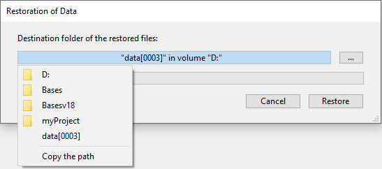

問題が発生したときは、一連のアプリケーションファイル全体を復元することができます。 主に 2つのカテゴリの問題が発生する可能性があります:

- アプリケーションが使用中に予期せず終了された。 この問題は電力の切断、システムのエラー等により発生する可能性があります。 この場合、問題が発生した瞬間のデータキャッシュの状態により、アプリケーションの復旧には異なる手順が必要となります:
  - キャッシュが空の場合、アプリケーションを問題なく開くことができます。 アプリケーションに対しておこなわれた変更はデータファイルに記録されています。 この場合には、特別な手順は必要ありません。
  - キャッシュに未保存の処理が含まれている場合、データファイルは損傷していませんが、カレントのログファイルを統合する必要があります。
  - キャッシュの内容をデータファイルに書き込み中だった場合、データファイルはおそらく損傷しています。 最新のバックアップから復元をおこない、カレントのログファイルを統合する必要があります。

- アプリケーションファイルを失った。 この問題はアプリケーションが配置されたディスク上のセクターが読み書き不能になった、あるいはウィルス、操作ミス等により発生します。 最新のバックアップから復元をおこない、カレントのログファイルを統合する必要があります。 問題発生後にアプリケーションが損傷しているかどうかを見分けるには、4D でアプリケーションを起動します。 4Dは自己検証をおこない、必要な復元処理手順を示します。 自動モードの場合、この処理はユーザーのアクションなしで直接実行されます。 定期的なバックアップがおこなわれていれば、4D の復元ツールを使用して (ほとんどの場合) 問題が発生する直前の状態までアプリケーションを復旧することができます。

> 問題発生後に、自動で 4Dのアプリケーション復旧処理を起動することができます。 このメカニズムは、ストラクチャー設定の **バックアップ/バックアップ＆復旧** ページで利用できるオプションを使用して管理します。 詳細は [自動復元](settings.md#自動復元とログの統合) を参照してください。\
> 問題が、データに対しておこなわれた不適切な処理の結果引き起こされた場合 (たとえば誤ってレコードを削除した等)、ログファイルの "ロールバック" 機能を使用してデータファイルを復旧できます。 この機能は MSC の [ロールバック](MSC/rollback.md) ページから利用できます。

## 手動でバックアップから復元する (標準ダイアログ)

バックアップモジュールを使用して生成されたアーカイブの内容を、手動で復元することができます。 手動による復元は、たとえばアーカイブ全体 (ストラクチャーファイルや添付されたファイル) を再生成したい場合や、アーカイブの内容を見たい場合などに必要となります。 手動復元の際に、カレントログファイルを統合することもできます。

バックアップの手動復元は、標準のファイルを開くダイアログボックス、あるいは Maintenance and Security Center (MSC) の [復元](../MSC/restore.md) ページからおこなうことができます。 MSC を使用した復元では詳細なオプション設定をおこなったり、アーカイブの内容をプレビューしたりすることができます。 他方、開かれているアプリケーションに関連したアーカイブのみを復元できます。

標準ダイアログボックスを使用してアプリケーションを手動復元するには:

1. 4Dアプリケーションを開始し、**ファイル** メニューから **復元...** を選択します。
   アプリケーションプロジェクトが開かれている必要はありません。
   または 
   4Dメソッドから `RESTORE` コマンドを実行します。
   標準のファイルを開くダイアログボックスが表示されます。
2. 復元するバックアップファイル (.4bk) またはログバックアップファイル (.4bl) を選択し、**開く** をクリックします。
   復元したファイルを配置する場所を指定するために、以下のダイアログボックスが表示されます: デフォルトで 4Dは アーカイブと同階層にアーカイブ名と同じ名前 (拡張子なし) のフォルダーを作成し、ファイルを復元します。 場所が表示されているエリアをクリックして、パスを確認することができます:

**[...]** ボタンをクリックして異なる場所を指定することもできます。
3. **復元** ボタンをクリックします。
4D は指定されたすべてのバックアップファイルを展開します。
カレントログファイル、または、バックアップファイルと同じ番号を持つログバックアップファイルが同じフォルダーに存在する場合、4D はその内容を検証します。 データファイル中に無い処理がログファイルに含まれていれば、その処理を統合するかどうか 4D が尋ねてきます。 **データベースが完全でない場合、最新のログを統合する** オプションが選択されている場合、統合処理は自動でおこなわれます ([自動復元](settings.md#自動復元) 参照)。

4. (任意) **OK** をクリックして、復元したアプリケーションにログファイルを統合します。
   復元と統合が正しく実行されると、4D は処理が成功したことを通知するダイアログを表示します。
5. **OK** をクリックします。

保存先フォルダーが表示されます。 バックアップ時のファイルの位置にかかわらず、4D はすべてのバックアップファイルをこのフォルダーに配置します。 これにより、ファイルを探す手間が省けます。

> データファイルの関連要素 (ファイルや `Settings` フォルダー) は保存先フォルダー内の `Data` サブフォルダー内に自動的に復元されます。

## 手動でバックアップから復元する (MSC)

Maintenance and Security Center (MSC) の [復元](MSC/restore.md)ページから、カレントアプリケーションのアーカイブを手動で復元できます。

## 手動でログを統合する

MSC の復元ページでログファイルの自動統合を選択していない場合 ([複数のログファイルを連続して統合する](MSC/restore.md#複数のログファイルを連続して統合する) 参照)、データファイルに保存されていない処理がログファイル中に見つかると、4D はアプリケーションを開く際に警告ダイアログボックスを表示します。

> このメカニズムを機能させるために、4D はカレントの場所にあるログファイルにアクセスできなければなりません。

カレントログファイルを統合するかしないかを選択することができます。 カレントログファイルを統合しないことにより、データ中に作成されたエラーを再生成しないようにすることもできます。
