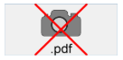
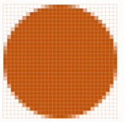

フォーム上で使用されるピクチャーについて、4Dは次のようにサポートしています。

## サポートされるネイティブフォーマット

4Dはピクチャーフォーマットのネイティブ管理を統合しています。 これは、ピクチャーが変換されることなく、元のフォーマットのまま 4D で格納、表示されることを意味します。 (シェイドや透過など) フォーマットにより異なる特定の機能は コピー・ペーストされる際にも保持され、改変なく表示されます。 このネイティブサポートは 4D に格納されるすべてのピクチャー (デザインモードでフォームにペーストされた [スタティックピクチャー](FormObjects/staticPicture.md)、ランタイムで [入力オブジェクト](FormObjects/input_overview.md) にペーストされたピクチャーなど) に対して有効です。

もっとも一般的なフォーマット (例: jpeg、gif、png、tiff、bmp、等) はどちらのフォーマットでもサポートされます。 macOS では、PDF フォーマットのエンコーディング/デコーディングも可能です。

> サポートされるフォーマットの完全なリストは OS や、マシンにインストールされているカスタムコーデックによって異なります。 どのコーデックが利用可能かを調べるためには、`PICTURE CODEC LIST` コマンドを使用してください。また、データ型の [ピクチャー](Concepts/dt_picture.md) の項も参照ください。

### 利用不可能なピクチャーフォーマット

マシン上で利用できないフォーマットのピクチャーに対しては、専用のアイコンが表示されます。 アイコンの下部にその拡張子が表示されます。

このアイコンは、そのピクチャーが表示されるべきところに自動的に使用されます:

このアイコンは、そのピクチャーがローカルでは表示も編集もできないことを意味します。ですが、中身を改変することなく保存し、他のマシンで表示することは可能です。 たとえば、Windows での PDF ピクチャーや、PICT フォーマットのピクチャーなどが該当します。

## 高解像度ピクチャー

4D は macOS および Windows の両方で高解像度ピクチャーの表示をサポートしています。 高解像度ピクチャーは、スケール係数または dpi によって定義されます。

### スケール係数

従来の標準的なディスプレイと比較して、高解像度ディスプレイは高い画素密度を持ちます。 これらの高解像度ディスプレイにおいてピクチャーが正しく表示されるには、適用する _スケール係数_ (例: 2倍、3倍など) に応じてその画素数を増やす必要があります。

高解像度のピクチャーを使う場合、ピクチャー名に "@nx" (_n_: スケール係数) を付けてスケール係数を指定することができます。 下のテーブルの例でも、高解像度ピクチャーの名前に、_circle@2x.png_、_circle@3x.png_ といった形でスケール係数が指定されています。

| 表示タイプ | スケール係数                     | 例題                                                                                                                                                                                              |
| ----- | -------------------------- | ----------------------------------------------------------------------------------------------------------------------------------------------------------------------------------------------- |
| 標準解像度 | 1:1 ピクセル密度 | **1x**  _circle.png_                                                                                                          |
| 高解像度  | ピクセル密度は2、または3の係数で増加        | <table><th>2x</th><th>3x</th><tr><td>*circle@2x.png*</td><td> *circle@3x.png*</td></tr></table> |

"@nx" で定義された高解像度ピクチャーは、次のオブジェクトで使用できます。

- [スタティックピクチャー](FormObjects/staticPicture.md)
- [ボタン](FormObjects/button_overview.md)/[ラジオボタン](FormObjects/radio_overview.md)/[チェックボックス](FormObjects/checkbox_overview.md)
- [ピクチャーボタン](FormObjects/pictureButton_overview.md)/[ピクチャーポップアップメニュー](FormObjects/picturePopupMenu_overview.md)
- [タブコントロール](FormObjects/tabControl.md)
- [リストボックスヘッダー](FormObjects/listbox_overview.md#リストボックスヘッダー)
- [メニューアイコン](Menus/properties.md#項目アイコン)

4D は自動的に最高解像度のピクチャーを優先します。 例: 標準解像度と高解像度の２つのスクリーンを使用している際に、片方からもう片方へとフォームを移動させると、4D は常に使用可能な範囲内での最高解像度のピクチャーを表示します。 コマンドまたはプロパティが _circle.png_ を指定していたとしても、_circle@3x.png_ があれば、それを使用します。

> 解像度の優先順位付けはスクリーン上のピクチャー表示にのみ適用され、印刷に関しては自動適用されないことに留意が必要です。

### DPI

高解像度が自動的に優先されますが、スクリーンやピクチャーの dpi _(\*)_、およびピクチャー形式によって、動作に違いが生じることがあります:

| 演算                                                                                                                                             | 動作                                                                                                                                                                                                                                                                                                                                                                                                                                                                                                                                                                                         |
| ---------------------------------------------------------------------------------------------------------------------------------------------- | ------------------------------------------------------------------------------------------------------------------------------------------------------------------------------------------------------------------------------------------------------------------------------------------------------------------------------------------------------------------------------------------------------------------------------------------------------------------------------------------------------------------------------------------------------------------------------------------ |
| ドロップ、ペースト                                                                                                                                      | ピクチャーの設定:<ul><li>**72dpi または 96dpi** - ピクチャーは "[中央合わせ]"(FormObjects/properties_Picture.md#中央合わせ--トランケート-中央合わせしない) 表示され、ピクチャーを表示しているオブジェクトは同じピクセル数です。</li><li>**その他の dpi** - ピクチャーは "[スケーリング](FormObjects/properties_Picture.md#スケーリング)" 表示され、ピクチャーを表示しているオブジェクトのピクセル数は (ピクチャーのピクセル数 / ピクチャーの dpi) \* (スクリーンの dpi) です。</li><li>**dpi なし** - ピクチャーは "[スケーリング](FormObjects/properties_Picture.md#スケーリング)" 表示されます。</li></ul> |
| [自動サイズ](https://doc.4d.com/4Dv19/4D/19/Setting-object-display-properties.300-5416671.ja.html#148057) (フォームエディターのコンテキストメニュー) | ピクチャーの表示が:<ul><li>**[スケーリング]](FormObjects/properties_Picture.md#スケーリング)** - ピクチャーを表示しているオブジェクトのピクセル数は (ピクチャーのピクセル数 / ピクチャーの dpi) \* (スクリーンの dpi) にリサイズされます。</li><li>**スケーリング以外** - ピクチャーを表示しているオブジェクトは、ピクチャーと同じピクセル数です。</li></ul>                                                                                                                                                              |

_(\*) 通常は  macOS = 72dpi, Windows = 96dpi_

## ダークモード (macOS のみ)

[フォームがダークスキームを使用](properties_FormProperties.md#カラースキーム) している場合に、標準のピクチャーの代わりに使用する専用のピクチャーやアイコンを定義することができます。

ダークモードピクチャーは以下のように定義します:

- ダークモードピクチャーは、標準 (ライトスキーム) バージョンと同じ名前で、"_dark "という接尾辞が付きます。
- ダークモードピクチャーは、標準バージョンの隣に保存します。

ランタイム時に、4D は [現在のフォームのカラースキーム](https://doc.4d.com/4Dv19R2/4D/19-R2/FORM-Get-color-scheme.301-5494033.ja.html) に応じて、ライト用またはダーク用のピクチャーを自動的にロードします。

## ピクチャー上のマウス座標

4D では、[ピクチャー式](FormObjects/properties_Object.md#式の型) が設定された [入力オブジェクト](FormObjects/input_overview.md) をクリック、またはホバーした際のマウスのローカル座標を取得できます。これはスクロールやズーム処理がおこなわれている場合でも可能です。 このピクチャーマップに似た機構は、たとえば地図作製ソフトウェアのインターフェースや、スクロール可能なボタンバーを管理するのに使用できます。

座標は _MouseX_ と _MouseY_ [システム変数](../Concepts/variables.md#システム変数) に返されます。 座標はピクセル単位で表現され、ピクチャーの左上隅が起点 (0,0) となります。 マウスがピクチャの座標の外側にある場合には、_MouseX_ と _MouseY_ には-1が返されます。

これらの値は、[`On Clicked`](Events/onClicked.md)、[`On Double Clicked`](Events/onDoubleClicked.md)、[`On Mouse up`](Events/onMouseUp.md)、[`On Mouse Enter`](Events/onMouseEnter.md)、あるいは [`On Mouse Move`](Events/onMouseMove.md) フォームイベントの一部として取得することができます。
