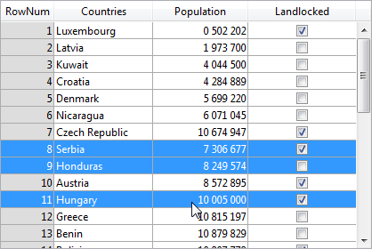

---

## 列

リストボックス列のコレクション。

#### JSON 文法

| 名称      | データタイプ         | とりうる値                 |
| ------- | -------------- | --------------------- |
| columns | 列オブジェクトのコレクション | リストボックス列のプロパティを格納します。 |

列オブジェクトに関してサポートされているプロパティの一覧については [列特有のプロパティ](listbox_overview.md#列特有のプロパティ) の章を参照してください。

#### 対象オブジェクト

[リストボックス](listbox_overview.md)

---

## 詳細フォーム名

`セレクション型リストボックス`

リストボックスの個々のレコードを編集・表示する際に使用するフォームを指定します。

指定されたフォームは以下のタイミングで表示されます:

- リストボックスに関連付けられている `addSubrecord` (サブレコード追加)、または `editSubrecord` (サブレコード編集) の標準アクションを使用したとき ([標準アクションの使用](https://doc.4d.com/4Dv20/4D/20/Using-standard-actions.300-6263819.ja.html) を参照してください)。
- [行をダブルクリック](#行をダブルクリック) プロパティが「レコード編集」か「レコード表示」に設定されている場合に行をダブルクリックしたとき。

#### JSON 文法

| 名称         | データタイプ | とりうる値                                                                                                     |
| ---------- | ------ | --------------------------------------------------------------------------------------------------------- |
| detailForm | string | <li>テーブルまたはプロジェクトフォームの名前 (文字列)</li><li>フォームを定義する .json ファイルへの POSIX パス (文字列)</li><li>フォームを定義するオブジェクト</li> |

#### 対象オブジェクト

[リストボックス](listbox_overview.md)

---

## 行をダブルクリック

`セレクション型リストボックス`

ユーザーがリストボックスの行をダブルクリックした際に実行されるアクションを指定します。 選択可能なオプションは以下の通りです:

- **何もしない** (デフォルト): 行をダブルクリックしても自動アクションは発動しません。
- **レコード編集**: 行をダブルクリックすると、リストボックスに設定された [詳細フォーム](#詳細フォーム名) に当該レコードが表示されます レコードは読み書き可能モードで開かれるので、編集が可能です。
- **レコード表示**: レコード編集と同様の挙動をしますが、レコードは読み取り専用モードで開かれるため、編集はできません。

> 空の行へのダブルクリックは無視されます。

選択されているアクションに関わらず、`On Double Clicked` フォームイベントが生成されます。

「レコード編集」「レコード表示」のアクションに関しては `On Open Detail` フォームイベントも生成されます。 リストボックスに関連付けられた詳細フォームに表示されたレコードが閉じられる際には `On Close Detail` フォームイベントが生成されます (レコードが編集されたかどうかは問いません)。

#### JSON 文法

| 名称                     | データタイプ | とりうる値                               |
| ---------------------- | ------ | ----------------------------------- |
| doubleClickInRowAction | string | "editSubrecord", "displaySubrecord" |

#### 対象オブジェクト

[リストボックス](listbox_overview.md)

---

## ハイライトセット

`セレクション型リストボックス`

このプロパティを使用して、リストボックス中でハイライトされたレコードを管理するために使用するセット名を指定します (**配列** データソースが指定されている場合には、リストボックスに割り当てた変数と同じ名前のブール配列をこの用途で使用します)。

4D は _ListBoxSetN_ (_N_ は 0 から始まり、フォーム上のリストボックスオブジェクトの数に従い増分されます) という名前のデフォルトセットを作成しますが、 必要に応じてこの名前を変更できます。 セットはローカル、プロセスおよびインタープロセスセットを使用できます (ネットワークトラフィックを制限するため、_$LBSet_ のようなローカルセットの使用を推奨します)。 指定されたセットは 4D が自動で管理します。 ユーザーが 1つ以上の行を選択すると、セットは即座に更新されます。 プログラムを使用して行を選択したい場合、"セット" テーマのコマンドをこのセットに適用できます。

> - リストボックス行のハイライトステータスとテーブルレコードのハイライトステータスは完全に独立しています。
> - "ハイライトセット" プロパティに名前が指定されていない場合、リストボックス中で行を選択することはできません。

#### JSON 文法

| 名称           | データタイプ | とりうる値  |
| ------------ | ------ | ------ |
| highlightSet | string | セットの名称 |

#### 対象オブジェクト

[リストボックス](listbox_overview.md)

---

## スクロールしない列とドラッグしない列

リストボックスのスクロールしない列とドラッグしない列はそれぞれ独立して動作します:

- スクロールしない列は常にリストボックスの左側に表示され、横スクロールされません。
- ドラッグしない列は、リストボックス中でドラッグ＆ドロップによる列の移動ができません。

> これらのプロパティはプログラミングによって設定することも可能です。詳細は _4Dランゲージリファレンス マニュアル_ の "リストボックス" の章を参照ください。

これらのプロパティは以下のように相互作用します:

- 列を "ドラッグしない" のみを設定した場合、その列は移動することができません。

- 列を "スクロールしない" のみに設定した場合、横スクロールしないエリア内に限りドラッグで列を移動することができます。 しかし、そのスクロールしないエリアを越えて移動することはできません。


- "スクロールしない" 列と "ドラッグしない" 列を同じ数に設定した場合、スクロールしないエリア内ではドラッグで移動することもできません。


- 必要に応じてスクロールしない列数とドラッグしない列数をそれぞれ設定できます。 たとえば、スクロールしない列を 3、ドラッグしない列を 1に設定した場合、ユーザーは横スクロールしないエリア内で右側 2つの列を入れ替えることができます。

### スクロールしない列数

ユーザーが横スクロールしても、リストボックスの左側に常に表示される列の数を指定します。

#### JSON 文法

| 名称                | データタイプ  | とりうる値                  |
| ----------------- | ------- | ---------------------- |
| lockedColumnCount | integer | 最小値: 0 |

#### 対象オブジェクト

[リストボックス](listbox_overview.md)

### ドラッグしない列数

実行時にドラッグで移動できない列の数を指定します。

#### JSON 文法

| 名称                | データタイプ  | とりうる値                  |
| ----------------- | ------- | ---------------------- |
| staticColumnCount | integer | 最小値: 0 |

#### 対象オブジェクト

[リストボックス](listbox_overview.md)

---

## 列数

リストボックスに表示される列の数を指定します。

> [`LISTBOX INSERT COLUMN`](https://doc.4d.com/4dv20/help/command/ja/page829.html) や [`LISTBOX DELETE COLUMN`](https://doc.4d.com/4dv20/help/command/ja/page830.html) などのコマンドを使うことで、プログラミングによって列数を動的に変更 (列の追加・削除) することができます。

#### JSON 文法

| 名称          | データタイプ  | とりうる値                  |
| ----------- | ------- | ---------------------- |
| columnCount | integer | 最小値: 1 |

#### 対象オブジェクト

[リストボックス](listbox_overview.md)

---

## 行コントロール配列

`配列型リストボックス`

リストボックス行の表示を管理するための 4D配列です。

配列型リストボックスの任意行の "非表示"、"無効化"、"選択可能" プロパティを管理するために、この配列を使用します。 このプロパティは `LISTBOX SET ARRAY` コマンドを使用して設定することができます。

行コントロール配列は、リストボックス内の要素数と同じ数を含んでいる倍長整数型の配列でなければなりません。 _行コントロール配列_ の各要素は対応する行のインターフェースステータスを定義します。 "リストボックス" 定数テーマの定数を使って、3つのインターフェースプロパティが利用可能です:

| 定数                       | 値 | 説明                                                                                                                                                                                                                                                                                                                                                                                                                         |
| ------------------------ | - | -------------------------------------------------------------------------------------------------------------------------------------------------------------------------------------------------------------------------------------------------------------------------------------------------------------------------------------------------------------------------------------------------------------------------- |
| lk row is disabled       | 2 | 対応する行は無効化されています。 テキストや、チェックボックスなどのコントロール類は暗くなっているかグレーアウトされています。 入力可能なテキスト入力エリアは入力可能ではありません。 デフォルト値: 有効化                                                                                                                                                                                                                                                                                                    |
| lk row is hidden         | 1 | 対応する行は非表示です。 行を非表示にすることは、リストボックスの見た目にのみ影響します。 非表示の行は配列内には存在し、プログラミングを通して管理可能です。 ランゲージコマンド (具体的には `LISTBOX Get number of rows` または `LISTBOX GET CELL POSITION`) は行の表示/非表示のステータスを考慮しません。 たとえば、10行あるリストボックスの、最初の 9行が非表示になっていた場合、`LISTBOX Get number of rows` は10を返します。 ユーザーの視点では、リストボックス内の非表示行の存在は視覚的には認識できません。 表示されいている行のみが (たとえば、"すべてを選択" コマンドなどで) 選択可能です。 デフォルト値: 表示 |
| lk row is not selectable | 4 | 対応する行は選択可能になっていません (ハイライトできません)。 入力可能なテキスト入力エリアは [シングルクリック編集](properties_Entry.md#シングルクリック編集) オプションが有効になっていない限り入力可能ではありません。 しかしながら、チェックボックスなどのコントロールとリストは機能しています。 この設定はリストボックスの選択モードが "なし" の場合には無視されます。 デフォルト値: 選択可能                                                                                                                                                                    |

行のステータスを変えるためには、対応する配列の要素に適切な定数を設定するだけです。 たとえば、10行目を選択不可能に設定したい場合、以下のように書くことができます:

```4d
 aLControlArr{10}:=lk row is not selectable
```



複数のインターフェースプロパティを同時に定義することもできます:

```4d
 aLControlArr{8}:=lk row is not selectable + lk row is disabled
```


要素に対してプロパティを設定すると、(再設定しない限り) 同要素の他の値を上書きするという点に注意してください。 例:

```4d
 aLControlArr{6}:=lk row is disabled + lk row is not selectable 
 // 6行目を無効化し、かつ選択不可に設定します
 aLControlArr{6}:=lk row is disabled 
 // 6行目を無効化するが、選択不可を再設定していないので選択が可能となります
```

#### JSON 文法

| 名称               | データタイプ | とりうる値        |
| ---------------- | ------ | ------------ |
| rowControlSource | string | 行コントロール配列の名称 |

#### 対象オブジェクト

[リストボックス](listbox_overview.md)

---

## 選択モード

リストボックス行の選択モードを指定します:

- **なし**: 行を選択することはできません。 [シングルクリック編集](properties_Entry.md#シングルクリック編集) オプションがチェックされている場合を除き、リストボックスをクリックしても効果はありません。 ナビゲーションキーを使用しても、リストをスクロールするだけとなり、その際に `On Selection Change` フォームイベントは生成されません。
- **単一**: 一度に一行のみ選択できます。 クリックすることで、行を選択できます。 **Ctrl+クリック** (Windows) や **Command+クリック** (macOS) を使うと、対象行の選択状態 (選択・非選択) が切り替わります。\
  上下キーを使うとリストの前後の行が選択されます。 その他のナビゲーションキーはリストをスクロールします。 カレントの行が変更されるたびに、`On Selection Change` フォームイベントが生成されます。
- **複数**: 標準のショートカットを使用して複数行を同時に選択できます。

#### JSON 文法

| 名称            | データタイプ | とりうる値                        |
| ------------- | ------ | ---------------------------- |
| selectionMode | string | "multiple", "single", "none" |

#### 対象オブジェクト

[リストボックス](listbox_overview.md)
