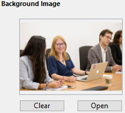

メニューバーはカスタムアプリケーションにおいて主要なインターフェースを提供します。 各カスタムアプリケーションにおいて、最低1つのメニューを添付したメニューバーを1つ作成しなければなりません。 デフォルトで、メニューバー#1 がアプリケーションモードで表示されます。 You can change which menu bar is displayed using the `SET MENU BAR` command.

各メニューバーにはカスタムスプラッシュスクリーンを関連付けることができます。またメニューバーとスプラッシュスクリーンはプレビューすることができます。

## スプラッシュスクリーン

各メニューバーにカスタムスラッシュスクリーンを関連付けることにより、アピアランスを拡張できます。 スプラッシュスクリーンを含むウィンドウは、メニューバーが表示されるとき、その下に表示されます。 ロゴなどのピクチャーを表示できます。 デフォルトで、4D はスプラッシュスクリーンに 4D ロゴを表示します:

任意の画像編集アプリケーションで作成したピクチャーをスプラッシュスクリーンで使用できます。 クリップボードにコピーした画像、あるいはハードディスク上の画像を使用できます。 4D がサポートする標準のピクチャータイプの画像を使用できます。

スプラッシュスクリーンピクチャーはメニューエディターでのみ設定できます: まず、カスタムスプラッシュスクリーンを割り当てたいメニューバーを選択します。 ウィンドウ右側に"背景画像"エリアが表示されます。
To open a picture stored on your disk directly, click on the **Open** button or click in the "Background Image" area. ポップアップメニューが表示されます:

- To paste a picture from the clipboard, choose **Paste**.
- To open a picture stored in a disk file, choose **Open**.
  開くを選択すると、標準のファイルを開くダイアログボックスが表示されます。使用するピクチャーを選択します。 設定が完了すると、選択した画像がプレビューとして表示されます。 これにより、メニューバーとの関連付けが確認できます。

メニューバーをテストすると、設定の結果を見ることができます (後述参照)。 アプリケーションモードでは、ピクチャーはスプラッシュスクリーンに "トランケート (中央合わせ)" で表示されます。

> You can choose whether to display or hide this window using the **Display toolbar** option in the Settings.

To remove the custom picture and display the default one instead, click on the **Clear** button or select **Clear** in the area pop-up menu.

## メニューバーのプレビュー

メニューバーエディターからカスタムメニューとスプラッシュスクリーンをプレビューできます。ツールボックスウィンドウを閉じる必要はありません。

To do so, simply select the menu bar and choose **Test the menu bar "Menu Bar #X"** in the context menu or the options menu of the editor.

すると、メニューバーとスプラッシュスクリーンのプレビューが表示されます。 メニューや階層メニューを表示させることができます。 ただし、プレビュー状態のメニューを選択してもコマンドは実行されません。 To test the functioning of menus and the toolbar, you must use the **Test Application** command from the **Run** menu.

:::info

If the **Use SDI mode on Windows** option is selected in the ["Interface" page of the Settings dialog box](../settings/interface.md#display-windows), the **Test Application** menu allows you to test your application in [SDI or MDI mode](sdi/md) on Windows:

:::
