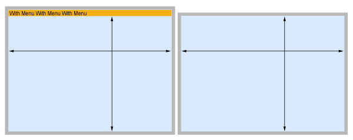

Windows において、組みこみ 4Dアプリケーションを SDI (シングルドキュメントインターフェース) アプリケーションとして設定しテストすることができます。 SDIアプリケーションでは、それぞれのウィンドウが互いに独立し、それぞれが独自のメニューバーを持つことができます。 SDIアプリケーションは MDI (マルチドキュメントインターフェース) に対する概念で、MDI ではすべてのウィンドウが一つのメインウィンドウの中に含まれ、それに依存した作りになっています。

:::info

SDI/MDI という概念は macOS には存在しません。 この機能は Windows用アプリケーション専用のもので、関連オプションは macOS においてはすべて無視されます。

:::

## SDIモード利用条件

SDIモードは以下の実行環境に限り利用可能です:

- Windows
- Merged [stand-alone](../Desktop/building.md#build-stand-alone-application) or [client](../Desktop/building.md#build-client-application) 4D application
- [**Test application** feature](bars.md#previewing-menu-bars) available from the **Run** menu.

## SDIモードの有効化

To enable the SDI mode in your application, just check the **Use SDI mode on Windows** option in the ["Interface" page of the Settings dialog box](../settings/interface.md#display-windows).

有効化した後、アプリケーションを実際に SDIモードで実行するには、次のいずれかの方法があります:

- 組み込みアプリケーション (スタンドアロンまたはクライアントアプリケーション) をビルドし、Windows で実行します。
- select **Test Application in SDI Mode** from the **Run** menu on Windows to test the development.

:::info

Because the development environment is executed in MDI, switching from development mode to runtime mode using the **Test Application in SDI Mode** menu item is equivalent to restarting your application.

:::

## SDIモードでのアプリケーションの管理

4Dアプリケーションを SDIモードで実行するために、特別な実装は必要ありません。既存のメニューバーは自動的に SDIウィンドウへと移されます。 しかしながら、以下に挙げられている特定の原則に注意する必要があります。

### ウィンドウ内のメニュー

SDIモードでは、同プロセス中に開かれたすべてのドキュメントタイプウィンドウ (たとえばフローティングパレットはこれに含まれません) には自動的にプロセスメニューバーが表示されます。 ただし、プロセスメニューバーが非表示の状態でも、メニュー項目のショートカットは有効です。

メニューは、コンテンツのサイズを変更することなくウィンドウの上部に追加されます:

このため、ウィンドウは MDIモードあるいは SDIモードのどちらにおいてもオブジェクトの位置を再計算することなく使用することができます。

#### スプラッシュスクリーン

- If the **Splash screen** interface option was [selected in the Settings](../settings/interface.md#display-windows), the splash window will contain any menus that would have been displayed in the MDI window. MDIモード同様、スプラッシュスクリーンを閉じるとアプリケーションを終了することになるという点に注意してください。
- スプラッシュスクリーンオプションが選択されていなかった場合、メニューは開かれているウィンドウにおいて、プログラマーの選択に応じて表示されます。

### デバッガー

When displayed in SDI mode, the [debugger window](../Debugging/debugger.md) does not contain [editing buttons](../Debugging/debugger.md#tool-bar-buttons), because switching to development environment requires to abort execution and restart the application in MDI mode.

### 自動終了

MDIモードで実行時、ユーザーによってアプリケーションウィンドウ (MDIウィンドウ) が閉じられると、4Dアプリケーションが終了します。 しかしながら、SDIモードで実行時、4Dアプリケーションにはアプリケーションウィンドウがなく、また開いているウィンドウをすべて閉じたとしても、必ずしもユーザーがアプリケーションを終了したいと思っているとは限りません (たとえばフェイスレスプロセスが熟考中かもしれません) が、場合によっては終了したいという場合もあります。

To handle this case, 4D applications executed in SDI mode include a mechanism to automatically quit (by calling the `QUIT 4D` command) when the following conditions are met:

- ユーザーがこれ以上アプリケーションとやりとりすることができない
- 生きているユーザープロセスがない
- 4Dプロセスあるいはワーカープロセスはイベント待機中である
- Webサーバーが開始されていない
- the [WebAdmin server](../Admin/webAdmin.md) is not started.

:::note

When a menu with an associated _quit_ standard action is called, the application quits and all windows are closed, wherever the menu was called from.

:::

## ランゲージ

4D によって透過的に管理されるとはいえ、SDIモードではアプリケーションインターフェースの管理に関してこれまでと若干の差異が存在します。 4Dランゲージにおける特異性は以下の表にある通りです。

| コマンド/機能                           | Windows での SDIモードの特徴                                                                                                                                                                                                                                                                                                                                               |
| --------------------------------- | ------------------------------------------------------------------------------------------------------------------------------------------------------------------------------------------------------------------------------------------------------------------------------------------------------------------------------------------------------------------ |
| `Open form window`                | Options to support floating windows in SDI (`Controller form window`) and to remove the menu bar (`Form has no menu bar`)                                                                                                                                                                                                    |
| `Menu bar height`                 | メニューバーが 2行以上に折り返されている場合でも単一行のメニューバーのピクセル単位での高さを返します。 フォームウィンドウをともなわないプロセスからコマンドが呼ばれている場合には 0 を返します。                                                                                                                                                                                                                                                                |
| `SHOW MENU BAR` / `HIDE MENU BAR` | カレントの (コードが実行されている場所の) フォームウィンドウにのみ適用されます                                                                                                                                                                                                                                                                                                       |
| `MAXIMIZE WINDOW`                 | ウィンドウはスクリーンサイズいっぱいまで最大化されます                                                                                                                                                                                                                                                                                                                                        |
| `CONVERT COORDINATES`             | `XY Screen` is the global coordinate system where the main screen is positioned at (0,0). Screens on its left side or on top of it can have negative coordinates and any screens on its right side or underneath it can have coordinates greater than the values returned by `Screen height` or `Screen width`. |
| `GET MOUSE`                       | グローバル座標はスクリーンからの相対位置になります                                                                                                                                                                                                                                                                                                                                          |
| `GET WINDOW RECT`                 | window パラメーターに -1 を渡した場合、コマンドは 0;0;0;0 を返します                                                                                                                                                                                                                                                                                                                       |
| `On Drop database method`         | サポートされていません                                                                                                                                                                                                                                                                                                                                                        |

:::info

You can use the [**Get application info**](https://doc.4d.com/4dv19R/help/command/en/page1599.html) command to know the current running mode on Windows.

:::
