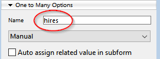

ORDA はオブジェクトベースであるため、ORDA を使うにはオブジェクト指向プログラミングの基本的な知識が必要です。

## データストアの説明

The ORDA datastore is automatically based upon a 4D database structure, provided it complies with the [ORDA prerequisites](overview.md#orda-prerequisites).

この例題では、以下の単純な 4Dデータベースストラクチャーを使用します:


データストアとして公開されているものを知るために、新しいプロジェクトメソッドを作成し、以下の行を記述します:

```code4d
TRACE
```

このメソッドを実行すると、デバッガーウィンドウが呼び出されます。
In the Expression area, double-click to insert an expression and enter `ds`. これは、データストアオブジェクトを返します。
Deploy the object, you can see that tables and fields are automatically exposed by ORDA as properties of the `ds` object:


これはつまり、たとえば [Company]テーブルの cityフィールドを参照する必要がある場合、ORDA では次のように書くだけ事足ります:

```code4d
ds.Company.city // 都市の名前を返します
```

> In the ORDA world, ds.Company is a **dataclass**. ds.Company.city is an **attribute**.

> ORDA は大文字と小文字を区別します。 `ds.company.city` will not refer to the ds.Company.city attribute.

You have also noticed the extra `hires` property in the ds.Company dataclass. これはフィールドに対応した属性ではありません。 `hires` is actually the name of the _One to many_ relation between Company and Employee:


_Name of the relation as defined in the Inspector_

つまり、ある会社で働く従業員のリストにアクセスしたいとき、ORDA では次のように書きます:

```code4d
ds.Company.hires // 従業員のリストを返します
```

しかし、急ぎすぎてはいけません。 まずは、ORDA のデータクラスにデータを記録する方法を見ていきましょう。

## データの追加

In ORDA, you can add a record to a dataclass using the `new()` command.

> In the ORDA world, a record is an **entity** -- an entity is itself an object. A command that is attached to a specific object is called a **member method**.

```code4d
$entity:=ds.Company.new() // Company データクラスに
// 新しいエンティティ参照を作成し、  
// それを $entity 変数に代入します
```

新しいエンティティオブジェクトには、その親データクラスのすべての属性の "コピー" が含まれているので、それらに値を代入することができます:

```code4d
$entity.name:="ACME, inc."  
$entity.city:="London"  
//$entity.ID is automatically filled
```

今のところ、エンティティはメモリ上にしか存在しません。 To store it in the data file, you need to save it using the `save()` member method:

```code4d
$status:=$entity.save()
```
