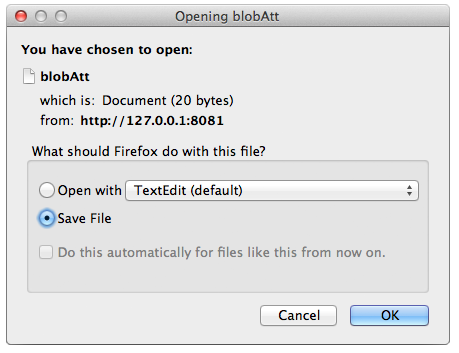

Pass "true" to save the BLOB as a document (must also pass `$expand={blobAttributeName}`)

## 説明

`$binary` allows you to save the BLOB as a document.  You must also use the [`$expand`]($expand.md) command in conjunction with it.

以下のリクエストを実行した場合:

```
GET  /rest/Company(11)/blobAtt?$binary=true&$expand=blobAtt
```

ディスク上の BLOB の保存先を聞かれます:


