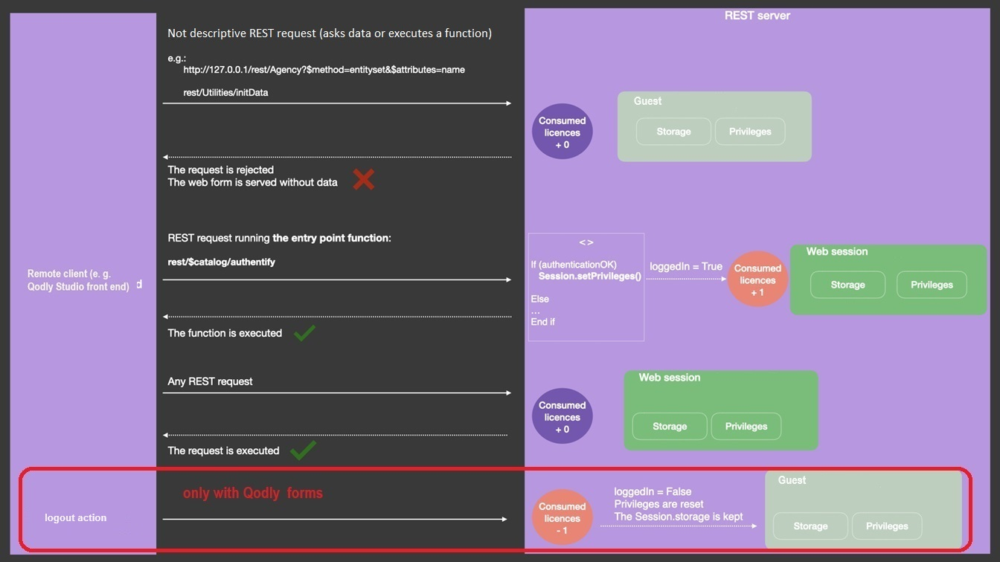

When [scalable sessions are enabled](WebServer/sessions.md#enabling-sessions) (recommended), REST requests can create and use [web user sessions](WebServer/sessions.md), providing extra features such as multiple requests handling, data sharing between web client processes, and control of user privileges.

When a web user session is opened, you can handle it through the `Session` object and the [Session API](API/SessionClass.md). 後続の RESTリクエストは同じセッションcookie を再使用します。

> - On 4D Server, opening a REST session might require that a free 4D client license is available, depending on the [user login mode](#user-login-modes).<br/>
> - シングルユーザーの 4D では、テスト目的で RESTセッションを 3つまで開くことができます。

## ユーザーログインモード

RESTリクエストが 4Dクライアントライセンスを取得する方法をユーザーログインモードによって制御することができます。 "デフォルト" または "強制ログイン" の 2つのユーザーログインモードから選択できます。

You set the user login mode through the `forceLogin` property in the [`roles.json` file](../ORDA/privileges.md#rolesjson-file):

- the **default mode** is used if the "forceLogin" property is missing or set to "false",
- the **force login** mode is used if the "forceLogin" property is set to "true".

:::caution

このプロパティを変更した場合、設定を反映するにはサーバーを再起動する必要があります。

:::

:::note

In Qodly Studio for 4D, the mode can be set using the [**Force login** option](../WebServer/qodly-studio.md#force-login) in the Privileges panel.

:::

### デフォルトモード

デフォルトモードでは、RESTリクエストは Webユーザーセッションで処理され、自動的にライセンスが消費されます (Webユーザーセッションが存在しない場合は作成されます)。 サーバー上で保持されるライセンス数を制御する必要がない場合は、このシンプルモードを使用できます。
When the default mode is enabled, you can authenticate users through the `On REST Authentication` database method (see below).

### 強制ログインモード

"強制ログイン" モードでは、ライセンスの消費は Webユーザーセッションから切り離されます。 A license is required only when the [`Session.setPrivileges()`](../API/SessionClass.md#setprivileges) is executed, allowing you to control the number of used licenses.

[Descriptive REST requests](#descriptive-rest-requests) are always processed by the server, even if no web user session using a license is opened. この場合、それらは "ゲスト" セッションを介して処理されます。

他のすべての RESTリクエスト (データ処理や関数の実行) は、適切な権限を持つ Webセッション内で実行された場合にのみ処理されます。それ以外の場合はエラーを返します To assign privileges to a web session, you need to execute the [`Session.setPrivileges()`](../API/SessionClass.md#setprivileges) function for the session. この関数を実行すると、4Dライセンスの消費が発生します。

このモードでは、以下のログインシーケンスを実装できます:

1. 最初の RESTコール (たとえば Webフォームコール) では、"ゲスト" Webユーザーセッションが作成されます。 記述的リクエスト以外のリクエストを実行する権限も、ライセンスの消費もありません。
2. You call your exposed [datastore class function](../ORDA/ordaClasses.md#datastore-class) named `authentify()` (created beforehand), in which you check the user credentials and call [`Session.setPrivileges()`](../API/SessionClass.md#setprivileges) with appropriate privileges.
3. The `/rest/$catalog/authentify` request is sent to the server along with user credentials. This step only requires a basic login form that do not access data; it can be a Qodly form (called via the `/rest/$getWebForm` request).
4. ユーザーが正常に認証された場合、4Dライセンスがサーバー上で消費され、すべての RESTリクエストが受け入れられます。



### 記述的RESTリクエスト

記述的RESTリクエストは、ライセンスを必要としない Webユーザーセッション ("ゲスト" セッション) で処理することができます。 記述的RESTリクエストとは以下のものを指します:

- [`/rest/$catalog`]($catalog.md) requests (e.g. `/rest/$catalog/$all`) - access to available dataclasses
- `/rest/$catalog/authentify` - the datastore function used to login the user
- `/rest/$getWebForm` - the rendering of a Qodly form


### `Function authentify`

#### シンタックス

```4d
exposed Function authentify({params : type}) {-> result : type}
	// code
```

The `authentify()` function must be implemented in the [DataStore class](../ORDA/ordaClasses.md#datastore-class) of the project and must be called through a REST request.

"強制ログイン" モードが有効な場合、この関数は、RESTゲストセッションから唯一の利用可能なエントリーポイントです。セッションが適切な権限を取得するまで、他の関数の呼び出しやデータアクセスは拒否されます。

The function can receive any authentication or contextual information as [parameter(s)](ClassFunctions.md#parameters) and can return any value. この関数は RESTリクエストからのみ呼び出すことができるため、引数は POSTリクエストの本文で渡されなければなりません。

この関数は 2部構成で書かれる必要があります:

- RESTリクエストの送信元を識別し、認証するためのコード
- if the authentication is successful, a call to [`Session.setPrivileges()`](../API/SessionClass.md#setprivileges) that assigns appropriate privileges to the session.

If the function does not call [`Session.setPrivileges()`](../API/SessionClass.md#setprivileges), no privileges are assigned, no license is consumed and subsequent non-descriptive REST requests are rejected.

#### 例題

サーバー上で Webセッションを開くためにユーザー情報を確認します。 You created the following `authentify()` function in the datastore class:

```4d
exposed Function authentify($credentials : Object) : Text

var $users : cs.UsersSelection
var $user : cs.UsersEntity
	
$users:=ds.Users.query("name = :1"; $credentials.name)
$user:=$users.first()

If ($user#Null) //the user is known
	If (Verify password hash($credentials.password; $user.password))
		Session.setPrivileges("vip")
	Else 

		return "Wrong password"
	End if 
Else 
        return "Wrong user"
End if 
```

To call the `authentify()` function:

**POST** `127.0.0.1:8111/rest/$catalog/authentify`

リクエストのボディ:

```json
[{"name":"Henry",
"password":"123"}]
```

## Using `On REST Authentication`

In default login mode (i.e. the "force login" mode is disabled), you can log in a user to your application by calling [`$directory/login`]($directory.md#directorylogin) in a POST request including the user's name and password in the header. This request calls the `On REST Authentication` database method (if it exists), where you can check the user's credentials (see example below).

If the `On REST Authentication` database method has not been defined, a `guest` session is opened.

### 例題

In this example, the user enters their email and password in an html page that requests [`$directory/login`]($directory.md#directorylogin) in a POST (it is recommended to use an HTTPS connection to send the html page). The `On REST Authentication` database method is called to validate the credentials and to set the session.

htmlログインページ:


```html
<html><body bgcolor="#ffffff">

<div id="demo">
	<FORM name="myForm">
Email: <INPUT TYPE=TEXT NAME=userId VALUE=""><br/>
Password: <INPUT TYPE=TEXT NAME=password VALUE=""><br/>
<button type="button" onclick="onClick()">
Login
</button>
<div id="authenticationFailed" style="visibility:hidden;">Authentication failed</div>
</FORM>
</div>

<script>
function sendData(data) {
  var XHR = new XMLHttpRequest();
  
  XHR.onreadystatechange = function() {
    if (this.status == 200) {      
      window.location = "authenticationOK.shtml"; 
      }
      else {
      document.getElementById("authenticationFailed").style.visibility = "visible";
      }
  };
  
  XHR.open('POST', 'http://127.0.0.1:8044/rest/$directory/login'); //rest server address
  
  XHR.setRequestHeader('username-4D', data.userId);
  XHR.setRequestHeader('password-4D', data.password);
  XHR.setRequestHeader('session-4D-length', data.timeout);
  
  XHR.send();
};
function onClick()
{
sendData({userId:document.forms['myForm'].elements['userId'].value , password:document.forms['myForm'].elements['password'].value , timeout:120})
}
</script></body></html>

```

When the login page is sent to the server, the `On REST Authentication` database method is called:

```4d
	//On REST Authentication

#DECLARE($userId : Text; $password : Text) -> $Accepted : Boolean
var $sales : cs.SalesPersonsEntity

$Accepted:=False

	//A '/rest' URL has been called with headers username-4D and password-4D
If ($userId#"")
    $sales:=ds.SalesPersons.query("email = :1"; $userId).first()
    If ($sales#Null)
        If (Verify password hash($password; $sales.password))
            fillSession($sales)
            $Accepted:=True
        End if 
    End if 
End if 
```

> As soon as it has been called and returned `True`, the `On REST Authentication` database method is no longer called in the session.

The `fillSession` project method initializes the user session, for example:

```4d
#DECLARE($sales : cs.SalesPersonsEntity)
var $info : Object

$info:=New object()
$info.userName:=$sales.firstname+" "+$sales.lastname

Session.setPrivileges($info)

Use (Session.storage)
    If (Session.storage.myTop3=Null)
        Session.storage.myTop3:=$sales.customers.orderBy("totalPurchase desc").slice(0; 3)
    End if 
End use
```
