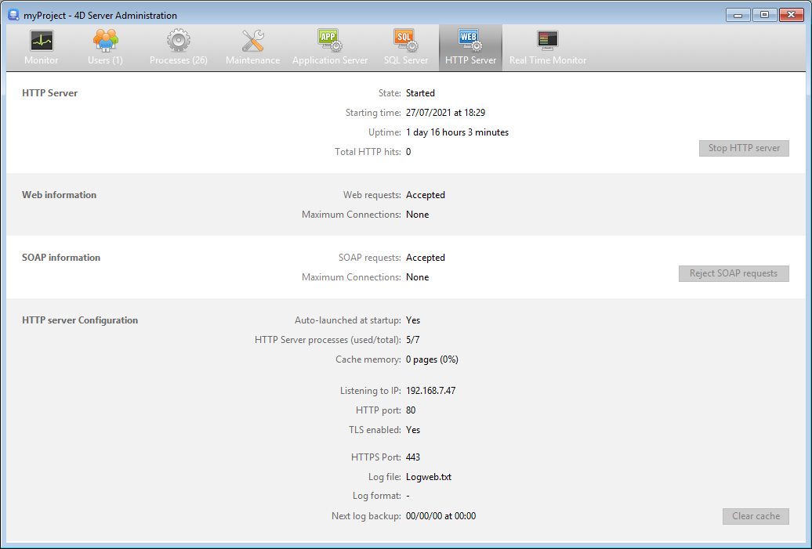

The **HTTP Server** page groups together information about the operation of the Web server and SOAP server of 4D Server. Webサーバーは、HTMLページやピクチャーなどの Webコンテンツの公開を可能にします。 SOAPサーバーは Webサービスの公開を管理します。 これら 2つのサーバーは、4D Server の内部的な HTTPサーバーに依存しています。

ページの上部には、4D Server の HTTPサーバーの現在の状況が表示されます。

- **State**: Started or Stopped
- **Starting time**: Date and time the HTTP server was last launched.
- **Uptime**: Time elapsed since last startup of the HTTP server.
- **Total HTTP hits**: Number of (low level) HTTP hits received by the HTTP server since it was started.

## HTTPサーバー開始/停止

このボタンは切り替え表示され、4D Server HTTPサーバーをコントロールするために使用します。

- When the HTTP server state is "Started," the button is titled **Stop HTTP Server**. このボタンをクリックすると、4D Server HTTPサーバーは即座に停止し、Webサーバー、RESTサーバー、および SOAPサーバーはリクエストを受け付けなくなります。
- When the HTTP server state is "Stopped," the button is titled **Start HTTP Server**. このボタンをクリックすると、4D Server HTTPサーバーは即座に開始し、Web、REST、および SOAPリクエストを受け付けます。

> HTTPサーバーを開始するには適切なライセンスが必要です。
>
> ストラクチャー設定で設定してアプリケーション起動と同時に、またはプログラムを使用して必要な時に、HTTPサーバーを自動で開始することができます。

## Web情報

このエリアには、4D Server の Webサーバーに関する情報が表示されます。

- **Web requests**: Accepted or Rejected. この情報は Webサーバーが有効かどうかを示します。 Webサーバーは直接 HTTPサーバーにリンクしているため、HTTPサーバーが開始されていれば Webリクエストは受信され、停止されていれば拒否されます。
- **Maximum connections**: Maximum number of Web connections allowed. この値は、サーバーマシンにインストールされているライセンスによります。

## SOAP情報

このエリアには、4D Server の SOAPサーバーに関する情報が表示され、コントロールボタンも一つ含まれます。

- **SOAP requests**: Accepted or Rejected. この情報は SOAPサーバーが有効かどうかを示します。 SOAPリクエストを受け入れるためには、HTTPサーバーが開始され、かつ SOAPサーバーが明示的にリクエストを受け入れなければなりません (ボタンの説明参照)。
- **Maximum connections**: Maximum number of SOAP connections allowed. この値は、サーバーマシンにインストールされているライセンスによります。
- **Accept/Reject SOAP requests** button: This button toggles and can be used to control the activation of the 4D Server SOAP server. This button modifies the value of the **Allow Web Services Requests** option on the "Web Services" page of the Settings (and vice versa). You can also use the [`SOAP REJECT NEW REQUESTS`](https://doc.4d.com/4dv19/help/command/en/page1636.html) command to refuse new SOAP requests, however this does not modify the value of the **Allow Web Services Requests** option.

If you click on the **Accept SOAP requests** button and the HTTP server is stopped, 4D automatically starts it.

## HTTPサーバー設定

このエリアには、HTTPサーバーの設定パラメーターや動作に関する情報が表示されます。

- **Auto-launched at startup**: parameter set via the Settings.
- **HTTP Server processes (used/total)**: number of HTTP processes created on the server (current number of processes / total of all processes created).
- **Cache memory**: size of HTTP server cache memory, when it is activated (size actually used by cache / maximum size theoretically allocated to the cache in the Settings). You can click on the **Clear Cache** button to empty the current cache.
- **Listening to IP**, **HTTP Port** (80 by default), **TLS enabled** for HTTP connections (does not concern 4D nor SQL connections) and **HTTPS Port** used: current [configuration parameters](WebServer/webServerConfig.md) of the HTTP server, specified through the Settings or by programming.
- **Log file information**: name, format and date of the next automatic log backup of the HTTP server (logweb.txt file).
