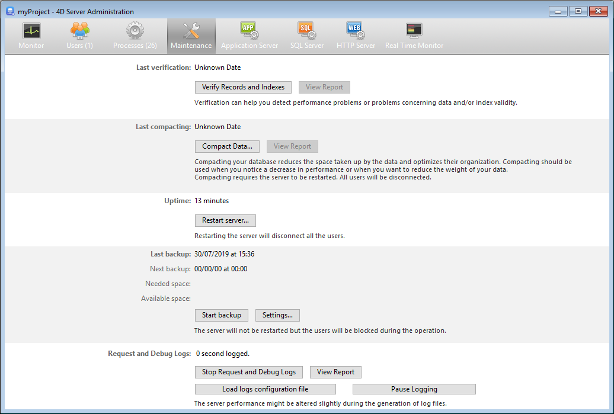

The **Maintenance** page of the 4D Server Administration window provides information concerning the current operation of the application. また、基本的なメンテナンス機能にアクセスすることもできます:

## 最新の検査/圧縮:

These areas indicate the date, time and status of the last [data verification](MSC/verify.md) and [compacting operation](MSC/compact.md) carried out on the database.

### レコードとインデックスを検査

このボタンを使用して、サーバーを止めることなく検査処理を直接起動できます。 検証の間、サーバーの動作が遅くなるかもしれないことに留意してください。

データベースのすべてのレコードとすべてのインデックスが検証されます。 If you want to be able to target the verification or have additional options available, you will need to use the [Maintenance and Security Center](MSC/overview.md) (MSC).

After verification, a report file is generated in XML format on the server in the [maintenance Logs](Project/architecture.md#logs) folder. The **View Report** button (named **Download Report** if the operation was carried out from a remote machine) lets you display the file in your browser.

### データ圧縮

このボタンを使用して、データ圧縮処理を直接起動できます。 この処理をおこなうにはサーバーを停止させる必要があります。 ボタンをクリックすると、4D Server の終了ダイアログが表示され、終了方法を選択することができます:

アプリケーションが実際に停止された後、4D Server はデータベースのデータに対する標準の圧縮処理をおこないます。 If you want to have additional options available, you will need to use the [MSC](MSC/overview.md).

圧縮が終了すると、4D Server は自動でデータベースを再開します。 その後、4Dユーザーの再接続が可能になります。

> 圧縮リクエストがリモートの 4Dマシンからなされた場合、このマシンは 4D Server により自動で再接続されます。

After verification, a report file is generated in XML format on the server in the [maintenance Logs](Project/architecture.md#logs) folder. The **View Report** button (named **Download Report** if the operation was carried out from a remote machine) lets you display the file in your browser.

## 動作時間

このエリアには、サーバーが開始されてからの稼働時間 (日、時、分) が表示されます。

### サーバを再起動...

このボタンをクリックするとサーバーを即座に再起動できます。 ボタンをクリックすると、4D Server の終了ダイアログが表示され、終了方法を選択することができます。 再起動後、4D Server は自動でプロジェクトを再度開きます。 その後、4Dユーザーの再接続が可能になります。

> 再起動リクエストがリモートの 4Dマシンからなされた場合、このマシンは 4D Server により自動で再接続されます。

## 前回のバックアップ

This area indicates the date and time of the [last backup](MSC/backup.md) of the database and provides information about the next scheduled automatic backup (if any). Automatic backups are configured using the **Scheduler** page of the structure settings.

- **Last backup**: date and time of last backup.
- **Next backup**: date and time of next scheduled backup.
- **Needed space**: estimated space needed for the backup. The actual size of the backup file may vary according to the settings (compression, etc.) and according to variations of the data file.
- **Available space**: space available on the backup volume.

The **Start backup** button can be used to backup the database immediately using the current backup parameters (files backed up, location of archives, options, etc.). You can view these parameters by clicking on the **Settings...** button. サーバー上でのバックアップがおこなわれる間、クライアントマシンはブロックされ (ただし接続解除はされません)、新規のクライアント接続はできなくなります。

## リクエストとデバッグログ

このエリアには、(ログファイルが有効化されている場合に) ログファイルの記録に要した時間が表示され、ログの有効化も管理できます。

Refer to the [**Description of log files**](Debugging/debugLogFiles.md) section for details on log files.

### リクエストとデバッグのログを開始/停止

The **Start Request and Debug Logs** button starts log files. これによりフォーマンスが著しく低下する場合があるため、これはアプリケーションの開発フェーズでのみ使用します。

> このボタンは、サーバー上で実行されているオペレーションしか記録しません。

When the logs have been activated, the button title changes to **Stop Request and Debug Logs**, so that you can stop recording requests at any time. 停止後にログを再開すると、以前のファイルは消去されることに留意してください。

### レポートを表示

The **View Report** button (named **Download report** if the operation was carried out from a remote desktop client) lets you open a system window displaying the request log file.

### ログ設定ファイルを読み込む

This button allows you to load a special server [log configuration file](Debugging/debugLogFiles.md#using-a-log-configuration-file) (`.json` file). この特殊ファイルは、特定のケースを監視・調査するために 4Dテクニカルサービスが提供することがあります。

### ログを停止する

このボタンを押すと、サーバーで開始されたログを記録する処理がすべて中断されます。 この機能は、サーバーの処理を一時的に軽くするのに便利です。

When the logs have been paused, the button title changes to **Resume logging**, so that you can resume the logging operations.

> You can pause and resume logging using the [SET DATABASE PARAMETER](https://doc.4d.com/4dv19/help/command/en/page642.html) command.
