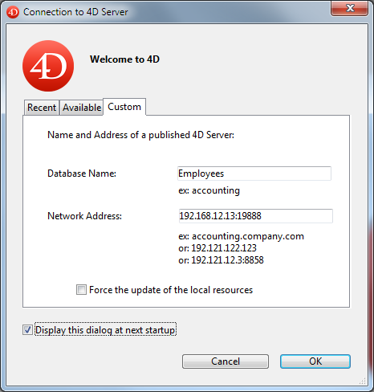

クライアント/サーバーページには、クライアント/サーバーモードでデータベースを使用する際に使用されるパラメーターが集められています。 これらの設定は、リモートモードでデータベースが使用されるときにのみ使用されます。

## ネットワークオプションページ

### ネットワーク

#### 起動時にデータベースを公開する

このオプションを使用して、起動された 4D Server データベースが公開データベースのリストに表示されるかどうかを指定できます。

- When this option is checked (default), the database is made public and appears in the list of published databases (**Available** tab).
- このオプションがチェックされていないと、データベースは公開されず、公開データベースの一覧に表示されません。 To connect, users must manually enter the address of the database on the **Custom** tab of the connection dialog box.

:::note

この設定を変更した場合、変更を反映するためサーバデータベースを再起動する必要があります。

:::

#### 公開名

This option lets you change the publication name of a 4D Server database, _i.e._, the name displayed on the dynamic **Available** tab of the connection dialog box (see the [Opening a remote project](../Desktop/clientServer/md#opening-a-remote-project) paragraph). デフォルトで 4D Server はプロジェクトファイル名を使用します。 これを好きな名前に変更できます。

:::note

このパラメーターはカスタムのクライアント-サーバーアプリケーションでは使用されません。 クライアントアプリケーションは接続ダイアログを経由せずにサーバーに直接接続します。 しかしエラーが発生すると、このダイアログが表示されます。この場合、サーバーアプリケーションの公開名はコンパイルされたプロジェクトの名前です。

:::

#### ポート番号

このオプションで、4D Server がデータベースを公開する TCPポート番号を変更できます。 この情報は、プロジェクト及び各クライアントマシンに格納されます。 4D Server とリモートモードの 4D が使用するデフォルトの TCPポート番号は 19813 です。

TCPプロトコルを使用して、1台のマシン上で複数の 4Dアプリケーションを同時に使用したい場合にこの値の変更が必要です。この場合、アプリケーションごとに異なるポート番号を割り当てなければなりません。
4D Server または 4D からこの値を変更すると、データベースに接続しているすべての 4Dマシンに変更が通知されます。

To update any other client machines that are not connected, you just need to enter the new port number (preceded by a colon) after the IP address of the server machine on the **Custom** tab of the connection dialog box at the time of the next connection. たとえば、新しいポート番号が 19888 あるとき:

> 4Dクライアントと同じポート番号で公開されているデータベースだけが、接続ダイアログの利用可能ページに表示されます。

#### 4D Server とポート番号

4D Server は 3つの TCPポートを使用して、内部サーバーとクライアントの通信をおこないます:

- **SQL Server**: 19812 by default (can be modified via the "SQL/Configuration" page of the Preferences).
- **Application Server**: 19813 by default (can be modified via the "Client-Server/Configuration" page of the Preferences, see above).
- **DB4D Server** (database server): 19814 by default . This port number cannot be modified directly but it always consists of the application server port number + 1.\
  When a 4D client connects to 4D Server, it uses the TCP port of the application server (19813 or the port indicated after the colon ':' in the IP address shown in the connection dialog box). Connection to other servers via their respective ports is then automatic; it is no longer necessary to specify them.\
  Note that in the case of access via a router or a firewall, the three TCP ports must be opened explicitly.

#### ドメインサーバーによるユーザーの認証

This option allows you to implement SSO (_Single Sign On_) capabilities in your 4D Server database on Windows. このオプションを有効にすると、4D はバックグラウンドで Windows ドメインサーバーの Active Directory に接続し、提供されている認証トークンを取得します。 This option is described in the [Single Sign On (SSO) on Windows](https://doc.4d.com/4Dv20R5/4D/20-R5/Single-Sign-On-SSO-on-Windows.300-6932709.en.html) section.

#### サービスプリンシパル名 (SPN)

Single Sign On (SSO) が有効になっている場合 (上述参照)、認証プロトコルにケルベロスを使用するには、このフィールドを設定する必要があります。 This option is described in the [Single Sign On (SSO) on Windows](https://doc.4d.com/4Dv20R5/4D/20-R5/Single-Sign-On-SSO-on-Windows.300-6932709.en.html) section.

#### ネットワークレイヤー

This drop-down box contains 3 network layer options to choose between: **legacy**, **ServerNet** and **QUIC** (only in project mode), which are used to handle communications between 4D Server and remote 4D machines (clients).

- **Legacy**: This former "legacy" network layer is still supported in order to ensure compatibility for databases created prior to v15. This network layer can also be enabled by programming using the [SET DATABASE PARAMETER](https://doc.4d.com/4Dv20/help/command/page642.html) command.
- **ServerNet** (by default): Enables the ServerNet network layer on the server (available since 4D v15).
- **QUIC** (available only in project mode): Enables the QUIC network layer on the server.

  **注**:

  - Selecting this option overrides the Use legacy network layer option in case it has been set using the [SET DATABASE PARAMETER](https://doc.4d.com/4Dv20/help/command/page642.html) command.
  - You can know if a 4D application is running with a QUIC network layer using the [Get application info](https://doc.4d.com/4Dv20/help/command/page1599.html) command.
  - QUIC は UDPプロトコルを使用するため、ネットワークのセキュリティ設定で UDP が許可されている必要があります。
  - アプリケーションサーバーと DB4Dサーバーの両方で、QUIC は自動的にポート19813 に接続します。
  - QUICレイヤーオプションを選択すると:
    - ドロップダウンメニューの隣に、ベータ版である旨のメッセージと警告アイコンが表示されます。
    - [Client-server Connections Timeout settings](#Client-Server-Connections-Timeout) are hidden
    - The [Encrypt Client-Server communication checkbox](#Encrypt-Client-Server-Communications) is hidden (QUIC communications are always in TLS, whatever your secured mode is.).
  - **Compatibility**: You need to deploy your client/server applications with 4D v20 or higher before switching to the QUIC network layer.

:::note

オプションを変更した場合、変更を反映するには 4Dアプリケーションを再起動する必要があります。 接続していたクライアントアプリケーションも、新しいネットワークレイヤーで接続するため再起動しなければなりません。

:::

#### クライアント/サーバー接続タイムアウト

このサーモメーターで、4D Server とクライアントマシン間の (一定時間活動がないときに接続を閉じる) タイムアウトを設定できます。 無制限オプションは、タイムアウトを設定しないことを意味します。 このオプションが選択されると、クライアントのアクティビティコントロールはおこなわれません。

タイムアウト時間が選択されると、その間にリクエストを受信しなかった場合、サーバーはそのクライアントとの接続を閉じます。

### クライアント-サーバー通信

#### Execute On Clientのために起動時にクライアント登録

このオプションが選択されていると、データベースに接続するすべての 4Dリモートマシン上でメソッドをリモート実行できます。 This mechanism is detailed in the section [Stored procedures on client machines](https://doc.4d.com/4Dv19/4D/19/Stored-procedures-on-client-machines.300-5422461.en.html).

#### クライアント-サーバー通信の暗号化

このオプションを使用して、サーバーマシンと 4Dリモートマシン間通信の保護モードを有効にできます。 This option is detailed in the [Encrypting Client/Server Connections](https://doc.4d.com/4Dv19/4D/19/Encrypting-ClientServer-Connections.300-5422465.en.html) section.

#### セッション中に "Resources" フォルダーを更新

This setting can be used to globally set the updating mode for the local instance of the **Resources** folder on the connected 4D machines when the **Resources** folder of the database is modified during the session (the **Resources** folder is automatically synchronized on the remote machine each time a session is opened). 3つの選択肢があります:

- **Never**: The local **Resources** folder is not updated during the session. サーバーから送信される通知は無視されます。 The local **Resources** folder may be updated manually using the **Update Local Resources** action menu command (see [Using the Resources explorer](https://doc.4d.com/4Dv19/4D/19/Using-the-Resources-explorer.300-5416788.en.html)).
- **Always**: The synchronization of the local **Resources** folder is automatically carried out during the session whenever notification is sent by the server.
- **Ask**: When the notification is sent by the server, a dialog box is displayed on the client machines, indicating the modification. The user can then accept or refuse the synchronization of the local **Resources** folder.\
  The **Resources** folder centralizes the custom files required for the database interface (translation files, pictures, etc.). このフォルダーの内容が更新されたときには、自動又は手動メカニズムを使用して各クライアントに通知できます。 For more information, please refer to the [Managing the Resources folder](https://doc.4d.com/4Dv19/4D/19/Managing-the-Resources-folder.300-5422466.en.html) section.

## IP設定ページ

### 許可-拒否設定表

この表を使用して、4Dリモートマシンの IPアドレスに基づき、データベースへのアクセスコントロールルールを設定できます。 このオプションを使用して、たとえば戦略アプリケーションなどのセキュリティを高めることができます。

> Web接続は、この設定表でコントロールされません。

設定表の動作は以下のとおりです:

- "許可-拒否" 列では、ポップアップメニューを使用して適用するルールを選択します (許可または拒否)。 ルールを追加するには、追加ボタンをクリックします。 すると、新しい行が表に追加されます。 The **Delete** button lets you remove the current row.
- "IPアドレス" 列で、ルールに関連する IPアドレスを指定します。 アドレスを指定するには、選択した行のセルをクリックし、以下の形式でアドレスを入力します: 123.45.67.89 (IPv4) または 2001:0DB8:0000:85A3:0000:0000:AC1F:8001 (IPv6)。 \* (アスタリスク) 文字をアドレスの末尾に使用して、範囲を指定することもできます。 たとえば、192.168.\* は 192.168 で始まるすべてのアドレスを示します。
- ルールの適用は、表中の表示順に基づきます。 2つのルールが矛盾する設定の場合、より上に設定されているルールが優先されます。 行の順番を変更するには、列のヘッダーをクリックしてソートをおこなったり、 ドラッグ＆ドロップで移動したりすることができます。
- セキュリティのため、ルールにより明示的に許可されたアドレスのみが接続を許可されます。 言い換えれば、表に拒否ルールしか定義されていない場合、許可ルールに適合するアドレスがないため、すべてのアドレスからの接続が拒否されます。 特定のアドレスからの接続のみを拒否したい場合 (そして他を許可したい場合)、許可 \* ルールを表の最後に追加します。 例:
  - 拒否 192.168.\* (192.168 で始まるアドレスを拒否)
  - 許可 \* (他のアドレスはすべて許可)

デフォルトでは、4D Server にアクセス制限はありません。最初の行には \* (すべてのアドレス) に対する許可ルールが設定されています。
