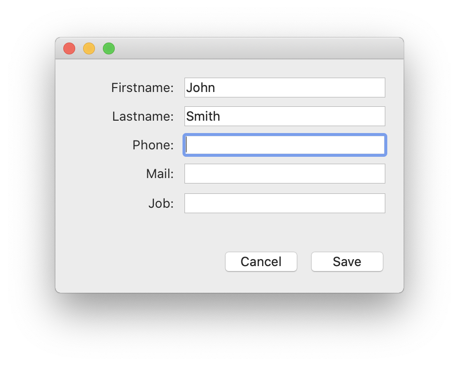
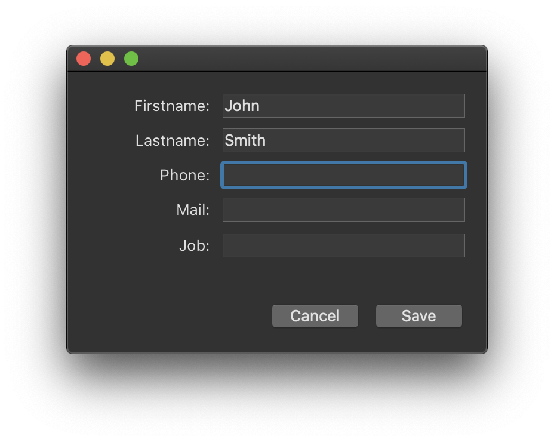

インターフェースページでは、プロジェクトインターフェースに関するさまざまな設定をおこないます。

## 一般

このエリアでは、表示に関する様々なオプションを設定します。

### MESSAGEコマンドで使用されるフォント

Click **Select...** to set the font and size for the characters used by the `MESSAGE` command.

4D が実行されているプラットフォームによって、デフォルトのフォントとサイズは異なります。

> This property also affects the following parts of 4D: <li>certain preview areas of the Explorer</li><li>the ruler of the Form editor</li>

### ウィンドウの表示

他のオプションでは、アプリケーションモードでのさまざまなウィンドウの表示を設定します。

- **Splash screen**: When this option is deselected, the [splash screen of the current menu bar](Menus/bars.md#splash-screen) does not appear in the Application mode. When you hide this window, it is up to you to manage the display of all your windows by programming, for example in the `On Startup` database method.

- **Flushing progress**: When this option is checked, 4D displays a window at the bottom left of the screen while the data in the cache is flushed. この処理はユーザー操作を一時的にブロックするため、ウィンドウを表示することでフラッシュがおこなわれていることをユーザーに通知することができます。

:::note

You can set the [frequency for cache flushing](database.md#memory-page) in **Settings** > **Database** > **Memory**.

:::

- **Printing progress**: Lets you enable or disable the display of the printing progress dialog box when printing.

- **Use SDI mode on Windows**: When this option checked, 4D enables automatically the [SDI mode (Single-Document Interface)](../Menus/sdi.md) in your application when executed in a [supported context](../Menus/sdi.md#sdi-mode-availability). When you select this option, on Windows the **Run** menu of the 4D menu bar allows you to select the mode in which you want to test the application:

  

:::note

このオプションは macOS でも有効にできますが、同プラットフォーム上で実行の際には無視されます。

:::

### アピアランス

このメニューで、メインアプリケーションレベルにおいて使用するカラースキームを選択します。 カラースキームは、フォーム内で使用されるテキスト、背景、ウィンドウなどのインターフェースカラーのグローバルなセットを定義します。

> このオプションは macOS でのみ使用できます。 Windows上では、"Light" テーマが常に使用されます。

以下のスキームが利用可能です:

- **Light**: the application will use the Default Light Theme
  
- **Dark**: the application will use the Default Dark Theme
  
- **Inherited** (default): the application will inherit from the higher priority level (i.e., OS user preferences)

> デフォルトのテーマは CSS で管理可能です。 For more information, please refer to the [Media Queries](../FormEditor/createStylesheet.md#media-queries) section.

メインアプリケーションスキームはデフォルトでフォームに適用されます。 その一方で、それを以下の方法で上書きすることもできます:

- by the [SET APPLICATION COLOR SCHEME](https://doc.4d.com/4dv19R/help/command/en/page1762.html) command at the working session level;
- using by the [Color Scheme](../FormEditor/propertiesForm.html#color-scheme) form property at each form level (highest priority level). **Note:** When printed, forms always use the "Light" scheme.

## ショートカット

ショートカットエリアでは、4D のデスクトップアプリケーションにおける 3つの基本のフォーム操作に使うデフォルトショートカットを確認し、変更することができます。 これらのショートカットは両プラットフォームで同じです。 キーの形をしたアイコンは、Windows と macOS の対応するキーの組み合わせを示します。

デフォルトのショートカットは以下のとおりです:

- Accept input form: **Enter**
- Cancel input form: **Esc**
- Add to subform: **Ctrl+Shift+/** (Windows) or **Command+Shift+/** (macOS)

To change the shortcut of an operation, click the corresponding **Edit** button. 以下のダイアログボックスが表示されます:

To change the shortcut, type the new key combination on your keyboard and click **OK**. If you prefer not to have a shortcut for an operation, click **Clear**.
