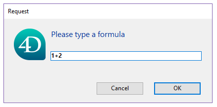

**`4D.Function`** オブジェクトにはコードが格納されています。 このコードは `()` 演算子を使用して、または [`apply()`](#apply) や [`call()`](#call) 関数を使用して呼び出すことができます。 4D では 3種類の `Function` オブジェクトが利用できます:

- **ネイティブ関数** (`collection.sort()` や `file.copyTo()` などの 4Dクラスにビルトインされた関数)。
- **ユーザー関数** (ユーザー[クラス](Concepts/classes.md) において [Function キーワード](Concepts/classes.md#function)を使って作成されたもの)。
- **フォーミュラ関数** (4Dフォーミュラを実行するもの)。

### フォーミュラオブジェクト

[Formula](#formula) あるいは [Formula from string](#formula-from-string) コマンドを使用すると、[`4D.Function`オブジェクト](#4dfunction-オブジェクトについて) を作成することができ、それによってあらゆる 4D式やテキストとして表されたコードを実行することが可能です。

Formulaオブジェクトは、オブジェクトプロパティに格納することができます。

```4d
 var $f : 4D.Function
 $f:=New object
 $f.message:=Formula(ALERT("Hello world"))
```

このようなプロパティは "オブジェクト関数"、つまり親オブジェクトに紐づいた関数です。 オブジェクトプロパティに保存されている関数を実行するには、プロパティ名のあとに **()** をつけます:

```4d
 $f.message() // "Hello world" を表示します
```

大カッコを使用したシンタックスもサポートされます:

```4d
 $f["message"]() // "Hello world" と表示します
```

たとえ引数を受け取らなかったとしても (後述参照)、オブジェクト関数を実行するためにはカッコ ( ) をつけて呼び出す必要があるという点に注意してください。 オブジェクトプロパティのみを呼び出した場合、フォーミュラへの新しい参照が返されます (そしてフォーミュラは実行はされません):

```4d
 $o:=$f.message // $o にはフォーミュラオブジェクトが返されます
```

[`apply()`](#apply) および [`call()`](#call) 関数を使って関数を実行することもできます:

```4d
 $f.message.apply() // "Hello world!" を表示します
```

#### 引数の受け渡し

フォーミュラには、[順番引数シンタックス](Concepts/parameters.md#順番引数) $1, $2...$n を使用して引数を渡すことができます。 たとえば:

```4d
 var $f : Object
 $f:=New object
 $f.message:=Formula(ALERT("Hello "+$1))
 $f.message("John") // "Hello John" を表示します
```

あるいは、[.call()](#call) 関数を使用して:

```4d
 var $f : Object
 $f:=Formula($1+" "+$2)
 $text:=$f.call(Null;"Hello";"World") // "Hello World" を返します
 $text:=$f.call(Null;"Welcome to";String(Year of(Current date))) // "Welcome to 2019" (例) を返します
```

#### 単一メソッド用の引数

利便性のために、フォーミュラが単一のプロジェクトメソッドから作成された場合には、引数はフォーミュラオブジェクトの初期化では省略することができます。 省略された引数は、フォーミュラを呼び出す時に一緒に渡すことができます。 例:

```4d
 var $f : 4D.Function

 $f:=Formula(myMethod)
  // ここで Formula(myMethod($1;$2) と書く必要はありません
 $text:=$f.call(Null;"Hello";"World") // "Hello World" を返します
 $text:=$f.call() // "How are you?" を返します

  // myMethod
 #DECLARE ($param1 : Text; $param2 : Text)->$return : Text
 If(Count parameters=2)
    $return:=$param1+" "+$param2
 Else
    $return:="How are you?"
 End if
```

引数はメソッド内において、呼び出し時に指定した順で受け取られます。

### 概要

|                                                                                                              |
| ------------------------------------------------------------------------------------------------------------ |
| [<!-- INCLUDE #FunctionClass.apply().Syntax -->](#apply)<br/><!-- INCLUDE #FunctionClass.apply().Summary --> |
| [<!-- INCLUDE #FunctionClass.call().Syntax -->](#call)<br/><!-- INCLUDE #FunctionClass.call().Summary -->    |
| [<!-- INCLUDE #FunctionClass.source.Syntax -->](#source)<br/><!-- INCLUDE #FunctionClass.source.Summary -->  |

## Formula

<details><summary>履歴</summary>

| リリース  | 内容                                               |
| ----- | ------------------------------------------------ |
| 17 R6 | 名称変更 (New formula -> Formula) |
| 17 R3 | 追加                                               |

</details>

<!-- REF #_command_.Formula.Syntax -->**Formula** ( *formulaExp* : Expression ) : 4D.Function<!-- END REF -->

<!-- REF #_command_.Formula.Params -->

| 引数         | 型                           |                             | 説明                                  |
| ---------- | --------------------------- | :-------------------------: | ----------------------------------- |
| formulaExp | 式                           |              ->             | オブジェクトとして返されるフォーミュラ                 |
| 戻り値        | 4D.Function | <- | フォーミュラを格納しているネイティブな Function オブジェクト |

<!-- END REF -->

#### 説明

`Formula` コマンドは、<!-- REF #_command_.Formula.Summary -->*formulaExp* の式に基づいた `4D Function` オブジェクトを作成します<!-- END REF -->。 *formulaExp* には単一の値のようにシンプルなものから、引数を持つプロジェクトメソッドのように複雑なものまで指定することができます。

フォーミュラがオブジェクトとして存在することで、コマンドやメソッドに対して引数 (計算された属性) として渡したり、"コンポーネントとホストデータベース間で共有" として宣言せずとも様々なコンポーネントから実行したりできるようになります。 呼び出されたフォーミュラオブジェクトは、それを作成したデータベースあるいはコンポーネントのコンテキストにおいて評価されます。

返されたフォーミュラは以下の方法で呼び出すことが可能です:

- [`.call()`](#call) あるいは [`.apply()`](#apply) 関数
- オブジェクト記法シンタックス ([Formula オブジェクト](#formula-オブジェクト) 参照)

```4d
 var $f : 4D.Function
 $f:=Formula(1+2)
 $o:=New object("myFormula";$f)

  // フォーミュラを呼び出す 3つの方法
 $f.call($o) // 3 を返します
 $f.apply($o) // 3 を返します
 $o.myFormula() // 3 を返します
```

フォーミュラには [引数](#引数の受け渡し) を渡すことができます ([例題4](#例題-4) 参照)。

フォーミュラの実行対象となるオブジェクトを指定することができます ([例題5](#例題-5) 参照)。 このオブジェクトのプロパティは、`This` コマンドでアクセス可能です。

*formulaExp* がローカル変数を使用する場合、返されるフォーミュラオブジェクトの作成時にその値がそこにコピーされ保存されます。 実行時、フォーミュラはそのローカル変数の現在値ではなく、コピーされた値を使用します。 ローカル変数として配列を使用することはサポートされていない点に注意してください。

`Formula` によって作成されたオブジェクトは、たとえばデータベースのフィールドや Blob ドキュメントなどに保存可能です。

#### 例題 1

単純なフォーミュラの例:

```4d
 var $f : 4D.Function
 $f:=Formula(1+2)

 var $o : Object
 $o:=New object("f";$f)

 $result:=$o.f() // 3 を返します
```

#### 例題 2

ローカル変数を使用するフォーミュラの例:

```4d


 $value:=10
 $o:=New object("f";Formula($value))
 $value:=20

 $result:=$o.f() // 10 を返します
```

#### 例題 3

引数を用いたシンプルなフォーミュラの例:

```4d
 $o:=New object("f";Formula($1+$2))
 $result:=$o.f(10;20) // 30 を返します
```

#### 例題 4

引数を用いたプロジェクトメソッドを使用する例:

```4d
 $o:=New object("f";Formula(myMethod))
 $result:=$o.f("param1";"param2") // $result:=myMethod("param1";"param2") と同等です
```

#### 例題 5

`This` を使用する例:

```4d
 $o:=New object("fullName";Formula(This.firstName+" "+This.lastName))
 $o.firstName:="John"
 $o.lastName:="Smith"
 $result:=$o.fullName() // "John Smith" を返します
```

#### 例題 6

オブジェクト記法を使用してフォーミュラを呼び出す例:

```4d
 var $feta; $robot : Object
 var $calc : 4D.Function
 $robot:=New object("name";"Robot";"price";543;"quantity";2)
 $feta:=New object("name";"Feta";"price";12.5;"quantity";5)

 $calc:=Formula(This.total:=This.price*This.quantity)

  // フォーミュラをオブジェクトプロパティに設定します
 $feta.calc:=$calc
 $robot.calc:=$calc

  // フォーミュラを呼び出します
 $feta.calc() // $feta={name:Feta,price:12.5,quantity:5,total:62.5,calc:"[object Formula]"}
 $robot.calc() // $robot={name:Robot,price:543,quantity:2,total:1086,calc:"[object Formula]"}
```

## Formula from string

<details><summary>履歴</summary>

| リリース  | 内容                                                                       |
| ----- | ------------------------------------------------------------------------ |
| 20 R3 | *context* パラメーターをサポート                                                    |
| 17 R6 | 名称変更 (New formula from string -> Formula from string) |
| 17 R3 | 追加                                                                       |

</details>

<!-- REF #_command_.Formula from string.Syntax -->**Formula from string**( *formulaString* : Text ) : 4D.Function<br/>**Formula from string**( *formulaString* : Text ; *context* : Longint ) : 4D.Function<!-- END REF -->

<!-- REF #_command_.Formula from string.Params -->

| 引数            | 型                           |                             | 説明                                                                                            |
| ------------- | --------------------------- | :-------------------------: | --------------------------------------------------------------------------------------------- |
| formulaString | Text                        |              ->             | オブジェクトとして返されるフォーミュラ文字列                                                                        |
| context       | Number                      |              ->             | `sk execute in current database` (デフォルト) または `sk execute in host database` |
| 戻り値           | 4D.Function | <- | フォーミュラを格納しているネイティブなオブジェクト                                                                     |

<!-- END REF -->

#### 説明

`Formula from string` コマンドは、<!-- REF #_command_.Formula from string.Summary -->*formulaString* と任意の *context* 引数に基づいた `4D.Function` オブジェクトを作成します<!-- END REF -->。  *formulaString* には単一の値のようにシンプルなものから、引数を持つプロジェクトメソッドのように複雑なものまで指定することができます。

このコマンドは [`Formula`](#formula) に似ていますが、テキストに基づいたフォーミュラを扱う点と、実行コンテキストを定義できる点が異なります。 元となるフォーミュラがテキストとして表現されている場合 (例: 外部の JSON ファイルに保存されていた場合など)、または、コンポーネントから `Formula from string` を呼び出してホストデータベースにフォーミュラを作成したい場合を除いて、通常は `Formula` コマンドの使用が推奨されます。 なお、このコマンドでは、トークンを使ったシンタックスの使用が強く推奨されます。

> ローカル変数の中身はコンパイル済みモードでは名前によるアクセスが不可能なため、*formulaString* 引数内で使用することはできません。 `Formula from string` コマンドを使用してローカル変数にアクセスを試みた場合、エラー(-10737) が生成されます。

フォーミュラがコンポーネント内で作成されている場合、 *context* 引数を使うことができます。 デフォルトでは、フォーミュラは作成されたコンテキストにおいて実行されるため、ホストデータベースの変数や関数、共有されていないメソッドを呼び出すことはできません。 この場合、`sk execute in host database` 定数を *context* パラメーターに渡すことで、ホストデータベースのコンテキストで `4D.Function` オブジェクトを実行することができます。 以下の定数を使用することができます:

| 定数                               | 型       | 説明                                                       |
| -------------------------------- | ------- | -------------------------------------------------------- |
| `sk execute in current database` | Integer | (デフォルト) フォーミュラは作成されたコンテキストにおいて実行されます。 |
| `sk execute in host database`    | Integer | フォーミュラは、ホストデータベースのコンテキストで実行されます。                         |

#### 例題

以下のコードは、テキストフォーマットのフォーミュラを受け入れるダイアログを作成し、:

```4d
 var $textFormula : Text
 var $f : 4D.Function
 $textFormula:=Request("Please type a formula")
 If(ok=1)
    $f:=Formula from string($textFormula)
    ALERT("Result = "+String($f.call()))
 End if
```



そのフォーミュラを実行します:


<!-- REF FunctionClass.apply().Desc -->

## .apply()

<details><summary>履歴</summary>

| リリース  | 内容 |
| ----- | -- |
| 17 R3 | 追加 |

</details>

<!-- REF #FunctionClass.apply().Syntax -->**.apply**() : any<br/>**.apply**( *thisObj* : Object { ; *formulaParams* : Collection } ) : any<!-- END REF -->

<!-- REF #FunctionClass.apply().Params -->

| 引数            | 型          |                             | 説明                                                                                     |
| ------------- | ---------- | :-------------------------: | -------------------------------------------------------------------------------------- |
| thisObj       | Object     |              ->             | フォーミュラ内で This コマンドによって返されるオブジェクト                                                       |
| formulaParams | Collection |              ->             | フォーミュラが実行される際に $1...$n として渡される値のコレクション |
| 戻り値           | any        | <- | フォーミュラの実行結果                                                                            |

<!-- END REF -->

#### 説明

`.apply()` 関数は、<!-- REF #FunctionClass.apply().Summary -->対象の `Formula` オブジェクトを実行し、その結果の値を返します<!-- END REF -->。 `Formula` あるいは `Formula from string` コマンドで作成されたフォーミュラが使用可能です。

*thisObj* には、フォーミュラ内で `This` として使用されるオブジェクトへの参照を渡すことができます。

任意の *formulaParams* 引数を渡すことで、フォーミュラ内で $1...$n の引数として使用されるコレクションを渡すこともできます。

`.apply()` は [`.call()`](#call) と似ていますが、引数をコレクションとして渡す点が異なります。 これは計算された結果を渡すのに便利です。

#### 例題 1

```4d
 var $f : 4D.Function
 $f:=Formula($1+$2+$3)

 $c:=New collection(10;20;30)
 $result:=$f.apply(Null;$c) // 60 を返します
```

#### 例題 2

```4d
 var $calc : 4D.Function
 var $feta; $robot : Object
 $robot:=New object("name";"Robot";"price";543;"quantity";2)
 $feta:=New object("name";"Feta";"price";12.5;"quantity";5)

 $calc:=Formula(This.total:=This.price*This.quantity)

 $calc.apply($feta) // $feta={name:Feta,price:12.5,quantity:5,total:62.5}
 $calc.apply($robot) // $robot={name:Robot,price:543,quantity:2,total:1086}
```

<!-- END REF -->

<!-- REF FunctionClass.call().Desc -->

## .call()

<details><summary>履歴</summary>

| リリース  | 内容 |
| ----- | -- |
| 17 R3 | 追加 |

</details>

<!-- REF #FunctionClass.call().Syntax -->**.call**() : any<br/>**.call**( *thisObj* : Object { ; ...*params* : any } ) : any<!-- END REF -->

<!-- REF #FunctionClass.call().Params -->

| 引数      | 型      |                             | 説明                                                                              |
| ------- | ------ | --------------------------- | ------------------------------------------------------------------------------- |
| thisObj | Object | ->                          | フォーミュラ内で This コマンドによって返されるオブジェクト                                                |
| params  | any    | ->                          | フォーミュラが実行される際に $1...$n として渡される値 |
| 戻り値     | any    | <- | フォーミュラの実行結果                                                                     |

<!-- END REF -->

#### 説明

`.call()` 関数は、<!-- REF #FunctionClass.call().Summary -->対象の `Formula` オブジェクトを実行し、その結果の値を返します<!-- END REF -->。 `Formula` あるいは `Formula from string` コマンドで作成されたフォーミュラが使用可能です。

*thisObj* には、フォーミュラ内で `This` として使用されるオブジェクトへの参照を渡すことができます。

任意の *params* 引数を渡すことで、フォーミュラ内で *$1...$n* の引数として使用される値を渡すこともできます。

`.call()` は [`.apply()`](#apply) と似ていますが、引数を直接渡す点が異なります。

#### 例題 1

```4d
 var $f : 4D.Function
 $f:=Formula(Uppercase($1))
 $result:=$f.call(Null;"hello") // "HELLO" を返します
```

#### 例題 2

```4d
 $o:=New object("value";50)
 $f:=Formula(This.value*2)
 $result:=$f.call($o) // 100 を返します
```

<!-- END REF -->

<!-- REF FunctionClass.source.Desc -->

## .source

<details><summary>履歴</summary>

| リリース  | 内容 |
| ----- | -- |
| 18 R2 | 追加 |

</details>

<!-- REF #FunctionClass.source.Syntax -->**.source** : Text <!-- END REF -->

#### 説明

`.source` プロパティは、<!-- REF #FunctionClass.source.Summary -->対象フォーミュラのテキスト型のソース式<!-- END REF -->を格納します。

このプロパティは **読み取り専用** です。

#### 例題

```4d
 var $of : 4D.Function
 var $tf : Text
 $of:=Formula(String(Current time;HH MM AM PM))
 $tf:=$of.source //"String(Current time;HH MM AM PM)"
```

<!-- END REF -->
