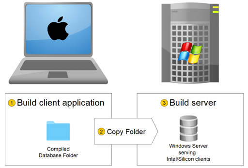
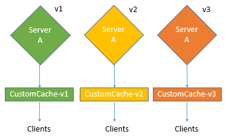

4D にはプロジェクトパッケージ (ファイナルビルド) を作成するためのアプリケーションビルダーが統合されています。 このビルダーを使用すれば、コンパイルされた 4D アプリケーションの展開を簡易化することができます。 OS ごとに異なる特定の処理を自動で処理し、クライアント/サーバーアプリケーションの展開が容易になります。

アプリケーションビルダーでは以下のことを行えます:

- インタープリターコードを含まない、コンパイル済みストラクチャーまたはコンポーネントのビルド
- ダブルクリックで起動可能なスタンドアロンアプリケーションのビルド (4D のデータベースエンジンである 4D Volume Desktop を組み込んだ 4D アプリケーション)
- XML形式のプロジェクトファイル定義を用いて、同じコンパイル済みストラクチャーから異なるアプリケーションのビルド
- クライアント/サーバーアプリケーションのビルド
- クライアントとサーバーの自動更新機能を備えたクライアント/サーバーアプリケーションのビルド
- ビルド設定の保存 (*設定保存* ボタン)

> コンパイル済みアプリケーションは、**読み取り専用** である [.4dz files](#コンパイル済みストラクチャーをビルド) ファイルに基づきます。 コンパイル済みアプリケーションの場合、ソースファイルを変更するコマンドや関数 (`CREATE INDEX` や `CREATE TABLE` (SQL)) は、デフォルトでは使用できないことに留意が必要です。 しかしながら、`PackProject` XML キー ([doc.4d.com](https://doc.4d.com) 参照) を使用することで、ローカルな変更をサポートするアプリケーションをビルドすることも可能です。

## 概要

プロジェクトパッケージをビルドするには次の方法があります:

- [`BUILD APPLICATION`](https://doc.4d.com/4dv20/help/command/ja/page871.html) コマンドを使う
- [アプリケーションビルド](#application-builder) ダイアログを使う

:::tip

また、ヘッドレスアプリケーションからでも、4Dプロジェクトのコンパイル、ビルド、署名をおこなうためのクラスを提供するコンポーネント、[`Build4D`](https://github.com/4d-depot/Build4D) をダウンロードして使用することができます。

:::

### アプリケーションビルド

このウィンドウを開くには 4D の **デザイン**メニューから **アプリケーションビルド...** を選択します。


アプリケーションビルドウィンドウには複数のページがあり、タブを使用してページを移動できます:


ビルドをおこなう前にプロジェクトはコンパイルされていなければなりません。 まだコンパイルされていないプロジェクトでこのメニューコマンドを選択する、あるいはコンパイル後にコードが変更されていると、プロジェクトを (再) コンパイルしなければならない旨の警告ダイアログが表示されます。

### buildApp.4DSettings

アプリケーションビルドに関わる各パラメーター設定は XML キーの形で、`buildApp.4DSettings` という名称のアプリケーションプロジェクトファイルに保存されます。 この XML ファイルはプロジェクトの [`Settings` フォルダー](../Project/architecture.md#settings-1) に配置されます。

アプリケーションビルドダイアログが初めて表示されるときにはデフォルトパラメーターが使用されます。 **ビルド** ボタンや **設定保存** ボタンをクリックすると、このプロジェクトファイルの内容が更新されます。 同じデータベースについて内容の異なる複数の XML ファイルを定義し、[BUILD APPLICATION](https://doc.4d.com/4Dv19/4D/19/BUILD-APPLICATION.301-5392523.ja.html) コマンドでそれらを使い分けることができます。

また、XML キーを使用すれば、アプリケーションビルドダイアログには表示されない追加の設定をおこなうことができます。 詳細はドキュメント [アプリケーションビルド設定ファイル](https://doc.4d.com/4Dv19/4D/19/4D-XML-Keys-BuildApplication.100-5447429.ja.html) を参照ください。

### ログファイル

アプリケーションをビルドすると、4D はログファイル (*BuildApp.log.xml*) を生成して、プロジェクトの **Logs** フォルダーに保存します。 ログファイルにはビルド毎に以下の情報が書き込まれます:

- ターゲットビルドの開始と終了
- 生成されたファイルの名称とフルパス
- ビルドの日付と時刻
- 発生したエラー
- 署名の問題 (例: 署名されていないプラグイン)

アプリケーションを公証する場合などは、このファイルを確認することで、後の運用手順で時間を節約できることがあります。

> `Get 4D file(Build application log file)` コマンドを使って、ログファイルの場所を取得します。

## アプリケーション名と保存先フォルダー


**アプリケーション名** には生成するアプリケーションの名前を入力します。

**保存先フォルダー** にはビルドされるアプリケーションの保存先を指定します。 指定したフォルダーが存在しない場合は新たに作成します。

## コンパイル済みストラクチャーページ

このページでは、標準のコンパイル済みストラクチャーファイルやコンパイル済みコンポーネントをビルドできます。


### コンパイル済みストラクチャーをビルド

インタープリターコードを含まないアプリケーションをビルドします。

これにより、`Compiled Database/<project name>` フォルダーの中に *.4dz* ファイルが作成されます。 たとえば、アプリケーション名を "MyProject" にした場合、4D は次のものを作成します:

`<destination>/Compiled Database/MyProject/MyProject.4dz`

.4dz ファイルは ZIP 圧縮されたプロジェクトフォルダーです (<strong>注:</strong> バイナリデータベースの場合に生成される .4DC ファイルと同義ではないことに注意が必要です)。 .4dz ファイルを開けるのは 4D Server、4D Volume ライセンス (組み込みアプリケーション)、および 4D です。 圧縮・最適化された .4dz ファイルによってプロジェクトパッケージの展開が容易になります。

> .4dz ファイルを生成する際、4D はデフォルトで **標準的な** zip形式を使用します。 このフォーマットの利点は、あらゆる解凍ツールで簡単に読み取ることができることです。 この標準形式を使用したくない場合は、値を `False` に設定した `UseStandardZipFormat` XMLキーを [buildApp.4DSettings](#アプリケーションビルド設定) ファイルに追加します (詳細については、[アプリケーションビルド設定ファイル](https://doc.4d.com/4Dv19/4D/19/4D-XML-Keys-BuildApplication.100-5447429.ja.html) マニュアルを参照ください)。

#### 関連するフォルダーを含む

このオプションを選択すると、プロジェクトに関連するフォルダーが、Build フォルダーの *Components* および *Resources* フォルダーにコピーされます。 これらのフォルダーの詳細については [プロジェクトアーキテクチャーの説明](Project/architecture.md) を参照ください。

### コンポーネントをビルド

ストラクチャーからコンパイル済みコンポーネントをビルドします。

[コンポーネント](../Extensions/develop-components.md) は特定の機能を実装した標準の 4D プロジェクトです。 ビルドされたコンポーネントを [他の 4Dプロジェクト (ホストアプリケーションプロジェクト) にインストール](../Project/components.md#basics) すると、ホストプロジェクトはその機能を利用できるようになります。

アプリケーション名を *MyComponent* に指定した場合、4D は *Components* フォルダーを作成し、その中に *MyComponent.4dbase* フォルダーを生成します:

`<destination>/Components/MyComponent.4dbase/MyComponent.4DZ`

*MyComponent.4dbase* フォルダーには次のファイルが含まれます:

- *MyComponent.4DZ* ファイル
- *Resources* フォルダー: 関連リソースは自動的にこのフォルダーにコピーされます。 コンポーネントは、他のコンポーネントやプラグインを使用できないため、その他の "Components" や "Plugins" フォルダーはコピーされません。

*MyComponent.4dbase*フォルダーは、[コンパイルされたコンポーネントのパッケージフォルダー](../Project/components.md) です。

## アプリケーションページ

このタブでは、スタンドアロンのシングルユーザー版アプリケーションをビルドします:


### スタンドアロンアプリケーションをビルド

Checking the **Build stand-alone Application** option and clicking **Build** will create a stand-alone (double-clickable) application directly from your application project.

ビルドには次のものが必要です:

- 4D Volume Desktop (4Dデータベースエンジン)
- 適切な [ライセンス](#licenses)

Windows においては、.exe 拡張子のついた実行ファイルが作成されます。 macOS においては、ソフトウェアパッケージが作成されます。

この処理はコンパイル済みストラクチャーファイルと4D Volume Desktopを統合します。 4D Volume Desktop が提供する機能はライセンスページで指定するライセンス情報に基づきます。 この点についての詳細な情報は、4D の [オンラインストア](https://store.4d.com/jp/) と、セールスドキュメンテーションを参照してください。

デフォルトのデータファイルを定義することも、ユーザーに [独自のデータファイルを作成して使用](#データファイルの管理") してもらうこともできます。

いくつかのランゲージコマンドを特定の順番で使用することによって、[シングルユーザー向け組み込みアプリケーションのアップデートを自動化](#サーバーまたはシングルユーザーアプリケーションの自動更新) することが可能です。

#### 4D Volume Desktopの場所

ダブルクリックで起動されるアプリケーションをビルドするには、まず 4D Volume Desktop が格納されているフォルダーの場所を指定しなければなりません:

- *Windows* では: 4D Volume Desktop.4DE や 4D Volume Desktop.RSR、その他動作に必要なファイルやフォルダーを含むフォルダーを選択します。 これらは、選択されたフォルダー内で同じ階層に置かれている必要があります。
- *macOS* では: ソフトウェアパッケージとして 4D Volume Desktop が提供されているので、このパッケージを選択します。

4D Volume Desktop フォルダーを選択するには **[...]** ボタンをクリックします。 フォルダーを選択するダイアログが表示されたら、4D Volume Desktop フォルダー (Windows) またはパッケージ (macOS) を選択します。

フォルダーが選択されるとその完全パス名が表示され、そこに 4D Volume Desktop が含まれていればビルドボタンが有効になります。

> 4D Volume Desktop のバージョン番号は、4D Developer のバージョン番号と合致する必要があります。 たとえば、4D Developer の v18 を利用していれば、4D Volume Desktop v18 が必要です。

#### データリンクモードの基準

このオプションを使って、組み込みアプリケーションとローカルデータファイルとのリンクモードを選択します。 二種類のリンクモードから選択可能です:

- **アプリケーション名** (デフォルト) - このモードでは、4D アプリケーションはストラクチャーファイルに対応する、最後に開かれたデータファイルを開きます。 このモードではアプリケーションパッケージをディスク上で自由に移動させることができます。 アプリケーションを複製する場合を除いて、通常は組み込みアプリに対してこのモードが使用されるべきです。

- **アプリケーションパス** - このモードでは、組み込み 4D アプリケーションは自身に紐づいている *lastDataPath.xml* ファイルを解析して、起動アプリのフルパスに合致する "executablePath" 属性を持つデータパスマップのエントリーを探し、 同エントリー内で "dataFilePath" 属性で定義されているデータファイルを開きます。 ない場合は、最後に開かれたデータファイルを開きます (デフォルトモード)。

データリンクモードについての詳細は [最後に開かれたデータファイル](#最後に開かれたデータファイル) を参照してください。

#### 生成されるファイル

**ビルド** ボタンをクリックすると、4D は **保存先フォルダー** に **Final Application** フォルダーを作成し、 その中に指定したアプリケーション名のサブフォルダーを作成します。

アプリケーション名に "MyProject"と指定した場合、MyProject サブフォルダー内には以下のファイルが置かれます:

- *Windows*
  - MyProject.exe - 実行可能ファイル、そして MyProject.rsr (アプリケーションリソースファイル)
  - 4D Extensions および Resources フォルダー、さまざまなライブラリ (DLL)、 Native Components フォルダー、SASL Plugins フォルダーなど、アプリケーション実行に必要なファイル
  - Databaseフォルダー: Resources フォルダーと MyProject.4DZ ファイルが格納されています。 これらはプロジェクトのコンパイル済みストラクチャーおよびプロジェクトの Resources フォルダーです。
    **注**: このフォルダーには、定義されていれば *Default Data* フォルダーも含まれています ([最終アプリケーションでのデータファイルの管理](#データファイルの管理)を参照してください)。
  - (オプション) データベースに含まれるコンポーネントやプラグインが配置された Components フォルダーおよび Plugins フォルダー。 この点に関する詳細は [プラグイン＆コンポーネントページ](#プラグイン＆コンポーネントページ) を参照してください。
  - Licenses フォルダー - アプリケーションに統合されたライセンス番号の XML ファイルが含まれます。 この点に関する詳細は [ライセンス＆証明書ページ](#ライセンス＆証明書ページ) を参照してください。
  - 4D Volume Desktop フォルダーに追加されたその他の項目 (あれば) ([4D Volume Desktop フォルダーのカスタマイズ](#4d-volume-desktop-フォルダーのカスタマイズ) 参照)

実行ファイルの動作には、これらすべての項目が同じフォルダー内に必要です。

- *macOS*
  - MyProject.app という名称のソフトウェアパッケージに、プラグインやコンポーネント、ライセンスなど必要な項目がすべて格納されます。 プラグインやコンポーネントの統合に関する詳細は [プラグイン＆コンポーネントページ](#プラグイン＆コンポーネントページ) を参照してください。 ライセンスの統合に関しては [ライセンス＆証明書ページ](#ライセンス＆証明書ページ) を参照してください。 **注**: macOSでは、4D ランゲージの [Application file](https://doc.4d.com/4Dv18R4/4D/18-R4/Application-file.301-4982855.ja.html) コマンドが返すのは、ソフトウェアパッケージ内の "Contents:macOS" フォルダー内にコピーされる ApplicationName ファイルのパス名です (ソフトウェアパッケージの "Contents:Resources" フォルダー内の .comp ファイルのパスではありません)。

#### 4D Volume Desktop フォルダーのカスタマイズ

ダブルクリックで起動可能なアプリケーションをビルドする際、4D は 4D Volume Desktop フォルダーの内容を *Final Application* 内のアプリケーション名サブフォルダーにコピーします。 必要に応じて、このコピー元である 4D Volume Desktop フォルダーの内容をカスタマイズすることできます。 たとえば:

- 特定の言語バージョンに対応する 4D Volume Desktop をインストールする
- カスタムプラグインを *Plugins* フォルダーに置く
- *Resources* フォルダーの内容をカスタマイズする

> macOS では、4D Volume Desktop はソフトウェアパッケージ形式で提供されています。 内容を変更するにはパッケージを開きます (アイコンを **Control+クリック**)。

#### Webファイルの場所

ダブルクリックで起動可能なアプリケーションを Webサーバーとして使用する場合、Web フォルダーやファイルは特定の場所にインストールする必要があります :

- *cert.pem* と *key.pem* ファイル (オプション): これらのファイルはTLS接続とデータ暗号化コマンドに使用されます。
- デフォルト Web ルートフォルダー

インストール場所:

- **Windows**: *Final Application\MyProject\Database* サブフォルダー内
- **macOS**: *MyProject.app* ソフトウェアパッケージと同階層

## クライアント/サーバーページ

このページでは、クライアントの自動更新もサポートできるクロスプラットフォームなクライアント/サーバーアプリケーションをビルドするための設定をおこないます。


### クライアント/サーバーアプリケーションとは

クライアント/サーバーアプリケーションは、以下の3つの項目の組み合わせから成ります:

- コンパイルされた 4Dプロジェクト
- 4D Server アプリケーション
- 4D Volume Desktop アプリケーション (macOS / Windows)

ビルドを行うと、クライアント/サーバーアプリケーションは 2つのカスタマイズされたパーツ (サーバーと、各クライアントマシンにインストールするクライアント) で構成されます。

> Intel/AMD と Apple Silicon マシンが混在している環境でクライアントアプリケーションを実行する場合、そのクライアントサーバーアプリケーションは macOS 上で、[全てのプロセッサ](Project/compiler.md#コンパイル対象cpu) 向けにコンパイルすることが推奨されます。こうすることで、クライアントアプリケーションはすべてネイティブに実行されます。

ビルドされたクライアント/サーバーアプリケーションは起動や接続処理が簡易です:

- サーバーを起動するには、サーバーアプリケーションをダブルクリックします。 プロジェクトファイルを選択する必要はありません。
- クライアントを起動するにも、同様にクライアントアプリケーションをダブルクリックします。すると、サーバーアプリケーションへの接続が直接おこなわれるため、 接続ダイアログでサーバーを選択する必要はありません。 クライアントは接続対象のサーバーを名称 (サーバーが同じサブネットワーク上にある場合)、あるいはIPアドレスによって認識します。IPアドレスの指定は buildapp.4DSettings ファイル内の `IPAddress` XMLキーを使用して設定されます。 接続が失敗した場合のために、代替機構を実装することができます。これについては [クライアント接続の管理](#クライアント接続の管理) の章で説明されています。 また、**Option** (macOS) や **Alt** (Windows) キーを押しながらクライアントアプリケーション起動すると、標準の接続ダイアログを強制的に表示させることもできます。
  サーバーアプリケーションには、対応するクライアントアプリケーションのみが接続できます。 標準の 4Dアプリケーションを使用してサーバーアプリケーションに接続を試みると、接続は拒否されエラーが返されます。
- クライアント側を [ネットワーク越しに自動更新](#サーバーアプリケーション内部のクライアントアプリケーションのコピー) するようにクライアント/サーバーアプリケーションを設定することも可能です。 クライアントアプリケーションは最初のバージョンのみビルドして配布する必要があります。以降のアップデートは、自動アップデート機構を利用することで管理します。
- また、ランゲージコマンド ([SET UPDATE FOLDER](https://doc.4d.com/4dv19/help/command/ja/page1291.html) および [RESTART 4D](https://doc.4d.com/4dv19/help/command/ja/page1292.html)) を使用して、サーバーアプリケーションの更新を自動化することも可能です。

### サーバーアプリケーションをビルド

アプリケーションのサーバー部分をビルドするにはこのオプションを選択します。 ビルドに使用する 4D Server アプリケーションの場所を選択する必要があります。 この 4D Server はビルドをおこなうプラットフォームに対応していなければなりません (たとえば、Windows 用のサーバーアプリケーションをビルドするには Windows 上でビルドを実行する必要があり、Windows 版の 4D Server アプリケーションを指定する必要があります)。

#### 4D Server の場所

4D Server フォルダーを選択するには\*\*[...]\*\*ボタンをクリックします。 macOS では 4D Server パッケージを選択します。

#### 現在のバージョン

生成されるアプリケーションのバージョン番号を指定します。 このバージョン番号をもとに、クライアントアプリケーションからの接続を受け入れたり拒否したりできます。 クライアントとサーバーアプリケーションで互換性のある番号の範囲は [XMLキー](#アプリケーションビルド設定) で設定します。

#### ビルドしたサーバーアプリケーションにプロジェクトのユーザーとグループを埋め込む

**注記**: ここでは、以下の用語を使用します:

| 名称                  | 定義                                                                                                                                                                           |
| ------------------- | ---------------------------------------------------------------------------------------------------------------------------------------------------------------------------- |
| プロジェクトのディレクトリファイル   | プロジェクトの [Settings フォルダー](../Project/architecture.md#settings-1) に置かれた [directory.json](../Users/handling_users_groups.md#directoryjson-file) ファイル            |
| アプリケーションのディレクトリファイル | ビルドされた 4D Server の [Settings フォルダー](../Project/architecture.md#settings-1) に置かれた [directory.json](../Users/handling_users_groups.md#directoryjson-file) ファイル |
| データのディレクトリファイル      | [Data ＞ Settings フォルダー](../Project/architecture.md#settings) に置かれた [directory.json](../Users/handling_users_groups.md#directoryjson-ファイル) ファイル               |

このオプションをチェックすると、ビルド時にプロジェクトのディレクトリファイルがアプリケーションのディレクトリファイルとしてコピーされます。

ビルドした 4D Server アプリケーションを実行すると:

- データのディレクトリファイルがサーバーにある場合は、それがロードされます。
- データのディレクトリファイルがサーバーにない場合は、アプリケーションのディレクトリファイルがロードされます。

アプリケーションのディレクトリファイルは読み取り専用です。 ユーザー・グループ・パーミッションに対してサーバー実行中におこなわれた変更は、データのディレクトリファイルに保存されます。 データのディレクトリファイルが存在しない場合は、自動作成されます。 アプリケーションのディレクトリファイルが埋め込まれている場合は、データのディレクトリファイルとして複製されます。

プロジェクトのディレクトリファイルを埋め込むことで、基本的なセキュリティのユーザーとグループ構成でクライアント/サーバーアプリケーションを運用することができます。 その後の編集は、データのディレクトリファイルに追加されます。

#### Silicon macOS クライアントからの接続を許可

Windows でサーバーアプリケーションをビルドする際、Apple Silicon クライアントが接続できるようにするには、このオプションをチェックします。 その後、Apple Silicon/Intel用にコンパイルされたストラクチャーへのパスを指定します。

Windows でビルドされたサーバーアプリケーションに Apple Silicon クライアントが接続できるようにするには、まず macOS 上で Apple Silicon と Intel 向けにコンパイルされたプロジェクトを用いてクライアントアプリケーションをビルドする必要があります。 これにより、**[コンパイル済みストラクチャーをビルド](#コンパイル済みストラクチャーをビルド)** オプションで作成したものと同じコンパイル済みストラクチャーが自動的に作成されます (関連フォルダーは含まれません)。

その後、そのストラクチャーを Windowsマシンにコピーし、それを使ってサーバーアプリケーションをビルドすることができます:



#### コンパイル済みストラクチャーの場所

Windows用サーバーアプリケーションのビルドに使用される Apple Silicon/Intel クライアントアプリケーションのコンパイル済みストラクチャーへのパス ([Silicon macOS クライアントからの接続を許可](#silicon-macos-クライアントからの接続を許可) 参照)。

#### データリンクモードの基準

このオプションを使って、組み込みアプリケーションとローカルデータファイルとのリンクモードを選択します。 二種類のリンクモードから選択可能です:

- **アプリケーション名** (デフォルト) - このモードでは、4D アプリケーションはストラクチャーファイルに対応する、最後に開かれたデータファイルを開きます。 このモードではアプリケーションパッケージをディスク上で自由に移動させることができます。 アプリケーションを複製する場合を除いて、通常は組み込みアプリに対してこのモードが使用されるべきです。

- **アプリケーションパス** - このモードでは、組み込み 4D アプリケーションは自身に紐づいている *lastDataPath.xml* ファイルを解析して、起動アプリのフルパスに合致する "executablePath" 属性を持つデータパスマップのエントリーを探し、 同エントリー内で "dataFilePath" 属性で定義されているデータファイルを開きます。 ない場合は、最後に開かれたデータファイルを開きます (デフォルトモード)。

データリンクモードについての詳細は [最後に開かれたデータファイル](#最後に開かれたデータファイル) を参照してください。

### クライアントアプリケーションをビルド

アプリケーションのクライアント部分をビルドするにはこのオプションを選択します。

このオプションをチェックすると同時に:

- [**サーバーアプリケーションをビルド**](#サーバーアプリケーションをビルド) オプションを選択: 現在のプラットフォーム用のサーバーと対応するクライアントをビルドし、(任意で) 自動アップデートアーカイブファイルも含むことができます。
- [**サーバーアプリケーションをビルド**](#サーバーアプリケーションをビルド) オプションを選択しない: 通常は、サーバーのビルド時に選択する "別プラットフォーム" 用のアップデートアーカイブをビルドするときにこの設定を使います。

#### 4D Volume Desktopの場所

クライアントアプリケーションのビルドに使用する 4D Volume Desktop アプリケーションの場所を指定します。

> 4D Volume Desktop のバージョン番号は、4D Developer のバージョン番号と合致する必要があります。 たとえば、4D Developer の v19 を利用していれば、4D Volume Desktop v19 が必要です。

この 4D Volume Desktop はビルドをおこなうプラットフォームに対応していなければなりません。 異なるプラットフォーム用のクライアントアプリケーションをビルドするには、そのプラットフォームで 4D アプリケーションを実行し、追加のビルド処理をしなければなりません。

クライアントアプリから特定のアドレスを使用して (サブネットワーク上にサーバー名が公開されていない) サーバーに接続したい場合、buildapp.4DSettings ファイル内の `IPAddress` XML キーを使用する必要があります。 詳細は [`BUILD APPLICATION`](https://doc.4d.com/4dv19/help/command/ja/page871.html) コマンドの説明を参照してください。 接続失敗時の特定の機構を実装することもできます。 詳細は [クライアント接続の管理](#クライアント接続の管理) で説明されています。

#### サーバーアプリケーション内部のクライアントアプリケーションのコピー

このエリアのオプションは、クライアント/サーバーアプリケーションの新しいバージョンがビルドされた際の、ネットワーク越しにクライアントを自動更新するメカニズムを設定します。 これらのオプションは、**クライアントアプリケーションをビルド** オプションがチェックされている場合にのみ有効です。

- **Windows クライアントアプリケーションの自動更新を有効にする** - このオプションをチェックすると、アップデートの際に Windowsプラットフォーム上のクライアントアプリケーションに送信される `.4darchive` ファイルを作成します。
- **macOS クライアントアプリケーションの自動更新を有効にする** - このオプションをチェックすると、アップデートの際に macOSプラットフォーム上のクライアントアプリケーションに送信される `.4darchive` ファイルを作成します。

`.4darchive` は以下の場所にコピーされます:

```
<ApplicationName>_Build/Client Server executable/Upgrade4DClient/
```

#### 別プラットフォームのクライアントアーカイブの選択

別プラットフォーム上で動作するクライアントアプリケーション用に、**自動更新を有効にする** オプションをチェックすることができます。 このオプションは、以下の場合にのみ有効です:

- **サーバーアプリケーションをビルド** オプションがチェックされている。
- 現在のプラットフォームで実行されるクライアントアプリケーションについて、**自動更新を有効にする** オプションがチェックされている。

この機能を利用するには、**[...]** ボタンをクリックして、アップデートに使用するファイルのディスク上の場所を指定する必要があります。 選択するファイルは、現在のサーバープラットフォームによって異なります:

| 現在のサーバープラットフォーム | 必要なファイル                                                   | 詳細                                                                                                                                                                                                                                      |
| --------------- | --------------------------------------------------------- | --------------------------------------------------------------------------------------------------------------------------------------------------------------------------------------------------------------------------------------- |
| macOS           | Windows用4D Volume Desktop *または* Windows クライアントアップデートアーカイブ | デフォルトでは、Windows用の `4D Volume Desktop` アプリケーションを選択します。 前もって Windows上で構築された `.4darchive` ファイルを選択するには、**Shift** を押しながら [...] をクリックします。 |
| Windows         | macOS クライアントアップデートアーカイブ                                   | 前もって macOS でビルドされた署名入り `.4darchive` ファイルを選択します。                                                                                                                                                                                         |

[クライアントアプリケーションをビルド](#クライアントアプリケーションをビルド) と [自動更新を有効にする](#サーバーアプリケーション内部のクライアントアプリケーションのコピー) オプションのみを選択することで、サーバーとは異なるプラットフォーム上で `.4darchive` ファイルをビルドすることができます。

#### 更新通知の表示

サーバーアプリケーションが更新されると、クライアントアプリケーションへの更新通知が自動でおこなわれます。

これは次のように動作します: クライアント/サーバーアプリケーションの新しいバージョンをビルドする際、新しいクライアントは **ApplicationName** Server フォルダー内の **Upgrade4DClient** サブフォルダーに圧縮して格納されます (macOS では、これらのフォルダーはサーバーパッケージ内に配置されます)。 クロスプラットフォームのクライアントアプリケーションを生成した場合には、各プラットフォーム用に *.4darchive* という更新ファイルが格納されます:

クライアントアプリケーションに更新を通知するには、古いサーバーアプリケーションを新しいバージョンで置き換えて起動します。 あとの処理は自動でおこなわれます。

古いバージョンのクライアントが、更新されたサーバーに接続を試みると、新しいバージョンが利用可能である旨を伝えるダイアログがクライアントマシン上に表示されます。 ユーザーはバージョンを更新するか、ダイアログをキャンセルできます。

- ユーザーが **OK** をクリックすると、新バージョンがネットワーク越しにクライアントマシンにダウンロードされます。 ダウンロードが完了すると古いクライアントアプリケーションが閉じられて、新しいバージョンが起動しサーバーに接続します。 古いバージョンのアプリケーションはマシンのゴミ箱に移動されます。
- ユーザーが **キャンセル** をクリックすると、更新手続きはキャンセルされます。古いクライアントのバージョンがサーバーの許可する範囲外であれば (後述参照)、アプリケーションは閉じられて、接続することはできません。 そうでなければ (デフォルトで) 接続がおこなわれます。

#### 自動更新の強制

更新のダウンロードをキャンセルさせたくない場合、 たとえば新しいメジャーバージョンの 4D Server を使用するような場合、新しいバージョンのクライアントアプリケーションを各クライアントマシンに必ずインストールしなければなりません。

更新を強制するには、サーバーアプリケーションと互換性のあるバージョン番号の範囲からクライアントアプリケーションの現バージョン番号を除外します。 すると、未更新クライアントからの接続は更新メカニズムによって拒否されます。 たとえば、クライアントサーバーアプリケーションの新しいバージョン番号がの 6 の場合、バージョン番号が 5 以下のクライアントアプリケーションを許可しないようにできます。

[現在のバージョン番号](#現在のバージョン) はアプリケーションビルドダイアログのクライアント/サーバーページで設定できます。 接続を許可するバージョン番号の範囲は [XMLキー](#アプリケーションビルド設定) で設定します。

#### エラーが発生する場合

クライアントアプリケーションの更新を実行できなかった場合、クライアントマシンには次のメッセージが表示されます: "クライアントアプリケーションの更新に失敗しました。 アプリケーションは終了します。 "

このエラーが発生する原因は複数ありえます。 このエラーが表示されるような場合は、まず次の点をチェックしてみてください:

- **パス名** - アプリケーションビルドダイアログや XMLキー (たとえば *ClientMacFolderToWin*) で指定されたパス名の有効性をチェックしてください。 とくに 4D Volume Desktop へのパスをチェックしてください。
- **読み書き権限** - クライアントマシン上でカレントユーザーがクライアントアプリケーションを更新する書き込みアクセス権を持っているか確認してください。

### 生成されるファイル

クライアント/サーバーアプリケーションをビルドすると、保存先フォルダー内に **Client Server executable** という名前の新しいフォルダーが作成されます。 このフォルダーにはさらに2つのサブフォルダー、`<ApplicationName>Client` と `<ApplicationName>Server` があります。

> エラーが発生した場合これらのフォルダーは作成されません。 そのような場合には、エラーの原因を特定するために [ログファイル](#ログファイル) の内容を確認してください。

`<ApplicationName>Client` フォルダーは、アプリケーションビルダーを実行したプラットフォームに対応するクライアントアプリケーションを格納します。 このフォルダーを各クライアントにインストールします。 `<ApplicationName>Server` フォルダーはサーバーアプリケーションを格納します。

これらのフォルダーの内容はカレントのプラットフォームにより異なります:

- *Windows* - 各フォルダーに `<ApplicationName>Client.exe` (クライアント用) あるいは `<ApplicationName>Server.exe` (サーバー用) という名前の実行ファイル、およびそれぞれに対応する.rsrファイルが作成されます。 これらのフォルダーには、アプリケーション実行のために必要な様々なファイルやフォルダー、および元の 4D Server や 4D Volume Desktop に追加されたカスタマイズ項目も格納されます。
- *macOS* - 各フォルダーは `<ApplicationName>Client` (クライアント用) と `<ApplicationName>Server` (サーバー用) という名前のアプリケーションパッケージになっています。 各パッケージには動作に必要なすべてのファイルが含まれます。 macOS では、アプリケーションを実行するためにパッケージをダブルクリックします。

> ビルドされた macOSパッケージには、Windows版のサブフォルダーと同じものが格納されています。 ビルドされた macOS パッケージの内容を表示するにはアイコンを **Control+クリック** して、"パッケージの内容を表示"を選択します。

"クライアントの自動更新を有効にする" オプションを選択している場合、`<ApplicationName>Server` フォルダー/パッケージには追加で *Upgrade4DClient* サブフォルダーが作成されます。 このサブフォルダーには macOS/Windows 版のクライアントアプリケーションが圧縮されて格納されます。 クライアントアプリケーションを自動更新するときに、このファイルは使用されます。

#### Webファイルの場所

サーバーやクライアントを Webサーバーとして使用する場合、Webサーバーが使用するファイルを特定の場所に配置しなければなりません :

- *cert.pem* と *key.pem* ファイル (オプション): これらのファイルはTLS接続とデータ暗号化コマンドに使用されます。
- デフォルト Web ルートフォルダー (WebFolder)

インストール場所:

- **Windows**
  - **サーバーアプリケーション** - `Client Server executable/<ApplicationName>Server/Server Database` サブフォルダー内にこれらの項目を配置します。
  - **クライアントアプリケーション** - `Client Server executable/<ApplicationName>Client` サブフォルダー内にこれらの項目を配置します。

- **macOS**
  - **サーバーアプリケーション** - `<ApplicationName>Server` ソフトウェアパッケージと同階層にこれらの項目を配置します。
  - **クライアントアプリケーション** - `<ApplicationName>Client` ソフトウェアパッケージと同階層にこれらの項目を配置します。

### シングルユーザークライアントアプリケーションの埋め込み

4D ではクライアントアプリケーションにコンパイル済ストラクチャーを埋め込むことができます。 この機能を使用すると、たとえば、`.4dlink` ファイルを `OPEN DATABASE` コマンドで実行することで異なるサーバーアプリケーションにアクセスできるような "ポータル" アプリケーションをユーザーに提供することができます。

この機能を有効化するためには、*buildApp* 設定ファイルに `DatabaseToEmbedInClientWinFolder` または `DatabaseToEmbedInClientMacFolder` キーを追加します。 いずれかのキーが存在する場合、アプリケーションビルドプロセスの途中で組み込みシングルユーザーアプリケーションが生成され、コンパイルされたストラクチャーが (EnginedServer.4Dlink ファイルの代わりに) "Database" フォルダー内に置かれます。

- シングルユーザーアプリケーション内に "Default Data" フォルダーがあれば、アプリケーションにはライセンスが埋め込まれます。
- シングルユーザーアプリケーション内に "Default Data" フォルダーがなければ、データファイルおよびライセンスなしでアプリケーションが実行されます。

基本シナリオは以下の通りです:

1. アプリケーションビルド ダイアログボックス内にて、"コンパイルされたストラクチャーをビルド" オプションを選択し、シングルユーザーモードで使用されるアプリケーションの .4DC または .4DZ ファイルを生成します。
2. クライアント/サーバーアプリケーションの *buildApp.4DSettings* ファイル内で、コンパイルされたシングルユーザーアプリケーションを格納しているフォルダへのパスを以下の xml キーに指示します:

- `DatabaseToEmbedInClientWinFolder`
- `DatabaseToEmbedInClientMacFolder`

3. クライアント/サーバーアプリケーションをビルドします。 これは以下のように動作します:

- シングルユーザーアプリケーションのフォルダー全体が、組み込みクライアントの "Database" フォルダー内にコピーされます。
- "Database" フォルダーの *EnginedServer.4Dlink* ファイルは生成されません。
- シングルユーザーアプリケーションのコピーが持つ .4DC、.4DZ、.4DIndy ファイルは、組み込みクライアントの名前へとファイル名が変更されます。
- `PublishName` キーは、組み込みクライアントの *info.plist* にコピーされません。
- シングルユーザーデータベースに "Default Data" フォルダーがない場合、組み込みクライアントはデータなしで実行されます。

4D Server の自動アップデート機能 ([現在のバージョン](#現在のバージョン) 番号、`SET UPDATE FOLDER` コマンドなど...)  は、シングルユーザーアプリケーションにおいても標準のリモートアプリケーションと同様に動きます。 接続時、シングルユーザーアプリケーションは `CurrentVers` キーを 4D Server バージョンレンジと比較します。 レンジ外だった場合、アップデートされているシングルユーザーアプリケーションがサーバーからダウンロードされ、アップデーターがローカルアップデートプロセスを実行します。

### クライアントおよびサーバーキャッシュフォルダー名のカスタマイズ

クライアントおよびサーバーのキャッシュフォルダーは、リソースやコンポーネントなどの共有要素を格納するのに使用されます。 これらは、サーバーとリモートクライアント間の通信を管理するのに必要です。 クライアント/サーバーアプリケーションは、クライアントおよびサーバーシステム両方のキャッシュフォルダーにデフォルトパス名を使用します。

特殊な場合においては、特定のアーキテクチャーを実装するために、これらのフォルダー名をカスタマイズする必要があるかもしれません (後述参照)。 このため、4D は *buildApp* 設定ファイルにて使用可能な `ClientServerSystemFolderName` および `ServerStructureFolderName` キーを提供しています。

#### クライアントキャッシュフォルダー

それぞれ異なるデータセットを使用している以外は同様の複数の組み込みサーバーにクライアントアプリケーションが接続するような場合、クライアント側のキャッシュフォルダー名をカスタマイズすると便利かもしれません。 このような場合に、同じローカルリソースを複数回ダウンロードするのを避けるため、同一のローカルキャッシュフォルダーを使用することができます。

- デフォルトの設定 (*サーバーへの接続ごとに専用のキャッシュフォルダーがダウンロード/更新されます*):


- `ClientServerSystemFolderName` キーの使用 (*すべてのサーバーに対して同じキャッシュフォルダーが使用されます*):


#### サーバーキャッシュフォルダー

それぞれ異なる 4Dのバージョンでビルドされた同じサーバーアプリケーションを同一のマシン上で実行する場合、サーバー側のキャッシュフォルダー名をカスタマイズすると便利です。 各サーバーで独自のリソースを使用するには、サーバーキャッシュフォルダーをカスタマイズする必要があります。

- デフォルトの設定 (*同じサーバーアプリケーションは同じキャッシュフォルダーを共有します*):


- `ServerStructureFolderName` キーの使用 (*各サーバーアプリケーションに専用のキャッシュフォルダーが使用されます*):



## プラグイン＆コンポーネントページ

このページでは、シングルユーザーまたはクライアント/サーバーアプリケーションに含める [**プラグイン**](Concepts/plug-ins.md) や [**コンポーネント**](../Project/components.md)、[**モジュール**](#モジュールの選択解除) を設定できます。

このページには、現在の 4Dアプリケーションにロードされている要素がリストされます:


- **アクティブ** 列 - ビルドするアプリケーションパッケージに項目を統合するかどうかを指定します。 デフォルトですべての項目が選択されています。 プラグインやコンポーネント、モジュールを除外するには、チェックボックスの選択を外します。

- **プラグイン＆コンポーネント** 列 - プラグイン/コンポーネント/モジュールの名称を表示します。

- **ID** 列 - 要素の ID (あれば) を表示します。

- **タイプ** 列 - その要素がプラグイン・コンポーネント・モジュールのいずれであるかが表示されます。

### プラグインやコンポーネントの追加

その他のプラグインやコンポーネントをアプリケーションに統合したい場合には、4D Server や 4D Volume Desktop の **Plugins** や **Components** フォルダーにそれらを配置します。 ソースアプリケーションのフォルダーから内容をコピーするメカニズム ([4D Volume Desktop フォルダーのカスタマイズ](#4d-volume-desktop-フォルダーのカスタマイズ) 参照) により、どんなタイプのファイルでもアプリケーションに統合することができます。

同じプラグインの異なるバージョンが見つかった場合 (現在 4D にロードされているものと同じプラグインが、ソースアプリケーションのフォルダーにも配置されている場合など)、4D Volume Desktop/4D Server フォルダーにインストールされているバージョンが優先されます。 他方、同じコンポーネントが両方にインストールされていた場合は、アプリケーションを開くことはできません。

> 配布するアプリケーションでプラグインやコンポーネントを使用するには、それぞれ適切なライセンスが必要な場合があります。

### モジュールの選択解除

モジュールとは、特定の機能を制御するために 4D で使用される組み込みのコードライブラリです。 ビルドするアプリケーションがモジュールの機能を使用しないことが分かっている場合、アプリケーションのファイルサイズを小さくするために、そのモジュールの選択をリストで解除することができます。

> **警告**: モジュールの選択を解除すると、ビルドしたアプリケーションが期待通りに動作しなくなる可能性があります。 特定のモジュールが、アプリケーションから呼び出されることがないことが確実でない場合は、選択したままにしておくことが推奨されます。

以下の任意モジュールは、選択を解除することができます:

- **CEF**: Chromium Embedded Framework ライブラリ。 埋め込みWebレンダリングエンジンを使用する [Webエリア](../FormObjects/webArea_overview.md) や、[4D View Pro エリア](../FormObjects/viewProArea_overview.md) を実行する際に必要です。 CEF が選択されていない状態でこれらのエリアを呼び出すと、空白が表示されたり、エラーが発生したりします。
- **MeCab**: 日本語のテキストインデックスに使用されるライブラリです ([Mecab のサポート (日本語版)](../settings/database.md#mecab-のサポート-日本語版) 参照)。 このモジュールの選択を解除すると、テキストインデックスが日本語で再構築されます。

> 異なるプラットフォームで使用する日本語のアプリケーションで MeCab の選択を解除する場合、必ず、クライアント/サーバーのビルドと [クライアントアプリケーションをビルド](#ライアントアプリケーションをビルド) (実行中のOS用) の両方で選択を解除しないと、アプリケーションに大きな不具合が生じます。

- **SpellChecker**: 入力エリアと 4D Write Proエリアで利用可能なビルトインの [スペルチェック機能](../FormObjects/properties_Entry.md#自動スペルチェック) とコマンドに使用されます。
- **4D Updater**: クライアントの [自動更新](#クライアントサーバーアプリケーションとは) をコントロールし、[サーバーの自動更新](#サーバーまたはシングルユーザーアプリケーションの自動更新) のための `SET UPDATE FOLDER` コマンドで使用されます。

## ライセンス＆証明書ページ

ライセンス&証明書のページでは、次のようなことができます:

- シングルユーザーのスタンドアロンアプリケーションに統合するライセンス番号を指定します。
- macOS 環境下では、証明書を使用してアプリケーションに署名をすることができます。


### ライセンスリスト

アプリケーションに統合するのに使用できる配布ライセンスの一覧を表示します。 デフォルトでリストは空です。 アプリケーションをビルドするには *4D Developer Professional* ライセンスと、その開発ライセンスに対応する *4D Desktop Volume* ライセンスを指定しなければなりません。 現在使用しているものとは別の 4D Developer Professional ライセンス (およびその付属ライセンス) を追加することもできます。

ライセンスを追加または取り除くにはウィンドウ下部の **[+]** または **[-]** ボタンをクリックします。

\[+] ボタンをクリックすると、ファイルを開くダイアログが表示され、マシンの *Licenses* フォルダーの内容が表示されます。 このフォルダーの場所については 詳しくは [Get 4D folder](https://doc.4d.com/4Dv18/4D/18/Get-4D-folder.301-4505365.ja.html) コマンドの説明を参照してください。

開発ライセンスとそれに対応した配布ライセンスを選択します。 これらのファイルは *4D Developer Professional* ライセンスや *4D Desktop Volume* ライセンスをアクティベーションした際、この場所にコピーされます。

ファイルを選択すると、リストに選択内容が反映されます:

- **ライセンス #** - 製品ライセンス番号
- **ライセンス** - プロダクト名
- **有効期限** - ライセンスの有効期限 (あれば)
- **パス** - ディスク上のライセンスの場所

ライセンスが有効でない場合、警告が表示されます。

必要なだけ有効なファイルを選択することができます。 実行可能アプリケーションをビルドする際に、4D は最も適切なライセンスを使用します。

> "R-リリース" バージョンのアプリケーションをビルドするには、専用の "R" ライセンスが必要です ("R" 製品用のライセンス番号は "R-" から始まる番号です)。

アプリケーションビルド後、配布ライセンスファイルは実行可能ファイルと同階層 (Windows) やパッケージ内 (macOS) に自動でコピーされます。

### OS X 署名に使用する証明書

アプリケーションビルダーは、macOS 環境下において組み込み4Dアプリに署名をする機能を備えています (macOS のシングルユーザーアプリ、コンポーネント、サーバーおよびクライアントアプリ)。 アプリケーションを署名することにより、 macOS において「Mac App Store と確認済みの開発元からのアプリケーションを許可」のオプションが選択されているときに Gatekeeper の機能を使用してアプリケーションを実行することが可能になります (後述の "Gatekeeper について" を参照ください)。

- **アプリケーションに署名** オプションにチェックをすると、macOS のアプリケーションビルド処理に認証が含まれます。4D はビルドの際に、認証に必要な要素の有無をチェックします:


このオプションは Windows と macOS 両方の環境で表示されますが、macOS の場合においてのみ有効です。

- **認証名** - Apple によって有効化されたデベロッパー認証名を入力してください。 この認証名は通常、キーチェーンアクセスユーティリティ内の証明書の名前と一緒です (下図の赤枠):


Apple からデベロッパー認証を取得するためには、キーチェーンアクセスのメニューのコマンドを使用するか、次のリンクへ移動してください: [http://developer.apple.com/library/mac/#documentation/Security/Conceptual/CodeSigningGuide/Procedures/Procedures.html](http://developer.apple.com/library/mac/#documentation/Security/Conceptual/CodeSigningGuide/Procedures/Procedures.html)。

> この証明書の取得には Apple の codesign ユーティリティが必要になります。このユーティリティはデフォルトで提供されており、通常 “/usr/bin/” フォルダーにあります。 エラーが起きた際には、このユーティリティがディスク上にあるかどうかを確認してください。

- **自己署名証明書の生成** - 自己署名証明書を生成するための "証明書アシスタント" を実行します。 Apple 社のデベロッパー認証を持たない場合には、自己署名証明書を提供する必要があります。 この証明書を使うと、アプリケーションを内部的に運用する場合に警告が表示されません。 アプリケーションを外部で運用する場合 (http やメールを介した場合) には、アプリケーションの開発者が不明であるという警告が macOS での起動時に表示されます。 その場合でもユーザーはアプリケーションを "強制的" に起動することができます。 "証明書アシスタント" では、オプションを適切に選択します:
  
  

> Apple Developer Program に加入し、アプリケーションの公証 (後述参照) に必要なデベロッパー認証を取得することが推奨されます。

#### Gatekeeper について

Gatekeeper とは macOS のセキュリティ機能で、インターネットからダウンロードしてきたアプリケーションの実行を管理するものです。 もしダウンロードしたアプリケーションが Apple Store からダウンロードしたものではない、または署名されていない場合には実行が拒否されます。

> Apple Silicon マシンでは、4D [コンポーネント](components.md) は実際に署名されている必要があります。 署名されていないコンポーネントの場合、アプリケーション起動時にエラー ("lib4d-arm64.dylib を開けません...") が発生します。

アプリケーションビルダーの **アプリケーションに署名** 機能によって、このセキュリティオプションと互換性のあるアプリケーションやコンポーネントをデフォルトで生成することができます。

#### ノータリゼーション (公証) について

macOS 10.14.5 (Mojave) および 10.15 (Catalina) において、アプリケーションのノータリゼーション (公証) が Apple より強く推奨されています。公証を得ていないアプリケーションをインターネットからダウンロードした場合、デフォルトでブロックされます。

Apple の公証サービスを利用するのに必要な条件を満たすため、4D の [ビルトインの署名機能](#os-x-署名に使用する証明書) が適合されました。 公証自体はデベロッパーによっておこなわなくてはいけないもので、4D とは直接関係ありません。なお、Xcode のインストールが必須である点に注意してください。 公証についての詳細は [4D ブログ記事 (英語)](https://blog.4d.com/how-to-notarize-your-merged-4d-application/) や関連の [テクニカルノート (日本語)](https://4d-jp.github.io/tech_notes/20-02-25-notarization/) を参照ください。

公証についての詳細は、[Apple のデベロッパー Web サイト](https://developer.apple.com/documentation/xcode/notarizing_your_app_before_distribution/customizing_the_notarization_workflow) を参照ください。

## アプリケーションアイコンのカスタマイズ

4Dは、ダブルクリックで実行可能なアプリケーションにデフォルトアイコンを割り当てますが、アプリケーションごとにこのアイコンをカスタマイズできます。

- **macOS** - アプリケーションビルドの際にアイコンをカスタマイズするには、 icns タイプのアイコンファイルを作成し、それを Project フォルダーと同階層に配置しておきます。

> Apple, Inc. より、*icns* アイコンファイルを作成するツールが提供されています。 (詳細については、[Apple documentation](https://developer.apple.com/library/archive/documentation/GraphicsAnimation/Conceptual/HighResolutionOSX/Optimizing/Optimizing.html#//apple_ref/doc/uid/TP40012302-CH7-SW2) を参照してください)

アイコンファイルの名前は、プロジェクトファイル名 + "*.icns*" 拡張子でなければなりません。 4D は自動でこのファイルを認識し、アイコンとして使用します (*.icns* ファイルは *ApplicationName.icns* に名称変更されて Resourcesフォルダーに置かれます。さらに *info.plist* ファイルの *CFBundleFileIcon* エントリーを更新します)。

- **Windows** - アプリケーションビルドの際にアイコンをカスタマイズするには、 *.ico* タイプのアイコンファイルを作成し、それを Project フォルダーと同階層に配置しておきます。

アイコンファイルの名前は、プロジェクトファイル名 + "*.ico*" 拡張子でなければなりません。 4Dは自動でこのファイルを認識し、アイコンとして使用します。

また、buildApp.4DSettings ファイルにて、使用すべきアイコンを [XML keys](https://doc.4d.com/4Dv18/4D/18/4D-XML-Keys-BuildApplication.100-4670981.ja.html) (SourcesFiles の項参照)によって指定することも可能です。 次のキーが利用できます:

- RuntimeVLIconWinPath
- RuntimeVLIconMacPath
- ServerIconWinPath
- ServerIconMacPath
- ClientMacIconForMacPath
- ClientWinIconForMacPath
- ClientMacIconForWinPath
- ClientWinIconForWinPath

## データファイルの管理

### データファイルを開く

ユーザーが組み込みアプリ、またはアプリのアップデート (シングルユーザー、またはクライアント/サーバーアプリ) を起動すると、4D は有効なデータファイルを選択しようとします。 アプリケーションによって、複数の場所が順次検索されます。

組み込みアプリ起動時のオープニングシーケンスは以下のようになっています:

1. 4D は最後に開かれたデータファイルを開こうとします。詳しくは [後述の説明](#最後に開かれたデータファイル) を参照ください (これは初回起動時には適用されません)。
2. 見つからない場合、4D は .4DZ ファイルと同階層の Default Data フォルダー内にあるデータファイルを、読み取り専用モードで開こうとします。
3. これも見つからない場合、4D は標準のデフォルトデータファイルを開こうとします (.4DZ ファイルと同じ場所にある、同じ名前のファイル)。
4. これも見つからない場合、4D は "データファイルを開く" ダイアログボックスを表示します。

### 最後に開かれたデータファイル

#### 最後に開かれたファイルへのパス

4D でビルドされたスタンドアロンまたはサーバーアプリケーションは、最後に開かれたデータファイルのパスをアプリケーションのユーザー設定フォルダー内に保存します。

アプリケーションのユーザー設定フォルダーの場所は、以下のコマンドで返されるパスに対応しています:

```4d
userPrefs:=Get 4D folder(Active 4D Folder)
```

データファイルパスは *lastDataPath.xml* という名前の専用ファイルに保存されます。

これにより、アプリケーションのアップデートを提供したときにも、ローカルのユーザーデータファイル (最後に使用されたデータファイル) が初回の起動から自動的に開かれます。

このメカニズムは標準的な運用に適しています。 しかしながら特定の場合、たとえば組み込みアプリケーションを複製した場合などにおいて、データファイルとアプリケーションのリンクを変えたいことがあるかもしれません (次章参照)。

#### データリンクモードの設定

コンパイルされたアプリケーションでは、4D は最後に使用されたデータファイルを自動的に使用します。 デフォルトでは、データファイルのパスはアプリケーションのユーザー設定フォルダー内に保存され、 \*\*アプリケーション名 \*\* でリンクされます。

異なるデータファイルを使用するために組み込みアプリを複製する場合には、この方法は適さないかもしれません。 複製されたアプリは同じアプリケーションユーザー設定フォルダーを共有するため、同じデータファイルを使用することになります (最後に使用されたファイルが開かれるため、データファイル名を変更した場合でも結果は同じです)。

そのため 4D では、アプリケーションパスを使用してデータファイルとリンクすることも可能です。 このとき、データファイルは特定のパスを使用してリンクされるので、最後に開かれたファイルであるかは問われません。 この設定を使うには、データリンクモードの基準を **アプリケーションパス** に設定します。

このモードを使えば、組み込みアプリがいくつあっても、それぞれが専用のデータファイルを使えます。 ただし、デメリットもあります: アプリケーションパッケージを移動させてしまうとアプリケーションパスが変わってしまうため、データファイルを見つけられなくなります。 この場合、ユーザーは開くデータファイルを指定するダイアログを提示され、正しいファイルを選択しなくてはなりません。 一度選択されれば、*lastDataPath.xml* ファイルが更新され、新しい "executablePath" 属性のエントリーが保存されます。

*データがアプリケーション名でリンクされている場合の複製:*


*データがアプリケーションパスでリンクされている場合の複製:*


このデータリンクモードはアプリケーションビルドの際に選択することができます。 これには、次の二つの方法があります:

- アプリケーションビルダーの [アプリケーションページ](#アプリケーションページ) または [クライアント/サーバーページ](#クライアント-サーバーページ) を使用する。
- シングルユーザーまたはサーバーアプリケーションの **LastDataPathLookup** XMLキーを使用する。

### デフォルトのデータフォルダーを定義する

4D では、アプリケーションビルド時にデフォルトのデータファイルを指定することができます。 アプリケーションの初回起動時に、開くべきローカルデータファイルが見つからなかった場合 (前述の [オープニングシーケンス](#データファイルを開く)参照)、デフォルトのデータファイルが読み取り専用モードで自動的に開かれます。 この機能を使って、組み込みアプリを初回起動したときのデータファイル作成・選択の操作をより制御することができます。

具体的には、次のような場合に対応できます:

- 新しい、またはアップデートされた組み込みアプリを起動したときに、"データファイルを開く" ダイアログが表示されるのを防ぐことができます。 たとえば、デフォルトデータファイルが開かれたことを起動時に検知して、独自のコードやダイアログを実行して、ローカルデータファイルの作成や選択を促すことができます。
- デモアプリなどの用途で、読み取り専用データしか持たない組み込みアプリを配布することができます。

デフォルトのデータファイルを定義・使用するには:

- デフォルトのデータファイル (名称は必ず "Default.4DD") を、データベースプロジェクトのデフォルトフォルダー (名称は必ず "Default Data") 内に保存します。 このデフォルトのデータファイルには、プロジェクト構成に応じて必要なファイルもすべて揃っている必要があります: インデックス (.4DIndx)、外部BLOB、ジャーナル、他。 必ず、有効なデフォルトデータファイルを用意するようにしてください。 なお、デフォルトデータファイルはつねに読み取り専用モードで開かれるため、データファイルの作成前に、あらかじめ大元のストラクチャー設定の "ログを使用" オプションを非選択にしておくことが推奨されます。
- アプリケーションをビルドすると、このデフォルトデータフォルダーが組み込みアプリに統合されます。 同フォルダー内ファイルはすべて一緒に埋め込まれます。

この機能を図示すると次のようになります:


デフォルトのデータファイルが初回起動時に検知された場合、データファイルは自動的に読み取り専用モードで開かれ、データファイルの変更を伴わないカスタムオペレーションを実行できるようになります。

## クライアント接続の管理

ここでは、組み込みクライアントアプリが運用環境において対象サーバーへと接続する際のメカニズムについて説明します。

### 接続シナリオ

組み込みクライアントアプリの接続プロシージャーは、専用サーバーが使用不可能な場合にも柔軟に対応します。 4Dクライアントアプリのスタートアップシナリオは、次のとおりです:

1. クライアントアプリ内の "EnginedServer.4DLink" ファイルに有効な接続情報が保存されていた場合、クライアントアプリは指定されたサーバーアドレスへ接続を試みます。\
   またはクライアントアプリは検索サービスを使用してサーバーへの接続を試みます (同じサブネット内に公開されたサーバー名に基づいて検索します)。

2. これが失敗した場合、クライアントアプリケーションは、アプリケーションのユーザー設定フォルダーに保存されている情報 ("lastServer.xml" ファイル、詳細は後述参照) を使用してサーバーへの接続を試みます。

3. これが失敗した場合、クライアントアプリケーションは接続エラーダイアログボックスを表示します。

- ユーザーが **選択...** ボタンをクリックした場合、標準の "サーバー接続" ダイアログボックスが表示されます (ビルドの段階で許可されていた場合に限ります。詳細は後述)。
- ユーザーが **終了** ボタンをクリックした場合、クライアントアプリケーションは終了します。

4. 接続が成功した場合、クライアントアプリケーションは将来の使用のために、その接続情報をアプリケーションのユーザー設定フォルダーに保存します。

この手順を図示すると以下のようになります:


### 最後に使用したサーバーパスを保存する

最後に使用され検証されたサーバーパスは、アプリケーションのユーザー設定フォルダー内の "lastServer.xml" ファイルに自動的に保存されます。 このフォルダーは次の場所に保存されています:

```4d
userPrefs:=Get 4D folder(Active 4D Folder)
```

このメカニズムは、最初に指定したサーバーが何らかの理由 (例えばメンテナンスモードなど) で一時的に使用できないケースに対応します。 こういった状態が初めて起こったときにはサーバー選択ダイアログボックスが表示され (ただし許可されていた場合に限ります、後述参照)、ほかのサーバーをユーザーが手動で選択すると、その接続が成功した場合にはそのパスが保存されます。 それ以降に接続ができなかった場合には、"lastServer.xml" のパス情報によって自動的に対処されます。

> - ネットワークの設定などの影響で、クライアントアプリが恒久的に検索サービスを使ったサーバー接続ができない場合には、ビルド時にあらかじめ "BuildApp.4DSettings" ファイル内の [IPAddress](https://doc.4d.com/4Dv17R6/4D/17-R6/IPAddress.300-4465710.ja.html) キーでホスト名を指定しておくことが推奨されます。 このメカニズムはあくまで一時的な接続不可状態の場合を想定しています。
> - スタートアップ時に **Alt/Option** キーを押しながら起動してサーバー接続ダイアログボックスを表示する方法は、すべての場合において可能です。

### エラー時のサーバー選択ダイアログボックス使用の可・不可

組み込みクライアントアプリがサーバーに接続できない場合、標準のサーバー選択ダイアログボックスを表示するかどうかは設定しておくことができます。 この設定は、アプリケーションをビルドするマシン上の [ServerSelectionAllowedXML](https://doc.4d.com/4Dv18/4D/18/ServerSelectionAllowed.300-4671093.ja.html) キーの値によって制御されます:

- **エラーメッセージを表示し、サーバー選択ダイアログボックスを表示させない**。 デフォルトの挙動です。 アプリケーションは終了する以外の選択肢がありません。\
  `ServerSelectionAllowed`: **False** 値、またはキーを省略
  

- **エラーメッセージを表示し、サーバー選択ダイアログボックスへのアクセスを可能にする**。 ユーザーは **選択...** ボタンをクリックすることによって、サーバー選択ウィンドウにアクセスできます。
  `ServerSelectionAllowed`: **True**
  
  

## サーバーまたはシングルユーザーアプリケーションの自動更新

原則的に、サーバーアプリケーションや組み込みのシングルユーザーアプリケーションを更新するには、ユーザーの介入 (またはカスタムのシステムルーチンのプログラミング) が必要です。組み込みアプリケーションの新しいバージョンが利用可能になるたびに、運用中のアプリケーションを終了して、古いファイルを新しいファイルに手動で置き換え、その後アプリケーションを再起動してカレントのデータファイルを選択しなければなりません。

この手順は、次のランゲージコマンドを使って大部分を自動化することができます: [`SET UPDATE FOLDER`](https://doc.4d.com/4dv19/help/command/ja/page1291.html)、[`RESTART 4D`](https://doc.4d.com/4dv19/help/command/ja/page1292.html)、そして [`Get last update log path`](https://doc.4d.com/4dv19/help/command/ja/page1301.html) (モニタリング操作用)。 これらのコマンドを使い、4Dアプリケーションに、以下に説明する自動更新手順をトリガーする機能を実装します。 具体的には、メニューコマンドや、バックグラウンドで動作するプロセスなどを実装し、サーバーにアーカイブがあるかどうかを定期的にチェックします。

> また、Windows で保護されたファイルを使用できるように、インストール権限を昇格させる XMLキーもあります ([アプリケーションビルド設定ファイル](https://doc.4d.com/4Dv19/4D/19/4D-XML-Keys-BuildApplication.100-5447429.ja.html) のマニュアルを参照ください)。

以下に、サーバーや組み込みシングルユーザーアプリケーションをアップデートする場合のシナリオを説明します:

1. HTTPサーバーなどを使用して、サーバーアプリケーションまたは組み込みシングルユーザーアプリケーションの新バージョンを本番環境のマシンに転送します。
2. 本番環境のアプリケーションでは、`SET UPDATE FOLDER` コマンドを呼び出します。このコマンドは、カレントアプリケーションの "保留中" のアップデートが置かれたフォルダーの場所を指定します。 任意で、本番環境バージョンのカスタム要素 (ユーザーファイル) をこのフォルダーにコピーすることもできます。
3. 本番環境のアプリケーションで、`RESTART 4D` コマンドを呼び出します。 このコマンドは、"updater" という名前のユーティリティプログラムの実行を自動的にトリガーします。 このユーティリティは カレントのアプリケーションを終了し、"保留中" のアップデートが指定されている場合はそれで置き換え、カレントのデータファイルでアプリケーションを再起動します。 旧バージョンは名称変更されます。

> この手順は、サービスとして実行される Windowsサーバーアプリケーションと互換性があります。

### アップデートログ

インストール手順により、ターゲットマシン上の組み込みアプリケーション (クライアント、サーバー、またはシングルユーザー) の更新処理の詳細が記録されたログファイルが作成されます。 このファイルは、インストール中に発生したエラーの分析に役立ちます。

アップデートログは、`YYYY-MM-DD_HH-MM-SS_log_X.txt` という名前で、たとえば、2021年 8月 25日の 14:23 に作成されたファイルに対しては `2021-08-25_14-23-00_log_1.txt` という名前になります。

このファイルは、システムユーザーフォルダー内の "Updater" アプリケーションフォルダー内に作成されます。 このファイルの場所は、[`Get last update log path`](https://doc.4d.com/4dv19/help/command/ja/page1301.html) コマンドでいつでも確認することができます。
