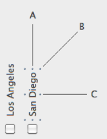

テキストオブジェクトを使って、指示・タイトル・ラベルなどの静的 (スタティック) なテキストを フォーム上に表示することができます。 これらのテキストは、参照を含むことで動的にもなります。 詳細については [スタティックテキスト中で参照を使用する](https://doc.4d.com/4Dv18/4D/18/Using-references-in-static-text.300-4575714.ja.html) を参照ください。 フォーム上に表示することができます。 これらのテキストは、参照を含むことで動的にもなります。 詳細については [スタティックテキスト中で参照を使用する](https://doc.4d.com/4Dv18/4D/18/Using-references-in-static-text.300-4575714.ja.html) を参照ください。

#### JSON 例:

```4d
	"myText": {
                "type": "text",
                "text": "Hello World!",
                "textAlign": "center",
                "left": 60,			
                "top": 160,	
                "width": 100,
                "height": 20,
                "stroke": "#ff0000"		// テキストカラー
                "fontWeight": "bold"
                }
```

## 回転

4D では、フォーム内のテキストエリアを [回転](properties_Text.md#方向) させることができます。


> このプロパティは `OBJECT SET TEXT ORIENTATION` ランゲージコマンドによっても設定することができます。

テキストが回転された後でも、サイズや位置などすべてのプロパティを変更することが可能です。 テキストエリアの高さと幅は、回転の方向に依らないという点に注意してください: テキストエリアの高さと幅は、回転の方向に依らないという点に注意してください: テキストエリアの高さと幅は、回転の方向に依らないという点に注意してください: テキストエリアの高さと幅は、回転の方向に依らないという点に注意してください:



- オブジェクトが A 方向にリサイズされるとき、変更されるのは [幅](properties_CoordinatesAndSizing.md#幅) です。
- オブジェクトが C 方向にリサイズされるとき、変更されるのは [高さ](properties_CoordinatesAndSizing.md#高さ) です。
- オブジェクトが B 方向にリサイズされるとき、[幅](properties_CoordinatesAndSizing.md#幅) と [高さ](properties_CoordinatesAndSizing.md#高さ) の両方が同時に変更されます。

## プロパティ一覧

<details><summary>履歴</summary>

| リリース  | 内容        |
| ----- | --------- |
| 19 R7 | 角の半径をサポート |

</details>

[Bold](properties_Text.md#bold) - [Border Line Style](properties_BackgroundAndBorder.md#border-line-style) - [Bottom](properties_CoordinatesAndSizing.md#bottom) - [Class](properties_Object.md#css-class) - [Corner radius](properties_CoordinatesAndSizing.md#corner-radius) - [Fill Color](properties_BackgroundAndBorder.md#background-color--fill-color) - [Font](properties_Text.md#font) - [Font Color](properties_Text.md#font-color) - [Font Size](properties_Text.md#font-size) - [Height](properties_CoordinatesAndSizing.md#height) - [Horizontal Alignment](properties_Text.md#horizontal-alignment) - [Horizontal Sizing](properties_ResizingOptions.md#horizontal-sizing) - [Italic](properties_Text.md#italic) - [Left](properties_CoordinatesAndSizing.md#left) - [Object Name](properties_Object.md#object-name) - [Orientation](properties_Text.md#orientation) - [Right](properties_CoordinatesAndSizing.md#right) - [Title](properties_Object.md#title) - [Top](properties_CoordinatesAndSizing.md#top) - [Type](properties_Object.md#type) - [Underline](properties_Text.md#underline) - [Vertical Sizing](properties_ResizingOptions.md#vertical-sizing) - [Visibility](properties_Display.md#visibility) - [Width](properties_CoordinatesAndSizing.md#width)
