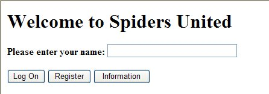

4D Webサーバーは、HTTPリクエストを処理するための機能を複数備えています:

- Webアプリケーションのルーターとなる `On Web Connection` データベースメソッド。
- サーバーサイドコードを呼び出すための `/4DACTION` URL。
- サーバーに送信された HTMLオブジェクトから値を取得する `WEB GET VARIABLES`。
- `WEB GET HTTP BODY`、`WEB GET HTTP HEADER`、`WEB GET BODY PART` などのコマンドによって、リクエスト処理をカスタマイズすることができます (cookie 含む)。
- 変数を宣言するための *COMPILER_WEB* プロジェクトメソッド。

## On Web Connection

`On Web Connection` データベースメソッドは、4D Webサーバーのエントリーポイントとして使用できます。

### データベースメソッドの呼び出し

`On Web Connection` データベースメソッドは、サーバー上に存在しないページへのパスをサーバーが URL として受け取った場合に、自動的に呼び出されます。 データベースメソッドは、URL とともに呼び出されます。

たとえば、"*a/b/c*" という URL はデータベースメソッドを呼び出しますが、[WebFolder](webServerConfig.md#ルートフォルダー) の "a/b" サブフォルダーに "c.html" というページが存在する場合、"*a/b/c.html*" はデータベースメソッドを呼び出しません。

> このリクエストは、事前に [`On Web Authentication`](authentication.md#on-web-authentication) データベースメソッド (あれば) に受け入れられているべきで、Webサーバーも起動している必要があります。

### シンタックス

**On Web Connection**( *$1* : Text ; *$2* : Text ; *$3* : Text ; *$4* : Text ; *$5* : Text ; *$6* : Text )

| 引数 | 型    |                             | 説明                                              |
| -- | ---- | :-------------------------: | ----------------------------------------------- |
| $1 | Text | <- | URL                                             |
| $2 | Text | <- | HTTPヘッダー + HTTPボディ (32 KBまで) |
| $3 | Text | <- | Webクライアント (ブラウザー) の IPアドレス   |
| $4 | Text | <- | サーバーの IPアドレス                                    |
| $5 | Text | <- | ユーザー名                                           |
| $6 | Text | <- | パスワード                                           |

これらの引数を以下のように宣言しなければなりません:

```4d
// On Web Connection データベースメソッド

 C_TEXT($1;$2;$3;$4;$5;$6)

// メソッドのコード
```

あるいは、[名前付き引数](Concepts/parameters.md#名前付き引数) シンタックスを利用することもできます:

```4d
// On Web Connection データベースメソッド
#DECLARE ($url : Text; $header : Text; \
  $BrowserIP : Text; $ServerIP : Text; \
  $user : Text; $password : Text)


```

> インターフェース要素 を表示する 4Dコマンド (`DIALOG`、`ALERT` など)  の呼び出しは許可されず、メソッドの処理を終了します。  の呼び出しは許可されず、メソッドの処理を終了します。

### $1 - URL追加データ

最初の引数 ($1) は、ユーザーが Webブラウザーのアドレスエリアに入力した URL からホストのアドレスを取り除いたものです。

イントラネット接続の場合を見てみましょう。 4D Webサーバーマシンの IPアドレスを 123.4.567.89 とします。 以下の表は Webブラウザーに入力された URL に対して、$1 が受け取る値を示しています:

| Webブラウザーに入力された値                                                                                                                                   | $1 の値                                                                                 |
| ------------------------------------------------------------------------------------------------------------------------------------------------- | ------------------------------------------------------------------------------------- |
| 123.4.567.89                                                                                      | /                                                                                     |
| http://123.45.67.89                                                               | /                                                                                     |
| 123.4.567.89/Customers                                                                            | /Customers                                                                            |
| http://123.45.67.89/Customers/Add                                                 | /Customers/Add                                                                        |
| 123.4.567.89/Do_This/If_OK/Do_That | /Do_This/If_OK/Do_That |

この引数は必要に応じて自由に利用できます。 4D は単に URL のホスト部より後の部分を無視し、$1 に渡します。 たとえば、値 "*/Customers/Add*" が "`[Customers]` テーブルに新規レコードを直接追加する" ということを意味するような、オリジナルのルールを作成できます。 利用可能な値やデフォルトブックマークを Webユーザーに提供することで、アプリケーションの異なる部分へのショートカットを提供できます。 このようにして、Webユーザーは新しく接続するたびにナビゲーションを通過することなく、素早く Webサイトのリソースにアクセスできます。

### $2 - HTTPリクエストのヘッダーとボディ

二番目の引数 ($2) は、Webブラウザーから送信された HTTPリクエストのヘッダーとボディです。 この情報は `On Web Connection` データベースメソッドに "そのまま" 渡されることに留意してください。 その内容は、接続を試みた Webブラウザーの仕様により異なります。 その内容は、接続を試みた Webブラウザーの仕様により異なります。

アプリケーションでこの情報を使用するには、開発者がヘッダーとボディを解析しなければなりません。 `WEB GET HTTP HEADER` や `WEB GET HTTP BODY` コマンドを使うことができます。

> パフォーマンス上の理由により、$2 を介して渡されるデータのサイズは 32KB 以下でなくてはなりません。 これを超過する分は、4D HTTPサーバーにより切り取られます。

### $3 - Webクライアントの IPアドレス

$3 引数はブラウザーマシンの IPアドレスを受け取ります。 この情報を使用して、イントラネットアクセスとインターネットアクセスを区別できます。

> 4D は IPv4 アドレスを、96-bit の接頭辞付きのハイブリッド型 IPv6/IPv4 フォーマットで返します。たとえば、::ffff:192.168.2.34 は、192.168.2.34 という IPv4 アドレスを意味します。 詳細については、[IPv6 のサポートについて](webServerConfig.md#IPv6-のサポートについて) の章を参照ください。

### $4 - サーバー IPアドレス

$4 引数は 4D Webサーバーによってリクエストされた IPアドレスを受け取ります。 4D はマルチホーミングをサポートしており、複数の IPアドレスを持つマシンを使用できます。 詳細は [設定ページ](webServerConfig.md#リクエストを受け付ける-IPアドレス) を参照ください。

### $5 と $6 - ユーザー名とパスワード

`$5` と `$6` 引数は、ブラウザーが表示する標準の認証ダイアログにユーザーが入力したユーザー名とパスワードを受け取ります (入力されていれば; [認証ページ](authentication.md) 参照)。

> ブラウザーから送信されたユーザー名が 4D に存在する場合、$6 引数 (ユーザーパスワード) はセキュリティのため渡されません。

## /4DACTION

\*\*/4DACTION/\*\**MethodName*<br/>
\*\*/4DACTION/\*\**MethodName/Param*

| 引数         | 型    |     | 説明                    |
| ---------- | ---- | :-: | --------------------- |
| MethodName | Text |  -> | 実行する 4Dプロジェクトメソッド名    |
| Param      | Text |  -> | プロジェクトメソッドに渡されるテキスト引数 |

**利用法**: URL またはフォームアクション

この URL を使用して、任意の *Param* テキスト引数とともに *MethodName* に指定した 4Dプロジェクトメソッドを呼び出すことができます。 The method will receive this parameter. このメソッドは引数を *$1* に受け取ります。

- 4Dプロジェクトメソッドは、[Webリクエスト用に許可](allowProject.md)されていなければなりません。メソッドのプロパティで "公開オプション: 4DタグとURL(4DACTION...)" 属性がチェックされていない場合、Webリクエストは拒否されます。
- `/4DACTION/MyMethod/Param` リクエストを受け取ると、4D は `On Web Authentication` データベースメソッド (あれば) を呼び出します。

`4DACTION/` は、スタティックな Webページの URL に割り当てることもできます:

```html
<A HREF="/4DACTION/MyMethod/hello">Do Something</A>
```

`MyMethod` プロジェクトメソッドは通常レスポンスを返すべきです (`WEB SEND FILE` や `WEB SEND BLOB` で HTMLページを送信するなど)。 ブラウザーをブロックしないように、処理は可能な限り短時間でおこなわれるようにします。 ブラウザーをブロックしないように、処理は可能な限り短時間でおこなわれるようにします。

> `4DACTION/` から呼び出されるメソッドは、インタフェース要素 (`DIALOG`, `ALERT` など) を呼び出してはいけません。

#### 例題

この例題は、HTMLピクチャーオブジェクトに `/4DACTION/` URL を割り当て、ページ上でピクチャーを動的に表示する方法を説明しています。 スタティック HTMLページに以下のコードを記述します: スタティック HTMLページに以下のコードを記述します:

```html

```

`getPhoto` メソッドは以下のとおりです:

```4d
C_TEXT($1) // この引数は常に宣言する必要があります
var $path : Text
var $PictVar : Picture
var $BlobVar : Blob

 // Resources フォルダー内の Images フォルダー内でピクチャーを探します
$path:=Get 4D folder(Current resources folder)+"Images"+Folder separator+$1+".psd"

READ PICTURE FILE($path;$PictVar) // ピクチャーをピクチャー変数に入れます
PICTURE TO BLOB($PictVar;$BLOB;".png") // ピクチャーを ".png" 形式に変換します
WEB SEND BLOB($BLOB;"image/png")
```

### 4DACTION を使用してフォームをポスト

4D Webサーバーでは、ポストされたフォームを使用することもできます。これはスタティックなページから Webサーバーにデータを送信し、すべての値を簡単に取得するというものです。 POSTタイプを使用し、フォームのアクションは /4DACTION/MethodName で始まっていなければなりません。

フォームは 2つのメソッドを使用してサブミットできます (4D では両方のタイプを使用できます):

- POST は通常 Webサーバーにデータを送信するのに使用します。
- GET は通常 Webサーバーからデータをリクエストするのに使用します。

> この場合、Webサーバーがポストされたフォームを受信すると、`On Web Authentication` データベースメソッドが (あれば) 呼び出されます。

サーバーに投稿された HTMLページに含まれるすべてのフィールドの [名前と値を取得](#httpリクエストから値を取得する) するには、このメソッド内で `WEB GET VARIABLES` コマンドを呼び出す必要があります。

フォームのアクションを定義する例:

```html
<FORM ACTION="/4DACTION/MethodName" METHOD=POST>
```

#### 例題

Webアプリケーションにおいて、スタティックなHTMLページを使い、ブラウザーからレコードを検索できるようにしたいとします。 このページを "search.htm" とします。 アプリケーションには、検索結果を表示するためのスタティックページ ("results.htm") もあるとします。 POSTメソッドと `/4DACTION/PROCESSFORM` アクションがページに割り当てられています。

以下はこのページの HTMLコードです:

```html
<form action="/4daction/processForm" method=POST>
<input type=text name=vName value=""><br/>
<input type=checkbox name=vExact value="Word">Whole word<br/>
<input type=submit name=OK value="Search">
</FORM>
```

データ入力エリアに "ABCD" とタイプし、"Whole word (句として検索)" オプションをチェックして **Search** (検索) ボタンをクリックします。 Webサーバーに送信されるリクエスト内部は以下の通りです: Webサーバーに送信されるリクエスト内部は以下の通りです:

```
vName="ABCD"
vExact="Word"
OK="Search"
```

4D は `On Web Authentication` データベースメソッドを (あれば) 呼び出し、そして以下の`processForm` プロジェクトメソッドを呼び出します:

```4d
C_TEXT($1) // コンパイルモードの場合必須
 C_LONGINT($vName)
 C_TEXT(vName;vLIST)
 ARRAY TEXT($arrNames;0)
 ARRAY TEXT($arrVals;0)
 WEB GET VARIABLES($arrNames;$arrVals) // フォーム上の変数をすべて取得します
 $vName:=Find in array($arrNames;"vName")
 vName:=$arrVals{$vName}
 If(Find in array($arrNames;"vExact")=-1) // オプションがチェックされていない場合
    vName:=vName+"@"
 End if
 QUERY([Jockeys];[Jockeys]Name=vName)
 FIRST RECORD([Jockeys])
 While(Not(End selection([Jockeys])))
    vLIST:=vLIST+[Jockeys]Name+" "+[Jockeys]Tel+"<br/>"
    NEXT RECORD([Jockeys])
 End while
 WEB SEND FILE("results.htm") // 検索結果が挿入される results.htm を送信します
  // このページには変数 vLIST の参照が含まれています
  // たとえば <!--4DHTML vLIST--> など
  //...
End if

```

## HTTPリクエストから値を取得する

4D Web サーバーでは、Webフォームや URL を介して POST や GET リクエストで送信されたデータを復元することができます。

ヘッダーや URL にデータが含まれたリクエストを Webサーバーが受信すると、4D はそれに含まれる HTMLオブジェクトの値を受け取ることができます。 たとえば `WEB SEND FILE` コマンドまたは `WEB SEND BLOB` コマンドで送信され、ユーザーが値を入力・修正して確定ボタンをクリックするような Webフォームにおいてもこの原理は使用可能です。

この場合 4D は `WEB GET VARIABLES` コマンドを使って、リクエスト内の HTMLオブジェクトの値を取得することができます。 `WEB GET VARIABLES` コマンドは、値をテキストとして受け取ります。

以下の HTMLページのソースコードがあるとき:

```html
<html>
<head>
  <title>Welcome</title>
  <script language="JavaScript"><!--
function GetBrowserInformation(formObj){
formObj.vtNav_appName.value = navigator.appName
formObj.vtNav_appVersion.value = navigator.appVersion
formObj.vtNav_appCodeName.value = navigator.appCodeName
formObj.vtNav_userAgent.value = navigator.userAgent
return true
}
function LogOn(formObj){
if(formObj.vtUserName.value!=""){
return true
} else {
alert("Enter your name, then try again.")
return false
}
}
//--></script>
</head>
<body>
<form action="/4DACTION/WWW_STD_FORM_POST" method="post"
 name="frmWelcome"
 onsubmit="return GetBrowserInformation(frmWelcome)">
  <h1>Welcome to Spiders United</h1>
  <p><b>Please enter your name:</b>
  <input name="vtUserName" value="" size="30" type="text"></p>
  <p>
<input name="vsbLogOn" value="Log On" onclick="return LogOn(frmWelcome)" type="submit">
<input name="vsbRegister" value="Register" type="submit">
<input name="vsbInformation" value="Information" type="submit"></p>
<p>
<input name="vtNav_appName" value="" type="hidden">
<input name="vtNav_appVersion" value="" type="hidden">
<input name="vtNav_appCodeName" value="" type="hidden">
<input name="vtNav_userAgent" value="" type="hidden"></p>
</form>
</body>
</html>
```

4D が Webブラウザーにページを送信すると、以下のように表示されます:



このページの主な特徴は:

- 送信のための **Submit** ボタンが 3つあります: `vsbLogOn`, `vsbRegister` そして `vsbInformation`。
- **Log On** をクリックすると、フォームからの送信はまず初めに JavaScript関数 `LogOn` によって処理されます。 名前が入力されていない場合、フォームは 4Dに送信すらされず、JavaScript による警告が表示されます。 名前が入力されていない場合、フォームは 4Dに送信すらされず、JavaScript による警告が表示されます。
- フォームは POST 4Dメソッドに加えて、ブラウザープロパティを *vtNav_App* から始まる名称の 4つの隠しオブジェクトへとコピーする投稿スクリプト (*GetBrowserInformation*) を持っています。
  また、このページには `vtUserName` オブジェクトも含まれます。
  また、このページには `vtUserName` オブジェクトも含まれます。

ユーザーが HTMLフォーム上のボタンのどれかをクリックした際に呼び出される `WWW_STD_FORM_POST` という 4Dメソッドを検証してみましょう。

```4d
  // 変数の値を取得します
 ARRAY TEXT($arrNames;0)
 ARRAY TEXT($arrValues;0)
 WEB GET VARIABLES($arrNames;$arrValues)
 C_LONGINT($user)

 Case of

  // Log On ボタンがクリックされた場合
    :(Find in array($arrNames;"vsbLogOn")#-1)
       $user :=Find in array($arrNames;"vtUserName")
       QUERY([WWW Users];[WWW Users]UserName=$arrValues{$user})
       $0:=(Records in selection([WWW Users])>0)
       If($0)
          WWW POST EVENT("Log On";WWW Log information)
  // WWW POST EVENT メソッドが情報をデータベースのテーブルに保存します
       Else

          $0:=WWW Register
  // WWW Register メソッドは新規 Webユーザーの登録を処理します
       End if

  // Register ボタンがクリックされた場合
    :(Find in array($arrNames;"vsbRegister")#-1)
       $0:=WWW Register

  // Information ボタンがクリックされた場合
    :(Find in array($arrNames;"vsbInformation")#-1)
       WEB SEND FILE("userinfos.html")
 End case
```

このメソッドの機能は:

- 変数 *vtNav_appName*, *vtNav_appVersion*, *vtNav_appCodeName*, そして *vtNav_userAgent* の値 (同じ名前を持つ HTMLオブジェクトにそれぞれバインドされています) は 、`WEB GET VARIABLES` コマンドを使用することによって JavaScript のスクリプト *GetBrowserInformation* で作成された HTMLオブジェクトから取得することができます。
- 3つの投稿ボタンにバインドされている変数 *vsbLogOn*, *vsbRegister* と *vsbInformation* のうち、クリックされたボタンに対応するもののみが `WEB GET VARIABLES` コマンドによって取得されます。 この 3つのうちいずれかのボタンによって投稿がおこなわれたとき、ブラウザーはクリックされたボタンの値を 4D に返します。 これにより、どのボタンがクリックされたのかが分かります。

HTMLではすべてのオブジェクトがテキストオブジェクトであることに留意が必要です。 HTMLではすべてのオブジェクトがテキストオブジェクトであることに留意が必要です。 SELECT要素を使用した場合、 `WEB GET VARIABLES` コマンドで返されるのはオブジェクト内でハイライトされている要素の値であり、4D のように配列内の要素の位置を返すわけではありません。 `WEB GET VARIABLES` コマンドは必ずテキスト型の値を返します。 `WEB GET VARIABLES` コマンドは必ずテキスト型の値を返します。

## その他の Webサーバーコマンド

4D Webサーバーには、リクエストの処理をカスタマイズするための、低レベル Webコマンドがいくつか用意されています。

- `WEB GET HTTP BODY` コマンドは、ボディをそのままの状態でテキストとして返します。これを必要に応じて解析することができます。
- `WEB GET HTTP HEADER` コマンドは、リクエストのヘッダーを返します。 カスタムcookie などを処理するのに便利です (`WEB SET HTTP HEADER` コマンドも使用できます)。
- `WEB GET BODY PART` と `WEB Get body part count` コマンドは、マルチパートリクエストのボディパートを解析して、テキスト値を取得するだけでなく、ポストされたファイルもBLOBに取得します。

これらのコマンドは次の図にまとめられています:


4D Webサーバーは、どの Webクライアントからでもチャンクド・エンコーディングでアップロードされたファイルをサポートするようになりました。 チャンクド・エンコーディングは HTTP/1.1 にて定義されているデータ転送方式です。 これを使用することにより、最終的なデータサイズを知る事なく、データを複数の "チャンク" (部分) に分けて転送することができます。 4D Webサーバーでは、サーバーから Webクライアントへのチャンクド・エンコーディングもサポートしています (`WEB SEND RAW DATA` を使用します)。

## COMPILER_WEB プロジェクトメソッド

COMPILER_WEB メソッドが存在する場合、それは HTTPサーバーが動的なリクエストを受け取り、4Dエンジンを呼び出した場合に、システムを通して呼び出されます。 これはたとえば 4D Webサーバーが、ポストされたフォーム、または処理すべき URL を [`On Web Connection`](#on-web-connection) に受け取る場合が該当します。 このメソッドは Web通信時に使用される型指定または変数初期化指示子を含めることを目的としています。 これはデータベースのコンパイル時にコンパイラーによって使用されます。 COMPILER_WEB メソッドはすべての Webフォームで共通です。 デフォルトでは、COMPILER_WEB メソッドは存在しません。 明示的に作成する必要があります。

> COMPILER_WEB プロジェクトメソッドは (存在すれば)、SOAPリクエストが受け入れられるごとに実行されます。
