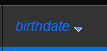
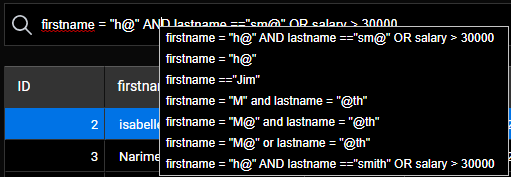

データエクスプローラーは、プロジェクトのデータストアにあるデータを表示・クエリ・編集するための Webインターフェースを提供します。 このツールを使用すると、すべてのエンティティを簡単に照会し、属性値に基づいて検索・並べ替え・フィルターすることができます。 このツールは、開発プロセスのどの段階においても問題を迅速に特定するだけでなく、データを管理・編集するのにも役立ちます。


## アクセス設定

データエクスプローラーの設定や認証は [`WebAdmin`](webAdmin.md) Webサーバーコンポーネントに依存しています。

- **設定**: データエクスプローラーの設定は、[`WebAdmin` Webサーバーの設定](webAdmin.md#webadmin-設定) を再利用します。
- **認証**: データエクスプローラーへのアクセスは、[認証されたセッションユーザー](webAdmin.md#認証とセッション) が、"WebAdmin" 権限を持っている場合に許可されます。 **データエクスプローラー** のメニュー項目 (後述参照) からデータエクスプローラーにアクセスした場合、認証は自動的におこなわれます。

> データエクスプローラーへのアクセスは、[`.setAdminProtection()`](API/DataStoreClass.md#setadminprotection) 関数を使って無効化できます。

## データエクスプローラーを開く

データエクスプローラーがクリックされると、必要に応じて [`WebAdmin` Webサーバー](webAdmin.md#starting-the-webadmin-web-server) が自動的に開始されます。

データエクスプローラーWebページに接続するには:

- 4Dアプリケーションから (インターフェースあり):
  - Webエリアにデータエクスプローラーを表示した新しい 4Dウィンドウを開くには、**レコード** メニューから **データエクスプローラー** を選択するか、メインツールバーの **データ** ボタンをクリックします。
  - データエクスプローラーを外部ブラウザーで開くには、**レコード** メニューから "**データエクスプローラーをブラウザーで開く**" を選択するか、メインツールバーの **データ** ボタンを **Alt** キー (Windows) または **Option** キー (macOS) を押しながらクリックします。

- 4D Server からは、**ウインドウ** メニューの **データエクスプローラーをブラウザーで開く** を選択します (データエクスプローラーは、外部ブラウザーでのみ開くことができます)。

- ヘッドレス4Dアプリケーションを使用しているかどうかに関わらず、Webブラウザーを開いて次のアドレスを入力します:

`IPaddress:HTTPPort/dataexplorer`<br /> または<br /> `IPaddress:HTTPSPort/dataexplorer`

このコンテキストでは、サーバー上で `WebAdmin` セッションを開くために [アクセスキー](webAdmin.md#アクセスキー) の入力を求められます。


> [HTTPPort](webAdmin.md#http-ポート) および [HTTPSPort](webAdmin.md#https-ポート) の値は、`WebAdmin` 設定内で定義されます。

## 要件

データエクスプローラーは、以下の Webブラウザーをサポートしています。

- Chrome
- Safari
- Edge
- FireFox

データエクスプローラーを使用するための最小解像度は 1280x720 です。 推奨解像度は 1920x1080 です。

## データの閲覧

データエクスプローラーでは、包括的でカスタマイズ可能なデータの表示に加えて、データの照会や並べ替えをおこなうことができます。

### 基本

データエクスプローラーは、[ORDAマッピングルール](ORDA/dsMapping.md#変換のルール) に基づいて、ORDAデータモデルへの全体的なアクセスを提供します。

:::info

データベース側で、ORDAモデルやデータが変更された場合 (テーブルの追加、レコードの編集・削除など)、F5キーなどでデータエクスプローラーのページをブラウザーで更新するだけで、変更が反映されます。

:::

ページ下部のセレクターを使って、表示テーマを **ダークモード** に切り替えることができます。


このページにはいくつかのエリアがあります:

- 左側には **データクラスエリア** と **属性エリア** があり、表示するデータクラスおよび属性を選択できます。 属性は、ストラクチャーにおける作成順にしたがって並べられます。 プライマリーキーおよびインデックス付きの属性には、専用アイコンが表示されます。 表示されているデータクラス名と属性名のリストは、それぞれの検索エリアを使ってフィルターできます。
  

- 中央部には、**検索エリア** と **データグリッド** (選択されたデータクラスのエンティティのリスト) があります。 グリッドの各列は、データストアの属性を表します。
  - デフォルトでは、すべてのエンティティが表示されます。 検索エリアを使用して、表示されるエンティティをフィルターできます。 2つのクエリモードがあります: [属性に基づくクエリ](#属性に基づくクエリ) (デフォルト)、および [式による高度なクエリ](#式による高度なクエリ) です。 対応するボタンをクリックして、クエリモードを選択します (**X** ボタンは、クエリエリアをリセットして、フィルターを停止します):
    
  - 選択されたデータクラスの名前は、データグリッドの上にタブとして追加されます。 これらのタブを使って、選択されたデータクラスを切り替えることができます。 参照されているデータクラスを削除するには、データクラス名の右に表示される "削除" アイコンをクリックします。
  - 左側の属性のチェックを外すことで、表示されている列数を減らせます。 また、ドラッグ＆ドロップでデータグリッドの列の位置を入れ替えることができます。 列のヘッダーをクリックすると、値に応じて [エンティティを並べ替える](#エンティティの並べ替え) ことができます (可能な場合)。
  - 処理に時間がかかる場合は、進捗バーが表示されます。 赤いボタンをクリックすると、いつでも実行中の処理を停止できます:<br/>
    

- 右側には **詳細エリア** があり、選択されているエンティティおよび **リレートデータ** (あれば) の属性値が表示されます。 エリア下部にある **First** / **Previous** / **Next** / **Last** のリンクをクリックすることで、データクラスのエンティティ間を移動することができます。
  - すべての属性タイプが表示されます (画像、オブジェクト (json で表現) や、[計算属性](../ORDA/ordaClasses.md#計算属性-1) と [エイリアス属性](../ORDA/ordaClasses.md#エイリアス属性-1) も含む)。
  - リレートデータ (N対1 および 1対Nリレーション) は、展開/折りたたみ可能なエリアで表示できます:<br/>
    
  - 右側のエリアでリレート属性名を **Ctrl+Click** (Windows) または **Command+Click** (macOS) すると、その属性値がフローティングエリアに表示されます):<br/>
    

### エンティティの並べ替え

表示されているエンティティのリストを、属性値に応じて並べ替えることができます。 並べ替えには、ピクチャーとオブジェクトを除くすべての属性を使用できます。

- 列のヘッダーをクリックすると、その列の属性値に応じてエンティティを並べ替えます。 デフォルトでは、昇順でソートされます。 2回クリックすると、降順でソートされます。 並べ替えの基準となる列には小さなアイコンが付き、属性名が _イタリック_ で表示されます。



- 属性を基準に複数のレベルでソートできます。 たとえば、従業員を都市別にソートした後、給与別にソートすることができます。 これには、**Shift** キーを押しながら、ソート基準とする各列のヘッダーを順にクリックします。

### 属性に基づくクエリ

このモードでは、データグリッドの属性名の上のエリアに検索 (または除外) する値を入力して、エンティティをフィルターします。 1つまたは複数の属性でフィルター可能です。 入力すると、エンティティリストは自動的に更新されます。


複数の属性を指定した場合は、自動的に AND が適用されます。 たとえば次のフィルターでは、_firstname_ 属性が "flo" で始まり、_salary_ 属性値が >50000であるエンティティが表示されます:


**X** ボタンは入力された属性値を削除し、フィルターを停止します。

属性のデータ型に応じて、さまざまな演算子やクエリオプションが利用できます。

> ピクチャーやオブジェクト属性はフィルターできません。

#### 比較演算子

数値、日付、時間型の属性では、デフォルトで "=" 演算子が選択されています。 ただし、演算子のリストから別の演算子を選択することができます ("=" アイコンをクリックするとリストが表示されます)。


#### 日付

日付型属性では、ピッカーを使って日付を入力することができます (日付エリアをクリックするとカレンダーが表示されます)。


#### ブール

ブール型の属性エリアをクリックすると、**true**/**false** 値だけでなく **null**/**not null** 値でもフィルターすることができます。


- **null** は、その属性値が定義されていないことを示します。
- **not null** は、属性値が定義されていることを示します (つまり、true または false)。

#### テキスト

テキストフィルターは、文字の大小を区別しません (a = A)。

フィルターは "～で始まる" タイプです。 たとえば、"Jim" と入力すると、"Jim" と "Jimmy" が表示されます。

ワイルドカード文字 (@) を使って、1つ以上の開始文字を置き換えることもできます。 例:

| フィルター文字列            | 検出結果                     |
| ------------------- | ------------------------ |
| Bel                 | "Bel" で始まるすべての値          |
| @do    | "do" を含むすべての値            |
| Bel@do | "Bel" で始まり、"do" を含むすべての値 |

"完全一致" のような、より詳細なクエリを作成するには、高度なクエリ機能を使用する必要があります。

### 式による高度なクエリ

このオプションを選択すると、エンティティリストの上にクエリエリアが表示され、コンテンツのフィルターに使用する任意の式を入力することができます。


属性クエリでは利用できない高度なクエリを入力することができます。 たとえば、_firstname_ 属性に "Jim" が含まれ、"Jimmy" が含まれていないエンティティを探すには、次のように記述します:

```
firstname=="Jim"
```

[`query()` 関数の説明](API/DataClassClass.md#query) にある ORDA クエリ式を利用することができますが、次の制限および相違点があります:

- セキュリティ上、`eval()` を使った式を実行することはできません。
- プレースホルダーは使用できません。値の指定された _クエリ文字列_ を使用しなくてはなりません。
- スペース文字を含む文字列値は、二重引用符 ("") で囲む必要があります。

たとえば、Employee データクラスの場合に、次のように記述できます:

```
firstname = "Marie Sophie" AND manager.lastname = "@th"
```

[`queryPlan`](API/DataClassClass.md#queryplan) と [`queryPath`](API/DataClassClass.md#querypath) を両方表示するには `v` アイコンをクリックします。 このエリアでは、サブクエリのブロックにカーソルを合わせると、サブクエリごとの詳細情報が表示されます。


クエリエリアで右クリックすると、以前の有効なクエリが表示されます:



## データの編集

データエクスプローラーでは、属性値の変更や、エンティティの追加または削除をおこなうことができます。 これらは、たとえば実装をテストしたり、無効データの問題を解決したりするための、管理者用の機能です。

### Allow editing

セキュリティ上の理由から、データエクスプローラーを介してデータを編集するには、まず **Allow editing** セレクターを使用して編集モードを有効にする必要があります。 有効にすると、編集アクションボタンが右側に表示されます:


このセレクターは **データクラスごと** および **ブラウザーセッションごと** に有効にします。

:::info

データエクスプローラーを使用してデータを編集する場合には確認ダイアログボックス等が表示されないため、意図しない変更を防ぐためにこのセレクターは存在しています。

:::

### 値の入力

**Allow editing** セレクターが特定のデータクラスに対して有効になっている場合、**Details** エリアで、そのデータクラスの新規または選択されたエンティティの値を専用ウィジェットを使って入力することができます。

次のスカラー属性値が編集できます:

- テキスト
- boolean
- numeric
- date
- time
- ピクチャー (ピクチャーをアップロードまたはドラッグ＆ドロップできます)
- オブジェクト (JSON 文字列)

Blob属性は変更できません。

新しいまたは変更された値は、ローカルキャッシュに保存されます。データに反映するには、[明示的に保存](#編集の保存) する必要があります。

### エンティティの作成

作成ボタン  をクリックすると、選択したテーブルに新しい空のエンティティを作成できます。 作成後、このエンティティに対して [値を入力](#値の入力) することができます。

新しいエンティティは、ローカルキャッシュに保存されます。データに反映するには、[明示的に保存](#編集の保存) する必要があります。

:::info

4D が計算する必要のある属性値 (ID、計算属性) は、エンティティを保存した後にのみ返されます。

:::

### 値のリロード

**リロード** ボタン  は、エンティティの属性値をデータファイルから再ロードします。 このボタンは、最新の値を表示させたい場合などに便利です。

### 編集の保存

[削除](#エンティティの削除) 操作を除いて (下記参照)、エンティティの変更はローカルでおこなわれ、データファイルに反映するには保存する必要があります。

変更を保存したり、データエクスプローラーで新規作成したエンティティを保存するには、**保存** ボタン  をクリックします。

:::info

既存エンティティへの変更は、同じデータクラスの別エンティティを選択すると自動的に保存されます。

:::

競合の場合 (例: 別のユーザーが同じエンティティの同じ属性値を変更した)、データエクスプローラーの下部にエラーメッセージが表示されます。 その場合は、[**リロード**ボタン](#値のリロード) をクリックして、データの最新の値を取得してから、変更を適用して保存することができます。

### エンティティの削除

**削除** ボタン  をクリックすると、エンティティを削除することができます。

複数のエンティティを削除するには、**Shift + Click** (連続選択) または **Ctrl/Command + Click** (非連続選択) を使用してリスト内の 2つ以上のエンティティを選択し、**削除** ボタンをクリックします。

:::note

競合が起きた (サーバー上でロックされているエンティティなど) ために一部のエンティティを削除できなかった場合、リスト内でハイライト表示されます。

:::

:::caution

エンティティを削除する際に確認ダイアログは表示されません。 選択したエンティティは、データから即時に削除されます。

:::
