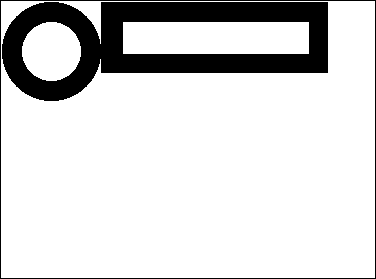
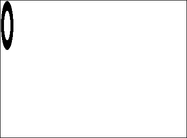
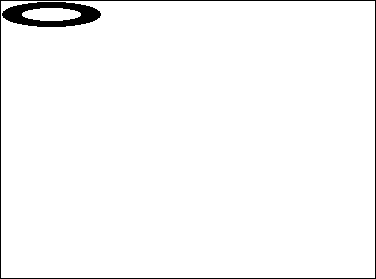

ピクチャーのフィールド・変数・式に格納されるデータは、任意の Windows または Macintosh の画像です。 これらの画像には、ペーストボード上に置いたり、4Dコマンドやプラグインコマンド (`READ PICTURE FILE` など) を使用してディスクから読み出すことのできる画像を含みます。

4D は Windows と macOS の両方においてネイティブな API を使用してフィールドや変数のピクチャーをエンコード (書き込み) およびデコード (読み込み) します。 これらの実装は現在デジタルカメラで使用されている RAW フォーマット含め、数多くのネイティブなフォーマットへのアクセスを提供します。

- Windows では、4DはWIC (Windows Imaging Component) を使用します。
- macOS では、4D は ImageIO を使用します。

WIC および ImageIO はピクチャー内のメタデータの書き込みを許可しています。 `SET PICTURE METADATA` および `GET PICTURE METADATA` コマンドを使用することで、それらのメタデータを開発に役立てることができます。

## ピクチャー Codec ID

4D は多様な [ピクチャーフォーマット](FormEditor/pictures.md#native-formats-supported) をネイティブにサポートします: .jpeg, .png, .svg 等。

4D が認識するピクチャーフォーマットは `PICTURE CODEC LIST` コマンドからピクチャー Codec IDとして返されます。  これは以下の形式で返されます:

- 拡張子 (例: “.gif”)
- MIME タイプ (例: “image/jpeg”)

それぞれのピクチャーフォーマットに対して返される形式は、当該 Codec が OS レベルで記録されている方法に基づきます。 エンコーディング (書き込み) 用コーデックにはライセンスが必要な場合があるため、利用できるコーデックの一覧は、読み込み用と書き込み用で異なる可能性があることに注意してください。

多くの [4D ピクチャー管理コマンド](https://doc.4d.com/4Dv18/4D/18/Pictures.201-4504337.ja.html) は Codec ID を引数として受けとることができます。 したがって、`PICTURE CODEC LIST` から返されるシステムIDを使用しなければなりません。
4D が認識するピクチャーフォーマットは `PICTURE CODEC LIST` コマンドによって返されます。

## ピクチャー演算子

| 演算       | シンタックス                            | 戻り値     | 動作                                                                                                                                    |
| -------- | --------------------------------- | ------- | ------------------------------------------------------------------------------------------------------------------------------------- |
| 水平連結     | Pict1 + Pict2                     | Picture | Pict1 の右側に Pict2 を追加します                                                                                                               |
| 垂直連結     | Pict1 / Pict2                     | Picture | Pict1 の下側に Pict2 を追加します                                                                                                               |
| 排他的論理和   | Pict1 & Pict2 | Picture | Pict1 の前面に Pict2 を重ねます (Pict2 が前面) `COMBINE PICTURES(pict3;pict1;Superimposition;pict2)` と同じ結果になります。               |
| 包括的論理和   | Pict1 \| Pict2                    | Picture | Pict1 と Pict2 を重ね、そのマスクした結果を返します (両ピクチャーとも同じサイズである必要があります) `$equal:=Equal pictures(Pict1;Pict2;Pict3)` と同じ結果になります。 |
| 水平移動     | Picture + Number                  | Picture | 指定ピクセル分、ピクチャーを横に移動します。                                                                                                                |
| 垂直移動     | Picture / Number                  | Picture | 指定ピクセル分、ピクチャーを縦に移動します。                                                                                                                |
| リサイズ     | Picture \* Number                 | Picture | 割合によってピクチャーをサイズ変更します。                                                                                                                 |
| 水平スケール   | Picture \*+ Number                | Picture | 割合によってピクチャー幅をサイズ変更します。                                                                                                                |
| 垂直スケール   | Picture \*\| Number               | Picture | 割合によってピクチャー高さをサイズ変更します。                                                                                                               |
| キーワードを含む | Picture % String                  | Boolean | 文字列が、ピクチャー式に格納されたピクチャーに関連付けられている場合に true を返します。 `GET PICTURE KEYWORDS` を参照ください                                                        |

**注 :**

- \| 演算子を使用するためには、Pict1 と Pict2 が完全に同一のサイズでなければなりません。 二つのピクチャーサイズに違いがある場合、Pict1 | Pict2 は空のピクチャーを生成します。
- `COMBINE PICTURES` コマンドは、それぞれのソースピクチャーの特性を結果ピクチャーに保持しつつ、ピクチャーの重ね合わせをおこないます。
- `TRANSFORM PICTURE` コマンドを使って、さらなる画像処理をおこなうことができます。
- ピクチャー用の比較演算子はありませんが、`Equal picture` コマンドを使って 2つのピクチャーを比較することができます。

### 例題

水平連結

```4d
 circle+rectangle // circle の右に rectangle が追加されます。
 rectangle+circle // rectangle の右に circle が追加されます。
```




垂直連結

```4d
 circle/rectangle // circle の下に rectangle が追加されます。
 rectangle/circle // rectangle の下に circle が追加されます。
```


排他的論理和

```4d
Pict3:=Pict1 & Pict2 // Pict1 の上に Pict2 を重ねます。
```


包括的論理和

```4d
Pict3:=Pict1|Pict2 // 同じサイズの二つのピクチャーを重ね合わせた上でそのマスクの結果を返します。
```


水平移動

```4d
rectangle+50 // rectangle を右に 50ピクセル移動します。
rectangle-50 // rectangle を左に 50ピクセル移動します。
```


垂直移動

```4d
rectangle/50 // rectangle を下に 50ピクセル移動します。
rectangle/-20 // rectangle を上に 20ピクセル移動します。
```


拡大

```4d
rectangle*1.5 // rectangle を 50%拡大します。
rectangle*0.5 // rectangle を 50%縮小します。
```


水平スケール

```4d
circle*+3 // circle の幅を 3倍に広げます。
circle*+0.25 // circle の幅を 25%に縮めます。
```



垂直スケール

```4d
circle*|2 // circle の高さを 2倍に伸ばします。
circle*|0.25 // circle の高さを 25%に縮めます。
```


