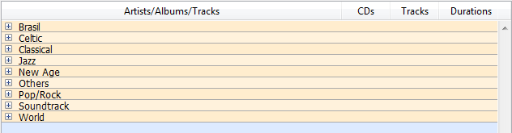
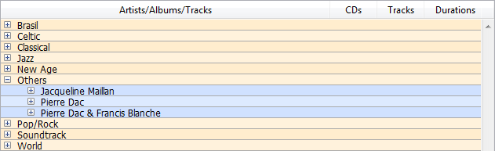
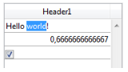
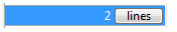

リストボックスは複合アクティブオブジェクトで、同期化された複数列 (カラムとも呼びます) の形式でデータの表示・入力がおこなえます。 リストボックスは、エンティティセレクションやレコードセレクションなどのデータベースコンテンツのほか、コレクションや配列などのランゲージコンテンツと紐づけることができます。 データ入力、列の並べ替え、イベント管理、外観のカスタマイズ、 列の移動など、リストボックスには高度な機能が備わっています。


リストボックスには 1つ以上の列があり、その内容が自動的に同期化されます。 理論上、列数に制限はありません (マシンのリソースに依存します)。

## 概要

### 基本のユーザー機能

実行中、リストボックスはリストとしてデータを表示し、入力を受け付けます。 セルを編集可能にするには ([その列について入力が許可されていれば](#入力の管理))、セル上で2回クリックします:


リストボックスのセルには、複数行のテキストを入力・表示できます。 セル内で改行するには、**Ctrl+Return** (Windows) または **Command+Return** (macOS) を押します。

セルにはブールやピクチャー、日付、時間、数値も表示することができます。 ヘッダーをクリックすると、列の値をソートできます ([標準ソート](ソートの管理))。 すべての列が自動で同期されます。

またそれぞれの列幅を変更できるほか、ユーザーはマウスを使用して [列](properties_ListBox.md#locked-columns-and-static-columns) や [行](properties_Action.md#movable-rows) の順番を (そのアクションが許可されていれば) 入れ替えることもできます。 リストボックスは [階層モード](#階層リストボックス) で使用することもできます。

ユーザーは標準のショートカットを使用して 1つ以上の行を選択できます。**Shift+クリック** で連続した行を、**Ctrl+クリック** (Windows) や **Command+クリック** (macOS) で非連続行を選択できます。

### リストボックスの構成要素

リストボックスオブジェクトは、以下4つの項目で構成されます:

- リストボックスオブジェクトの全体
- 列
- 列ヘッダー
- 列フッター


それぞれが独自のオブジェクト名や固有のプロパティを持ちます。 たとえば、列の数や、交互に使用する行の背景色などはリストボックスオブジェクトのプロパティで指定し、各列の幅は列プロパティ、ヘッダーのフォントはヘッダープロパティで指定します。

リストボックスオブジェクトやリストボックスの各列に対して、オブジェクトメソッドを設定することができます。 オブジェクトメソッドの呼び出しは、次の順でおこなわれます:

1. 各列のオブジェクトメソッド
2. リストボックスのオブジェクトメソッド

[ヘッダー](#リストボックスヘッダー) と [フッター](#リストボックスフッター) で発生したイベントは、その列のオブジェクトメソッドが受け取ります。

### リストボックスの型

リストボックスには複数のタイプがあり、動作やプロパティの点で異なります。 リストボックスの型は [データソースプロパティ](properties_Object.md#データソース) で定義します:

- **配列**: 各列に 4D 配列を割り当てます。 配列タイプのリストボックスは [階層リストボックス](listbox_overview.md#階層リストボックス) として表示することができます。
- **セレクション** (**カレントセレクション** または **命名セレクション**): 各列に式 (たとえばフィールド) を割り当てます。それぞれの行はセレクションのレコードを基に評価されます。
- **コレクションまたはエンティティセレクション**: 各列に式を割り当てます。各行の中身はコレクションの要素ごと、あるいはエンティティセレクションのエンティティごとに評価されます。

> 1つのリストボックス内に、複数のデータソースタイプを組み合わせて指定することはできません。 データソースは、リストボックス作成時に定義され、 プログラムによって後から変更することはできません。

### リストボックスの管理

リストボックスオブジェクトはプロパティによってあらかじめ設定可能なほか、プログラムにより動的に管理することもできます。

4D ランゲージにはリストボックス関連のコマンドをまとめた "リストボックス" テーマが専用に設けられていますが、"オブジェクトプロパティ" コマンドや `EDIT ITEM`、`Displayed line number` コマンドなど、ほかのテーマのコマンドも利用することができます。 詳細については *4D ランゲージリファレンスマニュアル* の[リストボックスコマンド一覧](https://doc.4d.com/4Dv18/4D/18/List-Box-Commands-Summary.300-4505230.ja.html)を参照してください。

## リストボックスオブジェクト

### 配列リストボックス

配列リストボックスでは、それぞれの列に 4D の 1次元配列を割り当てなければなりません。ポインター配列を除きすべてのタイプの配列を使用できま す。 行数は配列の要素数により決定されます。

デフォルトで 4D は各列に “ColumnX” という名前を割り当てます。 この配列変数名は [列のプロパティ](listbox_overview.md#列特有のプロパティ) で変更できます (プロパティリストの [変数あるいは式](properties_Object.md#変数あるいは式) プロパティを使用します)。 列ごとの表示フォーマットを指定するには、`OBJECT SET FORMAT` コマンドも使用できます。

> 配列タイプのリストボックスは、特別なメカニズムをもつ [階層モード](listbox_overview.md#階層リストボックス) で表示することができます。

配列タイプのリストボックスでは、入力あるいは表示される値は 4Dランゲージで制御します。 列に [選択リスト](properties_DataSource.md#選択リスト) を割り当てて、データ入力を制御することもできます。
リストボックスのハイレベルコマンド (`LISTBOX INSERT ROWS` や `LISTBOX DELETE ROWS` 等) や配列操作コマンドを使用して、列の値を管理します。 たとえば、列の内容を初期化するには、以下の命令を使用できます:

```4d
ARRAY TEXT(varCol;size)
```

リストを使用することもできます:

```4d
LIST TO ARRAY("ListName";varCol)
```

> **警告**: 異なる配列サイズの列がリストボックスに含まれる場合、もっとも小さい配列サイズの数だけを表示します。 そのため、各配列の要素数は同じにしなければなりません。 リストボックスの列が一つでも空の場合 (ランゲージにより配列が正しく定義またはサイズ設定されなかったときに発生します)、リストボックスは何も表示しません。

### セレクションリストボックス

このタイプのリストボックスでは、列ごとにフィールド (例: `[Employees]LastName`) や式を割り当てます。 式は 1つ以上のフィールド (たとえば `[Employees]FirstName+“ ”[Employees]LastName`) または単にフォーミュラ (たとえば `String(Milliseconds)`) を使用できます。 式にはプロジェクトメソッド、変数、あるいは配列項目も指定できます。 カラムをプログラムで変更するには、`LISTBOX SET COLUMN FORMULA` および `LISTBOX INSERT COLUMN FORMULA` コマンドを使用します。

それぞれの行はセレクションのレコードを基に評価されます。セレクションは **カレントセレクション** または **命名セレクション**です。

デー タソースがカレントセレクションである場合、データベースに対しておこなわれた変更はリストボックスに自動で反映され、またリストボックスへの変更も自動で データベースに適用されます。 つまりカレントセレクションは常に両方で同じです。

### コレクションまたはエンティティセレクションリストボックス

このタイプのリストボックスでは、各カラムに式が割り当てられている必要があります。 各行の中身はコレクション要素ごと、あるいはエンティティセレクションのエンティティごとに評価されます。

コレクションの各要素、またはエンティティセレクションの各エンティティは、[This](../Concepts/classes.md#this) キーワードを用いてオブジェクトとして取得します。 カラムの式にはプロパティパス、プロジェクトメソッド、変数、あるいはフォーミュラが指定可能で、`This` を通して得た各エンティティあるいはコレクション要素オブジェクトが利用できます。例: `This.<propertyPath>` (あるいはスカラー値のコレクションの場合は `This.value`)。 カラムをプログラムで変更するには、`LISTBOX SET COLUMN FORMULA` および `LISTBOX INSERT COLUMN FORMULA` コマンドを使用します。

データソースがエンティティセレクションの場合、リストボックス側に対しておこなった変更は自動的にデータベースに保存されます。 その一方で、データベース側に対しておこなった変更は、該当エンティティがリロードされてはじめてリストボックス側に反映されます。

:::note

エンティティが削除されると、その参照は *undefined* の値とともにエンティティセレクションに 残り、リストボックスには空白の行が表示されます。 この場合、[`.clean()`](API/EntitySelectionClass.md#clean) 関数を呼び出すことで、削除されたエンティティ参照が含まれないエンティティセレクションを新規に取得することができます。

:::

データソースがコレクションの場合、リストボックス内の値に変更をおこなった場合、その変更はコレクションにも反映されます。 その一方で、コレクションに対して、たとえば [Collectionクラス](../API/CollectionClass.md) の様々な関数を使用して変更をおこなった場合、コレクション変数を自らに再代入することにより明示的に 4D に通知する必要があり、それによってリストボックスのコンテンツは更新されます。 例:

```4d
myCol:=myCol.push("new value") // リストボックスに new value を表示
```

### プロパティ一覧

提供されるプロパティはリストボックスのタイプに依存します。

| プロパティ                                                                    | 配列リストボックス | セレクションリストボックス | コレクションまたはエンティティセレクションリストボックス |
| ------------------------------------------------------------------------ | --------- | ------------- | ---------------------------- |
| [交互に使用する背景色](properties_BackgroundAndBorder.md#交互に使用する背景色)               | X         | X             | X                            |
| [背景色](properties_BackgroundAndBorder.md#背景色塗りカラー)                        | X         | X             | X                            |
| [太字](properties_Text.md#太字)                                              | X         | X             | X                            |
| [背景色式](properties_BackgroundAndBorder.md#背景色式)                           |           | X             | X                            |
| [境界線スタイル](properties_BackgroundAndBorder.md#境界線スタイル)                     | X         | X             | X                            |
| [下](properties_CoordinatesAndSizing.md#下)                                | X         | X             | X                            |
| [クラス](properties_Object.md#cssクラス)                                       | X         | X             | X                            |
| [コレクションまたはエンティティセレクション](properties_Object.md#コレクションまたはエンティティセレクション)      |           | X             | X                            |
| [カラム自動リサイズ](properties_ResizingOptions.md#カラム自動リサイズ)                     | X         | X             | X                            |
| [カレントの項目](properties_DataSource.md#カレントの項目)                              |           |               | X                            |
| [カレントの項目の位置](properties_DataSource.md#カレントの項目の位置)                        |           |               | X                            |
| [データソース](properties_Object.md#データソース)                                    | X         | X             | X                            |
| [詳細フォーム名](properties_ListBox.md#詳細フォーム名)                                 |           | X             |                              |
| [ヘッダーを表示](properties_Headers.md#ヘッダーを表示)                                 | X         | X             | X                            |
| [フッターを表示](properties_Footers.md#フッターを表示)                                 | X         | X             | X                            |
| [行をダブルクリック](properties_ListBox.md#行をダブルクリック)                             |           | X             |                              |
| [ドラッグ有効](properties_Action.md#ドラッグ有効)                                    | X         | X             | X                            |
| [ドロップ有効](properties_Action.md#ドロップ有効)                                    | X         | X             | X                            |
| [フォーカス可](properties_Entry.md#フォーカス可)                                     | X         | X             | X                            |
| [フォント](properties_Text.md#フォント)                                          | X         | X             | X                            |
| [フォントカラー](properties_Text.md#フォントカラー)                                    | X         | X             | X                            |
| [フォントカラー式](properties_Text.md#フォントカラー式)                                  |           | X             | X                            |
| [フォントサイズ](properties_Text.md#フォントサイズ)                                    | X         | X             | X                            |
| [高さ (リストボックス)](properties_CoordinatesAndSizing.md#高さ) | X         | X             | X                            |
| [高さ (ヘッダー)](properties_Headers.md#高さ)                 | X         | X             | X                            |
| [高さ (フッター)](properties_Footers.md#高さ)                 | X         | X             | X                            |
| [追加の空白の行を非表示](properties_BackgroundAndBorder.md#追加の空白の行を非表示)             | X         | X             | X                            |
| [フォーカスの四角を隠す](properties_Appearance.md#フォーカスの四角を隠す)                      | X         | X             | X                            |
| [セレクションハイライトを非表示](properties_Appearance.md#セレクションハイライトを非表示)              | X         | X             | X                            |
| [階層リストボックス](properties_Object.md#配列リストボックス)                              | X         |               |                              |
| [ハイライトセット](properties_ListBox.md#ハイライトセット)                               |           | X             |                              |
| [横揃え](properties_Text.md#横揃え)                                            | X         | X             | X                            |
| [横線カラー](properties_Gridlines.md#横線カラー)                                   | X         | X             | X                            |
| [横方向パディング](properties_CoordinatesAndSizing.md#横方向パディング)                  | X         | X             | X                            |
| [横スクロールバー](properties_Appearance.md#縦スクロールバー)                            | X         | X             | X                            |
| [横方向サイズ変更](properties_ResizingOptions.md#横方向サイズ変更)                       | X         | X             | X                            |
| [イタリック](properties_Text.md#イタリック)                                        | X         | X             | X                            |
| [左](properties_CoordinatesAndSizing.md#左)                                | X         | X             | X                            |
| [マスターテーブル](properties_DataSource.md#マスターテーブル)                            |           | X             |                              |
| [メタ情報式](properties_Text.md#メタ情報式)                                        |           |               | X                            |
| [メソッド](properties_Action.md#メソッド)                                        | X         | X             | X                            |
| [行の移動可](properties_Action.md#行の移動可)                                      | X         |               |                              |
| [命名セレクション](properties_DataSource.md#命名セレクション)                            |           | X             |                              |
| [列数](properties_ListBox.md#列数)                                           | X         | X             | X                            |
| [スクロールしない列数](properties_ListBox.md#スクロールしない列数)                           | X         | X             | X                            |
| [ドラッグしない列数](properties_ListBox.md#ドラッグしない列数)                             | X         | X             | X                            |
| [オブジェクト名](properties_Object.md#オブジェクト名)                                  | X         | X             | X                            |
| [右](properties_CoordinatesAndSizing.md#右)                                | X         | X             | X                            |
| [行背景色配列](properties_BackgroundAndBorder.md#行背景色配列)                       | X         |               |                              |
| [行コントロール配列](properties_ListBox.md#行コントロール配列)                             | X         |               |                              |
| [行フォントカラー配列](properties_Text.md#行フォントカラー式)                               | X         |               |                              |
| [行の高さ](properties_CoordinatesAndSizing.md#行の高さ)                          | X         |               |                              |
| [行高さ配列](properties_CoordinatesAndSizing.md#行高さ配列)                        | X         |               |                              |
| [行スタイル配列](properties_Text.md#行スタイル配列)                                    | X         |               |                              |
| [選択された項目](properties_DataSource.md#選択された項目)                              |           |               | X                            |
| [選択モード](properties_ListBox.md#選択モード)                                     | X         | X             | X                            |
| [シングルクリック編集](properties_Entry.md#シングルクリック編集)                             | X         | X             | X                            |
| [ソート可](properties_Action.md#ソート可)                                        | X         | X             | X                            |
| [標準アクション](properties_Action.md#標準アクション)                                  | X         |               |                              |
| [スタイル式](properties_Text.md#スタイル式)                                        |           | X             | X                            |
| [上](properties_CoordinatesAndSizing.md#上)                                | X         | X             | X                            |
| [透過](properties_BackgroundAndBorder.md#透過)                               | X         | X             | X                            |
| [タイプ](properties_Object.md#タイプ)                                          | X         | X             | X                            |
| [下線](properties_Text.md#下線)                                              | X         | X             | X                            |
| [変数あるいは式](properties_Object.md#変数あるいは式)                                  | X         | X             |                              |
| [縦揃え](properties_Text.md#縦揃え)                                            | X         | X             | X                            |
| [縦線カラー](properties_Gridlines.md#縦線カラー)                                   | X         | X             | X                            |
| [縦方向パディング](properties_CoordinatesAndSizing.md#縦方向パディング)                  | X         | X             | X                            |
| [縦スクロールバー](properties_Appearance.md#縦スクロールバー)                            | X         | X             | X                            |
| [縦方向サイズ変更](properties_ResizingOptions.md#縦方向サイズ変更)                       | X         | X             | X                            |
| [表示状態](properties_Display.md#表示状態)                                       | X         | X             | X                            |
| [幅](properties_CoordinatesAndSizing.md#幅)                                | X         | X             | X                            |

> リストボックスの列、ヘッダーおよびフッターにもそれぞれ固有のプロパティがあります。

### フォームイベント

| フォームイベント             | 取得される追加プロパティ (メインプロパティについては[Form event](https://doc.4d.com/4Dv18/4D/18/FORM-Event.301-4522191.ja.html) 参照)            | コメント                                                                                                                         |
| -------------------- | ---------------------------------------------------------------------------------------------------------------------------------------- | ---------------------------------------------------------------------------------------------------------------------------- |
| On After Edit        | <li>[column](#追加プロパティ)</li><li>[columnName](#追加プロパティ)</li><li>[row](#追加プロパティ)</li>                                                       |                                                                                                                              |
| On After Keystroke   | <li>[column](#追加プロパティ)</li><li>[columnName](#追加プロパティ)</li><li>[row](#追加プロパティ)</li>                                                       |                                                                                                                              |
| On After Sort        | <li>[column](#追加プロパティ)</li><li>[columnName](#追加プロパティ)</li><li>[headerName](#追加プロパティ)</li>                                                | *複合フォーミュラはソート不可 <br/>(例: This.firstName + This.lastName)* |
| On Alternative Click | <li>[column](#追加プロパティ)</li><li>[columnName](#追加プロパティ)</li><li>[row](#追加プロパティ)</li>                                                       | *配列リストボックスのみ*                                                                                                                |
| On Before Data Entry | <li>[column](#追加プロパティ)</li><li>[columnName](#追加プロパティ)</li><li>[row](#追加プロパティ)</li>                                                       |                                                                                                                              |
| On Before Keystroke  | <li>[column](#追加プロパティ)</li><li>[columnName](#追加プロパティ)</li><li>[row](#追加プロパティ)</li>                                                       |                                                                                                                              |
| On Begin Drag Over   | <li>[column](#追加プロパティ)</li><li>[columnName](#追加プロパティ)</li><li>[row](#追加プロパティ)</li>                                                       |                                                                                                                              |
| On Clicked           | <li>[column](#追加プロパティ)</li><li>[columnName](#追加プロパティ)</li><li>[row](#追加プロパティ)</li>                                                       |                                                                                                                              |
| On Close Detail      | <li>[row](#追加プロパティ)</li>                                                                                                                 | *カレントセレクション&命名セレクションリストボックスのみ*                                                                           |
| On Collapse          | <li>[column](#追加プロパティ)</li><li>[columnName](#追加プロパティ)</li><li>[row](#追加プロパティ)</li>                                                       | *階層リストボックスのみ*                                                                                                                |
| On Column Moved      | <li>[columnName](#追加プロパティ)</li><li>[newPosition](#追加プロパティ)</li><li>[oldPosition](#追加プロパティ)</li>                                          |                                                                                                                              |
| On Column Resize     | <li>[column](#追加プロパティ)</li><li>[columnName](#追加プロパティ)</li><li>[newSize](#追加プロパティ)</li><li>[oldSize](#追加プロパティ)</li>                       |                                                                                                                              |
| On Data Change       | <li>[column](#追加プロパティ)</li><li>[columnName](#追加プロパティ)</li><li>[row](#追加プロパティ)</li>                                                       |                                                                                                                              |
| On Delete Action     | <li>[row](#追加プロパティ)</li>                                                                                                                 |                                                                                                                              |
| On Display Detail    | <li>[isRowSelected](#追加プロパティ)</li><li>[row](#追加プロパティ)</li>                                                                               |                                                                                                                              |
| On Double Clicked    | <li>[column](#追加プロパティ)</li><li>[columnName](#追加プロパティ)</li><li>[row](#追加プロパティ)</li>                                                       |                                                                                                                              |
| On Drag Over         | <li>[area](#追加プロパティ)</li><li>[areaName](#追加プロパティ)</li><li>[column](#追加プロパティ)</li><li>[columnName](#追加プロパティ)</li><li>[row](#追加プロパティ)</li> |                                                                                                                              |
| On Drop              | <li>[column](#追加プロパティ)</li><li>[columnName](#追加プロパティ)</li><li>[row](#追加プロパティ)</li>                                                       |                                                                                                                              |
| On Expand            | <li>[column](#追加プロパティ)</li><li>[columnName](#追加プロパティ)</li><li>[row](#追加プロパティ)</li>                                                       | *階層リストボックスのみ*                                                                                                                |
| On Footer Click      | <li>[column](#追加プロパティ)</li><li>[columnName](#追加プロパティ)</li><li>[footerName](#追加プロパティ)</li>                                                | *配列、カレントセレクション&命名セレクションリストボックスのみ*                                                                        |
| On Getting Focus     | <li>[column](#追加プロパティ)</li><li>[columnName](#追加プロパティ)</li><li>[row](#追加プロパティ)</li>                                                       | *追加プロパティの取得はセル編集時のみ*                                                                                                         |
| On Header Click      | <li>[column](#追加プロパティ)</li><li>[columnName](#追加プロパティ)</li><li>[headerName](#追加プロパティ)</li>                                                |                                                                                                                              |
| On Load              |                                                                                                                                          |                                                                                                                              |
| On Losing Focus      | <li>[column](#追加プロパティ)</li><li>[columnName](#追加プロパティ)</li><li>[row](#追加プロパティ)</li>                                                       | *追加プロパティの取得はセル編集完了時のみ*                                                                                                       |
| On Mouse Enter       | <li>[area](#追加プロパティ)</li><li>[areaName](#追加プロパティ)</li><li>[column](#追加プロパティ)</li><li>[columnName](#追加プロパティ)</li><li>[row](#追加プロパティ)</li> |                                                                                                                              |
| On Mouse Leave       |                                                                                                                                          |                                                                                                                              |
| On Mouse Move        | <li>[area](#追加プロパティ)</li><li>[areaName](#追加プロパティ)</li><li>[column](#追加プロパティ)</li><li>[columnName](#追加プロパティ)</li><li>[row](#追加プロパティ)</li> |                                                                                                                              |
| On Open Detail       | <li>[row](#追加プロパティ)</li>                                                                                                                 | *カレントセレクション&命名セレクションリストボックスのみ*                                                                           |
| On Row Moved         | <li>[newPosition](#追加プロパティ)</li><li>[oldPosition](#追加プロパティ)</li>                                                                         | *配列リストボックスのみ*                                                                                                                |
| On Selection Change  |                                                                                                                                          |                                                                                                                              |
| On Scroll            | <li>[horizontalScroll](#追加プロパティ)</li><li>[verticalScroll](#追加プロパティ)</li>                                                                 |                                                                                                                              |
| On Unload            |                                                                                                                                          |                                                                                                                              |

#### 追加プロパティ

リストボックスやリストボックス列オブジェクトにて発生するフォームイベントは、次の追加プロパティを返すことがあります:

| プロパティ            | 型       | 説明                                                               |
| ---------------- | ------- | ---------------------------------------------------------------- |
| area             | テキスト    | リストボックスオブジェクトエリア ("header", "footer", "cell") |
| areaName         | テキスト    | エリアの名称                                                           |
| column           | longint | 列番号                                                              |
| columnName       | テキスト    | 列の名称                                                             |
| footerName       | テキスト    | フッターの名称                                                          |
| headerName       | テキスト    | ヘッダーの名称                                                          |
| horizontalScroll | longint | 右方向スクロールの場合は正の数値、左方向の場合は負の数値                                     |
| isRowSelected    | ブール     | 行が選択されていれば true、でなければ false                                      |
| newPosition      | longint | 列あるいは行の変更後の位置                                                    |
| newSize          | longint | 列または行の変更後のサイズ (ピクセル単位)                        |
| oldPosition      | longint | 列あるいは行の変更前の位置                                                    |
| oldSize          | longint | 列または行の変更前のサイズ (ピクセル単位)                        |
| row              | longint | 行番号                                                              |
| verticalScroll   | longint | 下方向スクロールの場合は正の数値、上方向の場合は負の数値                                     |

> "偽" カラムや存在しないカラムにてイベントが発生した場合には、主に空の文字列が返されます。

## List box columns {#list-box-columns}

リストボックスは、それぞれ固有のプロパティを持つ 1つ以上の列オブジェクトから構成されています。 列を選択するには、フォームエディターでリストボックスオブジェクトが選択されているときに任意の列をクリックします:


リストボックスの各列毎に標準のプロパティ (テキスト、背景色など)  を設定できます。設定すると、リストボックスに対する設定よりもこちらが優先されます。

> 配列型リストボックスのカラムについては、[式タイプ](properties_Object.md#式の型-式タイプ)
> (テキスト、数値、整数、ブール、ピクチャー、時間、日付、あるいはオブジェクト) を定義することができます。

### 列特有のプロパティ

[Alpha Format](properties_Display.md#alpha-format) - [Alternate Background Color](properties_BackgroundAndBorder.md#alternate-background-color) - [Automatic Row Height](properties_CoordinatesAndSizing.md#automatic-row-height) - [Background Color](properties_BackgroundAndBorder.md#background-color--fill-color) - [Background Color Expression](properties_BackgroundAndBorder.md#background-color-expression) - [Bold](properties_Text.md#bold) - [Choice List](properties_DataSource.md#choice-list) - [Class](properties_Object.md#css-class) - [Data Type (selection and collection list box column)](properties_DataSource.md#data-type) - [Date Format](properties_Display.md#date-format) - [Default Values](properties_DataSource.md#default-list-of-values) - [Display Type](properties_Display.md#display-type) - [Enterable](properties_Entry.md#enterable) - [Entry Filter](properties_Entry.md#entry-filter) - [Excluded List](properties_RangeOfValues.md#excluded-list) - [Expression](properties_DataSource.md#expression) - [Expression Type (array list box column)](properties_Object.md#expression-type) - [Font](properties_Text.md#font) - [Font Color](properties_Text.md#font-color) - [Horizontal Alignment](properties_Text.md#horizontal-alignment) - [Horizontal Padding](properties_CoordinatesAndSizing.md#horizontal-padding) - [Italic](properties_Text.md#italic) - [Invisible](properties_Display.md#visibility) - [Maximum Width](properties_CoordinatesAndSizing.md#maximum-width) - [Method](properties_Action.md#method) - [Minimum Width](properties_CoordinatesAndSizing.md#minimum-width) - [Multi-style](properties_Text.md#multi-style) - [Number Format](properties_Display.md#number-format) - [Object Name](properties_Object.md#object-name) - [Picture Format](properties_Display.md#picture-format) - [Resizable](properties_ResizingOptions.md#resizable) - [Required List](properties_RangeOfValues.md#required-list) - [Row Background Color Array](properties_BackgroundAndBorder.md#row-background-color-array) - [Row Font Color Array](properties_Text.md#row-font-color-array) - [Row Style Array](properties_Text.md#row-style-array) - [Save as](properties_DataSource.md#save-as) - [Style Expression](properties_Text.md#style-expression) - [Text when False/Text when True](properties_Display.md#text-when-falsetext-when-true) - [Time Format](properties_Display.md#time-format) - [Truncate with ellipsis](properties_Display.md#truncate-with-ellipsis) - [Underline](properties_Text.md#underline) - [Variable or Expression](properties_Object.md#variable-or-expression) - [Vertical Alignment](properties_Text.md#vertical-alignment) - [Vertical Padding](properties_CoordinatesAndSizing.md#vertical-padding) - [Width](properties_CoordinatesAndSizing.md#width) - [Wordwrap](properties_Display.md#wordwrap)

### フォームイベント

| フォームイベント             | 取得される追加プロパティ (メインプロパティについては[Form event](https://doc.4d.com/4Dv18/4D/18/FORM-Event.301-4522191.ja.html) 参照)            | コメント                                                                                                                         |
| -------------------- | ---------------------------------------------------------------------------------------------------------------------------------------- | ---------------------------------------------------------------------------------------------------------------------------- |
| On After Edit        | <li>[column](#追加プロパティ)</li><li>[columnName](#追加プロパティ)</li><li>[row](#追加プロパティ)</li>                                                       |                                                                                                                              |
| On After Keystroke   | <li>[column](#追加プロパティ)</li><li>[columnName](#追加プロパティ)</li><li>[row](#追加プロパティ)</li>                                                       |                                                                                                                              |
| On After Sort        | <li>[column](#追加プロパティ)</li><li>[columnName](#追加プロパティ)</li><li>[headerName](#追加プロパティ)</li>                                                | *複合フォーミュラはソート不可 <br/>(例: This.firstName + This.lastName)* |
| On Alternative Click | <li>[column](#追加プロパティ)</li><li>[columnName](#追加プロパティ)</li><li>[row](#追加プロパティ)</li>                                                       | *配列リストボックスのみ*                                                                                                                |
| On Before Data Entry | <li>[column](#追加プロパティ)</li><li>[columnName](#追加プロパティ)</li><li>[row](#追加プロパティ)</li>                                                       |                                                                                                                              |
| On Before Keystroke  | <li>[column](#追加プロパティ)</li><li>[columnName](#追加プロパティ)</li><li>[row](#追加プロパティ)</li>                                                       |                                                                                                                              |
| On Begin Drag Over   | <li>[column](#追加プロパティ)</li><li>[columnName](#追加プロパティ)</li><li>[row](#追加プロパティ)</li>                                                       |                                                                                                                              |
| On Clicked           | <li>[column](#追加プロパティ)</li><li>[columnName](#追加プロパティ)</li><li>[row](#追加プロパティ)</li>                                                       |                                                                                                                              |
| On Column Moved      | <li>[columnName](#追加プロパティ)</li><li>[newPosition](#追加プロパティ)</li><li>[oldPosition](#追加プロパティ)</li>                                          |                                                                                                                              |
| On Column Resize     | <li>[column](#追加プロパティ)</li><li>[columnName](#追加プロパティ)</li><li>[newSize](#追加プロパティ)</li><li>[oldSize](#追加プロパティ)</li>                       |                                                                                                                              |
| On Data Change       | <li>[column](#追加プロパティ)</li><li>[columnName](#追加プロパティ)</li><li>[row](#追加プロパティ)</li>                                                       |                                                                                                                              |
| On Double Clicked    | <li>[column](#追加プロパティ)</li><li>[columnName](#追加プロパティ)</li><li>[row](#追加プロパティ)</li>                                                       |                                                                                                                              |
| On Drag Over         | <li>[area](#追加プロパティ)</li><li>[areaName](#追加プロパティ)</li><li>[column](#追加プロパティ)</li><li>[columnName](#追加プロパティ)</li><li>[row](#追加プロパティ)</li> |                                                                                                                              |
| On Drop              | <li>[column](#追加プロパティ)</li><li>[columnName](#追加プロパティ)</li><li>[row](#追加プロパティ)</li>                                                       |                                                                                                                              |
| On Footer Click      | <li>[column](#追加プロパティ)</li><li>[columnName](#追加プロパティ)</li><li>[footerName](#追加プロパティ)</li>                                                | *配列、カレントセレクション&命名セレクションリストボックスのみ*                                                                        |
| On Getting Focus     | <li>[column](#追加プロパティ)</li><li>[columnName](#追加プロパティ)</li><li>[row](#追加プロパティ)</li>                                                       | *追加プロパティの取得はセル編集時のみ*                                                                                                         |
| On Header Click      | <li>[column](#追加プロパティ)</li><li>[columnName](#追加プロパティ)</li><li>[headerName](#追加プロパティ)</li>                                                |                                                                                                                              |
| On Load              |                                                                                                                                          |                                                                                                                              |
| On Losing Focus      | <li>[column](#追加プロパティ)</li><li>[columnName](#追加プロパティ)</li><li>[row](#追加プロパティ)</li>                                                       | *追加プロパティの取得はセル編集完了時のみ*                                                                                                       |
| On Row Moved         | <li>[newPosition](#追加プロパティ)</li><li>[oldPosition](#追加プロパティ)</li>                                                                         | *配列リストボックスのみ*                                                                                                                |
| On Scroll            | <li>[horizontalScroll](#追加プロパティ)</li><li>[verticalScroll](#追加プロパティ)</li>                                                                 |                                                                                                                              |
| On Unload            |                                                                                                                                          |                                                                                                                              |

## リストボックスヘッダー

> リストボックスのヘッダープロパティにアクセスするためには、リストボックスのプロパティリストで [ヘッダーを表示](properties_Headers.md#ヘッダーを表示) オプションが選択されていなければなりません。

ヘッダーが表示されていれば、フォームエディターでリストボックスオブジェクトが選択されているときに、リストボックスヘッダーをクリックするとヘッダーを選択できます:


リストボックスの各列ヘッダー毎に標準のテキストプロパティを設定できます。設定すると、リストボックスや列に対する設定よりもこちらが優先されます。

さらに、ヘッダー特有のプロパティを設定することができます。 [カスタマイズされた並び替え](#ソートの管理) などの用途に、ヘッダーの列タイトルの隣、あるいはタイトルの代わりにアイコンを表示することができます。


ランタイムにおいてヘッダーで発生したイベントは、[その列のオブジェクトメソッド](#オブジェクトメソッド) が受け取ります。

ヘッダーに `OBJECT SET VISIBLE` コマンドを使用すると、このコマンドに渡した引数に関わらず、そのリストボックスのすべてのヘッダーが対象になります。 たとえば、`OBJECT SET VISIBLE(*;"header3";False)` という命令の場合、指定したヘッダーだけではなく、*header3* が属するリストボックスの全ヘッダーを非表示にします。

### ヘッダー特有のプロパティ

[オブジェクト名](properties_Object.md#オブジェクト名) -
[変数あるいは式](properties_Object.md#変数あるいは式) -
[タイトル](properties_Object.md#タイトル) -
[CSSクラス](properties_Object.md#cssクラス) -
[パス名](properties_TextAndPicture.md#ピクチャーパス名) -
[アイコンの場所](properties_TextAndPicture.md#アイコンの場所) -
[幅](properties_CoordinatesAndSizing.md#幅) -
[横方向パディング](properties_CoordinatesAndSizing.md#横方向パディング) -
[縦方向パディング](properties_CoordinatesAndSizing.md#縦方向パディング) -
[フォント](properties_Text.md#フォント) -
[太字](properties_Text.md#太字) -
[イタリック](properties_Text.md#イタリック) -
[下線](properties_Text.md#下線) -
[フォントカラー](properties_Text.md#フォントカラー) -
[横揃え](properties_Text.md#横揃え) -
[縦揃え](properties_Text.md#縦揃え) -
[ヘルプTips](properties_Help.md#ヘルプtips)

## リストボックスフッター

> リストボックスのフッタープロパティにアクセスするためには、リストボックスのプロパティリストで [フッターを表示](properties_Footers.md#フッターを表示) オプションが選択されていなければなりません。

リストボックスは、追加の情報を表示するための入力を受け付けない "フッター" を持つことができます。 表形式で表示されるデータについて、合計や平均などの計算値を表示するためにフッターは通常使用されます。

フッターが表示されていれば、フォームエディターでリストボックスオブジェクトが選択されているときにフッターをクリックすることで選択できます:


リストボックスの各列フッター毎に標準のテキストプロパティを設定できます。設定すると、リストボックスや列に対する設定よりもこちらが優先されます。 さらに、フッター特有のプロパティを設定することができます。 [カスタムまたは自動計算](properties_Object.md#変数の計算) をフッターに挿入することができます。

ランタイムにおいてフッターで発生したイベントは、[その列のオブジェクトメソッド](#オブジェクトメソッド) が受け取ります。

フッターに `OBJECT SET VISIBLE` コマンドを使用すると、このコマンドに渡した引数に関わらず、そのリストボックスのすべてのフッターが対象になります。 たとえば、`OBJECT SET VISIBLE(*;"footer3";False)` という命令の場合、指定したフッターだけではなく、*footer3* が属するリストボックスの全フッターを非表示にします。

### フッター特有のプロパティ

[オブジェクト名](properties_Object.md#オブジェクト名) -
[変数あるいは式](properties_Object.md#変数あるいは式) -
[式の型](properties_Object.md#式の型式タイプ) -
[変数の計算](properties_Object.md#変数の計算) -
[CSSクラス](properties_Object.md#cssクラス) -
[幅](properties_CoordinatesAndSizing.md#幅) -
[横方向パディング](properties_CoordinatesAndSizing.md#横方向パディング) -
[縦方向パディング](properties_CoordinatesAndSizing.md#縦方向パディング) -
[文字フォーマット](properties_Display.md#文字フォーマット) -
[数値フォーマット](properties_Display.md#数値フォーマット) -
[日付フォーマット](properties_Display.md#日付フォーマット) -
[時間フォーマット](properties_Display.md#時間フォーマット) -
[ピクチャーフォーマット](properties_Display.md#ピクチャーフォーマット) -
[ワードラップ](properties_Display.md#ワードラップ) -
[エリプシスを使用して省略](properties_Display.md#エリプシスを使用して省略) -
[背景色](properties_BackgroundAndBorder.md#背景色塗りカラー) -
[フォント](properties_Text.md#フォント) -
[太字](properties_Text.md#太字) -
[イタリック](properties_Text.md#イタリック) -
[下線](properties_Text.md#下線) -
[フォントカラー](properties_Text.md#フォントカラー) -
[横揃え](properties_Text.md#横揃え) -
[縦揃え](properties_Text.md#縦揃え) -
[ヘルプTips](properties_Help.md#ヘルプtips)

## 入力の管理

リストボックスのセルが入力可能であるには、以下の条件を満たす必要があります:

- セルが属する列が [入力可](properties_Entry.md#入力可) に設定されている (でなければ、その列のセルには入力できません)。
- `On Before Data Entry` イベントで $0 が -1 を返さない。 カーソルがセルに入ると、その列のメソッドで `On Before Data Entry` イベントが生成されます。 このイベントのコンテキストにおいて、$0 に -1 を設定すると、そのセルは入力不可として扱われます。 **Tab** や **Shift+Tab** が押された後にイベントが生成された場合には、フォーカスはそれぞれ次あるいは前のセルに移動します。 $0 が -1 でなければ (デフォルトは 0)、列は入力可であり編集モードに移行します。

2つの配列で構築されるリストボックスを考えてみましょう。1つは日付でもう 1つはテキストです。 日付配列は入力不可ですが、テキスト配列は日付が過去でない場合に入力可とします。


*arrText* 列のメソッドは以下の通りです:

```4d
 Case of
    :(FORM event.code=On Before Data Entry) // セルがフォーカスを得たとき
       LISTBOX GET CELL POSITION(*;"lb";$col;$row)
  // セルの特定
       If(arrDate{$row}<Current date) // 過去の日付なら
          $0:=-1 // セルは入力不可
       Else
  // そうでなければ入力可
       End if
 End case
```

`On Before Data Entry` イベントは `On Getting Focus` より前に生成されます。

データの整合性を保つため、セレクション型とエンティティセレクション型のリストボックスにおいては、レコード/エンティティに対する変更はセル内の編集が確定されたときに自動的に保存されます。確定は、以下のような場合を指します:

- セルがアクティブでなくなったとき (ユーザーによるタブキー押下、クリック操作など)
- リストボックスからフォーカスが外れたとき
- フォームからフォーカスが外れたとき

データ入力・編集操作にともなって発生するイベントのシーケンスは次のようになります:

| 動作                                                                | リストボックス型            | イベントシーケンス                                                                                                                                                                                 |
| ----------------------------------------------------------------- | ------------------- | ----------------------------------------------------------------------------------------------------------------------------------------------------------------------------------------- |
| セルが編集モードに切り替わったとき (ユーザー操作または `EDIT ITEM` コマンド) | すべて                 | On Before Data Entry                                                                                                                                                                      |
|                                                                   | すべて                 | On Getting Focus                                                                                                                                                                          |
| セルの値が編集されたとき                                                      | すべて                 | On Before Keystroke                                                                                                                                                                       |
|                                                                   | すべて                 | On After Keystroke                                                                                                                                                                        |
|                                                                   | すべて                 | On After Edit                                                                                                                                                                             |
| ユーザーがセルを確定し、セルを移動したとき                                             | セレクションリストボックス       | 保存                                                                                                                                                                                        |
|                                                                   | レコードセレクションリストボックス   | On saving an existing record トリガー (設定されていれば)                                                                                                                           |
|                                                                   | セレクションリストボックス       | On Data Change(\*)                                                                                                                                                     |
|                                                                   | エンティティセレクションリストボックス | エンティティはオートマージオプション、オプティミスティック・ロックモードで保存されます (entity.save( ) を参照ください)。 正常に保存できた場合には、エンティティは更新され最新の状態が表示されます。 保存処理が失敗した場合、エラーが表示されます。 |
|                                                                   | すべて                 | On Losing Focus                                                                                                                                                                           |

(\*) エンティティセレクションリストボックスでの <code>On Data Change</code> イベントの場合:

- [カレントの項目](properties_DataSource.md#カレントの項目) オブジェクトには編集前の値が格納されます。
- `This` オブジェクトには、編集後の値が格納されます。

> コレクション/エンティティセレクション型では、式が null に評価される場合にリストボックスでのデータ入力に制約があります。 この場合、セル内の null 値を編集・削除することはできません。

## 選択行の管理

選択行の管理は、リストボックスのタイプが配列か、レコードのセレクションか、あるいはコレクション/エンティティセレクションかによって異なります。

- **セレクションリストボックス**: 選択行は、デフォルトで `$ListboxSetX` と呼ばれる変更可能なセットにより管理されます (X は 0 から始まり、フォーム内のリストボックスの数に応じて一つずつ増加していきます)。 このセットはリストボックスの[プロパティリスト](properties_ListBox.md#ハイライトセット)で定義します。 このセットは 4D が自動で管理します。ユーザーがリストボックス中で 1つ以上の行を選択すると、セットが即座に更新されます。 他方、リストボックスの選択をプログラムから更新するために、"セット" テーマのコマンドを使用することができます。

- **コレクション/エンティティセレクションリストボックス**: 選択項目は、専用のリストボックスプロパティを通して管理されます。
  - [カレントの項目](properties_DataSource.md#カレントの項目) は、選択された要素/エンティティを受け取るオブジェクトです。
  - [Selected Items](properties_DataSource.md#selected-items) is a collection/entity selection object of selected items
  - [カレントの項目の位置](properties_DataSource.md#カレントの項目の位置) は、選択された要素あるいはエンティティの位置を返します。

- **配列リストボックス**: `LISTBOX SELECT ROW` コマンドを使用して、プログラムからリストボックスの行を選択できます。
  [リストボックスオブジェクトにリンクされた変数](properties_Object.md#変数あるいは式) は、行選択の取得、設定、保存に使用します。 この変数はブール配列で、4Dが自動的に作成・管理します。 この配列のサイズは、リストボックスのサイズにより決定されます。つまり、各列に関連付けられた配列のうち、最も小さな配列と同じ数の要素を持ちます。
  この配列の各要素には、対応する行が選択された場合には `true` が、それ以外の場合は `false` が設定されます。 4D は、ユーザーの動作に応じてこの配列の内容を更新します。 これとは逆に、この配列要素の値を変更して、リストボックス中の選択行を変更することができます。
  他方、この配列への要素の挿入や削除はできず、行のタイプ変更もできません。 `Count in array` コマンドを使用して、選択された行の数を調べることができます。
  たとえば、以下のメソッドは配列タイプのリストボックスで、最初の行の選択を切り替えます:

```4d
 ARRAY BOOLEAN(tBListBox;10)
  // tBListBox はフォーム内にあるリストボックス変数の名前です
 If(tBListBox{1}=True)
    tBListBox{1}:=False
 Else
    tBListBox{1}:=True
 End if
```

> `OBJECT SET SCROLL POSITION` コマンドは、最初に選択された行または指定された行を表示するようにリストボックスをスクロールします。

### 選択行の見た目のカスタマイズ

リストボックスの [セレクションハイライトを非表示](properties_Appearance.md#セレクションハイライトを非表示) プロパティにチェックを入れている場合には、他のインターフェースオプションを活用してリストボックスの選択行を可視化する必要があります。 ハイライトが非表示になっていても選択行は引き続き 4D によって管理されています。つまり:

- 配列タイプのリストボックスの場合、当該リストボックスにリンクしているブール配列変数から選択行を割り出します。
- セレクションタイプのリストボックスの場合、特定行 (レコード) がリストボックスの [ハイライトセット](properties_ListBox.md#ハイライトセット) プロパティで指定しているセットに含まれているかを調べます。

特定された選択行は、それらの背景色やフォントカラー、フォントスタイルなどをプログラムによって調整することで、選択行を独自の方法で可視化することが可能です。 リストボックスのタイプによって、表示の管理は配列や式を使用しておこないます (後述参照)。

> リストボックスの現アピアランス (フォントカラー、背景色、フォントスタイル等) を使うには `lk inherited` 定数が使用できます。

#### セレクションリストボックス

選択行を特定するには、リストボックスの [ハイライトセット](properties_ListBox.md#ハイライトセット) プロパティで指定されているセットに対象行が含まれているかを調べます: 選択行のアピアランスを定義するには、プロパティリストにて [カラー式またはスタイル式プロパティ](#配列と式の使用) を 1つ以上使います。

次の場合には式が自動的に再評価されることに留意ください:

- リストボックスのセレクションが変わった場合
- リストボックスがフォーカスを得た、あるいは失った場合
- リストボックスが設置されたフォームウィンドウが最前面になった、あるいは最前面ではなくなった場合

#### 配列リストボックス

選択行を特定するには、当該リストボックスにリンクしているブール配列 [変数](properties_Object.md#変数あるいは式) を調べます:

選択行のアピアランスを定義するには、プロパティリストにて [行カラー配列または行スタイル配列プロパティ](#配列と式の使用) を 1つ以上使います。

選択行のアピアランスを定義するリストボックス配列は、`On Selection Change` フォームイベント内で再計算する必要があることに留意が必要です。また、フォーカスの有無を選択行の表示に反映させるには、次のフォームイベント内でもこれらの配列を変更することができます:

- `On Getting Focus` (リストボックスプロパティ)
- `On Losing Focus` (リストボックスプロパティ)
- `On Activate` (フォームプロパティ)
- `On Deactivate` (フォームプロパティ)
  ...いずれを利用するかは、選択のフォーカス変化を視覚的に表現するかどうか、またどのように表現するかによって異なります。

##### 例題

システムのハイライトを非表示にして、リストボックスの選択行を緑の背景色で表しました:


配列タイプのリストボックスの場合、[行背景色配列](properties_BackgroundAndBorder.md#行背景色配列) をプログラムにより更新する必要があります。 JSON フォームにおいて、リストボックスに次の行背景色配列を定義した場合:

```
	"rowFillSource": "_ListboxBackground",
```

リストボックスのオブジェクトメソッドに次のように書けます:

```4d
 Case of
    :(FORM event.code=On Selection Change)
       $n:=Size of array(LB_Arrays)
       ARRAY LONGINT(_ListboxBackground;$n) // 行背景色配列
       For($i;1;$n)
          If(LB_Arrays{$i}=True) // 選択されていれば
             _ListboxBackground{$i}:=0x0080C080 // 背景色を緑にします
          Else // 選択されていなければ
             _ListboxBackground{$i}:=lk inherited
          End if
       End for
 End case
```

セレクションタイプのリストボックスで同じ効果を得るには、[ハイライトセット](properties_ListBox.md#ハイライトセット) プロパティで指定されたセットに応じて [背景色式](properties_BackgroundAndBorder.md#背景色式) が更新されるよう、メソッドを利用します。

JSON フォームにおいて、リストボックスに次のハイライトセットおよび背景色式を定義した場合:

```
	"highlightSet": "$SampleSet",
	"rowFillSource": "UI_SetColor",
```

*UI_SetColor* メソッドに次のように書けます:

```4d
 If(Is in set("$SampleSet"))
    $color:=0x0080C080 //  背景色を緑にします
 Else
    $color:=lk inherited
 End if

 $0:=$color
```

> 階層リストボックスにおいては、[セレクションハイライトを非表示](properties_Appearance.md#セレクションハイライトを非表示) オプションをチェックした場合には、ブレーク行をハイライトすることができません。 同階層のヘッダーの色は個別指定することができないため、任意のブレーク行だけをプログラムでハイライト表示する方法はありません。

## ソートの管理

リストボックスには、標準ソートとカスタムソートがあります。 リストボックスの特定の列がソートされているとき、他の列も常に自動で同期されます。

### 標準ソート

ヘッダーがクリックされると、リストボックスはデフォルトで標準ソートによる並べ替えをおこないます。 標準的な並べ替えとは、列の評価値を英数字順に並べ替え、続けてクリックされると昇順/降順を交互に切り替えます。

リストボックスの [ソート可](properties_Action.md#ソート可) プロパティを無効化すると、ユーザーによる標準ソートを禁止することができます (デフォルトは有効)。

標準ソートのサポートは、リストボックスのタイプに依存します:

| リストボックスタイプ          | 標準ソートのサポート | コメント                                                                                                                                                                                                                                                                                                                                                                                                                                     |
| ------------------- | ---------- | ---------------------------------------------------------------------------------------------------------------------------------------------------------------------------------------------------------------------------------------------------------------------------------------------------------------------------------------------------------------------------------------------------------------------------------------- |
| Object の Collection | ◯          | <ul><li>"This.a" や "This.a.b" 列はソート可能です。</li><li>[リストボックス列の式プロパティ](properties_Object.md#変数あるいは式) は [代入可能な式](../Concepts/quick-tour.md#代入可-vs-代入不可の式) でなくてはなりません。</li></ul>                                                                                                                                                                                                                                                               |
| スカラー値のコレクション        | ×          | [`orderBy()`](../API/CollectionClass.md#orderby) 関数を使ったカスタムソートを使用します。                                                                                                                                                                                                                                                                                                                                                                    |
| エンティティセレクション        | ◯          | <li>[リストボックス列の式プロパティ](properties_Object.md#変数あるいは式) は [代入可能な式](../Concepts/quick-tour.md#代入可-vs-代入不可の式) でなくてはなりません。</li><li>ソート可: オブジェクト属性プロパティのソート (例: "data" がオブジェクト属性の場合の "This.data.city")</li><li>ソート可: リレート属性のソート (例: "This.company.name")</li><li>ソート不可: リレート属性を介したオブジェクト属性プロパティのソート (例: "This.company.data.city")。 この場合には、[`orderByFormula()`](../API/EntitySelectionClass.md#orderbyformula) 関数を使ったカスタムソートを使用します (後述の例題参照)</li> |
| カレントセレクション          | ◯          | 単純な式のみソート可能です (例: `[Table_1]Field_2`)                                                                                                                                                                                                                                                                                                                                                                 |
| 命名セレクション            | ×          |                                                                                                                                                                                                                                                                                                                                                                                                                                          |
| 配列                  | ◯          | ピクチャー配列やポインター配列と紐づけられた列はソートできません                                                                                                                                                                                                                                                                                                                                                                                                         |

### カスタムソート

開発者は、[`LISTBOX SORT COLUMNS`](https://doc.4d.com/4dv19/help/command/ja/page916.html) コマンドを使用したり、[`On Header Click`](../Events/onHeaderClick) と [`On After Sort`](../Events/onHeaderClick) フォームイベントを 4Dコマンドと組み合わせて、独自のソートを設定することができます。

カスタムソートを以下のことが可能です:

- [`LISTBOX SORT COLUMNS`](https://doc.4d.com/4dv19/help/command/ja/page916.html) コマンドを使って、複数カラムを対象に複数レベルのソートをおこなう
- [`collection.orderByFormula()`](../API/CollectionClass.md#orderbyformula) や [`entitySelection.orderByFormula()`](../API/EntitySelectionClass.md#orderbyformula) などの関数を使って、複雑な条件のソートをおこなう

#### 例題

リレート先のオブジェクト属性のプロパティ値に基づいてリストボックスをソートします。 以下のようなストラクチャーの場合を考えます:


`Form.child` 式に紐づいた、エンティティセレクションタイプのリストボックスを設置します。 `On Load` フォームイベントでは、`Form.child:=ds.Child.all()` を実行します。

次の 2つの列を表示します:

| 子供の名前       | 親のニックネーム                     |
| ----------- | ---------------------------- |
| `This.name` | `This.parent.extra.nickname` |

2列目の値に基づいてリストボックスをソートするには、次のコードを書きます:

```4d
If (Form event code=On Header Click)
	Form.child:=Form.child.orderByFormula("This.parent.extra.nickname"; dk ascending)
End if
```

### 列ヘッダー変数

[列ヘッダー変数](properties_Object.md#変数あるいは式)の値を使用すると、列の現在の並べ替え状況 (読み込み) や並べ替え矢印の表示など、追加情報を管理することができます。

- 変数が 0 のとき、列は並べ替えられておらず、矢印は表示されていません。\
  

- 変数が 1 のとき、列は昇順で並べ替えられており、並べ替え矢印が表示されています。
  

- 変数が 2 のとき、列は降順で並べ替えられており、並べ替え矢印が表示されています。
  

> 列ヘッダー変数には、宣言された、あるいは動的な [変数](Concepts/variables.md) のみを使用できます。 その他の [式](Concepts/quick-tour.md#式) (例: `Form.sortValue`) はサポートされていません。

変数の値を設定して (たとえば Header2:=2)、ソートを表す矢印の表示を強制することができます。 しかし、列のソート順は変更されません、これを処理するのは開発者の役割です。

> [`OBJECT SET FORMAT`](https://doc.4d.com/4dv19/help/command/ja/page236.html) コマンドは、カスタマイズされた並べ替えアイコンをサポートする機能をリストボックスヘッダー用に提供しています。

## スタイルとカラー、表示の管理

リストボックスの背景色、フォントカラー、そしてフォントスタイルを設定するためにはいくつかの方法があります:

- [リストボックスオブジェクト](#リストボックスオブジェクト) のプロパティリストを使用
- [列](#リストボックス列) のプロパティリストを使用
- リストボックスまたは列ごとの [配列や式](#配列と式の使用) プロパティを使用
- セルごとのテキストにて定義 ([マルチスタイルテキスト](properties_Text.md#マルチスタイル) の場合)

### 優先順位と継承

優先順位や継承の原理は、複数のレベルにわたって同じプロパティに異なる値が指定された場合に適用されます。

| 優先度  | 設定場所                                                       |
| ---- | ---------------------------------------------------------- |
| 優先度高 | セル単位 (マルチスタイル使用時)                       |
|      | 列の配列/メソッド                                                  |
|      | リストボックスの配列/メソッド                                            |
|      | 列のプロパティ                                                    |
|      | リストボックスのプロパティ                                              |
| 優先度低 | メタ情報式 (コレクションまたはエンティティセレクションリストボックスの場合) |

例として、リストボックスのプロパティにてフォントスタイルを設定しながら、列には行スタイル配列を使用して異なるスタイルを設定した場合、後者が有効となります。

それぞれの属性 (スタイル、カラー、背景色) について、デフォルトの値を使用した場合、属性の **継承** がおこなわれます:

- セル属性について: 行の属性値を受け継ぎます
- 行属性について: 列の属性値を受け継ぎます
- 列属性について: リストボックスの属性値を受け継ぎます

このように、高次のレベルの属性値をオブジェクトに継承させたい場合は、定義するコマンドに `lk inherited` 定数 (デフォルト値) を渡すか、対応する行スタイル/カラー配列の要素に直接渡します。 以下のような、標準のフォントスタイルで行の背景色が交互に変わる配列リストボックスを考えます:


以下の変更を加えます:

- リストボックスオブジェクトの [行背景色配列](properties_BackgroundAndBorder.md#行背景色配列) プロパティを使用して、2行目の背景色を赤に変更します。
- リストボックスオブジェクトの [行スタイル配列](properties_Text.md#行スタイル配列) を使用して、4 行目のスタイルをイタリックに変更します。
- 5 列目の列オブジェクトの [行スタイル配列](properties_Text.md#行スタイル配列) を使用して、5 列目の二つの要素を太字に変更します。
- 1、2 列目の列オブジェクトの [行背景色配列](properties_BackgroundAndBorder.md#行背景色配列) を使用して、両列から一つずつ、計二つの背景色を濃い青に変更します:


リストボックスを元の状態に戻すには、以下の手順でおこないます:

- 1、2 列目の行背景色配列の要素 2 に定数 `lk inherited` 定数を渡します。これにより行の赤の背景色を継承します。
- 5 列目の行スタイル配列の要素 3 と 4 に定数 `lk inherited` を渡します。これにより、要素 4 を除いて標準のスタイルを継承します (要素 4 はリストボックスの行スタイル配列にて指定されたイタリックの属性を継承します)。
- リストボックスの行スタイル配列の要素 4 に定数 `lk inherited` を渡します。これにより、4 行目のイタリックのスタイルが除去されます。
- リストボックスの行背景色配列の要素 2 に定数 `lk inherited` を渡します。これにより元の、背景色が交互に変わるリストボックスの状態に戻すことができます。

### 配列と式の使用

リストボックスのタイプに応じて、行のカラーやスタイル、表示について使用できるプロパティが異なります:

| プロパティ    | 配列リストボックス                                          | セレクションリストボックス                                  | コレクションまたはエンティティセレクションリストボックス                                                         |
| -------- | -------------------------------------------------- | ---------------------------------------------- | ------------------------------------------------------------------------------------ |
| 背景色      | [行背景色配列](properties_BackgroundAndBorder.md#行背景色配列) | [背景色式](properties_BackgroundAndBorder.md#背景色式) | [背景色式](properties_BackgroundAndBorder.md#背景色式) または [メタ情報式](properties_Text.md#メタ情報式) |
| フォントカラー  | [行フォントカラー配列](properties_Text.md#行フォントカラー式)         | [フォントカラー式](properties_Text.md#フォントカラー式)        | [フォントカラー式](properties_Text.md#フォントカラー式) または [メタ情報式](properties_Text.md#メタ情報式)        |
| フォントスタイル | [行スタイル配列](properties_Text.md#行スタイル配列)              | [スタイル式](properties_Text.md#スタイル式)              | [スタイル式](properties_Text.md#スタイル式) または [メタ情報式](properties_Text.md#メタ情報式)              |
| 表示       | [行コントロール配列](properties_ListBox.md#行コントロール配列)       | -                                              | -                                                                                    |

## リストボックスの印刷

リストボックスの印刷には 2つの印刷モードがあります: フォームオブジェクトのようにリストボックスを印刷する **プレビューモード** と、フォーム内でリストボックスオブジェクトの印刷方法を制御できる **詳細モード** があります。 フォームエディターで、リストボックスオブジェクトに "印刷" アピアランスを適用できる点に留意してください。

### プレビューモード

プレビューモードでのリストボックスの印刷は、標準の印刷コマンドや **印刷** メニューを使用して、リストボックスを含むフォームをそのまま出力します。 リストボックスはフォーム上に表示されている通りに印刷されます。 このモードでは、オブジェクトの印刷を細かく制御することはできません。とくに、表示されている以上の行を印刷することはできません。

### 詳細モード

このモードでは、リストボックスの印刷は `Print object` コマンドを使用してプログラムにより実行されます (プロジェクトフォームとテーブルフォームがサポートされています)。 `LISTBOX GET PRINT INFORMATION` コマンドを使用してオブジェクトの印刷を制御できます。

このモードでは:

- オブジェクトの高さよりも印刷する行数が少ない場合、リストボックスオブジェクトの高さは自動で減少させられます ("空白" 行は印刷されません)。 他方、オブジェクトの内容に基づき高さが自動で増大することはありません。 実際に印刷されるオブジェクトのサイズは `LISTBOX GET PRINT INFORMATION` コマンドで取得できます。
- リストボックスオブジェクトは "そのまま" 印刷されます。言い換えれば、ヘッダーやグリッド線の表示、表示/非表示行など、現在の表示設定が考慮されます。
  これらの設定には印刷される最初の行も含みます。印刷を実行する前に `OBJECT SET SCROLL POSITION` を呼び出すと、リストボックスに印刷される最初の行はコマンドで指定した行になります。
- 自動メカニズムにより、表示可能な行以上の行数を含むリストボックスの印刷が容易になります。連続して `Print object` を呼び出し、呼び出し毎に別の行のまとまりを印刷することができます。 `LISTBOX GET PRINT INFORMATION` コマンドを使用して、印刷がおこなわれている間の状態をチェックできます。

## 階層リストボックス

4D ではリストボックスを階層表示にするよう指定することができます。 階層リストボックスは左の列が階層状に表示されます。このタイプの表示方法は、繰り返される値や、階層に依存するデータの表示などに適用できます (国/地域/都市など)。

> [配列タイプ](#配列リストボックス) のリストボックスのみを階層にできます。

階層リストボックスはデータを表示する特別な方法ですが、データの構造 (配列) は変更しません。 階層リストボックスは通常のリストボックスとまったく同じ方法で管理されます。

### 階層の指定

階層リストボックスとして指定するには、3つの方法があります:

- フォームエディターのプロパティリストを使用して階層要素を手作業で設定する (または JSON フォームを編集する)。
- フォームエディターのリストボックス管理メニューを使用して階層を生成する。
- [LISTBOX SET HIERARCHY](https://doc.4d.com/4Dv18/4D/18/LISTBOX-SET-HIERARCHY.301-4505193.ja.html) や [LISTBOX GET HIERARCHY](https://doc.4d.com/4Dv18/4D/18/LISTBOX-GET-HIERARCHY.301-4505194.ja.html) コマンドを使用する (*4D ランゲージリファレンス* 参照)。

#### "階層リストボックス" プロパティによる階層化

このプロパティを使用してリストボックスの階層表示を設定します。 JSON フォームにおいては、リストボックス列の [*dataSource* プロパティの値が配列名のコレクションであるとき](properties_Object.md#配列リストボックス) に階層化します。

*階層リストボックス* プロパティが選択されると、追加プロパティである **Variable 1...10** が利用可能になります。これらには階層の各レベルとして使用するデータソース配列を指定します。これが *dataSource* の値である配列名のコレクションとなります。 入力欄に値が入力されると、新しい入力欄が追加されます。 10個までの変数を指定できます。 これらの変数は先頭列に表示される階層のレベルを設定します。

Variable 1 は常に、リストボックスの先頭列の変数名に対応します (この 2つの値は自動でバインドされます)。 Variable 1欄は常に表示され、入力できます。 例: country。
Variable 2 も常に表示され、入力できます。これは二番目の階層レベルを指定します。 例: regions。
三番目以降の欄は、その前の番号の欄が入力されると表示されます。 例えば: counties、cities等。 最大10レベルまで指定できます。 ある階層レベルの値を削除すると、その後の階層レベルが繰り上がります。

最後の変数に複数の同じ値が存在しても、この変数が階層になることはありません。 たとえば、arr1 に A A A B B B、arr2 に 1 1 1 2 2 2、そしてarr3 に X X Y Y Y Z が値として設定されている場合、A、B、1、そして 2 は階層で表示できますが、X と Y は階層になりません:


この原則は階層がひとつだけ設定されている場合には適用されません。この場合、同じ値はグループ化されます。

> 既存のリストボックスで階層を設定した場合、(最初のものを除き) これらの列を削除または非表示にしなければなりません。でないと、それらはリストボックス中で重複して表示されます。 エディターのポップアップメニューを使用して階層を設定すると (階層リストボックス参照)、不要な列は自動でリストボックスから取り除かれます。

#### コンテキストメニューを使用した階層化

フォームエディター内で配列タイプのリストボックスオブジェクトの一番目から任意の数の列を選択すると、**階層を作成** コマンドがコンテキストメニューから利用できるようになります:


このコマンドは階層化のショートカットです。 このコマンドを選択すると、以下のアクションが実行されます:

- そのオブジェクトのプロパティリストで **階層リストボックス** オプションが選択されます。
- その列の変数が階層を指定するために使用されます。 既に設定されていた変数は置き換えられます。
- (先頭列を除き) 選択された列はリストボックス内に表示されなくなります。

例: 左から国、地域、都市、人口列が設定されたリストボックスがあります。 国、地域、都市が (下図の通り) 選択され、コンテキストメニューから **階層を作成** を選択すると、先頭列に3レベルの階層が作成され、二番目と三番目の列は取り除かれます。人口列が二番目になります:


##### 階層をキャンセル

階層リストボックスとして定義されたリストボックスで先頭列を選択すると、**階層をキャンセル** コマンドを使用できます。 このコマンドを選択すると以下のアクションが実行されます:

- そのオブジェクトの **階層リストボックス** オプションの選択が解除されます。
- 2番目以降の階層レベルが削除され、通常の列としてリストボックスに追加されます。

### 動作

階層リストボックスを含むフォームが最初に開かれる際、デフォルトですべての行が展開されています。

配列中で値が繰り返されていると、ブレーク行と階層 "ノード" がリストボックスに自動で追加されます。 たとえば、リストボックスに都市に関する 4つの配列が含まれていて、それぞれ国、地域、都市名、人口データが含まれているとします:


リストボックスが階層形式で表示されると (先頭3つの配列が階層化されている場合)、以下のように表示されます:


階層を正しく構築するためには、事前に配列をソートしなければなりません。 たとえば、配列中にデータが AAABBAACC の順で含まれていると、階層は以下のようになります:
\>    A
\>    B
\>    A
\>    C

階層 "ノード" を展開したり折りたたんだりするには、ノード上をクリックします。 ノード上を **Alt+クリック** (Windows) または **Option+クリック** (macOS) すると、すべてのサブ要素が同時に展開されたり折りたたまれたりします。 これらの動作は `LISTBOX EXPAND` および `LISTBOX COLLAPSE` コマンドを使用することでプログラミングでも実行可能です。

階層リストボックスに日付や時間型の値を表示する際、それらは Short system format で表示されます。

#### ソートの管理

階層モードのリストボックスにおいて、(リストボックス列のヘッダーをクリックして実行される) 標準の並べ替えは常に以下のようにおこなわれます:

- まず階層列 (一番目の列) のすべてのレベルが自動で昇順にソートされます。
- 次にクリックされた列の値を使用して、昇順または降順にソートが実行されます。
- すべての列が同期されます。
- その後の非階層列のソート時には、階層列の最後のレベルのみがソートされます。 この列のソートはそのヘッダーをクリックすることでおこなえます。

例として、まだソートされていない以下のリストボックスがあります:


"Population" ヘッダーをクリックして人口に基づき昇順あるいは降順でソートを行おこなうと、データは以下のように表示されます:


通常のリストボックスと同様、リストボックスの [ソート可](properties_Action.md#ソート可) オプションの選択を解除することで標準のソートメカニズムを無効にし、プログラムでソートを管理できます。

#### 選択行とその位置の管理

階層リストボックスは、ノードの展開 / 折りたたみ状態により、スクリーン上に表示される行数が変わります。 しかし配列の行数が変わるわけではありません。 表示が変わるだけでデータに変更はありません。 この原則を理解することは重要です。階層リストボックスに対するプログラムによる管理は常に配列データに対しておこなわれるのであり、表示されたデータに対しておこなわれるわけではないからです。 とくに、自動で追加されるブレーク行は、表示オプション配列では考慮されません (後述参照)。

例として以下の配列を見てみましょう:


これらの配列が階層的に表示されると、2つのブレーク行が追加されるため、"Quimper" 行は 2行目ではなく 4行目に表示されます:


階層であってもなくても、リストボックスにどのようにデータが表示されているかにかかわらず、"Quimper" が含まれる行を太字にしたい場合はステートメント Style{2} = bold を使用しなければなりません。 配列中の行の位置のみが考慮されます。

この原則は以下のものを管理する内部的な配列に適用されます:

- カラー

- 背景色

- スタイル

- 非表示行

- 選択行

たとえば、Rennes を含む行を選択するには、以下のように書きます:

```4d
 ->MyListbox{3}:=True
```

非階層表示:

階層表示:


> 親が折りたたまれているために行が非表示になっていると、それらは選択から除外されます。 (直接あるいはスクロールによって) 表示されている行のみを選択できます。 言い換えれば、行を選択かつ隠された状態にすることはできません。

選択と同様に、`LISTBOX GET CELL POSITION` コマンドは階層リストボックスと非階層リストボックスにおいて同じ値を返します。 つまり以下の両方の例題で、`LISTBOX GET CELL POSITION` は同じ位置 (3;2) を返します。

*非階層表示:*


*階層表示:*


サブ階層のすべての行が隠されているとき、ブレーク行は自動で隠されます。 先の例題で 1から 3行目までが隠されていると、"Brittany" のブレーク行は表示されません。

#### ブレーク行の管理

ユーザーがブレーク行を選択すると、`LISTBOX GET CELL POSITION` は対応する配列の最初のオカレンスを返します。 以下のケースで:


... `LISTBOX GET CELL POSITION` は (2;4) を返します。 プログラムでブレーク行を選択するには `LISTBOX SELECT BREAK` コマンドを使用する必要があります。

ブレーク行はリストボックスのグラフィカルな表示 (スタイルやカラー) を管理する内部的な配列では考慮されません。 しかし、オブジェクトのグラフィックを管理するオブジェクト (フォーム) テーマのコマンドを使用してブレーク行の表示を変更できます。 階層を構成する配列に対して、適切なコマンドを実行します。

以下のリストボックスを例題とします (割り当てた配列名は括弧内に記載しています):

*非階層表示:*


*階層表示:*


階層モードでは `tStyle` や `tColors` 配列で変更されたスタイルは、ブレーク行に適用されません。 ブレークレベルでカラーやスタイルを変更するには、以下のステートメントを実行します:

```4d
 OBJECT SET RGB COLORS(T1;0x0000FF;0xB0B0B0)
 OBJECT SET FONT STYLE(T2;Bold)
```

> このコンテキストでは、配列に割り当てられたオブジェクトがないため、オブジェクトプロパティコマンドで動作するのは、配列変数を使用したシンタックスのみです。

結果:


#### 展開/折りたたみ管理の最適化

`On Expand` や `On Collapse` フォームイベントを使用して階層リストボックスの表示を最適化できます。

階層リストボックスはその配列の内容から構築されます。そのためこれらの配列すべてがメモリにロードされる必要があります。 大量のデータから (`SELECTION TO ARRAY` コマンドを使用して) 生成される配列をもとに階層リストボックスを構築するのは、表示速度だけでなくメモリ使用量の観点からも困難が伴います。

`On Expand` と `On Collapse` フォームイベントを使用することで、この制限を回避できます。たとえば、ユーザーのアクションに基づいて階層の一部だけを表示したり、必要に応じて配列をロード/アンロードできます。 これらのイベントのコンテキストでは、`LISTBOX GET CELL POSITION` コマンドは、行を展開/折りたたむためにユーザーがクリックしたセルを返します。

この場合、開発者がコードを使用して配列を空にしたり値を埋めたりしなければなりません。 実装する際注意すべき原則は以下のとおりです:

- リストボックスが表示される際、先頭の配列のみ値を埋めます。 しかし 2番目の配列を空の値で生成し、リストボックスに展開/折りたたみアイコンが表示されるようにしなければなりません:
  

- ユーザーが展開アイコンをクリックすると `On Expand` イベントが生成されます。 `LISTBOX GET CELL POSITION` コマンドはクリックされたセルを返すので、適切な階層を構築します: 先頭の配列に繰り返しの値を設定し、2番目の配列には `SELECTION TO ARRAY` コマンドから得られる値を設定します。そして`LISTBOX INSERT ROWS` コマンドを使用して必要なだけ行を挿入します。
  

- ユーザーが折りたたみアイコンをクリックすると `On Collapse` イベントが生成されます。 `LISTBOX GET CELL POSITION` コマンドはクリックされたセルを返すので、 `LISTBOX DELETE ROWS` コマンドを使用してリストボックスから必要なだけ行を削除します。

## オブジェクト配列の使用

リストボックスのカラムはオブジェクト配列を扱えます。 オブジェクト配列は異なる種類のデータを格納できるので、この強力な機能を使用すれば、単一のカラム内の行ごとに異なる入力タイプを混ぜたり、様々なウィジェットを表示したりといったことができるようになります。 たとえば、最初の行にテキスト入力を挿入し、二行目にチェックボックスを、そして産業目にドロップダウンを挿入する、と言ったことが可能になります。 また、オブジェクト配列は、ボタンやカラーピッカーと言った新しいウィジェットへのアクセスも可能にします。

以下のリストボックスはオブジェクト配列を使用してデザインされました:


### オブジェクト配列カラムの設定

オブジェクト配列をリストボックスのカラムに割り当てるには、プロパティリスト (の "変数名" 欄) にオブジェクト配列名を設定するか、配列型のカラムのように [LISTBOX INSERT COLUMN](https://doc.4d.com/4Dv18/4D/18/LISTBOX-INSERT-COLUMN.301-4505224.ja.html) コマンドを使用します。 プロパティリスト内では、カラムにおいて "式タイプ" にオブジェクトを選択できます:


オブジェクトカラムに対しては、座標、サイズ、スタイルなどに関連した標準のプロパティが使用可能です。 プロパティリストを使用して定義する方法のほかにも、オブジェクト型のリストボックスカラムのそれぞれの行に対してスタイル、フォントカラー、背景色、表示状態をプログラムで定義することもできます。 これらのタイプのカラムは非表示にすることも可能です。

しかしながら、データソーステーマは、オブジェクト型のリストボックスカラムに対しては選択できません。 実際、カラムの各セルの中身は、それに対応するオブジェクト配列の要素の属性に基づいています。 配列の各オブジェクト要素には、以下を定義できます:

値の型 (必須): テキスト、カラー、イベント、他<br />
値そのもの (任意): 入力/出力に使用<br />
セルの内容表示 (任意): ボタン、リスト、他<br />
追加の設定 (任意): 値の型によります<br />
これらのプロパティを定義するには、適切な属性をオブジェクト内に設定する必要があります (使用可能な属性は以下に一覧としてまとめてあります)。 たとえば、以下ような簡単なコードを使用してオブジェクトカラム内に "Hello World!" 書き込むことができます:

```4d
ARRAY OBJECT(obColumn;0) // カラム配列
 C_OBJECT($ob) // 第一要素
 OB SET($ob;"valueType";"text") // 値の型を定義 (必須)
 OB SET($ob;"value";"Hello World!") // 値を定義
 APPEND TO ARRAY(obColumn;$ob)  
```


> 表示フォーマットと入力フィルターはオブジェクトカラムに対しては設定できません。 これらは値の型に応じて自動的に変わるからです。

#### valueTypeとデータ表示

リストボックスカラムにオブジェクト配列が割り当てられているとき、セルの表示・入力・編集の方法は、配列の要素の valueType 属性に基づきます。 次の valueType の値がサポートされています:

- "text": テキスト値
- "real": セパレーターを含む数値。セパレーターの例: `<space>`, `<.>`, `<,>`
- "integer": 整数値
- "boolean": true/false 値
- "color": 背景色を定義
- "event": ラベル付ボタンを表示

4D は "valueType" の値に応じたデフォルトのウィジェットを使用します (つまり、"text" と設定すればテキスト入力ウィジェットが表示され、"boolean" と設定すればチェックボックスが表示されます)。 しかし、オプションを使用することによって表示方法の選択が可能な場合もあります (たとえば、"real" と設定した場合、ドロップダウンメニューとしても表示できます)。 以下の一覧はそれぞれの値の型に対してのデフォルトの表示方法と、他に選択可能な表示方の一覧を表しています:

| valueType | デフォルトのウィジェット                               | 他に選択可能なウィジェット                                                                                   |
| --------- | ------------------------------------------ | ----------------------------------------------------------------------------------------------- |
| テキスト      | テキスト入力                                     | ドロップダウンメニュー (指定リスト) またはコンボボックス (選択リスト)                    |
| real      | 管理されたテキスト入力 (数字とセパレーター) | ドロップダウンメニュー (指定リスト) またはコンボボックス (選択リスト)                    |
| integer   | 管理されたテキスト入力 (数字のみ)      | ドロップダウンメニュー (指定リスト) またはコンボボックス (選択リスト) またはスリーステートチェックボックス |
| ブール       | チェックボックス                                   | ドロップダウンメニュー (指定リスト)                                                          |
| color     | 背景色                                        | テキスト                                                                                            |
| event     | ラベル付ボタン                                    |                                                                                                 |
|           |                                            | すべてのウィジェットには、単位切り替えボタン または 省略ボタン を追加でセルに付属させることができます                                            |

セルの表示とオプションは、オブジェクト内の特定の属性を使用することによって設定できます (以下を参照ください)。

#### 表示フォーマットと入力フィルター

オブジェクト型のリストボックスのカラムにおいては、表示フォーマットと入力フィルターを設定することはできません。 これらは値の型に応じて自動的に定義されます。 どのように定義されるかについては、以下一覧にまとめてあります:

| 値の型     | デフォルトのフォーマット                                                | 入力コントロール                               |
| ------- | ----------------------------------------------------------- | -------------------------------------- |
| テキスト    | オブジェクト内で定義されているものと同じ                                        | 制限なし                                   |
| real    | オブジェクト内で定義されているものと同じ (システムの小数点セパレーターを使用) | "0-9" と "." と "-"      |
|         |                                                             | min>=0 の場合、"0-9" と "." |
| integer | オブジェクト内で定義されているものと同じ                                        | "0-9" と "-"                            |
|         |                                                             | min>=0 の場合、"0-9"                       |
| Boolean | チェックボックス                                                    | N/A                                    |
| color   | N/A                                                         | N/A                                    |
| event   | N/A                                                         | N/A                                    |

### 属性

オブジェクト配列の各要素は、セルの中身とデータ表示を定義する一つ以上の属性を格納するオブジェクトです (上記の例を参照ください)。

唯一必須の属性は "valueType" であり、サポートされる値は "text"、"real"、"integer"、"boolean"、"color" そして "event"です。 以下の表には、リストボックスオブジェクト配列において "valueType"の値に応じてサポートされるすべての属性がまとめてあります (他の属性はすべて無視されます)。 表示フォーマットに関しては、その更に下に詳細な説明と例があります。

|                       | valueType                                   | テキスト | real | integer | ブール | color | event |
| --------------------- | ------------------------------------------- | ---- | ---- | ------- | --- | ----- | ----- |
| *属性*                  | *説明*                                        |      |      |         |     |       |       |
| value                 | セルの値 (入力または出力)           | ○    | ○    | ○       |     |       |       |
| min                   | 最小値                                         |      | ○    | ○       |     |       |       |
| max                   | 最大値                                         |      | ○    | ○       |     |       |       |
| behavior              | "スリーステート" の値                                |      |      | ○       |     |       |       |
| requiredList          | オブジェクト内で定義されたドロップダウンリスト                     | ○    | ○    | ○       |     |       |       |
| choiceList            | オブジェクト内で定義されたコンボボックス                        | ○    | ○    | ○       |     |       |       |
| requiredListReference | 4D リスト参照 ("saveAs"の値による) | ○    | ○    | ○       |     |       |       |
| requiredListName      | 4D リスト名 ("saveAs"の値による)  | ○    | ○    | ○       |     |       |       |
| saveAs                | "reference" または "value"                     | ○    | ○    | ○       |     |       |       |
| choiceListReference   | 4D リスト参照、コンボボックスを表示                         | ○    | ○    | ○       |     |       |       |
| choiceListName        | 4D リスト名、コンボボックスを表示                          | ○    | ○    | ○       |     |       |       |
| unitList              | X要素の配列                                      | ○    | ○    | ○       |     |       |       |
| unitReference         | 選択された要素のインデックス                              | ○    | ○    | ○       |     |       |       |
| unitsListReference    | 単位の4D リスト参照                                 | ○    | ○    | ○       |     |       |       |
| unitsListName         | 単位の4D リスト名                                  | ○    | ○    | ○       |     |       |       |
| alternateButton       | 切り替えボタンを追加                                  | ○    | ○    | ○       | ○   | ○     |       |

#### value

セルの値は "value" 属性に保存されています。 この属性は入力と出力に使用されるほか、 リストを使用する際のデフォルト値を定義するのにも使用できます (以下参照)。

```4d
 ARRAY OBJECT(obColumn;0) // カラム配列
 C_OBJECT($ob1)
 $entry:="Hello world!"
 OB SET($ob1;"valueType";"text")
 OB SET($ob1;"value";$entry) // ユーザーが新しい値を入力した場合、 編集された値は$entry に格納されます
 C_OBJECT($ob2)
 OB SET($ob2;"valueType";"real")
 OB SET($ob2;"value";2/3)
 C_OBJECT($ob3)
 OB SET($ob3;"valueType";"boolean")
 OB SET($ob3;"value";True)

 APPEND TO ARRAY(obColumn;$ob1)
 APPEND TO ARRAY(obColumn;$ob2)
 APPEND TO ARRAY(obColumn;$ob3)
```



> null 値はサポートされており、空のセルとして表示されます。

#### min と max

"valueType" が"real" または "integer" であるとき、min と max 属性もオブジェクトに設定できます (値は適切な範囲で、かつ、valueType と同じ型である必要があります)。

これらの属性を使用すると入力値の範囲を管理することができます。 セルが評価されたとき (フォーカスを失ったとき)、入力された値が min の値より低い場合、または max の値より大きい場合には、その値は拒否されます。 この場合、入力をする前の値が保持され、tip として説明が表示されます。

```4d
 C_OBJECT($ob3)
 $entry3:=2015
 OB SET($ob3;"valueType";"integer")
 OB SET($ob3;"value";$entry3)
 OB SET($ob3;"min";2000)
 OB SET($ob3;"max";3000)
```


#### behavior

behavior 属性は、値の通常の表示とは異なる表示方法を提供します。 4D v15では、一つだけ他の表示方法が用意されています:

| 属性       | 使用可能な値      | valueType | 説明                                                                                                          |
| -------- | ----------- | --------- | ----------------------------------------------------------------------------------------------------------- |
| behavior | threeStates | integer   | スリーステートチェックボックスを数値として表現します。<br/>2=セミチェック、1=チェック、0=チェックされていない、-1=非表示、-2=チェックなしが無効化、-3=チェックが無効化、-4=セミチェックが無効化 |

```4d
 C_OBJECT($ob3)
 OB SET($ob3;"valueType";"integer")

 OB SET($ob3;"value";-3)
 C_OBJECT($ob4)
 OB SET($ob4;"valueType";"integer")
 OB SET($ob4;"value";-3)
 OB SET($ob4;"behavior";"threeStates")
```


#### requiredList と choiceList

"choiceList" または "requiredList" 属性がオブジェクト内に存在しているとき、テキスト入力は以下の属性に応じて、ドロップダウンリストまたはコンボボックスで置き換えられます:

- 属性が "choiceList" の場合、セルはコンボボックスとして表示されます。 これはつまり、ユーザーは値を選択、または入力できるということです。
- 属性が "requiredList" の場合、セルはドロップダウンリストとして表示されます。これはつまり、ユーザーはリストに提供されている値からどれか一つを選択するしかないということです。

どちらの場合においても、"value" 属性を使用してウィジェット内の値を事前に選択することができます。

> ウィジェットの値は配列を通して定義されます。 既存の 4Dリストをウィジェットに割り当てたい場合、"requiredListReference"、"requiredListName"、"choiceListReference"、または "choiceListName" 属性を使用する必要があります。

例:

- 選択肢が二つ ("Open" または "Closed") しかないドロップダウンリストを表示したい場合を考えます。 デフォルトでは "Closed" が選択された状態にしたいとします:

```4d
	ARRAY TEXT($RequiredList;0)
	APPEND TO ARRAY($RequiredList;"Open")
	APPEND TO ARRAY($RequiredList;"Closed")
	C_OBJECT($ob)
	OB SET($ob;"valueType";"text")
	OB SET($ob;"value";"Closed")
	OB SET ARRAY($ob;"requiredList";$RequiredList)
```


- 整数値であればすべて受け入れ可能な状態にしておいた上で、もっとも一般的な値を提示するためにコンボボックスを表示したい場合を考えます:

```4d
	ARRAY LONGINT($ChoiceList;0)
	APPEND TO ARRAY($ChoiceList;5)
	APPEND TO ARRAY($ChoiceList;10)
	APPEND TO ARRAY($ChoiceList;20)
	APPEND TO ARRAY($ChoiceList;50)
	APPEND TO ARRAY($ChoiceList;100)
	C_OBJECT($ob)
	OB SET($ob;"valueType";"integer")
	OB SET($ob;"value";10) // 10 をデフォルト値として使用
	OB SET ARRAY($ob;"choiceList";$ChoiceList)
```


#### requiredListName と requiredListReference

"requiredListName" と "requiredListReference" 属性を使用すると、デザインモード (ツールボックス内) またはプログラミングによって (<code>New list</code> コマンドを使用して) 4Dで定義されたリストをリストボックスセル内において使用することが出来るようになります。 セルはドロップダウンリストとして表示されるようになります。 これはつまり、ユーザーはリスト内に提供された値のどれか一つのみを選択できるということを意味します。

"requiredListName" または "requiredListReference" は、リストの作成元に応じて使い分けます。リストがツールボックスで作成された場合、リスト名を渡します。リストがプログラミングによって定義された場合は、リストの参照を渡します。 どちらの場合においても、"value" 属性を使用してウィジェット内の値を事前に選択することができます。

> - これらの値を単純な配列を通して定義したい場合は、"requiredList" 属性を使用する必要があります。
> - リストが実数値を表すテキストを含んでいる場合、小数点はローカル設定に関わらず、ピリオド (".") である必要があります。例: "17.6" "1234.456"

例:

- ツールボックスで定義された "colors" リスト ("blue"、"yellow"、そして "green" の値を格納) に基づいたドロップダウンリストを表示し、値として保存し、デフォルトの表示は "blue" にしたい場合を考えます:


```4d
	C_OBJECT($ob)
	OB SET($ob;"valueType";"text")
	OB SET($ob;"saveAs";"value")
	OB SET($ob;"value";"blue")
	OB SET($ob;"requiredListName";"colors")
```


- プログラミングによって定義されたリストに基づいたドロップダウンリストを表示し、参照として保存したい場合を考えます:

```4d
	<>List:=New list
	APPEND TO LIST(<>List;"Paris";1)
	APPEND TO LIST(<>List;"London";2)
	APPEND TO LIST(<>List;"Berlin";3)
	APPEND TO LIST(<>List;"Madrid";4)
	C_OBJECT($ob)
	OB SET($ob;"valueType";"integer")
	OB SET($ob;"saveAs";"reference")
	OB SET($ob;"value";2) // デフォルトでLondonを表示
	OB SET($ob;"requiredListReference";<>List)
```

```

```

#### choiceListName と choiceListReference

"choiceListName" と "choiceListReference" 属性を使用すると、デザインモード (ツールボックス内) またはプログラミングによって (<code>New list</code> コマンドを使用して) 4Dで定義されたリストをリストボックスセル内において使用することが出来るようになります。 セルはコンボボックスとして表示されるようになります。これはつまり、ユーザーは値を選択、または入力できるということを意味します。

"choiceListName" または "choiceListReference" は、リストの作成元に応じて使い分けます。リストがツールボックスで作成された場合、リスト名を渡しま す。リストがプログラミングによって定義された場合は、リストの参照を渡します。 どちらの場合においても、"value" 属性を使用してウィジェット内の値を事前に選択することができます。

> - これらの値を単純な配列を通して定義したい場合は、"choiceList" 属性を使用する必要があります。
> - リストが実数値を表すテキストを含んでいる場合、小数点はローカル設定に関わらず、ピリオド (".") である必要があります。例: "17.6" "1234.456"

例:

ツールボックスで定義された "colors" リスト ("blue"、"yellow"、そして "green" の値を格納) に基づいたドロップダウンリストを表示し、値として保存し、デフォルトの表示は "green" にしたい場合を考えます:


```4d
 C_OBJECT($ob)
 OB SET($ob;"valueType";"text")

 OB SET($ob;"value";"blue")
 OB SET($ob;"choiceListName";"colors")
```


#### unitsList、unitsListName、 unitsListReference と unitReference

特定の値を使用することで、セルの値に関連した単位を追加することができます (*例*: "10 cm", "20 pixels" 等)。 単位リストを定義するためには、以下の属性のどれか一つを使用します:

- "unitsList": 利用可能な単位 (例: "cm"、"inches"、"km"、"miles"、他) を定義するのに使用する x 要素を格納した配列。 オブジェクト内で単位を定義するためには、この属性を使用します。
- "unitsListReference": 利用可能な単位を含んだ 4Dリストへの参照。 [New list](https://doc.4d.com/4Dv18/4D/18/New-list.301-4505738.ja.html) コマンドで作成された 4D リストで単位を定義するためには、この属性を使用します。
- "unitsListName": 利用可能な単位を含んだデザインモードで作成された 4Dリスト名。 ツールボックスで作成された 4Dリストで単位を定義するためには、この属性を使用します。

単位リストが定義された方法に関わらず、以下の属性を関連付けることができます:

- "unitReference": "unitList"、"unitsListReference" または "unitsListName" の値リスト内で選択された項目へのインデックス (1からx) を格納する単一の値。

カレントの単位は、ボタンとして表示されます。このボタンは、クリックするたびに "unitList"、"unitsListReference" または "unitsListName" の値を切り替えていきます (例: "pixels" -> "rows" -> "cm" -> "pixels" -> 等)。

例:

数値の入力と、その後に可能性のある二つの単位 ("lines" または "pixels") を続けて表示したい場合を考えます。 カレントの値は "2" + "lines" と、 オブジェクト内で直接定義された値 ("unitsList" 属性) を使用するものとします:

```4d
ARRAY TEXT($_units;0)
APPEND TO ARRAY($_units;"lines")
APPEND TO ARRAY($_units;"pixels")
C_OBJECT($ob)
OB SET($ob;"valueType";"integer")
OB SET($ob;"value";2) // 2 "units"
OB SET($ob;"unitReference";1) //"lines"
OB SET ARRAY($ob;"unitsList";$_units)
```



#### alternateButton

セルに省略ボタン [...]  を追加したい場合、"alternateButton" 属性に true の値を入れてオブジェクトに渡すだけです。 省略ボタンは自動的にセル内に表示されます。

このボタンがユーザーによってクリックされた場合、`On Alternate Click` イベントが生成され、そのイベントを自由に管理することができます (詳細な情報に関しては [イベント管理](#イベント管理) の章を参照ください)。

例:

```4d
C_OBJECT($ob1)
$entry:="Hello world!"
OB SET($ob;"valueType";"text")
OB SET($ob;"alternateButton";true)
OB SET($ob;"value";$entry)
```


#### color valueType

"color" valueType を使用すると、色、または色を表すテキストを表示することができます。

- 値が数字の場合、色付けされた長方形がセル内に表示されます。 例:

  ```4d
  C_OBJECT($ob4)
  OB SET($ob4;"valueType";"color")
  OB SET($ob4;"value";0x00FF0000)
  ```


- 値がテキストの場合、そのテキストが表示されます (*例*: "value";"Automatic")。

#### event valueType

"event" valueType を使用すると、クリックした際に `On Clicked` イベントを生成する単純なボタンを表示します。 データまたは値を渡す/返すことはできません。

オプションとして、"label" 属性を渡すことができます。

例:

```4d
C_OBJECT($ob)
OB SET($ob;"valueType";"event")
OB SET($ob;"label";"Edit...")
```


### イベント管理

オブジェクトリストボックス配列を使用している際には、複数のイベントを管理することができます:

- **On Data Change**: 以下の場所において、どんな値でも変更された場合には `On Data Change` イベントがトリガーされます:
  - テキスト入力
  - ドロップダウンリスト
  - コンボボックスエリア
  - 単位ボタン (値 x が値 x+1 へとスイッチしたとき)
  - チェックボックス (チェック/チェックなしの状態がスイッチしたとき)
- **On Clicked**: ユーザーが、"event" *valueType* 属性を使用して実装されたボタンをクリックした場合、`On Clicked` イベントが生成されます。 このイベントはプログラマーによって管理されます。
- **On Alternative Click**: ユーザーが省略ボタン ("alternateButton" 属性) をクリックした場合、`On Alternative Click` イベントが生成されます。 このイベントはプログラマーによって管理されます。
