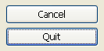
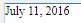

## デフォルトボタン

フォーム上のボタンのいずれにも [フォーカス可](properties_Entry.md#focusable) プロパティが設定されていない場合、デフォルトボタンプロパティが有効化されたボタンがランタイムにおいて最初のフォーカスを得ます。

デフォルトボタンは、フォームページごとに一つのみ設定できます。

macOS上では、デフォルトボタンプロパティによってボタンの見た目が変更され、推奨されている選択肢であることをユーザーに対して示し、フォーカスがなくても、自動的に **Enter** キーに関連付けられます。 デフォルトボタンとフォーカスされているボタンは同一である必要はありません。 macOSにおけるデフォルトボタンは特徴的な青い外観を持ちます:

> このデフォルトボタンとしての外観を得るには、ボタンの高さが 22以下に設定されている必要があります。

Windows上では "推奨選択肢" の概念はサポートされていないため、フォーカスされているボタンのみがランタイムにおいて異なる外観を持ち、**Enter** キーはフォーカスされたボタンに関連付けられます。 4D フォームエディター上ではデフォルトボタンは青い枠線で表されます:

#### JSON 文法

| 名称            | データタイプ  | とりうる値       |
| ------------- | ------- | ----------- |
| defaultButton | boolean | true, false |

#### 対象オブジェクト

[通常ボタン](button_overview.md#通常) - [フラットボタン](button_overview.md#フラット)

---

## フォーカスの四角を隠す

ランタイムにおいて、タブキーやシングルクリックによってフォーカスを得たフィールドや入力可能なエリアは、選択状態を示す四角で縁取りされます。 このプロパティを使用して、フォーカスの四角を非表示にできます。 特定のインターフェースにおいては、フォーカスの四角を非表示にすることが便利かもしれません。

#### JSON 文法

| 名称            | データタイプ  | とりうる値       |
| ------------- | ------- | ----------- |
| hideFocusRing | boolean | true, false |

#### 対象オブジェクト

[4D Write Pro エリア](writeProArea_overview.md)* [階層リスト](list_overview.md)
* [入力](input_overview.md)
* [リストボックス](listbox_overview.md)
* [サブフォーム](subform_overview.md)

---

## セレクションハイライトを非表示

`セレクション型リストボックス`

リストボックスのセレクションハイライトを非表示にします。

このオプションが有効化されていると、リストボックスにおける行選択を可視化するセレクションハイライトが非表示になります。 ハイライトが非表示になっていても選択行は引き続き機能的に有効です。しかしながら、画面上では選択状態が明示されなくなるため、[プログラムによって選択行を可視化](listbox_overview.md#選択行の見た目のカスタマイズ) する必要があります。

デフォルトでは、このオプションは有効化されていません。

#### JSON 文法

| 名称                  | データタイプ  | とりうる値       |
| ------------------- | ------- | ----------- |
| hideSystemHighlight | boolean | true, false |

#### 対象オブジェクト

[リストボックス](listbox_overview.md)

---

## 横スクロールバー

表示エリアを左右に移動できるようにするインターフェースツールです。

使用可能な値:

| プロパティリスト | JSON 値      | 説明                                                                      |
| -------- | ----------- | ----------------------------------------------------------------------- |
| あり       | "visible"   | スクロールバーは必要のない場合でも常に表示されます。つまり、オブジェクトのコンテンツのサイズがフレームのサイズより小さい場合でも表示されます。 |
| なし       | "hidden"    | スクロールバーは表示されません。                                                        |
| 自動       | "automatic" | スクロールバーは必要なときに表示されます。つまり、オブジェクトのコンテンツのサイズがフレームのサイズより大きい場合には表示されます。      |

> ピクチャー型のオブジェクトは、表示フォーマットが "トランケート (中央合わせなし)" に設定されているときに、スクロールバーを持つことができます。

#### JSON 文法

| 名称                  | データタイプ | とりうる値                            |
| ------------------- | ------ | -------------------------------- |
| scrollbarHorizontal | テキスト   | "visible", "hidden", "automatic" |

#### 対象オブジェクト

[階層リスト](list_overview.md)* [サブフォーム](subform_overview.md)
* [リストボックス](listbox_overview.md)
* [入力](input_overview.md)
* [4D Write Pro エリア](writeProArea_overview.md)

#### 参照

[縦スクロールバー](#縦スクロールバー)

---

## 解像度

4D Write Pro エリアの画面解像度を設定します。 デフォルト値は 72dpi (macOS) で、これはすべてのプラットフォームにおける 4Dフォームの標準解像度です。 96dpi に指定すると、Windows/Web レンダリングを macOS および Windows の両プラットフォームに設定します。 この項目を **自動** に設定すると、macOS と Windows 間でドキュメントのレンダリングが異なることになります。

#### JSON 文法

| 名称  | データタイプ | とりうる値          |
| --- | ------ | -------------- |
| dpi | number | 0 = 自動, 72, 96 |

#### 対象オブジェクト

[4D Write Pro エリア](writeProArea_overview.md)

---

## 背景を表示

ページの背景画像および背景色を表示/非表示にします。

#### JSON 文法

| 名称             | データタイプ  | とりうる値                                  |
| -------------- | ------- | -------------------------------------- |
| showBackground | boolean | true (デフォルト), false |

#### 対象オブジェクト

[4D Write Pro エリア](writeProArea_overview.md)

---

## フッター表示

[ビューモード](#ビューモード) が "ページ" に設定されている場合に、ページのフッターを表示/非表示にします。

#### JSON 文法

| 名称          | データタイプ  | とりうる値                                  |
| ----------- | ------- | -------------------------------------- |
| showFooters | boolean | true (デフォルト), false |

#### 対象オブジェクト

[4D Write Pro エリア](writeProArea_overview.md)

---

## フォーミュラバーを表示

有効化すると、4D View Pro エリアにおいてツールバーのすぐ下にフォーミュラバーが表示されます。 選択されていない場合、フォーミュラバーは非表示となります。

> このプロパティは [ツールバー](#ユーザーインターフェース) インターフェースの場合に利用可能です。

#### JSON 文法

| 名称             | データタイプ  | とりうる値                                  |
| -------------- | ------- | -------------------------------------- |
| withFormulaBar | boolean | true (デフォルト), false |

#### 対象オブジェクト

[4D View Pro エリア](viewProArea_overview.md)

---

## ヘッダーを表示

[ビューモード](#ビューモード) が "ページ" に設定されている場合に、ページのヘッダーを表示/非表示にします。

#### JSON 文法

| 名称          | データタイプ  | とりうる値                                  |
| ----------- | ------- | -------------------------------------- |
| showHeaders | boolean | true (デフォルト), false |

#### 対象オブジェクト

[4D Write Pro エリア](writeProArea_overview.md)

---

## 非表示文字を表示

非表示の文字を表示/非表示にします。

#### JSON 文法

| 名称              | データタイプ  | とりうる値                                  |
| --------------- | ------- | -------------------------------------- |
| showHiddenChars | boolean | true (デフォルト), false |

#### 対象オブジェクト

[4D Write Pro エリア](writeProArea_overview.md)

---

## 水平ルーラーを表示

ドキュメントビューが [ページモード](#ビューモード) の場合に、水平ルーラーを表示/非表示にします。

#### JSON 文法

| 名称                  | データタイプ  | とりうる値                                  |
| ------------------- | ------- | -------------------------------------- |
| showHorizontalRuler | boolean | true (デフォルト), false |

#### 対象オブジェクト

[4D Write Pro エリア](writeProArea_overview.md)

---

## HTML WYSYWIG 表示

HTML WYSIWYG ビューを有効/無効にします。このビューでは、すべてのブラウザーに対応していない 4D Write Pro の属性が取り除かれます。

#### JSON 文法

| 名称              | データタイプ  | とりうる値                                  |
| --------------- | ------- | -------------------------------------- |
| showHTMLWysiwyg | boolean | true, false (デフォルト) |

#### 対象オブジェクト

[4D Write Pro エリア](writeProArea_overview.md)

---

## ページフレームを表示

[ビューモード](#ビューモード) が "ページ" に設定されている場合に、ページのフレームを表示/非表示にします。

#### JSON 文法

| 名称             | データタイプ  | とりうる値       |
| -------------- | ------- | ----------- |
| showPageFrames | boolean | true, false |

#### 対象オブジェクト

[4D Write Pro エリア](writeProArea_overview.md)

---

## 参照を表示

ドキュメントに *参照* として挿入された 4D式をすべて表示します。 このオプションが無効になっていると、4D Write Pro は挿入された 4D式をカレント値で評価して、その*値* を表示します。 4Dフィールドまたは式を挿入すると、4D Write Pro はデフォルトでそのカレント値を表示します。 もとのフィールドや式を確認したいときには、このオプションを有効にします。 すると、これらの参照は灰色の背景色とともにドキュメント内に表示されます。

たとえば、フォーマットを指定したカレント日付を挿入していると、デフォルトでは次の表示になります:

参照を表示オプションを有効にすると、代わりにもとの参照が表示されます:

> 4D 式を挿入するには、`ST INSERT EXPRESSION` コマンドを使います。

#### JSON 文法

| 名称             | データタイプ  | とりうる値                                  |
| -------------- | ------- | -------------------------------------- |
| showReferences | boolean | true, false (デフォルト) |

#### 対象オブジェクト

[4D Write Pro エリア](writeProArea_overview.md)

---

## 垂直ルーラーを表示

ドキュメントビューが [ページモード](#ビューモード) の場合に、垂直ルーラーを表示/非表示にします。

#### JSON 文法

| 名称                | データタイプ  | とりうる値                                  |
| ----------------- | ------- | -------------------------------------- |
| showVerticalRuler | boolean | true (デフォルト), false |

#### 対象オブジェクト

[4D Write Pro エリア](writeProArea_overview.md)

---

## タブコントロールの位置

フォーム上のタブコントロールの位置を指定することができます。 このプロパティにはすべてのプラットフォームからアクセスできますが、macOS 上でのみ動作します。 タブコントロールは上 (標準)、または下に配置することができます。

位置がカスタマイズされたタブコントロールを Windows で表示すると、自動的に標準の位置 (上) に戻されます。

#### JSON 文法

| 名称              | データタイプ  | とりうる値           |
| --------------- | ------- | --------------- |
| labelsPlacement | boolean | "top", "bottom" |

#### 対象オブジェクト

[タブコントロール](tabControl.md)

---

## ユーザーインターフェース

4D View Pro エリアにインターフェースを追加することで、エンドユーザーが基本的な編集とデータ操作をおこなえるようになります。 4D では 2種類のインターフェース (**リボン** と **ツールバー**) を提供しており、そのどちらかを選ぶことができます。

#### JSON 文法

| 名称            | データタイプ | とりうる値                                                  |
| ------------- | ------ | ------------------------------------------------------ |
| userInterface | テキスト   | "none" (デフォルト), "ribbon", "toolbar" |

#### 対象オブジェクト

[4D View Pro エリア](viewProArea_overview.md)

#### 参照

[4D View Pro リファレンスガイド](../ViewPro/getting-started.md)

---

## 縦スクロールバー

表示エリアを上下に移動できるようにするインターフェースツールです。

使用可能な値:

| プロパティリスト | JSON 値      | 説明                                                                      |
| -------- | ----------- | ----------------------------------------------------------------------- |
| あり       | "visible"   | スクロールバーは必要のない場合でも常に表示されます。つまり、オブジェクトのコンテンツのサイズがフレームのサイズより小さい場合でも表示されます。 |
| なし       | "hidden"    | スクロールバーは表示されません。                                                        |
| 自動       | "automatic" | スクロールバーは必要なときに表示されます。つまり、オブジェクトのコンテンツのサイズがフレームのサイズより大きい場合には表示されます。      |

> ピクチャー型のオブジェクトは、表示フォーマットが "トランケート (中央合わせなし)" に設定されているときに、スクロールバーを持つことができます。

> テキスト入力オブジェクトにスクロールバーがない場合、矢印キーを使用してスクロールできます。

#### JSON 文法

| 名称                | データタイプ | とりうる値                            |
| ----------------- | ------ | -------------------------------- |
| scrollbarVertical | テキスト   | "visible", "hidden", "automatic" |

#### 対象オブジェクト

[階層リスト](list_overview.md)* [サブフォーム](subform_overview.md)
* [リストボックス](listbox_overview.md)
* [入力](input_overview.md)
* [4D Write Pro エリア](writeProArea_overview.md)

#### 参照

[横スクロールバー](#横スクロールバー)

---

## ビューモード

フォームエリア内の 4D Write Pro ドキュメントの表示モードを設定します。 次の値が提供されています:

- **ページ**: もっとも完全といえるビューモードで、ページの枠、余白、改ページ、ヘッダー & フッターなどを含みます。
- **下書き**: 基本のドキュメントプロパティを含む下書きモードです。
- **埋め込み**: 埋め込みエリアに適切なビューモードです。余白や、ヘッダー & フッター、ページフレームなどは表示されません。 このモードは Web に似た出力をするのに使用することもできます (この場合には、[解像度を 96dpi](#解像度) に設定のうえ、[HTML WYSIWYG 表示](#html-wysiwyg-表示) オプションを有効にします)。

> ビューモードプロパティは画面上のレンダリングにのみ使用されます。 印刷設定については、専用のレンダリングルールが自動的に適用されます。

#### JSON 文法

| 名称         | データタイプ | とりうる値                       |
| ---------- | ------ | --------------------------- |
| layoutMode | テキスト   | "page", "draft", "embedded" |

#### 対象オブジェクト

[4D Write Pro エリア](writeProArea_overview.md)

---

## 拡大

4D Write Pro エリアのコンテンツ表示に使用するズーム率を設定します。

#### JSON 文法

| 名称   | データタイプ | とりうる値       |
| ---- | ------ | ----------- |
| zoom | number | minimum = 0 |

#### 対象オブジェクト

[4D Write Pro エリア](writeProArea_overview.md)
