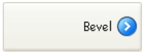
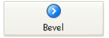
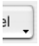

## 背景パス名

オブジェクトの背景として使用するピクチャーのパスを指定します。 [複数の状態](#状態の数) を持つ [アイコン](#ピクチャーパス名) を持つオブジェクトの場合、背景ピクチャーにも同じ状態の数が適用されます。

パス名は、[スタティックピクチャーのパス名プロパティ](properties_Picture.md#パス名) と同じように指定します。

#### JSON 文法

| 名称                      | データタイプ | とりうる値                                                       |
| ----------------------- | ------ | ----------------------------------------------------------- |
| customBackgroundPicture | string | POSIX シンタックスの相対パス。 style プロパティの "custom" オプションと併用する必要があります。 |

#### 対象オブジェクト

[カスタムボタン](button_overview.md#カスタム) - [カスタムチェックボックス](checkbox_overview.md#カスタム) - [カスタムラジオボタン](radio_overview.md#カスタム)

---

## ボタンスタイル

ボタンの外観を設定します。 スタイルによっては、特定のオプションが利用できなくなることもあります。

#### JSON 文法

|   名称  | データタイプ | とりうる値                                                                                                                                                              |
| :---: | :----: | ------------------------------------------------------------------------------------------------------------------------------------------------------------------ |
| style |  text  | "regular", "flat", "toolbar", "bevel", "roundedBevel", "gradientBevel", "texturedBevel", "office", "help", "circular", "disclosure", "roundedDisclosure", "custom" |

#### 対象オブジェクト

[ボタン](button_overview.md) - [ラジオボタン](radio_overview.md) - [チェックボックス](checkbox_overview.md)

---

## 横方向マージン

ボタン内側の横方向のマージンサイズ (ピクセル単位) を指定します。 マージンにより、ボタンアイコンとタイトルの領域を制限します。

背景ピクチャーに境界が含まれるような場合に、このパラメーターを利用します:

| マージン指定       | 例題                                                           |
| ------------ | ------------------------------------------------------------ |
| マージンなし       |  |
| 13 ピクセルのマージン |  |

> このプロパティは [縦方向マージン](#縦方向マージン) プロパティとの組み合わせで機能します。

#### JSON 文法

| 名称            | データタイプ | とりうる値                                   |
| ------------- | ------ | --------------------------------------- |
| customBorderX | number | "カスタム" スタイルで利用可。 最小値: 0 |

#### 対象オブジェクト

[カスタムボタン](button_overview.md#カスタム) - [カスタムチェックボックス](checkbox_overview.md#カスタム) - [カスタムラジオボタン](radio_overview.md#カスタム)

---

## アイコンの場所

フォームオブジェクトに対するアイコンの配置を指定します。

#### JSON 文法

| 名称            | データタイプ | とりうる値                   |
| ------------- | ------ | ----------------------- |
| iconPlacement | string | "none", "left", "right" |

#### 対象オブジェクト

[リストボックスヘッダー](listbox_overview.md#リストボックスヘッダー)

---

## アイコンオフセット

ボタンクリック時のオフセット値をピクセル単位で指定します。

このプロパティを使用すると、指定したピクセル数だけボタンタイトルが右下へシフトされます。 この機能により、ボタンのクリック時に独自の3D 効果を適用することができます。

#### JSON 文法

| 名称           | データタイプ | とりうる値                  |
| ------------ | ------ | ---------------------- |
| customOffset | number | 最小値: 0 |

#### 対象オブジェクト

[カスタムボタン](button_overview.md#カスタム) - [カスタムチェックボックス](checkbox_overview.md#カスタム) - [カスタムラジオボタン](radio_overview.md#カスタム)

---

## 状態の数

このプロパティは [ボタン](button_overview.md)、[チェックボックス](checkbox_overview.md)、[ラジオボタン](radio_overview.md) のアイコンとして使用されるピクチャーに含まれる状態の数を指定します。

ピクチャーには 2～6 の状態を含めることができます。

- 2つの状態: false、true
- 3つの状態: false、true、ロールオーバー
- 4つの状態: false、true、ロールオーバー、無効
- 5つの状態 (チェックボックスとラジオボタンのみ): false、true、false時ロールオーバー, true時ロールオーバー、無効
- 6つの状態 (チェックボックスとラジオボタンのみ): false、true、false時ロールオーバー, true時ロールオーバー、false時無効、true時無効

:::note

- "false" とは "ボタン未クリック / 未選択"、あるいは "チェックボックス未選択" という意味です (変数値=0)
- "true" とは "ボタンクリック / 選択" あるいは "チェックボックス選択" という意味です (変数値=1)

:::

一つの状態につき、一つの画像を割り当てます。 ソースピクチャーでは、状態を表すアイコンは縦に並んでいなければなりません:

#### JSON 文法

| 名称         | データタイプ | とりうる値                                     |
| ---------- | ------ | ----------------------------------------- |
| iconFrames | number | ソースピクチャーに含まれる状態の数。 最小値: 1 |

#### 対象オブジェクト

[ボタン](button_overview.md) ([ヘルプ](button_overview.md#ヘルプ)ボタンを除く) - [チェックボックス](checkbox_overview.md) - [ラジオボタン](radio_overview.md)

---

## ピクチャーパス名

オブジェクトのアイコンに使用するピクチャーのパスを指定します。

パス名は、[スタティックピクチャーのパス名プロパティ](properties_Picture.md#パス名) と同じように指定します。

> アクティブオブジェクトのアイコンとして使う場合、[状態の数](#状態の数) 変数に対応するよう、デザインされている必要があります。

#### JSON 文法

| 名称   | データタイプ  | とりうる値                           |
| ---- | ------- | ------------------------------- |
| icon | picture | POSIX シンタックスの相対パス、またはファイルシステムパス |

#### 対象オブジェクト

[ボタン](button_overview.md) ([ヘルプ](button_overview.md#ヘルプ)ボタンを除く) - [チェックボックス](checkbox_overview.md) - [リストボックスヘッダー](listbox_overview.md#リストボックスヘッダー) - [ラジオボタン](radio_overview.md)

---

## タイトル/ピクチャー位置

このプロパティはアイコンに対するボタンタイトルの相対的な位置を指定します。 ボタン内に、タイトルのみ (関連ピクチャーなし)、またはピクチャーのみ (タイトルなし) が含まれている場合、このプロパティは効果ありません。 デフォルトでは、ピクチャーの下部にタイトルが置かれます。

このプロパティの各種オプションの結果を次に示します:

| オプション  | 説明                                                        | 例題                                                                |
| ------ | --------------------------------------------------------- | ----------------------------------------------------------------- |
| **左**  | テキストはアイコンの左に置かれます。 ボタンの内容は右揃えされます。                        |   |
| **上**  | テキストはアイコンの上に置かれます。 ボタンの内容は中央揃えされます。                       |       |
| **右**  | テキストはアイコンの右に置かれます。 ボタンの内容は左揃えされます。                        |     |
| **下**  | テキストはアイコンの下に置かれます。 ボタンの内容は中央揃えされます。                       |    |
| **中央** | アイコンのテキストはボタン内で縦と横に中央揃えされます。 テキストをアイコンの中に組み込むような場合に利用します。 |  |

#### JSON 文法

| 名称            | データタイプ | とりうる値                                      |
| ------------- | ------ | ------------------------------------------ |
| textPlacement | string | "left", "top", "right", "bottom", "center" |

#### 対象オブジェクト

[ボタン](button_overview.md) ([ヘルプ](button_overview.md#ヘルプ)ボタンを除く) - [チェックボックス](checkbox_overview.md) - [ラジオボタン](radio_overview.md)

---

## タイトルと画像を隣接させる

このプロパティは、[タイトル/ピクチャー位置](properties_TextAndPicture.md#タイトルピクチャー位置) と [横揃え](properties_Text.md#横揃え) プロパティを考慮しながら、ボタンのタイトルと画像を隣接して表示するか、あるいは分離するかを定義します。

ボタン内に、タイトルのみ (関連ピクチャーなし)、またはピクチャーのみ (タイトルなし) が含まれている場合、このプロパティは効果ありません。

ボタンがタイトルと画像を持つ場合、デフォルトでは、それらは隣接して表示されます。 次の図は、様々な配置における `imageHugsTitle` プロパティ (有効な場合は true) の効果を示したものです:

#### JSON 文法

| 名称             | データタイプ  | とりうる値                                  |
| -------------- | ------- | -------------------------------------- |
| imageHugsTitle | boolean | true (デフォルト), false |

#### 対象オブジェクト

[ボタン](button_overview.md) (ヘルプ以外のスタイル) - [チェックボックス](checkbox_overview.md) (通常、フラット、開示ボタン、折りたたみ/展開以外のスタイル) - [ラジオボタン](radio_overview.md) (通常、フラット、開示ボタン、折りたたみ/展開以外のスタイル)

---

## 縦方向マージン

ボタン内側の縦方向のマージンサイズ (ピクセル単位) を指定します。 マージンにより、ボタンアイコンとタイトルの領域を制限します。

背景ピクチャーに境界が含まれるような場合に、このパラメーターを利用します。

> このプロパティは [横方向マージン](#横方向マージン) プロパティとの組み合わせで機能します。

#### JSON 文法

| 名称            | データタイプ | とりうる値                                   |
| ------------- | ------ | --------------------------------------- |
| customBorderY | number | "カスタム" スタイルで利用可。 最小値: 0 |

#### 対象オブジェクト

[カスタムボタン](button_overview.md#カスタム) - [カスタムチェックボックス](checkbox_overview.md#カスタム) - [カスタムラジオボタン](radio_overview.md#カスタム)

---

## ポップアップメニューあり

このプロパティを使用すると、ボタン内に逆三角形として表われるシンボルを表示することができます。このシンボルは、ポップアップメニューが付属することを示します:

このシンボルの外観と位置は、ボタンスタイルとプラットフォームによって変わります。

### リンクと分離

ポップアップメニューシンボルをボタンに付加する際に、リンクと分離という2つのオプションから選択することができます:

|                           リンク                           |                             分離                             |
| :-----------------------------------------------------: | :--------------------------------------------------------: |
|  |  |

> 実際に "分離" モードを利用できるかどうかは、ボタンスタイルとプラットフォームによって決まります。

それぞれのオプションにより、ボタンとポップアップメニューとの関係が指定されます:

- ポップアップメニューが **分離** している場合、ボタンの左部分をクリックするとボタンのカレントアクションが直接実行されます。このアクションは、ボタンの右側からアクセスできるポップアップメニューを使用して変更することができます。
- ポップアップメニューが **リンク** している場合、ボタンをクリックしてもポップアップメニューが表示されるだけです。 このポップアップメニュー上のアクションを選択しないと、実行はおこなわれません。

:::info

この場合のイベントの扱いについての詳細は、[`On Alternative Click` イベントの説明](../Events/onAlternativeClick.md) を参照ください。

:::

### ポップアップメニューの管理

"ポップアップメニューあり" プロパティは、ボタンのグラフィック面だけを管理するという点に注意が必要です。 ポップアップメニューとその値の表示は、すべて開発者が処理しなくてはなりません。具体的にはフォームイベントや [`Dynamic pop up menu`](https://doc.4d.com/4dv19R7/help/command/ja/page1006.html)、[`Pop up menu`](https://doc.4d.com/4dv19R7/help/command/ja/page542.html) コマンドを使用してこれを処理します。

#### JSON 文法

| 名称             | データタイプ | とりうる値                                                |
| :------------- | ------ | ---------------------------------------------------- |
| popupPlacement | string | <li>"none"</li><li>"linked"</li><li>"separated"</li> |

#### 対象オブジェクト

[Toolbar Button](button_overview.md#toolbar) - [Bevel Button](button_overview.md#bevel) - [Rounded Bevel Button](button_overview.md#rounded-bevel) - [OS X Gradient Button](button_overview.md#os-x-gradient) - [OS X Textured Button](button_overview.md#os-x-textured) - [Office XP Button](button_overview.md#office-xp) - [Circle Button](button_overview.md#circle) - [Custom](button_overview.md#custom)
