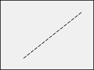

図形は、4D フォームに設置することのできる [スタティックオブジェクト](formObjects_overview.md#アクティブオブジェクトとスタティックオブジェクト) です。

次の基本の図形が提供されています:

- 四角
- 線
- 楕円

## 四角

フォーム上に四角を配置することで、視覚的な効果が得られます。 四角で描画できるのは長方形に限られます。

四角のグラフィック属性 (線カラー、線幅、点線タイプ等) やリサイズオプションはプロパティリストにて指定できます。 角の [丸み](properties_CoordinatesAndSizing.md#角の半径) を指定することもできます。


#### JSON 例:

```4d
"myRectangle": {
        "type": "rectangle",    // オブジェクトタイプ
        "left": 60,             // フォーム上の座標 (左)
        "top": 160,             // フォーム上の座標 (上)
        "width": 100,           // 幅
        "height": 20,           // 高さ
        "borderRadius": 20      // 角の半径 (丸み)
                }
```

#### プロパティ一覧

[タイプ](properties_Object.md#タイプ) -
[オブジェクト名](properties_Object.md#オブジェクト名) -
[CSSクラス](properties_Object.md#cssクラス) -
[左](properties_CoordinatesAndSizing.md#左) -
[上](properties_CoordinatesAndSizing.md#上) -
[右](properties_CoordinatesAndSizing.md#右) -
[下](properties_CoordinatesAndSizing.md#下) -
[幅](properties_CoordinatesAndSizing.md#幅) -
[高さ](properties_CoordinatesAndSizing.md#高さ) -
[角の半径](properties_CoordinatesAndSizing.md#角の半径) -
[表示状態](properties_Display.md#表示状態) -
[縦方向サイズ変更](properties_ResizingOptions.md#縦方向サイズ変更) -
[表示状態](properties_Display.md#表示状態) -
[塗りカラー](properties_BackgroundAndBorder.md#背景色塗りカラー) -
[線カラー](properties_BackgroundAndBorder.md#線カラー) -
[線幅](properties_BackgroundAndBorder.md#線幅) -
[点線タイプ](properties_BackgroundAndBorder.md#点線タイプ)

## 線

フォーム上に線を配置することで、視覚的な効果が得られます。 線は水平、垂直のほか、あらゆる角度で描画することができます。

線のグラフィック属性 (線カラー、線幅、点線タイプ等) やリサイズオプションはプロパティリストにて指定できます。

### startPoint プロパティ

`startPoint` JSON プロパティは、線の始点を定義します (JSON例参照)。

> フォームエディター上では線の始点があきらかなため、プロパティリストにおいて `startPoint` プロパティは非表示です。

#### JSON 例:

```
	"myLine": {
		"type": "line",	               
		"left": 20,
		"top": 40,
		"width": 100,
		"height": 80,
		"startPoint": "topLeft",  // 第一の方向
		"strokeDashArray": "6 2" // 破線
		}
```

結果:


```
	"myLine": {
		"type": "line",	               
		"left": 20,
		"top": 40,
		"width": 100,
		"height": 80,
		"startPoint": "bottomLeft", // 第二の方向
		"strokeDashArray": "6 2" // 破線
  }
		}
```

結果:


#### プロパティ一覧

[表示状態](properties_Display.md#表示状態) -
[タイプ](properties_Object.md#タイプ) -
[オブジェクト名](properties_Object.md#オブジェクト名) -
[CSSクラス](properties_Object.md#cssクラス) -
[左](properties_CoordinatesAndSizing.md#左) -
[上](properties_CoordinatesAndSizing.md#上) -
[右](properties_CoordinatesAndSizing.md#右) -
[下](properties_CoordinatesAndSizing.md#下) -
[幅](properties_CoordinatesAndSizing.md#幅) -
[高さ](properties_CoordinatesAndSizing.md#高さ) -
[横方向サイズ変更](properties_ResizingOptions.md#横方向サイズ変更) -
[縦方向サイズ変更](properties_ResizingOptions.md#縦方向サイズ変更) -
[表示状態](properties_Display.md#表示状態) -
[線カラー](properties_BackgroundAndBorder.md#線カラー) -
[線幅](properties_BackgroundAndBorder.md#線幅) -
[点線タイプ](properties_BackgroundAndBorder.md#点線タイプ)

## 楕円

フォーム上に楕円を配置することで、視覚的な効果が得られます。 楕円を使って円を描くことができます ([幅](properties_CoordinatesAndSizing.md#幅) と [高さ](properties_CoordinatesAndSizing.md#高さ) を同じ値に設定します)。


#### JSON 例:

```4d
"myOval": {
        "type": "oval",     // オブジェクトタイプ
        "left": 60,         // フォーム上の座標 (左)
        "top": 160,         // フォーム上の座標 (上)
        "width": 100,       // 幅
        "height": 20,       // 高さ
        "fill": "blue"      // 塗りカラー
                }
```

#### プロパティ一覧

[タイプ](properties_Object.md#タイプ) -
[オブジェクト名](properties_Object.md#オブジェクト名) -
[CSSクラス](properties_Object.md#cssクラス) -
[左](properties_CoordinatesAndSizing.md#左) -
[上](properties_CoordinatesAndSizing.md#上) -
[右](properties_CoordinatesAndSizing.md#右) -
[表示状態](properties_Display.md#表示状態) -
[幅](properties_CoordinatesAndSizing.md#幅) -
[高さ](properties_CoordinatesAndSizing.md#高さ) -
[横方向サイズ変更](properties_ResizingOptions.md#横方向サイズ変更) -
[縦方向サイズ変更](properties_ResizingOptions.md#縦方向サイズ変更) -
[表示状態](properties_Display.md#表示状態) -
[塗りカラー](properties_BackgroundAndBorder.md#背景色塗りカラー) -
[線カラー](properties_BackgroundAndBorder.md#線カラー) -
[線幅](properties_BackgroundAndBorder.md#線幅) -
[点線タイプ](properties_BackgroundAndBorder.md#点線タイプ)
